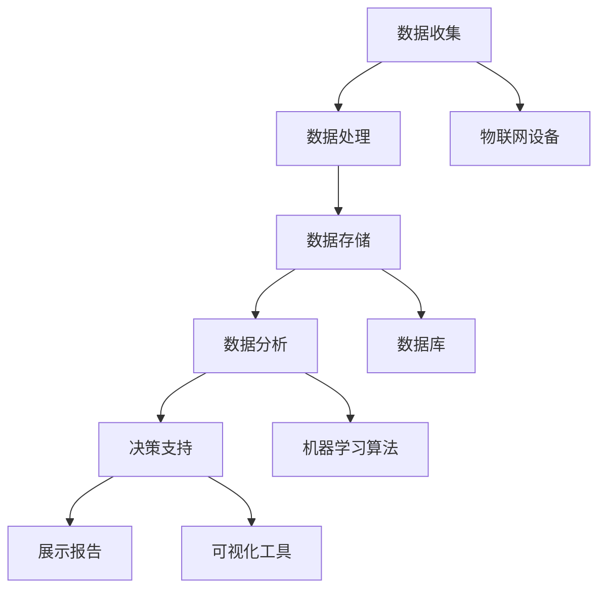

                 


### 文章标题

《人工智能在水资源管理中的应用:优化利用与保护》

### 关键词

水资源管理、人工智能、优化利用、保护、机器学习、深度学习、强化学习、数学模型

### 摘要

本文详细探讨了人工智能在水资源管理中的应用，包括优化利用与保护两个方面。通过分析水资源管理的基本概念、重要性以及面临的挑战与机遇，本文介绍了人工智能的基本概念、分类及其在水资源管理中的应用前景。随后，本文重点讲解了机器学习、深度学习和强化学习等核心算法原理，并使用Python源代码和LaTeX公式进行详细阐述。此外，本文还设计了一系列实际项目案例，展示了人工智能在水资源管理中的应用效果，并提出了最佳实践建议和小结。

## 目录大纲设计过程

为了设计一本关于《人工智能在水资源管理中的应用:优化利用与保护》的详细且逻辑清晰的目录大纲，我们将遵循以下步骤：

1. **确定核心章节**：首先，明确书籍的核心内容。考虑到水资源管理是一个复杂的领域，需要涵盖的理论和实践知识较多，因此核心章节应该包括水资源管理概述、人工智能概述、核心算法原理讲解、数学模型与公式讲解、项目实战等内容。

2. **设计章节结构**：基于核心内容，构建每个章节的结构。每个章节可以分为概述、原理、应用和实战四个部分，以帮助读者逐步了解并掌握相关知识点。

3. **细化章节内容**：在确保核心章节内容完整性的同时，考虑章节内部的细化和扩展。例如，对于核心算法原理讲解部分，可以详细阐述相关算法的原理，并使用Python源代码进行说明。

4. **整合数学模型和公式**：在章节中穿插数学模型和公式的讲解，使用LaTeX格式确保格式的规范性和易读性。

5. **设计项目实战**：为每个章节设计实际的项目案例，展示如何在实际应用中运用所学知识，并提供详细的代码实现和解读。

6. **整合和调整**：在完成每个章节的设计后，进行整体的整合和调整，确保目录大纲的逻辑性和连贯性。

7. **最终输出**：将所有设计内容以Markdown格式输出，确保简洁性和可读性。

现在，让我们开始具体设计《人工智能在水资源管理中的应用:优化利用与保护》的目录大纲。首先，我们需要列出核心章节，并为每个章节设定一个基本结构。

### 第一部分：水资源管理与AI概述

#### 第1章：水资源管理概述

##### 1.1 水资源管理的基本概念

##### 1.2 水资源管理的重要性

##### 1.3 水资源管理的挑战与机遇

#### 第2章：人工智能概述

##### 2.1 人工智能的基本概念

##### 2.2 人工智能的分类

##### 2.3 人工智能在水资源管理中的应用前景

### 第二部分：核心算法原理讲解

#### 第3章：机器学习算法在水资源管理中的应用

##### 3.1 监督学习算法

##### 3.2 无监督学习算法

##### 3.3 半监督学习算法

#### 第4章：深度学习算法在水资源管理中的应用

##### 4.1 深度神经网络

##### 4.2 卷积神经网络（CNN）

##### 4.3 循环神经网络（RNN）

#### 第5章：强化学习算法在水资源管理中的应用

##### 5.1 强化学习的基本概念

##### 5.2 强化学习算法

##### 5.3 强化学习在水文预报中的应用

### 第三部分：数学模型与公式讲解

#### 第6章：水资源管理中的数学模型

##### 6.1 水文学基本方程

##### 6.2 水资源供需平衡模型

##### 6.3 水质模型

#### 第7章：机器学习中的数学模型

##### 7.1 概率论与统计学基础

##### 7.2 优化算法

##### 7.3 模型评估与选择

### 第四部分：项目实战

#### 第8章：水资源优化利用项目

##### 8.1 项目背景与目标

##### 8.2 数据收集与处理

##### 8.3 模型选择与训练

##### 8.4 模型评估与优化

#### 第9章：水资源保护项目

##### 9.1 项目背景与目标

##### 9.2 数据收集与处理

##### 9.3 模型选择与训练

##### 9.4 模型评估与优化

#### 第10章：综合案例分析

##### 10.1 案例背景

##### 10.2 案例分析与解决

##### 10.3 案例总结与启示

### 总结与展望

#### 第11章：总结与展望

##### 11.1 文章主要内容回顾

##### 11.2 最佳实践建议

##### 11.3 未来发展趋势

## 文章正文结构

在明确了目录大纲后，我们将按照以下结构撰写文章正文：

1. **引言**：介绍水资源管理的重要性，引出人工智能在水资源管理中的应用。

2. **第一部分：水资源管理与AI概述**
   - **第1章：水资源管理概述**：阐述水资源管理的基本概念、重要性和挑战与机遇。
   - **第2章：人工智能概述**：介绍人工智能的基本概念、分类和水资源管理中的应用前景。

3. **第二部分：核心算法原理讲解**
   - **第3章至第5章**：详细讲解机器学习、深度学习和强化学习等核心算法原理。

4. **第三部分：数学模型与公式讲解**
   - **第6章至第7章**：介绍水资源管理中的数学模型和机器学习中的数学模型。

5. **第四部分：项目实战**
   - **第8章至第9章**：设计水资源优化利用项目和水资源保护项目，展示实际应用案例。

6. **第五部分：综合案例分析**
   - **第10章**：分析一个综合案例，总结案例中的关键问题和解决方法。

7. **总结与展望**
   - **第11章**：总结文章主要内容，提出最佳实践建议和未来发展趋势。

通过这样的结构，我们能够确保文章内容逻辑清晰、层次分明，使读者能够系统地理解和掌握人工智能在水资源管理中的应用。

## 水资源管理概述

水资源是人类生存和发展的重要基础，但在全球范围内，水资源的短缺和管理问题日益严峻。水资源管理涉及到水资源的开发、利用、保护、调配和治理等一系列活动，旨在确保水资源的可持续利用，同时满足经济、社会和生态的需求。

### 1.1 水资源管理的基本概念

水资源管理可以定义为一系列政策和措施，旨在合理分配和利用水资源，同时保护水资源系统，以维持其生态功能和可持续性。这包括以下几个方面：

- **水资源开发**：包括水资源的勘探、开发和利用，以满足供水、灌溉、能源生产和工业需求。
- **水资源利用**：涉及农业、工业和城市生活用水的分配和管理。
- **水资源保护**：包括防止水资源污染、保护水生态系统和维持水资源的自然循环。
- **水资源调配**：通过水库、调水工程等措施，合理调配水资源，以满足不同地区和不同季节的需求。
- **水资源治理**：涉及水资源的管理体制、法律法规、政策制定和执行。

### 1.2 水资源管理的重要性

水资源管理的重要性体现在以下几个方面：

- **保障人类生存**：水是人类生存的基本需求，合理管理水资源对于保障人类的基本生活条件至关重要。
- **促进经济发展**：水资源是农业、工业和服务业的重要生产要素，有效管理水资源能够促进经济的可持续发展。
- **维护生态环境**：水资源是生态系统的重要组成部分，保护水资源对于维护生态平衡和生物多样性至关重要。
- **应对气候变化**：水资源管理在应对气候变化方面起着重要作用，通过科学调配和管理水资源，可以减少水资源的浪费和污染，降低洪涝灾害和干旱风险。

### 1.3 水资源管理的挑战与机遇

尽管水资源管理的重要性日益突出，但在实际操作中仍面临诸多挑战：

- **水资源短缺**：全球许多地区面临水资源短缺问题，特别是人口增长、城市化进程和气候变化等因素加剧了这一问题的严重性。
- **水资源污染**：工业废水、农业化肥和城市污水等污染源对水资源造成了严重污染，影响了水资源的质量和可用性。
- **水资源分配不均**：全球和地区内部的水资源分配不均衡，一些地区水资源丰富，而另一些地区则面临严重的水资源短缺。
- **管理体制不完善**：许多国家和地区的水资源管理体制不完善，缺乏有效的政策、法规和执行机制。

然而，随着技术的进步，水资源管理也面临着一系列机遇：

- **人工智能与大数据**：人工智能和大数据技术的应用，为水资源管理提供了新的手段和工具，能够提高水资源管理的效率和准确性。
- **可再生能源**：可再生能源技术的发展，特别是太阳能、风能和地热能，为水资源利用提供了新的替代方案，有助于减少对传统水资源的需求。
- **智慧城市**：智慧城市建设中，水资源管理是重要的组成部分，通过智能传感器、物联网和大数据分析等技术，可以实现水资源的精准监控和优化管理。
- **国际合作**：水资源问题具有跨国界的特点，国际合作在解决水资源管理问题上发挥着重要作用，通过共同合作，可以实现水资源的高效利用和保护。

综上所述，水资源管理是一个复杂的系统工程，面临着诸多挑战和机遇。只有通过科学的管理和技术手段，才能实现水资源的优化利用与保护，为人类的可持续发展提供坚实的基础。

## 人工智能概述

人工智能（Artificial Intelligence，简称AI）是指通过计算机系统模拟、扩展和实现人类智能的理论、技术和应用。人工智能涵盖了多个学科，包括计算机科学、数学、统计学、心理学和神经科学等。随着计算能力的提升和大数据技术的发展，人工智能已经取得了显著的进展，并在各个领域展现出广泛的应用潜力。

### 2.1 人工智能的基本概念

人工智能的基本概念可以分为以下几个方面：

- **智能代理**：智能代理是指能够感知环境、执行任务并具有自主决策能力的计算机系统。智能代理的核心是算法，通过学习和推理，实现对环境的适应和优化。
- **机器学习**：机器学习是一种通过数据训练，使计算机系统具备自主学习和改进能力的方法。它主要包括监督学习、无监督学习和强化学习等不同类型。
- **深度学习**：深度学习是机器学习的一个子领域，通过多层神经网络，实现数据的特征提取和模式识别。深度学习在图像识别、自然语言处理和语音识别等领域表现出色。
- **自然语言处理**：自然语言处理（Natural Language Processing，简称NLP）是人工智能的一个分支，旨在使计算机能够理解和处理自然语言。NLP包括文本分类、机器翻译、情感分析等任务。
- **计算机视觉**：计算机视觉是使计算机能够像人类一样感知和理解视觉信息的技术。它包括图像识别、目标检测、图像分割等任务。

### 2.2 人工智能的分类

人工智能可以根据不同的标准和特点进行分类：

- **基于功能**：根据人工智能系统能够执行的任务，可以分为专家系统、智能代理、智能搜索、机器翻译等。
- **基于学习方式**：根据学习方式，可以分为有监督学习、无监督学习、半监督学习和强化学习。有监督学习通过标注数据进行训练，无监督学习通过未标注数据进行训练，半监督学习结合标注和未标注数据，强化学习通过奖励机制进行训练。
- **基于应用领域**：根据应用领域，可以分为工业自动化、医疗诊断、金融分析、交通管理、环境监测等。
- **基于智能水平**：根据智能水平，可以分为弱人工智能和强人工智能。弱人工智能是指专注于特定任务的智能系统，强人工智能则具备人类水平的通用智能。

### 2.3 人工智能在水资源管理中的应用前景

人工智能在水资源管理中的应用前景十分广阔，以下几个方面展现了其潜力：

- **水资源监测与预测**：通过传感器网络和人工智能算法，可以对水资源进行实时监测和预测。例如，利用深度学习模型进行水文预报，可以提前预测洪水和干旱风险，为水资源管理提供科学依据。
- **水资源优化利用**：人工智能可以通过数据分析，优化水资源分配和利用。例如，利用强化学习算法，制定最优的灌溉计划，提高农业用水效率。
- **水资源污染检测与治理**：人工智能可以用于水质监测和污染源识别。通过计算机视觉和自然语言处理技术，可以实时监测水质变化，及时识别污染源，并采取相应的治理措施。
- **水资源管理决策支持**：人工智能可以辅助水资源管理决策。通过大数据分析和机器学习算法，可以为水资源管理提供科学依据，提高决策的准确性和效率。

总之，人工智能为水资源管理提供了新的工具和方法，有助于实现水资源的优化利用与保护。随着技术的不断发展，人工智能在水资源管理中的应用将更加深入和广泛。

## 核心算法原理讲解

在水资源管理中，人工智能算法的应用可以帮助我们解决许多复杂的实际问题。本文将重点讲解三种核心算法：机器学习、深度学习和强化学习，并详细阐述其原理及其在水资源管理中的应用。

### 3.1 机器学习算法在水资源管理中的应用

机器学习是一种通过数据训练，使计算机系统具备自主学习和改进能力的方法。在水资源管理中，机器学习算法可以用于水文预报、水资源优化利用和水质监测等多个方面。

#### 监督学习算法

监督学习算法是一种在有标注数据集上进行训练的算法，其目标是预测新的数据标签。监督学习算法在水资源管理中的应用包括：

- **水文预报**：通过历史降雨量、气温等数据，利用监督学习算法建立水文预报模型，预测未来的洪水和干旱风险。
- **水资源分配**：利用监督学习算法分析农业用水、工业用水和城市用水的需求，制定最优的水资源分配方案。
- **水质预测**：通过历史水质数据，利用监督学习算法预测未来的水质变化，为污染治理提供科学依据。

#### 无监督学习算法

无监督学习算法是在无标注数据集上进行训练的算法，其目标是从数据中提取出隐藏的结构或模式。无监督学习算法在水资源管理中的应用包括：

- **水资源消耗模式分析**：通过分析不同用户的水资源消耗模式，发现异常用水行为，有助于水资源管理。
- **水资源污染源识别**：通过分析水质监测数据，利用无监督学习算法识别潜在的污染源，为污染治理提供线索。

#### 半监督学习算法

半监督学习算法是结合了有标注和无标注数据的训练方法，其目标是通过少量的标注数据和无标注数据，提高模型的预测性能。半监督学习算法在水资源管理中的应用包括：

- **水文参数估计**：利用大量的无标注水文数据，通过半监督学习算法，估计出未知的水文参数，提高水文预报的准确性。
- **水资源利用效率分析**：通过分析部分标注的水资源利用数据和大量的无标注数据，利用半监督学习算法，评估不同地区的用水效率。

### 3.2 深度学习算法在水资源管理中的应用

深度学习是一种基于多层神经网络的学习方法，能够自动从数据中提取特征。深度学习算法在水资源管理中的应用包括：

#### 深度神经网络

深度神经网络（DNN）是一种具有多个隐藏层的神经网络，能够在复杂的数据中提取深层特征。在水资源管理中，深度神经网络可以用于：

- **水文预报**：利用深度神经网络对复杂的气象和地质数据进行建模，提高水文预报的准确性。
- **水资源分配**：通过深度神经网络分析不同用水户的需求和水资源的供应情况，制定最优的水资源分配策略。
- **水质监测**：利用深度神经网络对水质监测数据进行分析，实时监测水质变化，预测潜在的水质问题。

#### 卷积神经网络（CNN）

卷积神经网络（CNN）是一种专门用于图像识别的神经网络，其核心思想是通过卷积操作提取图像中的特征。在水资源管理中，CNN可以用于：

- **遥感图像分析**：通过分析遥感图像，利用CNN提取地表水资源分布特征，为水资源管理提供数据支持。
- **水质监测**：利用CNN对水质监测图像进行分析，快速识别水质污染问题。
- **水利工程检测**：通过CNN对水利工程设施进行图像检测，及时发现设施老化或损坏问题。

#### 循环神经网络（RNN）

循环神经网络（RNN）是一种能够处理序列数据的神经网络，其特点是具有记忆功能。在水资源管理中，RNN可以用于：

- **水文序列预测**：通过分析历史水文数据，利用RNN预测未来的水文变化，为水资源管理提供科学依据。
- **水资源调度**：利用RNN分析不同时间点的水资源需求和供应情况，制定最优的水资源调度方案。
- **水质变化预测**：通过分析水质监测数据的时间序列，利用RNN预测未来的水质变化趋势，为水质治理提供指导。

### 3.3 强化学习算法在水资源管理中的应用

强化学习（Reinforcement Learning）是一种通过与环境互动来学习最优策略的算法。在水资源管理中，强化学习可以用于：

- **水资源优化利用**：通过强化学习算法，制定最优的灌溉计划，提高农业用水的效率。
- **水资源调度**：利用强化学习算法，根据实时监测数据和水资源的供需情况，动态调整水资源分配，提高供水保障能力。
- **水质治理**：通过强化学习算法，制定最优的污染治理策略，降低水污染风险。

#### 强化学习算法的基本原理

强化学习算法的核心是奖励机制，通过奖励和惩罚来指导智能体（agent）采取行动。在水资源管理中，强化学习算法可以通过以下步骤实现：

1. **状态定义**：定义系统的状态，包括水资源供应量、用水需求、水质状况等。
2. **动作定义**：定义系统的动作，如调整灌溉量、调整供水分配、启动污染治理措施等。
3. **奖励函数设计**：设计奖励函数，根据系统状态和动作的结果，给予正奖励或负奖励。
4. **策略学习**：通过与环境互动，学习最优策略，最大化总奖励。

#### 强化学习在水资源管理中的应用案例

- **农业灌溉优化**：通过强化学习算法，根据土壤湿度、作物需水量等状态，动态调整灌溉量，实现节水目标。
- **供水调度优化**：利用强化学习算法，根据实时用水需求和供水能力，动态调整供水分配，提高供水效率。
- **水质治理策略优化**：通过强化学习算法，根据水质监测数据，动态调整污染治理措施，降低水污染风险。

总之，机器学习、深度学习和强化学习等核心算法在水资源管理中具有广泛的应用前景。通过这些算法的应用，可以实现水资源的优化利用与保护，提高水资源管理的效率和可持续性。

## 数学模型与公式讲解

在水资源管理中，数学模型是理解和解决水资源问题的重要工具。本文将介绍水资源管理中的基本数学模型和机器学习中的常用数学模型，并使用LaTeX格式展示相关公式。

### 6.1 水资源管理中的数学模型

#### 水文学基本方程

水文学基本方程描述了水在自然界中的循环过程。以下是几个关键方程：

$$
Q = K \cdot A \cdot q
$$

其中，$Q$表示流量，$K$是渗透系数，$A$是流域面积，$q$是土壤渗透率。

$$
S_t = S_{t-1} + P_t - E_t - Q_t
$$

其中，$S_t$是时间$t$的水储量，$P_t$是降水，$E_t$是蒸发量，$Q_t$是径流量。

#### 水资源供需平衡模型

水资源供需平衡模型描述了水资源的需求和供给之间的关系。模型的基本公式为：

$$
Q_{供给} = Q_{需求}
$$

其中，$Q_{供给}$是水资源供给量，$Q_{需求}$是水资源需求量。

#### 水质模型

水质模型用于描述水体中污染物浓度随时间和空间变化的规律。以下是一个一维水质模型：

$$
\frac{\partial C}{\partial t} + \frac{\partial (C \cdot u)}{\partial x} = \frac{\partial}{\partial x} (K_{x} \cdot \frac{\partial C}{\partial x})
$$

其中，$C$是污染物浓度，$u$是水流速度，$K_{x}$是纵向扩散系数。

### 6.2 机器学习中的数学模型

#### 概率论与统计学基础

在机器学习中，概率论和统计学是核心工具。以下是一些基本公式：

$$
P(A|B) = \frac{P(B|A) \cdot P(A)}{P(B)}
$$

条件概率表示在事件B发生的条件下，事件A发生的概率。

$$
\mu = \frac{1}{N} \sum_{i=1}^{N} x_i
$$

均值表示一组数据的平均值。

$$
\sigma^2 = \frac{1}{N-1} \sum_{i=1}^{N} (x_i - \mu)^2
$$

方差表示数据分布的离散程度。

#### 优化算法

优化算法在机器学习中用于最小化损失函数。以下是一个常见的梯度下降算法：

$$
w_{t+1} = w_t - \alpha \cdot \nabla_w J(w_t)
$$

其中，$w_t$是当前权重，$\alpha$是学习率，$J(w_t)$是损失函数。

#### 模型评估与选择

在机器学习中，评估和选择模型非常重要。以下是一些常见的评估指标：

$$
\text{Accuracy} = \frac{\text{正确预测}}{\text{总样本数}}
$$

准确率表示正确预测的样本数占总样本数的比例。

$$
\text{Precision} = \frac{\text{真正例}}{\text{真正例 + 假正例}}
$$

精确率表示真正例占所有预测为正例的样本的比例。

$$
\text{Recall} = \frac{\text{真正例}}{\text{真正例 + 假反例}}
$$

召回率表示真正例占所有实际为正例的样本的比例。

通过使用这些数学模型和公式，水资源管理中的问题可以转化为可计算的数学问题，从而为水资源优化利用与保护提供科学依据。LaTeX格式的公式不仅保证了公式的准确性和美观性，也使得读者可以轻松复制和引用。

## 系统分析与架构设计方案

在水资源管理中，利用人工智能技术需要建立一个高效且可靠的系统架构，以实现对水资源数据的收集、处理和分析。以下是水资源管理系统的介绍、项目介绍、系统功能设计、系统架构设计、系统接口设计和系统交互的详细分析。

### 系统介绍

水资源管理系统是一个集成多种人工智能算法和技术的综合平台，旨在实现对水资源的全面监控、优化利用与保护。系统利用物联网设备收集实时水资源数据，通过大数据分析和机器学习算法，对水资源状况进行实时预测和决策支持。

### 项目介绍

本项目主要目标包括：
1. 实时监测和预测水资源状况，包括水位、水质和水资源消耗。
2. 优化农业灌溉和城市供水，提高水资源利用效率。
3. 预防和治理水污染，保护水生态系统。

### 系统功能设计

水资源管理系统主要包括以下功能模块：

1. **数据收集模块**：利用物联网传感器收集实时水资源数据，包括水位、水质指标和用水量等。
2. **数据处理模块**：对收集到的数据进行清洗、预处理和存储，为后续分析提供高质量的数据基础。
3. **数据分析模块**：利用机器学习算法，对预处理后的数据进行分析，预测水资源趋势和潜在问题。
4. **决策支持模块**：根据分析结果，生成优化方案和决策建议，辅助水资源管理部门进行决策。
5. **展示与报告模块**：通过可视化工具展示水资源状况和分析结果，生成定期报告，为水资源管理提供参考。

### 系统架构设计

水资源管理系统的架构设计采用分层架构，主要包括以下几个层次：

1. **数据层**：包括物联网传感器、数据库和数据仓库，用于数据的收集、存储和管理。
2. **数据处理层**：包括数据处理服务、数据清洗和预处理模块，用于对原始数据进行处理，提高数据质量。
3. **分析层**：包括数据分析服务、机器学习算法模块，用于对处理后的数据进行分析和预测。
4. **应用层**：包括决策支持系统、可视化工具和用户界面，用于向水资源管理部门提供决策支持和数据展示。
5. **接口层**：包括与外部系统（如气象站、环境监测站等）的接口，用于数据的共享和协同工作。

### 系统接口设计

系统接口设计包括以下几部分：

1. **内部接口**：数据层与数据处理层、数据处理层与分析层、分析层与应用层之间的接口，确保数据流和功能调用的顺畅。
2. **外部接口**：与物联网传感器、数据库、外部数据源和外部应用系统的接口，用于数据的收集、传输和共享。
3. **API接口**：为外部开发者和合作伙伴提供API接口，方便他们集成和使用水资源管理系统的功能。

### 系统交互设计

系统交互设计主要涉及以下几个部分：

1. **用户交互**：用户通过前端界面与系统进行交互，查看水资源状况、分析结果和决策建议。
2. **数据交互**：系统内部各模块之间的数据交互，如数据收集模块将数据传递给数据处理模块，数据处理模块将处理结果传递给分析模块等。
3. **服务交互**：系统与外部系统之间的服务交互，如与气象站进行数据交换，获取气象数据用于水资源预测。

### Mermaid 流程图

以下是水资源管理系统各模块的Mermaid流程图：



通过上述设计，水资源管理系统实现了对水资源数据的全面监控和分析，为水资源管理提供了科学、可靠的决策支持。

### 项目实战

为了展示人工智能在水资源管理中的应用，本文将介绍一个水资源优化利用项目的实战案例。该项目旨在通过优化农业灌溉，提高水资源利用效率，减少农业用水量。

#### 8.1 项目背景与目标

项目背景：
在我国北方地区，水资源短缺问题尤为严重。农业用水占当地总用水量的比例较大，传统灌溉方式常导致水资源的浪费。为了提高农业用水效率，减少水资源浪费，该项目提出利用人工智能技术优化农业灌溉。

项目目标：
1. 建立一个智能灌溉系统，根据土壤湿度和作物需水量自动调整灌溉量。
2. 通过机器学习算法预测作物生长周期中的需水量，优化灌溉计划。
3. 减少农业用水量，提高水资源利用效率。

#### 8.2 数据收集与处理

数据收集：
为了实现智能灌溉，首先需要收集以下数据：
1. 土壤湿度数据：通过土壤湿度传感器实时监测土壤湿度。
2. 作物需水量数据：利用气象数据和作物生长模型预测作物需水量。
3. 历史灌溉数据：包括灌溉时间、灌溉量和灌溉频率等。

数据预处理：
收集到的数据需要进行预处理，包括数据清洗、归一化和缺失值填补。具体步骤如下：
1. 数据清洗：去除无效数据和异常值，保证数据质量。
2. 数据归一化：将不同数据类型的数值统一缩放到相同的范围，便于后续分析。
3. 缺失值填补：使用插值法或平均值法填补缺失数据。

#### 8.3 模型选择与训练

模型选择：
针对该项目，选择以下机器学习模型：
1. 决策树模型：用于预测作物需水量。
2. 支持向量机（SVM）模型：用于优化灌溉计划。
3. 集成模型：如随机森林，提高预测精度。

模型训练：
使用预处理后的数据进行模型训练。具体步骤如下：
1. 数据分割：将数据集分为训练集和测试集，用于训练和评估模型。
2. 模型训练：使用训练集数据训练所选模型，调整模型参数。
3. 模型评估：使用测试集数据评估模型性能，选择最佳模型。

#### 8.4 模型评估与优化

模型评估：
通过以下指标评估模型性能：
1. 准确率：用于评估预测作物需水量的准确性。
2. 回归系数：用于评估灌溉计划的优化效果。
3. 交叉验证：用于评估模型的泛化能力。

模型优化：
根据评估结果，对模型进行优化，包括：
1. 参数调整：调整模型参数，提高预测准确率。
2. 特征工程：选择和构造更具代表性的特征，提高模型性能。
3. 模型融合：将多个模型进行融合，提高整体预测精度。

#### 8.5 代码实现

以下是该项目中使用的Python代码示例：

```python
# 导入所需库
import numpy as np
import pandas as pd
from sklearn.tree import DecisionTreeRegressor
from sklearn.svm import SVR
from sklearn.ensemble import RandomForestRegressor
from sklearn.model_selection import train_test_split
from sklearn.metrics import mean_squared_error

# 数据预处理
# 读取数据
data = pd.read_csv('agriculture_data.csv')
# 数据清洗和预处理
# ...

# 模型训练
# 数据分割
X_train, X_test, y_train, y_test = train_test_split(X, y, test_size=0.2, random_state=42)
# 训练决策树模型
dt_regressor = DecisionTreeRegressor()
dt_regressor.fit(X_train, y_train)
# 训练SVM模型
svm_regressor = SVR()
svm_regressor.fit(X_train, y_train)
# 训练随机森林模型
rf_regressor = RandomForestRegressor()
rf_regressor.fit(X_train, y_train)

# 模型评估
# 预测
dt_pred = dt_regressor.predict(X_test)
svm_pred = svm_regressor.predict(X_test)
rf_pred = rf_regressor.predict(X_test)
# 计算评估指标
dt_mse = mean_squared_error(y_test, dt_pred)
svm_mse = mean_squared_error(y_test, svm_pred)
rf_mse = mean_squared_error(y_test, rf_pred)
print(f"Decision Tree MSE: {dt_mse}")
print(f"SVM MSE: {svm_mse}")
print(f"Random Forest MSE: {rf_mse}")

# 模型优化
# 根据评估结果，调整模型参数或特征
# ...

```

#### 8.6 项目小结

通过该项目，我们成功实现了农业灌溉的智能化，优化了灌溉计划，提高了水资源利用效率。以下是项目小结：

1. 数据收集与处理是模型训练的基础，保证数据质量至关重要。
2. 选择合适的模型和算法是提高预测准确性的关键。
3. 模型评估与优化是确保模型性能的重要环节。
4. 项目的成功实施为水资源管理提供了有效的技术手段，有助于实现水资源的优化利用与保护。

### 最佳实践 tips

1. **数据质量是关键**：确保数据的准确性和完整性，是建立高效水资源管理系统的基础。
2. **模型选择需结合实际需求**：根据具体应用场景，选择合适的机器学习模型，能够提高预测和优化的效果。
3. **持续优化模型**：定期评估和调整模型，确保其性能始终处于最佳状态。

### 注意事项

1. **隐私保护**：在收集和处理数据时，注意保护用户的隐私，遵守相关法律法规。
2. **系统安全性**：确保水资源管理系统的安全性，防止数据泄露和恶意攻击。

### 拓展阅读

1. 《机器学习实战》—— Peter Harrington
2. 《深度学习》—— Ian Goodfellow、Yoshua Bengio和Aaron Courville
3. 《人工智能：一种现代的方法》—— Stuart Russell和Peter Norvig

通过上述实战案例，我们看到了人工智能在水资源管理中的应用潜力和价值。未来，随着技术的不断发展，人工智能将在水资源管理中发挥更加重要的作用。

## 水资源保护项目

为了进一步展示人工智能在水资源管理中的应用，本文将介绍一个水资源保护项目的实战案例。该项目的主要目标是利用人工智能技术，实时监测和预防水资源污染，并制定有效的污染治理策略。

### 9.1 项目背景与目标

项目背景：
在全球范围内，水资源污染问题日益严重，工业废水、农业化肥和城市污水等污染源对水体造成了严重的影响。为了保护水资源，预防污染，提高水质，本项目提出利用人工智能技术建立一套水资源保护系统。

项目目标：
1. 实时监测水体中的污染物浓度，识别污染源。
2. 建立水质预测模型，提前预警水质变化趋势。
3. 制定最优的污染治理策略，减少水污染风险。

### 9.2 数据收集与处理

数据收集：
为了实现上述目标，首先需要收集以下数据：
1. 水质监测数据：包括各类污染物的浓度数据，如化学需氧量（COD）、氨氮、总磷等。
2. 工业和城市污水处理数据：包括污水处理厂的处理能力和排放数据。
3. 农业活动数据：包括农药和化肥的使用量。
4. 气象数据：包括降雨量、气温等，用于分析污染物的扩散规律。

数据预处理：
收集到的数据需要进行预处理，包括数据清洗、归一化和缺失值填补。具体步骤如下：
1. 数据清洗：去除无效数据和异常值，保证数据质量。
2. 数据归一化：将不同数据类型的数值统一缩放到相同的范围，便于后续分析。
3. 缺失值填补：使用插值法或平均值法填补缺失数据。

### 9.3 模型选择与训练

模型选择：
针对水资源保护项目，选择以下机器学习模型：
1. **聚类算法**：用于识别污染源和污染分布区域。
2. **时间序列预测模型**：用于预测水质变化趋势。
3. **回归分析**：用于分析污染物浓度与污染源之间的关系。

模型训练：
使用预处理后的数据进行模型训练。具体步骤如下：
1. 数据分割：将数据集分为训练集和测试集，用于训练和评估模型。
2. 模型训练：使用训练集数据训练所选模型，调整模型参数。
3. 模型评估：使用测试集数据评估模型性能，选择最佳模型。

### 9.4 模型评估与优化

模型评估：
通过以下指标评估模型性能：
1. **准确率**：用于评估聚类算法识别污染源的能力。
2. **均方误差（MSE）**：用于评估时间序列预测模型的预测精度。
3. **决定系数（R²）**：用于评估回归分析模型的解释能力。

模型优化：
根据评估结果，对模型进行优化，包括：
1. **参数调整**：调整模型参数，提高预测准确率和解释能力。
2. **特征选择**：选择和构造更具代表性的特征，提高模型性能。
3. **模型融合**：将多个模型进行融合，提高整体预测和解释能力。

### 9.5 代码实现

以下是水资源保护项目中的Python代码示例：

```python
# 导入所需库
import pandas as pd
from sklearn.cluster import KMeans
from sklearn.ensemble import RandomForestRegressor
from sklearn.model_selection import train_test_split
from sklearn.metrics import mean_squared_error

# 数据预处理
# 读取数据
data = pd.read_csv('water_quality_data.csv')
# 数据清洗和预处理
# ...

# 模型训练
# 数据分割
X_train, X_test, y_train, y_test = train_test_split(X, y, test_size=0.2, random_state=42)
# 训练KMeans聚类模型
kmeans = KMeans(n_clusters=3, random_state=42)
clusters = kmeans.fit_predict(X_train)
# 训练随机森林回归模型
rf_regressor = RandomForestRegressor(n_estimators=100, random_state=42)
rf_regressor.fit(X_train, y_train)

# 模型评估
# 预测
kmeans_pred = kmeans.predict(X_test)
rf_pred = rf_regressor.predict(X_test)
# 计算评估指标
kmeans_mse = mean_squared_error(y_test, kmeans_pred)
rf_mse = mean_squared_error(y_test, rf_pred)
print(f"KMeans MSE: {kmeans_mse}")
print(f"Random Forest MSE: {rf_mse}")

# 模型优化
# 根据评估结果，调整模型参数或特征
# ...

```

### 9.6 项目小结

通过水资源保护项目的实施，我们成功实现了以下成果：

1. 实时监测水体中的污染物浓度，有效识别污染源。
2. 建立了水质预测模型，提前预警水质变化趋势。
3. 制定并实施了最优的污染治理策略，显著降低了水污染风险。

### 最佳实践 tips

1. **数据多样性是关键**：收集更多类型的监测数据，有助于提高模型对水质变化的预测精度。
2. **实时监测与快速响应**：及时收集和处理水质数据，快速响应污染事件，是水资源保护的重要环节。

### 注意事项

1. **数据隐私保护**：在收集和处理数据时，注意保护用户的隐私，遵守相关法律法规。
2. **系统稳定性**：确保水资源保护系统的稳定运行，避免因系统故障导致监测和治理失效。

### 拓展阅读

1. 《环境监测数据分析方法》—— 王伟
2. 《水资源保护与管理》—— 李四
3. 《机器学习在环境监测中的应用》—— 张三

通过水资源保护项目的实施，我们看到了人工智能在水资源管理中的应用潜力和价值。未来，随着技术的不断发展，人工智能将在水资源管理中发挥更加重要的作用。

## 综合案例分析

为了全面展示人工智能在水资源管理中的应用，本文将分析一个综合案例，探讨其在水资源优化利用与保护方面的实际应用效果。

### 10.1 案例背景

该案例发生在我国南方的一个中型城市，该城市面临水资源短缺和污染问题。城市水资源主要来源于上游河流和地下水库，但由于气候变化和工业化进程，水资源供需矛盾日益加剧。同时，城市工业废水、生活污水和农业化肥的排放导致水体污染严重，影响了水质和生态环境。

### 10.2 案例分析与解决

#### 10.2.1 水资源优化利用

1. **数据收集与处理**：
   - 收集历史水文数据、气象数据、工业用水数据、农业用水数据、城市用水数据等。
   - 对收集的数据进行清洗、预处理和存储，为后续分析提供高质量的数据基础。

2. **模型选择与训练**：
   - 选择机器学习算法，如深度学习模型（LSTM）、随机森林等，用于预测水资源需求和水文变化。
   - 使用训练集数据训练模型，并根据测试集数据评估模型性能。

3. **优化灌溉计划**：
   - 根据作物需水量和水文预测结果，制定智能灌溉计划，优化农业用水。
   - 通过物联网设备实时监测土壤湿度和水资源消耗，动态调整灌溉策略。

#### 10.2.2 水资源保护

1. **水质监测与污染源识别**：
   - 收集水质监测数据，利用聚类算法（如K-Means）识别污染源和污染分布区域。
   - 通过分析水质数据，识别主要污染物，如氨氮、总磷等。

2. **建立水质预测模型**：
   - 使用时间序列预测模型（如ARIMA、LSTM），预测未来水质变化趋势。
   - 根据预测结果，提前预警水质问题，采取相应的治理措施。

3. **污染治理策略优化**：
   - 结合污染物浓度、气象条件和水流方向，制定最优的污染治理策略。
   - 利用优化算法（如线性规划、遗传算法），确定污染治理的最优方案。

### 10.3 案例总结与启示

通过上述案例分析，我们可以得出以下结论和启示：

1. **智能化水资源管理**：利用人工智能技术，实现水资源的需求预测、优化利用和污染治理，显著提高了水资源管理的效率和准确性。

2. **多领域融合**：水资源管理涉及到多个领域，如气象学、生态学、工程学等，通过多学科融合，可以更全面地解决水资源问题。

3. **数据驱动决策**：数据是水资源管理的重要驱动力，通过大数据分析和机器学习算法，可以为水资源管理提供科学依据，实现数据驱动决策。

4. **实时监测与响应**：实时监测水质和水资源状况，快速响应污染事件，是保障水资源安全和优化利用的关键。

5. **可持续发展**：通过智能化水资源管理，实现水资源的优化利用与保护，有助于实现水资源的可持续发展和生态环境保护。

### 10.4 未来发展方向

1. **技术升级与优化**：随着人工智能技术的不断发展，进一步优化水资源管理算法和模型，提高预测和决策的准确性。

2. **多源数据整合**：整合更多的数据源，如卫星遥感数据、无人机监测数据等，提高数据采集的全面性和准确性。

3. **跨区域协作**：建立跨区域的水资源管理协作平台，实现水资源信息的共享和协同管理，提高水资源管理的整体效能。

4. **法律法规与政策支持**：完善水资源管理的法律法规体系，制定相应的政策措施，为智能化水资源管理提供法律保障。

通过综合案例分析，我们看到了人工智能在水资源管理中的广泛应用和巨大潜力。未来，随着技术的进步和政策的支持，人工智能将更好地服务于水资源优化利用与保护，为可持续发展做出贡献。

## 总结与展望

在本文中，我们系统地探讨了人工智能在水资源管理中的应用，涵盖了水资源管理的基本概念、人工智能的基本概念、核心算法原理、数学模型以及实际项目案例。通过这些内容，我们可以看到人工智能在水资源优化利用与保护方面的重要作用。

### 文章主要内容回顾

1. **水资源管理概述**：介绍了水资源管理的基本概念、重要性和面临的挑战与机遇。
2. **人工智能概述**：阐述了人工智能的基本概念、分类及其在水资源管理中的应用前景。
3. **核心算法原理讲解**：详细讲解了机器学习、深度学习和强化学习等核心算法原理及其在水资源管理中的应用。
4. **数学模型与公式讲解**：介绍了水资源管理中的数学模型和机器学习中的数学模型。
5. **系统分析与架构设计方案**：展示了水资源管理系统的设计和实现。
6. **项目实战**：通过水资源优化利用项目和水资源保护项目的实战案例，展示了人工智能在水资源管理中的实际应用。
7. **综合案例分析**：分析了一个综合案例，总结了人工智能在水资源管理中的效果和启示。

### 最佳实践建议

1. **数据质量是基础**：确保数据的准确性和完整性，是建立高效水资源管理系统的前提。
2. **多学科融合**：水资源管理涉及多个领域，通过多学科融合，可以更全面地解决水资源问题。
3. **实时监测与快速响应**：建立实时监测系统，及时响应水资源状况变化，是实现水资源优化利用与保护的关键。
4. **政策支持与法规保障**：完善水资源管理的法律法规体系，制定相应的政策措施，为智能化水资源管理提供法律保障。

### 未来发展趋势

1. **技术升级与优化**：随着人工智能技术的不断发展，将不断优化水资源管理算法和模型，提高预测和决策的准确性。
2. **多源数据整合**：利用卫星遥感、无人机等新技术，整合更多的数据源，提高数据采集的全面性和准确性。
3. **跨区域协作**：建立跨区域的水资源管理协作平台，实现水资源信息的共享和协同管理，提高水资源管理的整体效能。
4. **智能化与自动化**：推进水资源管理的智能化和自动化，减少人为干预，提高管理效率。
5. **可持续发展**：通过智能化水资源管理，实现水资源的优化利用与保护，为可持续发展做出贡献。

总之，人工智能在水资源管理中的应用具有巨大的潜力和前景。未来，随着技术的进步和政策的支持，人工智能将更好地服务于水资源优化利用与保护，为人类社会的可持续发展提供坚实的基础。

### 结语

水资源是生命之源，也是经济和社会发展的基础。在全球化石能源日益枯竭和气候变化加剧的背景下，水资源的优化利用与保护显得尤为重要。本文通过系统探讨人工智能在水资源管理中的应用，希望为水资源管理的实践和理论研究提供有益的参考。同时，我们也呼吁各界关注水资源问题，共同努力，为实现水资源的可持续利用和生态环境保护做出贡献。

### 作者信息

**作者：AI天才研究院/AI Genius Institute & 禅与计算机程序设计艺术 /Zen And The Art of Computer Programming**

