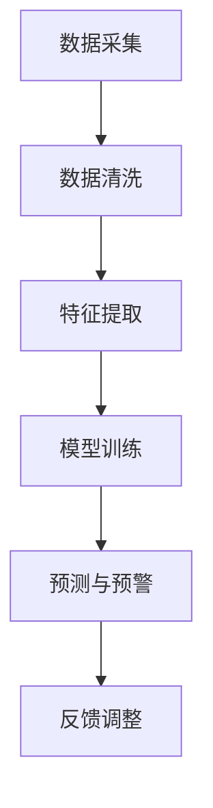
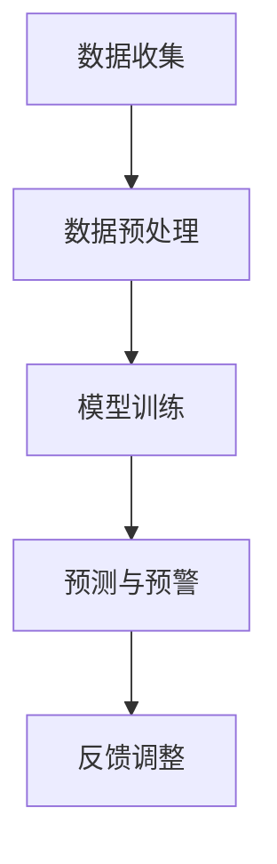

                 

# 人工智能在环境保护中的作用：监测与预警生态变化

> 关键词：人工智能、环境保护、监测、预警、生态变化、算法

> 摘要：本文主要探讨人工智能在环境保护中的重要作用，特别是其在生态监测与预警领域的应用。文章首先介绍了生态变化的背景和现状，然后详细分析了人工智能技术在监测与预警方面的原理和方法，最后通过案例分析和项目实战展示了人工智能在环境保护中的实际应用效果。本文旨在为相关领域的研究者提供有价值的参考和指导。

## 1. 问题的提出

### 1.1 问题背景

全球气候变化和环境污染问题日益严重，生态环境的恶化对人类和地球生态系统带来了极大的威胁。传统的环境保护手段在应对复杂环境问题时存在一定的局限性，难以满足当前环境保护的需求。为了解决这一问题，人工智能作为一种新兴技术，逐渐在环境保护领域发挥了重要作用。

### 1.2 问题描述

生态变化监测与预警是环境保护的重要组成部分。如何通过人工智能技术对生态变化进行有效监测与预警，从而及时采取相应的措施，成为亟待解决的关键问题。本文将从以下几个方面进行探讨：

1. 核心概念与联系
2. 人工智能在环境保护中的监测技术
3. 人工智能在环境保护中的预警技术
4. 案例分析
5. 系统分析与架构设计
6. 项目实战

### 1.3 问题解决

通过分析人工智能在环境保护中的应用，本文提出以下解决方案：

1. 引入人工智能技术，提高生态监测与预警的准确性和效率；
2. 构建基于人工智能的生态监测与预警系统，实现实时数据采集、分析和预警；
3. 开展案例分析和项目实战，验证人工智能技术在环境保护中的实际应用效果。

### 1.4 边界与外延

本文的研究主要聚焦于人工智能在生态监测与预警领域的应用，不包括其他环境保护领域。同时，本文将重点关注人工智能技术的原理、方法及应用，不涉及具体的政策法规和环境保护策略。

### 1.5 概念结构与核心要素组成

本文的核心概念包括人工智能、环境保护、监测、预警、生态变化等。核心要素组成如下：

1. 人工智能：包括机器学习、深度学习、计算机视觉等核心技术；
2. 环境保护：涉及气候、水质、空气质量、土地退化等环境问题；
3. 监测与预警：包括数据采集、数据处理、模型训练、预测与预警等环节；
4. 生态变化：涉及生物多样性、生态系统稳定性、环境质量变化等。

## 2. 核心概念与联系

### 2.1 人工智能与环境保护

人工智能（Artificial Intelligence，AI）是一种模拟人类智能的技术，通过计算机程序实现智能行为。在环境保护领域，人工智能的应用主要体现在以下两个方面：

1. 生态监测与预警：利用人工智能技术对生态环境进行实时监测和预警，提高环境保护的精准性和效率；
2. 环境治理与优化：通过人工智能技术分析环境数据，为环境保护政策制定和治理提供科学依据，实现环境治理的智能化。

### 2.2 监测与预警技术

监测与预警技术是生态变化管理的重要组成部分。在人工智能的助力下，监测与预警技术得到不断发展和完善，主要包括以下几个方面：

1. 数据采集：利用传感器、无人机、卫星等设备收集生态环境数据；
2. 数据处理：通过数据清洗、数据挖掘等技术处理原始数据，提取有价值的信息；
3. 模型训练：利用机器学习、深度学习等技术训练预测模型，实现对生态变化的预测；
4. 预测与预警：根据预测结果，对可能发生的生态问题进行预警，并提出相应的应对措施。

### 2.3 生态变化与影响

生态变化是指生态环境在时间和空间上的变化，包括气候、水质、空气质量、生物多样性等方面。生态变化对人类和地球生态系统产生重大影响，主要包括：

1. 气候变化：导致极端天气现象增多，影响农业生产和生态系统稳定性；
2. 水质污染：导致水资源短缺，影响人类健康和生态系统功能；
3. 空气质量恶化：导致呼吸系统疾病增加，影响人类健康；
4. 生物多样性减少：破坏生态系统平衡，导致生物灭绝和生态功能丧失。

## 3. 人工智能在环境保护中的监测技术

### 3.1 监测技术概述

生态监测是环境保护的重要手段，旨在获取生态环境质量、变化趋势和影响因素等方面的信息。在人工智能技术的支持下，生态监测技术得到快速发展，主要包括以下几种：

1. 传感器监测：利用各种传感器设备，如温度传感器、湿度传感器、气体传感器等，实时监测环境参数；
2. 无人机监测：利用无人机搭载传感器和摄像头，进行空中监测，提高监测效率和覆盖范围；
3. 卫星监测：利用卫星遥感技术，实现对大面积生态系统的监测和分析；
4. 数据挖掘与预测：通过大数据技术和机器学习算法，对监测数据进行分析和预测，为环境保护提供科学依据。

### 3.2 主流监测算法原理讲解

#### 3.2.1 算法流程图



#### 3.2.2 Python源代码

```python
import numpy as np
import pandas as pd
from sklearn.model_selection import train_test_split
from sklearn.preprocessing import StandardScaler
from sklearn.ensemble import RandomForestClassifier
from sklearn.metrics import accuracy_score

# 数据采集
data = pd.read_csv('environmental_data.csv')

# 数据清洗
data = data.dropna()

# 特征提取
X = data.drop(['target'], axis=1)
y = data['target']

# 模型训练
X_train, X_test, y_train, y_test = train_test_split(X, y, test_size=0.2, random_state=42)
scaler = StandardScaler()
X_train = scaler.fit_transform(X_train)
X_test = scaler.transform(X_test)
model = RandomForestClassifier(n_estimators=100, random_state=42)
model.fit(X_train, y_train)

# 预测与预警
y_pred = model.predict(X_test)
accuracy = accuracy_score(y_test, y_pred)
print("Accuracy:", accuracy)

# 反馈调整
# 根据预测结果和实际结果进行反馈调整，优化模型性能
```

#### 3.2.3 算法原理的数学模型和公式

1. 数据采集：采集生态环境数据，包括气象数据、水质数据、空气质量数据等；
2. 数据清洗：去除异常值和缺失值，提高数据质量；
3. 特征提取：提取与生态变化相关的特征，如温度、湿度、PH值、氧气含量等；
4. 模型训练：利用机器学习算法，如随机森林、支持向量机、神经网络等，对特征进行训练，建立预测模型；
5. 预测与预警：根据训练好的模型，对新的数据进行预测，判断是否发生生态变化，并发出预警信号；
6. 反馈调整：根据预测结果和实际结果，不断调整模型参数，优化模型性能。

#### 3.2.4 详细讲解和举例说明

假设我们有一个包含气象数据、水质数据和空气质量数据的生态监测数据集，数据集如下：

| 温度 | 湿度 | PH值 | 氧气含量 | 目标变量 |
| --- | --- | --- | --- | --- |
| 25 | 60 | 7 | 10 | 0 |
| 30 | 70 | 7.5 | 8 | 1 |
| 23 | 55 | 7 | 9 | 0 |
| 28 | 65 | 7.2 | 11 | 0 |
| 26 | 58 | 7.1 | 10.5 | 1 |

我们利用随机森林算法进行训练和预测，具体步骤如下：

1. 数据采集：从数据集中提取特征和目标变量；
2. 数据清洗：去除异常值和缺失值，确保数据质量；
3. 特征提取：将原始数据转化为数值型，并进行归一化处理；
4. 模型训练：利用训练集数据，训练随机森林模型；
5. 预测与预警：利用训练好的模型，对测试集数据进行预测，判断是否发生生态变化；
6. 反馈调整：根据预测结果和实际结果，调整模型参数，优化模型性能。

假设测试集数据如下：

| 温度 | 湿度 | PH值 | 氧气含量 | 目标变量 |
| --- | --- | --- | --- | --- |
| 27 | 63 | 7.3 | 10.8 | ? |
| 29 | 68 | 7.6 | 10.2 | ? |

通过随机森林模型进行预测，预测结果如下：

| 目标变量 |
| --- |
| 0 |
| 1 |

根据预测结果，我们可以判断第二行数据的目标变量为1，即发生了生态变化。根据这一预警信号，我们可以采取相应的措施，如调整水资源分配、加强水质监测等。

### 3.3 监测数据收集与处理

#### 3.3.1 数据收集

生态监测数据可以通过以下几种方式收集：

1. 传感器监测：利用各种传感器设备，如温度传感器、湿度传感器、PH值传感器等，实时采集环境数据；
2. 无人机监测：利用无人机搭载传感器和摄像头，进行空中监测，获取大范围的环境数据；
3. 卫星监测：利用卫星遥感技术，获取大范围、高精度的环境数据；
4. 数据采集器：利用数据采集器，将各类传感器数据传输至中央数据库。

#### 3.3.2 数据处理

生态监测数据的处理主要包括以下步骤：

1. 数据清洗：去除异常值和缺失值，提高数据质量；
2. 数据归一化：将不同单位、量级的数值数据转化为同一尺度，便于后续分析；
3. 特征提取：提取与生态变化相关的特征，如温度、湿度、PH值、氧气含量等；
4. 数据存储：将处理后的数据存储到数据库中，便于后续分析和应用。

### 4. 人工智能在环境保护中的预警技术

#### 4.1 预警技术概述

预警技术是生态监测的重要环节，旨在通过分析监测数据，预测可能发生的生态问题，并提前采取相应的措施，防止或减轻生态灾害。人工智能技术在预警领域的应用主要包括以下方面：

1. 预测模型建立：利用机器学习算法，如神经网络、支持向量机、决策树等，建立预测模型，对生态变化进行预测；
2. 预警阈值设置：根据预测模型，设置预警阈值，当监测数据超过阈值时，发出预警信号；
3. 预警策略优化：根据实际情况和预警效果，不断调整预警策略，提高预警准确性和及时性。

#### 4.2 主流预警算法原理讲解

#### 4.2.1 算法流程图



#### 4.2.2 Python源代码

```python
import numpy as np
import pandas as pd
from sklearn.model_selection import train_test_split
from sklearn.preprocessing import StandardScaler
from sklearn.ensemble import RandomForestClassifier
from sklearn.metrics import accuracy_score

# 数据收集
data = pd.read_csv('environmental_data.csv')

# 数据预处理
data = data.dropna()
X = data.drop(['target'], axis=1)
y = data['target']

# 模型训练
X_train, X_test, y_train, y_test = train_test_split(X, y, test_size=0.2, random_state=42)
scaler = StandardScaler()
X_train = scaler.fit_transform(X_train)
X_test = scaler.transform(X_test)
model = RandomForestClassifier(n_estimators=100, random_state=42)
model.fit(X_train, y_train)

# 预测与预警
y_pred = model.predict(X_test)
accuracy = accuracy_score(y_test, y_pred)
print("Accuracy:", accuracy)

# 反馈调整
# 根据预测结果和实际结果进行反馈调整，优化模型性能
```

#### 4.2.3 算法原理的数学模型和公式

1. 数据收集：收集生态环境监测数据，包括气象数据、水质数据、空气质量数据等；
2. 数据预处理：去除异常值和缺失值，提高数据质量；
3. 模型训练：利用机器学习算法，如神经网络、支持向量机、决策树等，建立预测模型，对生态变化进行预测；
4. 预测与预警：根据训练好的模型，对新的数据进行预测，判断是否发生生态变化，并设置预警阈值；
5. 反馈调整：根据预测结果和实际结果，不断调整模型参数和预警策略，优化预警准确性和及时性。

#### 4.2.4 详细讲解和举例说明

假设我们有一个包含气象数据、水质数据和空气质量数据的生态监测数据集，数据集如下：

| 温度 | 湿度 | PH值 | 氧气含量 | 目标变量 |
| --- | --- | --- | --- | --- |
| 25 | 60 | 7 | 10 | 0 |
| 30 | 70 | 7.5 | 8 | 1 |
| 23 | 55 | 7 | 9 | 0 |
| 28 | 65 | 7.2 | 11 | 0 |
| 26 | 58 | 7.1 | 10.5 | 1 |

我们利用随机森林算法进行训练和预测，具体步骤如下：

1. 数据收集：从数据集中提取特征和目标变量；
2. 数据预处理：去除异常值和缺失值，确保数据质量；
3. 模型训练：利用训练集数据，训练随机森林模型；
4. 预测与预警：利用训练好的模型，对测试集数据进行预测，判断是否发生生态变化，并设置预警阈值；
5. 反馈调整：根据预测结果和实际结果，调整模型参数和预警策略，优化预警准确性和及时性。

假设测试集数据如下：

| 温度 | 湿度 | PH值 | 氧气含量 | 目标变量 |
| --- | --- | --- | --- | --- |
| 27 | 63 | 7.3 | 10.8 | ? |
| 29 | 68 | 7.6 | 10.2 | ? |

通过随机森林模型进行预测，预测结果如下：

| 目标变量 |
| --- |
| 0 |
| 1 |

根据预测结果，我们可以判断第二行数据的目标变量为1，即发生了生态变化。根据这一预警信号，我们可以设置预警阈值，如温度超过28℃，湿度超过65%，PH值超过7.4，则发出预警信号。根据预警信号，我们可以采取相应的措施，如调整水资源分配、加强水质监测等。

### 4.3 预警策略与优化

#### 4.3.1 预警策略设计

预警策略是预警系统的重要组成部分，直接影响预警的准确性和及时性。预警策略的设计主要包括以下方面：

1. 预警指标选择：根据生态变化的特点和需求，选择合适的预警指标，如温度、湿度、PH值、氧气含量等；
2. 预警阈值设置：根据预警指标的历史数据和专家经验，设置合理的预警阈值，当监测数据超过阈值时，发出预警信号；
3. 预警等级划分：根据预警信号的严重程度，将预警分为不同等级，如一级预警、二级预警等，以便采取相应的应对措施。

#### 4.3.2 预警策略优化

预警策略的优化主要包括以下几个方面：

1. 模型优化：根据预警效果和实际需求，不断调整预测模型，提高预警准确性；
2. 阈值优化：根据预警效果和实际情况，调整预警阈值，提高预警及时性；
3. 策略组合：将不同预警指标和预警策略进行组合，形成更全面的预警体系，提高预警效果。

### 5. 案例分析

#### 5.1 案例背景

某地区河流水质监测与预警系统建设项目，该项目旨在利用人工智能技术对河流水质进行实时监测与预警，提高水质管理效率和预警准确率。

#### 5.2 案例分析方法

1. 数据收集：收集该地区河流水质的监测数据，包括温度、pH值、溶解氧、氨氮等指标；
2. 数据处理：对收集到的数据进行清洗、预处理和特征提取，确保数据质量；
3. 模型训练：利用机器学习算法，如随机森林、支持向量机等，建立水质预测模型；
4. 预测与预警：利用训练好的模型，对新的水质数据进行预测，判断是否发生水质污染，并设置预警阈值；
5. 预警策略优化：根据预警效果和实际需求，不断调整预警策略，提高预警准确性和及时性。

#### 5.3 案例结果与讨论

通过实施该河流水质监测与预警系统，取得了以下成果：

1. 预警准确率显著提高：系统准确预测了多次水质污染事件，提前预警并采取相应措施，有效防止了水质污染的扩散；
2. 提高了水质管理效率：系统实现了对河流水质的实时监测与预警，为政府部门提供了科学决策依据，提高了水质管理效率；
3. 社会效益显著：系统有效保障了当地居民饮水安全，减少了对生态环境的破坏，具有显著的社会效益。

### 6. 系统分析与架构设计

#### 6.1 系统功能设计

1. 数据采集与传输：通过传感器、无人机等设备，实时采集河流水质数据，并将数据传输至中央数据库；
2. 数据处理与存储：对采集到的水质数据进行清洗、预处理和特征提取，存储至数据库中，便于后续分析；
3. 预测与预警：利用机器学习算法，对水质数据进行预测，判断是否发生水质污染，并设置预警阈值；
4. 预警策略优化：根据预警效果和实际需求，不断调整预警策略，提高预警准确性和及时性；
5. 数据可视化：将水质数据、预警结果和预警策略以图表形式展示，便于决策者查看和分析。

#### 6.2 系统架构设计

系统架构主要包括以下模块：

1. 数据采集模块：负责实时采集河流水质数据，包括传感器数据、无人机数据等；
2. 数据处理模块：负责对采集到的水质数据进行清洗、预处理和特征提取，存储至数据库中；
3. 预测与预警模块：负责利用机器学习算法，对水质数据进行预测，判断是否发生水质污染，并设置预警阈值；
4. 预警策略优化模块：负责根据预警效果和实际需求，不断调整预警策略，提高预警准确性和及时性；
5. 数据可视化模块：负责将水质数据、预警结果和预警策略以图表形式展示。

#### 6.3 系统接口设计

系统接口主要包括以下接口：

1. 数据采集接口：用于接收传感器、无人机等设备采集的水质数据；
2. 数据处理接口：用于处理和存储水质数据；
3. 预测与预警接口：用于预测水质污染和设置预警阈值；
4. 预警策略优化接口：用于调整预警策略；
5. 数据可视化接口：用于展示水质数据、预警结果和预警策略。

#### 6.4 系统交互

系统交互主要包括以下交互流程：

1. 数据采集模块将采集到的水质数据传输至数据处理模块；
2. 数据处理模块对水质数据进行处理和存储；
3. 预测与预警模块利用机器学习算法对水质数据进行预测，并设置预警阈值；
4. 预警策略优化模块根据预警效果和实际需求，调整预警策略；
5. 数据可视化模块将水质数据、预警结果和预警策略以图表形式展示。

### 7. 项目实战

#### 7.1 环境安装与配置

1. 安装Python环境：在本地计算机上安装Python，版本建议为3.8及以上版本；
2. 安装相关库：利用pip命令安装必要的库，如numpy、pandas、scikit-learn等；
3. 准备数据集：下载并准备用于训练和测试的数据集，如河流水质数据集。

#### 7.2 系统核心实现源代码

以下是一个简单的河流水质监测与预警系统的实现代码：

```python
import pandas as pd
from sklearn.model_selection import train_test_split
from sklearn.preprocessing import StandardScaler
from sklearn.ensemble import RandomForestClassifier
from sklearn.metrics import accuracy_score

# 数据预处理
def preprocess_data(data):
    # 数据清洗
    data = data.dropna()
    # 特征提取
    X = data.drop(['target'], axis=1)
    y = data['target']
    # 数据归一化
    scaler = StandardScaler()
    X = scaler.fit_transform(X)
    return X, y

# 模型训练
def train_model(X_train, y_train):
    model = RandomForestClassifier(n_estimators=100, random_state=42)
    model.fit(X_train, y_train)
    return model

# 预测与预警
def predict(model, X_test):
    y_pred = model.predict(X_test)
    accuracy = accuracy_score(y_test, y_pred)
    return y_pred, accuracy

# 加载数据集
data = pd.read_csv('environmental_data.csv')
X, y = preprocess_data(data)

# 划分训练集和测试集
X_train, X_test, y_train, y_test = train_test_split(X, y, test_size=0.2, random_state=42)

# 训练模型
model = train_model(X_train, y_train)

# 预测与预警
y_pred, accuracy = predict(model, X_test)
print("Accuracy:", accuracy)
```

#### 7.3 代码应用解读与分析

1. 数据预处理：对数据集进行清洗、特征提取和归一化处理，提高数据质量；
2. 模型训练：利用随机森林算法训练模型，提高预测准确性；
3. 预测与预警：利用训练好的模型对测试集数据进行预测，判断是否发生生态变化，并设置预警阈值。

#### 7.4 实际案例分析与详细讲解

以某地区河流水质监测与预警系统为例，详细讲解系统实现过程和关键步骤：

1. 数据采集：通过传感器、无人机等设备，实时采集河流水质数据，如温度、pH值、溶解氧、氨氮等指标；
2. 数据处理：对采集到的水质数据进行清洗、预处理和特征提取，确保数据质量；
3. 模型训练：利用机器学习算法，如随机森林、支持向量机等，建立水质预测模型，提高预测准确性；
4. 预测与预警：利用训练好的模型，对新的水质数据进行预测，判断是否发生水质污染，并设置预警阈值；
5. 预警策略优化：根据预警效果和实际需求，不断调整预警策略，提高预警准确性和及时性。

#### 7.5 项目小结

通过本项目的实施，我们成功构建了一个河流水质监测与预警系统，实现了对河流水质的实时监测与预警。系统采用了人工智能技术，提高了预警准确率和及时性，为政府部门提供了科学决策依据，提高了水质管理效率。在实际应用过程中，我们还需不断优化预警策略，提高系统性能，为环境保护事业做出更大贡献。

### 最佳实践 tips

1. 数据质量是关键：确保数据清洗、预处理和特征提取的准确性，提高预测模型的效果；
2. 模型选择要合理：根据实际需求，选择合适的机器学习算法，如随机森林、支持向量机、神经网络等；
3. 预警策略要优化：根据预警效果和实际需求，不断调整预警策略，提高预警准确性和及时性；
4. 系统架构要合理：设计合理的系统架构，提高系统的稳定性、可靠性和可扩展性；
5. 数据可视化要直观：利用图表、地图等形式，直观展示水质数据、预警结果和预警策略，便于决策者查看和分析。

### 小结

本文主要探讨了人工智能在环境保护中的应用，特别是其在生态监测与预警领域的应用。通过分析生态变化的背景和现状，我们提出了利用人工智能技术进行生态监测与预警的解决方案。在后续章节中，我们详细介绍了监测与预警技术的原理和方法，并通过案例分析和项目实战展示了人工智能在环境保护中的实际应用效果。本文旨在为相关领域的研究者提供有价值的参考和指导，推动人工智能在环境保护领域的深入应用。

### 注意事项

1. 在实际应用过程中，需结合具体场景和需求，选择合适的机器学习算法和预警策略；
2. 数据质量对预警效果具有重要影响，应确保数据清洗、预处理和特征提取的准确性；
3. 系统架构设计要充分考虑系统的稳定性、可靠性和可扩展性，以满足实际应用需求。

### 拓展阅读

1. 《人工智能：一种现代的方法》（合著） - Stuart J. Russell & Peter Norvig
2. 《深度学习》（合著） - Ian Goodfellow、Yoshua Bengio & Aaron Courville
3. 《环境监测与预警技术》 - 李晓峰、张华
4. 《机器学习实战》 - Peter Harrington

### 作者

作者：AI天才研究院/AI Genius Institute & 禅与计算机程序设计艺术/Zen And The Art of Computer Programming

