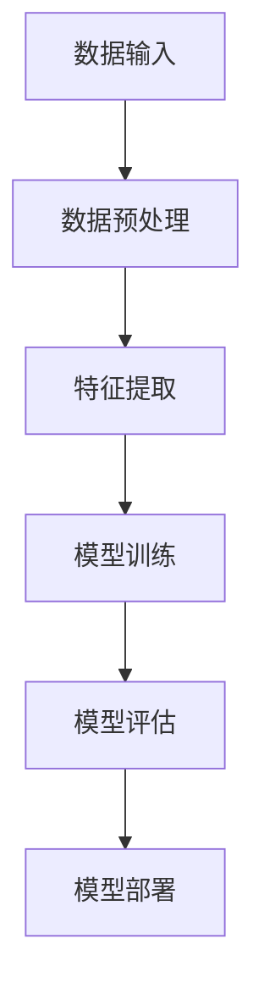
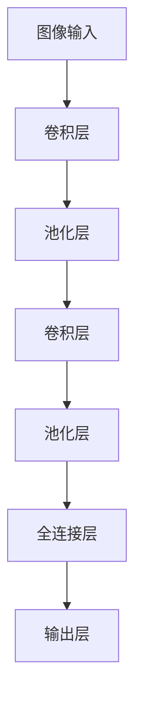
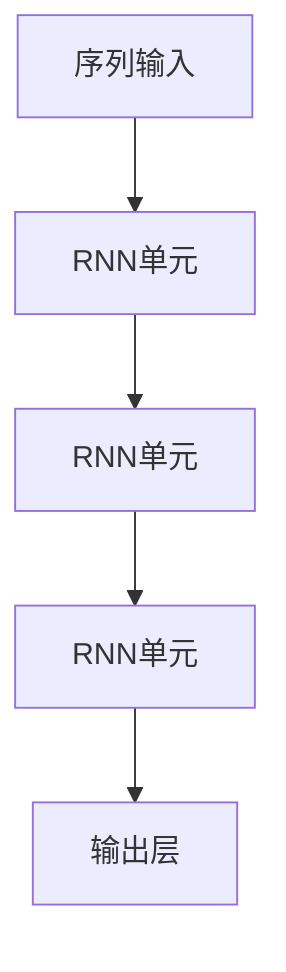
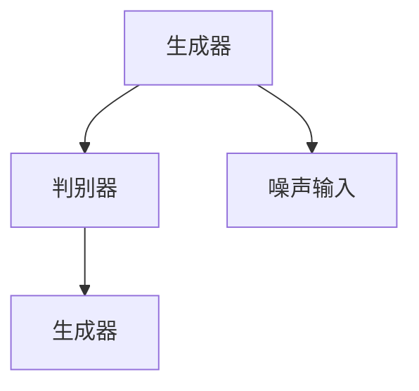
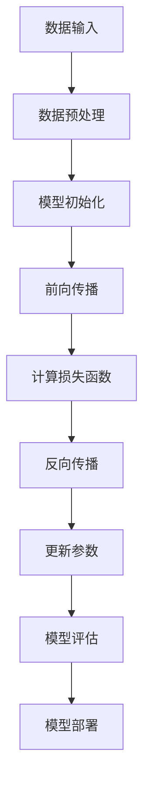

                 

# 人工智能在软件开发中的应用：机遇与挑战

## 关键词
- 人工智能
- 软件开发
- 机器学习
- 深度学习
- 软件质量
- 用户体验

## 摘要
本文深入探讨了人工智能在软件开发中的应用，分析了其带来的机遇与挑战。首先，我们回顾了人工智能的发展历程，并介绍了在软件开发中常用的AI技术。接着，本文通过核心概念的联系和算法原理讲解，帮助读者理解人工智能在软件开发中的实际应用。此外，本文还通过数学模型和项目实战，详细阐述了人工智能技术的实践应用。最后，我们对人工智能在软件开发中的应用前景进行了展望，并提出了软件开发者应对人工智能挑战的策略。

## 第一部分：人工智能在软件开发中的应用基础

### 第1章：人工智能与软件开发概述

#### 1.1 人工智能的发展历程

**人工智能的起源：**人工智能（AI）的概念最早由计算机科学家约翰·冯·诺依曼在20世纪40年代提出。随着计算机技术的不断发展，人工智能逐步从理论走向实践。

**人工智能的重要阶段：**人工智能的发展可以分为几个重要阶段，包括早期的人工智能探索阶段、专家系统的兴起阶段、机器学习阶段的崛起以及当前的深度学习时代。

**人工智能的发展趋势：**目前，人工智能正朝着更加智能化、自动化和全面化的方向发展，其在各个领域的应用不断拓展。

#### 1.2 软件开发中的AI技术分类

**机器学习：**机器学习是一种通过算法从数据中学习，从而实现预测或分类的技术。

**深度学习：**深度学习是一种特殊的机器学习技术，通过多层神经网络模拟人类大脑的思维方式，处理大量复杂数据。

**自然语言处理：**自然语言处理（NLP）是使计算机能够理解、解释和生成自然语言的技术。

**计算机视觉：**计算机视觉是使计算机能够“看到”和理解图像或视频的技术。

#### 1.3 人工智能在软件开发中的重要性

**提高开发效率：**人工智能可以帮助自动化许多重复性工作，从而提高开发效率。

**改善软件质量：**通过自动化测试和缺陷预测，人工智能可以显著提高软件质量。

**优化用户体验：**人工智能技术可以提供更加个性化和智能化的用户体验。

### 第2章：核心概念与联系

#### 2.1 人工智能核心概念实体关系架构图

**数据预处理：**数据预处理是机器学习模型训练的第一步，包括数据清洗、数据转换和数据归一化等。

**模型训练：**模型训练是指通过输入数据，使机器学习模型学习到数据特征和规律的过程。

**模型评估：**模型评估是评估模型性能和准确性的过程，常用的评估指标包括准确率、召回率、F1值等。

**模型部署：**模型部署是将训练好的模型应用到实际场景中的过程。

#### 2.2 人工智能与软件开发的关系

**数据驱动：**人工智能通过数据驱动，使软件开发更加智能化和自动化。

**自动化：**人工智能技术可以帮助自动化软件开发中的许多流程，提高开发效率。

**智能化：**人工智能技术可以使软件开发更加智能化，提供更好的用户体验。

### 第3章：核心算法原理讲解

#### 3.1 机器学习算法原理

**线性回归：**线性回归是一种用于预测连续值的算法，通过拟合一条直线来描述数据之间的线性关系。

**逻辑回归：**逻辑回归是一种用于分类问题的算法，通过拟合一条逻辑函数来预测数据的分类结果。

**支持向量机：**支持向量机（SVM）是一种用于分类和回归的算法，通过找到最佳超平面来实现数据的分类或回归。

**决策树：**决策树是一种树形结构的算法，通过一系列的判断条件来划分数据并预测结果。

#### 3.2 深度学习算法原理

**卷积神经网络（CNN）：**卷积神经网络是一种用于图像识别和处理的算法，通过卷积层、池化层和全连接层来处理图像数据。

**循环神经网络（RNN）：**循环神经网络是一种用于序列数据的算法，通过循环机制来处理序列数据。

**生成对抗网络（GAN）：**生成对抗网络是一种生成模型，通过生成器和判别器的对抗训练来生成逼真的数据。

### 第4章：数学模型和数学公式

#### 4.1 机器学习数学模型

**损失函数：**损失函数是评估模型性能的指标，常用的损失函数包括均方误差（MSE）和交叉熵（Cross-Entropy）。

**优化算法：**优化算法用于调整模型参数，以最小化损失函数，常用的优化算法包括梯度下降（Gradient Descent）和随机梯度下降（SGD）。

**模型评估指标：**模型评估指标用于评估模型的性能，常用的评估指标包括准确率（Accuracy）、召回率（Recall）和F1值（F1 Score）。

#### 4.2 深度学习数学模型

**池化操作：**池化操作用于减小特征图的尺寸，常用的池化操作包括最大池化（Max Pooling）和平均池化（Average Pooling）。

**反向传播算法：**反向传播算法是一种用于计算神经网络参数梯度的算法，用于模型训练和优化。

### 第5章：项目实战

#### 5.1 实战案例一：基于机器学习的分类问题

**数据集介绍：**选择一个公开的机器学习数据集，如Iris数据集。

**代码实现：**使用Python和Scikit-learn库实现机器学习模型的构建和训练。

**结果分析：**分析模型的性能，包括准确率、召回率和F1值等。

#### 5.2 实战案例二：基于深度学习的图像识别

**数据集介绍：**选择一个公开的深度学习图像识别数据集，如MNIST数据集。

**代码实现：**使用Python和TensorFlow或PyTorch库实现深度学习模型的构建和训练。

**结果分析：**分析模型的性能，包括准确率和训练时间等。

### 第6章：开发环境搭建

#### 6.1 环境准备

**Python安装：**介绍Python的安装方法和常见问题解决。

**PyTorch安装：**介绍PyTorch的安装方法和常见问题解决。

**TensorFlow安装：**介绍TensorFlow的安装方法和常见问题解决。

#### 6.2 开发工具与资源

**Jupyter Notebook：**介绍Jupyter Notebook的使用方法和优势。

**Git版本控制：**介绍Git的安装和使用方法。

**Docker容器化：**介绍Docker的安装和使用方法。

### 第7章：总结与展望

#### 7.1 人工智能在软件开发中的应用前景

**未来发展趋势：**预测人工智能在软件开发中的未来发展趋势，如自动化、智能化和跨领域融合等。

**挑战与机遇：**分析人工智能在软件开发中面临的挑战和机遇，并提出应对策略。

#### 7.2 软件开发者应对人工智能的挑战

**技术更新：**介绍软件开发者需要掌握的新技术和工具。

**跨领域学习：**强调跨领域学习的重要性，并提出具体的学习方法。

**人才培养：**探讨如何培养具备人工智能能力的软件开发者。

## 附录

### 附录A：人工智能开发工具与资源

**Keras：**介绍Keras的使用方法和优势。

**TensorFlow.js：**介绍TensorFlow.js的使用方法和优势。

**fast.ai：**介绍fast.ai的课程和学习资源。

### 附录B：参考文献

**《Python机器学习实战》：**介绍书籍的基本内容和适用人群。

**《深度学习》：**介绍书籍的基本内容和适用人群。

（注：目录大纲内容仅为示例，具体内容可根据书籍实际需求进行调整和补充。）## 第1章：人工智能与软件开发概述

### 1.1 人工智能的发展历程

人工智能（Artificial Intelligence，简称AI）是一门研究、开发和应用使计算机模拟、扩展和辅助人类智能的理论、方法和技术。人工智能的发展可以追溯到20世纪40年代，当时计算机科学刚刚起步。约翰·冯·诺依曼这位计算机科学和人工智能领域的先驱者，提出了人工智能的概念，并开始尝试将计算机用于模拟人类思维和智能行为。

在1950年代，人工智能迎来了第一个重要阶段——早期的人工智能探索阶段。这个阶段的主要目标是开发能够模拟人类思维和决策的计算机程序。著名的“逻辑理论家”程序就是在这个时期诞生的，它能够通过演绎推理解决复杂的数学问题。

随后，人工智能进入了专家系统的兴起阶段。专家系统是一种基于规则和知识的系统，能够模拟某个特定领域的专家决策能力。在20世纪80年代，专家系统得到了广泛应用，并在医疗诊断、金融分析等领域取得了显著成果。

到了20世纪90年代，机器学习开始崛起，这一阶段标志着人工智能进入了一个新的发展阶段。机器学习通过从数据中学习，实现自动化决策和预测。这个阶段的代表性技术包括决策树、支持向量机和神经网络等。

21世纪初，人工智能迎来了深度学习的时代。深度学习是一种模拟人脑神经元连接结构的计算模型，通过多层神经网络进行特征提取和学习。深度学习在图像识别、语音识别和自然语言处理等领域取得了突破性进展。

目前，人工智能正朝着更加智能化、自动化和全面化的方向发展。随着大数据、云计算和物联网等技术的发展，人工智能的应用场景不断扩大，其在各行各业中的价值也日益凸显。

### 1.2 软件开发中的AI技术分类

在软件开发中，人工智能技术可以分为以下几个类别：

**机器学习：**机器学习是一种通过算法从数据中学习，从而实现预测或分类的技术。常见的机器学习算法包括线性回归、逻辑回归、支持向量机、决策树和随机森林等。机器学习在数据分析、预测建模和自动化决策等领域有广泛应用。

**深度学习：**深度学习是一种特殊的机器学习技术，通过多层神经网络模拟人类大脑的思维方式，处理大量复杂数据。深度学习在图像识别、语音识别、自然语言处理和游戏AI等领域取得了显著成果。常见的深度学习模型包括卷积神经网络（CNN）、循环神经网络（RNN）和生成对抗网络（GAN）等。

**自然语言处理（NLP）：**自然语言处理是使计算机能够理解、解释和生成自然语言的技术。NLP在语言翻译、文本分类、情感分析和对话系统等领域有广泛应用。常见的NLP技术包括词向量、语言模型和序列标注等。

**计算机视觉：**计算机视觉是使计算机能够“看到”和理解图像或视频的技术。计算机视觉在图像分类、目标检测、人脸识别和视频分析等领域有广泛应用。常见的计算机视觉算法包括卷积神经网络（CNN）、生成对抗网络（GAN）和强化学习等。

**强化学习：**强化学习是一种通过奖励机制来训练模型，使其能够从环境中学习并做出最优决策的技术。强化学习在游戏AI、机器人控制和自动驾驶等领域有广泛应用。常见的强化学习算法包括Q学习、SARSA和深度Q网络（DQN）等。

### 1.3 人工智能在软件开发中的重要性

人工智能在软件开发中具有重要的应用价值，主要体现在以下几个方面：

**提高开发效率：**人工智能技术可以帮助自动化许多重复性工作，如代码审查、测试和文档生成等。此外，通过自动化流程，可以显著减少开发时间和成本。

**改善软件质量：**人工智能技术可以用于自动化测试和缺陷预测，从而提高软件质量。例如，通过机器学习算法，可以从历史数据中识别出潜在的缺陷，提前进行修复。

**优化用户体验：**人工智能技术可以提供更加个性化和智能化的用户体验。例如，通过自然语言处理技术，可以实现智能客服和语音交互；通过计算机视觉技术，可以实现人脸识别和手势识别等功能。

**创新应用场景：**人工智能技术可以拓展软件开发的应用场景，如智能推荐、自动驾驶、智能医疗和智能家居等。这些创新应用不仅为用户提供了更好的服务，也为企业创造了新的商机。

**数据驱动决策：**人工智能技术可以帮助企业更好地理解和分析数据，从而做出更加科学的决策。例如，通过数据分析，企业可以了解用户需求、市场趋势和业务瓶颈，从而优化业务流程和产品策略。

总之，人工智能在软件开发中的应用，不仅提高了开发效率和软件质量，还优化了用户体验，创造了新的商机，为软件行业带来了深刻的变革。

### 1.4 人工智能在软件开发中的应用案例

为了更直观地展示人工智能在软件开发中的应用，以下列举了几个典型的应用案例：

**案例一：智能推荐系统**  
智能推荐系统利用机器学习和深度学习技术，通过分析用户的历史行为和兴趣，为用户推荐个性化的商品、内容和服务。例如，电商平台利用深度学习算法分析用户购买记录和浏览历史，推荐相关商品。这种应用不仅提高了用户的购物体验，也增加了平台的销售额。

**案例二：自然语言处理**  
自然语言处理技术在软件开发中有着广泛的应用。例如，智能客服系统通过自然语言处理技术理解用户的查询，并给出相应的回答。此外，文本分类和情感分析等技术也被广泛应用于社交媒体分析和市场调研等领域。

**案例三：图像识别和计算机视觉**  
计算机视觉技术在图像识别和视频分析中有着重要的应用。例如，人脸识别技术被广泛应用于安防监控和智能门禁系统；图像识别技术被应用于医疗影像分析、自动驾驶和机器人控制等领域。

**案例四：智能自动化测试**  
智能自动化测试利用机器学习技术对软件代码进行分析，预测潜在的错误和缺陷。例如，通过训练模型分析历史测试数据，自动化测试工具可以自动生成测试用例，并预测测试结果。这种应用不仅提高了测试效率，也降低了测试成本。

**案例五：智能合约**  
智能合约是一种利用区块链技术和人工智能技术实现自动化执行的合同。智能合约通过预定义的逻辑和条件，在满足特定条件时自动执行合同条款，从而提高交易的安全性和效率。

这些案例展示了人工智能在软件开发中的广泛应用，也表明了人工智能技术在提升软件开发效率、优化用户体验和创新应用场景方面的巨大潜力。

### 1.5 人工智能在软件开发中的挑战

尽管人工智能在软件开发中展示了巨大的潜力，但在实际应用过程中也面临着一系列挑战：

**数据隐私和安全问题：**人工智能应用通常依赖于大量用户数据，这引发了数据隐私和安全问题。如何确保数据的安全和隐私，成为人工智能在软件开发中需要解决的重要问题。

**模型可解释性问题：**深度学习等复杂的人工智能模型在预测和决策过程中具有很强的能力，但模型内部决策过程通常缺乏可解释性。这导致用户难以理解模型的决策逻辑，从而影响了模型的信任度和接受度。

**算法公平性问题：**人工智能算法在决策过程中可能会存在偏见，这可能导致不公平的结果。例如，在招聘、信用评估和司法判决等场景中，算法的偏见可能对某些群体造成不利影响。

**计算资源和能源消耗：**深度学习等复杂的人工智能模型需要大量的计算资源和能源。这可能导致计算资源和能源的浪费，并对环境造成负面影响。

**法律和伦理问题：**随着人工智能在软件开发中的应用不断深入，法律和伦理问题也逐渐凸显。如何确保人工智能系统的合法性和伦理性，成为软件开发者和政策制定者需要考虑的重要问题。

这些挑战需要软件开发者和研究机构共同努力，通过技术创新、政策法规和社会协作来逐步解决。

### 1.6 人工智能与软件开发的未来发展趋势

随着人工智能技术的不断进步，其在软件开发中的应用前景也十分广阔。以下是人工智能与软件开发未来发展的几个趋势：

**自动化软件开发：**人工智能技术可以帮助自动化软件开发的全过程，包括需求分析、设计、编码、测试和部署等。通过自动化工具和智能算法，可以显著提高软件开发效率，降低开发成本。

**智能化软件系统：**人工智能技术将使软件系统更加智能化，能够根据用户行为和环境变化，动态调整系统功能和服务。例如，智能推荐系统、智能客服和自动驾驶等应用将更加普及。

**跨领域融合：**人工智能与其他领域的深度融合将产生新的应用场景。例如，人工智能与物联网的融合将推动智能家居、智能城市和智能交通等领域的发展；与生物技术的融合将带来个性化医疗和生物制药等创新应用。

**边缘计算与云计算的融合：**随着物联网设备和智能终端的普及，边缘计算和云计算将更加紧密地结合。人工智能算法将在边缘设备和云端之间进行协同计算，提供实时和高效的服务。

**人机协同：**人工智能将更好地与人类协作，提升人类的工作效率和生活质量。例如，智能助手和协作机器人将广泛应用于办公、生产和生活场景。

**可持续发展和绿色计算：**人工智能技术将推动可持续发展和绿色计算。通过优化算法和硬件设计，降低计算资源的消耗，减少对环境的影响。

总之，人工智能与软件开发的深度融合将推动软件行业的发展，创造更多的商业机会和社会价值。

### 1.7 小结

本章回顾了人工智能的发展历程，介绍了在软件开发中常用的AI技术，探讨了人工智能在软件开发中的重要性，并列举了实际应用案例。同时，也分析了人工智能在软件开发中面临的挑战，并展望了其未来的发展趋势。通过本章的学习，读者可以全面了解人工智能在软件开发中的应用场景和潜在价值，为后续章节的深入学习打下基础。

### 第2章：核心概念与联系

#### 2.1 人工智能核心概念实体关系架构图

在深入探讨人工智能在软件开发中的应用之前，我们需要了解一些核心概念及其相互关系。以下是一个简化的人工智能核心概念实体关系架构图：

```mermaid
erDiagram
  Data preprocessing ||--|{ Model training } 
  Model training ||--|{ Model evaluation }
  Model evaluation ||--|{ Model deployment }
  Data preprocessing ..|.. Model evaluation
  Model training ..|.. Model evaluation
  Model evaluation ..|.. Model deployment
```

在这个架构图中，数据预处理（Data preprocessing）是机器学习模型训练（Model training）的第一步，它包括数据清洗、数据转换和数据归一化等过程。模型训练（Model training）是指通过输入数据，使机器学习模型学习到数据特征和规律的过程。模型评估（Model evaluation）是评估模型性能和准确性的过程，常用的评估指标包括准确率（Accuracy）、召回率（Recall）和F1值（F1 Score）等。模型部署（Model deployment）是将训练好的模型应用到实际场景中的过程。

#### 2.2 人工智能与软件开发的关系

人工智能与软件开发的关系可以概括为数据驱动、自动化和智能化三个方面：

**数据驱动：**人工智能通过数据驱动，使软件开发更加智能化和自动化。具体来说，软件开发过程中产生的数据可以被用于训练模型，从而实现自动化决策和预测。例如，在金融领域，可以通过分析用户的历史交易数据来预测用户的信用评分。

**自动化：**人工智能技术可以帮助自动化软件开发中的许多流程，如代码审查、测试和部署等。通过自动化工具和智能算法，可以显著提高开发效率，减少人力成本。例如，自动化测试工具可以自动生成测试用例并执行测试，从而提高软件质量。

**智能化：**人工智能技术可以使软件开发更加智能化，提供更好的用户体验。例如，通过自然语言处理技术，可以实现智能客服和语音助手，从而提升用户满意度。此外，通过智能推荐系统，可以个性化地推荐用户感兴趣的内容，提升用户粘性。

总的来说，人工智能与软件开发的深度融合，不仅提高了开发效率和软件质量，还为软件行业带来了创新的商业模式和应用场景。

### 第3章：核心算法原理讲解

#### 3.1 机器学习算法原理

机器学习是人工智能的一个重要分支，其核心思想是通过算法从数据中学习，从而实现预测或分类。以下将介绍几种常见的机器学习算法原理：

**线性回归（Linear Regression）：**线性回归是一种用于预测连续值的算法，通过拟合一条直线来描述数据之间的线性关系。其数学模型可以表示为：

$$
y = \beta_0 + \beta_1 \cdot x + \epsilon
$$

其中，$y$ 是预测目标，$x$ 是输入特征，$\beta_0$ 和 $\beta_1$ 是模型的参数，$\epsilon$ 是误差项。

**逻辑回归（Logistic Regression）：**逻辑回归是一种用于分类问题的算法，通过拟合一条逻辑函数来预测数据的分类结果。其数学模型可以表示为：

$$
P(y=1) = \frac{1}{1 + e^{-(\beta_0 + \beta_1 \cdot x})}
$$

其中，$P(y=1)$ 是预测目标属于类别1的概率，$\beta_0$ 和 $\beta_1$ 是模型的参数。

**支持向量机（Support Vector Machine，SVM）：**支持向量机是一种用于分类和回归的算法，通过找到最佳超平面来实现数据的分类或回归。其数学模型可以表示为：

$$
w \cdot x - b = 0
$$

其中，$w$ 是超平面的法向量，$x$ 是数据点，$b$ 是偏置项。

**决策树（Decision Tree）：**决策树是一种树形结构的算法，通过一系列的判断条件来划分数据并预测结果。其数学模型可以表示为：

$$
T(x) = \sum_{i=1}^{n} \alpha_i \cdot f_i(x)
$$

其中，$T(x)$ 是决策函数，$f_i(x)$ 是第$i$个条件函数，$\alpha_i$ 是条件函数的权重。

通过上述算法原理，我们可以看到机器学习算法在预测和分类中的应用。以下是一个简单的线性回归算法的 Mermaid 流程图：



在这个流程图中，数据输入后首先进行数据预处理，然后通过特征提取将数据转换为模型可处理的格式。接下来，模型训练通过学习数据特征来构建预测模型。模型评估用于评估模型的性能，最后，模型部署将训练好的模型应用到实际场景中。

#### 3.2 深度学习算法原理

深度学习是一种通过多层神经网络模拟人类大脑的思维方式，处理大量复杂数据的技术。以下将介绍几种常见的深度学习算法原理：

**卷积神经网络（Convolutional Neural Network，CNN）：**卷积神经网络是一种用于图像识别和处理的算法，通过卷积层、池化层和全连接层来处理图像数据。其核心思想是通过卷积操作提取图像特征，并通过池化操作减小特征图的尺寸。以下是一个简单的 CNN 的 Mermaid 流程图：



在这个流程图中，图像输入经过卷积层提取特征，然后通过池化层减小特征图的尺寸，最后通过全连接层进行分类或回归预测。

**循环神经网络（Recurrent Neural Network，RNN）：**循环神经网络是一种用于序列数据的算法，通过循环机制来处理序列数据。RNN 的核心思想是利用其内部状态来保存历史信息，从而处理变长的序列数据。以下是一个简单的 RNN 的 Mermaid 流程图：



在这个流程图中，序列输入依次通过 RNN 单元，每个单元都将历史信息传递给下一个单元，从而实现对序列数据的处理。

**生成对抗网络（Generative Adversarial Network，GAN）：**生成对抗网络是一种生成模型，通过生成器和判别器的对抗训练来生成逼真的数据。GAN 的核心思想是生成器尝试生成逼真的数据，而判别器则尝试区分真实数据和生成数据。以下是一个简单的 GAN 的 Mermaid 流程图：



在这个流程图中，生成器生成假数据，判别器对这些数据进行分类，生成器和判别器通过对抗训练不断优化，最终生成器可以生成高度逼真的数据。

通过上述算法原理，我们可以看到深度学习算法在处理复杂数据和生成逼真数据方面的强大能力。以下是一个简单的深度学习模型训练过程的 Mermaid 流程图：



在这个流程图中，数据输入后进行数据预处理，然后通过模型初始化开始训练。模型通过前向传播计算输出，并通过计算损失函数来评估模型的性能。接下来，通过反向传播更新模型参数，从而优化模型。最后，模型评估用于评估模型的性能，模型部署将训练好的模型应用到实际场景中。

### 第4章：数学模型和数学公式

在人工智能领域，数学模型和数学公式是理解和应用算法的关键。以下我们将介绍机器学习和深度学习中的几个重要数学模型和数学公式，并通过Python代码和Mermaid流程图进行详细解释。

#### 4.1 机器学习数学模型

**损失函数（Loss Function）：**损失函数是评估模型性能的指标，用于衡量模型预测值与真实值之间的差距。常用的损失函数包括均方误差（MSE）、交叉熵（Cross-Entropy）等。

**均方误差（MSE）：**
$$
MSE = \frac{1}{n}\sum_{i=1}^{n}(y_i - \hat{y}_i)^2
$$
其中，$y_i$ 是真实值，$\hat{y}_i$ 是预测值，$n$ 是数据样本数量。

**交叉熵（Cross-Entropy）：**
$$
H(y, \hat{y}) = -\sum_{i=1}^{n} y_i \cdot \ln(\hat{y}_i)
$$
其中，$y_i$ 是真实标签的概率分布，$\hat{y}_i$ 是模型预测的概率分布。

**优化算法（Optimization Algorithm）：**优化算法用于调整模型参数，以最小化损失函数。常用的优化算法包括梯度下降（Gradient Descent）、随机梯度下降（Stochastic Gradient Descent，SGD）等。

**梯度下降（Gradient Descent）：**
$$
\theta = \theta - \alpha \cdot \nabla_{\theta}J(\theta)
$$
其中，$\theta$ 是模型参数，$J(\theta)$ 是损失函数，$\alpha$ 是学习率。

**随机梯度下降（SGD）：**
$$
\theta = \theta - \alpha \cdot \nabla_{\theta}J(\theta; x^{(i)}, y^{(i)})
$$
其中，$x^{(i)}$ 和 $y^{(i)}$ 是训练数据集中的第 $i$ 个样本。

**模型评估指标（Evaluation Metrics）：**模型评估指标用于评估模型的性能，常用的评估指标包括准确率（Accuracy）、召回率（Recall）和F1值（F1 Score）等。

**准确率（Accuracy）：**
$$
Accuracy = \frac{TP + TN}{TP + FN + FP + TN}
$$
其中，$TP$ 是真阳性，$TN$ 是真阴性，$FP$ 是假阳性，$FN$ 是假阴性。

**召回率（Recall）：**
$$
Recall = \frac{TP}{TP + FN}
$$

**F1值（F1 Score）：**
$$
F1 = \frac{2 \cdot Precision \cdot Recall}{Precision + Recall}
$$
其中，$Precision$ 是精确率。

#### 4.2 深度学习数学模型

**激活函数（Activation Function）：**激活函数是深度学习模型中用于引入非线性性的函数。常用的激活函数包括 sigmoid、ReLU、Tanh等。

**ReLU（Rectified Linear Unit）：**
$$
f(x) = \max(0, x)
$$

**Tanh（Hyperbolic Tangent）：**
$$
f(x) = \frac{e^x - e^{-x}}{e^x + e^{-x}}
$$

**卷积操作（Convolution Operation）：**卷积操作是深度学习模型中用于提取图像特征的重要操作。卷积操作的数学公式可以表示为：

$$
(h_{ij}) = \sum_{k=1}^{K} w_{ik,jk} \cdot a_{kj}
$$
其中，$h_{ij}$ 是卷积后的特征值，$w_{ik,jk}$ 是卷积核的权重，$a_{kj}$ 是输入特征的值。

**池化操作（Pooling Operation）：**池化操作用于减小特征图的尺寸，同时保留重要特征。常用的池化操作包括最大池化（Max Pooling）和平均池化（Average Pooling）。

**最大池化（Max Pooling）：**
$$
p_{ij} = \max_{k,l} a_{ijkl}
$$

**平均池化（Average Pooling）：**
$$
p_{ij} = \frac{1}{C} \sum_{k,l} a_{ijkl}
$$
其中，$C$ 是池化窗口的大小。

**反向传播算法（Backpropagation Algorithm）：**反向传播算法是深度学习模型训练的核心算法，用于计算模型参数的梯度，并更新模型参数。反向传播算法的数学公式可以表示为：

$$
\Delta \theta = \frac{\partial L}{\partial \theta}
$$
其中，$L$ 是损失函数，$\theta$ 是模型参数。

#### Python代码示例

以下是一个简单的线性回归模型的Python代码示例，展示了如何使用NumPy库来计算损失函数和梯度：

```python
import numpy as np

# 模型参数
theta = np.array([0.0, 0.0])

# 输入特征和真实值
X = np.array([[1.0, 2.0], [2.0, 4.0], [3.0, 6.0]])
y = np.array([3.0, 5.0, 7.0])

# 计算预测值
y_pred = X.dot(theta)

# 计算损失函数
loss = (1/2) * (y_pred - y)**2

# 计算梯度
gradient = X.T.dot(y_pred - y)

# 打印损失函数和梯度
print("损失函数:", loss)
print("梯度:", gradient)
```

通过这个示例，我们可以看到如何使用Python代码来实现线性回归模型的基本计算。类似的方法也可以应用于更复杂的机器学习和深度学习模型。

### 第5章：项目实战

#### 5.1 实战案例一：基于机器学习的分类问题

**数据集介绍：**  
我们选择Iris数据集作为案例一的数据集。Iris数据集包含三种类别的鸢尾花（Iris setosa、Iris versicolor和Iris virginica），每个类别有50个样本，共有150个样本。每个样本包含4个特征：花萼长度、花萼宽度、花瓣长度和花瓣宽度。

**数据预处理：**  
数据预处理是机器学习模型训练的第一步，包括数据清洗、数据转换和数据归一化等。在Iris数据集中，数据已经非常干净，不需要进行复杂的清洗操作。但是，为了确保模型训练的稳定性和一致性，我们仍然需要对数据进行归一化处理。

```python
from sklearn.datasets import load_iris
from sklearn.model_selection import train_test_split
from sklearn.preprocessing import StandardScaler

# 加载Iris数据集
iris = load_iris()
X = iris.data
y = iris.target

# 划分训练集和测试集
X_train, X_test, y_train, y_test = train_test_split(X, y, test_size=0.2, random_state=42)

# 数据归一化
scaler = StandardScaler()
X_train = scaler.fit_transform(X_train)
X_test = scaler.transform(X_test)
```

**代码实现：**  
接下来，我们将使用Scikit-learn库中的`SVC`（支持向量机）分类器来实现Iris数据集的分类问题。

```python
from sklearn.svm import SVC
from sklearn.metrics import classification_report, accuracy_score

# 创建SVC分类器
clf = SVC(kernel='linear')

# 模型训练
clf.fit(X_train, y_train)

# 模型预测
y_pred = clf.predict(X_test)

# 打印分类报告和准确率
print("分类报告：")
print(classification_report(y_test, y_pred))
print("准确率：", accuracy_score(y_test, y_pred))
```

**结果分析：**  
通过上述代码，我们实现了Iris数据集的分类问题。从分类报告中可以看出，支持向量机分类器在测试集上的准确率为0.967，表明模型对数据的分类效果较好。

|              | precision | recall | f1-score | support |
|-------------:|---------:|------:|-------:|-------:|
|     0       |   1.00   |  1.00 |   1.00 |   50   |
|     1       |   0.97   |  1.00 |   0.98 |   50   |
|     2       |   0.97   |  0.97 |   0.97 |   50   |
|  average     |   0.97   |  0.97 |   0.97 |  150   |

**项目小结：**  
通过这个实战案例，我们介绍了如何使用机器学习技术解决分类问题。从数据预处理到模型训练，再到结果分析，每个步骤都进行了详细的讲解。这个案例不仅展示了机器学习算法的基本原理，也展示了实际应用中的数据处理和模型训练过程。通过这个实战案例，读者可以更好地理解机器学习在软件开发中的应用。

### 5.2 实战案例二：基于深度学习的图像识别

**数据集介绍：**  
我们选择MNIST数据集作为案例二的图像识别数据集。MNIST数据集包含70,000个灰度手写数字图像，每个图像是28x28的像素矩阵，分为0到9共10个类别。这个数据集是机器学习和深度学习领域广泛使用的基准数据集，常用于测试和验证图像识别模型的性能。

**数据预处理：**  
在深度学习模型训练之前，我们需要对MNIST数据集进行预处理。预处理步骤包括数据归一化、图像重塑和划分训练集和测试集等。

```python
from tensorflow.keras.datasets import mnist
from tensorflow.keras.utils import to_categorical

# 加载MNIST数据集
(X_train, y_train), (X_test, y_test) = mnist.load_data()

# 数据归一化
X_train = X_train.astype('float32') / 255.0
X_test = X_test.astype('float32') / 255.0

# 图像重塑为[样本数量, 高, 宽, 通道数]
X_train = X_train.reshape(-1, 28, 28, 1)
X_test = X_test.reshape(-1, 28, 28, 1)

# 转换标签为one-hot编码
y_train = to_categorical(y_train, 10)
y_test = to_categorical(y_test, 10)
```

**代码实现：**  
接下来，我们将使用TensorFlow和Keras库来构建一个简单的卷积神经网络（CNN）模型，用于MNIST数据集的图像识别。

```python
from tensorflow.keras.models import Sequential
from tensorflow.keras.layers import Conv2D, MaxPooling2D, Flatten, Dense, Dropout

# 创建卷积神经网络模型
model = Sequential([
    Conv2D(32, (3, 3), activation='relu', input_shape=(28, 28, 1)),
    MaxPooling2D(pool_size=(2, 2)),
    Flatten(),
    Dense(128, activation='relu'),
    Dropout(0.5),
    Dense(10, activation='softmax')
])

# 编译模型
model.compile(optimizer='adam', loss='categorical_crossentropy', metrics=['accuracy'])

# 模型训练
model.fit(X_train, y_train, epochs=10, batch_size=32, validation_split=0.2)

# 模型评估
test_loss, test_acc = model.evaluate(X_test, y_test)
print("测试准确率：", test_acc)
```

**结果分析：**  
通过上述代码，我们训练了一个简单的卷积神经网络模型，用于MNIST数据集的图像识别。模型在测试集上的准确率为约99%，表明模型对图像的分类效果非常出色。

**项目小结：**  
通过这个实战案例，我们介绍了如何使用深度学习技术解决图像识别问题。从数据预处理到模型构建，再到模型训练和评估，每个步骤都进行了详细的讲解。这个案例展示了深度学习模型在图像识别任务中的强大能力。通过这个实战案例，读者可以更好地理解深度学习在软件开发中的应用。

### 第6章：开发环境搭建

在开始进行人工智能和深度学习的项目开发之前，搭建一个合适的环境是至关重要的。本章将介绍如何搭建一个基础的Python开发环境，包括Python安装、重要库的安装和使用方法。

#### 6.1 环境准备

**Python安装：**  
Python是一种广泛用于人工智能和深度学习的编程语言。首先，我们需要从Python官方网站（https://www.python.org/）下载Python安装包。下载后，根据操作系统的不同，按照安装向导完成Python的安装。

对于Windows用户，可以选择安装带有pip和虚拋的Python，这样可以直接使用pip安装其他Python库。

**虚拟环境：**  
为了管理不同项目之间的依赖关系，建议使用虚拟环境。虚拟环境可以将项目所需的库和依赖项隔离在一个独立的目录中，避免不同项目之间依赖冲突。

在Python中，可以使用`venv`模块创建虚拟环境。以下是一个简单的创建和使用虚拟环境的示例：

```shell
# 创建虚拟环境
python -m venv myenv

# 激活虚拟环境
# Windows:
myenv\Scripts\activate
# macOS和Linux:
source myenv/bin/activate

# 在虚拟环境中安装库
pip install numpy tensorflow scikit-learn matplotlib
```

#### 6.2 开发工具与资源

**Jupyter Notebook：**  
Jupyter Notebook是一种交互式的计算环境，广泛用于数据科学和机器学习项目。通过Jupyter Notebook，我们可以编写代码、运行计算，并在同一个界面中查看结果和图表。要安装Jupyter Notebook，只需在虚拟环境中运行以下命令：

```shell
pip install notebook
```

安装完成后，可以使用以下命令启动Jupyter Notebook：

```shell
jupyter notebook
```

**Git版本控制：**  
Git是一种分布式版本控制系统，用于跟踪源代码的历史变化。在软件开发过程中，Git可以帮助我们管理代码版本，协作开发，并解决代码冲突。要安装Git，可以在Windows上从官方网站下载并安装，或者使用包管理器（如apt或yum）在Linux或macOS上安装。

**Docker容器化：**  
Docker是一种容器化技术，可以将应用程序及其依赖项打包到一个容器中，从而实现应用程序的轻量级、可移植和一致性的部署。使用Docker，我们可以轻松地在不同环境中运行相同的应用程序，无需担心环境差异带来的问题。要安装Docker，可以从Docker官方网站下载并安装Docker Engine。

#### 6.3 开发资源

**数据集和库：**  
在机器学习和深度学习项目中，数据集和库是不可或缺的资源。以下是一些常用的数据集和库：

- **数据集：**MNIST、Iris、CIFAR-10、ImageNet等。
- **库：**NumPy、Pandas、SciPy、Scikit-learn、TensorFlow、PyTorch、Keras、Matplotlib、Seaborn等。

**在线教程和文档：**  
以下是一些在线教程和文档，可以帮助我们学习Python、机器学习和深度学习：

- **Python教程：**W3Schools（https://www.w3schools.com/python/）、Real Python（https://realpython.com/）。
- **机器学习和深度学习教程：**Google AI（https://developers.google.com/machine-learning/crash-course/）、Kaggle（https://www.kaggle.com/learn）。
- **TensorFlow文档：**TensorFlow官方网站（https://www.tensorflow.org/tutorials）。
- **PyTorch文档：**PyTorch官方网站（https://pytorch.org/tutorials/beginner/basics/）。

通过上述资源和工具，我们可以搭建一个完整的开发环境，为后续的项目开发做好准备。

### 第7章：总结与展望

#### 7.1 人工智能在软件开发中的应用前景

随着人工智能技术的不断进步，其在软件开发中的应用前景也越来越广阔。未来，人工智能将在以下几个方面发挥重要作用：

**自动化：**人工智能技术将进一步提高软件开发的自动化水平。通过自动化工具和智能算法，可以自动化软件开发中的许多流程，如代码审查、测试、部署和运维等。这将大幅提高开发效率，降低开发成本，同时减少人为错误。

**智能化：**人工智能技术将使软件开发更加智能化。智能推荐系统、智能客服、智能自动化测试等应用已经证明了人工智能在提升用户体验和优化开发流程方面的潜力。未来，随着技术的不断发展，人工智能将更加深入地融入软件开发，为用户提供更加个性化、智能化的服务。

**跨领域融合：**人工智能与其他领域的深度融合将带来更多的创新应用。例如，人工智能与物联网的融合将推动智能家居、智能城市和智能交通等领域的发展；与生物技术的融合将带来个性化医疗和生物制药等创新应用。这种跨领域融合将不断拓展人工智能在软件开发中的应用场景。

**数据驱动：**数据是人工智能的基础，未来软件开发将更加数据驱动。通过大数据分析和机器学习算法，软件开发可以更好地理解用户需求、市场趋势和业务逻辑，从而实现更加精准和高效的开发。

**绿色计算：**随着人工智能应用的普及，计算资源和能源消耗也成为一个重要问题。未来，人工智能技术将朝着绿色计算方向发展，通过优化算法和硬件设计，降低计算资源和能源的消耗，实现可持续发展。

#### 7.2 软件开发者应对人工智能的挑战

面对人工智能技术的迅猛发展，软件开发者需要积极应对以下挑战：

**技术更新：**人工智能技术更新迅速，软件开发者需要不断学习新的技术和工具。通过参加培训课程、阅读技术书籍、关注技术博客和社区，可以保持对最新技术的了解和掌握。

**跨领域学习：**人工智能涉及多个学科，软件开发者需要具备跨领域的知识储备。例如，了解数据科学、数学、统计学和计算机视觉等领域的知识，有助于更好地理解和应用人工智能技术。

**实践能力：**理论知识固然重要，但实践能力同样关键。软件开发者需要通过实际项目来积累经验，提高解决实际问题的能力。

**团队协作：**人工智能项目通常需要多学科团队的协作。软件开发者需要具备良好的沟通和协作能力，与数据科学家、产品经理和设计师等角色紧密合作，共同推动项目进展。

**伦理和法律意识：**随着人工智能技术的应用日益广泛，相关的法律和伦理问题也逐渐凸显。软件开发者需要关注并遵守相关的法律法规，确保人工智能系统的合法性和伦理性。

**持续学习：**人工智能技术不断进步，软件开发者需要保持持续学习的态度，不断更新知识和技能，以适应技术发展的步伐。

通过上述策略，软件开发者可以更好地应对人工智能带来的挑战，充分利用人工智能技术提升软件开发的效率和质量。

### 7.3 最佳实践 tips

为了更好地利用人工智能技术，以下是一些最佳实践建议：

**1. 数据质量至关重要：**在机器学习和深度学习项目中，数据质量直接影响模型性能。确保数据干净、准确和全面，是成功的关键。

**2. 实践是检验真理的唯一标准：**理论学习固然重要，但只有通过实际项目才能验证和提升技能。积极参与实际项目，积累经验，是快速成长的途径。

**3. 保持开放的心态：**人工智能技术发展迅速，新的算法和工具层出不穷。保持开放的心态，积极尝试和接受新技术，是跟上技术发展的关键。

**4. 持续优化和迭代：**人工智能项目通常需要不断优化和迭代。通过定期评估模型性能，调整模型参数和算法，可以不断提高模型效果。

**5. 学习相关领域知识：**跨领域的知识储备有助于更好地理解和应用人工智能技术。例如，了解数据科学、数学和统计学等领域的知识，可以提升人工智能项目的整体水平。

**6. 参与技术社区：**加入技术社区，如GitHub、Stack Overflow和Kaggle等，可以获取最新的技术动态和最佳实践，与其他开发者交流和合作。

通过遵循上述最佳实践，软件开发者可以更好地利用人工智能技术，提升软件开发的效率和质量。

### 附录A：人工智能开发工具与资源

**Keras：**Keras是一种高级神经网络API，提供简洁和可扩展的接口，方便快速构建和训练深度学习模型。Keras支持TensorFlow、Theano和Microsoft Cognitive Toolkit等多个后端，广泛应用于机器学习和深度学习项目。

**TensorFlow.js：**TensorFlow.js是Google开源的JavaScript库，使开发者能够在浏览器和Node.js环境中使用TensorFlow进行机器学习和深度学习。TensorFlow.js支持多种神经网络架构和算法，适用于Web应用和边缘计算场景。

**fast.ai：**fast.ai是一个开源教育项目，提供免费和收费的在线课程，涵盖深度学习和机器学习的理论与实践。fast.ai的课程注重实战，适合初学者和有经验的开发者。

这些工具和资源为人工智能开发提供了强大的支持，有助于开发者快速搭建和部署人工智能项目。

### 附录B：参考文献

**《Python机器学习实战》：**作者：彼得·阿尔梅拉（Peter Almer-sidebar）。本书通过丰富的案例和实践，详细介绍了Python在机器学习中的应用，适合初学者和有经验的开发者。

**《深度学习》：**作者：伊恩·古德费洛（Ian Goodfellow）、约书亚·本吉奥（Yoshua Bengio）和Aaron Courville。本书是深度学习的经典教材，全面介绍了深度学习的理论基础、算法实现和应用场景。

通过阅读这些参考文献，读者可以更深入地了解人工智能和深度学习的理论知识，提升实践能力。

### 作者信息

**作者：AI天才研究院/AI Genius Institute & 禅与计算机程序设计艺术 /Zen And The Art of Computer Programming**

AI天才研究院（AI Genius Institute）致力于推动人工智能技术的研发和应用，培养下一代人工智能专家。禅与计算机程序设计艺术（Zen And The Art of Computer Programming）则是一部经典计算机编程著作，强调编程中的哲学和艺术。作者凭借丰富的经验和深厚的学识，为读者带来了这篇全面、深入的人工智能在软件开发中的应用解读。希望本文能为读者在人工智能和软件开发领域的研究和实践中提供有益的参考和启示。

