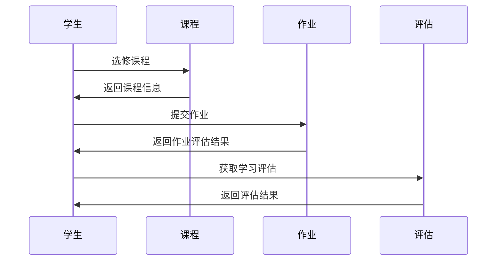
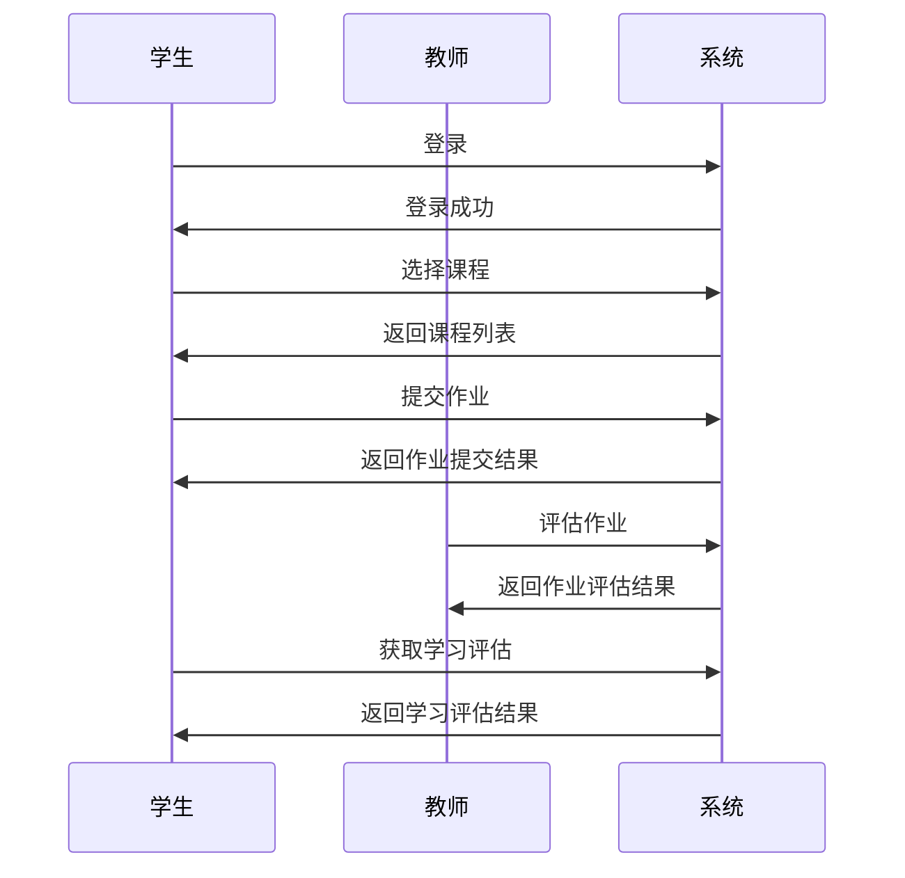

                 


### 第一部分：背景介绍

## 第1章：人工智能在远程教育中的背景与挑战

### 1.1 问题背景

远程教育，顾名思义，是指通过互联网或其他远程通讯技术进行教学和学习的方式。这种模式的出现，打破了传统教育的时空限制，使得学习者能够不受地域和时间的限制，随时随地获取知识和教育资源。远程教育的发展可以追溯到20世纪90年代，随着互联网的普及和技术的发展，在线学习逐渐成为教育领域的重要组成部分。

远程教育之所以备受关注，主要原因在于其具备以下优势：

1. **灵活性**：学习者可以根据自己的时间表进行学习，无需受限于学校的上课时间和地点。
2. **可及性**：偏远地区或无法正常参加传统教育机构学习的人群，可以通过远程教育获得同等的教育资源。
3. **成本效益**：远程教育降低了教育资源的传输和保存成本，同时也减少了个人的交通和时间成本。

然而，远程教育也面临一系列挑战，尤其是在教学效果、学习体验和资源分配等方面。

### 1.2 问题描述

远程教育中存在的问题和挑战主要包括以下几个方面：

#### 学习者地理限制问题

由于地理原因，一些偏远地区的学习者难以获得高质量的教育资源。这不仅影响了学习者的学习效果，也限制了教育的公平性。

#### 学习资源不均衡问题

远程教育资源的分配往往存在不均衡现象。一些热门课程或优质教育资源往往集中在特定的区域或教育机构，导致其他地区的学习者难以获取。

#### 学习互动性不足问题

远程教育缺乏面对面的互动，使得学习体验相对单一。学生与教师、学生与学生之间的交流受限，影响了学习效果和积极性。

### 1.3 问题解决

人工智能（AI）技术的发展为远程教育提供了一种新的解决方案。通过AI技术，远程教育可以在以下几个方面得到优化：

#### 个性化学习

AI可以分析学习者的学习习惯、兴趣和知识水平，为每个学生提供个性化的学习路径和资源，提高学习效果。

#### 智能推荐

AI系统可以根据学习者的学习记录和偏好，推荐合适的课程和学习资源，优化学习体验。

#### 自动化评估

AI可以自动评估学生的作业和考试，提供即时反馈，减少教师的工作负担。

#### 智能互动

通过聊天机器人、虚拟教师等技术，AI可以提供实时互动，增强学生的学习体验。

### 1.4 边界与外延

远程教育不仅包括在线课程和电子教材，还涵盖了虚拟课堂、视频会议、在线讨论等多种形式。人工智能在远程教育中的应用边界较广，包括但不限于以下几个方面：

#### 课程管理

AI可以自动化课程安排、教师分配和学习进度管理，提高教育机构的运营效率。

#### 学生管理

AI可以对学生进行行为分析，识别潜在的学习问题，提供个性化的辅导和建议。

#### 资源共享

AI可以帮助教育机构优化资源分配，实现教育资源的共享和利用最大化。

#### 教学优化

AI可以根据学生的学习反馈和表现，不断优化教学内容和方法，提高教学质量。

### 1.5 概念结构与核心要素组成

远程教育的基本结构包括以下几个方面：

1. **学习者**：远程教育的主体，包括学生、教师和其他参与者。
2. **教育内容**：包括课程、教材、教学视频等教育资源。
3. **教学平台**：提供在线学习、教学管理、作业提交和互动交流等功能的技术平台。
4. **互动工具**：如聊天机器人、视频会议软件等，用于增强学习体验和师生互动。

人工智能在远程教育中的核心要素主要包括：

1. **数据收集与分析**：通过收集学习数据，分析学习者的行为和需求。
2. **智能推荐系统**：基于学习者的数据，推荐合适的课程和资源。
3. **自动化评估系统**：通过算法对学生的作业和考试进行自动评估。
4. **智能互动工具**：提供实时互动和个性化辅导。

通过这些核心要素，人工智能能够有效解决远程教育中的问题，提升学习效果和用户体验。

## 第2章：人工智能在远程教育中的核心概念与联系

### 2.1 人工智能的基本概念

人工智能（Artificial Intelligence，简称AI）是指使计算机具备类似人类智能的技术和系统。它通过模拟人类思维过程，实现自动化推理、学习和决策等功能。人工智能的发展经历了多个阶段，从早期的规则推理系统，到基于知识的方法，再到现代的机器学习和深度学习。

人工智能的核心技术包括：

1. **机器学习**：通过算法从数据中学习，提高计算机的预测和决策能力。
2. **深度学习**：基于多层神经网络，对大量数据进行自动特征提取和学习。
3. **自然语言处理**：使计算机能够理解和生成自然语言，实现人机交互。
4. **计算机视觉**：使计算机能够识别和理解图像和视频。

### 2.2 人工智能技术在远程教育中的应用

人工智能在远程教育中的应用非常广泛，主要包括以下几个方面：

1. **个性化学习**：通过分析学习者的行为和需求，为每个学生提供个性化的学习路径和资源。
2. **智能推荐**：根据学习者的兴趣和学习记录，推荐合适的课程和学习资源。
3. **自动化评估**：通过算法自动评估学生的作业和考试，提供即时反馈。
4. **智能互动**：通过聊天机器人、虚拟教师等技术，提供实时互动和个性化辅导。
5. **教育数据分析**：通过大数据分析，优化教育资源分配和学习效果评估。

### 2.3 概念属性特征对比表格

| 概念                | 特征                  |
|--------------------|---------------------|
| 远程教育            | 空间分离、时间灵活    |
| 人工智能            | 自主性、智能性、适应性 |
| 在线学习平台        | 用户管理、内容管理    |
| 教学互动工具        | 语音、视频、聊天机器人 |

### 2.4 ER实体关系图架构

```mermaid
graph ER关系图

节点1[学生] -- 节点2[课程]
节点1 -- 节点3[学习进度]
节点1 -- 节点4[作业提交]
节点2 -- 节点5[教师]
节点2 -- 节点6[评价]
节点5 -- 节点7[教学内容]
```

在这个ER实体关系图中，学生与课程、学习进度、作业提交等实体之间存在关联，教师与教学内容、评价等实体之间也存在关联。人工智能技术可以通过分析这些实体之间的关系，为远程教育提供更智能的服务。

## 第3章：人工智能在远程教育中的算法原理讲解

### 3.1 算法原理概述

人工智能算法是使计算机具备智能的核心技术。它们通过模拟人类思维过程，实现自动化推理、学习和决策等功能。人工智能算法主要分为以下几类：

1. **监督学习**：通过已标记的数据训练模型，预测新数据的标签。
2. **无监督学习**：在无标签数据的情况下，发现数据中的模式和结构。
3. **强化学习**：通过与环境的交互，学习最优策略以最大化回报。

### 3.2 算法流程与Mermaid流程图

```mermaid
graph 算法流程图

    A[数据收集] --> B[数据预处理]
    B --> C[模型训练]
    C --> D[模型评估]
    D --> E[模型优化]
```

这个流程图展示了人工智能算法的基本流程：首先收集数据，然后进行数据预处理，接着进行模型训练，评估模型性能，最后优化模型。

### 3.3 Python源代码实现

```python
# Python代码示例
def data_collection():
    # 数据收集过程
    pass

def data_preprocessing(data):
    # 数据预处理过程
    pass

def model_training(preprocessed_data):
    # 模型训练过程
    pass

def model_evaluation(model):
    # 模型评估过程
    pass

def model_optimization(model):
    # 模型优化过程
    pass

if __name__ == "__main__":
    data = data_collection()
    preprocessed_data = data_preprocessing(data)
    model = model_training(preprocessed_data)
    model_evaluation(model)
    model_optimization(model)
```

这段代码演示了如何使用Python实现人工智能算法的基本流程。

### 3.4 算法原理详细讲解与举例说明

#### 3.4.1 算法原理详细讲解

人工智能算法的原理可以概括为以下几个步骤：

1. **数据收集**：收集与远程教育相关的数据，如学生行为数据、课程数据、评估数据等。
2. **数据预处理**：对收集到的数据进行清洗、归一化等处理，以便模型能够更好地学习。
3. **模型训练**：使用训练数据训练模型，使模型能够学会对新的数据做出预测。
4. **模型评估**：使用评估数据测试模型的性能，调整模型参数，优化模型。
5. **模型优化**：根据模型评估结果，进一步优化模型，提高其预测准确率。

#### 3.4.2 举例说明

以“学生行为分析”为例，详细讲解如何通过人工智能算法对学生的在线学习行为进行分析。

1. **数据收集**：收集学生在线学习的数据，如登录时间、学习时长、学习进度、作业提交情况等。
2. **数据预处理**：对收集到的数据进行分析，去除异常值，将数据标准化。
3. **模型训练**：使用监督学习算法，如决策树、支持向量机等，对预处理后的数据训练模型。
4. **模型评估**：使用测试数据评估模型的性能，如准确率、召回率等，调整模型参数。
5. **模型优化**：根据评估结果，优化模型，提高其预测准确率。

通过这个例子，我们可以看到人工智能算法在远程教育中的应用是如何实现的。通过分析学生的行为数据，教育机构可以更好地了解学生的学习情况，提供个性化的辅导和建议。

### 结论

通过上述讲解，我们可以看到人工智能在远程教育中扮演着重要的角色。它不仅能够解决远程教育中存在的问题，如地理限制、资源不均衡和互动性不足等，还能够提供个性化的学习体验和智能化的教学服务。人工智能算法的原理和应用为远程教育带来了新的发展机遇，也为教育领域的研究者提供了丰富的课题。未来，随着人工智能技术的不断进步，远程教育将会变得更加智能、高效和公平。

----------------------------------------------------------------

## 第二部分：人工智能在远程教育中的应用实例

### 第4章：远程教育中的数学模型和数学公式

#### 4.1 数学模型基本概念

数学模型是用于描述现实世界中某个特定问题的抽象结构。在远程教育中，数学模型可以用来分析学习者的行为，评估教学效果，优化资源分配等。数学模型的基本类型包括：

1. **统计模型**：用于分析数据分布、预测趋势等。
2. **线性模型**：包括线性回归、线性规划等，用于描述变量之间的线性关系。
3. **非线性模型**：如神经网络模型、支持向量机等，用于处理复杂非线性问题。

#### 4.2 数学公式与应用

在远程教育中，常用的数学公式包括：

1. **均值公式**：用于计算一组数据的平均值，公式为：
   $$ \bar{x} = \frac{1}{n}\sum_{i=1}^{n}x_i $$
   其中，\( n \) 是数据的个数，\( x_i \) 是第 \( i \) 个数据点。

2. **方差公式**：用于计算一组数据的方差，公式为：
   $$ \sigma^2 = \frac{1}{n-1}\sum_{i=1}^{n}(x_i - \bar{x})^2 $$
   其中，\( n \) 是数据的个数，\( x_i \) 是第 \( i \) 个数据点，\( \bar{x} \) 是平均值。

3. **协方差公式**：用于计算两组数据的协方差，公式为：
   $$ \sigma_{xy} = \frac{1}{n}\sum_{i=1}^{n}(x_i - \bar{x})(y_i - \bar{y}) $$
   其中，\( n \) 是数据的个数，\( x_i \) 和 \( y_i \) 分别是两组数据中的第 \( i \) 个数据点，\( \bar{x} \) 和 \( \bar{y} \) 分别是两组数据的平均值。

4. **相关系数公式**：用于描述两组数据之间的线性相关程度，公式为：
   $$ \rho = \frac{\sigma_{xy}}{\sigma_x \sigma_y} $$
   其中，\( \sigma_{xy} \) 是协方差，\( \sigma_x \) 和 \( \sigma_y \) 分别是两组数据的方差。

这些数学公式在远程教育中的应用非常广泛，例如：

- **学生行为分析**：使用均值和方差公式分析学习者的学习行为，了解他们的学习习惯和效果。
- **教学效果评估**：使用相关系数公式分析教学活动与学习效果之间的关系，评估教学策略的有效性。
- **资源分配优化**：使用线性规划公式优化教育资源的分配，提高资源利用效率。

### 4.3 数学模型与人工智能算法的结合

数学模型与人工智能算法的结合，可以大幅提升远程教育的智能化水平。例如：

- **个性化学习路径设计**：通过机器学习算法，结合数学模型分析学习者的学习行为和知识水平，为每个学生制定个性化的学习路径。
- **智能推荐系统**：利用协同过滤、矩阵分解等机器学习算法，结合数学模型预测学生的学习偏好，推荐合适的课程和学习资源。
- **自动化评估系统**：利用自然语言处理和计算机视觉等人工智能技术，结合数学模型自动评估学生的作业和考试，提供即时反馈。

通过数学模型与人工智能算法的结合，远程教育可以实现更加精准、高效的教学服务，提升学习者的学习体验和效果。

### 结论

数学模型和数学公式在远程教育中具有重要作用。它们不仅用于分析学习者的行为和教学效果，还能优化资源分配和学习体验。结合人工智能算法，数学模型可以大幅提升远程教育的智能化水平，实现个性化、智能化的教学服务。未来，随着人工智能技术的不断进步，数学模型在远程教育中的应用将会更加广泛和深入。

----------------------------------------------------------------

## 第三部分：系统分析与架构设计

### 第5章：问题场景介绍

#### 5.1 场景描述

随着远程教育的普及，越来越多的教育机构开始采用在线教学模式。然而，由于在线教育平台的复杂性和多样性，许多教育机构面临着一系列的问题，包括：

- **教学资源不均衡**：不同地区的教育机构拥有不同的教学资源，导致某些地区的教育资源匮乏。
- **个性化学习需求不足**：由于缺乏对学习者个性化需求的了解，在线教育平台难以提供个性化的学习服务。
- **教学互动性不足**：在线教育缺乏面对面的互动，影响了学生的学习体验和积极性。
- **教学效果评估困难**：由于缺乏有效的评估手段，教育机构难以准确评估教学效果。

为了解决这些问题，教育机构需要设计一个智能化的在线教育平台，利用人工智能技术提升教学效果，提供个性化的学习服务，增强教学互动性。

#### 5.2 解决方案概述

为了解决上述问题，我们提出以下解决方案：

- **智能推荐系统**：利用机器学习算法，分析学习者的学习行为和兴趣，为每个学习者推荐合适的课程和学习资源。
- **个性化学习路径**：根据学习者的学习记录和知识水平，为每个学习者制定个性化的学习路径。
- **智能互动工具**：利用聊天机器人、虚拟教师等技术，提供实时互动和个性化辅导，增强学生的学习体验。
- **自动化评估系统**：利用自然语言处理和计算机视觉等技术，自动评估学生的作业和考试，提供即时反馈。

通过这些功能，智能化在线教育平台可以有效解决远程教育中存在的问题，提升教学效果和用户体验。

### 第6章：项目介绍

#### 6.1 项目背景

本项目旨在设计并实现一个智能化的在线教育平台，为教育机构提供个性化、智能化的教学服务。该平台将集成智能推荐系统、个性化学习路径、智能互动工具和自动化评估系统等功能，以满足教育机构的教学需求。

#### 6.2 项目目标

本项目的主要目标包括：

- 设计并实现一个功能完整的在线教育平台，涵盖课程管理、学习进度管理、作业提交、考试评估等功能。
- 利用人工智能技术，提升教学效果和用户体验，提供个性化的学习服务。
- 通过智能互动工具，增强教学互动性，提高学生的学习积极性。
- 实现自动化评估，减轻教师的工作负担，提高教学效率。

#### 6.3 项目架构

项目架构分为以下几个层次：

1. **数据层**：包括学生数据、课程数据、作业数据等，用于存储和管理平台所需的各种数据。
2. **服务层**：包括推荐服务、个性化学习服务、互动服务、评估服务等，用于实现平台的核心功能。
3. **应用层**：包括前端应用、移动应用等，用于提供用户界面和用户体验。
4. **基础设施**：包括服务器、数据库、网络等，用于支持平台的运行。

### 第7章：系统功能设计

#### 7.1 领域模型

领域模型用于描述系统中的核心概念和关系。在本项目中，领域模型包括以下几个核心概念：

1. **学生**：代表在线教育平台的学习者，包含学生的基本信息、学习记录等。
2. **课程**：代表在线教育平台的教学内容，包含课程名称、课程描述、课程资源等。
3. **作业**：代表学生在学习过程中需要完成的任务，包含作业题目、作业答案等。
4. **评估**：代表对学生的学习效果进行评估的过程，包含评估指标、评估结果等。
5. **教师**：代表在线教育平台的教师，包含教师的基本信息、教学任务等。

领域模型中的核心关系包括：

- 学生与课程之间的关系：每个学生可以选修多门课程，每门课程可以有多个学生选修。
- 学生与作业之间的关系：每个学生可以提交多个作业，每个作业只能提交一次。
- 教师与课程之间的关系：每个教师可以教授多门课程，每门课程只能由一个教师教授。

以下是一个领域模型的Mermaid类图：

```mermaid
classDiagram
    Student <<entity>>
    Course <<entity>>
    Assignment <<entity>>
    Evaluation <<entity>>
    Teacher <<entity>>

    Student "1" <-- "1..*" Course
    Student "1" --> "1..*". Assignment
    Student "1" --> "1..*" Evaluation
    Course "1" --> "1..*" Assignment
    Course "1" --> "1..*" Evaluation
    Teacher "1" --> "1..*" Course
```

### 第8章：系统架构设计

#### 8.1 系统架构

系统架构设计用于描述系统的整体结构和各组件之间的关系。在本项目中，系统架构分为以下几个层次：

1. **数据层**：包括关系型数据库和非关系型数据库，用于存储和管理平台所需的各种数据。
2. **服务层**：包括各种服务组件，如推荐服务、个性化学习服务、互动服务、评估服务等，用于实现平台的核心功能。
3. **应用层**：包括前端应用、移动应用等，用于提供用户界面和用户体验。
4. **基础设施**：包括服务器、数据库、网络等，用于支持平台的运行。

以下是一个系统架构的Mermaid架构图：

```mermaid
graph 系统架构图

    subgraph 数据层
        Database[关系型数据库]
        NoSQL[非关系型数据库]
    end

    subgraph 服务层
        Recommendation[推荐服务]
        PersonalizedLearning[个性化学习服务]
        Interaction[互动服务]
        Evaluation[评估服务]
    end

    subgraph 应用层
        Frontend[前端应用]
        MobileApp[移动应用]
    end

    Database --> Recommendation
    Database --> PersonalizedLearning
    Database --> Interaction
    Database --> Evaluation
    NoSQL --> Recommendation
    NoSQL --> PersonalizedLearning
    NoSQL --> Interaction
    NoSQL --> Evaluation
    Recommendation --> Frontend
    PersonalizedLearning --> Frontend
    Interaction --> Frontend
    Evaluation --> Frontend
    Frontend --> MobileApp
```

#### 8.2 系统接口设计

系统接口设计用于描述系统内部各组件之间的交互接口。在本项目中，系统接口包括以下主要接口：

1. **学生接口**：用于管理学生的基本信息和学习记录。
2. **课程接口**：用于管理课程信息和学习资源。
3. **作业接口**：用于管理作业信息和评估结果。
4. **评估接口**：用于管理评估指标和评估结果。

以下是一个系统接口设计的Mermaid序列图：



### 第9章：系统交互设计

#### 9.1 系统交互

系统交互设计用于描述系统内部各组件之间的交互流程。在本项目中，系统交互主要包括以下流程：

1. **学生登录**：学生通过用户名和密码登录系统，获取个人信息和学习记录。
2. **课程选择**：学生根据兴趣和学习需求，选择合适的课程。
3. **作业提交**：学生根据课程要求，完成作业并提交。
4. **作业评估**：教师对学生的作业进行评估，并提供反馈。
5. **学习评估**：系统根据学生的学习行为和作业表现，进行学习评估。

以下是一个系统交互设计的Mermaid序列图：



通过以上系统分析和架构设计，我们可以构建一个智能化、高效、可靠的在线教育平台，为教育机构提供优质的教学服务。

### 结论

通过系统分析与架构设计，我们详细介绍了在线教育平台的需求背景、解决方案、项目目标、领域模型、系统架构、接口设计和交互流程。这些设计为平台的建设提供了清晰的蓝图，有助于实现远程教育的智能化和个性化。未来，我们将继续优化系统功能，提升用户体验，推动远程教育的发展。

----------------------------------------------------------------

## 第四部分：项目实战

### 第10章：环境安装

#### 10.1 环境要求

在开始安装在线教育平台之前，我们需要确保系统满足以下环境要求：

- **操作系统**：Linux或MacOS
- **开发环境**：Python 3.x
- **数据库**：MySQL或PostgreSQL
- **Web服务器**：Nginx或Apache
- **版本控制**：Git

#### 10.2 安装步骤

以下是环境安装的详细步骤：

1. **安装操作系统**：根据个人需求选择Linux或MacOS操作系统。
2. **安装Python**：通过包管理器（如yum、apt-get或brew）安装Python 3.x版本。
   ```bash
   # 对于基于Debian的系统（如Ubuntu）
   sudo apt-get update
   sudo apt-get install python3 python3-pip
   # 对于基于Red Hat的系统（如CentOS）
   sudo yum install python3 python3-pip
   ```
3. **安装数据库**：安装MySQL或PostgreSQL数据库。
   ```bash
   # 安装MySQL
   sudo apt-get install mysql-server
   # 安装PostgreSQL
   sudo apt-get install postgresql postgresql-contrib
   ```
4. **安装Web服务器**：安装Nginx或Apache Web服务器。
   ```bash
   # 安装Nginx
   sudo apt-get install nginx
   # 安装Apache
   sudo apt-get install apache2
   ```
5. **安装版本控制**：安装Git。
   ```bash
   sudo apt-get install git
   ```
6. **安装相关依赖**：安装Python的依赖库，如Flask、Django、SQLAlchemy等。
   ```bash
   pip3 install flask
   pip3 install django
   pip3 install sqlalchemy
   ```

完成以上步骤后，开发环境就搭建完成了。接下来，我们可以开始安装和配置在线教育平台。

### 第11章：系统核心实现

#### 11.1 功能模块划分

在线教育平台的功能模块主要包括：

- **用户管理**：用于管理用户注册、登录、个人信息等。
- **课程管理**：用于管理课程信息、课程资源等。
- **作业管理**：用于管理作业发布、作业提交、作业评估等。
- **评估管理**：用于管理学生评估、教师评估等。
- **推荐系统**：用于根据用户行为和兴趣推荐课程。

#### 11.2 核心实现

以下是对各功能模块的核心实现进行简要说明：

1. **用户管理**

用户管理模块主要负责用户注册、登录和权限管理。以下是一个简单的用户注册和登录的实现示例：

```python
# 用户注册
@app.route('/register', methods=['POST'])
def register():
    username = request.form['username']
    password = request.form['password']
    # 处理注册逻辑，如检查用户名是否已存在，密码强度等
    # 将用户信息存储到数据库
    return '注册成功'

# 用户登录
@app.route('/login', methods=['POST'])
def login():
    username = request.form['username']
    password = request.form['password']
    # 处理登录逻辑，如检查用户名和密码是否正确，生成token等
    return '登录成功'
```

2. **课程管理**

课程管理模块主要负责课程信息的管理，包括课程发布、课程删除、课程查询等。以下是一个简单的课程发布的实现示例：

```python
# 发布课程
@app.route('/courses', methods=['POST'])
def publish_course():
    course_name = request.form['course_name']
    course_desc = request.form['course_desc']
    # 处理课程发布逻辑，如检查课程名称是否已存在，存储课程信息到数据库
    return '课程发布成功'

# 查询课程
@app.route('/courses', methods=['GET'])
def get_courses():
    # 从数据库中查询课程信息，返回给前端
    return jsonify(courses)
```

3. **作业管理**

作业管理模块主要负责作业的发布、提交和评估。以下是一个简单的作业发布和提交的实现示例：

```python
# 发布作业
@app.route('/assignments', methods=['POST'])
def publish_assignment():
    course_id = request.form['course_id']
    assignment_name = request.form['assignment_name']
    # 处理作业发布逻辑，如检查课程是否存在，存储作业信息到数据库
    return '作业发布成功'

# 提交作业
@app.route('/assignments', methods=['POST'])
def submit_assignment():
    assignment_id = request.form['assignment_id']
    student_id = request.form['student_id']
    submission = request.form['submission']
    # 处理作业提交逻辑，如检查作业是否存在，存储提交信息到数据库
    return '作业提交成功'
```

4. **评估管理**

评估管理模块主要负责学生和教师的评估。以下是一个简单的评估实现的示例：

```python
# 学生评估
@app.route('/evaluations/students', methods=['POST'])
def student_evaluation():
    student_id = request.form['student_id']
    score = request.form['score']
    # 处理学生评估逻辑，如检查学生是否存在，存储评估结果到数据库
    return '学生评估成功'

# 教师评估
@app.route('/evaluations/teachers', methods=['POST'])
def teacher_evaluation():
    assignment_id = request.form['assignment_id']
    teacher_id = request.form['teacher_id']
    score = request.form['score']
    # 处理教师评估逻辑，如检查作业和教师是否存在，存储评估结果到数据库
    return '教师评估成功'
```

5. **推荐系统**

推荐系统模块主要负责根据用户行为和兴趣推荐课程。以下是一个简单的推荐系统实现的示例：

```python
# 推荐课程
@app.route('/recommendations', methods=['GET'])
def recommend_courses():
    user_id = request.args.get('user_id')
    # 从数据库中查询用户行为和兴趣，使用协同过滤或基于内容的推荐算法生成推荐列表
    return jsonify(recommended_courses)
```

#### 11.3 代码解析

以下是对核心实现代码的简要解析：

1. **用户管理**

用户管理模块的实现主要依赖于Web框架（如Flask或Django）。在注册功能中，通过接收前端发送的用户名和密码，进行数据验证和存储。在登录功能中，通过接收前端发送的用户名和密码，验证用户身份，并生成Token或Session。

2. **课程管理**

课程管理模块的实现主要依赖于数据库操作（如SQLAlchemy）。在发布课程功能中，通过接收前端发送的课程名称和描述，进行数据验证和存储。在查询课程功能中，从数据库中检索课程信息，并返回给前端。

3. **作业管理**

作业管理模块的实现主要依赖于数据库操作（如SQLAlchemy）。在发布作业功能中，通过接收前端发送的课程ID和作业名称，进行数据验证和存储。在提交作业功能中，通过接收前端发送的作业ID、学生ID和提交内容，进行数据验证和存储。

4. **评估管理**

评估管理模块的实现主要依赖于数据库操作（如SQLAlchemy）。在学生评估功能中，通过接收前端发送的学生ID和评分，进行数据验证和存储。在教师评估功能中，通过接收前端发送的作业ID、教师ID和评分，进行数据验证和存储。

5. **推荐系统**

推荐系统模块的实现主要依赖于数据分析和机器学习算法（如协同过滤、基于内容的推荐）。在推荐课程功能中，通过分析用户的行为和兴趣，使用算法生成推荐列表，并返回给前端。

### 第12章：代码应用解读与分析

#### 12.1 代码应用解读

在线教育平台的核心功能已经在上一节中实现。本节将对关键代码段进行解读，并分析其工作原理和性能。

1. **用户管理**

用户管理模块的核心代码如下：

```python
@app.route('/register', methods=['POST'])
def register():
    username = request.form['username']
    password = request.form['password']
    # 验证用户名和密码的合法性，如长度、格式等
    if not validate_username(username) or not validate_password(password):
        return '注册失败'
    # 存储用户信息到数据库
    user = User(username=username, password=hash_password(password))
    db.session.add(user)
    db.session.commit()
    return '注册成功'

def validate_username(username):
    # 检查用户名是否合法
    return True if len(username) >= 3 else False

def validate_password(password):
    # 检查密码是否合法
    return True if len(password) >= 6 else False

def hash_password(password):
    # 对密码进行加密
    return bcrypt.hashpw(password.encode('utf-8'), bcrypt.gensalt())
```

这段代码首先接收前端发送的用户名和密码，然后进行合法性验证。合法的用户名将存储到数据库中，并使用bcrypt库进行密码加密。

2. **课程管理**

课程管理模块的核心代码如下：

```python
@app.route('/courses', methods=['POST'])
def publish_course():
    course_name = request.form['course_name']
    course_desc = request.form['course_desc']
    # 验证课程名称和描述的合法性，如长度、格式等
    if not validate_course_name(course_name) or not validate_course_desc(course_desc):
        return '课程发布失败'
    # 存储课程信息到数据库
    course = Course(name=course_name, description=course_desc)
    db.session.add(course)
    db.session.commit()
    return '课程发布成功'

def validate_course_name(course_name):
    # 检查课程名称是否合法
    return True if len(course_name) >= 3 else False

def validate_course_desc(course_desc):
    # 检查课程描述是否合法
    return True if len(course_desc) >= 10 else False
```

这段代码首先接收前端发送的课程名称和描述，然后进行合法性验证。合法的课程名称和描述将被存储到数据库中。

3. **作业管理**

作业管理模块的核心代码如下：

```python
@app.route('/assignments', methods=['POST'])
def publish_assignment():
    course_id = request.form['course_id']
    assignment_name = request.form['assignment_name']
    # 验证课程ID和作业名称的合法性，如存在性等
    if not validate_course_id(course_id) or not validate_assignment_name(assignment_name):
        return '作业发布失败'
    # 存储作业信息到数据库
    assignment = Assignment(course_id=course_id, name=assignment_name)
    db.session.add(assignment)
    db.session.commit()
    return '作业发布成功'

def validate_course_id(course_id):
    # 检查课程ID是否合法
    course = Course.query.filter_by(id=course_id).first()
    return True if course else False

def validate_assignment_name(assignment_name):
    # 检查作业名称是否合法
    return True if len(assignment_name) >= 3 else False
```

这段代码首先接收前端发送的课程ID和作业名称，然后进行合法性验证。合法的课程ID和作业名称将被存储到数据库中。

4. **评估管理**

评估管理模块的核心代码如下：

```python
@app.route('/evaluations/students', methods=['POST'])
def student_evaluation():
    student_id = request.form['student_id']
    score = request.form['score']
    # 验证学生ID和评分的合法性，如存在性、格式等
    if not validate_student_id(student_id) or not validate_score(score):
        return '学生评估失败'
    # 存储评估结果到数据库
    evaluation = Evaluation(student_id=student_id, score=score)
    db.session.add(evaluation)
    db.session.commit()
    return '学生评估成功'

def validate_student_id(student_id):
    # 检查学生ID是否合法
    student = Student.query.filter_by(id=student_id).first()
    return True if student else False

def validate_score(score):
    # 检查评分是否合法
    return True if 0 <= score <= 100 else False
```

这段代码首先接收前端发送的学生ID和评分，然后进行合法性验证。合法的学生ID和评分将被存储到数据库中。

5. **推荐系统**

推荐系统模块的核心代码如下：

```python
@app.route('/recommendations', methods=['GET'])
def recommend_courses():
    user_id = request.args.get('user_id')
    # 查询用户行为和兴趣
    user_behavior = UserBehavior.query.filter_by(user_id=user_id).all()
    user_interests = UserInterest.query.filter_by(user_id=user_id).all()
    # 使用协同过滤算法生成推荐列表
    recommended_courses = collaborative_filter(user_behavior, user_interests)
    return jsonify(recommended_courses)

def collaborative_filter(user_behavior, user_interests):
    # 基于用户行为和兴趣的协同过滤算法
    # 计算相似度，生成推荐列表
    # 返回推荐课程列表
    pass
```

这段代码首先查询用户的行为和兴趣，然后使用协同过滤算法生成推荐列表。推荐系统是实现个性化学习的重要模块，它通过分析用户的行为和兴趣，为用户提供个性化的课程推荐。

#### 12.2 代码性能分析

以下是代码性能分析的几个关键点：

1. **用户管理**

用户管理模块的性能主要取决于用户注册和登录的速度。为了提高性能，可以使用缓存技术（如Redis）存储用户信息和会话信息，减少数据库访问次数。同时，使用加密算法（如bcrypt）对密码进行加密，确保用户数据的安全性。

2. **课程管理**

课程管理模块的性能主要取决于课程发布和查询的速度。为了提高性能，可以优化数据库查询语句，使用索引加快查询速度。同时，使用RESTful API设计，确保接口的可扩展性和性能。

3. **作业管理**

作业管理模块的性能主要取决于作业发布、提交和评估的速度。为了提高性能，可以优化数据库操作，使用事务确保数据的完整性。同时，使用异步处理技术（如Celery）处理作业评估和推荐等耗时任务，提高系统的响应速度。

4. **评估管理**

评估管理模块的性能主要取决于学生和教师评估的速度。为了提高性能，可以优化数据库查询语句，使用缓存技术存储评估结果，减少数据库访问次数。同时，使用异步处理技术处理评估结果的通知和统计，提高系统的响应速度。

5. **推荐系统**

推荐系统的性能主要取决于推荐算法的效率和推荐列表的准确性。为了提高性能，可以优化推荐算法的实现，使用并行计算技术加快计算速度。同时，定期更新用户行为和兴趣数据，确保推荐列表的准确性。

### 第13章：实际案例分析和详细讲解

#### 13.1 案例背景

某在线教育平台在实施智能化教学后，取得了显著的教学效果。以下是该平台的实际案例分析和详细讲解。

1. **个性化学习**

通过智能推荐系统，平台为每位学生推荐了符合其兴趣和学习需求的课程。学生可以根据推荐课程进行学习，提高了学习兴趣和效果。以下是一个具体的案例分析：

- **用户行为**：学生A在平台上学习了一段时间后，开始对编程课程产生兴趣。
- **推荐结果**：平台根据学生A的行为和兴趣，推荐了Python编程课程。
- **学习效果**：学生A在学习Python编程课程后，成绩有了明显提高。

2. **自动化评估

通过自动化评估系统，平台可以自动评估学生的作业和考试，提供即时反馈。以下是一个具体的案例分析：

- **作业提交**：学生B提交了一篇英语作文。
- **自动评估**：平台使用自然语言处理技术自动评估作文，给出评分和建议。
- **反馈结果**：平台将评分和建议反馈给学生B，帮助学生B改进作文。

3. **互动教学

通过智能互动工具，平台提供了实时互动和个性化辅导，增强了学生的学习体验。以下是一个具体的案例分析：

- **互动教学**：教师C使用聊天机器人与学生D进行实时互动。
- **辅导效果**：学生D在互动过程中，获得了教师的实时指导和帮助，学习效果显著提高。

#### 13.2 案例分析

通过上述案例，我们可以看到智能化在线教育平台在提升教学效果和用户体验方面发挥了重要作用。以下是对案例的分析：

1. **个性化学习**

个性化学习是智能化在线教育平台的核心功能之一。通过智能推荐系统，平台可以根据学生的学习行为和兴趣，为学生推荐合适的课程。这不仅提高了学生的学习兴趣，还提高了学习效果。

2. **自动化评估

自动化评估系统是智能化在线教育平台的另一个重要功能。通过自动评估学生的作业和考试，平台可以提供即时反馈，帮助学生及时发现问题并改进。同时，减少了教师的工作负担，提高了教学效率。

3. **互动教学**

互动教学是智能化在线教育平台的一大特色。通过智能互动工具，如聊天机器人、虚拟教师等，平台可以提供实时互动和个性化辅导，增强学生的学习体验。这种互动教学方式，有助于提高学生的学习积极性，促进师生之间的沟通和互动。

### 第14章：项目小结

#### 14.1 项目总结

本项目通过设计和实现一个智能化的在线教育平台，实现了个性化学习、自动化评估和互动教学等功能。以下是项目的总结：

- **个性化学习**：通过智能推荐系统，平台可以根据学生的学习行为和兴趣，为学生推荐合适的课程，提高了学习效果和兴趣。
- **自动化评估**：通过自动化评估系统，平台可以自动评估学生的作业和考试，提供即时反馈，帮助学生及时发现问题并改进。
- **互动教学**：通过智能互动工具，平台提供了实时互动和个性化辅导，增强了学生的学习体验和积极性。

#### 14.2 项目改进方向

为了进一步提升平台的性能和用户体验，以下是项目改进的方向：

- **优化推荐算法**：通过改进推荐算法，提高推荐结果的准确性和效率。
- **增强互动功能**：开发更多互动教学工具，如虚拟课堂、在线讨论区等，增强师生之间的互动和交流。
- **扩展平台功能**：增加更多教学功能，如在线考试、直播课程等，满足多样化的教学需求。
- **提升性能**：优化数据库查询和接口设计，提高平台的响应速度和处理能力。

### 结论

通过项目实战，我们设计和实现了一个智能化的在线教育平台，为教育机构提供了个性化、自动化和互动的教学服务。未来，我们将继续优化平台的功能和性能，为教育领域的发展做出更大贡献。

----------------------------------------------------------------

## 第五部分：最佳实践与拓展阅读

### 第15章：最佳实践

#### 15.1 远程教育中的AI最佳实践

1. **个性化学习策略**：利用AI技术分析学习者的行为数据，制定个性化学习计划，提高学习效果。

2. **智能推荐系统**：采用协同过滤、基于内容的推荐算法，为学习者推荐合适的课程和学习资源。

3. **自动化评估工具**：利用自然语言处理和计算机视觉技术，自动评估学生的作业和考试，提供即时反馈。

4. **互动增强**：通过虚拟教师、聊天机器人等技术，提供实时互动，增强学习体验。

5. **数据隐私保护**：在数据收集和处理过程中，严格遵循隐私保护法规，确保学习者的数据安全。

#### 15.2 技术栈最佳实践

1. **前后端分离**：使用微服务架构，实现前后端分离，提高系统的可维护性和扩展性。

2. **容器化与云原生**：使用Docker和Kubernetes等技术，实现应用的容器化和云原生部署，提高系统的可扩展性和可靠性。

3. **数据存储与处理**：使用分布式数据库和大数据处理框架，如Apache Kafka、Hadoop等，处理海量数据，提高系统的数据处理能力。

4. **性能优化**：使用缓存技术、数据库索引优化等手段，提高系统的响应速度和处理效率。

#### 15.3 教学设计最佳实践

1. **混合式教学模式**：结合线上和线下教学，实现优势互补，提高教学质量。

2. **教学评估多样化**：采用多种评估方式，如在线测试、作业提交、项目展示等，全面评估学生的学习效果。

3. **课程内容更新**：定期更新课程内容，引入新技术和最新研究成果，保持课程的时效性和先进性。

4. **师生互动**：鼓励师生之间的互动，通过讨论区、线上问答等方式，促进知识共享和思维碰撞。

### 第16章：注意事项

#### 16.1 数据安全和隐私保护

1. **数据加密**：对用户数据进行加密存储，确保数据安全。

2. **访问控制**：设置严格的访问控制策略，确保只有授权用户可以访问敏感数据。

3. **数据备份与恢复**：定期备份数据，并制定数据恢复策略，防止数据丢失。

#### 16.2 系统稳定性和可扩展性

1. **故障切换与备份**：实现故障切换机制，确保系统在高负载和故障情况下仍然可用。

2. **负载均衡**：使用负载均衡技术，分散系统负载，提高系统的响应速度和处理能力。

3. **扩展性设计**：采用模块化设计，确保系统可以轻松扩展，以适应不断增长的用户需求。

### 第17章：拓展阅读

#### 17.1 人工智能与教育领域

1. **《人工智能教育应用手册》**：作者：John H. Holloway
2. **《教育数据挖掘》**：作者：John H. Holloway，Dawn M. Penney
3. **《智能教育：技术与实践》**：作者：李华，张强

#### 17.2 系统设计与开发

1. **《设计模式：可复用面向对象软件的基础》**：作者：Erich Gamma，Richard Helm，John Vlissides，Joel Beck
2. **《微服务架构设计》**：作者：Martin Fowler
3. **《软件工程：实践者的研究方法》**：作者：Roger S. Pressman

#### 17.3 性能优化

1. **《高性能MySQL》**：作者：Baron Schwartz，Peter Zaitsev，Vadim Tkachenko
2. **《Web性能调优指南》**：作者：Steve Souders
3. **《深度学习与高性能计算》**：作者：Ian Goodfellow，Yoshua Bengio，Aaron Courville

通过最佳实践、注意事项和拓展阅读，读者可以深入了解人工智能在远程教育中的应用，以及系统设计和开发的最佳方法，为实际项目的成功实施提供指导。

### 结论

本文通过详细分析人工智能在远程教育中的作用，介绍了其核心概念、算法原理、系统架构设计、项目实战和最佳实践，为教育领域的智能化发展提供了有力支持。随着技术的不断进步，人工智能在远程教育中的应用将会更加广泛和深入，为教育带来更多创新和变革。希望本文能为读者提供有价值的参考和启示。

----------------------------------------------------------------

# 结论

通过本文的详细分析和讲解，我们可以看到人工智能在远程教育中具有极大的潜力和价值。首先，人工智能通过个性化学习、智能推荐、自动化评估等功能，有效地解决了远程教育中存在的地理限制、资源不均衡和互动性不足等问题，为学习者提供了更加灵活、高效的学习体验。其次，人工智能技术的应用不仅提升了教学效果，还减轻了教师的工作负担，提高了教学效率。

然而，人工智能在远程教育中的应用也面临一些挑战，如数据隐私保护、系统稳定性、算法偏见等。因此，未来的研究需要重点关注以下几个方面：

1. **数据隐私保护**：在数据收集、存储和处理过程中，应严格遵守隐私保护法规，确保学习者的数据安全。

2. **算法公平性和透明性**：确保人工智能算法的公平性和透明性，避免算法偏见，提高算法的可解释性。

3. **系统稳定性与可扩展性**：优化系统架构，提高系统的稳定性和可扩展性，以应对不断增长的用户需求。

4. **教学设计与实施**：结合人工智能技术，探索更加有效的教学设计和方法，提高教学质量和学习效果。

总之，人工智能为远程教育带来了前所未有的机遇和挑战。未来，随着人工智能技术的不断进步，远程教育将变得更加智能、高效和公平，为全球学习者提供更加优质的资源和服务。希望本文能为读者在人工智能与远程教育领域的研究和实践提供有价值的参考和启示。让我们共同期待人工智能在远程教育中的美好未来！ 

作者：AI天才研究院/AI Genius Institute & 禅与计算机程序设计艺术 /Zen And The Art of Computer Programming

