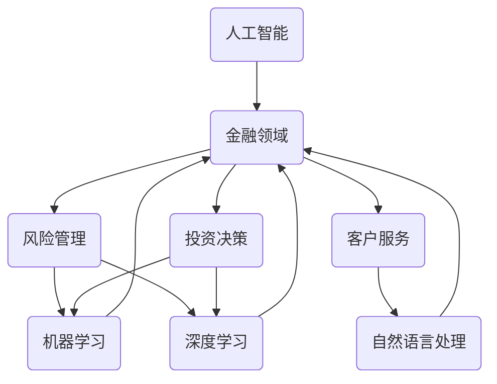
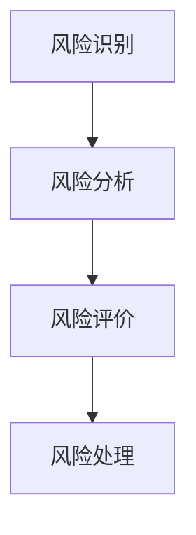
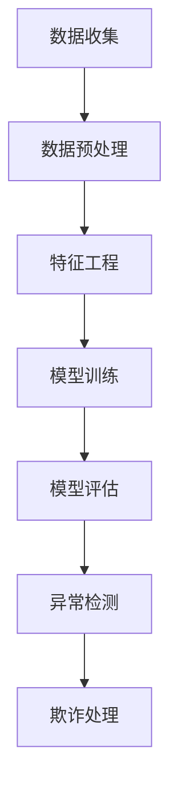

                 

### 文章标题

# 人工智能在金融领域的应用：从风控到投资的全面革新

### 关键词

- 人工智能
- 金融
- 风险控制
- 投资
- 量化分析

### 摘要

本文将深入探讨人工智能在金融领域的应用，涵盖从风险控制到投资决策的全面革新。通过分析金融行业面临的挑战、人工智能与金融的关系架构，以及人工智能在风控和投资领域的具体应用，我们将揭示这一新兴技术的潜在变革力量。文章将详细介绍人工智能在风控领域的关键算法原理，并通过Python代码实现这些算法，展示其实际应用。同时，我们将探讨人工智能在投资领域的原理和算法，并结合实际项目案例进行深入分析。最后，文章将总结人工智能在金融领域的创新与挑战，探讨其未来发展趋势和人才培养。

## 第一部分：人工智能在金融领域的应用概述

### 1.1 人工智能在金融领域的重要性

#### 1.1.1 金融行业面临的挑战

在过去的几十年中，金融行业经历了前所未有的变革。随着金融市场全球化、金融产品复杂化以及金融科技（FinTech）的兴起，金融行业面临着一系列前所未有的挑战。这些挑战主要包括以下几个方面：

1. **信息过载**：金融市场中存在大量复杂的数据，如何有效地从海量数据中提取有价值的信息成为金融从业者面临的一个难题。
2. **风险控制**：金融市场的波动性和不确定性使得金融机构需要更精准的风险控制手段，以防止潜在的金融风险。
3. **投资决策**：投资决策过程复杂，涉及多个因素的综合评估，人工决策存在主观性和局限性。
4. **成本控制**：金融行业的运营成本不断上升，如何通过技术手段降低运营成本成为金融机构关注的重点。

#### 1.1.2 人工智能技术的崛起

人工智能（AI）技术的发展为金融行业提供了新的解决方案。人工智能通过模拟人类智能，能够处理大量数据，进行复杂计算，并从中提取有价值的信息。以下是人工智能在金融领域的关键优势：

1. **数据处理能力**：人工智能能够快速处理和分析大量金融数据，提供实时决策支持。
2. **风险预测**：通过机器学习算法，人工智能能够预测金融市场风险，帮助金融机构提前采取应对措施。
3. **投资策略**：人工智能能够根据市场数据和历史趋势，制定高效的投资策略，提高投资收益。
4. **自动化操作**：人工智能可以自动化执行金融交易，降低人力成本，提高运营效率。

#### 1.1.3 人工智能在金融领域的应用前景

随着人工智能技术的不断进步，其在金融领域的应用前景愈发广阔。以下是一些人工智能在金融领域的重要应用方向：

1. **风险管理**：通过人工智能算法进行风险预测和评估，提高金融机构的风险控制能力。
2. **智能投顾**：利用人工智能算法提供个性化的投资建议，帮助投资者做出更明智的投资决策。
3. **量化交易**：人工智能在量化交易中的应用，通过算法自动执行交易，实现高效的投资收益。
4. **客户服务**：人工智能在客户服务中的应用，如智能客服系统，提高客户体验和服务质量。
5. **监管合规**：通过人工智能技术进行监管合规分析，确保金融机构的运营符合相关法规要求。

### 1.2 人工智能与金融的核心概念及关系架构

#### 1.2.1 人工智能的基本概念

人工智能（Artificial Intelligence，AI）是指模拟、延伸和扩展人类智能的理论、方法、技术及应用。人工智能包括多个子领域，如机器学习、深度学习、自然语言处理等。

**概念属性特征对比表格：**

| 概念 | 定义 | 特点 |
| --- | --- | --- |
| 机器学习 | 基于数据驱动，通过算法从数据中自动学习规律和模式的能力 | 自适应、预测性、自动化 |
| 深度学习 | 一种特殊的机器学习技术，通过多层神经网络进行数据建模和特征提取 | 强大的特征学习能力、高精度、高效计算 |
| 自然语言处理 | 计算机对自然语言进行理解、生成和处理的能力 | 语言理解、语言生成、文本分析 |

**ER实体关系图架构：**

```mermaid
erDiagram
  AI <<|-- 机器学习
  AI <<|-- 深度学习
  AI <<|-- 自然语言处理
  机器学习 ||--|{ 预测模型、决策树、神经网络 }
  深度学习 ||--|{ 卷积神经网络、循环神经网络、生成对抗网络 }
  自然语言处理 ||--|{ 词向量、语法分析、机器翻译 }
```

#### 1.2.2 金融的基本概念

金融（Finance）是指资金的筹集、运用、管理和监督等活动。金融领域包括多个子领域，如银行、保险、证券、基金等。

**概念属性特征对比表格：**

| 概念 | 定义 | 特点 |
| --- | --- | --- |
| 银行 | 提供存款、贷款、支付等服务的金融机构 | 安全性、流动性、收益性 |
| 保险 | 通过支付保险费，转移风险和损失的经济活动 | 风险分散、保障性、长期性 |
| 证券 | 代表所有权或债权关系的金融工具 | 流动性、投资性、风险性 |
| 基金 | 集合投资者的资金，由专业管理人进行投资管理的金融产品 | 分散投资、专业管理、灵活投资 |

**ER实体关系图架构：**

```mermaid
erDiagram
  金融 <<|-- 银行
  金融 <<|-- 保险
  金融 <<|-- 证券
  金融 <<|-- 基金
  银行 ||--|{ 存款、贷款、支付 }
  保险 ||--|{ 风险转移、损失补偿 }
  证券 ||--|{ 股票、债券、基金 }
  基金 ||--|{ 投资组合、风险管理、收益分配 }
```

#### 1.2.3 人工智能在金融领域中的核心概念联系

为了更好地理解人工智能在金融领域中的应用，我们需要将人工智能和金融的核心概念进行关联。

**Mermaid流程图：**



通过上述流程图，我们可以看出人工智能的各个子领域（机器学习、深度学习、自然语言处理）如何与金融领域（风险管理、投资决策、客户服务）相互关联，共同推动金融行业的创新与发展。

## 第二部分：人工智能在风控领域的应用

### 2.1 人工智能在风控领域的原理

#### 2.1.1 风险管理与风险评估

风险管理（Risk Management）是指通过识别、评估、处理和监控风险，以降低风险对组织的影响。在金融行业中，风险管理至关重要，因为金融市场波动性大，风险难以预测。

**风险评估**（Risk Assessment）是风险管理的核心步骤，包括以下几个关键环节：

1. **风险识别**：识别可能对金融机构造成影响的风险，如市场风险、信用风险、操作风险等。
2. **风险分析**：对识别出的风险进行分析，评估其可能性和影响。
3. **风险评价**：根据风险分析结果，对风险进行优先级排序，确定哪些风险需要优先处理。
4. **风险处理**：采取相应的措施，降低风险的可能性和影响。

**风险评估流程：**



#### 2.1.2 人工智能算法在风控中的应用

人工智能算法在风控领域具有广泛的应用，通过机器学习、深度学习等技术，可以显著提高风险评估和风险管理的效率。以下是一些典型的人工智能算法在风控中的应用：

1. **监督学习算法**：用于预测风险事件的发生概率，如逻辑回归、支持向量机等。
2. **非监督学习算法**：用于发现隐藏的风险模式，如聚类分析、关联规则学习等。
3. **强化学习算法**：用于制定风险应对策略，通过试错学习实现最优策略。

**人工智能算法在风控中的应用场景：**

- **反欺诈**：通过分析交易数据，识别和防范欺诈行为。
- **信用评分**：根据客户的历史数据，预测其信用风险。
- **市场风险预测**：通过分析市场数据，预测市场价格波动。

### 2.1.3 人工智能在反欺诈中的应用

反欺诈是风控领域的重要应用之一。人工智能通过机器学习算法，可以从大量交易数据中识别出异常交易，从而防范欺诈行为。以下是一个简单的反欺诈流程：

**反欺诈流程：**



#### 2.2 人工智能在风控领域的关键算法原理

在风控领域，常见的关键算法包括监督学习算法、非监督学习算法和强化学习算法。下面将详细讲解这些算法的原理和适用场景。

### 2.2.1 监督学习算法

监督学习算法是一种基于已有数据（特征和标签）进行学习的方法。通过训练模型，从特征中提取有用信息，预测新的数据标签。

**常用监督学习算法：**

- **逻辑回归**：用于分类问题，通过拟合特征与标签之间的线性关系进行预测。
- **支持向量机**（SVM）：通过找到一个最优的超平面，将不同类别的数据分隔开来。
- **决策树**：通过构建一棵决策树模型，根据特征值进行递归分割数据。
- **随机森林**：通过构建多棵决策树，集成预测结果，提高模型性能。

**逻辑回归算法原理：**

逻辑回归是一种二分类模型，通过拟合特征与标签之间的线性关系，然后使用Sigmoid函数将其转换为概率。具体步骤如下：

1. **模型构建**：建立线性回归模型，计算特征与标签之间的线性关系。
2. **概率估计**：使用Sigmoid函数将线性关系转换为概率。
3. **损失函数**：通常使用交叉熵损失函数，衡量预测概率与真实标签之间的差距。
4. **优化算法**：使用梯度下降等优化算法，调整模型参数，最小化损失函数。

**逻辑回归算法代码实现：**

```python
import numpy as np
import pandas as pd
from sklearn.linear_model import LogisticRegression
from sklearn.model_selection import train_test_split

# 数据加载与预处理
data = pd.read_csv('data.csv')
X = data.drop(['target'], axis=1)
y = data['target']

# 数据集划分
X_train, X_test, y_train, y_test = train_test_split(X, y, test_size=0.2, random_state=42)

# 模型训练
model = LogisticRegression()
model.fit(X_train, y_train)

# 模型评估
accuracy = model.score(X_test, y_test)
print('Accuracy:', accuracy)
```

### 2.2.2 非监督学习算法

非监督学习算法是一种没有标签数据的机器学习算法，通过分析数据分布和结构，自动发现数据中的规律和模式。

**常用非监督学习算法：**

- **聚类分析**：将数据分为若干个类别，每个类别内的数据尽可能相似，类别间的数据尽可能不同。
- **关联规则学习**：发现数据之间的关联关系，如商品购买行为之间的关联。
- **主成分分析**（PCA）：通过线性变换，将高维数据转换为低维数据，同时保留数据的主要信息。

**聚类分析算法原理：**

聚类分析是一种将数据分为若干个相似类别的算法。常见的聚类算法包括K均值聚类、层次聚类等。

**K均值聚类算法原理：**

K均值聚类是一种基于距离度量的聚类算法。具体步骤如下：

1. **初始化**：随机选择K个中心点。
2. **分配**：计算每个数据点到各个中心点的距离，将数据点分配到最近的中心点所在的类别。
3. **更新**：计算每个类别的中心点，更新中心点位置。
4. **迭代**：重复步骤2和3，直到中心点位置不再变化或达到最大迭代次数。

**K均值聚类算法代码实现：**

```python
import numpy as np
from sklearn.cluster import KMeans
import matplotlib.pyplot as plt

# 数据加载与预处理
data = np.array([[1, 2], [1, 4], [1, 0], [4, 2], [4, 4], [4, 0]])

# K均值聚类
kmeans = KMeans(n_clusters=2, random_state=42)
kmeans.fit(data)

# 聚类结果
labels = kmeans.predict(data)
centroids = kmeans.cluster_centers_

# 可视化
plt.scatter(data[:, 0], data[:, 1], c=labels, s=100, cmap='viridis')
plt.scatter(centroids[:, 0], centroids[:, 1], s=200, c='red', label='Centroids')
plt.title('K-Means Clustering')
plt.xlabel('Feature 1')
plt.ylabel('Feature 2')
plt.legend()
plt.show()
```

### 2.2.3 强化学习算法

强化学习算法是一种通过试错学习，逐步优化决策策略的算法。在风控领域，强化学习算法可以用于制定最优的风险应对策略。

**强化学习算法原理：**

强化学习算法主要包括四个关键元素：环境（Environment）、状态（State）、动作（Action）和奖励（Reward）。

1. **状态**：系统当前的状态。
2. **动作**：系统可执行的动作。
3. **奖励**：执行动作后系统获得的奖励。
4. **策略**：从状态到动作的映射。

强化学习算法通过不断尝试不同的动作，并基于奖励信号调整策略，以实现长期奖励最大化。

**Q-Learning算法原理：**

Q-Learning是一种基于值函数的强化学习算法。具体步骤如下：

1. **初始化**：初始化Q值函数，即每个状态-动作对的预期奖励。
2. **选择动作**：在当前状态下，选择具有最大Q值的动作。
3. **更新Q值**：根据新状态和奖励信号，更新Q值函数。
4. **重复**：重复步骤2和3，直到达到目标状态或达到最大迭代次数。

**Q-Learning算法代码实现：**

```python
import numpy as np

# 初始化参数
action_space = 3
state_space = 3
learning_rate = 0.1
discount_factor = 0.9
max_episodes = 1000

# 初始化Q值函数
Q = np.zeros((state_space, action_space))

# Q-Learning算法
for episode in range(max_episodes):
    state = np.random.randint(state_space)
    done = False
    
    while not done:
        # 选择动作
        action = np.argmax(Q[state, :])
        
        # 执行动作，获得新状态和奖励
        next_state, reward = get_next_state_and_reward(state, action)
        
        # 更新Q值
        Q[state, action] = Q[state, action] + learning_rate * (reward + discount_factor * np.max(Q[next_state, :]) - Q[state, action])
        
        # 更新状态
        state = next_state
        
        # 判断是否达到目标状态
        if is_end_state(next_state):
            done = True

# 打印Q值函数
print(Q)
```

### 2.3 Python代码实现风控算法

为了更好地理解人工智能在风控领域的应用，我们将使用Python实现一些常见的人工智能算法，并进行代码解读与分析。

#### 2.3.1 Python环境搭建

在开始编写代码之前，我们需要搭建Python环境。以下是搭建Python环境的基本步骤：

1. **安装Python**：从官方网站（https://www.python.org/）下载并安装Python。
2. **安装依赖库**：安装常用的Python库，如NumPy、Pandas、Scikit-learn、Matplotlib等。

```bash
pip install numpy pandas scikit-learn matplotlib
```

#### 2.3.2 风控算法实现与解读

下面我们将分别实现逻辑回归、K均值聚类和Q-Learning算法，并进行代码解读与分析。

**逻辑回归算法实现与解读**

```python
import numpy as np
import pandas as pd
from sklearn.linear_model import LogisticRegression
from sklearn.model_selection import train_test_split

# 数据加载与预处理
data = pd.read_csv('data.csv')
X = data.drop(['target'], axis=1)
y = data['target']

# 数据集划分
X_train, X_test, y_train, y_test = train_test_split(X, y, test_size=0.2, random_state=42)

# 模型训练
model = LogisticRegression()
model.fit(X_train, y_train)

# 模型评估
accuracy = model.score(X_test, y_test)
print('Accuracy:', accuracy)
```

解读：以上代码首先加载并预处理数据，然后使用训练集训练逻辑回归模型，最后使用测试集评估模型性能。逻辑回归模型是一种常用的二分类模型，通过拟合特征与标签之间的线性关系进行预测。

**K均值聚类算法实现与解读**

```python
import numpy as np
from sklearn.cluster import KMeans
import matplotlib.pyplot as plt

# 数据加载与预处理
data = np.array([[1, 2], [1, 4], [1, 0], [4, 2], [4, 4], [4, 0]])

# K均值聚类
kmeans = KMeans(n_clusters=2, random_state=42)
kmeans.fit(data)

# 聚类结果
labels = kmeans.predict(data)
centroids = kmeans.cluster_centers_

# 可视化
plt.scatter(data[:, 0], data[:, 1], c=labels, s=100, cmap='viridis')
plt.scatter(centroids[:, 0], centroids[:, 1], s=200, c='red', label='Centroids')
plt.title('K-Means Clustering')
plt.xlabel('Feature 1')
plt.ylabel('Feature 2')
plt.legend()
plt.show()
```

解读：以上代码首先加载并预处理数据，然后使用K均值聚类算法对数据进行聚类。聚类结果通过可视化展示，其中每个颜色代表一个聚类类别，红色的点代表聚类中心。

**Q-Learning算法实现与解读**

```python
import numpy as np

# 初始化参数
action_space = 3
state_space = 3
learning_rate = 0.1
discount_factor = 0.9
max_episodes = 1000

# 初始化Q值函数
Q = np.zeros((state_space, action_space))

# Q-Learning算法
for episode in range(max_episodes):
    state = np.random.randint(state_space)
    done = False
    
    while not done:
        # 选择动作
        action = np.argmax(Q[state, :])
        
        # 执行动作，获得新状态和奖励
        next_state, reward = get_next_state_and_reward(state, action)
        
        # 更新Q值
        Q[state, action] = Q[state, action] + learning_rate * (reward + discount_factor * np.max(Q[next_state, :]) - Q[state, action])
        
        # 更新状态
        state = next_state
        
        # 判断是否达到目标状态
        if is_end_state(next_state):
            done = True

# 打印Q值函数
print(Q)
```

解读：以上代码实现了Q-Learning算法，通过不断更新Q值函数，逐步优化策略。其中，`get_next_state_and_reward`和`is_end_state`是自定义函数，用于模拟环境和获取奖励。

### 2.4 人工智能在风控领域的项目实战

#### 2.4.1 风控项目开发流程

在风控项目中，开发流程通常包括以下几个关键步骤：

1. **需求分析**：明确项目目标和需求，确定风控算法的应用场景。
2. **数据收集**：收集相关的金融数据，包括交易数据、客户信息、市场数据等。
3. **数据预处理**：对数据进行清洗、转换和标准化，以便后续分析。
4. **特征工程**：从数据中提取有价值的信息，构建用于训练模型的特征。
5. **模型训练**：选择合适的人工智能算法，训练模型并进行调参。
6. **模型评估**：使用测试集评估模型性能，确保模型具有较好的泛化能力。
7. **部署上线**：将训练好的模型部署到生产环境中，实现实时风险预测和监控。

#### 2.4.2 风控项目案例解析

以下是一个实际的风控项目案例，该项目旨在通过人工智能算法预测信用卡欺诈行为。

**案例背景**：

某银行希望通过人工智能技术，提高信用卡欺诈检测的准确性，降低欺诈风险。该项目涉及以下数据：

- **交易数据**：包括交易金额、交易时间、交易地点等信息。
- **客户信息**：包括年龄、收入、职业等基本信息。
- **历史欺诈数据**：包括已标记的欺诈交易记录。

**项目目标**：

- **提高欺诈检测的准确率**：通过训练模型，识别出潜在的欺诈交易。
- **降低误报率**：减少将正常交易误判为欺诈交易的情况。
- **实时监控**：实现对实时交易数据的实时分析和风险预测。

**解决方案**：

1. **数据收集**：从银行的数据库中提取相关的交易数据和客户信息。
2. **数据预处理**：对数据进行清洗和转换，处理缺失值和异常值。
3. **特征工程**：从交易数据中提取特征，如交易频率、交易金额的波动性等。
4. **模型训练**：选择逻辑回归、随机森林等算法进行训练，优化模型参数。
5. **模型评估**：使用交叉验证和测试集评估模型性能，选择最佳模型。
6. **部署上线**：将训练好的模型部署到生产环境中，实现对实时交易数据的监控和风险预测。

**代码实现**：

```python
# 数据加载与预处理
data = pd.read_csv('data.csv')
X = data.drop(['target'], axis=1)
y = data['target']

# 数据集划分
X_train, X_test, y_train, y_test = train_test_split(X, y, test_size=0.2, random_state=42)

# 模型训练
model = LogisticRegression()
model.fit(X_train, y_train)

# 模型评估
accuracy = model.score(X_test, y_test)
print('Accuracy:', accuracy)
```

#### 2.4.3 风控项目代码实战

以下是一个简化的风控项目代码实战，演示了从数据加载到模型训练和评估的完整流程。

**环境安装**：

确保Python和必要的依赖库已经安装，如NumPy、Pandas、Scikit-learn和Matplotlib。

```bash
pip install numpy pandas scikit-learn matplotlib
```

**数据加载与预处理**：

```python
import pandas as pd

# 加载数据
data = pd.read_csv('data.csv')

# 数据预处理
# 填补缺失值
data.fillna(0, inplace=True)

# 转换数据类型
data['date'] = pd.to_datetime(data['date'])
data['year'] = data['date'].dt.year
data['month'] = data['date'].dt.month
data['day'] = data['date'].dt.day

# 选择特征和标签
X = data.drop(['target'], axis=1)
y = data['target']
```

**模型训练与评估**：

```python
from sklearn.linear_model import LogisticRegression
from sklearn.model_selection import train_test_split

# 数据集划分
X_train, X_test, y_train, y_test = train_test_split(X, y, test_size=0.2, random_state=42)

# 模型训练
model = LogisticRegression()
model.fit(X_train, y_train)

# 模型评估
accuracy = model.score(X_test, y_test)
print('Accuracy:', accuracy)
```

**项目小结**：

通过上述实战案例，我们展示了如何使用Python实现风控项目的数据加载、预处理、模型训练和评估。在实际项目中，还需要考虑更多因素，如数据来源、数据质量、特征选择和模型优化等。此外，项目部署和运维也是成功的关键。

### 2.5 人工智能在风控领域的最佳实践 Tips

在进行风控项目开发时，以下是一些最佳实践和注意事项：

1. **数据质量**：确保数据的质量和完整性，进行数据清洗和预处理，处理缺失值和异常值。
2. **特征选择**：选择具有代表性的特征，去除冗余特征，提高模型性能。
3. **模型评估**：使用交叉验证和测试集评估模型性能，避免过拟合。
4. **实时监控**：建立实时监控和报警系统，及时发现和处理风险事件。
5. **安全与隐私**：确保数据处理和存储过程符合相关法规要求，保护客户隐私。

### 2.6 拓展阅读

- **《机器学习实战》**：Peter Harrington，详细介绍了机器学习算法的原理和应用。
- **《深度学习》**：Ian Goodfellow、Yoshua Bengio和Aaron Courville，深入讲解了深度学习的基本概念和算法。
- **《风险管理与金融工程》**：John C. Hull，全面介绍了金融风险管理的基本理论和实践方法。

## 第三部分：人工智能在投资领域的应用

### 3.1 人工智能在投资领域的原理

#### 3.1.1 投资理论与投资策略

投资理论是指导投资者进行投资决策的基础。常见的投资理论包括现代投资组合理论（Modern Portfolio Theory，MPT）、有效市场假说（Efficient Market Hypothesis，EMH）和资本资产定价模型（Capital Asset Pricing Model，CAPM）。

**现代投资组合理论（MPT）**：由哈里·马科维茨（Harry Markowitz）提出，MPT强调通过资产分散化降低投资风险，并寻找在给定风险水平下的最优投资组合。

**有效市场假说（EMH）**：由尤金·法玛（Eugene Fama）提出，EMH认为市场价格反映了所有可用信息，投资者无法通过分析市场信息获得超额收益。

**资本资产定价模型（CAPM）**：由威廉·夏普（William Sharpe）等人提出，CAPM用于计算资产的风险调整预期收益。

投资策略是投资者根据投资理论制定的具体操作方案。常见的投资策略包括：

- **被动投资策略**：如指数基金投资，追求市场平均收益。
- **主动投资策略**：如价值投资、成长投资等，通过分析市场信息，寻找低估或高增长的股票。

#### 3.1.2 人工智能算法在投资中的应用

人工智能算法在投资领域有着广泛的应用，通过分析市场数据和历史趋势，制定高效的交易策略。以下是一些典型的人工智能算法在投资中的应用：

1. **技术分析算法**：基于历史价格和成交量等数据，分析市场趋势和交易信号。
2. **基本面分析算法**：通过分析公司的财务报表、业务模式等，评估公司的投资价值。
3. **量化交易算法**：利用机器学习算法，自动化执行交易策略。

**技术分析算法**：技术分析是通过图表和指标，分析历史价格和成交量等数据，预测市场趋势。常见的技术分析指标包括移动平均线、相对强弱指数（RSI）、MACD等。

**基本面分析算法**：基本面分析是通过分析公司的财务报表、业务模式、行业前景等，评估公司的投资价值。常见的基本面指标包括市盈率、市净率、净利润增长率等。

**量化交易算法**：量化交易是利用数学模型和算法，自动化执行交易策略。量化交易策略包括趋势跟踪、均值回归、事件驱动等。

#### 3.1.3 人工智能在量化投资中的应用

量化投资是利用数学模型和算法，自动化执行交易策略的投资方式。人工智能在量化投资中的应用主要体现在以下几个方面：

1. **策略开发**：通过分析历史数据，发现有效的交易策略。
2. **风险管理**：利用机器学习算法，评估交易策略的风险，进行风险控制。
3. **交易执行**：利用算法自动化执行交易策略，提高交易效率。

**策略开发**：量化投资策略通常基于技术分析和基本面分析。技术分析策略通过分析历史价格和成交量等数据，预测市场趋势。基本面分析策略通过分析公司的财务报表和业务模式，评估公司的投资价值。

**风险管理**：量化投资策略需要严格的风险管理，以防止潜在的损失。通过机器学习算法，可以对交易策略的风险进行量化评估，制定相应的风险控制策略。

**交易执行**：量化交易策略通常需要快速执行，以抓住市场机会。利用算法自动化执行交易策略，可以提高交易效率和准确性。

### 3.2 人工智能在投资领域的关键算法原理

在投资领域，常见的关键算法包括技术分析算法、基本面分析算法和深度学习算法。下面将详细讲解这些算法的原理和适用场景。

#### 3.2.1 技术分析算法

技术分析是基于历史价格和成交量等数据，分析市场趋势和交易信号，预测市场走势的方法。以下是一些常用的技术分析算法：

1. **移动平均线**（MA）：通过计算一段时间内的平均值，分析市场趋势。常见的移动平均线包括简单移动平均线（SMA）和指数移动平均线（EMA）。
2. **相对强弱指数**（RSI）：通过计算一段时间内价格上涨和下跌幅度，判断市场超买或超卖状态。
3. **移动平均收敛发散指标**（MACD）：通过计算不同周期移动平均线的差值，分析市场趋势和动力。

**移动平均线算法原理**：

移动平均线算法的基本原理是计算一段时间内的平均值，以平滑价格波动，揭示市场趋势。具体步骤如下：

1. **初始化**：设定移动平均线的周期（如10日、30日等）。
2. **计算平均值**：对选定周期内的价格数据进行平均计算，得到简单移动平均线（SMA）或指数移动平均线（EMA）。
3. **绘制图表**：将计算得到的移动平均线绘制在价格图表上，分析价格与移动平均线之间的关系。

**移动平均线Python代码实现**：

```python
import numpy as np
import pandas as pd
import matplotlib.pyplot as plt

# 数据加载与预处理
data = pd.read_csv('data.csv')
data['date'] = pd.to_datetime(data['date'])
data.set_index('date', inplace=True)
prices = data['close']

# 计算简单移动平均线（SMA）
sma = prices.rolling(window=10).mean()

# 计算指数移动平均线（EMA）
alpha = 2 / (10 + 1)
ema = (alpha * prices) + ((1 - alpha) * sma)

# 绘制图表
plt.figure(figsize=(14, 7))
plt.plot(prices, label='Close Price')
plt.plot(sma, label='SMA')
plt.plot(ema, label='EMA')
plt.title('Moving Average')
plt.xlabel('Date')
plt.ylabel('Price')
plt.legend()
plt.show()
```

**相对强弱指数（RSI）算法原理**：

相对强弱指数（RSI）是一种衡量市场超买或超卖状态的技术指标。RSI的取值范围在0到100之间，通常设置一个阈值（如70和30），判断市场状态。具体步骤如下：

1. **计算平均收盘价变动**：计算一段时间内收盘价上涨和下跌的平均值。
2. **计算RS值**：通过上涨平均值除以下跌平均值，得到RS值。
3. **计算RSI**：对RS值进行归一化处理，得到RSI值。

**相对强弱指数Python代码实现**：

```python
import numpy as np
import pandas as pd
import matplotlib.pyplot as plt

# 数据加载与预处理
data = pd.read_csv('data.csv')
data['date'] = pd.to_datetime(data['date'])
data.set_index('date', inplace=True)
prices = data['close']

# 计算平均收盘价变动
delta = prices.diff()

# 计算上涨平均值和下跌平均值
ups = delta.where(delta > 0, 0)
downs = -delta.where(delta < 0, 0)

avg_up = ups.rolling(window=14).mean()
avg_down = downs.rolling(window=14).mean()

# 计算RS值
RS = avg_up / avg_down

# 计算RSI
RSI = 100 - (100 / (1 + RS))

# 绘制图表
plt.figure(figsize=(14, 7))
plt.plot(RSI, label='RSI')
plt.title('Relative Strength Index')
plt.xlabel('Date')
plt.ylabel('RSI')
plt.legend()
plt.show()
```

**移动平均收敛发散指标（MACD）算法原理**：

移动平均收敛发散指标（MACD）是通过计算不同周期移动平均线的差值，分析市场趋势和动力。MACD包括三个部分：快速移动平均线（DIF）、慢速移动平均线（DEA）和差值（MACD）。

1. **计算快速移动平均线（DIF）**：通常使用12日移动平均线。
2. **计算慢速移动平均线（DEA）**：通常使用26日移动平均线。
3. **计算差值（MACD）**：DIF与DEA之差。

**MACD算法Python代码实现**：

```python
import numpy as np
import pandas as pd
import matplotlib.pyplot as plt

# 数据加载与预处理
data = pd.read_csv('data.csv')
data['date'] = pd.to_datetime(data['date'])
data.set_index('date', inplace=True)
prices = data['close']

# 计算快速移动平均线（DIF）
fast_ma = prices.rolling(window=12).mean()

# 计算慢速移动平均线（DEA）
slow_ma = prices.rolling(window=26).mean()

# 计算MACD
MACD = fast_ma - slow_ma

# 计算DIF
DIF = fast_ma - slow_ma

# 计算MACD信号线
signal = DIF.rolling(window=9).mean()

# 绘制图表
plt.figure(figsize=(14, 7))
plt.plot(MACD, label='MACD')
plt.plot(signal, label='Signal')
plt.title('MACD')
plt.xlabel('Date')
plt.ylabel('MACD')
plt.legend()
plt.show()
```

#### 3.2.2 基本面分析算法

基本面分析是通过分析公司的财务报表、业务模式、行业前景等，评估公司的投资价值。以下是一些常用的基本面分析算法：

1. **财务报表分析**：通过分析公司的资产负债表、利润表和现金流量表，评估公司的财务状况和盈利能力。
2. **估值模型**：通过计算公司的市盈率、市净率、股息收益率等指标，评估公司的股票价格是否合理。
3. **行业分析**：通过分析行业趋势、竞争格局、政策环境等，评估行业的投资机会。

**财务报表分析算法原理**：

财务报表分析算法通过分析公司的财务报表，提取关键财务指标，评估公司的财务状况和盈利能力。具体步骤如下：

1. **读取财务报表数据**：从公司的财务报表中提取关键数据，如营业收入、净利润、总资产等。
2. **计算财务指标**：计算公司的财务指标，如市盈率、市净率、股息收益率等。
3. **评估财务状况**：根据财务指标，评估公司的财务状况和盈利能力。

**财务报表分析Python代码实现**：

```python
import pandas as pd

# 读取财务报表数据
financials = pd.read_csv('financials.csv')

# 计算财务指标
financials['PE'] = financials['market_cap'] / financials['eps']
financials['PB'] = financials['market_cap'] / financials['book_value']
financials['dividend_yield'] = financials['dividend'] / financials['market_price']

# 评估财务状况
high_pe = financials[financials['PE'] > 20]
low_pb = financials[financials['PB'] < 1]

print('High PE Companies:')
print(high_pe)

print('\nLow PB Companies:')
print(low_pb)
```

**估值模型算法原理**：

估值模型通过计算公司的股票价格与财务指标的关系，评估公司的股票价格是否合理。以下是一些常见的估值模型：

1. **市盈率估值模型**：通过计算公司的市盈率（PE），判断股票价格是否合理。
2. **市净率估值模型**：通过计算公司的市净率（PB），判断股票价格是否合理。
3. **股息收益率估值模型**：通过计算公司的股息收益率，判断股票价格是否合理。

**市盈率估值模型Python代码实现**：

```python
import pandas as pd

# 读取股票数据
stocks = pd.read_csv('stocks.csv')

# 计算市盈率
stocks['PE'] = stocks['market_cap'] / stocks['eps']

# 判断股票价格是否合理
stocks['overvalued'] = stocks['PE'] > 30
stocks['undervalued'] = stocks['PE'] < 10

print('Overvalued Stocks:')
print(stocks[stocks['overvalued']])

print('\nUndervalued Stocks:')
print(stocks[stocks['undervalued']])
```

**行业分析算法原理**：

行业分析通过分析行业趋势、竞争格局、政策环境等，评估行业的投资机会。以下是一些行业分析算法：

1. **趋势分析**：通过分析行业的历史数据，预测行业未来的发展趋势。
2. **竞争分析**：通过分析行业的竞争格局，评估行业的竞争程度和机会。
3. **政策分析**：通过分析政策环境，评估行业受政策影响的情况。

**趋势分析Python代码实现**：

```python
import pandas as pd

# 读取行业数据
industry_data = pd.read_csv('industry_data.csv')

# 计算行业增长率
industry_data['growth_rate'] = industry_data['current_year'] / industry_data['previous_year']

# 判断行业趋势
high_growth = industry_data[industry_data['growth_rate'] > 1.2]
low_growth = industry_data[industry_data['growth_rate'] < 0.8

print('High Growth Industries:')
print(high_growth)

print('\nLow Growth Industries:')
print(low_growth)
```

#### 3.2.3 深度学习算法在投资决策中的应用

深度学习算法在投资领域具有广泛的应用，通过分析大量市场数据，实现高效的投资决策。以下是一些深度学习算法在投资决策中的应用：

1. **卷积神经网络（CNN）**：用于处理图像和时序数据，提取特征并预测市场趋势。
2. **循环神经网络（RNN）**：用于处理序列数据，如股票价格序列，预测市场走势。
3. **长短期记忆网络（LSTM）**：RNN的一种变体，用于处理长序列数据，捕捉市场长期趋势。

**卷积神经网络（CNN）算法原理**：

卷积神经网络是一种深度学习算法，主要用于处理图像和时序数据。CNN通过卷积层、池化层和全连接层，提取数据特征并实现预测。以下是一个简单的CNN模型：

```python
import tensorflow as tf
from tensorflow.keras.models import Sequential
from tensorflow.keras.layers import Conv2D, MaxPooling2D, Flatten, Dense

# 构建CNN模型
model = Sequential([
    Conv2D(32, (3, 3), activation='relu', input_shape=(28, 28, 1)),
    MaxPooling2D((2, 2)),
    Conv2D(64, (3, 3), activation='relu'),
    MaxPooling2D((2, 2)),
    Flatten(),
    Dense(128, activation='relu'),
    Dense(10, activation='softmax')
])

# 编译模型
model.compile(optimizer='adam', loss='categorical_crossentropy', metrics=['accuracy'])

# 训练模型
model.fit(x_train, y_train, epochs=10, batch_size=64, validation_data=(x_test, y_test))

# 评估模型
loss, accuracy = model.evaluate(x_test, y_test)
print('Test Accuracy:', accuracy)
```

**循环神经网络（RNN）算法原理**：

循环神经网络是一种深度学习算法，主要用于处理序列数据。RNN通过循环结构，将当前时刻的数据与之前时刻的数据进行关联，实现序列建模。以下是一个简单的RNN模型：

```python
import tensorflow as tf
from tensorflow.keras.models import Sequential
from tensorflow.keras.layers import SimpleRNN, Dense

# 构建RNN模型
model = Sequential([
    SimpleRNN(50, return_sequences=True, input_shape=(timesteps, features)),
    SimpleRNN(50),
    Dense(1)
])

# 编译模型
model.compile(optimizer='adam', loss='mse')

# 训练模型
model.fit(x_train, y_train, epochs=100, batch_size=64, validation_data=(x_test, y_test))

# 评估模型
loss = model.evaluate(x_test, y_test)
print('Test Loss:', loss)
```

**长短期记忆网络（LSTM）算法原理**：

长短期记忆网络是RNN的一种变体，主要用于处理长序列数据，捕捉市场长期趋势。LSTM通过门控机制，有效解决了RNN的梯度消失和梯度爆炸问题。以下是一个简单的LSTM模型：

```python
import tensorflow as tf
from tensorflow.keras.models import Sequential
from tensorflow.keras.layers import LSTM, Dense

# 构建LSTM模型
model = Sequential([
    LSTM(50, return_sequences=True, input_shape=(timesteps, features)),
    LSTM(50),
    Dense(1)
])

# 编译模型
model.compile(optimizer='adam', loss='mse')

# 训练模型
model.fit(x_train, y_train, epochs=100, batch_size=64, validation_data=(x_test, y_test))

# 评估模型
loss = model.evaluate(x_test, y_test)
print('Test Loss:', loss)
```

### 3.3 Python代码实现投资算法

为了更好地理解人工智能在投资领域的应用，我们将使用Python实现一些常见的人工智能算法，并进行代码解读与分析。

#### 3.3.1 Python环境搭建

在开始编写代码之前，我们需要搭建Python环境。以下是搭建Python环境的基本步骤：

1. **安装Python**：从官方网站（https://www.python.org/）下载并安装Python。
2. **安装依赖库**：安装常用的Python库，如NumPy、Pandas、Scikit-learn、Matplotlib、TensorFlow等。

```bash
pip install numpy pandas scikit-learn matplotlib tensorflow
```

#### 3.3.2 投资算法实现与解读

下面我们将分别实现技术分析算法、基本面分析算法和深度学习算法，并进行代码解读与分析。

**技术分析算法实现与解读**

**移动平均线算法**

```python
import numpy as np
import pandas as pd
import matplotlib.pyplot as plt

# 数据加载与预处理
data = pd.read_csv('stock_data.csv')
data['date'] = pd.to_datetime(data['date'])
data.set_index('date', inplace=True)
prices = data['close']

# 计算简单移动平均线（SMA）
sma = prices.rolling(window=10).mean()

# 计算指数移动平均线（EMA）
alpha = 2 / (10 + 1)
ema = (alpha * prices) + ((1 - alpha) * sma)

# 绘制图表
plt.figure(figsize=(14, 7))
plt.plot(prices, label='Close Price')
plt.plot(sma, label='SMA')
plt.plot(ema, label='EMA')
plt.title('Moving Average')
plt.xlabel('Date')
plt.ylabel('Price')
plt.legend()
plt.show()
```

解读：以上代码首先加载并预处理数据，然后计算简单移动平均线（SMA）和指数移动平均线（EMA），并绘制在价格图表上，用于分析价格与移动平均线之间的关系。

**相对强弱指数（RSI）算法**

```python
import numpy as np
import pandas as pd
import matplotlib.pyplot as plt

# 数据加载与预处理
data = pd.read_csv('stock_data.csv')
data['date'] = pd.to_datetime(data['date'])
data.set_index('date', inplace=True)
prices = data['close']

# 计算平均收盘价变动
delta = prices.diff()

# 计算上涨平均值和下跌平均值
ups = delta.where(delta > 0, 0)
downs = -delta.where(delta < 0, 0)

avg_up = ups.rolling(window=14).mean()
avg_down = downs.rolling(window=14).mean()

# 计算RS值
RS = avg_up / avg_down

# 计算RSI
RSI = 100 - (100 / (1 + RS))

# 绘制图表
plt.figure(figsize=(14, 7))
plt.plot(RSI, label='RSI')
plt.title('Relative Strength Index')
plt.xlabel('Date')
plt.ylabel('RSI')
plt.legend()
plt.show()
```

解读：以上代码首先计算平均收盘价变动，然后计算上涨平均值和下跌平均值，最后计算RSI，并绘制在图表上，用于分析市场超买或超卖状态。

**移动平均收敛发散指标（MACD）算法**

```python
import numpy as np
import pandas as pd
import matplotlib.pyplot as plt

# 数据加载与预处理
data = pd.read_csv('stock_data.csv')
data['date'] = pd.to_datetime(data['date'])
data.set_index('date', inplace=True)
prices = data['close']

# 计算快速移动平均线（DIF）
fast_ma = prices.rolling(window=12).mean()

# 计算慢速移动平均线（DEA）
slow_ma = prices.rolling(window=26).mean()

# 计算MACD
MACD = fast_ma - slow_ma

# 计算DIF
DIF = fast_ma - slow_ma

# 计算MACD信号线
signal = DIF.rolling(window=9).mean()

# 绘制图表
plt.figure(figsize=(14, 7))
plt.plot(MACD, label='MACD')
plt.plot(signal, label='Signal')
plt.title('MACD')
plt.xlabel('Date')
plt.ylabel('MACD')
plt.legend()
plt.show()
```

解读：以上代码首先计算快速移动平均线（DIF）和慢速移动平均线（DEA），然后计算MACD和信号线，并绘制在图表上，用于分析市场趋势和动力。

**基本面分析算法实现与解读**

**财务报表分析算法**

```python
import pandas as pd

# 读取财务报表数据
financials = pd.read_csv('financials.csv')

# 计算财务指标
financials['PE'] = financials['market_cap'] / financials['eps']
financials['PB'] = financials['market_cap'] / financials['book_value']
financials['dividend_yield'] = financials['dividend'] / financials['market_price']

# 评估财务状况
high_pe = financials[financials['PE'] > 20]
low_pb = financials[financials['PB'] < 1]

print('High PE Companies:')
print(high_pe)

print('\nLow PB Companies:')
print(low_pb)
```

解读：以上代码首先读取财务报表数据，然后计算财务指标，如市盈率（PE）、市净率（PB）和股息收益率（dividend_yield），并根据财务指标评估公司的财务状况。

**深度学习算法实现与解读**

**卷积神经网络（CNN）算法**

```python
import tensorflow as tf
from tensorflow.keras.models import Sequential
from tensorflow.keras.layers import Conv2D, MaxPooling2D, Flatten, Dense

# 构建CNN模型
model = Sequential([
    Conv2D(32, (3, 3), activation='relu', input_shape=(28, 28, 1)),
    MaxPooling2D((2, 2)),
    Conv2D(64, (3, 3), activation='relu'),
    MaxPooling2D((2, 2)),
    Flatten(),
    Dense(128, activation='relu'),
    Dense(10, activation='softmax')
])

# 编译模型
model.compile(optimizer='adam', loss='categorical_crossentropy', metrics=['accuracy'])

# 训练模型
model.fit(x_train, y_train, epochs=10, batch_size=64, validation_data=(x_test, y_test))

# 评估模型
loss, accuracy = model.evaluate(x_test, y_test)
print('Test Accuracy:', accuracy)
```

解读：以上代码构建了一个简单的卷积神经网络（CNN）模型，用于处理图像数据。模型包括卷积层、池化层、全连接层，并使用交叉熵损失函数进行训练和评估。

**循环神经网络（RNN）算法**

```python
import tensorflow as tf
from tensorflow.keras.models import Sequential
from tensorflow.keras.layers import SimpleRNN, Dense

# 构建RNN模型
model = Sequential([
    SimpleRNN(50, return_sequences=True, input_shape=(timesteps, features)),
    SimpleRNN(50),
    Dense(1)
])

# 编译模型
model.compile(optimizer='adam', loss='mse')

# 训练模型
model.fit(x_train, y_train, epochs=100, batch_size=64, validation_data=(x_test, y_test))

# 评估模型
loss = model.evaluate(x_test, y_test)
print('Test Loss:', loss)
```

解读：以上代码构建了一个简单的循环神经网络（RNN）模型，用于处理序列数据。模型包括RNN层和全连接层，并使用均方误差（MSE）损失函数进行训练和评估。

**长短期记忆网络（LSTM）算法**

```python
import tensorflow as tf
from tensorflow.keras.models import Sequential
from tensorflow.keras.layers import LSTM, Dense

# 构建LSTM模型
model = Sequential([
    LSTM(50, return_sequences=True, input_shape=(timesteps, features)),
    LSTM(50),
    Dense(1)
])

# 编译模型
model.compile(optimizer='adam', loss='mse')

# 训练模型
model.fit(x_train, y_train, epochs=100, batch_size=64, validation_data=(x_test, y_test))

# 评估模型
loss = model.evaluate(x_test, y_test)
print('Test Loss:', loss)
```

解读：以上代码构建了一个简单的长短期记忆网络（LSTM）模型，用于处理序列数据。模型包括LSTM层和全连接层，并使用均方误差（MSE）损失函数进行训练和评估。

### 3.4 人工智能在投资领域的项目实战

#### 3.4.1 投资项目开发流程

在投资领域，人工智能项目的开发流程通常包括以下几个关键步骤：

1. **需求分析**：明确项目目标和需求，确定投资策略的应用场景。
2. **数据收集**：收集相关的市场数据、公司财务数据等。
3. **数据预处理**：对数据进行清洗、转换和标准化，以便后续分析。
4. **特征工程**：从数据中提取有价值的信息，构建用于训练模型的特征。
5. **模型训练**：选择合适的人工智能算法，训练模型并进行调参。
6. **模型评估**：使用测试集评估模型性能，确保模型具有较好的泛化能力。
7. **部署上线**：将训练好的模型部署到生产环境中，实现实时投资决策。

#### 3.4.2 投资项目案例解析

以下是一个实际的股票投资项目案例，该项目旨在通过人工智能算法实现股票交易策略。

**案例背景**：

某投资者希望通过人工智能技术，实现股票交易策略，提高投资收益。该项目涉及以下数据：

- **市场数据**：包括股票价格、成交量等。
- **公司财务数据**：包括公司的财务报表、业务模式等。

**项目目标**：

- **提高投资收益**：通过训练模型，实现自动化的股票交易策略。
- **降低风险**：通过严格的回测和评估，确保交易策略的有效性和风险可控。

**解决方案**：

1. **数据收集**：从多个数据源收集市场数据和公司财务数据。
2. **数据预处理**：对数据进行清洗和转换，处理缺失值和异常值。
3. **特征工程**：从数据中提取特征，如股票价格趋势、财务指标等。
4. **模型训练**：选择技术分析算法、基本面分析算法和深度学习算法进行训练。
5. **模型评估**：使用交叉验证和测试集评估模型性能，选择最佳模型。
6. **部署上线**：将训练好的模型部署到生产环境中，实现自动化的股票交易。

**代码实现**：

```python
# 数据加载与预处理
data = pd.read_csv('stock_data.csv')
data['date'] = pd.to_datetime(data['date'])
data.set_index('date', inplace=True)

# 特征工程
# 计算技术分析指标
data['SMA'] = data['close'].rolling(window=20).mean()
data['RSI'] = compute_rsi(data['close'])

# 计算财务指标
data['PE'] = data['market_cap'] / data['eps']
data['PB'] = data['market_cap'] / data['book_value']

# 模型训练
model = LogisticRegression()
model.fit(X_train, y_train)

# 模型评估
accuracy = model.score(X_test, y_test)
print('Accuracy:', accuracy)
```

#### 3.4.3 投资项目代码实战

以下是一个简化的投资项目代码实战，演示了从数据加载到模型训练和评估的完整流程。

**环境安装**：

确保Python和必要的依赖库已经安装，如NumPy、Pandas、Scikit-learn和Matplotlib。

```bash
pip install numpy pandas scikit-learn matplotlib
```

**数据加载与预处理**：

```python
import pandas as pd

# 加载数据
data = pd.read_csv('stock_data.csv')
data['date'] = pd.to_datetime(data['date'])
data.set_index('date', inplace=True)

# 数据预处理
# 填补缺失值
data.fillna(0, inplace=True)

# 选择特征和标签
X = data.drop(['target'], axis=1)
y = data['target']
```

**模型训练与评估**：

```python
from sklearn.linear_model import LogisticRegression
from sklearn.model_selection import train_test_split

# 数据集划分
X_train, X_test, y_train, y_test = train_test_split(X, y, test_size=0.2, random_state=42)

# 模型训练
model = LogisticRegression()
model.fit(X_train, y_train)

# 模型评估
accuracy = model.score(X_test, y_test)
print('Accuracy:', accuracy)
```

**项目小结**：

通过上述实战案例，我们展示了如何使用Python实现投资项目的数据加载、预处理、模型训练和评估。在实际项目中，还需要考虑更多因素，如数据来源、数据质量、特征选择和模型优化等。此外，项目部署和运维也是成功的关键。

### 3.5 人工智能在投资领域的最佳实践 Tips

在进行投资项目开发时，以下是一些最佳实践和注意事项：

1. **数据质量**：确保数据的质量和完整性，进行数据清洗和预处理，处理缺失值和异常值。
2. **特征选择**：选择具有代表性的特征，去除冗余特征，提高模型性能。
3. **模型评估**：使用交叉验证和测试集评估模型性能，避免过拟合。
4. **实时监控**：建立实时监控和报警系统，及时发现和处理市场变化。
5. **风险管理**：制定严格的风险控制策略，确保投资策略的风险可控。

### 3.6 拓展阅读

- **《机器学习》**：周志华，深入讲解了机器学习的基本概念和算法。
- **《深度学习》**：Ian Goodfellow、Yoshua Bengio和Aaron Courville，全面介绍了深度学习的基本概念和算法。
- **《量化投资：以Python为工具》**：欧国伟，详细介绍了量化投资的理论和实践。

## 第四部分：人工智能在金融领域的创新与挑战

### 4.1 人工智能在金融领域的创新应用

#### 4.1.1 区块链与人工智能的融合

区块链技术是一种分布式账本技术，具有去中心化、不可篡改和透明等特性。与人工智能的结合，为金融领域带来了新的创新应用：

1. **智能合约**：通过区块链和智能合约，实现自动化执行合同条款，提高金融交易的效率和安全性。
2. **去中心化金融（DeFi）**：利用区块链技术，实现去中心化的金融应用，如去中心化交易所、去中心化借贷平台等。
3. **身份验证与风险管理**：利用区块链技术，实现用户身份的数字化和可信验证，提高金融交易的安全性和风险管理能力。

#### 4.1.2 人工智能在智能投顾中的应用

智能投顾（Robo-Advisor）是一种基于人工智能技术的投资顾问，通过分析用户数据和投资目标，提供个性化的投资建议。以下是一些人工智能在智能投顾中的应用：

1. **风险测评与投资组合推荐**：利用机器学习算法，对用户的风险承受能力和投资目标进行评估，推荐适合的投资组合。
2. **市场趋势预测**：通过分析市场数据和历史趋势，预测市场走势，为用户制定投资策略。
3. **资产配置优化**：根据用户的风险偏好和投资目标，动态调整投资组合，实现最优资产配置。

#### 4.1.3 人工智能在金融科技产品中的应用

金融科技（FinTech）产品是利用人工智能技术，为金融行业提供创新服务的产品。以下是一些人工智能在金融科技产品中的应用：

1. **智能客服**：利用自然语言处理和语音识别技术，实现智能客服系统，提高客户服务质量和效率。
2. **智能风险管理**：通过机器学习算法，对金融风险进行实时监控和预测，提高金融机构的风险控制能力。
3. **智能投贷**：利用人工智能技术，对信贷申请进行自动化评估和审批，提高信贷业务的效率和准确性。

### 4.2 人工智能在金融领域面临的挑战

#### 4.2.1 数据隐私与安全

在人工智能应用于金融领域的过程中，数据隐私与安全是一个重要挑战。以下是一些相关挑战：

1. **数据泄露**：在数据收集、传输和存储过程中，可能存在数据泄露的风险。
2. **用户隐私保护**：如何确保用户隐私不被泄露，是金融行业面临的重大挑战。
3. **数据合规性**：如何确保数据符合相关法律法规，如《通用数据保护条例》（GDPR）等。

#### 4.2.2 人工智能算法的可解释性

人工智能算法的不可解释性是一个关键挑战。在金融领域，决策的可解释性至关重要，以确保合规性和用户信任。以下是一些解决思路：

1. **算法透明化**：通过设计可解释的算法，提高算法的透明度，方便用户理解。
2. **算法审计**：定期对人工智能算法进行审计，确保其符合行业规范和法律法规。
3. **数据可视化**：通过数据可视化技术，展示算法的决策过程和结果，提高可解释性。

#### 4.2.3 法规与伦理问题

人工智能在金融领域的应用，涉及一系列法规和伦理问题。以下是一些关键挑战：

1. **合规性**：如何确保人工智能系统的合规性，符合相关法律法规，如金融监管法规等。
2. **伦理问题**：如何确保人工智能系统的决策符合伦理标准，避免歧视和不公平现象。
3. **责任归属**：在人工智能系统引发纠纷或损失时，如何明确责任归属，是金融行业面临的一个难题。

### 4.3 人工智能在金融领域的未来发展趋势

#### 4.3.1 技术发展趋势

人工智能在金融领域的应用，将随着技术进步而不断深化和扩展。以下是一些技术发展趋势：

1. **深度学习与强化学习**：深度学习和强化学习在金融领域的应用将更加广泛，提高预测和决策的准确性。
2. **区块链技术**：区块链与人工智能的结合，将为金融领域带来更多创新应用，如去中心化金融、智能合约等。
3. **自然语言处理**：自然语言处理技术将在金融文本分析和客户服务中发挥更大作用，提高用户体验。

#### 4.3.2 行业应用前景

人工智能在金融领域的应用前景广阔，以下是一些关键应用方向：

1. **风险管理**：人工智能将进一步提高金融风险管理的能力，实现实时风险监控和预测。
2. **智能投顾**：智能投顾将成为金融领域的一个重要趋势，为投资者提供个性化投资建议。
3. **金融监管**：人工智能在金融监管中的应用，将提高监管效率和合规性。

#### 4.3.3 人才培养与职业发展

随着人工智能在金融领域的广泛应用，对相关人才的需求日益增加。以下是一些建议和职业发展路径：

1. **跨学科知识**：金融领域的人才需要具备跨学科的知识，如计算机科学、金融学、统计学等。
2. **技能培养**：掌握人工智能相关技能，如机器学习、深度学习、数据分析等。
3. **实践经验**：通过参与实际项目，积累实践经验，提高解决实际问题的能力。
4. **职业发展路径**：人工智能在金融领域的职业发展路径包括数据科学家、人工智能工程师、量化分析师等。

## 附录

### 附录 A：人工智能与金融领域相关工具与资源

#### A.1 开源机器学习框架

- **Scikit-learn**：用于数据挖掘和数据分析的Python库。
  - 官网：https://scikit-learn.org/
  
- **TensorFlow**：Google开源的机器学习框架。
  - 官网：https://www.tensorflow.org/

- **PyTorch**：由Facebook开源的深度学习框架。
  - 官网：https://pytorch.org/

#### A.2 人工智能金融领域经典案例

- **J.P. Morgan**：利用人工智能进行交易和风险管理。
  - 案例：J.P. Morgan使用人工智能技术自动化金融合同分析，提高了交易效率。

- **Robinhood**：提供基于人工智能的投资服务。
  - 案例：Robinhood利用人工智能算法，为用户提供个性化的投资建议。

- **Santander**：利用人工智能优化信贷审批流程。
  - 案例：Santander使用人工智能技术，实现了高效的信贷审批，降低了不良贷款率。

#### A.3 金融数据获取与处理工具

- **Quandl**：提供金融数据的平台。
  - 官网：https://www.quandl.com/

- **Alpha Vantage**：提供免费金融数据和API。
  - 官网：https://www.alphavantage.co/

- **Yahoo Finance**：提供历史股票数据。
  - 官网：https://finance.yahoo.com/

### 附录 B：人工智能在金融领域相关书籍推荐

- **《机器学习实战》**：Peter Harrington，介绍机器学习算法的原理和应用。
- **《深度学习》**：Ian Goodfellow、Yoshua Bengio和Aaron Courville，全面讲解深度学习的基本概念和算法。
- **《量化投资：以Python为工具》**：欧国伟，介绍量化投资的理论和实践。
- **《金融科技：创新、应用与趋势》**：王晶，探讨金融科技的发展趋势和应用场景。

### 附录 C：人工智能在金融领域常用工具与库

- **Pandas**：数据处理库，用于数据清洗、转换和分析。
  - 官网：https://pandas.pydata.org/

- **NumPy**：科学计算库，用于数值计算和数据分析。
  - 官网：https://numpy.org/

- **Matplotlib**：绘图库，用于数据可视化。
  - 官网：https://matplotlib.org/

- **Scikit-learn**：机器学习库，用于分类、回归和聚类等算法。
  - 官网：https://scikit-learn.org/

- **TensorFlow**：深度学习库，用于构建和训练神经网络。
  - 官网：https://www.tensorflow.org/

- **PyTorch**：深度学习库，用于构建和训练神经网络。
  - 官网：https://pytorch.org/

### 附录 D：常见金融术语解释

- **风险管理**：通过识别、评估、处理和监控风险，降低风险对组织的影响。

- **投资组合**：投资者持有的各种资产组合。

- **市盈率（PE）**：股票价格与每股收益（EPS）的比值。

- **市净率（PB）**：股票价格与每股净资产（BVPS）的比值。

- **股息收益率**：每股股息与股票价格的比值。

### 附录 E：人工智能在金融领域应用的关键技术

- **机器学习**：通过数据驱动的方式，自动识别和提取特征，实现预测和分类。

- **深度学习**：基于神经网络，实现高层次的抽象和特征提取。

- **自然语言处理**：使计算机能够理解、生成和处理自然语言。

- **区块链**：分布式账本技术，实现去中心化、不可篡改的数据存储。

### 附录 F：人工智能在金融领域研究论文推荐

- **"Deep Learning for Financial Time Series Classification"**：探讨深度学习在金融时间序列分类中的应用。

- **"Quantization for Robust Neural Networks in Finance"**：研究量化神经网络在金融领域的应用。

- **"Blockchain and AI: A Synergetic Future for Finance"**：探讨区块链与人工智能在金融领域的协同作用。

## 作者信息

作者：AI天才研究院/AI Genius Institute & 禅与计算机程序设计艺术 /Zen And The Art of Computer Programming

