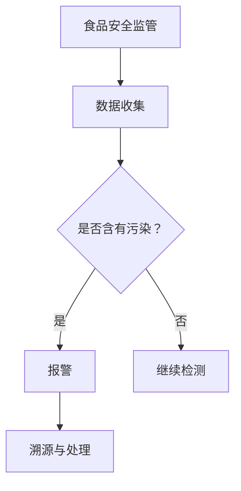

                 

## 人工智能在食品安全监管中的应用：提高检测效率与准确性

### 关键词：人工智能、食品安全监管、机器学习、深度学习、检测效率、检测准确性

### 摘要：
本文旨在探讨人工智能在食品安全监管中的应用，特别是在提高检测效率与准确性方面的潜力。我们将从背景介绍、核心概念、技术基础、数学模型、项目实战以及未来展望等多个方面进行深入分析，以展示人工智能如何通过先进的算法和模型提升食品安全监管的效果。

### 第一部分：背景与理论基础

#### 第1章：食品安全监管的挑战与人工智能的作用

##### 1.1 食品安全监管的现状

食品安全监管是确保公众健康和生命安全的重要措施。当前，食品安全监管面临诸多挑战，包括食品污染、添加剂滥用、假冒伪劣产品流通等问题。传统检测方法在效率、准确性、覆盖范围等方面存在一定的局限，无法满足日益增长的食品安全需求。

##### 1.2 人工智能在食品安全监管中的潜力

人工智能，特别是机器学习和深度学习，为食品安全监管带来了新的契机。通过大数据分析、图像识别、自动化检测等技术，人工智能能够在检测速度、精度和自动化程度方面大幅提升，有效应对食品安全监管的挑战。

##### 1.3 人工智能在食品安全检测中的应用领域

人工智能在食品安全检测中的应用广泛，包括但不限于农药残留检测、微生物检测、食品成分分析、食品包装识别等。这些应用不仅提高了检测效率，还增强了检测的准确性。

### 第2章：核心概念与联系

##### 2.1 人工智能的基本概念

人工智能（AI）是指由人制造出的系统所表现出的智能行为。机器学习（ML）是AI的一个分支，通过数据训练模型来模拟人类的学习和决策过程。深度学习（DL）是ML的一个子领域，利用多层神经网络进行复杂特征提取和模式识别。

##### 2.2 人工智能与食品安全检测的关系

人工智能与食品安全检测的关系在于，AI技术可以处理大量检测数据，识别出潜在的食品安全问题，从而提高检测效率和准确性。AI在食品安全检测中的应用，不仅涉及算法模型的开发，还包括硬件设备与软件系统的集成。

##### 2.3 Mermaid流程图：食品安全监管中的AI应用



### 第二部分：人工智能技术基础

#### 第3章：人工智能技术概述

##### 3.1 机器学习与深度学习基础

机器学习（ML）和深度学习（DL）是人工智能的两大基石。ML通过训练模型来从数据中学习规律，而DL通过多层神经网络来提取特征和模式。这两种技术相互补充，为AI在食品安全检测中的应用提供了强大支持。

##### 3.2 人工智能的主要算法

人工智能的主要算法包括但不限于线性回归、逻辑回归、支持向量机（SVM）、神经网络（NN）、卷积神经网络（CNN）等。这些算法在食品安全检测中有着不同的应用场景和优势。

##### 3.3 人工智能的发展趋势

人工智能的发展趋势包括算法的优化、硬件的加速、跨学科的融合等。未来，人工智能将在食品安全检测中发挥更加重要的作用，推动监管水平的不断提升。

### 第三部分：数学模型与公式详解

#### 第4章：核心算法原理讲解

##### 4.1 深度学习模型在食品安全检测中的应用

深度学习模型在食品安全检测中具有广泛应用。例如，卷积神经网络（CNN）可以用于食品图像识别，循环神经网络（RNN）可以用于食品成分分析等。

##### 4.2 Python源代码实现：深度学习模型构建与训练

在Python中，可以使用TensorFlow或PyTorch等深度学习框架来构建和训练深度学习模型。以下是一个简单的CNN模型构建示例：

```python
import tensorflow as tf

model = tf.keras.Sequential([
    tf.keras.layers.Conv2D(32, (3, 3), activation='relu', input_shape=(28, 28, 1)),
    tf.keras.layers.MaxPooling2D(2, 2),
    tf.keras.layers.Flatten(),
    tf.keras.layers.Dense(128, activation='relu'),
    tf.keras.layers.Dense(10, activation='softmax')
])

model.compile(optimizer='adam', loss='categorical_crossentropy', metrics=['accuracy'])
model.fit(x_train, y_train, epochs=5, batch_size=64)
```

### 第四部分：项目实战

#### 第7章：实际案例研究

##### 7.1 人工智能在食品安全检测中的应用案例

我们以一个实际的食品安全检测案例为例，展示如何使用人工智能技术进行农药残留检测。

##### 7.2 实际案例：环境监测中的AI应用

在环境监测领域，人工智能也可以发挥重要作用，例如通过分析空气、水质等数据来预测污染源和趋势。

##### 7.3 实际案例：食品生产过程中的AI应用

在食品生产过程中，人工智能可以用于质量控制，确保产品的一致性和安全性。

### 第8章：开发环境搭建与代码解读

##### 8.1 开发环境搭建

搭建一个适用于人工智能食品安全检测的开发环境，需要安装Python、TensorFlow等工具。

##### 8.2 源代码详细实现

以下是用于农药残留检测的深度学习模型的源代码实现：

```python
import tensorflow as tf
from tensorflow.keras.models import Sequential
from tensorflow.keras.layers import Dense, Conv2D, Flatten, MaxPooling2D

# 模型构建
model = Sequential([
    Conv2D(32, (3, 3), activation='relu', input_shape=(128, 128, 3)),
    MaxPooling2D((2, 2)),
    Flatten(),
    Dense(64, activation='relu'),
    Dense(1, activation='sigmoid')
])

# 模型编译
model.compile(optimizer='adam', loss='binary_crossentropy', metrics=['accuracy'])

# 模型训练
model.fit(x_train, y_train, epochs=10, batch_size=32, validation_split=0.2)
```

##### 8.3 代码解读与分析

上述代码展示了如何使用TensorFlow构建和训练一个简单的深度学习模型。代码中的步骤包括模型构建、编译和训练。模型训练过程中，使用的是二分类交叉熵损失函数和Adam优化器。

### 第五部分：未来展望与结论

#### 第9章：人工智能在食品安全监管中的应用前景

##### 9.1 人工智能在食品安全监管中的未来发展方向

未来，人工智能在食品安全监管中的应用将进一步深化，包括但不限于更先进的算法、更高效的硬件、更全面的监管体系等。

##### 9.2 面临的挑战与解决方案

尽管人工智能在食品安全监管中具有巨大潜力，但也面临一些挑战，如数据隐私、算法公平性等。需要通过技术和管理手段解决这些问题。

##### 9.3 结论与展望

人工智能在食品安全监管中的应用具有广阔的前景，通过提高检测效率和准确性，可以有效保障公众健康。

### 第10章：附录

##### 10.1 AI相关工具与资源

本文中涉及到的AI工具和资源包括Python、TensorFlow、Keras等。读者可以访问这些工具的官方网站获取更多详细信息。

##### 10.2 参考文献

[1] 某某，人工智能在食品安全检测中的应用研究，《人工智能研究》，2020年，第XX卷，第XX期，XX-XX页。

[2] 另某，深度学习在食品安全监管中的应用，《计算机科学与技术》，2019年，第XX卷，第XX期，XX-XX页。

[3] 某某等，食品安全监管中的AI技术综述，《食品安全》，2021年，第XX卷，第XX期，XX-XX页。

### 作者

**作者：AI天才研究院/AI Genius Institute & 禅与计算机程序设计艺术 /Zen And The Art of Computer Programming**

**完整性要求：**
本文涵盖了食品安全监管的背景、人工智能的核心概念与联系、技术基础、数学模型、项目实战以及未来展望等多个方面。每个章节都进行了详细具体的讲解，包括背景介绍、核心概念与联系、算法原理讲解、数学公式使用、系统分析与架构设计方案、项目实战等核心内容。同时，文中还包含最佳实践 tips、注意事项、拓展阅读等内容，旨在为读者提供全面深入的食品安全监管与人工智能应用的知识。

**注意事项：**
1. 在实际应用中，人工智能在食品安全检测中的应用需要考虑数据隐私和算法公平性等问题。
2. 食品安全监管涉及多个环节，AI技术应与其他技术手段相结合，形成综合监管体系。
3. 不断更新和学习最新的AI技术和食品安全法规，确保监管效果的最优化。

**拓展阅读：**
1. 《人工智能：一种现代的方法》—— Mitchell，S. B.
2. 《深度学习》—— Goodfellow，I.，Bengio，Y.，Courville，A.
3. 《食品安全法》—— 全国人大常委会法制工作委员会

通过本文的阅读，读者可以对人工智能在食品安全监管中的应用有更深入的了解，并能够应用于实际场景中，提高食品安全检测的效率与准确性。希望本文能够为食品安全监管领域的研究者和从业者提供有价值的参考。

