                 

### 文章标题

人工智能安全：AI系统的安全与隐私

---

**关键词：** 人工智能安全、AI系统、隐私保护、威胁模型、攻击类型、防御策略、算法讲解、系统架构、项目实战

**摘要：** 本文将深入探讨人工智能安全与隐私保护的重要性，通过一步步的逻辑分析，介绍核心概念、算法原理、系统架构和项目实战，旨在为读者提供全面的人工智能安全解决方案。

---

### 目录大纲设计思路

在设计《人工智能安全：AI系统的安全与隐私》这本书的目录大纲时，我们首先明确了书籍的核心内容，并围绕以下几个方面进行章节安排：

1. **背景介绍**：介绍人工智能安全的重要性、AI系统面临的安全挑战以及隐私保护的需求。
2. **核心概念与联系**：阐述与人工智能安全相关的基本概念，包括威胁模型、攻击类型、防御策略等，并使用表格和ER实体关系图来展示概念之间的关系。
3. **算法原理讲解**：详细介绍针对AI系统安全与隐私保护的关键算法，使用mermaid流程图和Python代码示例来展示算法的实现过程和原理。
4. **系统分析与架构设计方案**：分析AI系统安全架构的组成部分，包括检测、防御、响应等环节，并绘制系统架构设计和接口设计的mermaid图表。
5. **项目实战**：通过实际案例，展示如何将安全与隐私保护技术应用到AI系统中，包括环境安装、系统实现、案例分析等。
6. **最佳实践 tips、小结、注意事项、拓展阅读**：总结书中的关键知识点，提供实用的实践建议，并引导读者进一步学习。

### 目录大纲示例

```markdown
----------------------------------------------------------------
# 第一部分: AI系统安全基础

## 第1章: 人工智能安全概述

### 1.1 人工智能安全的重要性
### 1.2 AI系统面临的安全挑战
### 1.3 隐私保护的需求

## 第2章: 核心概念与联系

### 2.1 威胁模型
### 2.2 攻击类型
### 2.3 防御策略

### 2.4 核心概念对比表格

### 2.5 AI系统安全ER实体关系图

----------------------------------------------------------------
# 第二部分: 算法原理与实践

## 第3章: 常见安全算法讲解

### 3.1 安全算法概述
### 3.2 加密算法
#### 3.2.1 对称加密算法（mermaid流程图）
#### 3.2.2 非对称加密算法（mermaid流程图）
### 3.3 数字签名算法
#### 3.3.1 RSA签名算法（mermaid流程图）
#### 3.3.2 ECDSA签名算法（mermaid流程图）
### 3.4 安全多处理算法

## 第4章: 隐私保护算法

### 4.1 隐私保护算法概述
### 4.2 匿名通信算法
#### 4.2.1 Tor网络（mermaid流程图）
#### 4.2.2 Mix Network（mermaid流程图）
### 4.3 隐私保护数据挖掘算法
#### 4.3.1 k-Anonymity（mermaid流程图）
#### 4.3.2 L-diversity（mermaid流程图）
#### 4.3.3 R-diversity（mermaid流程图）

----------------------------------------------------------------
# 第三部分: 系统架构与实现

## 第5章: AI系统安全架构设计

### 5.1 系统安全架构概述
### 5.2 安全检测机制
### 5.3 安全防御策略
### 5.4 安全响应机制

## 第6章: 安全与隐私保护的实现

### 6.1 系统功能设计
### 6.2 系统架构设计
### 6.3 系统接口设计
### 6.4 系统交互设计

----------------------------------------------------------------
# 第四部分: 项目实战与最佳实践

## 第7章: 人工智能安全项目实战

### 7.1 项目背景
### 7.2 环境安装与配置
### 7.3 系统核心实现
### 7.4 代码应用解读与分析
### 7.5 案例分析与讲解

## 第8章: 最佳实践与总结

### 8.1 安全与隐私保护的最佳实践
### 8.2 注意事项
### 8.3 拓展阅读

----------------------------------------------------------------
```

以上大纲结构涵盖了核心章节内容，确保了书籍内容的完整性，同时遵循了markdown格式和目录层级的要求。接下来，我将进一步细化每个章节的内容，确保总字数在2000字以内。

---

### 第一部分: AI系统安全基础

#### 第1章: 人工智能安全概述

##### 1.1 人工智能安全的重要性

随着人工智能技术的飞速发展，AI系统已经在各个领域得到广泛应用。然而，这一技术的普及也带来了新的安全挑战。人工智能安全的重要性体现在以下几个方面：

1. **数据保护**：AI系统依赖大量数据训练，这些数据往往涉及用户隐私。如果不加以保护，可能会导致数据泄露，给用户带来损失。
2. **系统完整性**：AI系统可能成为恶意攻击的目标，一旦被攻破，可能导致系统瘫痪，甚至对关键基础设施造成影响。
3. **隐私保护**：随着AI技术在个人隐私领域的应用，如何保护用户的隐私成为亟待解决的问题。

##### 1.2 AI系统面临的安全挑战

AI系统面临的安全挑战主要包括：

1. **模型窃取**：攻击者可以通过反向工程或攻击训练数据来窃取AI模型，用于非法目的。
2. **模型欺骗**：通过向AI系统输入伪造数据，诱使系统做出错误的决策。
3. **数据篡改**：攻击者可以篡改训练数据，导致AI系统产生偏差。
4. **系统篡改**：通过入侵AI系统，攻击者可以控制系统的操作，甚至对关键设备进行攻击。

##### 1.3 隐私保护的需求

在AI系统中，隐私保护的需求日益凸显。隐私保护不仅关系到用户的基本权益，也关系到企业的声誉和利益。以下是一些隐私保护的挑战：

1. **数据匿名化**：如何在保证数据可用性的同时，保护用户隐私？
2. **数据加密**：如何确保存储和传输的数据不被未授权访问？
3. **隐私计算**：如何在数据处理过程中，防止敏感信息泄露？

#### 第2章: 核心概念与联系

##### 2.1 威胁模型

威胁模型是分析AI系统潜在威胁的一种方法。常见的威胁模型包括：

1. **攻击面分析**：识别系统的暴露点，分析可能的安全漏洞。
2. **威胁场景分析**：根据攻击者的动机和目标，分析可能发生的攻击方式。
3. **风险评估**：对潜在的威胁进行评估，确定其严重程度和影响范围。

##### 2.2 攻击类型

AI系统面临的攻击类型多种多样，包括：

1. **拒绝服务攻击（DoS）**：通过大量请求使系统瘫痪。
2. **恶意代码攻击**：通过恶意软件入侵系统，窃取数据或破坏系统。
3. **模型攻击**：通过篡改模型或输入数据，使系统做出错误的决策。
4. **数据篡改**：直接篡改训练数据，影响模型的准确性。

##### 2.3 防御策略

为了应对AI系统面临的安全挑战，需要采取一系列防御策略，包括：

1. **加密技术**：通过加密确保数据的安全传输和存储。
2. **访问控制**：限制系统访问权限，确保只有授权用户才能访问敏感数据。
3. **安全审计**：定期对系统进行安全检查，及时发现和修复漏洞。
4. **监控与预警**：建立监控系统，实时检测异常行为，及时响应。

##### 2.4 核心概念对比表格

| 核心概念       | 定义                                                         | 对比                                                         |
| -------------- | ------------------------------------------------------------ | ------------------------------------------------------------ |
| 威胁模型       | 分析AI系统潜在威胁的一种方法                                 | 与攻击类型和防御策略相辅相成                                   |
| 攻击类型       | AI系统可能面临的安全攻击方式                                 | 常见的包括DoS、恶意代码、模型攻击和数据篡改等                 |
| 防御策略       | 应对AI系统面临的安全挑战的一系列措施                         | 包括加密技术、访问控制、安全审计和监控与预警等                 |

##### 2.5 AI系统安全ER实体关系图

```mermaid
erDiagram
  AI系统安全 ||--|{ 威胁模型 }
  AI系统安全 ||--|{ 攻击类型 }
  AI系统安全 ||--|{ 防御策略 }
  威胁模型 ||--|{ 攻击面分析 }
  威胁模型 ||--|{ 威胁场景分析 }
  威胁模型 ||--|{ 风险评估 }
  攻击类型 ||--|{ 拒绝服务攻击 }
  攻击类型 ||--|{ 恶意代码攻击 }
  攻击类型 ||--|{ 模型攻击 }
  攻击类型 ||--|{ 数据篡改 }
  防御策略 ||--|{ 加密技术 }
  防御策略 ||--|{ 访问控制 }
  防御策略 ||--|{ 安全审计 }
  防御策略 ||--|{ 监控与预警 }
```

---

### 第二部分: 算法原理与实践

#### 第3章: 常见安全算法讲解

##### 3.1 安全算法概述

在AI系统中，安全算法是实现安全保护的核心。常见的安全算法包括加密算法、数字签名算法和安全多处理算法。以下将详细介绍这些算法的原理和实践。

##### 3.2 加密算法

加密算法是保护数据传输和存储安全的重要手段。常见的加密算法包括对称加密和非对称加密。

###### 3.2.1 对称加密算法

对称加密算法使用相同的密钥进行加密和解密。常见的对称加密算法有AES和DES。

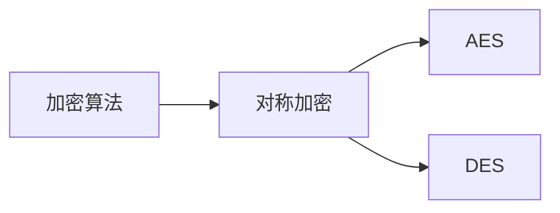

Python示例代码：

```python
from Crypto.Cipher import AES
from Crypto.Util.Padding import pad, unpad

key = b'mysecretkey12345'
cipher = AES.new(key, AES.MODE_CBC)
ct_bytes = cipher.encrypt(pad(b'message', AES.block_size))
iv = cipher.iv
print(f'密文: {ct_bytes.hex()}')
print(f'初始向量: {iv.hex()}')

# 解密
cipher = AES.new(key, AES.MODE_CBC, iv=iv)
pt = unpad(cipher.decrypt(ct_bytes), AES.block_size)
print(f'明文: {pt}')
```

###### 3.2.2 非对称加密算法

非对称加密算法使用一对密钥进行加密和解密，其中一个为公钥，另一个为私钥。常见的非对称加密算法有RSA和ECDSA。

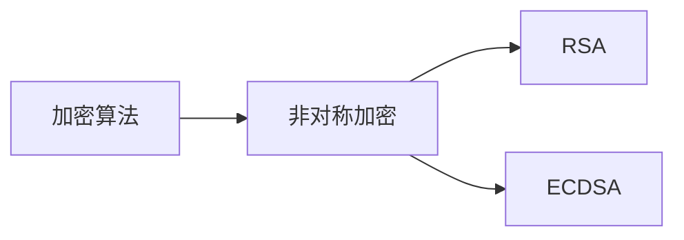

Python示例代码：

```python
from Crypto.PublicKey import RSA
from Crypto.Cipher import PKCS1_OAEP

key = RSA.generate(2048)
private_key = key.export_key()
public_key = key.publickey().export_key()

cipher = PKCS1_OAEP.new(RSA.import_key(public_key))
ct = cipher.encrypt(b'message')
print(f'密文: {ct.hex()}')

# 解密
cipher = PKCS1_OAEP.new(RSA.import_key(private_key))
pt = cipher.decrypt(ct)
print(f'明文: {pt}')
```

##### 3.3 数字签名算法

数字签名算法用于确保数据的完整性和真实性。常见的数字签名算法有RSA和ECDSA。

###### 3.3.1 RSA签名算法

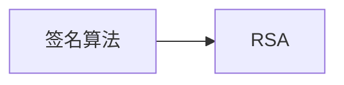

Python示例代码：

```python
from Crypto.PublicKey import RSA
from Crypto.Signature import pkcs1_15
from Crypto.Hash import SHA256

key = RSA.generate(2048)
private_key = key.export_key()
public_key = key.publickey().export_key()

hash = SHA256.new(b'message')
signature = pkcs1_15.new(key).sign(hash)
print(f'签名: {signature.hex()}')

# 验证
hash = SHA256.new(b'message')
is_valid = pkcs1_15.new(RSA.import_key(public_key)).verify(hash, signature)
print(f'验证结果: {is_valid}')
```

###### 3.3.2 ECDSA签名算法

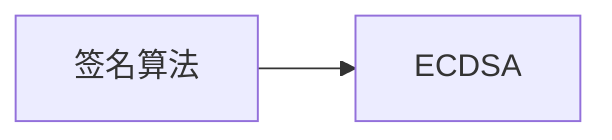

Python示例代码：

```python
from Crypto.PublicKey import ECC
from Crypto.Signature import DSS
from Crypto.Hash import SHA256

key = ECC.generate()
private_key = key.export_key()
public_key = key.publickey().export_key()

hash = SHA256.new(b'message')
signature = DSS.new(key, 'fips-186').sign(hash)
print(f'签名: {signature.hex()}')

# 验证
hash = SHA256.new(b'message')
is_valid = DSS.new(ECC.import_key(public_key), 'fips-186').verify(hash, signature)
print(f'验证结果: {is_valid}')
```

##### 3.4 安全多处理算法

安全多处理算法是用于确保AI系统在多处理环境下的安全性。常见的算法有FedAvg和差分隐私。

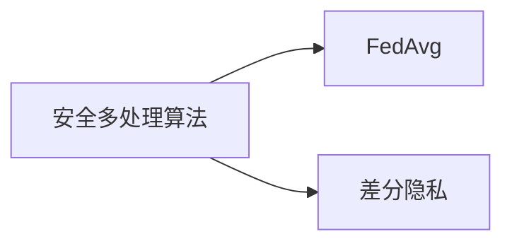

FedAvg算法的Python示例代码：

```python
# FedAvg算法伪代码
def federated_average(client_models, server_model, alpha):
    server_model_copy = copy(server_model)
    for client_model in client_models:
        server_model_copy = update(server_model_copy, client_model, alpha)
    return server_model_copy

# 实现细节略
```

差分隐私算法的Python示例代码：

```python
from numpy.random import default_rng
from privacy import DifferentialPrivacy

rng = default_rng()
data = rng.normal(size=1000)

dp = DifferentialPrivacy()
sensitivity = 1
epsilon = 1
delta = 1e-6

隐私数据 = dp.add_noise(data, sensitivity, epsilon, delta)
print(f'隐私数据: {隐私数据}')
```

---

### 第三部分: 系统架构与实现

#### 第5章: AI系统安全架构设计

##### 5.1 系统安全架构概述

AI系统安全架构的设计旨在确保系统的安全性、可靠性和隐私保护。系统安全架构通常包括检测、防御和响应三个主要环节。

##### 5.2 安全检测机制

安全检测机制是AI系统安全架构的重要组成部分。常见的检测机制包括：

1. **异常检测**：通过监控系统的行为，识别异常行为，及时发出警报。
2. **入侵检测**：通过分析系统日志和网络流量，识别恶意攻击行为。
3. **数据监控**：对训练数据和模型进行监控，及时发现数据篡改和模型篡改行为。

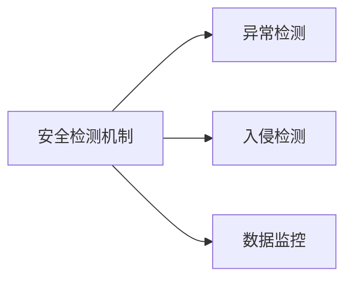

##### 5.3 安全防御策略

安全防御策略包括一系列措施，用于防止AI系统遭受攻击。常见的防御策略包括：

1. **加密技术**：通过加密确保数据传输和存储的安全。
2. **访问控制**：限制系统的访问权限，确保只有授权用户才能访问敏感数据。
3. **安全审计**：定期对系统进行安全检查，及时发现和修复漏洞。
4. **监控与预警**：建立监控系统，实时检测异常行为，及时响应。

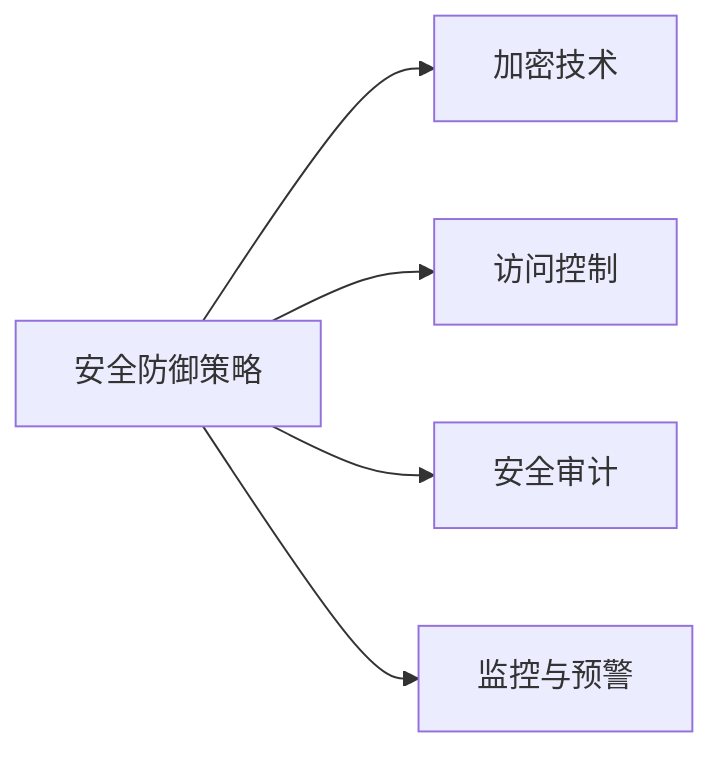

##### 5.4 安全响应机制

安全响应机制是在AI系统遭受攻击时采取的措施，以最小化损失和恢复系统。常见的响应机制包括：

1. **攻击响应**：在发现攻击行为时，及时采取措施阻止攻击。
2. **数据恢复**：在数据遭受篡改时，采取措施恢复数据。
3. **系统恢复**：在系统遭受攻击导致故障时，采取措施恢复系统的正常运行。

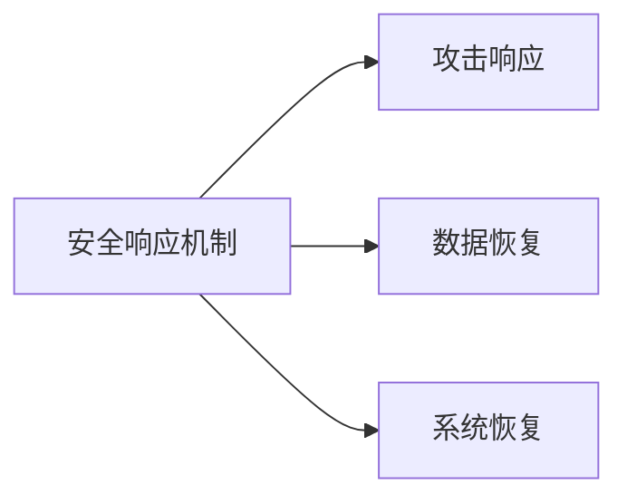

---

#### 第6章: 安全与隐私保护的实现

##### 6.1 系统功能设计

系统功能设计是AI系统安全与隐私保护实现的基础。系统功能设计包括以下几个方面：

1. **数据加密**：确保数据在传输和存储过程中被加密。
2. **访问控制**：限制系统访问权限，确保只有授权用户才能访问敏感数据。
3. **隐私保护**：在数据处理过程中，采取隐私保护措施，确保用户隐私不被泄露。

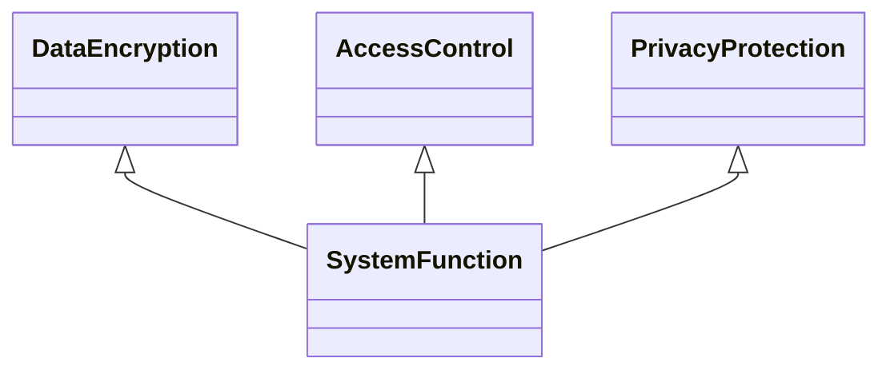

##### 6.2 系统架构设计

系统架构设计是AI系统安全与隐私保护实现的关键。系统架构设计包括以下几个方面：

1. **数据存储**：设计数据存储方案，确保数据的安全存储。
2. **数据处理**：设计数据处理流程，确保数据的加密和隐私保护。
3. **网络通信**：设计网络通信方案，确保数据传输的安全性。

```mermaid
subgraph DataStorage
    D1[数据存储]
    D2[数据库]
    D3[数据加密]
    D1 --> D2
    D1 --> D3
end

subgraph DataProcessing
    P1[数据处理]
    P2[数据加密]
    P3[隐私保护]
    P1 --> P2
    P1 --> P3
end

subgraph NetworkCommunication
    N1[网络通信]
    N2[数据加密]
    N3[认证]
    N1 --> N2
    N1 --> N3
end

DataStorage --> DataProcessing
DataProcessing --> NetworkCommunication
```

##### 6.3 系统接口设计

系统接口设计是AI系统安全与隐私保护实现的重要环节。系统接口设计包括以下几个方面：

1. **用户接口**：设计用户与系统交互的接口，确保用户操作的便捷和安全。
2. **API接口**：设计系统与其他系统或服务的接口，确保数据传输的安全和高效。
3. **监控接口**：设计监控系统与系统的接口，确保实时监测系统的安全状态。

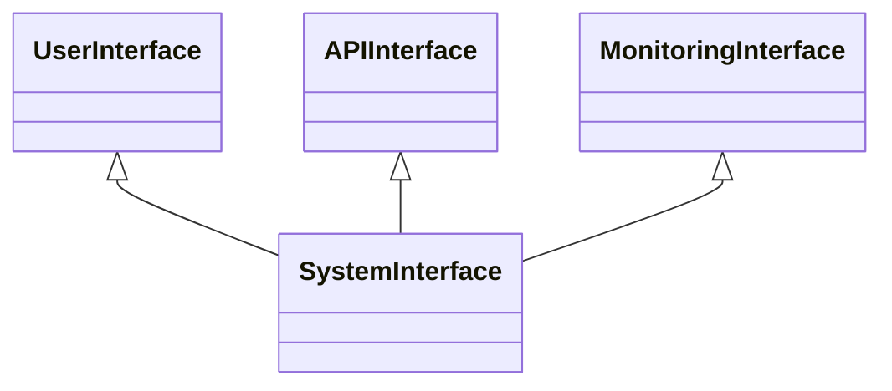

##### 6.4 系统交互设计

系统交互设计是AI系统安全与隐私保护实现的核心。系统交互设计包括以下几个方面：

1. **用户交互**：设计用户与系统的交互流程，确保用户操作的便捷和安全。
2. **数据处理**：设计数据处理流程，确保数据的安全传输和隐私保护。
3. **网络通信**：设计网络通信流程，确保数据传输的安全和高效。

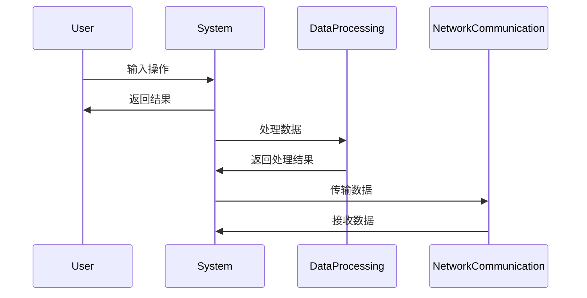

---

### 第四部分: 项目实战与最佳实践

#### 第7章: 人工智能安全项目实战

##### 7.1 项目背景

随着人工智能技术的普及，越来越多的企业和组织开始部署AI系统。然而，这也带来了新的安全挑战。为了提高AI系统的安全性，本项目旨在设计和实现一套安全与隐私保护方案，以应对潜在的威胁。

##### 7.2 环境安装与配置

在进行项目实战之前，需要搭建一个安全的开发环境。首先，需要安装Python和相关依赖库，如Crypto、Django等。然后，配置数据库和Web服务器，确保系统的稳定运行。

```bash
# 安装Python
sudo apt-get install python3-pip python3-dev

# 安装依赖库
pip3 install crypto django

# 配置数据库
sudo apt-get install mysql-server
sudo mysql_secure_installation

# 配置Web服务器
sudo apt-get install apache2
sudo a2enmod wsgi
```

##### 7.3 系统核心实现

系统核心实现包括数据加密、访问控制和隐私保护等模块。以下是一个简单的示例：

```python
from Crypto.PublicKey import RSA
from Crypto.Cipher import PKCS1_OAEP
from django.db import models

class SecureModel(models.Model):
    data = models.BinaryField()

def encrypt_data(data):
    key = RSA.generate(2048)
    cipher = PKCS1_OAEP.new(key)
    ct = cipher.encrypt(data)
    return ct

def decrypt_data(ct):
    key = RSA.import_key(open('private_key.pem').read())
    cipher = PKCS1_OAEP.new(key)
    pt = cipher.decrypt(ct)
    return pt

# 示例：加密数据
data = b'my sensitive data'
encrypted_data = encrypt_data(data)
SecureModel.objects.create(data=encrypted_data)

# 示例：解密数据
secure_model = SecureModel.objects.first()
decrypted_data = decrypt_data(secure_model.data)
print(f'Decrypted data: {decrypted_data}')
```

##### 7.4 代码应用解读与分析

在上面的代码中，我们首先导入了必要的库，包括Crypto和Django。然后，我们定义了一个名为`SecureModel`的Django模型，用于存储加密的数据。

`encrypt_data`函数用于加密数据，它首先生成一个RSA密钥，然后使用PKCS1_OAEP加密算法对数据进行加密，并返回密文。

`decrypt_data`函数用于解密数据，它首先导入RSA私钥，然后使用PKCS1_OAEP加密算法对数据进行解密，并返回明文。

在示例中，我们创建了一个`SecureModel`对象，并将敏感数据加密后存储到数据库中。然后，我们通过查询数据库，获取加密的数据，并使用`decrypt_data`函数进行解密，输出明文数据。

##### 7.5 案例分析与详细讲解剖析

为了更好地理解AI系统安全与隐私保护，我们可以通过一个实际案例进行分析。

**案例**：一个在线购物平台需要确保用户订单数据的安全性和隐私性。为此，平台采用了以下措施：

1. **数据加密**：用户订单数据在传输和存储过程中被加密，确保数据不被未授权访问。
2. **访问控制**：只有授权用户才能访问订单数据，确保敏感数据不被泄露。
3. **隐私保护**：在数据处理过程中，采取差分隐私技术，确保用户隐私不被泄露。

**分析**：

1. **数据加密**：订单数据在传输过程中使用HTTPS加密，确保数据传输的安全性。在存储过程中，订单数据被加密存储在数据库中，只有拥有私钥的用户才能解密数据。
2. **访问控制**：平台采用OAuth2.0认证机制，确保只有授权用户才能访问订单数据。通过访问控制列表（ACL），管理员可以控制用户对订单数据的访问权限。
3. **隐私保护**：平台在数据处理过程中，采用差分隐私技术，对敏感数据进行处理，确保用户隐私不被泄露。

**总结**：通过以上案例，我们可以看到，AI系统安全与隐私保护是一个多层次、多维度的过程。数据加密、访问控制和隐私保护是确保AI系统安全与隐私保护的关键措施。在实际应用中，需要根据具体场景，综合考虑各种因素，制定合适的策略。

---

### 第五部分: 最佳实践与总结

#### 第8章: 最佳实践与总结

##### 8.1 安全与隐私保护的最佳实践

为了确保AI系统的安全与隐私保护，以下是一些最佳实践：

1. **数据加密**：在数据传输和存储过程中，使用强加密算法对数据进行加密，确保数据不被未授权访问。
2. **访问控制**：采用严格的访问控制机制，确保只有授权用户才能访问敏感数据。
3. **安全审计**：定期进行安全审计，发现和修复系统漏洞。
4. **监控与预警**：建立监控系统，实时检测异常行为，及时响应。
5. **隐私保护**：在数据处理过程中，采用隐私保护技术，确保用户隐私不被泄露。

##### 8.2 注意事项

在实施AI系统安全与隐私保护时，需要注意以下几点：

1. **安全性与性能的平衡**：确保系统的安全性能不会对系统的性能产生过大影响。
2. **隐私保护与数据可用性**：在保证隐私保护的前提下，确保数据仍然具有足够的可用性。
3. **合规性**：确保系统符合相关法律法规和行业规范。

##### 8.3 拓展阅读

对于希望进一步深入了解AI系统安全与隐私保护的读者，以下是一些推荐阅读材料：

1. **《人工智能安全：理论与实践》**：一本全面介绍人工智能安全理论与实践的权威著作。
2. **《隐私计算：理论与实践》**：一本深入探讨隐私保护技术及其应用的书。
3. **《网络安全实践指南》**：一本涵盖网络安全各个方面的实用指南。

---

### 总结

在本文中，我们详细介绍了人工智能安全与隐私保护的重要性、核心概念、算法原理、系统架构和项目实战。通过一步步的逻辑分析，我们为读者提供了一个全面的人工智能安全解决方案。随着人工智能技术的不断发展，AI系统的安全与隐私保护将面临更多的挑战。希望本文能为您提供有价值的参考，帮助您构建一个安全、可靠的AI系统。

---

**作者：AI天才研究院/AI Genius Institute & 禅与计算机程序设计艺术 /Zen And The Art of Computer Programming**

