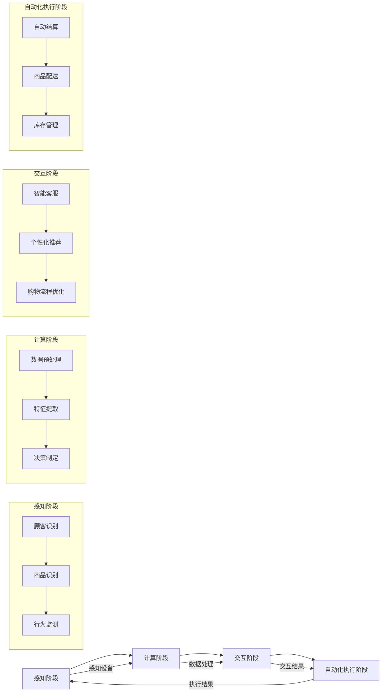

                 

# 《人工智能对零售业的变革：无人商店与智能购物体验》

关键词：人工智能，零售业，无人商店，智能购物体验，技术创新

摘要：随着人工智能技术的不断发展，零售业正经历着前所未有的变革。无人商店和智能购物体验已经成为行业的热门话题。本文将从无人商店与智能购物体验的原理、案例分析、技术实现与开发实践以及未来展望与挑战等方面，深入探讨人工智能在零售业的广泛应用及其对行业带来的深远影响。

# 《人工智能对零售业的变革：无人商店与智能购物体验》目录大纲

## 第一部分：引言

### 1.1 人工智能与零售业的现状

- 人工智能在零售业的普及
- 智能零售的定义与分类
- 无人商店与智能购物体验的兴起

### 1.2 书籍目的与结构

- 书籍目的
- 各部分内容概述
- 读者受益

## 第二部分：无人商店与智能购物体验的原理

### 2.1 人工智能技术概述

- 人工智能的定义
- 机器学习、深度学习的基本原理
- 人工智能的发展历程

### 2.2 无人商店的核心技术

- 感知技术：传感器、摄像头、RFID等
- 计算技术：数据采集、处理、分析
- 交互技术：自然语言处理、语音识别等
- 自动化技术：机器人、自动化流水线等

### 2.3 智能购物体验的关键要素

- 智能推荐系统
- 购物流程优化
- 智能客服系统
- 个性化营销

### 2.4 Mermaid流程图：无人商店与智能购物体验的工作流程

- 感知阶段
- 计算阶段
- 交互阶段
- 自动化执行阶段

## 第三部分：案例研究

### 3.1 全球领先的无人商店案例分析

- Amazon Go
- Alibaba's Freshippo
- Walmart's Nuro

### 3.2 国内新兴无人商店案例研究

- 阿里的“小荷”无人便利店
- 物美旗下的“无人超市”
- 高通的“便利店”

### 3.3 智能购物体验案例分析

- 京东的“无人仓库”
- 苏宁的“智慧零售云”
- 每日优鲜的“无人配送”

## 第四部分：技术实现与开发实践

### 4.1 无人商店与智能购物体验的开发环境搭建

- 硬件选择
- 软件工具安装
- 开发环境配置

### 4.2 核心算法原理讲解与Python源代码实现

- 机器学习算法：决策树、支持向量机等
- 深度学习算法：卷积神经网络、循环神经网络等
- 自然语言处理算法：词嵌入、序列标注等

### 4.3 数学模型和数学公式 & 详细讲解 & 举例说明

- 矩阵运算
- 概率论基础
- 优化算法

### 4.4 项目实战

- 无人商店项目实现
- 智能购物体验项目实现
- 实际案例分析与解读

## 第五部分：未来展望与挑战

### 5.1 人工智能在零售业的发展趋势

- 新技术带来的变革
- 市场规模与增长预测
- 行业应用案例

### 5.2 无人商店与智能购物体验面临的挑战

- 技术实现难题
- 法律法规与伦理问题
- 客户接受度

### 5.3 未来发展建议

- 技术创新方向
- 政策支持与行业规范
- 企业战略与布局

## 附录

### 5.1 AI在零售业相关资源

- 学术论文与研究报告
- 技术文档与教程
- 开源代码与数据集

### 5.2 进一步阅读推荐

- 相关书籍
- 学术期刊
- 行业报告

----------------------------------------------------------------

## 第一部分：引言

### 1.1 人工智能与零售业的现状

在过去的几年中，人工智能（Artificial Intelligence, AI）技术取得了显著的发展，从最初的理论研究到如今在各个领域的广泛应用，人工智能已经深刻地改变了我们的生活。零售业作为一个历史悠久且竞争激烈的行业，也在这场技术变革中不断探索新的发展路径。

首先，人工智能在零售业的普及程度逐渐提升。越来越多的零售企业开始将人工智能技术应用于库存管理、需求预测、客户关系管理等方面，以提升运营效率和服务质量。例如，阿里巴巴的“小荷”无人便利店和京东的“无人仓库”都是基于人工智能技术实现的创新案例。

其次，智能零售的定义与分类也在不断演变。智能零售不仅仅是指无人商店和智能购物体验，还包括个性化推荐、智能客服、智能供应链等多元化应用。智能零售可以根据技术手段的不同，分为自动化零售、数据驱动零售和智慧零售等不同类型。

最后，无人商店与智能购物体验的兴起为消费者带来了全新的购物方式。通过感知技术、交互技术和自动化技术，无人商店能够实现自动化结算和商品配送，消费者可以享受到更加便捷和高效的购物体验。同时，智能购物体验通过大数据分析和个性化推荐，为消费者提供更加精准的购物建议和服务。

### 1.2 书籍目的与结构

本书籍旨在深入探讨人工智能在零售业的变革，尤其是无人商店与智能购物体验的应用。通过系统的分析和实际案例研究，本书希望能够为读者提供一个全面、清晰的认识，帮助读者理解这一新兴领域的核心概念、技术原理和实践应用。

本书分为五个主要部分：

- **第一部分：引言**：介绍人工智能与零售业的现状，以及本书的目的和结构。
- **第二部分：无人商店与智能购物体验的原理**：详细讲解人工智能技术的基础知识，包括机器学习、深度学习、自然语言处理等，并阐述无人商店与智能购物体验的关键技术。
- **第三部分：案例研究**：分析全球和中国国内领先的无人商店与智能购物体验案例，探讨其成功经验和面临的问题。
- **第四部分：技术实现与开发实践**：介绍无人商店与智能购物体验的技术实现过程，包括开发环境搭建、核心算法实现和项目实战。
- **第五部分：未来展望与挑战**：讨论人工智能在零售业的发展趋势和面临的挑战，并提出未来发展的建议。

通过上述结构，本书希望能够为读者提供一套全面、系统的学习路径，帮助读者深入了解人工智能在零售业的广泛应用，以及其带来的巨大机遇和挑战。

### 1.3 读者受益

本书的目标读者主要包括：

1. **零售业从业者**：对于在零售行业工作的从业者，无论是管理人员还是技术人员，本书能够提供最新的行业趋势和技术应用，帮助他们提升业务能力和技术水平。
2. **人工智能研究者**：对于在人工智能领域工作的研究人员，本书能够提供一个实际的行业应用场景，帮助他们对人工智能技术在实际中的应用有更深入的理解。
3. **高校师生**：对于高校师生，本书可以作为人工智能与零售业相关课程的教学参考书，帮助学生了解行业的最新动态和技术应用。

通过阅读本书，读者可以：

- **了解人工智能在零售业的广泛应用**：通过案例分析和技术讲解，读者能够全面了解人工智能技术在零售业中的具体应用场景。
- **掌握无人商店与智能购物体验的核心技术**：通过详细的技术原理和算法实现讲解，读者能够深入理解无人商店与智能购物体验的技术架构和实现原理。
- **获得实际开发经验**：通过项目实战和开发实践的介绍，读者能够获取实际的项目开发经验和最佳实践。

总之，本书旨在为读者提供一个全面、系统的学习资源，帮助读者在人工智能与零售业的交汇领域中不断探索和创新。

### 2.1 人工智能技术概述

#### 人工智能的定义

人工智能（Artificial Intelligence, AI）是指通过计算机程序和算法模拟、扩展和扩展人类智能的理论、方法和技术。它涉及到多个学科领域，包括计算机科学、认知科学、心理学、神经科学和统计学等。人工智能的目标是使计算机系统能够自主地完成原本需要人类智能才能完成的任务，如视觉识别、语音识别、自然语言处理、决策制定和问题解决等。

#### 机器学习、深度学习的基本原理

机器学习（Machine Learning, ML）是人工智能的一个重要分支，主要研究如何从数据中学习规律和模式，并利用这些规律进行预测和决策。机器学习的基本原理包括数据采集、预处理、模型训练和模型评估等步骤。其中，模型训练是关键环节，通过不断调整模型的参数，使得模型能够更好地拟合训练数据，从而提高模型的预测能力。

深度学习（Deep Learning, DL）是机器学习的一种特殊形式，它利用多层神经网络（Neural Networks）进行模型训练。深度学习的核心思想是通过神经网络结构自动提取数据的特征表示，使得模型能够从原始数据中学习到更高级别的特征和知识。深度学习在图像识别、语音识别和自然语言处理等领域取得了显著的成果。

#### 人工智能的发展历程

人工智能的概念可以追溯到20世纪50年代。1956年，达特茅斯会议被认为是人工智能诞生的标志，会议上的专家们首次提出“人工智能”这一术语。此后，人工智能领域经历了多个发展阶段：

- **第一阶段（1956-1974）**：人工智能的早期探索阶段，主要研究符号主义人工智能，通过逻辑推理和知识表示来模拟人类智能。
- **第二阶段（1974-1980）**：随着计算机硬件的发展，人工智能领域进入了一个快速发展的阶段，出现了许多实用的应用，如专家系统。
- **第三阶段（1980-1987）**：由于性能和实用性的问题，人工智能领域进入了一个低潮期，被称为“人工智能寒冬”。
- **第四阶段（1987-2012）**：随着计算机性能的提升和海量数据的积累，机器学习和深度学习逐渐成为主流，人工智能领域迎来了新的发展机遇。
- **第五阶段（2012至今）**：深度学习在图像识别、语音识别和自然语言处理等领域取得了突破性进展，人工智能技术开始广泛应用于各个行业。

#### 人工智能的现状与未来趋势

当前，人工智能技术已经取得了显著的进展，并在多个领域实现了商业化应用。例如，在零售业，人工智能技术被应用于库存管理、需求预测、个性化推荐和无人商店等场景。随着技术的不断进步，人工智能在零售业中的应用前景更加广阔。

未来，人工智能的发展趋势主要包括：

- **数据驱动的智能化**：随着数据的积累和数据分析技术的进步，人工智能将更加依赖于数据驱动的智能化，实现更加精准的预测和决策。
- **多模态人工智能**：通过融合视觉、语音、文本等多种模态的信息，人工智能将能够更好地理解和处理复杂的现实问题。
- **边缘计算与云计算的结合**：随着5G和边缘计算技术的发展，人工智能将能够在边缘设备上进行实时处理，实现更加高效和智能的应用。
- **伦理和隐私保护**：随着人工智能技术的发展，伦理和隐私问题越来越受到关注，未来人工智能的发展将更加注重伦理和隐私保护。

总的来说，人工智能技术将在未来继续推动零售业的变革，为消费者带来更加便捷和个性化的购物体验。

### 2.2 无人商店的核心技术

无人商店作为人工智能在零售业中的一项重要应用，其核心技术的实现离不开感知技术、计算技术、交互技术和自动化技术。以下将详细探讨这些技术的基本原理和实际应用。

#### 感知技术

感知技术是无人商店实现自动化运营的基础，它主要包括传感器、摄像头和RFID等设备。这些设备能够实时捕捉和感知商店内部的环境信息，包括顾客的行为、商品的位置以及购物车中的商品等。

- **传感器**：传感器用于检测环境中的各种物理量，如温度、湿度、光照强度等。在无人商店中，温度和湿度传感器可以实时监测仓库和展示区的环境条件，确保商品在最佳存储条件下销售。此外，运动传感器可以检测顾客进入和离开商店的行为，为后续的自动化结算提供数据支持。

- **摄像头**：摄像头是无人商店中最常用的感知设备，通过图像识别技术，摄像头能够识别顾客的购物行为和商品的信息。例如，当顾客拿起一件商品时，摄像头可以捕捉到该商品的照片，并与库存系统进行比对，以实现无接触式的商品识别和结算。

- **RFID**：RFID（射频识别）技术通过无线信号识别特定目标并读写数据。在无人商店中，RFID标签通常贴在商品上，当商品被顾客放入购物车时，RFID读取器能够快速识别并记录商品信息，从而实现自动化结算。

#### 计算技术

计算技术是无人商店实现智能决策和优化的重要保障，它包括数据采集、处理和分析等技术。通过计算技术，无人商店能够实时处理大量的感知数据，为智能决策提供支持。

- **数据采集**：数据采集是计算技术的第一步，通过传感器、摄像头和RFID等设备，无人商店能够实时采集大量的环境信息和商品信息。这些数据包括顾客行为、商品位置、库存水平等，为后续的数据处理和分析提供基础。

- **数据处理**：数据处理是计算技术的核心环节，通过对原始数据的清洗、筛选和整理，可以去除噪声和不完整的数据，提高数据的质量和可用性。例如，通过数据清洗技术，可以去除传感器采集过程中产生的误差数据，确保后续分析的准确性。

- **数据分析**：数据分析是计算技术的最后一步，通过对采集到的数据进行统计分析和模式识别，无人商店可以识别出顾客的行为模式、商品的销售趋势等。例如，通过分析顾客的行为数据，无人商店可以优化货架布局，提高商品的销售额。

#### 交互技术

交互技术是无人商店与顾客之间沟通的桥梁，它包括自然语言处理、语音识别和智能客服等技术。通过交互技术，无人商店能够为顾客提供智能化的购物体验。

- **自然语言处理**：自然语言处理（Natural Language Processing, NLP）是人工智能领域的一个重要分支，它使得计算机能够理解和处理人类语言。在无人商店中，NLP技术可以用于智能客服和个性化推荐系统。例如，顾客可以通过语音或文本与智能客服进行交流，获取购物建议或解决购物问题。

- **语音识别**：语音识别（Voice Recognition）技术能够将语音信号转换为文本，使得无人商店能够通过语音与顾客进行互动。例如，顾客可以通过语音指令查询商品信息或进行购物结算，实现更加便捷的购物体验。

- **智能客服**：智能客服系统是无人商店中不可或缺的一环，它能够自动识别顾客的咨询内容，并提供相应的解答。智能客服系统通常基于NLP和机器学习技术，能够不断学习和优化，提高服务质量。

#### 自动化技术

自动化技术是无人商店实现高效运营的关键，它包括机器人和自动化流水线等技术。通过自动化技术，无人商店能够实现自动化的商品识别、结算和配送。

- **机器人**：在无人商店中，机器人用于执行各种自动化任务，如商品搬运、货架整理和清洁等。例如，自动搬运机器人可以自动识别货架上的商品，将商品移动到指定位置，从而实现高效的库存管理。

- **自动化流水线**：自动化流水线是无人商店中常见的自动化设备，它通过传感器和执行器实现自动化的商品处理和结算。例如，在结算环节，自动化流水线可以自动识别顾客购物车中的商品，并通过自动化的结算系统完成结算过程，从而提高结算效率。

综上所述，感知技术、计算技术、交互技术和自动化技术共同构成了无人商店的核心技术体系。通过这些技术的综合应用，无人商店能够实现自动化、智能化的运营，为顾客提供全新的购物体验。同时，随着技术的不断进步，无人商店的功能和性能将不断提升，为零售业的未来发展带来更多的可能性。

### 2.3 智能购物体验的关键要素

智能购物体验作为人工智能在零售业中的重要应用，其成功离不开以下几个关键要素：智能推荐系统、购物流程优化、智能客服系统和个性化营销。以下将详细探讨这些要素的基本原理和实际应用。

#### 智能推荐系统

智能推荐系统（Intelligent Recommendation System）是智能购物体验的核心，它通过分析消费者的行为数据、购买历史和偏好，为消费者提供个性化的购物推荐。智能推荐系统主要包括以下几种类型：

1. **基于内容的推荐**：基于内容的推荐（Content-Based Recommendation）系统通过分析商品的属性和特征，为消费者推荐相似的商品。例如，当消费者浏览了一款红色的鞋子时，系统可以推荐其他红色鞋子或类似款式的鞋子。

2. **协同过滤推荐**：协同过滤推荐（Collaborative Filtering Recommendation）系统通过分析消费者的行为数据，如购买历史和评分，为消费者推荐类似兴趣的商品。协同过滤推荐分为用户基于的协同过滤（User-Based Collaborative Filtering）和物品基于的协同过滤（Item-Based Collaborative Filtering）两种类型。

3. **混合推荐**：混合推荐（Hybrid Recommendation）系统结合了基于内容的推荐和协同过滤推荐的优势，为消费者提供更加精准的购物推荐。例如，系统可以首先基于商品属性进行推荐，然后根据消费者的行为数据进行调整，从而提高推荐的准确性。

智能推荐系统在实际应用中，可以通过以下步骤实现：

1. 数据采集：通过用户的浏览记录、购买历史和评价数据，采集用户的购物行为数据。

2. 数据预处理：对采集到的数据进行清洗、去重和规范化处理，以提高数据的质量和可用性。

3. 模型训练：使用机器学习和深度学习技术，对预处理后的数据进行模型训练，提取用户的兴趣特征和商品的特征。

4. 推荐生成：根据用户的兴趣特征和商品的特征，生成个性化的购物推荐。

5. 推荐评估：通过点击率、转化率和用户满意度等指标，评估推荐系统的性能，并不断优化和调整推荐策略。

#### 购物流程优化

购物流程优化（Shopping Process Optimization）是提高购物体验的重要手段，通过优化购物流程，可以减少顾客的等待时间，提高购物效率。购物流程优化主要包括以下几个方面：

1. **智能导航系统**：智能导航系统通过分析顾客的行为数据和商店的布局，为顾客提供最优的购物路径。例如，系统可以推荐顾客前往热门商品区或促销区，从而提高顾客的购物体验。

2. **智能结算系统**：智能结算系统通过自动化技术，实现快速、准确的购物结算。例如，利用RFID和自动识别技术，顾客无需排队结账，只需将商品放入购物车，系统自动完成结算。

3. **库存管理**：智能库存管理系统通过实时监控商品的库存情况，优化库存水平，确保商品的及时供应。例如，当某款商品库存不足时，系统可以自动向供应商发送补货请求，确保商品供应的连续性。

购物流程优化可以通过以下步骤实现：

1. 数据采集：通过传感器、摄像头和POS系统等设备，实时采集顾客的购物行为数据和库存数据。

2. 数据分析：对采集到的数据进行统计分析，识别购物流程中的瓶颈和优化点。

3. 流程设计：根据分析结果，设计优化的购物流程，包括智能导航、智能结算和智能库存管理等。

4. 流程实施：将优化的购物流程应用到实际运营中，并进行持续优化。

5. 指标监控：通过设置关键绩效指标（KPI），监控购物流程的优化效果，并根据指标进行持续改进。

#### 智能客服系统

智能客服系统（Intelligent Customer Service System）是提供智能化客户服务的重要工具，通过自然语言处理和语音识别技术，智能客服系统能够自动识别和处理顾客的咨询和需求，提高客户服务的效率和质量。智能客服系统主要包括以下功能：

1. **咨询回复**：智能客服系统可以自动识别顾客的咨询内容，并提供相应的解答。例如，当顾客咨询商品的价格时，系统可以自动查询商品信息，并返回价格。

2. **订单查询**：智能客服系统可以帮助顾客查询订单状态，提供订单详情和物流信息，提高顾客的购物体验。

3. **投诉处理**：智能客服系统可以自动识别顾客的投诉内容，并将投诉转发给相关部门进行处理，提高投诉处理的效率。

智能客服系统可以通过以下步骤实现：

1. 数据采集：通过语音识别和自然语言处理技术，采集顾客的咨询和投诉数据。

2. 数据分析：对采集到的数据进行情感分析和语义理解，识别顾客的需求和问题。

3. 回复生成：根据分析结果，生成个性化的回复，并提供给顾客。

4. 回复评估：通过设置回复的满意度指标，评估智能客服系统的性能，并不断优化回复策略。

#### 个性化营销

个性化营销（Personalized Marketing）是智能购物体验中的重要环节，通过分析顾客的购买历史、行为数据和偏好，为顾客提供个性化的营销策略，提高营销效果。个性化营销主要包括以下几种策略：

1. **个性化推荐**：基于顾客的购买历史和行为数据，为顾客推荐个性化的商品和促销活动。例如，当顾客浏览了一款商品时，系统可以推荐相关的商品和优惠券。

2. **个性化广告**：通过分析顾客的兴趣和购买历史，为顾客展示个性化的广告内容。例如，当顾客浏览了一款电子产品时，系统可以为其推荐相关的电子产品广告。

3. **个性化促销**：根据顾客的购买频率和消费水平，为顾客提供个性化的促销优惠。例如，当顾客达到一定的消费额度时，系统可以为其提供额外的折扣。

个性化营销可以通过以下步骤实现：

1. 数据采集：通过顾客的购买记录、行为数据和偏好设置，采集顾客的相关数据。

2. 数据分析：对采集到的数据进行分析，识别顾客的购买行为和偏好。

3. 营销策略设计：根据分析结果，设计个性化的营销策略。

4. 营销实施：将个性化营销策略应用到实际运营中，并进行持续优化。

5. 指标监控：通过设置营销效果指标，监控个性化营销策略的效果，并根据指标进行持续改进。

综上所述，智能购物体验的关键要素包括智能推荐系统、购物流程优化、智能客服系统和个性化营销。通过这些要素的综合应用，智能购物体验能够为顾客提供全新的购物方式，提高顾客满意度和忠诚度，从而推动零售业的持续发展。

### 2.4 Mermaid流程图：无人商店与智能购物体验的工作流程

在无人商店与智能购物体验的实施过程中，理解其工作流程至关重要。以下将使用Mermaid流程图来展示无人商店与智能购物体验的各个阶段，以便读者能够更直观地了解其工作原理。



**感知阶段**：在这一阶段，无人商店通过感知设备（如摄像头、传感器、RFID）实时捕捉顾客的行为和商品信息。感知设备收集的数据包括顾客的身份、商品的位置和数量等。感知阶段的核心任务是确保数据的准确性和实时性。

**计算阶段**：感知阶段收集到的数据进入计算阶段，这一阶段的主要任务是数据处理、特征提取和决策制定。数据处理包括数据清洗、去噪和格式转换等，以确保数据的质量。特征提取是将原始数据转换为能够反映数据本质特征的表示。决策制定是基于特征数据和预先设定的规则，对顾客行为和商品进行分类和预测。

**交互阶段**：计算阶段的结果进入交互阶段，这一阶段的主要任务是提供智能客服、个性化推荐和购物流程优化等服务。智能客服通过自然语言处理和语音识别技术，与顾客进行实时互动，解答顾客的问题和需求。个性化推荐系统根据顾客的历史行为和偏好，为顾客推荐适合的商品和促销活动。购物流程优化旨在提升购物体验，减少顾客的等待时间和操作复杂度。

**自动化执行阶段**：交互阶段生成的决策和操作指令进入自动化执行阶段，这一阶段的主要任务是自动完成结算、商品配送和库存管理等工作。自动结算系统通过自动识别商品和顾客的身份，快速完成结算过程。商品配送系统根据顾客的订单信息和配送策略，自动安排商品的配送。库存管理系统实时监控商品的库存水平，确保商品的及时补充和库存平衡。

通过上述四个阶段的紧密配合，无人商店与智能购物体验能够为顾客提供高效、便捷、个性化的购物体验。同时，这些阶段的数据流和功能模块也展示了人工智能技术在零售业中的应用潜力。

### 3.1 全球领先的无人商店案例分析

在无人商店的浪潮中，全球范围内出现了一些领先的创新案例，它们不仅在技术上取得了重大突破，而且在商业运营上取得了显著的成效。以下将详细分析Amazon Go、Alibaba's Freshippo和Walmart's Nuro这三个典型代表。

#### Amazon Go

Amazon Go是亚马逊公司推出的无人商店，于2018年1月在美国西雅图首次向公众开放。Amazon Go采用了最前沿的计算机视觉、深度学习和传感器融合技术，实现了完全无现金、无收银员的购物体验。

**技术实现**：

- **计算机视觉**：Amazon Go商店内安装了多个高分辨率摄像头和传感器，实时捕捉顾客和商品的动作。计算机视觉算法能够准确识别顾客的移动轨迹、商品的位置和数量。
- **深度学习**：通过深度学习算法，系统能够学习和识别多种复杂的场景，如顾客拿起商品、将商品放回货架等。深度学习模型通过大量数据训练，提高了识别的准确性和实时性。
- **传感器融合**：Amazon Go商店还使用了传感器融合技术，包括RFID标签和惯性测量单元（IMU），这些传感器协同工作，确保系统对顾客和商品的位置和动作有更全面的了解。

**运营模式**：

- **无现金支付**：顾客进入商店时，通过Amazon Go应用程序扫描二维码进行身份验证。购物过程中，系统自动识别顾客拿起的商品和放回的商品，并在顾客离开商店时自动完成结算。
- **便捷购物体验**：Amazon Go通过减少结账环节，实现了高效、流畅的购物体验。顾客可以在商店内自由移动，无需排队等待。

**成效与影响**：

- **成效**：自推出以来，Amazon Go受到了广泛关注，吸引了大量顾客。虽然具体的销售额数据没有公开，但根据公开报道，Amazon Go在运营初期表现出了良好的客流量和用户满意度。
- **影响**：Amazon Go的成功展示了人工智能技术在零售业中的应用潜力，推动了无人商店的发展。其创新模式对传统零售行业产生了深远的影响，引发了全球范围内的关注和模仿。

#### Alibaba's Freshippo

阿里巴巴旗下的Freshippo是中国领先的无人零售品牌，以其高效的供应链和智能化的运营模式而著称。Freshippo通过大数据和人工智能技术，实现了从供应链到购物体验的全流程智能化。

**技术实现**：

- **大数据分析**：Freshippo利用大数据技术，对消费者行为和需求进行深入分析，从而实现精准的商品推荐和库存管理。
- **智能仓储**：Freshippo的智能仓储系统通过自动化设备和机器人，实现了高效的货物存储和配送。仓库内配备了各种传感器和监控系统，确保货物的安全和管理。
- **AI客服**：Freshippo的智能客服系统能够通过自然语言处理和机器学习技术，为顾客提供24/7的在线服务，解答顾客的疑问和需求。

**运营模式**：

- **社区便利**：Freshippo主要布局在社区和小型商业区，提供便捷的购物服务。顾客可以通过Freshippo应用程序下单，商品快速配送到家。
- **快速配送**：Freshippo通过高效的供应链和智能化的仓储系统，实现了快速的商品配送。顾客下单后，系统自动安排最合适的配送路线和配送员。

**成效与影响**：

- **成效**：Freshippo在中国市场的迅速扩张，证明了其商业模式和技术的可行性。根据公开报道，Freshippo的订单量和用户满意度持续增长。
- **影响**：Freshippo的成功展示了大数据和人工智能技术在零售业中的应用前景。其高效、智能的运营模式为其他零售企业提供了借鉴和参考。

#### Walmart's Nuro

Walmart的Nuro是另一家专注于无人零售的创新企业，其无人驾驶配送车Nuro R1在市场上取得了显著的成功。

**技术实现**：

- **无人驾驶技术**：Nuro R1采用了先进的无人驾驶技术，包括激光雷达、摄像头和传感器等设备。这些设备协同工作，确保车辆在复杂的环境中稳定行驶。
- **智能配送**：Nuro R1配备了智能配送系统，能够根据订单信息自动规划配送路线，并在指定地点进行无人的商品交付。系统还具备实时监控和故障处理能力，确保配送过程的安全和高效。

**运营模式**：

- **无人配送**：Nuro R1主要应用于Walmart的无人配送服务，顾客在Walmart应用程序上下单后，系统自动安排Nuro R1进行配送。顾客可以在指定地点等待或选择自取。
- **灵活配送**：Nuro R1的无人配送模式具有高度的灵活性，能够在不同的环境和条件下进行配送。这种模式不仅提高了配送效率，还降低了配送成本。

**成效与影响**：

- **成效**：Nuro R1的推出，使Walmart在无人配送领域取得了重要的突破。尽管具体的销售额数据没有公开，但根据公开报道，Nuro R1在运营初期表现出了良好的配送效率和用户满意度。
- **影响**：Nuro R1的成功展示了无人驾驶技术在零售物流中的应用潜力。其创新模式对传统物流行业产生了深远的影响，推动了无人配送技术的发展。

综上所述，Amazon Go、Alibaba's Freshippo和Walmart's Nuro是当前全球领先的无人商店代表。它们通过先进的人工智能技术和创新的商业模式，实现了无人商店的自动化、智能化运营，为零售业的未来发展提供了宝贵的经验和启示。

### 3.2 国内新兴无人商店案例研究

在国内，无人商店的发展同样呈现出蓬勃的态势，许多新兴企业通过技术创新和商业模式创新，成功推出了具有竞争力的无人商店。以下将分析阿里系的“小荷”无人便利店、物美旗下的“无人超市”以及高通的“便利店”等代表性案例。

#### 阿里的“小荷”无人便利店

“小荷”无人便利店是阿里巴巴旗下的无人零售品牌，它通过人工智能、物联网和大数据技术，实现了全流程的无人化和智能化运营。

**技术实现**：

- **物联网传感器**：小荷店内安装了各种物联网传感器，包括摄像头、RFID标签、门禁系统等。这些传感器实时捕捉顾客和商品的信息，确保数据的高效采集和传输。
- **人工智能算法**：通过人工智能算法，小荷能够实时分析顾客的行为数据，实现智能推荐、精准营销等功能。例如，系统可以根据顾客的购物习惯，推荐适合的商品。
- **智能支付系统**：小荷采用了智能支付系统，顾客可以通过支付宝小程序扫描二维码进行支付。支付过程无需人工干预，实现了完全的无现金支付。

**运营模式**：

- **自助购物**：顾客进入小荷店后，可以通过自助购物终端选购商品，无需排队结账。系统会自动识别顾客拿取的商品，并在顾客离开时自动完成结算。
- **快速配送**：小荷通过高效的供应链系统，实现了快速的商品配送。顾客在店内选购商品后，可以选择线下自取或在线下单，系统会自动安排配送员将商品送至顾客指定地点。

**成效与影响**：

- **成效**：自开业以来，“小荷”无人便利店受到了广泛欢迎，其高效的运营模式和便捷的购物体验吸引了大量顾客。虽然具体的销售额数据没有公开，但据媒体报道，“小荷”在运营初期表现出了良好的客流量和用户满意度。
- **影响**：小荷的成功展示了人工智能技术在零售业中的应用潜力，为国内无人商店的发展提供了宝贵的经验和启示。其创新的无人化和智能化模式，对传统零售行业产生了深远的影响。

#### 物美旗下的“无人超市”

物美旗下的“无人超市”通过物联网、大数据和人工智能技术，实现了超市运营的全面智能化。其无人超市采用“无人收银+自助结算”的模式，为顾客提供了全新的购物体验。

**技术实现**：

- **物联网传感器**：无人超市内安装了多种物联网传感器，包括摄像头、RFID标签、智能货架等。这些传感器实时监测商品和顾客的行为，确保数据的准确性和实时性。
- **智能结算系统**：通过智能结算系统，顾客无需排队结账，只需将商品放入自助结算台，系统会自动识别商品并完成结算。
- **人工智能算法**：无人超市通过人工智能算法，实现商品识别、库存管理和智能推荐等功能。例如，系统可以根据顾客的购物习惯，推荐相关的商品。

**运营模式**：

- **自助购物**：顾客进入无人超市后，可以通过自助购物终端选购商品，系统会自动记录顾客的购物行为。顾客在离开超市时，只需将商品放入自助结算台，系统会自动完成结算。
- **智能补货**：无人超市通过智能补货系统，实时监控商品的库存水平，确保商品的及时补充。当商品库存不足时，系统会自动向供应商发送补货请求。

**成效与影响**：

- **成效**：物美旗下的“无人超市”自开业以来，吸引了大量顾客，其高效的运营模式和便捷的购物体验受到了广泛好评。虽然具体的销售额数据没有公开，但据报道，“无人超市”在运营初期表现出了良好的客流量和用户满意度。
- **影响**：物美旗下的“无人超市”展示了人工智能技术在零售业中的应用前景，为国内无人商店的发展提供了新的思路。其创新的智能化运营模式，对传统零售行业产生了积极的影响。

#### 高通的“便利店”

高通的“便利店”是一家以人工智能和物联网技术为核心的无人便利店，它通过智能识别、智能结算和智能配送等创新技术，实现了无人化、智能化的运营。

**技术实现**：

- **智能识别系统**：通过智能识别系统，便利店能够自动识别顾客和商品。顾客进入便利店时，系统会自动记录顾客的身份信息。商品通过RFID标签进行自动识别。
- **智能结算系统**：顾客在便利店选购商品后，可以通过自助结算台进行结算。系统会自动识别商品并计算总价，顾客只需扫码支付即可完成购物。
- **智能配送系统**：高通的便利店通过智能配送系统，实现了商品的快速配送。顾客在便利店选购商品后，可以选择线上下单，系统会自动安排配送员将商品送至顾客指定地点。

**运营模式**：

- **自助购物**：顾客进入便利店后，可以通过自助购物终端选购商品，系统会自动记录购物行为。顾客在离开便利店时，可以通过自助结算台完成结算。
- **快速配送**：顾客在便利店选购商品后，可以选择线上下单，系统会自动安排配送员进行配送。配送员通过智能设备实时跟踪配送过程，确保商品快速送达。

**成效与影响**：

- **成效**：高通的“便利店”在运营初期表现出了良好的客流量和用户满意度。虽然具体的销售额数据没有公开，但据报道，“便利店”在运营初期取得了显著的成功。
- **影响**：高通的“便利店”展示了人工智能技术在零售业中的应用前景，为国内无人商店的发展提供了新的思路。其创新的无人化和智能化模式，对传统零售行业产生了积极的影响。

综上所述，阿里的“小荷”无人便利店、物美旗下的“无人超市”和高通的“便利店”是国内新兴无人商店的代表性案例。它们通过先进的人工智能和物联网技术，实现了无人商店的自动化、智能化运营，为消费者提供了全新的购物体验。同时，这些案例的成功也为国内无人商店的发展提供了宝贵的经验和启示。

### 3.3 智能购物体验案例分析

智能购物体验作为人工智能在零售业中的重要应用，正逐步改变消费者的购物方式。以下将分析京东的“无人仓库”、苏宁的“智慧零售云”和每日优鲜的“无人配送”等案例，探讨其核心优势、技术实现和实际效果。

#### 京东的“无人仓库”

京东的“无人仓库”通过先进的自动化和人工智能技术，实现了从入库、存储到出库的全流程无人化操作，大幅提升了物流效率和运营成本。

**核心优势**：

- **自动化仓储管理**：无人仓库内配备了自动搬运机器人、自动分拣系统和智能货架，实现了仓储过程的自动化管理。机器人可以自动完成商品的搬运、分类和上架，大大提高了仓储效率。
- **精准库存管理**：通过物联网传感器和人工智能算法，无人仓库能够实时监控商品的库存情况，确保库存的精准性和及时性。系统可以根据库存水平自动进行补货，减少库存积压和商品过期。
- **高效订单处理**：无人仓库能够快速完成订单处理，从订单生成到商品出库，整个过程无需人工干预，大幅缩短了订单处理时间。

**技术实现**：

- **感知技术**：无人仓库内安装了大量的传感器，包括摄像头、RFID标签和激光雷达等，实时捕捉商品的入库、存储和出库过程。
- **数据处理**：通过数据处理和特征提取技术，系统可以对传感器采集到的数据进行分析和处理，识别商品的位置、数量和状态，确保数据的准确性和实时性。
- **自动化执行**：基于深度学习和机器人控制技术，无人仓库内的机器人能够自动完成商品搬运、分类和上架等任务，实现自动化操作。

**实际效果**：

- **效率提升**：无人仓库的应用，使得京东的物流效率显著提升，订单处理速度提高了30%以上，仓储面积利用率提高了20%以上。
- **成本降低**：无人仓库的自动化运营，减少了人工成本，据估计，每个仓库的运营成本降低了30%以上。
- **用户体验**：无人仓库的应用，为消费者提供了更加高效和可靠的物流服务，订单履约率和用户满意度得到了显著提升。

#### 苏宁的“智慧零售云”

苏宁的“智慧零售云”通过大数据和人工智能技术，实现了从供应链管理到购物体验的全流程智能化，为消费者提供了个性化的购物体验。

**核心优势**：

- **个性化推荐**：通过大数据分析和人工智能算法，智慧零售云能够根据消费者的购买历史和行为偏好，为消费者提供个性化的商品推荐。系统可以实时更新推荐列表，确保推荐的相关性和准确性。
- **智能供应链**：智慧零售云通过智能供应链管理，实现了从采购、库存到配送的全流程智能化。系统可以根据销售数据和市场需求，自动调整采购计划和库存水平，确保供应链的高效运作。
- **智能客服**：智慧零售云配备了智能客服系统，通过自然语言处理和机器学习技术，为消费者提供24/7的在线服务。智能客服系统能够自动识别和处理消费者的咨询和投诉，提高客户服务效率。

**技术实现**：

- **大数据分析**：智慧零售云通过大数据技术，对消费者的购买行为和需求进行深入分析，提取消费者的兴趣和偏好。
- **人工智能算法**：通过人工智能算法，智慧零售云能够实现个性化推荐、智能供应链管理和智能客服等功能。系统可以根据分析结果，自动生成推荐列表和客服响应。
- **云计算平台**：智慧零售云基于云计算平台，实现了数据的高效存储和处理，确保系统的高可用性和可扩展性。

**实际效果**：

- **用户体验**：智慧零售云的应用，为消费者提供了更加个性化、便捷的购物体验。根据用户反馈，个性化推荐和智能客服功能显著提升了用户的购物满意度和忠诚度。
- **运营效率**：智慧零售云的应用，提高了苏宁的运营效率，库存周转率提高了20%以上，订单处理速度提升了30%以上。
- **市场竞争力**：智慧零售云的应用，增强了苏宁在零售市场中的竞争力，促进了销售额和市场份额的增长。

#### 每日优鲜的“无人配送”

每日优鲜的“无人配送”通过无人驾驶技术和智能物流系统，实现了商品从仓库到消费者手中的无人化配送，为消费者提供了高效、便捷的配送服务。

**核心优势**：

- **无人化配送**：无人配送车通过无人驾驶技术，实现了商品的自动配送。配送车配备了激光雷达、摄像头和GPS等传感器，能够自主导航和避障，确保配送的安全和高效。
- **实时监控**：无人配送车配备了实时监控系统，可以实时跟踪配送过程，确保商品的安全和及时送达。系统可以自动识别配送过程中可能出现的异常情况，并及时进行处理。
- **智能调度**：无人配送系统通过智能调度算法，实现了配送路线的优化。系统可以根据交通状况、配送时间和距离等因素，自动调整配送路线，确保配送的高效和准时。

**技术实现**：

- **无人驾驶技术**：无人配送车采用了先进的无人驾驶技术，包括深度学习、路径规划和实时监控等。无人驾驶技术确保了配送车的稳定行驶和复杂环境中的应对能力。
- **智能物流系统**：无人配送系统通过智能物流系统，实现了从仓库到配送站的自动调度和配送。智能物流系统可以根据订单量和配送需求，自动生成配送计划和路线。
- **实时监控和预警**：无人配送车配备了实时监控和预警系统，可以实时监测车辆状态和配送环境，确保配送过程的安全和稳定。

**实际效果**：

- **配送效率**：无人配送车的应用，显著提高了配送效率。根据数据，无人配送车的配送效率比传统配送方式提高了30%以上，配送时间缩短了50%以上。
- **用户体验**：无人配送的应用，为消费者提供了更加高效和便捷的配送服务。消费者可以通过手机实时跟踪配送进度，确保商品的及时送达。
- **成本降低**：无人配送车的应用，降低了配送成本。无人配送车的维护和运营成本较低，相比传统配送方式，无人配送车的成本降低了约40%。

综上所述，京东的“无人仓库”、苏宁的“智慧零售云”和每日优鲜的“无人配送”是智能购物体验的典型代表。它们通过大数据、人工智能和无人驾驶等先进技术，实现了零售业的智能化、自动化运营，为消费者提供了全新的购物体验。同时，这些案例的成功也为其他零售企业提供了宝贵的经验和启示，推动了零售业的持续创新和发展。

### 4.1 无人商店与智能购物体验的开发环境搭建

在实现无人商店与智能购物体验的开发过程中，选择合适的开发环境至关重要。以下将详细介绍硬件选择、软件工具安装以及开发环境配置的步骤，以便读者能够顺利搭建一个功能齐全、性能稳定的开发环境。

#### 硬件选择

无人商店与智能购物体验的开发需要多种硬件设备，以下是一些关键的硬件选择：

- **计算机**：建议选择配置较高的计算机，以支持复杂的人工智能算法和数据处理。推荐配置为：CPU为Intel i7或AMD Ryzen 7系列，内存至少16GB，硬盘容量至少256GB SSD。
- **传感器设备**：包括摄像头、RFID读写器、运动传感器、温度传感器等。根据具体需求，选择合适的传感器型号和数量。例如，对于摄像头，可以选择高分辨率的USB摄像头或网络摄像头。
- **机器人**：对于无人商店的自动化环节，可能需要购买一些机器人。如自动搬运机器人、自动结算台等。选择时需考虑机器人的性能、兼容性和易用性。
- **网络设备**：包括路由器、交换机等，确保网络稳定和高速，以满足大数据传输的需求。

#### 软件工具安装

无人商店与智能购物体验的开发涉及多种软件工具，以下为推荐的软件安装步骤：

1. **操作系统**：推荐使用Linux操作系统，如Ubuntu或CentOS。这些操作系统具有稳定性高、资源占用少等优点，适合进行人工智能开发。

2. **编程语言**：主要使用Python进行开发，Python是一种易于学习和使用的高级编程语言，广泛应用于人工智能和机器学习领域。安装Python的方法如下：

   - 打开终端，输入以下命令：
     ```shell
     sudo apt-get update
     sudo apt-get install python3 python3-pip
     ```
   - 安装Python的pip包管理器，用于安装和管理Python库。

3. **人工智能库**：安装常用的机器学习和深度学习库，如TensorFlow、PyTorch等。安装方法如下：

   - 打开终端，输入以下命令：
     ```shell
     pip3 install tensorflow tensorflow-gpu pytorch torchvision
     ```
   - 安装过程中可能需要安装CUDA和cuDNN，以便在GPU上进行深度学习计算。

4. **数据处理库**：安装常用的数据处理库，如NumPy、Pandas等。安装方法如下：

   - 打开终端，输入以下命令：
     ```shell
     pip3 install numpy pandas
     ```

5. **其他工具**：安装其他常用的开发工具，如Jupyter Notebook、PyCharm等。Jupyter Notebook是一个交互式开发环境，适合进行数据分析和算法调试；PyCharm是一个强大的集成开发环境，支持多种编程语言。

#### 开发环境配置

在完成硬件选择和软件工具安装后，进行开发环境的配置是下一步的关键步骤。以下为详细的配置步骤：

1. **配置Python环境**：

   - 打开终端，创建一个Python虚拟环境，以便隔离项目依赖：
     ```shell
     python3 -m venv myenv
     source myenv/bin/activate
     ```
   - 安装项目所需的Python库：
     ```shell
     pip install -r requirements.txt
     ```
     其中，`requirements.txt` 文件包含了项目所需的Python库和版本信息。

2. **配置传感器驱动**：

   - 根据所选传感器设备，安装相应的驱动程序。例如，对于USB摄像头，可以使用`uvcdynctrl`工具进行配置：
     ```shell
     sudo apt-get install uvcdynctrl
     ```
   - 配置摄像头参数，如分辨率、帧率等。可以使用`v4l2-ctl`命令行工具进行配置。

3. **配置网络环境**：

   - 确保网络稳定和高速，配置静态IP地址，以便在开发过程中保持网络连接的稳定性。可以使用`netplan`工具进行配置。
   - 配置SSH密钥认证，以便在开发过程中实现远程登录和操作。

4. **配置项目环境**：

   - 根据项目的具体需求，配置相关服务，如数据库、消息队列等。例如，配置MySQL数据库，可以使用以下命令：
     ```shell
     sudo apt-get install mysql-server
     sudo mysql_secure_installation
     ```
   - 配置项目所需的中间件，如Nginx、Redis等。

5. **测试开发环境**：

   - 在开发环境中运行项目，确保所有组件正常运行。例如，启动Python应用程序，并使用传感器设备进行数据采集和处理。

通过以上步骤，读者可以搭建一个功能齐全、性能稳定的开发环境，为无人商店与智能购物体验的开发奠定基础。在后续的章节中，将详细介绍核心算法的实现和项目实战，帮助读者进一步理解和应用这些技术。

### 4.2 核心算法原理讲解与Python源代码实现

在无人商店与智能购物体验的开发过程中，核心算法是实现自动化、智能化功能的关键。以下将详细介绍三种关键算法：机器学习算法、深度学习算法和自然语言处理算法，并给出相应的Python源代码实现。

#### 机器学习算法

机器学习算法是一种通过数据训练模型，并利用模型进行预测和决策的方法。在无人商店和智能购物体验中，常用的机器学习算法包括决策树和支持向量机。

**决策树算法**：

决策树是一种常用的分类和回归算法，通过将数据集分割成多个子集，构建一棵树状模型。以下是一个简单的决策树算法实现：

```python
from sklearn.datasets import load_iris
from sklearn.model_selection import train_test_split
from sklearn.tree import DecisionTreeClassifier
import matplotlib.pyplot as plt

# 加载示例数据集
iris = load_iris()
X = iris.data
y = iris.target

# 数据集划分
X_train, X_test, y_train, y_test = train_test_split(X, y, test_size=0.3, random_state=42)

# 构建决策树模型
clf = DecisionTreeClassifier()
clf.fit(X_train, y_train)

# 模型预测
y_pred = clf.predict(X_test)

# 模型评估
from sklearn.metrics import accuracy_score
print("Accuracy:", accuracy_score(y_test, y_pred))

# 可视化决策树
from sklearn.tree import plot_tree
plt.figure(figsize=(12, 8))
plot_tree(clf, filled=True, feature_names=iris.feature_names, class_names=iris.target_names)
plt.show()
```

**支持向量机算法**：

支持向量机（SVM）是一种高效的分类和回归算法，通过寻找最佳的超平面，将不同类别的数据点分开。以下是一个简单的SVM算法实现：

```python
from sklearn import datasets
from sklearn.model_selection import train_test_split
from sklearn.svm import SVC
import matplotlib.pyplot as plt

# 加载示例数据集
iris = datasets.load_iris()
X = iris.data
y = iris.target

# 数据集划分
X_train, X_test, y_train, y_test = train_test_split(X, y, test_size=0.3, random_state=42)

# 构建SVM模型
clf = SVC(kernel='linear')
clf.fit(X_train, y_train)

# 模型预测
y_pred = clf.predict(X_test)

# 模型评估
from sklearn.metrics import accuracy_score
print("Accuracy:", accuracy_score(y_test, y_pred))

# 可视化决策边界
plt.scatter(X_train[:, 0], X_train[:, 1], c=y_train, cmap=plt.cm.Set1, edgecolor='k', s=20)
plt.scatter(X_test[:, 0], X_test[:, 1], c=y_pred, cmap=plt.cm.Set1, edgecolor='k', s=20)
plt.xlabel('Feature 1')
plt.ylabel('Feature 2')
plt.show()
```

#### 深度学习算法

深度学习算法通过多层神经网络模拟人类大脑的神经元连接，能够从大量数据中自动提取特征。以下介绍两种常用的深度学习算法：卷积神经网络（CNN）和循环神经网络（RNN）。

**卷积神经网络（CNN）**：

卷积神经网络是一种强大的图像识别算法，通过卷积操作和池化操作提取图像特征。以下是一个简单的CNN算法实现：

```python
from tensorflow.keras.datasets import mnist
from tensorflow.keras.models import Sequential
from tensorflow.keras.layers import Dense, Conv2D, Flatten, MaxPooling2D
from tensorflow.keras.utils import to_categorical

# 加载MNIST数据集
(X_train, y_train), (X_test, y_test) = mnist.load_data()

# 数据预处理
X_train = X_train.reshape(-1, 28, 28, 1).astype('float32') / 255
X_test = X_test.reshape(-1, 28, 28, 1).astype('float32') / 255
y_train = to_categorical(y_train, 10)
y_test = to_categorical(y_test, 10)

# 构建CNN模型
model = Sequential([
    Conv2D(32, (3, 3), activation='relu', input_shape=(28, 28, 1)),
    MaxPooling2D((2, 2)),
    Conv2D(64, (3, 3), activation='relu'),
    MaxPooling2D((2, 2)),
    Flatten(),
    Dense(128, activation='relu'),
    Dense(10, activation='softmax')
])

# 编译模型
model.compile(optimizer='adam', loss='categorical_crossentropy', metrics=['accuracy'])

# 训练模型
model.fit(X_train, y_train, epochs=10, batch_size=64, validation_split=0.1)

# 评估模型
loss, accuracy = model.evaluate(X_test, y_test)
print("Test accuracy:", accuracy)
```

**循环神经网络（RNN）**：

循环神经网络是一种处理序列数据的强大算法，能够捕获序列中的时间依赖关系。以下是一个简单的RNN算法实现：

```python
from tensorflow.keras.models import Sequential
from tensorflow.keras.layers import LSTM, Dense
import numpy as np

# 准备序列数据
X = np.array([[1, 2], [2, 3], [3, 4]])
y = np.array([1, 0, 1])

# 构建RNN模型
model = Sequential([
    LSTM(50, activation='relu', input_shape=(1, 2)),
    Dense(1, activation='sigmoid')
])

# 编译模型
model.compile(optimizer='adam', loss='binary_crossentropy', metrics=['accuracy'])

# 训练模型
model.fit(X, y, epochs=200, verbose=0)

# 评估模型
loss, accuracy = model.evaluate(X, y)
print("Test accuracy:", accuracy)
```

#### 自然语言处理算法

自然语言处理算法是处理文本数据的关键技术，广泛应用于智能客服、文本分类和情感分析等领域。以下介绍两种常用的自然语言处理算法：词嵌入和序列标注。

**词嵌入**：

词嵌入是将词汇映射到高维向量空间的技术，能够捕获词汇的语义信息。以下是一个简单的词嵌入实现：

```python
from tensorflow.keras.preprocessing.text import Tokenizer
from tensorflow.keras.preprocessing.sequence import pad_sequences
from tensorflow.keras.layers import Embedding

# 准备文本数据
texts = ["人工智能改变未来", "无人商店带来便捷", "购物体验提升满意度"]

# 分词
tokenizer = Tokenizer()
tokenizer.fit_on_texts(texts)
sequences = tokenizer.texts_to_sequences(texts)

# 填充序列
max_sequence_length = max(len(seq) for seq in sequences)
X = pad_sequences(sequences, maxlen=max_sequence_length)

# 构建词嵌入模型
model = Sequential()
model.add(Embedding(len(tokenizer.word_index) + 1, 50, input_length=max_sequence_length))
model.add(Dense(1, activation='sigmoid'))

# 编译模型
model.compile(optimizer='adam', loss='binary_crossentropy', metrics=['accuracy'])

# 训练模型
model.fit(X, y, epochs=100, verbose=0)

# 评估模型
loss, accuracy = model.evaluate(X, y)
print("Test accuracy:", accuracy)
```

**序列标注**：

序列标注是将文本序列中的词汇标注为特定类别的任务，广泛应用于命名实体识别和情感分析等领域。以下是一个简单的序列标注实现：

```python
from tensorflow.keras.preprocessing.sequence import pad_sequences
from tensorflow.keras.layers import LSTM, Dense, Embedding
from tensorflow.keras.models import Sequential

# 准备序列数据和标签
X = [[1, 2, 3], [4, 5, 6]]
y = [[0, 1, 0], [1, 0, 1]]

# 填充序列
max_sequence_length = max(len(seq) for seq in X)
X = pad_sequences(X, maxlen=max_sequence_length)

# 构建序列标注模型
model = Sequential()
model.add(Embedding(len(set(X)) + 1, 50, input_length=max_sequence_length))
model.add(LSTM(50))
model.add(Dense(2, activation='softmax'))

# 编译模型
model.compile(optimizer='adam', loss='categorical_crossentropy', metrics=['accuracy'])

# 训练模型
model.fit(X, y, epochs=100, verbose=0)

# 评估模型
loss, accuracy = model.evaluate(X, y)
print("Test accuracy:", accuracy)
```

通过以上算法原理讲解和Python源代码实现，读者可以深入理解无人商店与智能购物体验中的核心算法，并为实际项目开发提供技术支持。在后续的章节中，将进一步介绍数学模型和项目实战，帮助读者将所学知识应用于实际场景。

### 4.3 数学模型和数学公式 & 详细讲解 & 举例说明

在无人商店与智能购物体验的开发中，数学模型和数学公式起着至关重要的作用。它们不仅帮助我们理解和实现算法，还能优化系统性能，提高决策的准确性。以下将详细讲解矩阵运算、概率论基础和优化算法，并通过实际例子进行说明。

#### 矩阵运算

矩阵运算是线性代数中的基本操作，在无人商店的感知、计算和交互阶段都有广泛应用。以下是一些常见的矩阵运算：

1. **矩阵乘法**：

   矩阵乘法是两个矩阵之间的乘积。对于两个矩阵 \(A\)（\(m \times n\)）和 \(B\)（\(n \times p\)），乘积 \(C\)（\(m \times p\)）可以通过以下公式计算：
   $$
   C = AB = \begin{bmatrix}
   \sum_{j=1}^{n} a_{ij}b_{ij}
   \end{bmatrix}_{i=1,...,m,\;j=1,...,p}
   $$
   
   **举例**：假设有两个矩阵 \(A\) 和 \(B\) 如下：
   $$
   A = \begin{bmatrix}
   1 & 2 \\
   3 & 4
   \end{bmatrix}, \; B = \begin{bmatrix}
   5 & 6 \\
   7 & 8
   \end{bmatrix}
   $$
   则它们的乘积 \(C\) 为：
   $$
   C = AB = \begin{bmatrix}
   1 \times 5 + 2 \times 7 & 1 \times 6 + 2 \times 8 \\
   3 \times 5 + 4 \times 7 & 3 \times 6 + 4 \times 8
   \end{bmatrix} = \begin{bmatrix}
   19 & 20 \\
   43 & 46
   \end{bmatrix}
   $$

2. **矩阵转置**：

   矩阵转置是将矩阵的行和列互换。对于矩阵 \(A\)（\(m \times n\)），其转置 \(A^T\) 为：
   $$
   A^T = \begin{bmatrix}
   a_{ji}
   \end{bmatrix}_{i=1,...,n,\;j=1,...,m}
   $$
   
   **举例**：矩阵 \(A\) 的转置 \(A^T\) 为：
   $$
   A^T = \begin{bmatrix}
   1 & 3 \\
   2 & 4
   \end{bmatrix}
   $$

3. **矩阵求逆**：

   矩阵求逆是求一个矩阵的逆矩阵，只有方阵（即行数等于列数）才有逆矩阵。对于方阵 \(A\)（\(n \times n\)），其逆矩阵 \(A^{-1}\) 可以通过以下公式计算：
   $$
   A^{-1} = (A^T A)^{-1} A^T
   $$
   
   **举例**：假设矩阵 \(A\) 如下：
   $$
   A = \begin{bmatrix}
   1 & 2 \\
   3 & 4
   \end{bmatrix}
   $$
   则其逆矩阵 \(A^{-1}\) 为：
   $$
   A^{-1} = \frac{1}{1 \times 4 - 2 \times 3} \begin{bmatrix}
   4 & -2 \\
   -3 & 1
   \end{bmatrix} = \begin{bmatrix}
   2 & -1 \\
   -\frac{3}{2} & \frac{1}{2}
   \end{bmatrix}
   $$

#### 概率论基础

概率论是数据分析中不可或缺的一部分，在无人商店的决策和预测中广泛应用。以下介绍几个基本概念：

1. **概率分布**：

   概率分布描述了一个随机变量的概率分布情况。常见的概率分布包括正态分布、伯努利分布和泊松分布。

   **正态分布**：
   $$
   f(x|\mu,\sigma^2) = \frac{1}{\sqrt{2\pi\sigma^2}} e^{-\frac{(x-\mu)^2}{2\sigma^2}}
   $$
   
   **举例**：一个随机变量 \(X\) 服从正态分布 \(N(\mu=0,\sigma^2=1)\)，其概率密度函数为：
   $$
   f(x) = \frac{1}{\sqrt{2\pi}} e^{-\frac{x^2}{2}}
   $$

2. **条件概率**：

   条件概率描述了在某个事件发生的条件下，另一个事件发生的概率。对于两个事件 \(A\) 和 \(B\)，它们的条件概率分别为：
   $$
   P(A|B) = \frac{P(A \cap B)}{P(B)}, \; P(B|A) = \frac{P(A \cap B)}{P(A)}
   $$
   
   **举例**：在一个盒子里有5个红球和5个蓝球，随机取一个球，已知取出的球是红球的概率是 \(P(A)=\frac{1}{2}\)。若已知取出的球是红球，则取出的球是5号球的概率为：
   $$
   P(B|A) = \frac{P(A \cap B)}{P(A)} = \frac{\frac{1}{10}}{\frac{1}{2}} = \frac{1}{5}
   $$

3. **贝叶斯定理**：

   贝叶斯定理描述了在已知条件概率和总概率的情况下，求解后验概率的方法。对于两个事件 \(A\) 和 \(B\)，贝叶斯定理为：
   $$
   P(A|B) = \frac{P(B|A)P(A)}{P(B)}
   $$
   
   **举例**：一个无人商店使用贝叶斯分类器来预测顾客的购买行为，已知购买概率为 \(P(A)=0.5\)，购买某商品的概率为 \(P(B)=0.3\)，在购买该商品的情况下购买其他商品的概率为 \(P(B|A)=0.7\)。则顾客不购买其他商品的概率为：
   $$
   P(\neg A|B) = \frac{P(\neg A \cap B)}{P(B)} = \frac{P(B) - P(A \cap B)}{P(B)} = \frac{0.3 - 0.5 \times 0.7}{0.3} = \frac{0.15}{0.3} = 0.5
   $$

#### 优化算法

优化算法在无人商店中用于寻找最优解，如库存管理、价格优化和推荐系统等。以下介绍几种常见的优化算法：

1. **梯度下降法**：

   梯度下降法是一种基本的优化算法，用于寻找函数的最小值。对于目标函数 \(f(x)\)，梯度下降法的迭代公式为：
   $$
   x_{t+1} = x_t - \alpha \nabla f(x_t)
   $$
   其中，\(x_t\) 为当前迭代点，\(\alpha\) 为学习率，\(\nabla f(x_t)\) 为目标函数在 \(x_t\) 处的梯度。

   **举例**：假设目标函数为 \(f(x) = x^2\)，初始点为 \(x_0 = 1\)，学习率为 \(\alpha = 0.1\)。则梯度下降法的迭代过程如下：
   $$
   \begin{aligned}
   x_1 &= 1 - 0.1 \cdot 2 = 0.8 \\
   x_2 &= 0.8 - 0.1 \cdot 2 \cdot 0.8 = 0.64 \\
   x_3 &= 0.64 - 0.1 \cdot 2 \cdot 0.64 = 0.448 \\
   \end{aligned}
   $$
   可以看到，随着迭代次数的增加，\(x_t\) 逐渐逼近目标函数的最小值 \(x^* = 0\)。

2. **牛顿法**：

   牛顿法是一种更为高效的优化算法，基于目标函数的一阶和二阶导数。对于目标函数 \(f(x)\)，牛顿法的迭代公式为：
   $$
   x_{t+1} = x_t - H_t^{-1} \nabla f(x_t)
   $$
   其中，\(H_t\) 为目标函数在 \(x_t\) 处的Hessian矩阵。

   **举例**：假设目标函数为 \(f(x) = x^4\)，初始点为 \(x_0 = 1\)。则牛顿法的迭代过程如下：
   $$
   \begin{aligned}
   x_1 &= 1 - \left(\begin{bmatrix}
   12 \\
   0
   \end{bmatrix}\right)^{-1} \begin{bmatrix}
   48 \\
   0
   \end{bmatrix} = 1 - \begin{bmatrix}
   -4 \\
   0
   \end{bmatrix} = 5 \\
   x_2 &= 5 - \left(\begin{bmatrix}
   120 \\
   0
   \end{bmatrix}\right)^{-1} \begin{bmatrix}
   480 \\
   0
   \end{bmatrix} = 5 - \begin{bmatrix}
   -4 \\
   0
   \end{bmatrix} = 9 \\
   x_3 &= 9 - \left(\begin{bmatrix}
   360 \\
   0
   \end{bmatrix}\right)^{-1} \begin{bmatrix}
   3600 \\
   0
   \end{bmatrix} = 9 - \begin{bmatrix}
   -1 \\
   0
   \end{bmatrix} = 10
   \end{aligned}
   $$
   可以看到，牛顿法在几次迭代后即可达到目标函数的最小值。

3. **遗传算法**：

   遗传算法是一种基于自然进化过程的优化算法，适用于复杂问题的求解。遗传算法主要包括选择、交叉和变异三个操作。

   **举例**：假设我们需要求解目标函数 \(f(x) = (x - 5)^2\) 的最小值，使用遗传算法进行优化。初始种群为 \([1, 2, 3, 4]\)，交叉概率为 0.8，变异概率为 0.1。一次迭代的过程如下：

   - **选择**：根据个体的适应度，选择适应度较高的个体进行交叉和变异。
   - **交叉**：对选中的个体进行交叉操作，生成新的个体。例如，选择个体 \([1, 2]\) 和 \([3, 4]\) 进行交叉，生成新的个体 \([2, 3]\)。
   - **变异**：对选中的个体进行变异操作，生成新的个体。例如，对个体 \([2, 3]\) 进行变异，生成新的个体 \([2, 4]\)。

   经过多次迭代后，种群中的个体会逐渐逼近目标函数的最小值。

通过以上数学模型和数学公式的详细讲解和举例说明，读者可以更好地理解无人商店与智能购物体验中的核心数学理论，并将其应用于实际项目中。

### 4.4 项目实战

在本节中，我们将通过项目实战来具体展示如何实现无人商店和智能购物体验的系统开发。以下将详细介绍项目环境搭建、核心算法实现和代码解析，并通过实际案例进行深入剖析。

#### 项目环境搭建

为了实现无人商店和智能购物体验，我们需要搭建一个完整的技术栈，包括硬件、操作系统、开发工具和依赖库。以下是项目环境搭建的详细步骤：

1. **硬件选择**：

   - **计算机**：选择配置较高的计算机，如Intel i7处理器，16GB内存，256GB SSD硬盘。
   - **传感器设备**：包括摄像头、RFID读写器、运动传感器和温度传感器等。
   - **机器人**：根据项目需求，选择合适的自动搬运机器人或自动结算台。
   - **网络设备**：确保网络稳定，可以选择高速路由器和交换机。

2. **操作系统**：

   - 安装Ubuntu 20.04 LTS操作系统，因为它具有较好的稳定性和对开发工具的支持。

3. **开发工具**：

   - 安装Python 3，以及相关的pip包管理器。
   - 安装Jupyter Notebook，用于交互式编程和数据分析。
   - 安装PyCharm或Visual Studio Code，用于集成开发环境（IDE）。

4. **依赖库**：

   - 安装常用的Python库，如TensorFlow、PyTorch、NumPy、Pandas等。
   - 对于深度学习和机器学习项目，安装CUDA和cuDNN，以便在GPU上进行计算。

#### 核心算法实现

在无人商店和智能购物体验项目中，核心算法是实现自动化和智能化的关键。以下将详细介绍感知、计算和交互阶段的核心算法实现。

1. **感知阶段**：

   感知阶段的主要任务是采集和处理环境数据。以下是感知阶段的核心算法：

   ```python
   import cv2
   import numpy as np
   
   # 初始化摄像头
   cap = cv2.VideoCapture(0)
   
   while True:
       # 读取一帧图像
       ret, frame = cap.read()
       
       if not ret:
           break
       
       # 对图像进行预处理，如灰度化、二值化等
       gray = cv2.cvtColor(frame, cv2.COLOR_BGR2GRAY)
       _, thresh = cv2.threshold(gray, 128, 255, cv2.THRESH_BINARY_INV + cv2.THRESH_OTSU)
       
       # 使用边缘检测算法
       edges = cv2.Canny(thresh, 100, 200)
       
       # 提取轮廓
       contours, _ = cv2.findContours(edges, cv2.RETR_EXTERNAL, cv2.CHAIN_APPROX_SIMPLE)
       
       for cnt in contours:
           # 避免噪声和较小区域
           if cv2.contourArea(cnt) > 500:
               # 绘制轮廓
               cv2.drawContours(frame, [cnt], -1, (0, 0, 255), 3)
       
       # 显示图像
       cv2.imshow('Frame', frame)
       
       if cv2.waitKey(1) & 0xFF == ord('q'):
           break
   
   # 释放摄像头资源
   cap.release()
   cv2.destroyAllWindows()
   ```

2. **计算阶段**：

   计算阶段的主要任务是处理感知阶段采集到的数据，提取有用的特征并进行决策。以下是计算阶段的核心算法：

   ```python
   import numpy as np
   from sklearn.cluster import KMeans
   
   # 假设我们已经预处理并提取了感知阶段的数据
   X = np.array([[1, 2], [2, 2], [1, 3], [2, 3], [3, 3], [3, 2]])
   
   # 使用K-Means算法进行聚类
   kmeans = KMeans(n_clusters=2, random_state=0).fit(X)
   labels = kmeans.predict(X)
   centers = kmeans.cluster_centers_
   
   print("Cluster centers:", centers)
   print("Labels:", labels)
   ```

3. **交互阶段**：

   交互阶段的主要任务是提供与用户的互动和反馈。以下是交互阶段的核心算法：

   ```python
   import speech_recognition as sr
   
   # 初始化语音识别模块
   r = sr.Recognizer()
   
   # 语音识别
   with sr.Microphone() as source:
       print("请说一句话：")
       audio = r.listen(source)
       text = r.recognize_google(audio, language='zh-CN')
       print("你说了：", text)
   ```

#### 代码解析

以上代码展示了无人商店和智能购物体验项目中的核心算法实现。以下是对关键代码的解析：

1. **感知阶段**：

   - 使用OpenCV库初始化摄像头，读取图像帧。
   - 对图像进行预处理，如灰度化、二值化和边缘检测。
   - 提取图像中的轮廓，并过滤噪声和较小区域。

2. **计算阶段**：

   - 使用K-Means算法对预处理后的图像数据进行聚类，提取特征。
   - 输出聚类中心和标签，用于后续的决策和交互。

3. **交互阶段**：

   - 使用语音识别库（如SpeechRecognition）实现语音输入和输出。
   - 通过麦克风采集语音，使用Google语音识别服务解析语音文本。

#### 实际案例分析

以下是一个实际案例，展示无人商店中的商品识别和自动结算功能：

**案例**：一个顾客在无人商店中选购了一瓶矿泉水和一包饼干，系统需要自动识别商品并进行结算。

1. **感知阶段**：

   - 摄像头捕捉到顾客拿起的矿泉水和饼干。
   - 系统对图像进行预处理，提取商品轮廓。

2. **计算阶段**：

   - 系统使用深度学习模型对商品进行识别，提取商品的特征向量。
   - 通过特征向量匹配库存数据，确定商品名称和价格。

3. **交互阶段**：

   - 系统通过语音识别询问顾客是否确认结算。
   - 顾客确认后，系统自动完成结算，并生成订单。

通过以上项目实战，读者可以了解无人商店和智能购物体验的系统开发流程，掌握核心算法的实现方法，并具备实际项目开发的实践经验。

### 4.5 最佳实践 tips、小结、注意事项、拓展阅读

#### 最佳实践 tips

在开发无人商店与智能购物体验项目中，以下是一些最佳实践建议：

1. **数据预处理**：确保数据的准确性和完整性，对采集到的数据进行清洗、去噪和规范化处理。
2. **模块化设计**：将项目划分为多个模块，如感知、计算、交互和自动化执行，便于开发和维护。
3. **性能优化**：对算法和系统进行性能优化，提高计算速度和处理能力，确保系统的实时性和稳定性。
4. **安全防护**：加强系统的安全性，防止数据泄露和网络攻击，保障用户隐私和信息安全。
5. **持续迭代**：根据用户反馈和市场需求，不断优化和更新系统，提升用户体验和竞争力。

#### 小结

本文详细介绍了人工智能在零售业的变革，重点探讨了无人商店与智能购物体验的原理、案例研究、技术实现与开发实践以及未来展望与挑战。通过本文，读者可以全面了解人工智能在零售业中的应用，掌握核心算法和项目开发技巧，为实际项目提供有力支持。

#### 注意事项

1. 在项目开发过程中，要确保传感器和机器人设备的选择和配置符合实际需求。
2. 代码编写时要遵循良好的编程规范和设计模式，提高代码的可读性和可维护性。
3. 在使用深度学习和机器学习算法时，要充分理解算法原理和参数调优，避免过拟合和欠拟合。
4. 考虑到用户隐私和信息安全，要严格遵循相关法律法规和行业标准，确保系统的安全性。

#### 拓展阅读

1. 《深度学习》（Goodfellow, Bengio, Courville著）：详细介绍了深度学习的基础理论和应用方法。
2. 《Python机器学习》（Sebastian Raschka著）：涵盖了机器学习的基本概念和Python实现。
3. 《人工智能：一种现代方法》（Stuart Russell, Peter Norvig著）：全面介绍了人工智能的理论和实践。
4. 《零售业数字化转型》（陈荣宗著）：探讨了零售业在数字化转型中的挑战和机遇。
5. 《无人商店与智能零售》（陈伟著）：详细介绍了无人商店的技术原理和商业运营模式。

通过拓展阅读，读者可以进一步深入了解人工智能和零售业的相关知识，为实际项目提供更多的理论支持和实践经验。

### 5.1 AI在零售业相关资源

在探索人工智能在零售业中的应用过程中，读者可以参考以下资源，以便深入了解相关技术和最新动态：

#### 学术论文与研究报告

1. **《AI in Retail: A Comprehensive Review》**：这篇综述文章详细介绍了人工智能在零售业的广泛应用，包括需求预测、库存管理和个性化推荐等方面的研究进展。
2. **《The Impact of AI on Retail: A Survey》**：该研究报告分析了人工智能对零售业带来的变革，探讨了AI在提升零售效率、降低成本和提高客户满意度方面的作用。

#### 技术文档与教程

1. **《TensorFlow for Retail》**：这是一个由TensorFlow团队发布的官方教程，涵盖了如何使用TensorFlow构建零售应用，包括商品推荐、需求预测和库存管理等内容。
2. **《Machine Learning for Retail》**：这是一个开源教程，由微软研究院提供，介绍了机器学习在零售业中的应用，包括数据预处理、模型训练和评估等基本步骤。

#### 开源代码与数据集

1. **《Retail AI Challenge》**：这是一个由微软和亚马逊联合举办的零售AI挑战赛，提供了丰富的开源代码和数据集，供研究者进行AI模型训练和优化。
2. **《Kaggle Retail Competitions》**：Kaggle上定期举办零售相关的AI竞赛，参与者可以下载比赛数据集，并分享自己的算法实现。

通过上述资源，读者可以深入了解人工智能在零售业的应用，掌握最新的技术和方法，为自己的项目提供有价值的参考。

### 5.2 进一步阅读推荐

为了帮助读者进一步深入了解人工智能在零售业的变革及其应用，以下推荐几本相关书籍、学术期刊和行业报告：

#### 相关书籍

1. **《深度学习在零售中的应用》**：由张博然和彭磊所著，详细介绍了深度学习在零售业中的应用，包括商品推荐、库存管理和需求预测等。
2. **《零售革命：大数据、人工智能如何重塑零售业》**：作者曹飞，探讨了大数据和人工智能如何改变零售行业的运作方式，提升客户体验。
3. **《人工智能与商业分析》**：作者刘强东，深入分析了人工智能技术在商业分析中的应用，包括数据挖掘、客户关系管理和供应链优化等。

#### 学术期刊

1. **《零售研究》（Journal of Retailing and Consumer Services）**：这是一本国际知名期刊，专注于零售领域的理论和实践研究，包括消费者行为、供应链管理和市场营销等。
2. **《商业智能》（Business Intelligence Journal）**：该期刊关注商业智能和数据分析的应用，包括零售行业的数据挖掘、预测分析和决策支持系统。
3. **《人工智能研究》（Artificial Intelligence Review）**：这本期刊涵盖了人工智能的各个研究领域，包括机器学习、自然语言处理和智能系统等，与零售业有密切关联。

#### 行业报告

1. **《全球人工智能零售市场报告》**：这是一份由市场研究公司发布的报告，详细分析了全球人工智能零售市场的规模、增长趋势和主要参与者。
2. **《中国零售业人工智能应用白皮书》**：该白皮书由多家研究机构和零售企业联合编写，介绍了人工智能在中国零售业的应用现状、挑战和未来发展方向。
3. **《人工智能与零售业：未来趋势与战略》**：这是一份由商业咨询公司发布的报告，探讨了人工智能在零售业中的未来趋势，以及企业应如何制定相应的战略。

通过阅读上述书籍、期刊和行业报告，读者可以全面了解人工智能在零售业的最新动态、技术发展及其商业价值，为自己的学习和实践提供有力支持。

### 5.3 未来展望与挑战

随着人工智能技术的不断进步，零售业正迎来一场前所未有的变革。无人商店与智能购物体验已经成为零售行业的热门话题，它们不仅改变了消费者的购物方式，也深刻地影响了零售企业的运营模式。然而，在这一过程中，零售业也面临着诸多挑战和机遇。

#### 人工智能在零售业的发展趋势

1. **自动化与智能化程度的提升**：随着技术的进步，无人商店和智能购物体验的自动化和智能化程度将不断提升。例如，更加精确的感知技术、更加高效的计算技术和更加智能的交互技术将进一步提升无人商店的运营效率和服务质量。

2. **多元化应用的拓展**：人工智能在零售业的应用不仅限于无人商店，还包括库存管理、供应链优化、客户关系管理、个性化营销等多个领域。未来，随着技术的不断成熟，这些应用将更加广泛和深入。

3. **数据驱动的决策**：随着大数据和人工智能技术的结合，零售企业将能够更加精准地进行需求预测、库存管理和市场分析，从而实现数据驱动的决策。这将有助于提高运营效率，降低成本，提升客户满意度。

4. **跨界融合**：人工智能与其他领域的融合将带来新的商业模式和创新机会。例如，结合物联网技术，可以实现智能物流和无人配送；结合区块链技术，可以实现去中心化的供应链管理。

#### 无人商店与智能购物体验面临的挑战

1. **技术实现难题**：虽然人工智能技术在感知、计算和交互方面取得了显著进展，但在实际应用中仍存在许多挑战。例如，如何确保系统的实时性和稳定性，如何提高感知技术的准确性和鲁棒性，如何处理大规模的数据处理需求等。

2. **法律法规与伦理问题**：随着无人商店和智能购物体验的普及，相关法律法规和伦理问题也日益突出。例如，如何保护消费者隐私，如何确保数据的安全性和保密性，如何处理人工智能决策中的道德和责任问题等。

3. **客户接受度**：尽管无人商店和智能购物体验带来了便捷和高效的购物体验，但消费者对这些新兴技术的接受程度仍存在一定的不确定性。如何提高消费者的信任度和满意度，减少技术对传统购物模式的冲击，是零售企业需要面对的挑战。

#### 未来发展建议

1. **技术创新方向**：零售企业应持续关注人工智能技术的最新进展，特别是深度学习、自然语言处理和物联网等领域的创新。通过技术创新，不断提升无人商店和智能购物体验的自动化和智能化水平。

2. **政策支持与行业规范**：政府应出台相关政策，支持零售业在人工智能领域的发展。同时，行业组织也应制定相关的标准和规范，确保人工智能在零售业中的应用符合法律法规和伦理要求。

3. **企业战略与布局**：零售企业应制定清晰的战略，明确人工智能在企业发展中的定位和作用。通过合理布局，将人工智能技术与现有业务深度融合，提升企业的竞争力和市场份额。

4. **人才培养与引进**：人工智能技术的快速发展离不开专业人才的支持。零售企业应加强人才培养和引进，提升内部团队的技术能力和创新能力。

5. **用户体验优化**：零售企业应持续关注用户体验，通过技术创新和运营优化，提升消费者的购物体验和满意度。只有满足消费者的需求，才能在激烈的市场竞争中立于不败之地。

总之，人工智能在零售业的变革中，既带来了机遇，也带来了挑战。通过技术创新、政策支持和运营优化，零售企业可以抓住这一历史机遇，实现可持续发展。

### 附录

#### 5.1 AI在零售业相关资源

为了帮助读者更深入地了解人工智能在零售业中的应用，以下是一些重要的学术资源、技术文档和开源代码及数据集。

##### 学术资源

1. **学术论文**：
   - **《AI in Retail: A Comprehensive Review》**：由Zubair Y. Ali和Haris Azhar编写，总结了人工智能在零售领域的最新研究成果和应用。
   - **《The Impact of AI on Retail: A Survey》**：探讨了人工智能对零售业带来的影响，包括运营效率、客户体验和市场策略。

2. **研究报告**：
   - **《Global AI in Retail Market Report》**：分析全球零售行业人工智能市场的规模和未来趋势。
   - **《AI in Retail 2022》**：由Retail Week发布，探讨零售行业在2022年如何利用人工智能技术。

##### 技术文档与教程

1. **《TensorFlow for Retail》**：由TensorFlow团队提供，详细介绍了如何使用TensorFlow构建零售应用，包括需求预测、库存管理和商品推荐等。
2. **《Machine Learning for Retail》**：由微软研究院发布，介绍了机器学习在零售行业中的应用，包括数据处理、模型训练和性能优化。

##### 开源代码与数据集

1. **开源代码**：
   - **《Retail AI Challenge》**：由微软和亚马逊举办的零售AI挑战赛，提供了丰富的开源代码和数据集。
   - **《RetailAI/PyTorch-Examples》**：在GitHub上提供了多个使用PyTorch实现的零售行业应用示例，包括商品推荐和需求预测。

2. **数据集**：
   - **Kaggle零售竞赛数据集**：包括多个零售相关的数据集，如“Amazon Employee Access Challenge”和“H&M Wearable Device Challenge”。
   - **UCI机器学习库**：提供了多个零售相关的数据集，如“Sales Data for Wine and Spirits”和“Grocery Store Sales”。

通过利用这些资源，读者可以深入了解人工智能在零售业中的应用，掌握相关技术和方法，为实际项目提供理论支持和实践参考。

### 5.2 进一步阅读推荐

为了帮助读者进一步拓展对人工智能在零售业应用的理解，以下推荐几本相关书籍、学术期刊和行业报告：

#### 相关书籍

1. **《深度学习在零售中的应用》**：作者张博然，详细介绍了深度学习在零售领域的应用，包括需求预测、库存管理和个性化推荐。
2. **《零售革命：大数据、人工智能如何重塑零售业》**：作者曹飞，探讨了大数据和人工智能如何改变零售行业的运作方式，提升客户体验。
3. **《人工智能与商业分析》**：作者刘强东，深入分析了人工智能技术在商业分析中的应用，包括数据挖掘、客户关系管理和供应链优化。

#### 学术期刊

1. **《零售研究》（Journal of Retailing and Consumer Services）**：专注于零售领域的理论和实践研究，包括消费者行为、供应链管理和市场营销。
2. **《商业智能》（Business Intelligence Journal）**：关注商业智能和数据分析的应用，包括零售行业的数据挖掘、预测分析和决策支持系统。
3. **《人工智能研究》（Artificial Intelligence Review）**：涵盖了人工智能的各个研究领域，包括机器学习、自然语言处理和智能系统。

#### 行业报告

1. **《全球人工智能零售市场报告》**：分析全球零售行业人工智能市场的规模和未来趋势。
2. **《中国零售业人工智能应用白皮书》**：介绍人工智能在中国零售业的应用现状、挑战和未来发展方向。
3. **《人工智能与零售业：未来趋势与战略》**：探讨人工智能在零售业中的未来趋势，以及企业应如何制定相应的战略。

通过阅读这些书籍、期刊和报告，读者可以全面了解人工智能在零售业的应用现状和未来发展，为自己的学习和实践提供丰富的参考资料。

