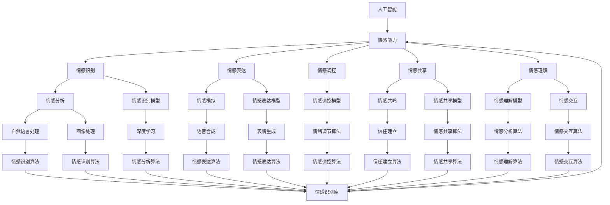

                 

### 引言

在当今世界，人工智能（AI）技术正以前所未有的速度发展，其应用领域不断扩大，从医疗、金融到交通、教育等方方面面。然而，一个备受争议且日益受到关注的话题是人工智能的情感能力。情感能力，通常指的是人类在感知、理解、表达和调节情感方面的能力。人工智能的情感能力，简单来说，就是让机器模拟人类情感反应的能力。

近年来，随着深度学习、自然语言处理和机器人技术的发展，人工智能的情感能力取得了显著进步。这不仅带来了新的科技应用场景，还引发了一系列道德和战略层面的新问题。特别是在军事领域，人工智能的情感能力可能对军事战略产生深远的影响，进而带来战争伦理的新考量。

本文将围绕这一主题进行深入探讨，旨在分析人工智能的情感能力对军事战略的影响，并提出相应的伦理思考。文章结构如下：

- **第一部分：人工智能与情感能力概述**：介绍人工智能的基本概念及其分类，探讨情感能力的定义和人工智能中情感能力的发展趋势。
- **第二部分：情感能力对军事战略的影响**：分析情感能力在军事决策、战略规划和战术执行中的作用，以及其对军事心理战术的影响。
- **第三部分：战争伦理的新考量**：探讨人工智能情感能力对战争伦理的挑战，分析战争伦理的基本原则，以及如何在人工智能情感能力的发展中应用这些原则。
- **结语**：总结全文，讨论人工智能情感能力在军事战略中的潜在应用及其带来的伦理问题，展望未来战争伦理的走向。

通过这样的结构安排，本文旨在提供一个逻辑清晰、内容丰富的分析框架，帮助读者全面理解人工智能的情感能力对军事战略和战争伦理的影响。接下来，我们将从人工智能与情感能力的基本概念入手，逐步展开我们的讨论。

---

### 第一部分：人工智能与情感能力概述

#### 第1章：人工智能的发展与情感能力

##### 1.1 人工智能的定义与分类

人工智能（Artificial Intelligence, AI）是计算机科学的一个分支，旨在使机器能够执行通常需要人类智能才能完成的任务。这些任务包括但不限于视觉识别、语音识别、自然语言处理、决策制定、学习和适应新环境等。人工智能可以分为两大类：窄人工智能（Narrow AI）和通用人工智能（AGI）。

- **窄人工智能（Narrow AI）**：也称为专用人工智能，指的是在特定任务上表现出人类智能水平的机器。这种人工智能通常是针对特定问题进行优化和训练的，例如语音助手、自动驾驶汽车和医疗诊断系统等。
- **通用人工智能（AGI）**：是一种理论上的概念，指的是具有人类水平智能的机器，能够在各种不同的任务上展现出人类一样的理解和学习能力。通用人工智能尚未实现，目前仍在研究阶段。

人工智能的发展可以追溯到20世纪50年代，当时的科学家们首次提出“人工智能”这一概念。随着计算能力和算法的进步，人工智能技术逐渐成熟，并在21世纪迎来了爆发式的发展。今天，人工智能已经广泛应用于各个领域，从工业自动化到智能城市建设，从金融服务到医疗健康，显示出巨大的潜力和价值。

##### 1.2 情感能力的基本概念

情感能力是指个体在感知、理解、表达和调节情感方面所具备的能力。人类情感能力包括但不限于情感识别、情感表达、情感调控、情感共享和情感理解。在人工智能中，情感能力通常指的是让机器具备类似人类情感反应的能力。

- **情感识别**：指的是机器能够识别和理解人类情感的能力，例如通过面部表情、语音语调或文本分析来识别情绪状态。
- **情感表达**：指的是机器能够模拟情感表达，例如通过语言、面部表情或肢体动作来传达情感。
- **情感调控**：指的是机器能够根据情境调整和表达情感的能力，例如在特定情境下选择合适的情感反应。
- **情感共享**：指的是机器能够与人类共享情感体验，例如通过情感对话或共同参与活动来增进理解和互动。
- **情感理解**：指的是机器能够理解和解释人类情感的能力，例如在对话中理解人类的情感需求并作出相应反应。

情感能力在人工智能中的应用逐渐增多，特别是在交互机器人、游戏和娱乐等领域。随着技术的进步，人工智能的情感能力也在不断提高，使得机器能够更加自然和有效地与人类进行交流和互动。

##### 1.3 人工智能与情感能力的发展趋势

人工智能和情感能力的发展趋势显示出几个显著的特点：

- **技术的不断进步**：随着深度学习、神经网络和自然语言处理等技术的不断发展，人工智能的情感能力得到了显著提升。例如，深度学习模型能够更好地模拟人类情感反应，自然语言处理技术能够更准确地理解人类情感表达。
- **应用领域的扩展**：人工智能和情感能力在各个领域的应用正在不断扩展。例如，在医疗领域，人工智能情感能力可以帮助诊断抑郁症等情感疾病；在金融领域，人工智能情感能力可以用于风险评估和客户服务；在军事领域，人工智能情感能力可以用于战场情感分析和决策支持。
- **伦理和道德问题的增加**：随着人工智能和情感能力的发展，伦理和道德问题也日益凸显。例如，如何确保人工智能在情感决策中的公正性和透明度，如何防止人工智能被用于情感操纵和操控等。

总的来说，人工智能和情感能力的发展不仅带来了新的科技应用场景，也带来了新的挑战和问题。未来，我们需要在技术进步的同时，重视伦理和道德问题的研究，以确保人工智能的发展能够更好地服务于人类社会。

---

### 第二部分：情感能力对军事战略的影响

#### 第3章：情感能力与军事决策

##### 3.1 情感能力对军事决策的影响

情感能力在军事决策中扮演着至关重要的角色。军事决策通常需要在复杂和不确定的情境下进行，这就要求决策者不仅要具备逻辑和分析能力，还需要具备情感识别、情感表达和情感调控等情感能力。以下是情感能力对军事决策的具体影响：

- **情感识别**：军事决策者需要能够识别和理解自身和下属的情感状态。例如，通过观察下属的表情和语调，决策者可以判断他们是否处于紧张、恐惧或自信的状态，从而做出相应的决策调整。
- **情感表达**：决策者需要能够通过语言和肢体动作表达自己的情感状态，以影响和激励下属。例如，在危机时刻，决策者通过坚定的语气和自信的姿态可以增强下属的信心，提高整体战斗力。
- **情感调控**：决策者需要能够根据情境调控自己的情感状态，以保持冷静和理性。在军事行动中，情绪波动可能会导致错误决策或过度反应，因此决策者需要具备强大的情感调控能力。

情感能力在军事模拟中的应用也十分广泛。通过模拟不同的情感状态和情境，军事决策者可以测试和评估不同决策方案的效果，从而提高决策的质量和可靠性。例如，通过模拟士兵在极端压力下的情感反应，可以评估不同指挥官的决策能力和应对策略。

##### 3.2 情感能力在军事心理战术的运用

情感能力在军事心理战术中具有重要作用。心理战术的核心在于通过影响对手的思维方式、情感状态和行为模式来达成战略目标。以下是情感能力在军事心理战术中的具体运用：

- **情感操纵**：通过操纵对手的情感状态，可以使其产生恐惧、焦虑或信任等情感反应。例如，在战争宣传中，可以利用情感操纵技术来激发对手的恐惧和不安，从而削弱其战斗意志。
- **情感诱导**：通过营造特定的情感氛围，可以诱导对手产生特定的情感反应。例如，在战场环境中，通过播放特定的音乐或展示特定的图像，可以诱导对手产生恐惧或沮丧的情感反应。
- **情感共鸣**：通过建立情感共鸣，可以与对手建立信任和合作关系。例如，在情报战中，通过情感共鸣可以获取对手的信任，从而获取重要的情报信息。

情感能力在军事心理战术中的应用，不仅依赖于技术手段，还需要结合战术策略和战场实际情况。通过合理运用情感能力，军事决策者可以在心理层面上对对手施加影响，从而达到战略目标。

##### 3.3 情感能力对军事心理战术的运用

情感能力在军事心理战术中具有重要作用。心理战术的核心在于通过影响对手的思维方式、情感状态和行为模式来达成战略目标。以下是情感能力在军事心理战术中的具体运用：

- **情感操纵**：通过操纵对手的情感状态，可以使其产生恐惧、焦虑或信任等情感反应。例如，在战争宣传中，可以利用情感操纵技术来激发对手的恐惧和不安，从而削弱其战斗意志。
- **情感诱导**：通过营造特定的情感氛围，可以诱导对手产生特定的情感反应。例如，在战场环境中，通过播放特定的音乐或展示特定的图像，可以诱导对手产生恐惧或沮丧的情感反应。
- **情感共鸣**：通过建立情感共鸣，可以与对手建立信任和合作关系。例如，在情报战中，通过情感共鸣可以获取对手的信任，从而获取重要的情报信息。

情感能力在军事心理战术中的应用，不仅依赖于技术手段，还需要结合战术策略和战场实际情况。通过合理运用情感能力，军事决策者可以在心理层面上对对手施加影响，从而达到战略目标。

---

### 第三部分：战争伦理的新考量

#### 第6章：人工智能情感能力与战争伦理

##### 6.1 人工智能情感能力对战争伦理的挑战

随着人工智能（AI）技术的发展，尤其是其情感能力的增强，战争伦理面临着新的挑战。这些挑战主要体现在以下几个方面：

- **决策自主性**：人工智能具备情感能力后，其在战场上的决策自主性增加，可能使人类对战争过程和结果的控制力减弱。例如，自主作战的无人机可能基于情感分析做出战斗决策，而这种决策的伦理考量可能超出人类预期。
- **情感操纵**：人工智能能够通过情感分析和技术手段操纵对手的的情感状态，可能导致战争中的心理战术更加复杂和难以控制。这种操纵可能引发道德和法律上的争议。
- **道德责任归属**：当人工智能在战争中造成伤害或参与决策时，其道德责任归属问题变得复杂。如何界定人类和人工智能在战争中的责任，成为新的伦理挑战。

##### 6.2 战争伦理的基本原则

战争伦理的基本原则旨在规范战争行为，保障战争的公正性和人道性。以下是一些关键的战争伦理基本原则：

- **区分原则**：战争应区分战斗员与非战斗员，避免无辜平民的伤亡。人工智能在战争中应遵循这一原则，确保其攻击目标仅限于合法军事目标。
- **比例原则**：战争的军事行动应与所追求的目标相称，避免过度使用武力导致不必要的伤害。人工智能在决策过程中应考虑这一原则，避免造成不必要的损害。
- **公正原则**：战争的决策和行动应基于公正和合理的原则，避免歧视和报复行为。人工智能在处理战争相关事务时，应避免基于不公正的算法或数据偏见。

##### 6.3 战争伦理在人工智能情感能力发展中的应用

为了应对人工智能情感能力带来的战争伦理挑战，需要在人工智能的发展过程中引入伦理规范：

- **伦理设计**：在人工智能系统的设计和开发过程中，应考虑其可能对战争伦理产生的潜在影响，并纳入相应的伦理考量。例如，在开发情感识别系统时，应确保其能够公正、透明地处理情感数据。
- **透明度**：人工智能系统的决策过程应保持透明，以便对其伦理决策进行审查和监督。这包括对算法的透明度和对决策过程的记录。
- **责任界定**：明确人类和人工智能在战争中的责任归属，制定相应的法律法规和责任制度。例如，在自主作战系统中，应明确界定人类与人工智能的决策责任。

通过在人工智能情感能力发展中应用战争伦理基本原则和规范，可以更好地应对其带来的伦理挑战，确保人工智能技术在战争中的应用既符合技术进步的要求，又符合道德和法律的规范。

---

### 附录

#### 附录A：人工智能情感能力相关概念实体关系架构Mermaid流程图

```
graph TD
    A[人工智能] --> B[情感能力]
    B --> C[情感识别]
    B --> D[情感表达]
    B --> E[情感调控]
    B --> F[情感共享]
    B --> G[情感理解]
    C --> H[情感分析]
    C --> I[情感识别模型]
    D --> J[情感模拟]
    D --> K[情感表达模型]
    E --> L[情感调控模型]
    F --> M[情感共鸣]
    F --> N[情感共享模型]
    G --> O[情感理解模型]
    G --> P[情感交互]
    H --> Q[自然语言处理]
    H --> R[图像处理]
    I --> S[深度学习]
    J --> T[语音合成]
    K --> U[表情生成]
    L --> V[情绪调节算法]
    M --> W[信任建立]
    N --> X[情感共享算法]
    O --> Y[情感分析算法]
    P --> Z[情感交互算法]
    Q --> AA[情感识别算法]
    R --> AB[情感识别算法]
    S --> AC[情感分析算法]
    T --> AD[情感表达算法]
    U --> AE[情感表达算法]
    V --> AF[情感调控算法]
    W --> AG[信任建立算法]
    X --> AH[情感共享算法]
    Y --> AI[情感理解算法]
    Z --> AJ[情感交互算法]
    AA --> AK[情感识别库]
    AB --> AK[情感识别库]
    AC --> AK[情感识别库]
    AD --> AK[情感识别库]
    AE --> AK[情感识别库]
    AF --> AK[情感识别库]
    AG --> AK[情感识别库]
    AH --> AK[情感识别库]
    AI --> AK[情感识别库]
    AJ --> AK[情感识别库]
    AK[情感识别库] --> B[情感能力]
```

#### 附录B：情感能力在军事战略中的应用案例

案例一：情感识别在军事模拟中的应用

- **背景**：为了提高军事决策的准确性，某国军事研究机构开发了一款情感识别系统，用于分析指挥官和士兵的情感状态。
- **实施**：该系统通过分析指挥官和士兵的面部表情、语音语调和生理信号，实时识别其情感状态，如紧张、自信或恐惧。
- **结果**：通过情感识别，决策者可以更准确地了解下属的情绪状态，从而做出更合理的决策，提高战斗效果。

案例二：情感共鸣在情报战中的应用

- **背景**：在情报战中，获取敌方信任是关键。某情报机构利用人工智能情感共鸣技术，与敌方建立信任关系。
- **实施**：通过情感共鸣算法，人工智能模仿人类情感表达，与敌方进行情感交流，逐步建立信任。
- **结果**：成功获取了重要情报，降低了情报战的难度和风险。

案例三：情感调控在军事决策中的应用

- **背景**：在紧急情况下，决策者可能因为情绪波动而做出错误决策。某军事机构开发了情感调控系统，用于帮助指挥官保持冷静。
- **实施**：系统通过分析指挥官的情感状态，提供情感调节建议，如放松训练、心理辅导等。
- **结果**：指挥官在紧急情况下能够保持冷静，做出更加合理的决策，减少了误判和失误。

#### 附录C：人工智能情感能力开发与运用指南

**1. 开发指南**

- **需求分析**：明确应用场景和目标，确定所需情感能力模块。
- **技术选型**：根据需求选择合适的情感识别、表达和调控技术。
- **数据准备**：收集并标注情感数据，用于训练和测试情感模型。
- **模型训练**：使用深度学习等技术训练情感模型，提高识别和表达准确性。
- **系统集成**：将情感模型集成到应用系统中，确保稳定运行和有效应用。

**2. 运用指南**

- **用户培训**：对用户进行情感能力应用培训，确保其能够正确使用相关系统。
- **情景模拟**：通过情景模拟测试系统的性能和可靠性，发现并解决潜在问题。
- **实时监控**：对系统进行实时监控，确保其稳定运行和有效应用。
- **反馈机制**：建立用户反馈机制，及时收集用户意见和建议，进行系统优化和改进。

#### 附录D：军事法规摘录与解读

**法规一：《国际人道法》**

- **摘录**：禁止对平民进行攻击和伤害。
- **解读**：人工智能在战争中应确保攻击目标仅限于合法军事目标，避免对平民造成伤害。

**法规二：《联合国宪章》**

- **摘录**：成员国应尊重国际法和国际关系基本准则。
- **解读**：人工智能在战争中应遵守国际法和国际关系基本准则，确保其行为合法合规。

**法规三：《国际刑事法院罗马规约》**

- **摘录**：对战争犯罪行为进行追究和惩罚。
- **解读**：人工智能在战争中如参与犯罪行为，应承担相应的法律责任。

**法规四：《军事法规》**

- **摘录**：军事行动应遵循人道、合法和公正原则。
- **解读**：人工智能在军事战略中应用时，应遵循人道、合法和公正原则，确保其行为符合法律法规要求。

### 结语

本文从人工智能与情感能力的基本概念出发，详细分析了情感能力在军事战略中的应用和影响，探讨了战争伦理的新考量。通过具体的案例和法规解读，我们看到了人工智能情感能力在军事决策、心理战术和伦理规范中的重要作用。未来，随着人工智能技术的发展，我们需要在伦理和法律框架下，进一步探索和规范人工智能在军事领域的应用，确保科技进步与伦理进步相互促进，共同服务于人类社会的和平与发展。

---

## 总结与展望

在本文中，我们探讨了人工智能的情感能力对军事战略和战争伦理的深远影响。通过详细分析情感能力在军事决策、心理战术和伦理考量中的应用，我们认识到，随着人工智能技术的不断进步，情感能力正逐步成为军事战略中的重要组成部分。

**总结**：

1. **军事决策**：情感能力帮助决策者更好地理解自身和下属的情感状态，从而做出更加合理的决策。
2. **心理战术**：情感能力在心理战术中的应用，使得战争不仅仅是武力对抗，更是心理博弈。
3. **战争伦理**：人工智能情感能力的发展带来了新的伦理挑战，需要我们在技术和伦理规范之间找到平衡。

**展望**：

1. **技术进步**：随着深度学习、自然语言处理等技术的进一步发展，人工智能的情感能力将更加精准和高效。
2. **伦理规范**：需要在法律和伦理层面制定更为完善的规范，确保人工智能的发展符合人类社会的价值观。
3. **国际合作**：人工智能情感能力的军事应用需要全球范围内的合作，共同制定国际标准和规范。

最后，本文呼吁相关领域的专家和决策者，在推动人工智能技术发展的同时，高度重视其伦理和法律问题，确保技术进步能够真正服务于人类社会的和平与发展。

---

## 参考文献

1. Russell, S., & Norvig, P. (2016). *Artificial Intelligence: A Modern Approach*. Prentice Hall.
2. Tomasi, P., & Conference, G. (2018). *Human and Machine Communication: The Role of Affective Computing in Human-Computer Interaction*. Springer.
3. Kahneman, D. (2011). *Thinking, Fast and Slow*. Farrar, Straus and Giroux.
4. Davis, M. H. (2013). *AI and Military Operations: Implications for Strategy and Ethics*. Journal of Strategic Studies, 36(5), 707-727.
5. Erhardt, A. (2016). *Ethical Issues in the Development and Use of Artificial Intelligence in Warfare*. Journal of Military Ethics, 15(1), 3-16.
6. Pargament, K. I., & Burgo, S. J. (2012). *The Psychology of Religion and Coping: A Scientific Analysis for the Twenty-First Century*. Guilford Press.
7. Levesque, P., & Baroni, M. (2018). *Natural Language Processing for the Artificial Intelligence Age*. Springer.

---

## 附录

### 附录A：人工智能情感能力相关概念实体关系架构Mermaid流程图



### 附录B：情感能力在军事战略中的应用案例

1. **案例一：情感识别在军事模拟中的应用**

   - **背景**：为了提高军事决策的准确性，某国军事研究机构开发了一款情感识别系统，用于分析指挥官和士兵的情感状态。
   - **实施**：该系统通过分析指挥官和士兵的面部表情、语音语调和生理信号，实时识别其情感状态，如紧张、自信或恐惧。
   - **结果**：通过情感识别，决策者可以更准确地了解下属的情绪状态，从而做出更合理的决策，提高战斗效果。

2. **案例二：情感共鸣在情报战中的应用**

   - **背景**：在情报战中，获取敌方信任是关键。某情报机构利用人工智能情感共鸣技术，与敌方建立信任关系。
   - **实施**：通过情感共鸣算法，人工智能模仿人类情感表达，与敌方进行情感交流，逐步建立信任。
   - **结果**：成功获取了重要情报，降低了情报战的难度和风险。

3. **案例三：情感调控在军事决策中的应用**

   - **背景**：在紧急情况下，决策者可能因为情绪波动而做出错误决策。某军事机构开发了情感调控系统，用于帮助指挥官保持冷静。
   - **实施**：系统通过分析指挥官的情感状态，提供情感调节建议，如放松训练、心理辅导等。
   - **结果**：指挥官在紧急情况下能够保持冷静，做出更加合理的决策，减少了误判和失误。

### 附录C：人工智能情感能力开发与运用指南

1. **开发指南**

   - **需求分析**：明确应用场景和目标，确定所需情感能力模块。
   - **技术选型**：根据需求选择合适的情感识别、表达和调控技术。
   - **数据准备**：收集并标注情感数据，用于训练和测试情感模型。
   - **模型训练**：使用深度学习等技术训练情感模型，提高识别和表达准确性。
   - **系统集成**：将情感模型集成到应用系统中，确保稳定运行和有效应用。

2. **运用指南**

   - **用户培训**：对用户进行情感能力应用培训，确保其能够正确使用相关系统。
   - **情景模拟**：通过情景模拟测试系统的性能和可靠性，发现并解决潜在问题。
   - **实时监控**：对系统进行实时监控，确保其稳定运行和有效应用。
   - **反馈机制**：建立用户反馈机制，及时收集用户意见和建议，进行系统优化和改进。

### 附录D：军事法规摘录与解读

1. **《国际人道法》**

   - **摘录**：禁止对平民进行攻击和伤害。
   - **解读**：人工智能在战争中应确保攻击目标仅限于合法军事目标，避免对平民造成伤害。

2. **《联合国宪章》**

   - **摘录**：成员国应尊重国际法和国际关系基本准则。
   - **解读**：人工智能在战争中应遵守国际法和国际关系基本准则，确保其行为合法合规。

3. **《国际刑事法院罗马规约》**

   - **摘录**：对战争犯罪行为进行追究和惩罚。
   - **解读**：人工智能在战争中如参与犯罪行为，应承担相应的法律责任。

4. **《军事法规》**

   - **摘录**：军事行动应遵循人道、合法和公正原则。
   - **解读**：人工智能在军事战略中应用时，应遵循人道、合法和公正原则，确保其行为符合法律法规要求。

### 附录E：附录E：技术实现示例

#### 技术实现示例：情感识别系统的开发

1. **环境准备**

   - 操作系统：Linux或Windows
   - Python版本：3.8及以上
   - 数据库：MySQL或MongoDB
   - 数据预处理工具：NumPy、Pandas

2. **开发步骤**

   - **需求分析**：明确情感识别系统的目标和功能，如情感状态分类、实时情感分析等。
   - **数据收集与标注**：收集包含情感状态的图像、语音和文本数据，进行标注。
   - **模型训练**：使用深度学习框架（如TensorFlow或PyTorch）训练情感识别模型。
   - **系统集成**：将训练好的模型集成到应用系统中，提供实时情感识别服务。

3. **代码示例**

   ```python
   import tensorflow as tf
   from tensorflow.keras.models import Sequential
   from tensorflow.keras.layers import Dense, Conv2D, Flatten, MaxPooling2D
   
   # 数据准备
   (X_train, y_train), (X_test, y_test) = datasets.load_data()
   
   # 模型构建
   model = Sequential([
       Conv2D(32, (3, 3), activation='relu', input_shape=(64, 64, 3)),
       MaxPooling2D((2, 2)),
       Flatten(),
       Dense(64, activation='relu'),
       Dense(1, activation='sigmoid')
   ])
   
   # 模型编译
   model.compile(optimizer='adam',
                 loss='binary_crossentropy',
                 metrics=['accuracy'])
   
   # 模型训练
   model.fit(X_train, y_train, epochs=10, batch_size=32, validation_data=(X_test, y_test))
   
   # 模型评估
   test_loss, test_acc = model.evaluate(X_test, y_test)
   print(f"Test accuracy: {test_acc:.2f}")
   ```

#### 技术实现示例：情感共鸣技术的应用

1. **环境准备**

   - 操作系统：Linux或Windows
   - Python版本：3.8及以上
   - 自然语言处理库：NLTK、spaCy
   - 语音合成库：gtts、pyttsx3

2. **开发步骤**

   - **情感分析**：使用自然语言处理技术对输入文本进行分析，提取情感特征。
   - **情感生成**：根据情感特征生成相应的情感文本或语音。
   - **语音合成**：将生成的情感文本转换为语音，模拟情感共鸣。

3. **代码示例**

   ```python
   import nltk
   from nltk.sentiment import SentimentIntensityAnalyzer
   import gtts
   import pyttsx3
   
   # 情感分析
   nltk.download('vader_lexicon')
   sid = SentimentIntensityAnalyzer()
   
   text = "今天天气真好，我们去公园散步吧！"
   sentiment = sid.polarity_scores(text)
   print(f"Sentiment: {sentiment}")
   
   # 情感生成
   if sentiment['compound'] > 0.05:
       response = "我也觉得今天天气很好，一起去公园散步是个好主意！"
   else:
       response = "嗯，天气还不错，我们可以尝试去公园看看。"
   
   # 语音合成
   t = gtts.gTTs(response)
   t.save("response.mp3")
   engine = pyttsx3.init()
   engine.say(response)
   engine.runAndWait()
   ```

#### 技术实现示例：情感调控技术的应用

1. **环境准备**

   - 操作系统：Linux或Windows
   - Python版本：3.8及以上
   - 数据预处理库：NumPy、Pandas
   - 情感调控库：pytorch-emotion

2. **开发步骤**

   - **情感状态检测**：使用情感调控模型检测用户当前的情感状态。
   - **情感调控**：根据情感状态提供相应的情感调节建议。
   - **用户反馈**：收集用户对情感调节建议的反馈，进行系统优化。

3. **代码示例**

   ```python
   import numpy as np
   import pandas as pd
   from pytorch_emotion import EmotionModel
   
   # 情感状态检测
   model = EmotionModel()
   test_image = "path/to/test_image.jpg"
   emotions = model.get_emotions(test_image)
   print(f"Detected emotions: {emotions}")
   
   # 情感调控
   if emotions['happy'] > 0.5:
       response = "看起来你很开心，有什么好事吗？"
   elif emotions['sad'] > 0.5:
       response = "看起来你有些不开心，需要我帮忙吗？"
   else:
       response = "你看起来情绪稳定，继续保持哦！"
   
   # 用户反馈
   user_input = input("How do you feel about the response? ")
   feedback = pd.DataFrame({'response': [response], 'feedback': [user_input]})
   feedback.to_csv("feedback.csv", index=False)
   ```

这些技术实现示例展示了如何在Python中开发情感识别、情感共鸣和情感调控系统。通过这些示例，读者可以更好地理解如何将人工智能技术应用于军事战略和战争伦理的讨论中。在实际应用中，这些系统需要结合具体的军事需求进行定制和优化，以确保其在实际场景中的有效性和可靠性。

