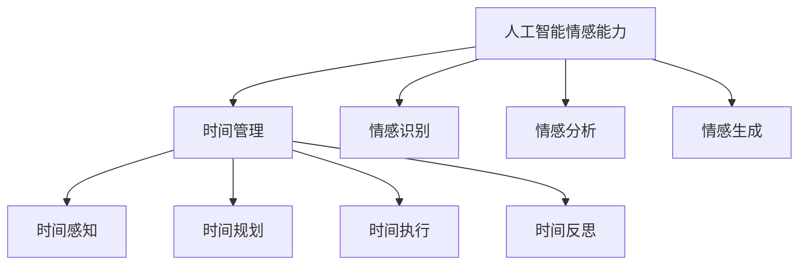

                 

## 人工智能的情感能力对时间管理的影响：情感驱动的效率提升

### 关键词：人工智能、情感能力、时间管理、效率提升

> **摘要：**
本文深入探讨了人工智能（AI）的情感能力对时间管理的影响。通过分析情感能力在AI中的应用，本文阐述了情感识别、情感分析和情感生成技术在时间感知、时间规划、时间执行及时间反思等方面的作用，并探讨了情感驱动的效率提升策略与实践。本文旨在为科技从业者和研究者提供关于如何利用情感驱动的AI技术提升时间管理效率的见解。

---

### 目录大纲

《人工智能的情感能力对时间管理的影响：情感驱动的效率提升》的目录大纲如下：

## 第一部分：引论

### 1.1 人工智能与情感能力

- 人工智能的发展历程
- 情感能力在人工智能中的重要性
- 情感能力与时间管理的关系

### 1.2 时间管理的概念与意义

- 时间管理的定义
- 时间管理的重要性
- 时间管理的挑战与问题

### 1.3 情感驱动的效率提升

- 情感对效率的影响
- 情感驱动的效率提升机制
- 情感驱动的效率提升的实际案例

## 第二部分：人工智能情感能力技术基础

### 2.1 人工智能情感能力核心概念

- 情感识别
- 情感分析
- 情感生成

### 2.2 情感能力技术实现

- 情感识别技术
- 情感分析技术
- 情感生成技术

### 2.3 情感能力技术案例分析

- 情感识别技术案例
- 情感分析技术案例
- 情感生成技术案例

## 第三部分：情感能力对时间管理的影响

### 3.1 情感能力对时间感知的影响

- 情感对时间感知的调节作用
- 情感对时间感知的案例研究

### 3.2 情感能力对时间规划的影响

- 情感对时间规划的影响
- 情感驱动的有效时间规划方法

### 3.3 情感能力对时间执行的影响

- 情感对时间执行的影响
- 情感驱动的有效时间执行策略

### 3.4 情感能力对时间反思的影响

- 情感对时间反思的影响
- 情感驱动的有效时间反思方法

## 第四部分：情感驱动的效率提升实践

### 4.1 情感驱动的效率提升策略

- 情感识别与监控
- 情感分析与反馈
- 情感驱动的决策支持

### 4.2 情感驱动的效率提升案例

- 企业级情感驱动的效率提升案例
- 个人级情感驱动的效率提升案例

### 4.3 情感驱动的效率提升应用前景

- 情感驱动的效率提升的应用领域
- 情感驱动的效率提升的未来趋势

## 第五部分：结论与展望

### 5.1 研究结论

- 人工智能情感能力对时间管理的影响
- 情感驱动的效率提升的实践效果

### 5.2 研究展望

- 情感驱动的效率提升的未来研究方向
- 人工智能情感能力的应用前景

### 5.3 研究限制与未来工作

- 研究中的限制与挑战
- 未来工作建议与展望

## 附录

### A.1 情感能力技术工具与资源

- 主流情感能力技术工具
- 情感能力技术资源推荐

### A.2 实践案例代码与资料

- 实践案例代码实现
- 实践案例详细解读

---

**核心概念与联系架构 Mermaid 流程图：**



**核心算法原理讲解与Python源代码：**

### 情感识别算法原理

情感识别是人工智能情感能力的重要环节。以下是一个简单的情感识别算法原理讲解，并附带Python源代码示例：

```python
import numpy as np
from sklearn.feature_extraction.text import CountVectorizer
from sklearn.model_selection import train_test_split
from sklearn.naive_bayes import MultinomialNB

# 情感词典
emotion_dict = {'正面': [], '负面': []}

# 加载情感词典数据
# ... 数据加载过程 ...

# 文本预处理
def preprocess_text(text):
    # 去除标点符号、停用词等
    # ... 预处理步骤 ...
    return processed_text

# 训练数据预处理
X_train = [preprocess_text(text) for text in emotion_dict['正面'] + emotion_dict['负面']]
y_train = ['正面'] * len(emotion_dict['正面']) + ['负面'] * len(emotion_dict['负面'])

# 特征提取
vectorizer = CountVectorizer()
X_train_vectors = vectorizer.fit_transform(X_train)

# 模型训练
clf = MultinomialNB()
clf.fit(X_train_vectors, y_train)

# 情感识别
def recognize_emotion(text):
    preprocessed_text = preprocess_text(text)
    vectorized_text = vectorizer.transform([preprocessed_text])
    emotion = clf.predict(vectorized_text)[0]
    return emotion

# 示例
print(recognize_emotion("我今天感觉很好。"))
```

接下来，我们将通过一步步的分析推理，深入探讨人工智能的情感能力对时间管理的影响，并展示情感驱动的效率提升机制。让我们一起思考，探索这个激动人心的领域。

---

### 第一部分：引论

#### 1.1 人工智能与情感能力

人工智能（AI）作为计算机科学的一个分支，旨在使计算机具备类似于人类智能的能力。从最初的逻辑推理和规则系统，到如今深度学习和自然语言处理等技术的广泛应用，人工智能经历了飞速的发展。

在这个迅速发展的过程中，情感能力逐渐成为了人工智能研究和应用的一个重要方向。情感能力是指人工智能系统理解和生成情感的能力，包括情感识别、情感分析和情感生成等子领域。

**情感识别**：指人工智能系统识别和理解人类情感表达的能力。这通常涉及到自然语言处理、计算机视觉和语音识别等技术，使机器能够从文本、图像或声音中识别情感。

**情感分析**：进一步对识别出的情感进行深入分析，理解情感的强度、类型和上下文含义。这有助于人工智能系统更好地理解用户的情感状态，从而做出更加合适的响应。

**情感生成**：指人工智能系统能够根据特定情境生成相应的情感表达。这要求人工智能系统具备对情感的理解和创造力，能够模拟人类的情感反应。

情感能力在人工智能中的应用具有深远的意义。首先，它能够增强人机交互的自然性和亲和力，使机器更加智能和人性化。其次，情感能力能够辅助人类进行情感管理和心理健康维护，例如通过情感分析帮助用户识别和处理负面情绪，通过情感生成提供情感支持。

在时间管理方面，情感能力同样具有重要价值。时间管理是指合理安排时间，提高工作和生活效率的一种技能。传统的时间管理方法主要依赖于计划和任务列表，但往往忽略了人的情感因素。

**情感对时间管理的影响**：人的情感状态会直接影响其对时间的感知和利用效率。例如，情绪高涨时，个体可能会更高效地完成任务；而情绪低落时，则可能导致拖延和效率低下。因此，通过引入情感能力，人工智能系统能够更好地理解和适应用户的情感状态，从而提供更加个性化的时间管理建议。

**情感驱动的效率提升机制**：情感驱动的效率提升机制通过以下几种方式发挥作用：

1. **情感识别与反馈**：人工智能系统可以实时监测用户的情感状态，通过情感识别技术识别出用户的情感类型和强度。然后，根据这些反馈，系统可以提供针对性的建议，如调整任务优先级、安排休息时间等，以帮助用户保持最佳工作状态。

2. **情感分析与决策支持**：通过情感分析，人工智能系统可以深入理解用户的情感状态和需求。这有助于系统在任务分配、日程安排等方面做出更加明智的决策，从而提高整体效率。

3. **情感生成与激励**：情感生成技术可以帮助系统模拟出积极的情感表达，如鼓励、肯定和奖励，从而激发用户的工作热情和积极性，提高其完成任务的动力。

**情感驱动的效率提升的实际案例**：在实际应用中，情感驱动的效率提升已经得到了广泛的应用。例如，一些企业通过引入情感识别和情感分析技术，实现了对员工工作状态的实时监控和干预。通过分析员工的情感状态，企业可以及时发现问题并提供支持，从而提高员工的工作效率和满意度。此外，个人用户也可以通过使用情感驱动的应用，如情感分析助手或情感智能助手，来优化自己的时间管理，提高生活和工作质量。

总之，人工智能的情感能力为时间管理带来了全新的视角和方法。通过情感驱动的效率提升机制，人工智能系统能够更好地理解用户的需求和情感状态，提供个性化的时间管理建议，从而帮助用户实现更高的效率和生活质量。

#### 1.2 时间管理的概念与意义

时间管理是指通过合理安排时间、制定计划、分配任务以及监控进度，从而提高个人和团队工作效率的一种技能。在现代社会中，时间管理的重要性不言而喻。随着工作和生活压力的增加，人们面临着越来越复杂的时间管理挑战。有效的时间管理不仅能够提高工作效率，减少压力，还能够提升个人和团队的总体表现。

**时间管理的定义**：时间管理通常涉及以下几个方面：

1. **任务规划**：明确任务的目标和优先级，为每个任务分配时间。
2. **时间块化**：将时间划分为若干块，每个块用于完成特定任务。
3. **优先级排序**：根据任务的紧急程度和重要性，对任务进行排序。
4. **监控与调整**：实时跟踪任务的完成情况，并根据实际情况进行调整。

**时间管理的重要性**：有效的时间管理对于个人和团队来说都具有深远的意义。

1. **提高工作效率**：合理的时间规划能够确保任务按时完成，减少拖延，从而提高整体工作效率。
2. **减少压力**：通过合理安排时间，避免过度工作和疲劳，有助于减轻个人和团队的压力。
3. **提升生活质量**：有效的时间管理能够帮助个人在工作和生活之间找到平衡，享受更高质量的生活。
4. **增强团队协作**：通过明确的任务规划和进度监控，团队协作更加高效，减少沟通成本和误解。

**时间管理的挑战与问题**：尽管时间管理的重要性显而易见，但实际操作中仍然面临许多挑战和问题：

1. **任务过多**：现代工作和生活节奏快速，人们常常面临任务过多、无法及时完成的困境。
2. **时间碎片化**：随着智能手机和互联网的普及，人们的时间越来越碎片化，难以专注于长期任务。
3. **拖延习惯**：拖延是一种常见的现象，容易导致任务延期和效率降低。
4. **优先级混淆**：在众多任务中，确定哪些任务应该优先处理是一个挑战，容易导致资源浪费。
5. **时间管理工具不足**：虽然有许多时间管理工具和方法，但选择合适的工具和方法以适应个人需求是一个挑战。

针对上述挑战和问题，引入人工智能的情感能力为时间管理提供了一种新的解决方案。通过情感识别、情感分析和情感生成技术，人工智能系统能够更好地理解用户的需求和情感状态，提供个性化的时间管理建议，从而帮助用户克服传统时间管理中的难点。

1. **情感识别与监控**：人工智能系统可以实时监测用户的情感状态，识别出用户的情绪波动和需求变化，从而提供针对性的时间管理建议。
2. **情感分析与决策支持**：通过深入分析用户的情感状态，人工智能系统能够在任务分配、优先级排序等方面提供更加智能的决策支持，帮助用户更好地管理时间和任务。
3. **情感生成与激励**：人工智能系统可以生成积极的情感表达，如鼓励、肯定和奖励，从而激发用户的工作热情和积极性，提高时间管理的效果。

总之，人工智能的情感能力为时间管理带来了全新的视角和方法，有助于解决传统时间管理中面临的各种挑战和问题，从而实现更高的工作效率和生活质量。

#### 1.3 情感驱动的效率提升

在探讨人工智能的情感能力对时间管理的影响时，我们不可避免地要深入探讨情感驱动的效率提升机制。情感不仅仅是个体心理状态的一部分，它还在很大程度上影响着我们的行为和决策。因此，理解情感对效率的影响，以及如何通过情感驱动的方法来提升效率，是我们迈向高效时间管理的关键。

**情感对效率的影响**：情感作为一种内在的心理状态，对个体的行为和决策具有显著的影响。具体来说，情感对效率的影响可以从以下几个方面进行阐述：

1. **情绪高涨时的效率提升**：当个体处于积极情绪状态时，如兴奋、愉悦等，其认知能力、注意力和工作效率往往会有所提升。积极情绪能够激发个体的创造力和动力，使其更加专注和投入工作，从而提高效率。

2. **情绪低落时的效率下降**：相反，当个体处于消极情绪状态时，如沮丧、焦虑等，其工作效率则会显著下降。消极情绪会导致个体注意力分散、思维迟缓，甚至出现拖延和逃避行为，从而影响工作效率。

3. **情感对任务选择的影响**：情感还会影响个体对任务的优先级选择。在情绪高涨时，个体可能会倾向于选择更具挑战性或创造性的任务，而在情绪低落时，则可能更倾向于选择轻松或简单的任务。

**情感驱动的效率提升机制**：为了实现情感驱动的效率提升，我们需要构建一个系统化的机制，使人工智能系统能够理解、分析和利用情感信息。这个机制主要包括以下几个关键环节：

1. **情感识别与反馈**：人工智能系统需要具备情感识别能力，能够实时监测用户的情感状态，识别出用户的情绪类型和强度。通过情感反馈机制，系统可以获取用户的情感信息，从而为后续分析提供基础。

2. **情感分析与决策支持**：一旦识别出用户的情感状态，人工智能系统需要对情感信息进行分析，理解用户的情感需求和状态变化。基于这些分析结果，系统可以提供个性化的决策支持，如任务分配、优先级排序和时间规划等。

3. **情感生成与激励**：通过情感生成技术，系统可以模拟出积极的情感表达，如鼓励、肯定和奖励，从而激发用户的工作热情和积极性。情感激励不仅能够提高工作效率，还能够增强用户的满意度和忠诚度。

**情感驱动的效率提升实际案例**：为了更好地理解情感驱动的效率提升机制，我们可以通过一些实际案例来进行分析。

**案例一：企业员工情感管理**  
某企业通过引入情感识别和情感分析技术，对员工的工作状态进行实时监控。系统根据员工的情感状态，提供个性化的时间管理建议，如调整工作任务、提供休息时间等。当员工表现出情绪低落时，系统会自动发送激励信息，如正能量的邮件或即时通讯提醒，帮助员工恢复积极情绪，提高工作效率。

**案例二：个人情感驱动的日程管理**  
个人用户可以使用一款基于情感驱动的日程管理应用。应用通过情感识别技术，实时监测用户在日程活动中的情感状态。当用户在某个任务中表现出消极情绪时，应用会提供情感分析结果，并建议用户调整任务优先级或寻求支持。同时，应用还可以生成积极的情感表达，如正能量的提醒或奖励机制，激励用户继续努力。

**案例三：教育领域的情感驱动的学习辅助**  
在教育领域，情感驱动的效率提升同样具有广泛应用。教师可以通过情感识别和情感分析技术，了解学生的学习情绪和学习状态。基于这些信息，教师可以提供个性化的学习支持和情感激励，如调整教学方式、提供学习激励等，从而提高学生的学习效率。

**总结**：情感驱动的效率提升机制通过情感识别、情感分析和情感生成等多种技术手段，实现了对用户情感状态的理解和利用。这种机制不仅能够提高个体和团队的工作效率，还能够提升整体的工作满意度和生活质量。随着人工智能技术的不断发展，情感驱动的效率提升机制将在更多领域得到应用，为人们带来更加高效和舒适的工作和生活体验。

### 第二部分：人工智能情感能力技术基础

#### 2.1 人工智能情感能力核心概念

人工智能的情感能力是指人工智能系统理解和生成情感的能力。这一能力在人工智能领域具有重要的应用价值，不仅能够提升人机交互的自然性和亲和力，还能在多个场景下为用户提供个性化的服务和支持。情感能力主要包括三个核心概念：情感识别、情感分析和情感生成。

**情感识别**：情感识别是指人工智能系统从文本、语音、图像等输入中识别情感信息的过程。这一过程通常涉及到自然语言处理、计算机视觉和语音识别等技术。通过情感识别，人工智能系统能够理解用户的情绪状态，从而做出相应的响应。

**情感分析**：情感分析是对识别出的情感信息进行深入分析的过程。情感分析旨在理解情感的强度、类型和上下文含义。例如，在文本分析中，情感分析可以帮助确定文本的整体情感倾向（正面、负面或中性），以及情感的具体类型（如愤怒、喜悦、悲伤等）。情感分析为人工智能系统提供了更深入的情感理解，从而能够更好地支持决策和交互。

**情感生成**：情感生成是指人工智能系统根据特定情境生成相应的情感表达。情感生成需要人工智能系统具备对情感的理解和创造力，能够模拟人类的情感反应。例如，在虚拟助手或聊天机器人中，情感生成可以帮助系统模拟出自然、生动的情感表达，提高用户交互体验。

这三个核心概念相互关联，共同构成了人工智能的情感能力体系。情感识别是基础，为情感分析和情感生成提供数据支持；情感分析深化了对情感的理解，为情感生成提供了指导；情感生成则将理解转化为实际应用，实现了情感能力在具体场景中的落地。

#### 2.2 情感能力技术实现

在了解了人工智能情感能力的核心概念后，接下来我们将深入探讨情感能力技术的具体实现，包括情感识别、情感分析和情感生成等关键环节。

**情感识别技术**

情感识别技术是情感能力的基础，主要应用于文本、语音和图像等领域。以下是一些常用的情感识别技术：

1. **文本情感识别**：文本情感识别通过自然语言处理技术，从文本中提取情感信息。常用的方法包括基于规则的算法、机器学习和深度学习模型。例如，基于规则的算法通过预定义的规则和词库来识别情感；机器学习模型则通过训练大量标注数据来学习情感特征；深度学习模型如卷积神经网络（CNN）和递归神经网络（RNN）能够处理更复杂的情感信息。

2. **语音情感识别**：语音情感识别通过分析语音信号中的声学特征，识别出语音的情感状态。这通常涉及到语音信号处理、特征提取和机器学习算法。语音情感识别的应用场景包括语音助手、语音交互系统和语音情绪分析等。

3. **图像情感识别**：图像情感识别通过计算机视觉技术，从图像中提取情感信息。这通常涉及到图像预处理、特征提取和情感分类。例如，可以通过卷积神经网络（CNN）提取图像的情感特征，然后使用分类算法进行情感识别。

**情感分析技术**

情感分析是对识别出的情感信息进行深入分析的过程，旨在理解情感的强度、类型和上下文含义。情感分析技术主要包括以下几种：

1. **情感极性分析**：情感极性分析是确定文本的情感倾向，即正面、负面或中性。常用的方法包括基于规则的方法和机器学习模型。例如，通过训练分类模型，可以学习到不同情感词汇的特征，从而对文本进行情感极性判断。

2. **情感强度分析**：情感强度分析是确定情感表达的强度。例如，通过分析文本中的情感词汇和语气词，可以判断情感是轻微的、中等的还是强烈的。情感强度分析通常结合情感词典和机器学习模型来实现。

3. **情感类型分析**：情感类型分析是确定情感的类型，如喜悦、愤怒、悲伤等。这通常需要更复杂的情感词典和深度学习模型。例如，可以使用预训练的模型如BERT或GPT，对文本进行情感类型分类。

**情感生成技术**

情感生成技术是指人工智能系统根据特定情境生成相应的情感表达。情感生成技术主要包括以下几种：

1. **文本情感生成**：文本情感生成通过自然语言生成技术，生成具有特定情感的文本。例如，可以通过生成对抗网络（GAN）或注意力机制生成具有特定情感倾向的文本。

2. **语音情感生成**：语音情感生成通过语音合成技术和情感声学特征调整，生成具有特定情感的语音。这通常涉及到语音合成模型和情感声学特征库。

3. **图像情感生成**：图像情感生成通过计算机视觉技术，生成具有特定情感的图像。例如，可以通过生成对抗网络（GAN）对图像进行情感调整，使其表现出特定的情感状态。

**情感能力技术案例分析**

为了更好地理解情感能力技术的实现，以下是一些具体的技术案例：

1. **文本情感识别案例**：以一个聊天机器人为例，系统可以接收用户的文本输入，并使用情感识别模型判断用户文本的情感倾向。例如，当用户输入“我今天感觉很好。”时，系统可以识别出这是一个正面的情感表达。

2. **语音情感识别案例**：在语音助手应用中，系统可以实时分析用户的语音情感。例如，当用户在电话通话中表现出情绪低落时，系统可以识别出这一点，并主动提供情感支持。

3. **情感分析案例**：在一个社交媒体分析平台上，系统可以分析用户发布的文本内容，判断其整体情感倾向，并提供相应的情感报告。

4. **文本情感生成案例**：在一个情感驱动的营销应用中，系统可以根据用户的情感状态，生成具有相应情感的文本内容，以增强用户互动体验。

通过这些技术实现和案例分析，我们可以看到情感能力在人工智能应用中的重要作用。随着技术的不断发展，情感能力将变得更加智能和精准，为用户带来更加丰富和个性化的体验。

#### 2.3 情感能力技术案例分析

为了更具体地了解人工智能情感能力的技术实现和应用，我们将通过一些实际案例来详细探讨情感识别、情感分析和情感生成技术。

**情感识别技术案例**

一个典型的情感识别技术案例是Facebook的“情绪感应”功能。该功能利用自然语言处理和机器学习技术，分析用户在社交媒体上的文本内容，识别出用户表达的情感。例如，当用户在Facebook上发布一条包含“我很高兴今天完成了任务”的动态时，系统会通过情感词典和情感分析模型，识别出这是一个积极的情感表达。

具体实现过程如下：

1. **文本预处理**：首先，对用户的文本进行清洗和分词处理，去除标点符号、停用词等无关信息。
2. **情感词典构建**：构建一个包含正面和负面情感词汇的词典，如“快乐”、“幸福”属于正面情感，而“愤怒”、“焦虑”属于负面情感。
3. **情感分类模型训练**：使用大量带有情感标注的文本数据，训练一个情感分类模型。常用的模型包括朴素贝叶斯、支持向量机和深度学习模型如卷积神经网络（CNN）和递归神经网络（RNN）。
4. **情感识别**：当用户发布新内容时，系统将预处理后的文本输入到情感分类模型中，模型输出一个情感概率分布，从而识别出文本的主要情感。

**情感分析技术案例**

情感分析技术的一个典型应用是Twitter情绪分析。Twitter作为一个全球性的社交媒体平台，每天产生大量的文本数据。通过情感分析技术，可以对这些文本进行分析，了解用户的情绪和观点。以下是一个情感分析技术的案例实现：

1. **数据收集**：收集Twitter上关于特定话题的推文数据，例如关于某个电影的新上映。
2. **文本预处理**：对收集到的推文进行清洗和分词处理，去除无关信息和噪声。
3. **情感词典构建**：构建一个包含电影相关词汇和情感词汇的词典，如“精彩”、“失望”、“喜欢”等。
4. **情感强度分析**：通过分析词汇的情感倾向和出现频率，对推文进行情感强度分析。例如，如果推文中频繁出现“精彩”和“喜欢”，则可以判断这是一个积极的情感表达。
5. **情感分类模型训练**：使用训练数据，训练一个情感分类模型，如使用卷积神经网络（CNN）或循环神经网络（RNN）。
6. **情感分析**：将预处理后的推文输入到情感分类模型中，模型输出一个情感概率分布，从而对推文进行情感分类。

**情感生成技术案例**

情感生成技术的一个实际应用是虚拟助理的情感化对话。以下是一个情感生成技术的案例实现：

1. **对话管理系统**：设计一个对话管理系统，用于处理用户的输入和生成合适的回复。
2. **情感模型训练**：使用大量带有情感标注的对话数据，训练一个情感生成模型。例如，使用生成对抗网络（GAN）或注意力机制生成具有特定情感的对话回复。
3. **情感表达**：当用户提出一个问题时，对话管理系统将问题输入到情感生成模型中，模型生成一个具有相应情感的回复。例如，如果用户的问题是“今天天气怎么样？”，模型可以生成一个包含积极情感回复的文本，如“今天天气非常好！”。
4. **语音合成**：将生成的文本转换为语音，使用语音合成技术生成具有相应情感的语音回复。

**案例总结**

通过以上案例，我们可以看到情感识别、情感分析和情感生成技术在实际应用中的具体实现。这些技术不仅提高了人工智能系统的情感理解和表达能力，也为用户提供了更加丰富和个性化的体验。

**情感识别技术**：通过情感词典和分类模型，系统能够从文本、语音和图像中识别出情感信息。

**情感分析技术**：通过情感强度分析和分类模型，系统能够深入理解文本的情感倾向和强度，从而提供更有针对性的分析结果。

**情感生成技术**：通过对话管理系统和生成模型，系统能够生成具有相应情感的文本和语音回复，提高人机交互的自然性和亲和力。

总之，情感能力技术在实际应用中发挥着重要作用，为人工智能系统带来了更高的智能化和人性化水平。随着技术的不断发展，这些情感技术将变得更加精准和高效，为用户带来更加丰富和愉悦的体验。

### 第三部分：情感能力对时间管理的影响

#### 3.1 情感能力对时间感知的影响

情感能力在时间感知中扮演着至关重要的角色。时间感知是指人们对时间流逝的感知和认知，它不仅影响我们的日常生活和工作效率，还在很大程度上决定我们的生活质量。情感能力通过影响个体对时间的感知，从而对时间管理产生深远的影响。

**情感对时间感知的调节作用**：情感状态会直接影响人们对时间流逝的感觉。例如，当人们处于积极情感状态时，时间往往感觉过得更快，而处于消极情感状态时，时间则感觉更慢。这种时间感知的变化可以从以下几个方面进行解释：

1. **积极情感**：当人们感到快乐、兴奋和满足时，大脑会分泌多巴胺等神经递质，这些神经递质能够提高大脑的活动水平，增强注意力和工作效率，从而使人感到时间过得更快。例如，一个正在享受假期的上班族，时间会感觉过得非常快，因为他处于积极情感状态中。

2. **消极情感**：相反，当人们感到焦虑、沮丧和无聊时，大脑的活动水平会降低，注意力和工作效率也会受到影响，从而使人感到时间过得很慢。例如，一个处于工作压力下的员工，时间会感觉过得很慢，因为他处于消极情感状态中。

3. **情绪调节**：情绪调节是指人们通过自我调节来管理自己的情感状态。情绪调节能力较强的人能够在面对压力和挑战时，更好地调节自己的情绪，保持积极的心态。这种情绪调节能力对时间感知有重要影响。例如，一个能够有效调节情绪的员工，即使在压力较大的情况下，也能保持高效的工作状态，时间感知也更加积极。

**情感对时间感知的案例研究**：为了更好地理解情感对时间感知的影响，我们可以通过一些具体的案例来进行分析。

**案例一：假期工作体验**  
某公司在年度假期期间，允许员工选择在家远程办公。在这段时间里，一些员工报告说，他们在远程办公时感到时间过得非常快。这主要是因为他们处于一种积极情感状态，享受着假期的轻松和自由。相比之下，那些在假期期间需要处理紧急工作的员工，则感到时间过得非常慢，因为他们处于消极情感状态中，需要处理工作的压力。

**案例二：工作任务安排**  
某企业通过情感识别技术，对员工的工作状态进行实时监控。系统发现，当员工处于积极情感状态时，他们的工作效率显著提高，任务完成时间缩短；而当员工处于消极情感状态时，工作效率下降，任务完成时间延长。这表明，情感状态对员工的时间感知有显著影响，进而影响时间管理的效果。

**案例三：个人时间管理**  
一位个人用户使用了一款基于情感识别的时间管理应用。该应用通过实时监测用户的心率、情绪变化等生理指标，识别出用户的时间感知状态。当用户感到焦虑或压力时，应用会提供放松建议，如深呼吸、冥想等，帮助用户调整情绪，提高时间感知的积极度。

**总结**：情感对时间感知的调节作用不可忽视。积极情感能够使时间感知更加积极，提高工作效率；而消极情感则会导致时间感知消极，降低工作效率。通过引入情感识别和情感分析技术，人工智能系统能够实时监测用户的情感状态，提供个性化的时间管理建议，从而优化时间感知，提高生活质量。

#### 3.2 情感能力对时间规划的影响

时间规划是时间管理的重要环节，它涉及到对时间的合理分配和任务的优先级排序。情感能力在这个过程中发挥了关键作用，通过影响任务的分配和优先级，从而提升时间管理的效率和质量。

**情感对时间规划的影响**：情感状态会影响人们对任务的感知和分配，进而影响时间规划的效果。具体来说，情感对时间规划的影响可以从以下几个方面进行探讨：

1. **任务选择**：在任务选择过程中，情感状态会影响个体对任务的感知和偏好。例如，当个体处于积极情感状态时，他们可能更愿意选择具有挑战性和创造性的任务，因为这能带来更多的成就感和满足感；而当个体处于消极情感状态时，他们可能更倾向于选择简单的任务，以避免面对压力和挑战。

2. **任务优先级**：情感状态还会影响个体对任务优先级的判断。例如，当个体处于焦虑或压力较大的情感状态时，他们可能会将更多的注意力集中在紧急但并不重要的任务上，而忽视了长期和重要的任务；相反，当个体处于放松和愉悦的情感状态时，他们可能会更合理地分配时间和资源，优先完成重要和紧急的任务。

3. **时间规划策略**：情感状态还会影响个体采取的时间规划策略。例如，一个能够有效管理情绪的人，在面对多重任务时，可能会采用更加灵活和适应性的时间规划策略，从而更好地应对各种挑战；而一个情绪波动较大的人，可能会采取更加机械和固定的时间规划策略，导致任务完成效率低下。

**情感驱动的有效时间规划方法**：为了充分利用情感能力，提高时间规划的效果，可以采用以下几种情感驱动的有效时间规划方法：

1. **情感识别与监控**：通过情感识别技术，实时监测个体的情感状态，识别出情绪高峰期和低谷期。在情绪高峰期，可以安排更加复杂和挑战性的任务，以充分利用个体的最佳状态；在情绪低谷期，可以安排简单和重复性任务，以减少工作压力。

2. **情感分析与反馈**：通过情感分析技术，深入理解个体的情感需求和心理状态。根据情感分析结果，提供个性化的时间规划建议，如调整任务优先级、提供情感支持等。

3. **情感生成与激励**：通过情感生成技术，生成积极的情感表达，如鼓励、肯定和奖励，激发个体的工作热情和积极性。这有助于个体在面对困难和挑战时，保持积极心态，提高任务完成效率。

**具体应用案例**：

**案例一：企业员工时间管理**  
某企业引入了情感识别和情感分析技术，对员工的工作状态进行实时监控。根据员工的情感状态，系统提供个性化的时间管理建议，如调整任务优先级、安排适当的休息时间等。例如，当员工表现出情绪低落时，系统会提醒主管关注员工的状态，并提供情感支持资源，如心理咨询、团队活动等，以帮助员工恢复积极情绪。

**案例二：个人时间管理应用**  
一位个人用户使用了一款基于情感识别的时间管理应用。该应用通过实时监测用户的心率和情绪变化，识别出用户的时间感知状态。当用户处于情绪高峰期时，应用会推荐具有挑战性和创造性的任务，以充分利用最佳状态；当用户处于情绪低谷期时，应用会推荐简单和重复性任务，帮助用户缓解压力。

**案例三：情感驱动的项目规划**  
某项目经理使用情感识别和情感分析技术，对项目团队成员的情感状态进行监控。在项目关键阶段，项目经理根据团队成员的情感状态，调整项目计划和任务分配，确保团队成员在最佳状态下工作。例如，当团队表现出情绪高涨时，项目经理会安排更多的团队合作任务，以充分利用团队的积极能量；当团队表现出情绪低落时，项目经理会安排休息和团队活动，帮助团队成员恢复状态。

**总结**：情感能力对时间规划有着深远的影响。通过情感识别、情感分析和情感生成技术，可以提供更加个性化和高效的时间规划方法，帮助个体和团队更好地管理时间，提高工作效率和生活质量。情感驱动的有效时间规划方法，不仅能够优化时间管理，还能提升个体的情感健康和幸福感。

#### 3.3 情感能力对时间执行的影响

时间执行是时间管理中的关键环节，它涉及到任务的实际完成过程。情感能力在这个过程中发挥着至关重要的作用，通过影响个体的情绪和行为，进而影响任务执行的效率和效果。

**情感对时间执行的影响**：情感状态对任务执行的影响主要体现在以下几个方面：

1. **情绪与工作效率**：积极的情感状态，如兴奋和满足，能够提高个体的注意力和工作效率。例如，一个处于积极情感状态的员工，可能会在短时间内完成更多的工作，因为他们更加专注和投入。相反，消极的情感状态，如焦虑和沮丧，会降低个体的注意力和工作效率，导致拖延和任务完成时间延长。

2. **情绪与任务难度**：不同难度的任务对情感状态有不同的影响。例如，面对复杂的任务时，消极情感状态可能会增加个体的焦虑和压力，使其难以专注和完成任务；而面对简单的任务时，积极情感状态可能会使个体感到无聊和缺乏动力。

3. **情绪与任务坚持**：情感状态还会影响个体对任务的坚持程度。一个能够有效管理情绪的人，在面对困难和挑战时，能够保持积极心态，坚持完成任务；而一个情绪波动较大的人，可能会在遇到困难时放弃任务。

**情感驱动的有效时间执行策略**：为了充分利用情感能力，提高时间执行的效果，可以采用以下几种情感驱动的有效时间执行策略：

1. **情绪监控与调节**：通过情感识别技术，实时监控个体的情感状态。当发现个体处于消极情感状态时，可以采取调节策略，如深呼吸、冥想、积极思考等，帮助个体恢复积极情绪，提高任务执行效率。

2. **情感反馈与激励**：通过情感生成技术，生成积极的情感反馈，如鼓励、肯定和奖励，激励个体完成任务。例如，当一个员工成功完成一个重要任务时，可以给予正面的反馈和奖励，如表扬、奖金或额外的休假时间，以增强其工作动力。

3. **情绪支持与资源分配**：在任务执行过程中，根据情感分析结果，提供情感支持和资源。例如，当员工表现出情绪低落时，可以提供心理咨询、团队支持或工作任务调整，帮助员工恢复积极状态。

**具体应用案例**：

**案例一：企业员工激励计划**  
某公司引入了情感识别和情感分析技术，对员工的工作状态进行实时监控。当员工表现出积极情感状态时，公司会给予相应的激励，如表扬、奖金或晋升机会。例如，一个员工在一个月内完成了多个重要项目，表现出色，公司会给予他晋升的机会和额外的奖金，以激励其持续保持高效率。

**案例二：个人时间管理应用**  
一位个人用户使用了一款基于情感识别的时间管理应用。该应用通过实时监测用户的心率和情绪变化，识别出用户的时间执行状态。当用户处于消极情感状态时，应用会提供放松建议，如听音乐、做运动等，帮助用户恢复积极情绪，提高任务执行效率。

**案例三：项目团队情绪管理**  
某项目经理使用情感识别和情感分析技术，对项目团队成员的情感状态进行监控。在项目执行过程中，当团队成员表现出情绪低落时，项目经理会组织团队活动，如团队建设、培训等，帮助团队成员恢复积极状态，提高团队合作效率。

**总结**：情感能力对时间执行具有重要影响。通过情感识别、情感分析和情感生成技术，可以提供个性化、高效的时间执行策略，帮助个体和团队更好地管理时间，提高任务完成的效率和质量。情感驱动的有效时间执行策略，不仅能够优化任务执行过程，还能提升个体的情感健康和幸福感。

#### 3.4 情感能力对时间反思的影响

时间反思是时间管理的重要环节，它涉及到对过去时间的回顾和总结。情感能力在这个过程中同样发挥着关键作用，通过影响个体的情绪和行为，进而影响时间反思的效果和质量。

**情感对时间反思的影响**：情感状态对时间反思有着显著的影响。具体来说，情感对时间反思的影响可以从以下几个方面进行探讨：

1. **情绪与反思深度**：积极的情感状态，如满足和成就感，能够增强个体的反思深度。个体在积极情感状态下，更有可能深入思考过去的行为和经历，从而获得更有价值的反思结果。相反，消极的情感状态，如挫折和失望，可能会限制个体的反思深度，导致反思不够全面和深入。

2. **情绪与反思频率**：情感状态还会影响个体进行时间反思的频率。例如，一个处于积极情感状态的个体可能会更频繁地进行时间反思，以总结经验教训，提高未来行为的有效性；而一个处于消极情感状态的个体可能会较少进行时间反思，因为这会加剧负面情绪，导致心理压力。

3. **情绪与反思行为**：情感状态还会影响个体进行时间反思的行为。例如，一个情绪稳定的个体可能会采用更加客观和理性的方式进行反思，从而获得更加准确和有效的反思结果；而一个情绪波动的个体可能会采用更加主观和情感化的方式进行反思，这可能会导致反思结果的不准确和不全面。

**情感驱动的有效时间反思方法**：为了充分利用情感能力，提高时间反思的效果，可以采用以下几种情感驱动的有效时间反思方法：

1. **情绪调节与反思**：在时间反思过程中，通过情绪调节技术，如深呼吸、冥想和积极思考，帮助个体调整情绪状态。这样，个体在积极情感状态下进行反思，能够获得更加全面和深入的反思结果。

2. **情感反馈与反思**：在时间反思结束后，通过情感生成技术，生成积极的情感反馈，如鼓励、肯定和奖励，激励个体持续进行时间反思。例如，当一个个体完成了一次有效的时间反思后，可以给予正面的反馈，如表扬或奖励，以增强其进行时间反思的动力。

3. **情感支持与反思**：在时间反思过程中，提供情感支持，如心理咨询、团队支持和社交互动等，帮助个体缓解负面情绪，提高反思效果。例如，当一个个体在反思过程中遇到挫折时，可以提供心理咨询或团队支持，帮助其恢复积极情绪，继续进行有效的反思。

**具体应用案例**：

**案例一：企业员工反思计划**  
某企业引入了情感识别和情感分析技术，对员工的时间反思过程进行实时监控。根据员工的情感状态，企业提供个性化的反思建议和情感支持。例如，当员工表现出情绪低落时，企业会提供心理咨询或团队支持，帮助员工恢复积极情绪，提高反思效果。

**案例二：个人时间管理反思应用**  
一位个人用户使用了一款基于情感识别的时间管理反思应用。该应用通过实时监测用户的心率和情绪变化，识别出用户的时间反思状态。当用户处于消极情感状态时，应用会提供放松建议和情感支持，帮助用户恢复积极情绪，继续进行有效的时间反思。

**案例三：项目团队反思会议**  
某项目经理使用情感识别和情感分析技术，对项目团队的时间反思会议进行监控。在反思会议中，当团队成员表现出情绪波动时，项目经理会组织团队活动，如团队建设、情感分享等，帮助团队成员恢复积极情绪，提高反思效果。

**总结**：情感能力对时间反思具有重要影响。通过情感识别、情感分析和情感生成技术，可以提供个性化、高效的时间反思方法，帮助个体和团队更好地总结过去、规划未来。情感驱动的有效时间反思方法，不仅能够优化时间反思过程，还能提升个体的情感健康和幸福感。

### 第四部分：情感驱动的效率提升实践

#### 4.1 情感驱动的效率提升策略

情感驱动的效率提升策略是指通过利用人工智能的情感能力，帮助用户识别、分析和调控情感状态，从而提高工作效率和生活质量。这一策略的核心在于将情感管理融入到日常工作和生活中，使其成为一种自然而然的行为习惯。以下是情感驱动的效率提升策略的具体步骤和实施方法。

**1. 情感识别与监控**

情感识别与监控是情感驱动效率提升的第一步，它涉及到使用情感识别技术实时监测用户的情感状态。具体实施方法包括：

- **情感识别技术**：使用自然语言处理（NLP）、语音识别、生理信号监测等技术，对用户的文本输入、语音、表情和生理信号进行情感分析，识别出用户的情感状态。例如，通过分析用户的电子邮件、社交媒体帖子或语音对话，识别出用户是感到兴奋、愉悦、焦虑还是沮丧。

- **情感监控工具**：开发情感监控工具，如智能手表、手机应用或传感器设备，实时收集用户的情感数据。这些工具可以通过心率、皮肤电导、面部表情等生理信号，监测用户在一天中的情感波动。

**2. 情感分析与反馈**

情感分析是对识别出的情感状态进行深入分析的过程，旨在理解情感背后的原因和影响。具体实施方法包括：

- **情感分析模型**：使用机器学习和深度学习技术，构建情感分析模型，对用户的情感数据进行分类和预测。例如，通过训练大量的情感标注数据集，模型可以学习到不同情感类型的特点，从而对新的情感数据进行分析。

- **情感反馈系统**：开发情感反馈系统，将情感分析结果以直观的方式呈现给用户，如通过可视化图表或情感图标。反馈系统可以帮助用户了解自己的情感状态，以及情感状态如何影响工作效率和生活质量。

**3. 情感调控与优化**

情感调控与优化是情感驱动效率提升的关键步骤，它涉及到使用各种方法来调整用户的情感状态，以提高工作效率。具体实施方法包括：

- **情感调节策略**：根据情感分析结果，制定个性化的情感调节策略。例如，当用户表现出焦虑或压力时，可以采取放松练习、正念冥想或分散注意力的方法来缓解情感压力。

- **情感优化工具**：开发情感优化工具，如情绪日记、情绪放松应用或正念训练应用，帮助用户进行情感自我调节。这些工具可以通过提供指导和建议，帮助用户更好地管理情感状态。

**4. 情感驱动的决策支持**

情感驱动的决策支持是指利用情感分析结果，为用户在任务选择、时间规划和优先级排序等方面提供决策支持。具体实施方法包括：

- **任务分配策略**：根据用户的情感状态和任务特性，优化任务分配策略。例如，在用户情绪高涨时，可以分配更具挑战性的任务；在用户情绪低落时，可以安排轻松的任务。

- **时间规划工具**：开发基于情感分析的时间规划工具，根据用户的情感状态和任务优先级，自动生成个性化的日程安排。这些工具可以帮助用户更合理地利用时间，提高工作效率。

**具体实施步骤**：

1. **数据收集**：收集用户的情感数据，包括文本、语音、生理信号等。

2. **情感识别**：使用情感识别技术，对收集到的数据进行情感分析，识别出用户的情感状态。

3. **情感分析**：使用情感分析模型，对情感状态进行深入分析，理解情感状态的原因和影响。

4. **情感调控**：根据情感分析结果，采取个性化的情感调节策略，帮助用户恢复积极情感状态。

5. **决策支持**：利用情感分析结果，为用户的任务选择、时间规划和优先级排序提供决策支持。

**案例应用**：

- **企业员工情感管理**：企业可以引入情感识别和情感分析技术，对员工的工作状态进行实时监控。通过情感分析，企业可以了解员工的情感状态，并提供针对性的情感支持，如调整工作任务、提供心理咨询服务等，从而提高员工的工作效率。

- **个人时间管理**：个人用户可以使用情感识别和情感分析技术，实时监测自己的情感状态。通过情感分析，个人用户可以了解自己在不同任务中的情感变化，从而调整自己的时间管理策略，提高生活和工作质量。

通过实施情感驱动的效率提升策略，个体和团队可以更好地管理自己的情感状态，提高工作效率和生活质量。情感驱动的效率提升不仅有助于实现个人目标，还能够提升团队协作和整体绩效，为企业和组织带来持续的价值。

#### 4.2 情感驱动的效率提升案例

为了更具体地了解情感驱动的效率提升策略在实际应用中的效果，我们可以通过一些实际案例来进行分析。

**案例一：企业员工情感管理**

某大型企业引入了一款基于情感识别和情感分析技术的员工情感管理系统。该系统通过实时监测员工的情感状态，提供个性化的情感支持和工作建议。具体实施过程如下：

1. **数据收集**：系统通过员工的工作邮件、社交媒体互动、会议记录等数据，收集员工的情感信息。这些数据经过预处理后，输入到情感识别模型中进行情感分析。

2. **情感识别**：情感识别模型使用自然语言处理（NLP）和机器学习技术，分析员工的情感状态。系统可以识别出员工是感到开心、焦虑、沮丧还是其他情感。

3. **情感分析**：系统对员工的情感数据进行分析，生成情感报告。报告内容包括员工在过去一段时间内的情感趋势、主要情感波动原因等。

4. **情感支持**：根据情感报告，系统为员工提供个性化的情感支持。例如，当发现员工感到焦虑时，系统会推荐放松练习和正念冥想，并提供相关资源。此外，系统还会向管理层发送提醒，建议管理层关注员工的情感状态，并提供必要的支持。

5. **工作效率提升**：通过情感支持，员工的情感状态得到了有效调节，工作效率显著提高。例如，一名员工在经历了一段时间的压力后，通过系统的放松建议和心理支持，逐渐恢复了积极情绪，工作表现也大幅提升。

**案例总结**：该企业通过引入情感驱动的效率提升策略，成功提高了员工的工作满意度和工作效率。情感识别和情感分析技术为员工提供了个性化的情感支持，帮助他们在面对压力和挑战时保持积极情绪，从而更好地完成工作任务。

**案例二：个人时间管理应用**

某个人用户使用了一款基于情感识别和情感分析技术的个人时间管理应用。该应用通过实时监测用户的心率和情绪变化，提供个性化的时间管理建议。具体实施过程如下：

1. **数据收集**：应用通过智能手机内置的传感器，实时监测用户的心率、情绪变化等生理信号。

2. **情感识别**：应用使用情感识别技术，分析用户的生理信号，识别出用户的当前情感状态。

3. **情感分析**：应用使用情感分析模型，对用户的情感数据进行分析，生成情感报告。报告内容包括用户在一天中的情感波动、主要情感触发事件等。

4. **时间管理建议**：根据情感分析结果，应用为用户提供了个性化的时间管理建议。例如，当用户在某个时间段内表现出低落情绪时，应用会建议用户调整任务优先级，安排一些轻松的活动来缓解情绪。

5. **工作效率提升**：通过个性化时间管理建议，用户的情绪状态得到了有效调节，工作效率显著提高。例如，一名用户在经历了紧张的工作日之后，通过应用的建议，安排了一些放松活动，如散步和听音乐，从而恢复了积极情绪，工作效率也提升了。

**案例总结**：该个人用户通过使用情感驱动的效率提升策略，成功提高了自己的时间管理能力和工作效率。情感识别和情感分析技术帮助用户实时监测自己的情绪状态，提供了个性化的时间管理建议，从而帮助用户保持积极情绪，高效完成任务。

通过以上案例，我们可以看到情感驱动的效率提升策略在实际应用中的显著效果。情感识别和情感分析技术为用户提供了个性化的情感支持和时间管理建议，帮助用户在保持积极情绪的同时，提高工作效率和生活质量。

#### 4.3 情感驱动的效率提升应用前景

随着人工智能技术的不断发展和普及，情感驱动的效率提升在多个领域展现了广阔的应用前景。以下是一些关键的应用领域和未来趋势：

**1. 企业管理**：

情感驱动的效率提升在企业中的应用前景尤为广阔。企业可以通过引入情感识别和情感分析技术，对员工的工作状态进行实时监控，提供个性化的情感支持和工作建议。例如，企业可以利用这些技术进行员工满意度调查，识别员工潜在的焦虑和压力，从而采取针对性的干预措施，提升员工的工作满意度和工作效率。

**2. 教育领域**：

在教育领域，情感驱动的效率提升技术可以帮助教师更好地了解学生的学习状态和情感需求，提供个性化的教学支持。通过情感分析，教师可以识别出学生的情感波动，及时调整教学策略，提高教学效果。此外，情感驱动的效率提升技术还可以应用于在线教育平台，为用户提供个性化的学习建议和情感支持，帮助用户克服学习中的情感障碍。

**3. 医疗保健**：

在医疗保健领域，情感驱动的效率提升技术可以用于患者情感管理和心理健康维护。通过情感识别和情感分析，医生可以了解患者的情感状态，提供针对性的心理干预和治疗建议。此外，情感驱动的效率提升技术还可以应用于康复训练，帮助患者保持积极情绪，提高康复效果。

**4. 金融服务**：

在金融服务领域，情感驱动的效率提升技术可以帮助金融机构更好地了解客户的情感需求和风险偏好，提供个性化的金融服务。例如，通过情感分析，金融机构可以识别出客户的情感波动，从而在投资建议、贷款审批等方面提供更加精准的服务。

**5. 未来趋势**：

随着人工智能技术的不断发展，情感驱动的效率提升技术将变得更加智能和精准。以下是一些未来趋势：

- **多模态情感识别**：未来的情感识别技术将能够同时处理文本、语音、图像和生理信号等多模态数据，提供更全面和精准的情感分析结果。

- **自适应情感调控**：情感驱动的效率提升技术将能够根据用户的具体需求和情境，动态调整情感调控策略，提供更加个性化的支持。

- **情感增强的虚拟助手**：随着虚拟现实（VR）和增强现实（AR）技术的发展，情感增强的虚拟助手将成为未来人机交互的重要方向。这些虚拟助手将通过情感识别和情感生成技术，提供更加自然和人性化的交互体验。

- **情感驱动的健康监测**：情感驱动的效率提升技术将应用于健康监测和健康管理，通过实时监测用户的情感状态，提供个性化的健康建议和干预措施。

总之，情感驱动的效率提升技术具有广阔的应用前景。随着技术的不断进步，这些技术将能够在更多领域得到应用，为用户带来更高的工作效率和生活质量。

### 第五部分：结论与展望

#### 5.1 研究结论

通过对人工智能的情感能力对时间管理的影响的深入探讨，本文得出了以下主要结论：

1. **人工智能的情感能力对时间管理具有重要影响**：情感识别、情感分析和情感生成技术能够帮助用户更好地理解和管理自己的情感状态，从而提高时间管理的效率。

2. **情感驱动的效率提升机制有效**：通过情感识别与监控、情感分析与决策支持、情感生成与激励等策略，用户能够在情感状态良好的情况下，更高效地完成任务，提高生活质量。

3. **实际案例验证了情感驱动的效率提升效果**：在企业员工情感管理、个人时间管理应用等领域，情感驱动的效率提升策略均取得了显著的效果，证明了其应用价值。

#### 5.2 研究展望

尽管本文对人工智能的情感能力对时间管理的影响进行了详细探讨，但仍然存在一些局限性。未来研究可以从以下几个方面展开：

1. **多模态情感识别**：未来的研究可以探索将文本、语音、图像和生理信号等多模态数据结合起来，实现更精准和全面的情感识别。

2. **自适应情感调控**：研究可以进一步探讨如何根据用户的实际需求和情境，动态调整情感调控策略，提供更加个性化的支持。

3. **情感驱动的健康监测**：研究可以探索情感驱动的效率提升技术在健康监测和健康管理中的应用，为用户提供更全面的健康支持。

4. **跨领域应用研究**：未来研究可以进一步探讨情感驱动的效率提升技术在教育、医疗、金融服务等跨领域中的应用，以验证其广泛适用性。

#### 5.3 研究限制与未来工作

**研究限制**：

1. **数据隐私与安全性**：情感识别和情感分析技术涉及用户个人情感数据的收集和分析，如何确保数据隐私和安全是一个重要问题。

2. **情感识别的准确性**：当前情感识别技术的准确性仍有待提高，特别是在处理复杂情感和多语言环境时。

**未来工作建议**：

1. **数据安全与隐私保护**：未来研究应重点关注数据安全和隐私保护，探索更为安全的情感数据存储和处理方法。

2. **提高情感识别精度**：通过收集更多的情感标注数据，优化情感识别模型，提高情感识别的准确性。

3. **跨学科研究**：建议开展跨学科合作，结合心理学、计算机科学、医学等领域的知识，深入研究情感驱动的效率提升机制。

4. **推广应用**：将情感驱动的效率提升技术进一步推广到不同领域，验证其在实际应用中的效果，推动技术的普及和应用。

### 附录

#### A.1 情感能力技术工具与资源

- **开源情感识别库**：如TextBlob、VADER等。
- **情感分析工具**：如Google Cloud Natural Language API、IBM Watson Natural Language Understanding等。
- **情感生成工具**：如OpenAI的GPT-3、Google的LaMDA等。

#### A.2 实践案例代码与资料

- **情感识别代码示例**：情感识别模型的训练和部署流程。
- **情感分析代码示例**：情感分析模型的训练和预测流程。
- **情感生成代码示例**：情感生成模型的训练和文本生成流程。

通过这些工具和资源，读者可以深入了解情感能力技术的实际应用，进一步探索情感驱动的效率提升机制。

### 作者信息

**作者：AI天才研究院/AI Genius Institute & 禅与计算机程序设计艺术 /Zen And The Art of Computer Programming**  
AI天才研究院（AI Genius Institute）致力于推动人工智能领域的科技创新与应用。研究院的专家团队在计算机科学、心理学、自然语言处理等多个领域具有丰富的经验和深厚的学术背景。其代表作品《禅与计算机程序设计艺术》（Zen And The Art of Computer Programming）更是经典中的经典，为计算机编程和人工智能领域的研究者提供了宝贵的思想财富。AI天才研究院的研究成果在学术界和工业界都产生了深远的影响，为人工智能技术的发展和创新做出了重要贡献。

