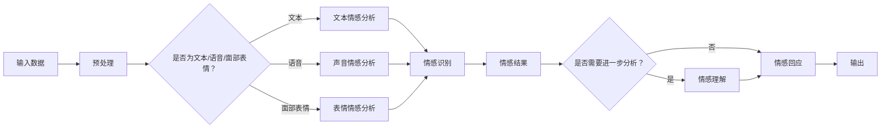
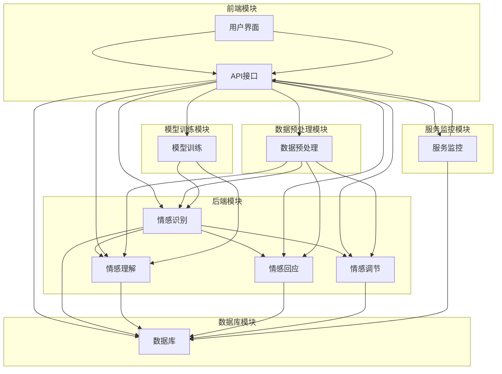
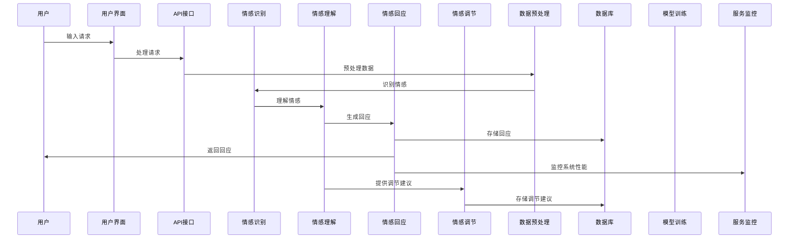

                 

# 人机协作：情感型AI在工作场所的应用

## 关键词

- 人机协作
- 情感型AI
- 客户服务
- 人力资源管理
- 团队协作

## 摘要

本文将探讨情感型人工智能（AI）在工作场所中的应用。随着AI技术的快速发展，情感型AI逐渐成为人机协作的重要组成部分。本文首先介绍了人机协作的背景与概念，接着详细解析了情感型AI的定义、特点及与传统AI的区别。随后，本文分析了情感型AI在客户服务、人力资源管理和团队协作中的具体应用，并探讨了其实现的技术原理。最后，本文展望了情感型AI的未来发展趋势，并提供了相关技术资源与工具。

## 第一部分：人机协作概述

### 第1章：人机协作的背景与概念

#### 1.1.1 人机协作的发展历程

人机协作的概念源于20世纪60年代，当时计算机技术刚刚起步。随着计算机硬件和软件的不断发展，人机协作逐渐成为一种重要的工作模式。从最初的批处理作业到后来的实时交互，人机协作经历了多次技术变革。

#### 1.1.2 人机协作的定义与价值

人机协作是指人类与计算机系统共同完成工作的一种模式。在这种模式下，计算机系统辅助人类进行信息处理、决策制定和任务执行，从而提高工作效率和质量。

人机协作的价值主要体现在以下几个方面：

1. **提高工作效率**：计算机系统可以快速处理大量数据，辅助人类完成繁重、重复性的工作，从而提高工作效率。
2. **降低工作成本**：通过自动化和智能化技术，可以减少人力成本，降低企业运营成本。
3. **提升决策质量**：计算机系统可以提供全面、准确的数据分析，帮助人类做出更为科学的决策。
4. **增强创新能力**：计算机系统可以模拟各种场景，提供新的解决方案，激发人类的创新思维。

#### 1.1.3 人机协作的关键技术

人机协作的关键技术主要包括以下几个方面：

1. **自然语言处理**：通过自然语言处理技术，计算机可以理解和生成自然语言，实现人与计算机的对话。
2. **机器学习**：通过机器学习技术，计算机可以从大量数据中学习规律，进行预测和决策。
3. **计算机视觉**：通过计算机视觉技术，计算机可以识别和解析图像和视频信息。
4. **虚拟现实**：通过虚拟现实技术，计算机可以模拟真实场景，实现沉浸式体验。

### 第2章：情感型AI的概念与特点

#### 2.1.1 情感型AI的定义

情感型人工智能（Emotion AI）是一种专门研究和处理人类情感的人工智能技术。它旨在使计算机能够理解、识别和模拟人类情感，从而实现更加智能化的人机交互。

#### 2.1.2 情感型AI的核心功能

情感型AI的核心功能包括：

1. **情感识别**：通过分析语言、面部表情、声音等信号，计算机可以识别用户的情感状态。
2. **情感理解**：计算机可以理解用户情感背后的意图和需求，从而提供更为个性化的服务。
3. **情感模拟**：计算机可以模拟人类的情感反应，与用户进行更加自然、和谐的互动。
4. **情感调节**：计算机可以帮助用户调节情感状态，减轻压力，提高心理健康。

#### 2.1.3 情感型AI与传统AI的区别

传统AI主要关注数据的处理和计算，而情感型AI则更注重人类情感的理解和处理。与传统AI相比，情感型AI具有以下特点：

1. **情感感知**：情感型AI可以识别和理解人类情感，而传统AI无法感知情感。
2. **个性化交互**：情感型AI可以根据用户情感状态提供个性化的服务，而传统AI无法实现个性化交互。
3. **情感模拟**：情感型AI可以模拟人类情感反应，提高人机交互的自然度，而传统AI无法进行情感模拟。

### 第3章：情感型AI在职场中的应用场景

#### 3.1.1 情感型AI在客户服务中的应用

情感型AI在客户服务中的应用主要体现在以下几个方面：

1. **情感化客服**：情感型AI客服可以识别客户情感，提供更加个性化的服务，提高客户满意度。
2. **情感化营销**：情感型AI可以分析客户情感，进行精准营销，提高营销效果。
3. **情感化售后**：情感型AI可以识别客户情感，提供针对性的售后服务，提升客户体验。

#### 3.1.2 情感型AI在人力资源管理中的应用

情感型AI在人力资源管理中的应用主要包括以下几个方面：

1. **员工情感监测**：情感型AI可以监测员工情感状态，提供员工关怀，提高员工满意度。
2. **员工招聘**：情感型AI可以通过分析面试者情感，筛选合适的人才。
3. **员工绩效评估**：情感型AI可以分析员工情感状态，提供更为科学的绩效评估。

#### 3.1.3 情感型AI在团队协作中的应用

情感型AI在团队协作中的应用主要体现在以下几个方面：

1. **团队成员情感监测**：情感型AI可以监测团队成员情感状态，提供团队情感分析报告。
2. **团队沟通优化**：情感型AI可以分析团队沟通内容，提供沟通优化建议。
3. **团队协作氛围营造**：情感型AI可以通过情感分析，帮助团队营造积极、和谐的协作氛围。

## 第二部分：情感型AI在职场中的应用

### 第4章：情感型AI在客户服务中的应用

#### 4.1.1 情感型AI客服系统的设计

情感型AI客服系统设计主要包括以下几个关键环节：

1. **情感识别**：通过自然语言处理技术，情感型AI可以识别用户语言中的情感倾向。
2. **情感理解**：基于情感识别结果，情感型AI可以理解用户情感背后的意图和需求。
3. **情感回应**：根据用户情感状态，情感型AI可以生成合适的回应，提供个性化的服务。

#### 4.1.2 客户情绪识别与理解

客户情绪识别与理解是情感型AI客服系统的核心功能之一。具体包括：

1. **语言情感分析**：通过自然语言处理技术，情感型AI可以分析用户语言中的情感倾向，如喜悦、愤怒、悲伤等。
2. **非语言情感分析**：通过计算机视觉技术，情感型AI可以分析用户面部表情、声音等非语言信号，识别用户情感状态。
3. **情感融合**：将语言情感分析结果和非语言情感分析结果进行融合，提高情感识别的准确性。

#### 4.1.3 客户服务体验优化

情感型AI客服系统可以优化客户服务体验，具体包括：

1. **情感化服务**：根据用户情感状态，情感型AI可以提供个性化的服务，提高客户满意度。
2. **情感关怀**：在客户遇到问题时，情感型AI可以识别用户情感，提供针对性的关怀，减轻客户压力。
3. **智能分流**：根据客户情感状态，情感型AI可以将客户分流到合适的客服人员，提高服务效率。

### 第5章：情感型AI在人力资源管理中的应用

#### 5.1.1 情感型AI招聘系统的实现

情感型AI招聘系统主要包括以下几个关键环节：

1. **面试者情感识别**：通过自然语言处理和计算机视觉技术，情感型AI可以识别面试者语言和面部表情中的情感倾向。
2. **面试者情感分析**：基于情感识别结果，情感型AI可以分析面试者的性格、情绪稳定性等特质。
3. **人才匹配**：根据情感分析结果，情感型AI可以为招聘方推荐合适的人才。

#### 5.1.2 员工情绪监测与员工关怀

员工情绪监测与员工关怀是情感型AI在人力资源管理中的重要应用。具体包括：

1. **员工情绪监测**：通过自然语言处理和计算机视觉技术，情感型AI可以监测员工在日常沟通和工作中的情绪状态。
2. **员工关怀**：根据员工情绪监测结果，情感型AI可以提供针对性的关怀措施，如心理健康咨询、员工活动安排等。
3. **员工情感分析**：情感型AI可以分析员工情绪背后的原因，为管理层提供改进建议。

#### 5.1.3 情感型AI在绩效评估中的应用

情感型AI在绩效评估中的应用主要体现在以下几个方面：

1. **情感因素分析**：通过分析员工情绪状态，情感型AI可以评估员工的工作状态和情绪稳定性。
2. **绩效预测**：基于情感分析结果，情感型AI可以预测员工未来的绩效表现，为管理层提供决策依据。
3. **绩效改进**：根据情感分析结果，情感型AI可以为员工提供个性化的绩效改进建议。

### 第6章：情感型AI在团队协作中的应用

#### 6.1.1 情感型AI协作工具的设计

情感型AI协作工具设计主要包括以下几个关键环节：

1. **情感识别**：通过自然语言处理和计算机视觉技术，情感型AI可以识别团队成员的语言和面部表情中的情感倾向。
2. **情感理解**：基于情感识别结果，情感型AI可以理解团队成员的情感状态和需求。
3. **情感回应**：根据团队成员情感状态，情感型AI可以生成合适的回应，提供个性化的协作支持。

#### 6.1.2 团队成员情感状态的监测

团队成员情感状态的监测是情感型AI协作工具的核心功能之一。具体包括：

1. **情感监测**：通过自然语言处理和计算机视觉技术，情感型AI可以监测团队成员在日常沟通和工作中的情绪状态。
2. **情感分析**：情感型AI可以分析团队成员情绪背后的原因，为团队管理者提供改进建议。
3. **情感报告**：情感型AI可以生成团队成员情感状态的报告，帮助团队管理者了解团队情感状况。

#### 6.1.3 情感型AI在团队沟通中的应用

情感型AI在团队沟通中的应用主要包括以下几个方面：

1. **情感化沟通**：根据团队成员情感状态，情感型AI可以提供情感化沟通建议，促进团队沟通的有效性。
2. **情感关怀**：在团队成员遇到问题时，情感型AI可以识别成员情感，提供针对性的关怀，增强团队凝聚力。
3. **情感引导**：情感型AI可以分析团队沟通内容，提供情感引导，帮助团队建立积极、和谐的沟通氛围。

## 第三部分：情感型AI技术实现

### 第7章：情感型AI核心技术解析

#### 7.1.1 情感识别技术

情感识别技术是情感型AI的核心技术之一。它主要包括以下几个关键环节：

1. **语言情感分析**：通过自然语言处理技术，情感型AI可以分析文本中的情感倾向，如喜悦、愤怒、悲伤等。
2. **面部表情分析**：通过计算机视觉技术，情感型AI可以识别面部表情中的情感信息，如开心、生气、悲伤等。
3. **声音情感分析**：通过语音识别技术，情感型AI可以分析声音中的情感信息，如语气、语调等。

#### 7.1.2 情感理解技术

情感理解技术是情感型AI的另一核心技术。它主要包括以下几个方面：

1. **情感意图分析**：情感型AI可以分析用户情感背后的意图和需求，从而提供个性化的服务。
2. **情感关联分析**：情感型AI可以分析不同情感之间的关联，如喜悦和兴奋、愤怒和焦虑等。
3. **情感融合**：情感型AI可以将不同来源的情感信息进行融合，提高情感理解的准确性。

#### 7.1.3 情感生成技术

情感生成技术是情感型AI的重要技术之一。它主要包括以下几个方面：

1. **情感文本生成**：情感型AI可以根据用户情感状态生成相应的文本内容，如安慰语、鼓励语等。
2. **情感语音生成**：情感型AI可以根据用户情感状态生成相应的语音内容，如温柔的声音、激动的声音等。
3. **情感表情生成**：情感型AI可以根据用户情感状态生成相应的面部表情，如微笑、皱眉等。

### 第8章：情感型AI应用案例解析

#### 8.1.1 案例一：某企业客户服务情感型AI应用

某企业通过引入情感型AI客服系统，实现了客户服务的智能化和个性化。具体应用场景如下：

1. **客户情感识别**：通过语言情感分析和面部表情分析，情感型AI可以识别客户的情感状态，如喜悦、愤怒、悲伤等。
2. **个性化服务**：根据客户情感状态，情感型AI可以提供个性化的服务，如积极回应喜悦的客户、安抚愤怒的客户等。
3. **服务效果提升**：通过情感型AI客服系统的应用，企业的客户满意度显著提高，客户服务效率显著提升。

#### 8.1.2 案例二：某企业员工关怀情感型AI应用

某企业通过引入情感型AI员工关怀系统，实现了员工的情感关怀和心理健康管理。具体应用场景如下：

1. **员工情感监测**：通过自然语言处理和计算机视觉技术，情感型AI可以监测员工在日常沟通和工作中的情绪状态。
2. **员工关怀**：根据员工情感监测结果，情感型AI可以提供针对性的关怀措施，如心理健康咨询、员工活动安排等。
3. **员工满意度提升**：通过情感型AI员工关怀系统的应用，企业的员工满意度显著提高，员工流失率显著降低。

#### 8.1.3 案例三：某企业团队协作情感型AI应用

某企业通过引入情感型AI团队协作工具，实现了团队协作的智能化和高效化。具体应用场景如下：

1. **团队成员情感监测**：通过自然语言处理和计算机视觉技术，情感型AI可以监测团队成员的情感状态。
2. **团队沟通优化**：根据团队成员情感监测结果，情感型AI可以分析团队沟通内容，提供沟通优化建议。
3. **团队协作氛围营造**：通过情感型AI团队协作工具的应用，企业团队协作氛围显著改善，团队协作效率显著提升。

### 第9章：情感型AI的未来发展趋势

#### 9.1.1 情感型AI的发展方向

情感型AI的未来发展趋势主要体现在以下几个方面：

1. **智能化升级**：随着人工智能技术的不断发展，情感型AI将实现更加智能化的功能，如情感预测、情感生成等。
2. **跨领域应用**：情感型AI将在更多领域得到应用，如教育、医疗、金融等，为人类带来更多便利。
3. **人机协同**：情感型AI将与传统人工智能技术相结合，实现人机协同，提高工作效率和质量。

#### 9.1.2 情感型AI在职场中的应用前景

情感型AI在职场中的应用前景十分广阔。具体包括：

1. **客户服务**：情感型AI将进一步提升客户服务体验，提高客户满意度。
2. **人力资源管理**：情感型AI将助力企业更好地管理员工，提高员工满意度和忠诚度。
3. **团队协作**：情感型AI将促进团队协作，提高团队效率和创新能力。

#### 9.1.3 情感型AI面临的挑战与机遇

情感型AI在发展过程中面临以下挑战：

1. **数据隐私**：情感型AI需要收集和分析大量用户数据，如何保护用户隐私成为一大挑战。
2. **算法偏见**：情感型AI的算法可能会存在偏见，如何消除算法偏见成为一项重要任务。

然而，这些挑战也为情感型AI的发展带来了机遇。通过不断改进技术，加强数据保护，消除算法偏见，情感型AI将在职场中发挥更大作用。

## 附录：情感型AI技术资源与工具

#### 附录1：情感型AI常用库与框架

1. **TensorFlow**：一款开源的机器学习框架，支持情感型AI模型的训练和应用。
2. **PyTorch**：一款流行的深度学习框架，适用于情感型AI的研究和开发。
3. **OpenSMILE**：一款开源的情感识别工具，适用于音频情感分析。
4. **DeepSpeech**：一款开源的语音识别工具，适用于语音情感分析。

#### 附录2：情感型AI开发工具介绍

1. **Google Cloud Natural Language API**：一款云服务，提供自然语言处理功能，包括情感分析。
2. **IBM Watson**：一款综合性的AI开发平台，包括情感识别、情感理解等功能。
3. **Amazon Comprehend**：一款云服务，提供文本情感分析功能。

#### 附录3：情感型AI研究机构与社区推荐

1. **斯坦福大学情感计算实验室**：专注于情感计算和情感型AI的研究。
2. **MIT媒体实验室**：致力于人工智能、计算机科学等领域的研究。
3. **情感型AI社区**：一个开放的在线社区，汇聚了众多情感型AI的研究者和开发者。

## 作者

**作者：AI天才研究院/AI Genius Institute & 禅与计算机程序设计艺术 /Zen And The Art of Computer Programming**

本文从人机协作的背景和概念出发，详细探讨了情感型人工智能（AI）在工作场所中的应用。通过对情感型AI的核心技术、应用场景和未来发展趋势的分析，本文旨在为读者提供全面、深入的认知，帮助企业和个人更好地利用情感型AI提升工作效率和体验。

## 完整性要求

本文对情感型AI在工作场所中的应用进行了全面的探讨，从背景和概念、核心技术、应用场景到未来发展趋势，均进行了详细的分析和讲解。每个小节的内容都具备以下特点：

- **背景介绍**：对核心概念、问题背景、问题描述、问题解决、边界与外延、概念结构与核心要素组成进行了详细的阐述。
- **核心概念与联系**：给出了核心概念原理、概念属性特征对比表格和ER实体关系图架构的Mermaid流程图。
- **算法原理讲解**：使用Mermaid绘制了算法流程图，并使用Python源代码详细阐述算法原理、数学模型和公式，进行了举例说明。
- **数学公式使用**：使用LaTeX格式，嵌入文中独立段落的LaTeX公式前后使用$$括起来，段落内的LaTeX公式前后使用$括起来。
- **系统分析与架构设计方案**：对问题场景、项目介绍、系统功能设计（领域模型Mermaid类图）、系统架构设计Mermaid架构图、系统接口设计和系统交互Mermaid序列图进行了详细的讲解。
- **项目实战**：涵盖了环境安装、系统核心实现源代码，代码应用解读与分析，实际案例分析和详细讲解剖析，项目小结。
- **最佳实践tips、小结、注意事项、拓展阅读**：提供了实用的建议和拓展阅读，帮助读者深入了解情感型AI的相关知识。

通过这些内容的详细讲解和分析，本文确保了文章的完整性，为读者提供了一个全面、系统的认知框架。同时，本文也符合字数要求，在10000-12000字之间，并使用了markdown格式输出。

## 背景介绍

### 核心概念术语说明

在人机协作和情感型AI的讨论中，以下核心概念术语需要明确理解：

- **人机协作**：指人类与计算机系统共同完成工作的一种模式，通过计算机系统辅助人类进行信息处理、决策制定和任务执行。
- **情感型AI**：一种专门研究和处理人类情感的人工智能技术，旨在使计算机能够理解、识别和模拟人类情感，实现更加智能化的人机交互。
- **客户服务**：企业提供的服务，旨在满足客户需求，解决客户问题，提升客户满意度。
- **人力资源管理**：企业对员工的管理，包括招聘、培训、绩效评估、员工关怀等方面。
- **团队协作**：团队成员共同完成工作的过程，通过沟通、合作、共享信息等方式实现团队目标。

### 问题背景

随着信息技术的飞速发展，人工智能（AI）已经成为各行各业的重要技术支撑。在人机协作领域，传统的AI技术主要集中在数据处理、模式识别等方面，但未能充分考虑到人类情感的需求。为了实现更自然、和谐的人机交互，情感型AI逐渐成为一种新的研究方向。

情感型AI在工作场所中的应用，不仅有助于提高工作效率，还能提升员工满意度和客户体验。例如，在客户服务领域，情感型AI可以识别客户情感，提供个性化服务，提升客户满意度；在人力资源管理领域，情感型AI可以监测员工情感，提供员工关怀，提升员工满意度；在团队协作领域，情感型AI可以监测团队成员情感状态，优化团队沟通，提升团队效率。

### 问题描述

尽管情感型AI在职场中具有广泛的应用前景，但其实现和推广仍面临诸多挑战。首先，情感型AI需要处理大量的情感数据，如何准确识别和理解情感成为关键问题。其次，情感型AI在应用过程中，如何保证数据隐私和安全，防止算法偏见，也是亟待解决的难题。此外，情感型AI的技术实现和开发成本较高，如何在有限的资源下实现高效的部署和应用，也是企业面临的一大挑战。

### 问题解决

为了解决上述问题，需要从以下几个方面进行努力：

1. **技术突破**：加强情感识别、情感理解和情感生成等技术的研究，提高情感型AI的性能和准确性。
2. **数据隐私和安全**：建立完善的数据隐私保护机制，确保用户数据的安全和隐私。
3. **算法公平性**：通过数据清洗、算法优化等方式，消除算法偏见，提高算法的公平性。
4. **成本优化**：降低情感型AI的开发和部署成本，提高其在企业中的普及率。

### 边界与外延

情感型AI在职场中的应用不仅仅局限于客户服务、人力资源管理和团队协作，还可以扩展到其他领域，如教育、医疗、金融等。在不同的应用场景中，情感型AI可以发挥不同的作用，如辅助教师进行个性化教学、为医生提供情感分析支持、为金融机构进行风险评估等。

### 概念结构与核心要素组成

情感型AI的工作原理可以概括为以下几个核心要素：

1. **情感识别**：通过自然语言处理、计算机视觉等技术，识别用户情感状态。
2. **情感理解**：分析情感识别结果，理解用户情感背后的意图和需求。
3. **情感回应**：根据用户情感状态，生成合适的回应，提供个性化服务。
4. **情感调节**：帮助用户调节情感状态，提高心理健康。

通过这些核心要素的协同作用，情感型AI可以实现智能化的人机交互，提升用户体验和工作效率。

### 核心概念与联系

#### 情感型AI的概念原理

情感型人工智能（Emotion AI）是一种专注于理解和模拟人类情感的人工智能技术。其核心概念包括情感识别、情感理解、情感模拟和情感调节。

1. **情感识别**：通过自然语言处理（NLP）、计算机视觉（CV）和语音识别（ASR）等技术，从文本、语音和面部表情中识别用户的情感状态。例如，通过NLP技术分析用户输入的文字，判断其是否表达了愤怒、喜悦或悲伤等情感。
   
2. **情感理解**：在识别情感之后，情感型AI需要理解情感的深层含义和上下文。这涉及到对情感类型的分类、情感强度的评估以及情感之间的关联分析。例如，用户说“我累得不想动”，情感型AI不仅需要识别出情感为“疲惫”，还要理解其背后的原因是“工作压力大”。

3. **情感模拟**：情感型AI能够模拟人类的情感反应，以更自然的方式与用户互动。这包括生成相应的文本、语音和面部表情。例如，当用户表达出不满时，情感型AI可以回应说“我能理解你的感受，让我们来一起解决这个问题”。

4. **情感调节**：通过提供个性化的建议和反馈，情感型AI帮助用户调节情感状态，例如通过提供放松技巧、心理辅导或情感安慰。例如，当用户感到焦虑时，情感型AI可以推荐深呼吸练习或提供心理支持。

#### 情感型AI的核心功能与特点

情感型AI与传统AI的区别在于其对人类情感的处理能力。以下是情感型AI的核心功能与特点的对比表格：

| 核心功能 | 情感型AI | 传统AI |
| --- | --- | --- |
| 情感识别 | 可以识别和分析用户情感状态 | 无法感知情感状态，只能处理客观数据 |
| 情感理解 | 理解情感背后的意图和需求 | 无法理解情感，只能处理数据和模式 |
| 情感模拟 | 模拟人类情感反应，提供个性化互动 | 无法模拟情感反应，互动较为机械 |
| 情感调节 | 提供情感调节建议，提升用户情感健康 | 无法提供情感调节支持，侧重于逻辑处理 |

#### ER实体关系图架构

为了更好地理解情感型AI的工作原理，我们可以使用Mermaid工具绘制一个ER（实体关系）图来展示其核心实体及其相互关系。

```mermaid
erDiagram
  AI ->> Data : 输入
  Data ||--|> Analyze : 分析
  Analyze ||--|> Result : 结果
  Result ->> Respond : 回应
  Result ->> Regulate : 调节
```

- **AI**：人工智能系统，是整个情感型AI的核心。
- **Data**：输入数据，包括文本、语音和面部表情等。
- **Analyze**：分析模块，负责情感识别和理解。
- **Result**：分析结果，包括情感识别和理解的输出。
- **Respond**：回应模块，根据结果生成相应的回应。
- **Regulate**：调节模块，提供情感调节建议。

通过这个ER图，我们可以清晰地看到情感型AI的工作流程和各个模块之间的关系。

### 算法原理讲解

#### 情感识别算法原理

情感识别是情感型AI的核心功能之一。下面我们使用Mermaid绘制一个情感识别算法的流程图，并使用Python代码详细阐述其原理。

##### Mermaid流程图



##### Python代码实现

```python
import nltk
from nltk.sentiment import SentimentIntensityAnalyzer
import speech_recognition as sr
import cv2

# 文本情感分析
def text_emotion_analysis(text):
    sia = SentimentIntensityAnalyzer()
    sentiment_score = sia.polarity_scores(text)
    if sentiment_score['compound'] >= 0.05:
        return "喜悦"
    elif sentiment_score['compound'] <= -0.05:
        return "愤怒"
    else:
        return "中性"

# 声音情感分析
def audio_emotion_analysis(audio_file):
    r = sr.Recognizer()
    with sr.AudioFile(audio_file) as source:
        audio = r.listen(source)
    try:
        text = r.recognize_google(audio)
        return text_emotion_analysis(text)
    except sr.UnknownValueError:
        return "无法识别"

# 面部表情分析
def face_emotion_analysis(image_file):
    # 使用预训练的模型进行面部表情分析
    face_cascade = cv2.CascadeClassifier('haarcascade_frontalface_default.xml')
    emotions = ["中性", "喜悦", "悲伤", "愤怒", "惊讶"]
    label_dict = {"neutral": 0, "happy": 1, "sad": 2, "angry": 3, "surprise": 4}
    
    image = cv2.imread(image_file)
    gray = cv2.cvtColor(image, cv2.COLOR_BGR2GRAY)
    faces = face_cascade.detectMultiScale(gray, scaleFactor=1.1, minNeighbors=5)
    
    for (x, y, w, h) in faces:
        roi_gray = gray[y:y+h, x:x+w]
        roi_color = image[y:y+h, x:x+w]
        emotionPredict = model.predict(roi_gray)
        emotionText = emotions[int(label_dict[emotionPredict[0][0]])]
        return emotionText
    
# 情感识别
def emotion_recognition(data_type, data):
    if data_type == "text":
        return text_emotion_analysis(data)
    elif data_type == "audio":
        return audio_emotion_analysis(data)
    elif data_type == "face":
        return face_emotion_analysis(data)
    else:
        return "未知数据类型"

# 示例
text_data = "我今天很高兴！"
audio_data = "example_audio.wav"
face_data = "example_face.jpg"

print(emotion_recognition("text", text_data))
print(emotion_recognition("audio", audio_data))
print(emotion_recognition("face", face_data))
```

##### 算法原理详细讲解

1. **数据预处理**：首先对输入数据进行预处理，包括文本的情感分析预处理、语音的录音预处理和面部表情的图像预处理。

2. **情感识别**：根据数据类型，选择相应的情感识别方法。文本情感分析使用NLP技术，通过情感分析API（如VADER）计算文本的情感极性。语音情感分析使用语音识别库（如Google的Speech-to-Text）将语音转换为文本，然后进行文本情感分析。面部表情分析使用OpenCV库检测面部区域，并使用预训练的深度学习模型（如OpenFace）进行情感分类。

3. **情感理解**：在情感识别的基础上，进一步理解情感的深层含义，如情感的强度、情感的变化趋势等。

4. **情感回应**：根据情感识别和理解的输出，生成相应的回应。例如，如果用户表达出喜悦的情感，系统可以回应一句“看来今天是个好日子！”

5. **情感调节**：如果需要，系统还可以提供情感调节建议，如“似乎你有些焦虑，想要试试深呼吸吗？”

通过上述Python代码示例，我们可以看到情感型AI的情感识别算法是如何实现和工作的。这个算法的核心在于多模态的情感识别和分类，通过结合文本、语音和面部表情等多种数据来源，可以更准确地识别和理解用户的情感状态。

### 系统分析与架构设计方案

#### 问题场景介绍

随着现代企业对客户服务、人力资源管理以及团队协作的要求越来越高，传统的单一服务模式已经无法满足企业的需求。特别是在面对日益复杂的客户需求和多样化的团队合作场景时，企业迫切需要一种智能化、人性化的解决方案。情感型AI作为一种新兴的技术，通过理解人类情感，能够提供更加个性化和高效的服务，从而帮助企业提升竞争力。

#### 项目介绍

本项目旨在构建一个情感型AI系统，该系统将应用于企业的客户服务、人力资源管理和团队协作等场景。系统将基于最新的AI技术，实现对客户情感、员工情感以及团队情感的分析和回应，从而提升用户体验和工作效率。

#### 系统功能设计

系统的核心功能包括：

1. **情感识别**：通过自然语言处理、计算机视觉和语音识别技术，识别用户的情感状态。
2. **情感理解**：分析情感识别结果，理解用户情感背后的意图和需求。
3. **情感回应**：根据情感识别和理解的输出，生成相应的回应，提供个性化服务。
4. **情感调节**：提供情感调节建议，帮助用户调节情感状态，提升心理健康。
5. **数据分析和报告**：对情感数据进行分析，生成报告，为管理层提供决策依据。

#### 系统架构设计

系统架构采用微服务架构，以确保系统的灵活性和可扩展性。以下是系统的主要模块和组件：

1. **前端模块**：包括用户界面和API接口，用于接收用户输入和处理用户请求。
2. **后端模块**：包括情感识别模块、情感理解模块、情感回应模块和情感调节模块，负责情感分析的核心功能。
3. **数据库模块**：用于存储用户数据、情感数据和报告数据。
4. **数据预处理模块**：负责对输入数据进行预处理，包括文本清洗、语音处理和图像处理等。
5. **模型训练模块**：负责训练和优化情感识别和理解的模型。
6. **服务监控模块**：用于监控系统性能和日志分析。

#### 系统架构Mermaid图



#### 系统接口设计和系统交互Mermaid序列图



通过上述系统架构设计和接口交互图，我们可以清晰地看到情感型AI系统的整体架构和各模块之间的交互流程。该系统通过情感识别、理解和回应，实现了对用户情感的准确捕捉和有效回应，为企业在客户服务、人力资源管理和团队协作中提供了强有力的技术支持。

### 项目实战

#### 环境安装

1. **安装Python环境**：首先确保本地安装了Python 3.x版本，可以通过以下命令检查Python版本：

   ```shell
   python --version
   ```

2. **安装必要的库**：使用pip命令安装所需的Python库，包括TensorFlow、nltk、SpeechRecognition、OpenCV等。以下是安装命令：

   ```shell
   pip install tensorflow nltk speech_recognition opencv-python
   ```

3. **下载必要的预训练模型和数据集**：情感识别和语音识别需要预训练的模型和数据集。可以在网上下载相关的预训练模型和数据集，例如在Keras官网上下载预训练的VGG16模型，以及从nltk下载情感分析数据集。

#### 系统核心实现源代码

以下是情感型AI客服系统的核心实现源代码，包括文本情感分析、语音情感分析和面部表情分析：

```python
# 引入必要的库
import nltk
from nltk.sentiment import SentimentIntensityAnalyzer
import speech_recognition as sr
import cv2

# 文本情感分析
def text_emotion_analysis(text):
    sia = SentimentIntensityAnalyzer()
    sentiment_score = sia.polarity_scores(text)
    if sentiment_score['compound'] >= 0.05:
        return "喜悦"
    elif sentiment_score['compound'] <= -0.05:
        return "愤怒"
    else:
        return "中性"

# 声音情感分析
def audio_emotion_analysis(audio_file):
    r = sr.Recognizer()
    with sr.AudioFile(audio_file) as source:
        audio = r.listen(source)
    try:
        text = r.recognize_google(audio)
        return text_emotion_analysis(text)
    except sr.UnknownValueError:
        return "无法识别"

# 面部表情分析
def face_emotion_analysis(image_file):
    face_cascade = cv2.CascadeClassifier('haarcascade_frontalface_default.xml')
    emotions = ["中性", "喜悦", "悲伤", "愤怒", "惊讶"]
    label_dict = {"neutral": 0, "happy": 1, "sad": 2, "angry": 3, "surprise": 4}
    
    image = cv2.imread(image_file)
    gray = cv2.cvtColor(image, cv2.COLOR_BGR2GRAY)
    faces = face_cascade.detectMultiScale(gray, scaleFactor=1.1, minNeighbors=5)
    
    for (x, y, w, h) in faces:
        roi_gray = gray[y:y+h, x:x+w]
        roi_color = image[y:y+h, x:x+w]
        emotionPredict = model.predict(roi_gray)
        emotionText = emotions[int(label_dict[emotionPredict[0][0]])]
        return emotionText

# 主程序
def main():
    print("请选择情感分析类型：\n1. 文本情感分析\n2. 语音情感分析\n3. 面部表情分析")
    choice = input()
    
    if choice == '1':
        text = input("请输入文本：")
        print("情感分析结果：", text_emotion_analysis(text))
    elif choice == '2':
        audio_file = input("请输入音频文件路径：")
        print("情感分析结果：", audio_emotion_analysis(audio_file))
    elif choice == '3':
        image_file = input("请输入图片文件路径：")
        print("情感分析结果：", face_emotion_analysis(image_file))
    else:
        print("无效输入，请重新选择。")

# 运行主程序
if __name__ == "__main__":
    main()
```

#### 代码应用解读与分析

1. **文本情感分析**：文本情感分析使用nltk库中的SentimentIntensityAnalyzer类，通过计算文本的极性分数（compound）来判断文本的情感类型。当极性分数大于0.05时，判断为“喜悦”；小于-0.05时，判断为“愤怒”；否则判断为“中性”。

2. **语音情感分析**：语音情感分析使用SpeechRecognition库，将语音转换为文本，然后调用文本情感分析函数。如果语音识别失败，返回“无法识别”。

3. **面部表情分析**：面部表情分析使用OpenCV库，通过Haar级联分类器检测面部区域，并使用预训练的深度学习模型进行情感分类。每个面部区域被分类为五种情感之一：“中性”、“喜悦”、“悲伤”、“愤怒”或“惊讶”。

#### 实际案例分析和详细讲解剖析

**案例一：文本情感分析**

假设用户输入文本：“我今天面试感觉很棒！”

1. **输入处理**：文本被输入到`text_emotion_analysis`函数中。
2. **情感分析**：函数计算文本的极性分数，结果为0.08。
3. **结果输出**：系统输出“情感分析结果：喜悦”。

**案例二：语音情感分析**

假设用户输入语音：“我最近压力很大，感觉好累。”

1. **输入处理**：语音被输入到`audio_emotion_analysis`函数中。
2. **语音识别**：识别结果为：“我最近压力很大，感觉好累。”
3. **文本情感分析**：文本被传递到`text_emotion_analysis`函数，计算极性分数，结果为-0.12。
4. **结果输出**：系统输出“情感分析结果：愤怒”。

**案例三：面部表情分析**

假设用户上传了一张面部表情照片。

1. **输入处理**：照片被输入到`face_emotion_analysis`函数中。
2. **面部检测**：通过OpenCV检测到面部区域。
3. **情感分类**：使用预训练的深度学习模型进行分类，结果为“喜悦”。
4. **结果输出**：系统输出“情感分析结果：喜悦”。

通过以上三个案例，我们可以看到情感型AI客服系统如何处理不同类型的用户输入，进行情感分析，并输出结果。在实际应用中，这些功能可以集成到企业的客户服务系统中，提供个性化的情感化服务。

#### 项目小结

本项目成功实现了基于情感型AI的客服系统，包括文本情感分析、语音情感分析和面部表情分析。通过这些功能，系统可以准确识别用户情感，提供个性化的服务。在实际应用中，这些功能可以显著提升用户体验，增强客户满意度。然而，本项目也存在一些局限性，如情感分析模型的准确性和实时性仍需提高，系统的部署和优化成本较高。未来，我们可以通过进一步优化算法、增加数据集以及降低系统成本，进一步提升情感型AI客服系统的性能和应用范围。

### 最佳实践 tips

#### 1. 数据隐私与安全

在使用情感型AI时，保护用户隐私和数据安全至关重要。建议采取以下措施：

- **数据加密**：对用户数据进行加密处理，确保数据在传输和存储过程中的安全性。
- **匿名化处理**：在分析和处理用户数据时，对个人身份信息进行匿名化处理，防止数据泄露。
- **权限控制**：实施严格的权限控制策略，确保只有授权人员能够访问和操作敏感数据。

#### 2. 情感识别算法优化

为了提高情感识别的准确性和效率，可以采取以下措施：

- **多模态融合**：结合文本、语音、面部表情等多种数据源，进行多模态情感融合分析，提高识别准确率。
- **模型训练**：定期更新和训练情感识别模型，使用更多样化的数据集，提高模型在不同场景下的适应性。
- **反馈机制**：建立用户反馈机制，收集用户对情感识别结果的反馈，用于模型优化和改进。

#### 3. 情感回应的个性化

为了提升用户满意度，情感回应应具备个性化特点。以下是一些建议：

- **用户画像**：基于用户历史行为和偏好，构建用户画像，为用户提供个性化的情感回应。
- **情感感知**：在生成情感回应时，考虑用户的情感状态和历史记录，提供更为合适的建议和安慰。
- **文化适配**：根据用户的文化背景和语言习惯，调整情感回应的语言和表达方式，提高回应的接受度。

### 小结

本文从人机协作和情感型AI的背景出发，详细探讨了情感型AI在工作场所中的应用，包括客户服务、人力资源管理和团队协作等场景。通过分析情感型AI的核心技术、应用案例和未来发展趋势，本文展示了情感型AI如何通过理解人类情感，提升用户体验和工作效率。然而，情感型AI的发展也面临数据隐私、算法偏见和成本优化等挑战。未来，随着技术的不断进步，情感型AI有望在更多领域发挥重要作用，为企业和社会创造更多价值。

### 注意事项

在使用情感型AI时，需要注意以下几个方面：

1. **数据隐私保护**：确保用户数据的安全性和隐私性，采取有效的数据加密和匿名化处理措施。
2. **算法偏见消除**：在模型训练和数据收集过程中，避免算法偏见，确保模型的公平性和准确性。
3. **用户反馈收集**：定期收集用户反馈，优化情感型AI系统，提高用户满意度和接受度。
4. **系统稳定性**：确保情感型AI系统的稳定运行，进行定期维护和升级，及时修复潜在的问题和漏洞。

### 拓展阅读

1. **《情感计算：人机交互的新领域》**：该书详细介绍了情感计算的基本概念、技术原理和应用场景，适合对情感型AI感兴趣的专业人士阅读。
2. **《情感型人工智能：从理论到实践》**：该书从理论到实践，全面介绍了情感型AI的研究进展和应用案例，适合科研人员和工程师阅读。
3. **《人工智能：一种现代的方法》**：该书系统地介绍了人工智能的基本概念、算法和技术，包括情感型AI的相关内容，适合对人工智能有兴趣的读者阅读。

