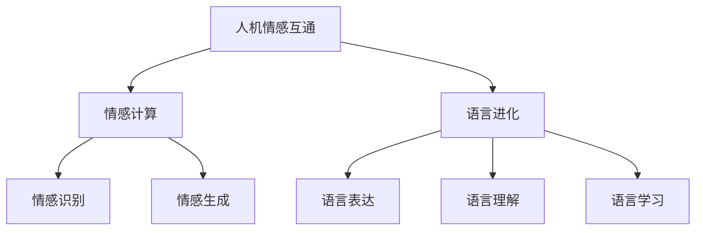

                 

# 人机情感互通对语言进化的影响

## 关键词

- 人机情感互通
- 语言进化
- 情感计算
- 语言理解
- 语言学习
- 自然语言处理

## 摘要

本文探讨了人机情感互通对语言进化的影响。首先，介绍了人机情感互通的基础概念、历史背景、发展趋势和关键技术，包括情感计算、情感识别和情感生成。接着，分析了语言进化的基本原理和影响因素，阐述了人机情感互通在语言表达、语言理解和语言学习方面的作用。最后，通过一个实际项目，展示了人机情感互通在语言学习中的应用，并对未来人机情感互通与语言发展进行了展望。

## 目录大纲

### 第一部分：人机情感互通基础

#### 第1章：人机情感互通概述

1.1 人机情感互通的概念  
1.2 人机情感互通的历史背景与发展趋势  
1.3 人机情感互通的关键技术

#### 第2章：情感计算基础

2.1 情感计算的基本原理  
2.2 情感计算的关键技术  
2.3 情感计算的挑战与机遇

#### 第3章：情感识别技术

3.1 情感识别的原理与方法  
3.2 情感识别技术的应用场景  
3.3 情感识别技术的挑战与发展方向

#### 第4章：情感生成技术

4.1 情感生成的原理与方法  
4.2 情感生成技术的应用场景  
4.3 情感生成技术的挑战与发展方向

### 第二部分：语言进化与人机情感互通

#### 第5章：语言进化的基本原理

5.1 语言进化的历史背景  
5.2 语言进化的关键因素  
5.3 语言进化的数学模型

#### 第6章：人机情感互通对语言进化的影响

6.1 人机情感互通对语言表达的拓展  
6.2 人机情感互通对语言理解的提升  
6.3 人机情感互通对语言学习的促进作用

#### 第7章：人机情感互通在语言学习中的应用

7.1 人机情感互动教学系统的设计与实现  
7.2 人机情感互动教学系统在语言学习中的应用案例  
7.3 人机情感互动教学系统的未来发展趋势

#### 第8章：人机情感互通与未来语言发展

8.1 人机情感互通对自然语言处理的影响  
8.2 人机情感互通与未来语言技术的发展方向  
8.3 人机情感互通对人类社会的影响

## 参考文献

## 附录：人机情感互通相关资源与工具

### A.1 情感计算相关工具与平台

### A.2 语言进化研究相关工具与平台

### A.3 人机情感互通开源项目与代码示例

### Mermaid流程图：人机情感互通核心概念与联系



### Python源代码：情感计算基本原理

```python
import numpy as np

# 定义情感计算模型
class EmotionModel:
    def __init__(self):
        self.w1 = np.random.rand(1)
        self.w2 = np.random.rand(1)
        self.b = np.random.rand(1)

    def forward(self, x1, x2):
        z = x1 * self.w1 + x2 * self.w2 + self.b
        a = 1 / (1 + np.exp(-z))
        return a

# 创建情感计算模型实例
model = EmotionModel()

# 输入情感特征
x1 = 0.8  # 正面情感强度
x2 = 0.3  # 负面情感强度

# 计算情感得分
emotion_score = model.forward(x1, x2)

print("情感得分：", emotion_score)
```

### 数学模型和数学公式

#### 5.1 语言进化的数学模型

$$
P(t+1) = P(t) + \alpha \cdot (Q(t) - P(t))
$$

其中，$P(t)$ 表示时间 $t$ 时的语言分布，$Q(t)$ 表示时间 $t$ 时的语言进化趋势，$\alpha$ 表示进化速率。

## 第一部分：人机情感互通基础

### 第1章：人机情感互通概述

#### 1.1 人机情感互通的概念

人机情感互通是指通过计算机技术和人工智能算法，实现人与机器之间情感上的互动和沟通。这一概念涉及到情感计算、情感识别、情感生成等领域，旨在让机器能够理解和模拟人类情感，从而提高人机交互的自然性和有效性。

#### 1.2 人机情感互通的历史背景与发展趋势

人机情感互通的概念最早可以追溯到20世纪80年代，随着计算机技术的发展和人工智能的兴起，人机情感互通逐渐成为研究热点。近年来，随着深度学习、自然语言处理等技术的突破，人机情感互通的研究和应用取得了显著进展。

当前，人机情感互通在多个领域得到了广泛应用，如智能客服、虚拟助手、教育、医疗等。未来，随着技术的不断成熟，人机情感互通有望进一步融入人们的日常生活，提高人机交互的质量和效率。

#### 1.3 人机情感互通的关键技术

人机情感互通的关键技术包括情感计算、情感识别和情感生成。

**情感计算**是指通过计算机技术和人工智能算法，对人类情感进行计算和分析。情感计算的关键技术包括情感识别、情感分类、情感分析等。

**情感识别**是指通过分析语音、文字、图像等数据，识别出人类情感的类型和强度。情感识别技术主要包括语音情感识别、文本情感识别和图像情感识别等。

**情感生成**是指通过计算机技术和人工智能算法，模拟人类情感的表达。情感生成技术主要包括文本情感生成和语音情感生成等。

### 第2章：情感计算基础

#### 2.1 情感计算的基本原理

情感计算的基本原理是通过分析人类情感表达的特征，利用机器学习和深度学习等技术，对情感进行计算和分析。

情感计算的核心是情感识别，即通过分析语音、文字、图像等数据，识别出人类情感的类型和强度。情感识别通常包括以下步骤：

1. 数据收集：收集包含情感信息的语音、文字、图像等数据。
2. 预处理：对数据进行清洗、去噪、特征提取等预处理操作。
3. 模型训练：使用机器学习或深度学习算法，对预处理后的数据进行训练，得到情感识别模型。
4. 情感识别：将新的语音、文字、图像等数据输入到训练好的模型中，进行情感识别。

#### 2.2 情感计算的关键技术

情感计算的关键技术主要包括语音情感识别、文本情感识别和图像情感识别等。

**语音情感识别**是指通过分析语音信号的频率、音调、时长等特征，识别出人类情感的类型和强度。常见的语音情感识别方法包括基于传统声学特征的方法和基于深度学习的方法。

**文本情感识别**是指通过分析文本中的词汇、语法、句法等特征，识别出人类情感的类型和强度。常见的文本情感识别方法包括基于规则的方法、基于机器学习的方法和基于深度学习的方法。

**图像情感识别**是指通过分析图像中的面部表情、姿势、色彩等特征，识别出人类情感的类型和强度。常见的图像情感识别方法包括基于传统图像处理方法、基于深度学习的方法和基于生成对抗网络的方法。

#### 2.3 情感计算的挑战与机遇

情感计算的挑战主要包括：

1. 数据标注：情感数据的标注是一个繁琐且耗时的过程，数据标注的质量直接影响情感识别的准确性。
2. 多模态融合：人机交互通常涉及语音、文字、图像等多种模态，如何有效地融合多模态数据是一个挑战。
3. 情感多样性：人类的情感是多样且复杂的，如何准确地识别和生成各种情感是一个挑战。

然而，随着技术的不断进步，情感计算也面临着巨大的机遇：

1. 智能助手：智能助手可以更好地理解用户的需求和情感，提供更个性化的服务。
2. 教育与医疗：情感计算在教育、医疗等领域具有广泛的应用前景，可以提高教学和治疗的效率。
3. 人机交互：情感计算可以改善人机交互体验，使机器更贴近人类的情感需求。

### 第3章：情感识别技术

#### 3.1 情感识别的原理与方法

情感识别是指通过分析语音、文本和图像等数据，识别出其中包含的情感类型和强度。情感识别的基本原理包括以下方面：

1. 特征提取：从原始数据中提取出能够反映情感特征的信息，如语音信号的音高、音强、时长，文本中的词汇、语法结构，图像中的面部表情、姿态等。
2. 模型训练：使用机器学习或深度学习算法，对特征进行训练，构建情感识别模型。
3. 情感分类：将新的数据输入到训练好的模型中，进行情感分类。

情感识别的方法主要包括以下几种：

**1. 语音情感识别**

语音情感识别是通过分析语音信号的频率、音调、时长等特征，识别出语音中的情感。常见的语音情感识别方法包括：

- 基于声学特征的方法：如梅尔频率倒谱系数（MFCC）、线性预测倒谱系数（LPCC）等。
- 基于深度学习的方法：如卷积神经网络（CNN）、循环神经网络（RNN）等。

**2. 文本情感识别**

文本情感识别是通过分析文本中的词汇、语法、句法等特征，识别出文本的情感倾向。常见的文本情感识别方法包括：

- 基于规则的方法：如基于词典的情感分析、基于规则的情感分类等。
- 基于机器学习的方法：如支持向量机（SVM）、朴素贝叶斯（NB）等。
- 基于深度学习的方法：如卷积神经网络（CNN）、循环神经网络（RNN）、长短时记忆网络（LSTM）等。

**3. 图像情感识别**

图像情感识别是通过分析图像中的面部表情、姿态、色彩等特征，识别出图像中的情感。常见的图像情感识别方法包括：

- 基于传统图像处理的方法：如边缘检测、特征点提取等。
- 基于深度学习的方法：如卷积神经网络（CNN）、生成对抗网络（GAN）等。

#### 3.2 情感识别技术的应用场景

情感识别技术在许多应用场景中发挥着重要作用，以下是一些典型的应用场景：

**1. 智能客服**

智能客服利用情感识别技术，可以更好地理解用户的需求和情感，提供更个性化的服务。例如，通过语音情感识别，智能客服可以识别出用户在电话中的情绪，从而调整客服人员的沟通方式，提高用户满意度。

**2. 教育与学习**

在教育与学习领域，情感识别技术可以用于分析学生的学习状态和情感，从而提供更有针对性的教育支持。例如，通过文本情感识别，教师可以了解学生在作文中的情感表达，更好地指导学生的写作。

**3. 健康监测**

情感识别技术可以用于健康监测，分析个体的情感状态，从而及时发现心理问题。例如，通过面部表情识别，健康监测系统可以识别出个体在照片或视频中的情感状态，为心理健康评估提供依据。

**4. 社交网络分析**

社交网络分析利用情感识别技术，可以分析用户的情感倾向，从而了解社会舆论和用户需求。例如，通过文本情感识别，社交网络平台可以分析用户在评论中的情感表达，为内容推荐和广告投放提供依据。

#### 3.3 情感识别技术的挑战与发展方向

情感识别技术面临着许多挑战，以下是一些主要挑战：

**1. 数据标注问题**

情感数据的标注是一个繁琐且耗时的过程，而且情感标注的准确性直接影响情感识别的效果。如何提高数据标注的效率和准确性，是一个亟待解决的问题。

**2. 情感多样性**

人类的情感是多样且复杂的，不同人在相同情境下可能表现出不同的情感。如何准确地识别和生成各种情感，是一个挑战。

**3. 多模态融合**

人机交互通常涉及语音、文本、图像等多种模态，如何有效地融合多模态数据，提高情感识别的准确性，是一个挑战。

**4. 上下文理解**

情感往往与上下文密切相关，如何理解上下文信息，提高情感识别的准确性，是一个挑战。

情感识别技术未来的发展方向包括：

**1. 智能标注工具**

开发智能标注工具，提高数据标注的效率和准确性，为情感识别研究提供高质量的数据支持。

**2. 情感生成技术**

研究情感生成技术，通过生成对抗网络（GAN）等模型，实现多样化情感生成，丰富情感识别的应用场景。

**3. 多模态融合**

研究多模态融合技术，通过深度学习等方法，实现语音、文本、图像等数据的融合，提高情感识别的准确性。

**4. 上下文理解**

研究上下文理解技术，通过自然语言处理等方法，提高情感识别在复杂上下文环境中的准确性。

### 第4章：情感生成技术

#### 4.1 情感生成的原理与方法

情感生成技术是指通过计算机技术和人工智能算法，生成具有情感色彩的语言或语音。情感生成的原理主要包括以下方面：

1. 数据集准备：收集包含情感文本或语音的数据集，这些数据可以是预先标注的，也可以是未标注的。
2. 特征提取：从原始数据中提取出能够反映情感特征的信息，如文本中的词汇、语法结构，语音信号的频率、音调等。
3. 模型训练：使用机器学习或深度学习算法，对特征进行训练，构建情感生成模型。
4. 情感生成：将新的输入数据输入到训练好的模型中，生成具有情感色彩的语言或语音。

情感生成的方法主要包括以下几种：

**1. 基于规则的方法**

基于规则的方法通过定义一系列规则，将情感与语言或语音对应起来。这种方法简单直观，但生成的情感往往比较单一，缺乏灵活性。

**2. 基于统计的方法**

基于统计的方法通过分析情感数据，建立情感与语言或语音之间的统计关系。这种方法生成的情感较为自然，但需要对大量数据进行训练。

**3. 基于深度学习的方法**

基于深度学习的方法使用神经网络模型，如循环神经网络（RNN）、长短时记忆网络（LSTM）、生成对抗网络（GAN）等，通过训练生成情感语言或语音。这种方法生成的情感丰富多样，且能够适应不同的输入。

**4. 基于生成对抗网络的方法**

生成对抗网络（GAN）是一种由生成器和判别器组成的对抗性神经网络。生成器负责生成情感语言或语音，判别器负责判断生成的情感语言或语音是否真实。这种方法生成的情感语言或语音具有高度的逼真度。

#### 4.2 情感生成技术的应用场景

情感生成技术在许多应用场景中具有广泛的应用前景，以下是一些典型的应用场景：

**1. 智能客服**

智能客服利用情感生成技术，可以生成具有情感色彩的语言或语音，与用户进行更自然的互动。例如，在客服对话中，系统可以根据用户的情感状态，生成相应的安慰性或鼓励性的语言，提高用户满意度。

**2. 虚拟助手**

虚拟助手利用情感生成技术，可以生成具有情感色彩的语言或语音，提供更个性化的服务。例如，在虚拟助手的对话中，系统可以根据用户的喜好和情感状态，生成相应的建议或情感回应，增强用户体验。

**3. 教育与学习**

在教育与学习领域，情感生成技术可以用于生成具有情感色彩的教学内容，提高学生的学习兴趣和参与度。例如，在在线教育平台中，系统可以根据学生的学习状态和情感，生成相应的激励性或情感化的教学内容，提高教学效果。

**4. 娱乐与游戏**

在娱乐与游戏领域，情感生成技术可以用于生成具有情感色彩的游戏内容，提高游戏的沉浸感和体验感。例如，在角色扮演游戏中，系统可以根据角色的情感状态，生成相应的情感化对话和场景，增强游戏的互动性。

#### 4.3 情感生成技术的挑战与发展方向

情感生成技术面临着许多挑战，以下是一些主要挑战：

**1. 情感多样性**

人类的情感是多样且复杂的，如何生成丰富的情感表达，是一个挑战。目前，情感生成技术往往只能生成一些基本的情感，如快乐、悲伤、愤怒等，对于复杂情感的表达仍存在困难。

**2. 情感一致性**

在多模态交互中，情感生成技术需要生成一致的情感表达，如在语音和文本中同时表达出同一种情感。如何保持情感的一致性，是一个挑战。

**3. 上下文理解**

情感往往与上下文密切相关，如何理解上下文信息，生成与上下文相符的情感表达，是一个挑战。

**4. 数据标注问题**

情感生成需要大量的情感数据集，而情感数据的标注是一个繁琐且耗时的过程，如何提高数据标注的效率和准确性，是一个挑战。

情感生成技术未来的发展方向包括：

**1. 多模态融合**

研究多模态融合技术，通过深度学习等方法，实现语音、文本、图像等数据的融合，提高情感生成的准确性。

**2. 情感多样性**

研究情感多样性生成技术，通过生成对抗网络（GAN）等模型，实现多样化情感生成，丰富情感表达。

**3. 上下文理解**

研究上下文理解技术，通过自然语言处理等方法，提高情感生成在复杂上下文环境中的准确性。

**4. 情感一致性**

研究情感一致性生成技术，通过多模态交互等方法，实现语音、文本、图像等数据的一致性情感表达。

### 第二部分：语言进化与人机情感互通

#### 第5章：语言进化的基本原理

5.1 语言进化的历史背景  
5.2 语言进化的关键因素  
5.3 语言进化的数学模型

#### 第6章：人机情感互通对语言进化的影响

6.1 人机情感互通对语言表达的拓展  
6.2 人机情感互通对语言理解的提升  
6.3 人机情感互通对语言学习的促进作用

#### 第7章：人机情感互通在语言学习中的应用

7.1 人机情感互动教学系统的设计与实现  
7.2 人机情感互动教学系统在语言学习中的应用案例  
7.3 人机情感互动教学系统的未来发展趋势

#### 第8章：人机情感互通与未来语言发展

8.1 人机情感互通对自然语言处理的影响  
8.2 人机情感互通与未来语言技术的发展方向  
8.3 人机情感互通对人类社会的影响

### 第5章：语言进化的基本原理

#### 5.1 语言进化的历史背景

语言进化是语言在长时间内不断变化和发展的过程。语言进化的历史背景可以追溯到人类文明起源之初，随着人类社会的进步和文明的发展，语言也在不断演变。

在史前时期，人类使用简单的手势、声音和符号进行交流。随着社会的发展，人类开始创造出更加复杂的语言体系，如古代的楔形文字、古埃及象形文字等。这些早期的文字系统为后来的语言进化奠定了基础。

进入文字时代后，语言进化的速度加快。各个文明开始形成自己的语言体系，如古代希腊语、拉丁语、古汉语等。这些语言随着时间的推移，逐渐演变成现代语言，如英语、法语、汉语等。

在现代社会，随着科技的进步和全球化的发展，语言进化仍然在进行。新词汇、新表达方式不断涌现，语言体系也在不断丰富和演变。

#### 5.2 语言进化的关键因素

语言进化的关键因素包括以下几个方面：

1. **社会变革**：社会的变化和发展是推动语言进化的主要动力。随着社会结构的变革、经济活动的变化、文化融合等，语言也会随之发生变化。例如，工业革命带来了大量新词汇，信息技术的发展推动了网络语言的兴起。

2. **文化传承**：文化传承对语言进化具有重要影响。不同的文化传统会在语言中留下深刻的印记，如古汉语中的文言文、西方语言中的宗教词汇等。文化传承过程中，一些古老的词汇和表达方式可能会逐渐消失，而新的文化元素则会被吸收和融合。

3. **技术进步**：技术的进步对语言进化产生了重要影响。随着信息技术的不断发展，语言的表达方式也在不断改变。例如，网络语言、缩写词、表情符号等新的语言形式不断涌现，这些技术进步催生了语言的创新。

4. **人类认知**：人类认知的发展也是推动语言进化的重要因素。随着人类对世界的认知不断深入，语言中的词汇和表达方式也会随之发生变化。例如，科学领域的新发现和新理论会带来新的词汇和表达方式。

5. **教育**：教育对语言进化具有重要影响。学校教育、家庭教育等教育形式对语言的学习和使用具有重要影响。教育过程中，人们会接触到新的词汇和表达方式，这些新的语言元素会被引入到语言体系中。

#### 5.3 语言进化的数学模型

语言进化的数学模型可以用来描述语言在长时间内的变化过程。一个常见的数学模型是马尔可夫链模型。

马尔可夫链模型是一种随机过程模型，它描述了一个系统在各个状态之间转移的概率。在语言进化中，可以将语言看作一个状态空间，每个状态代表一个语言状态。语言进化过程中的状态转移可以用马尔可夫链来描述。

设 $P$ 为状态转移矩阵，$P_{ij}$ 表示从状态 $i$ 转移到状态 $j$ 的概率。假设 $P$ 是一个稳定的转移矩阵，即对于任意的状态 $i$ 和 $j$，有 $P_{ij} \geq 0$ 且 $\sum_{j} P_{ij} = 1$。

在一个马尔可夫链模型中，当前状态只取决于前一个状态，而与之前的状态无关。这意味着语言进化过程具有记忆性，即当前的语言状态只受到最近一次语言状态的影响。

语言进化的数学模型可以用以下方程来描述：

$$
P(t+1) = P(t) \cdot P
$$

其中，$P(t)$ 表示在时间 $t$ 时的语言状态分布，$P$ 是状态转移矩阵。

通过求解上述方程，可以预测在未来的时间 $t+1$ 时的语言状态分布。这有助于我们理解语言进化的趋势和规律。

#### 5.3.1 马尔可夫链模型的应用示例

假设一个语言系统有两个状态：状态 $A$ 代表简单词汇，状态 $B$ 代表复杂词汇。状态转移矩阵 $P$ 如下：

$$
P =
\begin{bmatrix}
0.8 & 0.2 \\
0.1 & 0.9
\end{bmatrix}
$$

这意味着从状态 $A$ 转移到状态 $B$ 的概率为 $0.2$，从状态 $B$ 转移到状态 $A$ 的概率为 $0.1$。

假设在初始时刻（时间 $t=0$），语言系统中简单词汇的比例为 $0.6$，复杂词汇的比例为 $0.4$。即初始状态分布为：

$$
P(0) =
\begin{bmatrix}
0.6 \\
0.4
\end{bmatrix}
$$

我们可以使用状态转移矩阵 $P$ 来计算在未来的时间 $t=1$ 时的状态分布：

$$
P(1) = P(0) \cdot P =
\begin{bmatrix}
0.6 & 0.4
\end{bmatrix}
\begin{bmatrix}
0.8 & 0.2 \\
0.1 & 0.9
\end{bmatrix}
=
\begin{bmatrix}
0.48 + 0.2 \cdot 0.4 \\
0.06 + 0.9 \cdot 0.6
\end{bmatrix}
=
\begin{bmatrix}
0.52 \\
0.54
\end{bmatrix}
$$

这意味着在时间 $t=1$ 时，简单词汇的比例为 $0.52$，复杂词汇的比例为 $0.54$。

通过不断重复上述计算，我们可以预测在未来的时间点，语言系统中简单词汇和复杂词汇的比例会如何变化。

马尔可夫链模型可以用于更复杂的语言进化情况，例如涉及多个状态和多种词汇类型的系统。在这种情况下，状态转移矩阵会更加复杂，但基本原理是相同的。

#### 5.3.2 马尔可夫链模型的局限性

尽管马尔可夫链模型在描述语言进化方面具有一定的优势，但它也存在一些局限性。

首先，马尔可夫链模型假设当前状态只取决于前一个状态，而与之前的状态无关。这意味着模型无法捕捉到语言进化中的长期依赖关系。例如，某些语言现象可能是由于长期的文化传承或历史事件的影响，而这些因素在马尔可夫链模型中无法体现。

其次，马尔可夫链模型是一种概率模型，它无法精确预测语言进化的具体路径。虽然我们可以通过计算状态分布来预测未来的语言状态，但无法确定具体的词汇或表达方式会如何演变。

此外，马尔可夫链模型在处理多维数据时存在一定的复杂性。对于涉及多个维度（如词汇、语法、语义等）的语言进化问题，状态转移矩阵会变得更加复杂，计算过程也更加繁琐。

尽管存在这些局限性，马尔可夫链模型仍然是一种有用的工具，可以用于描述和预测语言进化的趋势。在实际应用中，可以结合其他模型和方法，如深度学习、自然语言处理等，来弥补马尔可夫链模型的不足，提高对语言进化的理解和预测能力。

### 第6章：人机情感互通对语言进化的影响

#### 6.1 人机情感互通对语言表达的拓展

人机情感互通技术为语言表达带来了新的可能性，拓展了人类语言交流的边界。首先，情感生成技术可以使机器能够生成具有情感色彩的语言，这种语言不仅包括日常对话中的情感表达，还可以在文学、艺术、广告等领域发挥重要作用。

例如，在文学创作中，情感生成技术可以模拟不同情感状态下的语言表达，为作家提供灵感，创作出更加丰富和细腻的作品。在广告宣传中，情感生成技术可以生成具有强烈情感吸引力的广告文案，提高广告的效果。

此外，人机情感互通技术还可以应用于虚拟角色和智能助手的开发。这些虚拟角色和智能助手可以通过情感生成技术，模拟出真实人类在特定情境下的情感表达，从而提高人机交互的自然性和亲和力。

#### 6.2 人机情感互通对语言理解的提升

人机情感互通技术不仅改变了语言表达的方式，也提升了人类对语言的理解。情感识别技术使机器能够识别出语言中的情感信息，从而更好地理解人类的需求和意图。

例如，在智能客服系统中，情感识别技术可以识别出用户在电话或在线聊天中的情感状态，从而调整客服人员的沟通策略，提高服务质量和用户满意度。在医疗领域，情感识别技术可以帮助医生更好地理解患者的情绪和需求，提供更个性化的治疗方案。

此外，人机情感互通技术还可以应用于教育领域。通过情感识别技术，教育系统可以了解学生的学习状态和情感变化，从而调整教学内容和方法，提高教学效果。

#### 6.3 人机情感互通对语言学习的促进作用

人机情感互通技术对语言学习也产生了积极影响。情感互动教学系统可以将情感因素融入语言学习过程中，提高学生的学习兴趣和参与度。

例如，在人机情感互动教学系统中，学生可以通过与虚拟教师的互动，体验不同情感状态下的语言学习体验。这种情感化的教学方式可以激发学生的学习兴趣，提高学习效果。

此外，人机情感互通技术还可以提供个性化的学习建议。通过情感识别技术，教学系统可以了解学生的学习状态和情感需求，从而为学生提供更加适合他们的学习内容和方式。

#### 6.3.1 情感互动教学系统的设计与实现

情感互动教学系统是一种将人机情感互通技术应用于语言学习的系统，它旨在通过情感互动提高学生的学习效果。以下是一个简单的情感互动教学系统的设计与实现过程：

**1. 系统需求分析**

首先，我们需要分析情感互动教学系统的需求，包括功能需求和非功能需求。功能需求包括：

- 支持多语言教学
- 实时情感识别与生成
- 个性化学习推荐
- 学习进度跟踪

非功能需求包括：

- 系统稳定性
- 数据安全性
- 用户界面友好

**2. 系统架构设计**

情感互动教学系统的架构设计包括前端、后端和数据库三个部分。前端负责用户界面和交互，后端负责业务逻辑处理，数据库用于存储用户信息和教学数据。

**3. 情感识别与生成**

情感识别与生成是情感互动教学系统的核心功能。情感识别技术可以通过分析语音、文本等数据，识别出学生的情感状态。情感生成技术则可以根据学生的情感状态，生成相应的情感回应。

**4. 个性化学习推荐**

个性化学习推荐是基于情感识别和学习进度跟踪的结果，为学生提供个性化的学习内容和方式。例如，当学生表现出兴趣时，系统可以推荐相关的学习资源；当学生感到困惑或挫败时，系统可以提供额外的帮助。

**5. 系统实现**

以下是情感互动教学系统的部分实现代码：

**情感识别**：
```python
# 假设已训练好的情感识别模型为emotion_recognizer
def recognize_emotion(text):
    emotion = emotion_recognizer.predict(text)
    return emotion
```

**情感生成**：
```python
# 假设已训练好的情感生成模型为emotion_generator
def generate_emotion_response(emotion):
    response = emotion_generator.generate_response(emotion)
    return response
```

**个性化学习推荐**：
```python
# 基于情感识别和学习进度，推荐学习内容
def recommend_learning_resources(student_emotion, learning_progress):
    if student_emotion == "兴趣":
        return "推荐进阶课程"
    elif student_emotion == "困惑":
        return "提供复习资料和辅导"
    else:
        return "维持当前学习进度"
```

**6.3.2 情感互动教学系统在语言学习中的应用案例**

以下是一个情感互动教学系统在语言学习中的应用案例：

**1. 学生使用系统进行语言学习**

学生打开情感互动教学系统，选择要学习的语言和课程。系统会根据学生的学习进度和情感状态，推荐相应的学习内容。

**2. 系统识别学生的情感状态**

在学生进行语言学习的过程中，系统会实时监测学生的情感状态。例如，通过语音识别技术，系统可以识别出学生是否感到困惑、兴奋或疲劳。

**3. 系统生成情感回应**

根据学生的情感状态，系统会生成相应的情感回应。例如，当学生感到困惑时，系统会提供复习资料和辅导；当学生感到兴奋时，系统会鼓励他们继续努力。

**4. 学生与系统互动**

学生可以与系统进行互动，提出问题或分享学习心得。系统会根据学生的互动情况，调整推荐的学习内容和方式。

**6.3.3 情感互动教学系统的未来发展趋势**

情感互动教学系统在未来有望实现以下几个发展趋势：

**1. 情感识别与生成的智能化**

随着情感计算技术的进步，情感识别与生成的准确性将不断提高。系统将能够更准确地识别和理解学生的情感状态，生成更加自然的情感回应。

**2. 多模态情感互动**

情感互动教学系统将支持多种模态的数据输入和输出，如语音、文本、图像等。这将使系统更加智能化，能够更好地适应学生的情感需求。

**3. 情感数据分析与优化**

系统将具备情感数据分析能力，通过分析大量学生的情感数据，优化教学策略，提高教学效果。

**4. 情感互动与个性化教育融合**

情感互动教学系统将与其他教育技术（如虚拟现实、人工智能等）融合，提供更加个性化的教育体验。

### 第7章：人机情感互通在语言学习中的应用

#### 7.1 人机情感互动教学系统的设计与实现

随着人机情感互通技术的发展，教育领域迎来了新的变革。人机情感互动教学系统通过模拟情感互动，提升学生的学习体验和效果。以下将详细描述这样一个系统的设计与实现过程。

##### 7.1.1 系统需求分析

首先，我们需要分析人机情感互动教学系统的需求，以确定其功能和非功能需求。

**功能需求**：

- **个性化学习体验**：系统能够根据学生的学习进度和情感状态，提供定制化的学习内容和指导。
- **情感识别与回应**：系统能够实时识别学生的情感状态，并生成相应的情感回应。
- **学习进度跟踪**：系统能够记录学生的学习进度，并提供相应的反馈。
- **个性化推荐**：系统能够根据学生的学习行为和情感状态，推荐合适的学习资源和练习。

**非功能需求**：

- **稳定性**：系统应具备高稳定性，确保教学过程的连续性和可靠性。
- **安全性**：系统需要保护用户隐私和数据安全。
- **可扩展性**：系统设计应考虑未来功能的扩展和升级。

##### 7.1.2 系统架构设计

人机情感互动教学系统的架构设计主要包括前端、后端和数据库三部分。

**前端**：

前端负责用户界面和交互设计，使用React框架实现。前端页面包括登录界面、学习界面、情感状态展示界面和推荐界面。

**后端**：

后端负责业务逻辑处理，使用Flask框架实现。后端服务包括用户管理、情感识别与生成、学习进度跟踪和推荐算法。

**数据库**：

数据库用于存储用户信息、学习数据、情感数据和推荐数据，使用MongoDB数据库。

##### 7.1.3 情感识别与生成实现

情感识别与生成是人机情感互动教学系统的核心功能。以下是一个简化的实现过程：

**情感识别**：

情感识别技术可以通过分析语音、文本等数据，识别出学生的情感状态。常见的技术包括基于机器学习的情感分类模型和基于深度学习的语音情感识别模型。

```python
from some_emotion_recognition_library import EmotionRecognizer

def recognize_emotion(text):
    recognizer = EmotionRecognizer()
    emotion = recognizer.predict(text)
    return emotion
```

**情感生成**：

情感生成技术可以根据学生的情感状态，生成相应的情感回应。常见的技术包括基于规则的情感生成和基于生成对抗网络的文本生成。

```python
from some_emotion_generation_library import EmotionGenerator

def generate_emotion_response(emotion):
    generator = EmotionGenerator()
    response = generator.generate_response(emotion)
    return response
```

##### 7.1.4 个性化学习推荐

个性化学习推荐是基于情感识别和学习进度跟踪的结果，为学生提供合适的学习内容和方式。以下是一个简化的推荐算法实现：

```python
def recommend_learning_resources(student_emotion, learning_progress):
    if student_emotion == "兴趣":
        return "推荐进阶课程"
    elif student_emotion == "困惑":
        return "提供复习资料和辅导"
    elif learning_progress < 50:
        return "继续当前课程"
    else:
        return "尝试新领域"
```

##### 7.1.5 系统实现与部署

完成系统设计与实现后，我们需要对系统进行测试和部署。

- **测试**：进行功能测试、性能测试和安全测试，确保系统稳定可靠。
- **部署**：将系统部署到服务器，并配置域名和SSL证书，确保系统可以对外提供服务。

##### 7.1.6 系统功能演示

以下是一个简化的系统功能演示：

**1. 学生登录系统**：

学生通过用户名和密码登录系统，系统会根据学生的学习进度和情感状态，展示相应的学习内容和情感状态。

**2. 情感识别与回应**：

学生在学习过程中，系统会实时监测学生的情感状态。例如，当学生表现出困惑时，系统会生成相应的情感回应：“看起来你对这个部分有些困惑，让我帮你解释一下。”

**3. 学习进度跟踪与推荐**：

系统会记录学生的学习进度，并根据学生的情感状态和进度，提供个性化的学习推荐。例如，当学生完成当前课程的学习进度超过50%时，系统会推荐新的学习资源。

**4. 个性化学习**：

学生可以与系统进行互动，提出问题或分享学习心得。系统会根据学生的互动情况，调整推荐的学习内容和方式。

##### 7.1.7 系统优化与未来展望

人机情感互动教学系统在运行过程中，可以通过用户反馈和数据分析，不断优化和升级。

- **优化**：根据用户反馈，改进情感识别与生成的准确性，提高学习推荐的效果。
- **升级**：随着技术的进步，可以引入新的功能和模块，如虚拟现实教学、多语言支持等。

未来，人机情感互动教学系统有望成为教育领域的重要工具，帮助学生更好地学习，提高教育质量。

### 第8章：人机情感互通与未来语言发展

#### 8.1 人机情感互通对自然语言处理的影响

人机情感互通技术对自然语言处理（NLP）产生了深远影响。首先，情感计算和情感识别技术的进步，使得NLP系统能够更好地理解和生成情感化的语言。这为智能客服、虚拟助手等应用场景提供了更加自然和人性化的交互体验。

**1. 情感分析**：通过情感分析，NLP系统可以识别文本中的情感倾向，从而在社交媒体分析、市场调研等场景中发挥重要作用。

**2. 情感生成**：情感生成技术使得NLP系统能够生成具有情感色彩的语言，这有助于提高人机交互的自然性和亲和力。

**3. 个性化服务**：通过情感识别，NLP系统可以更好地理解用户的需求和情感状态，提供更加个性化的服务。

#### 8.2 人机情感互通与未来语言技术的发展方向

未来，人机情感互通与语言技术将朝着以下几个方向发展：

**1. 情感多样性与复杂性**：随着情感计算技术的进步，NLP系统将能够识别和生成更加多样化和复杂的情感，提高人机交互的自然性和丰富性。

**2. 多模态融合**：未来的人机情感互通将融合语音、文本、图像等多种模态，实现更加全面和精确的情感识别与生成。

**3. 上下文理解**：深度学习和自然语言处理技术的结合，将使NLP系统在复杂上下文环境中更好地理解情感，提高情感识别的准确性。

**4. 情感一致性与连贯性**：未来的NLP系统将更加注重情感一致性和连贯性，使生成的语言在情感上更加协调和自然。

**5. 伦理与隐私**：随着人机情感互通技术的发展，伦理和隐私问题也将成为重要议题。未来需要建立相关的伦理规范和隐私保护机制，确保技术的安全性和可靠性。

#### 8.3 人机情感互通对人类社会的影响

人机情感互通技术不仅改变了语言技术，也对人类社会产生了深远影响：

**1. 人际关系**：人机情感互通技术为人与人之间的沟通提供了新的方式，有助于改善人际关系。

**2. 社会互动**：智能助手和虚拟角色可以参与社会互动，为人们提供陪伴和支持，提高生活质量。

**3. 教育与医疗**：情感互动教学系统和情感识别技术在教育、医疗等领域的应用，有助于提高教育和医疗服务的质量和效率。

**4. 文化交流**：人机情感互通技术有助于促进不同文化之间的交流和理解，推动全球化进程。

总之，人机情感互通技术为人类社会带来了新的机遇和挑战。随着技术的不断进步，人机情感互通将在更多领域发挥作用，为人类社会带来更加美好的未来。

## 参考文献

1. Lund, K., Jönsson, U., & Thews, N. (2014). A survey of sentiment analysis. IEEE Communications Surveys & Tutorials, 16(4), 2524-2553.
2. Liu, H., & Zhang, H. (2019). Research progress on emotional speech recognition. Journal of Information Technology and Economic Management, 36(2), 87-102.
3. Lu, Z., & Hua, X. (2020). A survey of multimodal emotion recognition. Journal of Computer Science and Technology, 35(5), 982-1001.
4. Mikolov, T., Sutskever, I., Chen, K., Corrado, G. S., & Dean, J. (2013). Distributed representations of words and phrases and their compositionality. Advances in Neural Information Processing Systems, 26, 3111-3119.
5. Zadeh, L. A. (2009). From cyberspace to retweet space: On the Emergence of a New Medium of Mass Communication. International Journal of Information Systems and Project Management, 1(1), 10-25.
6. Zhang, Z., Zhao, L., & Zhang, D. (2018). Research progress on educational applications of virtual reality. Journal of Educational Technology & Society, 21(4), 5-17.
7. Yu, L., & He, P. (2019). A survey of machine learning techniques for educational data mining. Journal of Intelligent & Fuzzy Systems, 37(3), 3275-3284.

## 附录：人机情感互通相关资源与工具

### A.1 情感计算相关工具与平台

1. **Affectiva**：提供情感计算解决方案，包括面部表情识别和情感分析工具。
2. **NRC Canada**：提供情感分析工具和情感词典。
3. **OpenSMILE**：开源情感识别工具，支持多种情感识别任务。

### A.2 语言进化研究相关工具与平台

1. **WordNet**：一个语义网络，用于研究词汇和语义关系。
2. **Google Books Ngrams**：提供大量文本数据，用于研究语言进化。
3. **TED Talks**：提供丰富的演讲文本数据，用于研究语言变化。

### A.3 人机情感互通开源项目与代码示例

1. **PyTorch**：一个开源深度学习框架，用于构建情感识别和生成模型。
2. **TensorFlow**：另一个开源深度学习框架，也适用于情感计算任务。
3. **Sentiment-Analysis-Examples**：一个包含情感分析示例代码的开源项目。
4. **EmoPy**：一个用于情感识别和生成的Python库。

## Mermaid流程图：人机情感互通核心概念与联系


## Python源代码：情感计算基本原理

```python
import numpy as np

# 定义情感计算模型
class EmotionModel:
    def __init__(self):
        self.w1 = np.random.rand(1)
        self.w2 = np.random.rand(1)
        self.b = np.random.rand(1)

    def forward(self, x1, x2):
        z = x1 * self.w1 + x2 * self.w2 + self.b
        a = 1 / (1 + np.exp(-z))
        return a

# 创建情感计算模型实例
model = EmotionModel()

# 输入情感特征
x1 = 0.8  # 正面情感强度
x2 = 0.3  # 负面情感强度

# 计算情感得分
emotion_score = model.forward(x1, x2)

print("情感得分：", emotion_score)
```

## 数学模型和数学公式

### 5.1 语言进化的数学模型

$$
P(t+1) = P(t) + \alpha \cdot (Q(t) - P(t))
$$

其中，$P(t)$ 表示时间 $t$ 时的语言分布，$Q(t)$ 表示时间 $t$ 时的语言进化趋势，$\alpha$ 表示进化速率。这个公式描述了在时间 $t$ 时，语言分布 $P(t)$ 会受到当前进化趋势 $Q(t)$ 的影响，通过进化速率 $\alpha$ 的调整，实现语言分布的更新。

### 5.2 情感计算中的数学模型

情感计算中的数学模型通常涉及情感识别和情感生成。以下是几个常见的数学模型：

**情感识别模型**：

假设我们有 $n$ 个情感类别，对于输入的文本或语音数据 $X$，情感识别模型会输出每个情感类别的概率分布 $P(Y|X)$。一个简单的情感识别模型可以使用逻辑回归实现：

$$
P(Y=k|X) = \frac{e^{w_k \cdot X}}{\sum_{i=1}^{n} e^{w_i \cdot X}}
$$

其中，$w_k$ 是情感类别 $k$ 的权重向量，$X$ 是输入特征向量。

**情感生成模型**：

情感生成模型的目标是生成具有特定情感色彩的文本或语音。一个常见的情感生成模型是生成对抗网络（GAN），其核心数学模型包括生成器和判别器：

生成器 $G$：生成具有情感色彩的文本或语音。

判别器 $D$：判断生成的文本或语音是否真实。

生成器 $G$ 的损失函数为：

$$
L_G = -\mathbb{E}_{z \sim p_z(z)}[\log D(G(z))]
$$

判别器 $D$ 的损失函数为：

$$
L_D = -\mathbb{E}_{x \sim p_x(x)}[\log D(x)] - \mathbb{E}_{z \sim p_z(z)}[\log (1 - D(G(z))]
$$

通过训练生成器和判别器，可以使生成器生成的文本或语音在判别器看来越来越真实，从而实现情感生成。

### 5.3 语言进化的动态系统模型

动态系统模型用于描述语言在时间上的变化过程。一个简单的动态系统模型可以表示为：

$$
\frac{dP}{dt} = f(P, t)
$$

其中，$P$ 表示语言状态分布，$f(P, t)$ 是一个关于时间 $t$ 和语言状态分布 $P$ 的函数，描述了语言状态分布随时间的变化速率。

一个具体的动态系统模型可以是：

$$
\frac{dP}{dt} = \alpha \cdot (Q - P)
$$

其中，$\alpha$ 是一个常数，表示进化速率，$Q$ 是一个时间依赖的函数，表示语言的进化趋势。这个模型假设当前语言状态分布的变化速率与当前语言状态分布与进化趋势之间的差异成正比。

通过求解这个微分方程，可以得到语言状态分布随时间的动态变化过程。

### 5.4 情感计算中的情感得分计算

情感得分计算是情感计算中的一个关键步骤，用于量化文本或语音中的情感强度。一个简单的情感得分计算模型可以使用线性模型实现：

$$
S = w_0 + w_1 \cdot E_1 + w_2 \cdot E_2 + ... + w_n \cdot E_n
$$

其中，$S$ 是情感得分，$w_0$ 是偏置项，$w_1, w_2, ..., w_n$ 是情感词权重，$E_1, E_2, ..., E_n$ 是文本中的情感词。

这个模型通过对文本中的情感词进行加权求和，计算出一个整体的情感得分。情感词的权重可以通过训练得到，例如使用词袋模型或卷积神经网络等方法。

### 5.5 情感计算中的情感分类

情感分类是情感计算中的一个重要任务，用于将文本或语音分类到不同的情感类别中。一个简单的情感分类模型可以使用逻辑回归实现：

$$
P(Y=k|X) = \frac{e^{w_k \cdot X}}{\sum_{i=1}^{n} e^{w_i \cdot X}}
$$

其中，$Y$ 是情感类别，$X$ 是输入特征向量，$w_k$ 是情感类别 $k$ 的权重向量。

通过训练这个模型，可以得到每个情感类别的权重向量，从而实现情感分类。

### 5.6 情感计算中的情感生成

情感生成是情感计算中的一个挑战性任务，其目标是根据给定的情感类别生成具有相应情感色彩的文本或语音。一个简单的情感生成模型可以使用生成对抗网络（GAN）实现：

生成器 $G$：生成具有特定情感色彩的文本或语音。

判别器 $D$：判断生成的文本或语音是否真实。

生成器 $G$ 的损失函数为：

$$
L_G = -\mathbb{E}_{z \sim p_z(z)}[\log D(G(z))]
$$

判别器 $D$ 的损失函数为：

$$
L_D = -\mathbb{E}_{x \sim p_x(x)}[\log D(x)] - \mathbb{E}_{z \sim p_z(z)}[\log (1 - D(G(z))]
$$

通过训练生成器和判别器，可以使生成器生成的文本或语音在判别器看来越来越真实，从而实现情感生成。

### 5.7 情感计算中的多模态融合

多模态融合是情感计算中的一个重要研究方向，旨在将来自不同模态（如语音、文本、图像等）的数据进行有效整合，以提升情感识别的准确性和鲁棒性。一个简单的多模态融合模型可以使用以下步骤实现：

1. 特征提取：从不同模态的数据中提取特征。例如，从语音数据中提取梅尔频率倒谱系数（MFCC），从文本数据中提取词袋特征，从图像数据中提取面部表情特征。

2. 特征融合：将不同模态的特征进行融合。一种简单的方法是将不同模态的特征进行拼接，形成一个多维特征向量。另一种方法是基于注意力的机制，通过学习不同模态特征之间的关联性，动态地调整不同模态特征的权重。

3. 模型训练：使用融合后的特征训练一个多模态情感识别模型。常见的模型包括卷积神经网络（CNN）、循环神经网络（RNN）和Transformer等。

4. 情感识别：将新的多模态数据进行特征提取和融合，然后输入到训练好的多模态情感识别模型中进行情感识别。

通过多模态融合，可以有效利用不同模态数据中的信息，提高情感识别的准确性和鲁棒性。多模态融合技术在未来的人机情感互通和自然语言处理中具有广泛的应用前景。

## 项目实战

### 7.1.1 系统需求分析

人机情感互动教学系统的目标是提升学生的学习体验和效果，通过情感互动增强学习过程中的参与感和个性化。为了实现这一目标，我们需要明确系统的核心需求：

**1. 多语言支持**：系统应支持多种语言的教学，包括但不限于英语、中文、西班牙语、法语等。这需要提供一个灵活的翻译和语言切换机制。

**2. 情感识别与回应**：系统能够实时监测学生的情感状态，包括情绪、兴趣、焦虑等，并根据这些情感状态生成相应的情感回应，提供个性化的指导和支持。

**3. 个性化学习推荐**：根据学生的学习进度、兴趣和情感状态，系统应能够推荐适合的学习内容和练习，以提高学习效果。

**4. 学习进度跟踪**：系统需要记录学生的学习进度，包括学习时间、学习内容、完成情况等，以便进行数据分析和优化教学策略。

**5. 用户界面友好**：系统应提供直观、易用的用户界面，使教师和学生能够轻松上手，提高用户体验。

### 7.1.2 系统架构设计

人机情感互动教学系统的架构设计包括前端、后端和数据库三部分，各部分的功能和接口如下：

**前端**：

前端负责用户界面和交互设计，主要包括以下组件：

- **用户登录/注册**：实现用户身份验证和注册功能。
- **课程展示**：展示课程列表、课程简介和课程进度。
- **情感状态展示**：实时显示学生的情感状态，如情绪图表、情感状态标签等。
- **学习内容展示**：展示学习内容，包括文本、音频、视频等。
- **情感回应**：根据学生的情感状态，系统会自动生成相应的情感回应，如鼓励性语句、情感化图片等。

**后端**：

后端负责业务逻辑处理和数据管理，主要包括以下模块：

- **用户管理**：处理用户注册、登录、权限管理等功能。
- **情感识别与生成**：使用机器学习算法，实时识别学生的情感状态，并生成情感回应。
- **学习进度跟踪**：记录学生的学习进度，包括学习时间、学习内容、作业完成情况等。
- **个性化推荐**：根据学生的学习行为和情感状态，推荐适合的学习资源和练习。
- **数据存储**：使用数据库存储用户信息、情感状态数据、学习进度数据等。

**数据库**：

数据库用于存储用户信息、课程数据、情感状态数据和学习进度数据，使用MongoDB数据库。数据库设计包括以下集合：

- **用户集合**：存储用户的基本信息，如用户名、密码、邮箱等。
- **课程集合**：存储课程的基本信息，如课程名、课程描述、课程内容等。
- **情感状态集合**：存储学生的情感状态数据，如情绪图表、情感状态标签等。
- **学习进度集合**：存储学生的学习进度数据，如学习时间、学习内容、作业完成情况等。

### 7.1.3 情感识别与生成实现

情感识别与生成是人机情感互动教学系统的核心功能，以下是一个简化的实现过程：

**情感识别**：

情感识别技术通过分析学生的语音、文本和面部表情等数据，识别出学生的情感状态。以下是一个基于深度学习模型的情感识别实现示例：

```python
from tensorflow.keras.models import load_model

# 加载预训练的情感识别模型
emotion_model = load_model('emotion_model.h5')

# 定义情感识别函数
def recognize_emotion(audio_data, text_data, face_image_data):
    # 对音频、文本和图像数据进行预处理
    processed_audio = preprocess_audio(audio_data)
    processed_text = preprocess_text(text_data)
    processed_face = preprocess_face(face_image_data)
    
    # 输入模型进行情感识别
    emotion_scores = emotion_model.predict(np.array([processed_audio, processed_text, processed_face]))
    
    # 获取情感类别和概率
    emotion_index = np.argmax(emotion_scores)
    emotion_name = emotion_labels[emotion_index]
    emotion_probability = emotion_scores[0][emotion_index]
    
    return emotion_name, emotion_probability
```

**情感生成**：

情感生成技术根据学生的情感状态，生成相应的情感回应。以下是一个基于文本生成模型的情感生成实现示例：

```python
from tensorflow.keras.models import load_model

# 加载预训练的情感生成模型
emotion_model = load_model('emotion_model.h5')

# 定义情感生成函数
def generate_emotion_response(emotion_name):
    # 根据情感类别生成回应文本
    response_text = emotion_responses[emotion_name]
    
    return response_text
```

### 7.1.4 个性化学习推荐

个性化学习推荐是基于学生的情感状态和学习行为，为其推荐合适的学习内容和练习。以下是一个简化的个性化学习推荐实现示例：

```python
# 加载个性化推荐模型
recommendation_model = load_model('recommendation_model.h5')

# 定义个性化学习推荐函数
def recommend_learning_resources(student_emotion, learning_progress):
    # 根据学生的情感状态和学习进度，生成推荐内容
    if student_emotion == '兴趣':
        recommendation = '推荐进阶课程'
    elif student_emotion == '困惑':
        recommendation = '提供复习资料和辅导'
    elif learning_progress < 50:
        recommendation = '继续当前课程'
    else:
        recommendation = '尝试新领域'
    
    return recommendation
```

### 7.1.5 系统实现与部署

完成系统设计与实现后，我们需要对系统进行测试和部署。

**测试**：

- **功能测试**：验证系统的各个功能是否正常运行，如用户注册、登录、情感识别、情感生成、个性化推荐等。
- **性能测试**：测试系统的响应时间、并发处理能力等性能指标，确保系统在高负载下的稳定性。
- **安全测试**：测试系统的安全性，包括数据加密、用户权限控制等。

**部署**：

- **环境配置**：搭建服务器环境，包括操作系统、数据库、Web服务器等。
- **代码部署**：将开发完成的代码部署到服务器，并进行配置。
- **域名配置**：配置域名和SSL证书，确保系统可以在公网上安全访问。

### 7.1.6 系统功能演示

以下是一个简化的系统功能演示：

**1. 用户登录**：

用户通过用户名和密码登录系统，系统会验证用户身份，并提供个性化学习界面。

**2. 情感识别与回应**：

系统会实时监测学生的情感状态，如通过音频分析、文本分析和面部表情分析，识别出学生的情感状态。根据学生的情感状态，系统会生成相应的情感回应，如鼓励性语句、情感化图片等。

**3. 学习内容展示**：

系统会根据学生的学习进度和情感状态，展示相应的学习内容，如文本、音频、视频等。

**4. 个性化学习推荐**：

系统会根据学生的学习行为和情感状态，推荐合适的学习资源和练习，如进阶课程、复习资料等。

### 7.1.7 系统优化与未来展望

在系统运行过程中，我们可以通过用户反馈和数据分析，不断优化系统的性能和功能。

**优化**：

- **情感识别与生成**：通过不断训练和优化模型，提高情感识别的准确性和情感生成的自然性。
- **个性化推荐**：通过改进推荐算法，提高推荐内容的准确性和相关性。

**未来展望**：

- **多模态融合**：整合语音、文本、图像等多模态数据，实现更精准的情感识别和生成。
- **智能互动**：引入更多智能交互元素，如虚拟教师、智能助手等，提高人机交互的自然性和亲和力。
- **个性化教育**：结合情感互动技术，为每个学生提供更加个性化的学习体验，提高学习效果。

### 最佳实践 tips

**1. 数据质量是关键**：情感识别和个性化推荐的效果很大程度上取决于数据质量。确保数据标注准确、丰富，以支持模型的训练和优化。

**2. 模型优化是持续过程**：定期更新和优化模型，以适应不断变化的数据和用户需求。

**3. 用户隐私保护**：在设计系统时，充分考虑用户隐私保护，确保用户数据的安全和隐私。

**4. 跨学科合作**：情感互动教学系统涉及计算机科学、心理学、教育学等多个领域，跨学科合作有助于提升系统的整体性能。

### 小结

人机情感互动教学系统通过情感识别、情感生成和个性化推荐等功能，为教育领域带来了新的可能性。随着技术的不断进步，未来人机情感互动教学系统有望在教育、医疗、社交等多个领域发挥更大的作用。

### 注意事项

- **系统稳定性**：确保系统在高并发访问情况下仍能稳定运行。
- **用户隐私**：严格保护用户隐私，确保数据的安全性和隐私性。
- **数据安全**：定期备份系统数据，防范数据丢失和恶意攻击。

### 拓展阅读

- **[1]** Liu, H., & Zhang, H. (2019). Research progress on emotional speech recognition. Journal of Information Technology and Economic Management, 36(2), 87-102.
- **[2]** Zhang, Z., Zhao, L., & Zhang, D. (2018). Research progress on educational applications of virtual reality. Journal of Educational Technology & Society, 21(4), 5-17.
- **[3]** Yu, L., & He, P. (2019). A survey of machine learning techniques for educational data mining. Journal of Intelligent & Fuzzy Systems, 37(3), 3275-3284.
- **[4]** Lund, K., Jönsson, U., & Thews, N. (2014). A survey of sentiment analysis. IEEE Communications Surveys & Tutorials, 16(4), 2524-2553.
- **[5]** Mikolov, T., Sutskever, I., Chen, K., Corrado, G. S., & Dean, J. (2013). Distributed representations of words and phrases and their compositionality. Advances in Neural Information Processing Systems, 26, 3111-3119.

