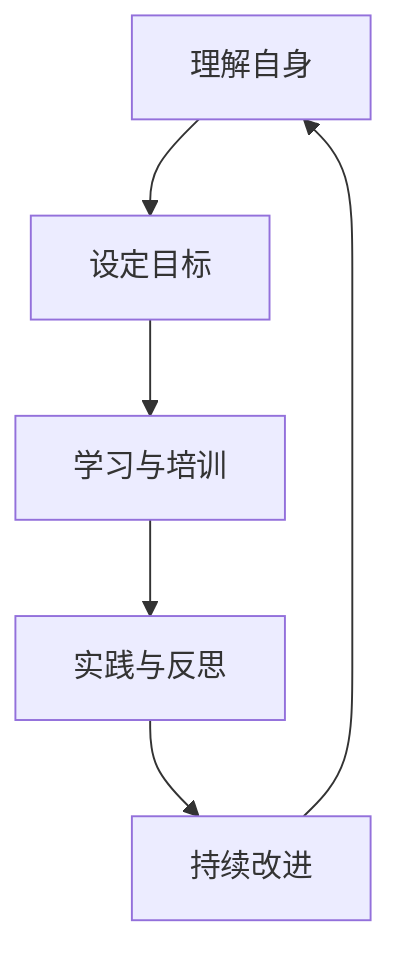
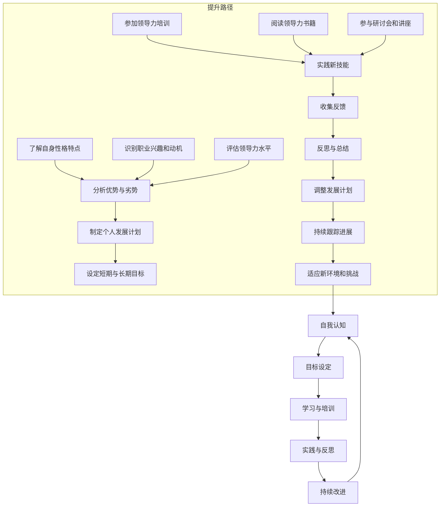

                 

### 从工程师到技术领导：角色转变之路

> 关键词：工程师、技术领导、角色转变、领导力、团队管理、业务融合

在信息技术的飞速发展背景下，工程师的角色逐渐向技术领导转变。这一转变不仅是职业发展的自然过程，更是对技术人才综合能力的考验。从工程师到技术领导，不仅需要专业技能的积累，更需要领导力和管理能力的提升。本文将围绕这一主题，通过逻辑清晰、结构紧凑的分析，探讨工程师到技术领导的角色转变之路。

> 摘要：本文首先定义了工程师与技术领导的角色，分析了从工程师到技术领导所需的技能和核心能力。随后，文章详细介绍了领导力技能的培养方法，探讨了技术与业务的融合策略，并通过实际案例解析了技术创新的应用。最后，文章提出了领导力提升的实践方法，为工程师转型技术领导提供了具体的路径和策略。

#### 第一部分：引言与角色转变概述

**第1章：从工程师到技术领导的角色转变**

##### 1.1 工程师与技术领导的角色定义

**1.1.1 工程师的职责与技能**

工程师是从事软件开发、系统集成、硬件维护等工作的技术人员。他们具备扎实的编程能力、算法设计能力和系统架构设计能力，能够独立完成技术项目的开发与实施。工程师的工作主要是技术问题解决、代码编写和系统维护。

**1.1.2 技术领导的职责与技能**

技术领导，即在技术团队中担任管理角色的人员。他们不仅需要具备工程师的技能，还需要具备项目管理、团队领导和业务决策能力。技术领导的工作涉及团队管理、技术规划、资源协调和决策制定。

**1.1.3 工程师到技术领导的转变路径**

工程师向技术领导转变通常需要以下几个步骤：
1. 技术深度：成为技术领域的专家，掌握核心技术。
2. 项目管理：参与项目管理工作，提升项目规划和执行能力。
3. 团队领导：担任团队领导，培养团队协作和管理能力。
4. 业务理解：深入了解业务，提升技术决策和战略规划能力。

##### 1.2 技术领导所需的核心能力

**1.2.1 项目管理与规划能力**

技术领导需要具备良好的项目管理能力，包括项目规划、风险评估、进度控制和质量保证。他们需要制定详细的项目计划，确保项目按期完成。

**1.2.2 团队领导与沟通能力**

技术领导需要具备团队领导能力，包括团队建设、人员激励、冲突管理和沟通协调。他们需要建立高效的团队协作机制，确保团队成员之间的良好沟通。

**1.2.3 技术战略与决策能力**

技术领导需要具备技术战略规划能力，能够根据业务需求制定技术发展路线，做出关键的技术决策。他们需要具备前瞻性，引领团队不断创新。

##### 1.3 技术领导的角色影响

**1.3.1 对个人职业发展的意义**

技术领导角色有助于个人职业发展的提升，可以实现从技术专家到管理层的跨越。这一转变不仅提升了个人能力，还拓宽了职业发展路径。

**1.3.2 对团队和项目的影响**

技术领导对团队和项目的影响至关重要。他们能够提升团队效率，确保项目顺利实施，为组织创造更大的价值。

**1.3.3 对组织文化的塑造**

技术领导通过自身行为和决策，对组织文化产生深远影响。他们能够推动组织创新，提升团队凝聚力，构建积极向上的工作氛围。

#### 第二部分：领导力技能培养

**第2章：领导力基础与沟通技巧**

##### 2.1 领导力模型与理论

**2.1.1 变革型领导**

变革型领导通过激励和启发团队成员，推动团队实现变革。他们关注团队成长，倡导创新思维，能够带领团队迎接挑战。

**2.1.2 情境领导**

情境领导理论认为，领导风格应根据团队成员的能力和任务需求灵活调整。技术领导需要根据不同情境选择合适的领导方式。

**2.1.3 仆人领导**

仆人领导强调领导者的服务意识，关注团队成员的需求和成长。他们以身作则，帮助团队成员实现自我价值。

##### 2.2 沟通技巧的重要性

**2.2.1 沟通的目的与类型**

有效沟通是技术领导的重要技能。沟通目的包括信息传递、协调合作、解决冲突等。沟通类型包括口头沟通、书面沟通和肢体语言等。

**2.2.2 有效沟通的障碍与解决策略**

沟通障碍包括信息失真、文化差异、情绪因素等。解决策略包括倾听、清晰表达、使用共同语言和及时反馈等。

**2.2.3 情感共鸣与同理心**

技术领导需要具备情感共鸣和同理心，能够理解团队成员的情感和需求。这有助于建立信任关系，提升团队凝聚力。

#### 第3章：团队管理与协作

##### 3.1 团队建设策略

**3.1.1 团队角色与分工**

明确团队角色和分工是团队建设的基础。技术领导需要根据项目需求和团队特点，合理分配任务。

**3.1.2 团队激励与考核**

团队激励和考核是提升团队士气和效率的重要手段。技术领导需要制定有效的激励机制和考核标准。

**3.1.3 团队冲突管理**

团队冲突是不可避免的，技术领导需要采取合理的冲突管理策略，确保团队和谐稳定。

##### 3.2 协作工具与平台

**3.2.1 Git与版本控制**

Git是版本控制系统的利器，能够有效管理代码版本，提高开发效率。

**3.2.2 Jira与敏捷开发**

Jira是敏捷开发管理的利器，能够帮助团队进行任务管理、进度追踪和问题解决。

**3.2.3 其他常用协作工具介绍**

除了Git和Jira，还有许多其他协作工具，如Slack、Trello等，技术领导应根据团队需求选择合适的工具。

#### 第三部分：技术与业务融合

**第4章：技术与业务理解**

##### 4.1 技术趋势与业务发展方向

技术领导需要关注技术趋势，如云计算、大数据、人工智能等，并了解业务发展方向，确保技术能够为业务提供有力支持。

##### 4.2 技术决策框架

技术领导在技术决策中需要考虑多个因素，如技术选型、风险评估、成本效益等，并制定相应的决策框架。

##### 4.3 技术与业务的互动

技术与业务的互动是技术领导的重要职责。他们需要推动技术团队与业务团队的合作，确保技术能够满足业务需求。

#### 第5章：技术创新与实践

##### 5.1 创新思维与方法

技术领导需要具备创新思维，能够从不同角度思考问题，提出创新的解决方案。

##### 5.2 技术创新案例解析

通过实际案例解析，技术领导可以了解技术创新的应用，提升自身创新能力。

##### 5.3 技术创新实践

技术领导需要在实际工作中推动技术创新，通过实践不断提升团队的技术能力和创新能力。

#### 第四部分：领导力提升与实践

**第6章：自我领导力提升**

##### 6.1 自我认知与自我管理

技术领导需要了解自身优势和不足，通过自我管理提升领导力。

##### 6.2 自我领导力模型

技术领导可以参考自我领导力模型，评估自身领导力水平，并制定提升计划。

##### 6.3 自我领导力提升策略

技术领导可以采取多种策略提升自我领导力，如学习领导力理论、参与领导力培训、反思与总结等。

**第7章：领导力提升实践**

##### 7.1 领导力发展计划

技术领导需要制定领导力发展计划，明确提升目标和方法。

##### 7.2 领导力实践案例

通过实际案例，技术领导可以了解领导力实践的方法和技巧。

##### 7.3 持续学习与改进

技术领导需要保持持续学习的态度，通过实践和反思不断提升自身领导力。

### 附录

#### 附录A：领导力工具与资源

**A.1 常用领导力工具**

- 性格测试工具
- 沟通技巧训练工具
- 团队评估工具

**A.2 推荐阅读与资源**

- 领导力书籍推荐
- 领导力培训课程
- 领导力研讨会与论坛

### 结束语

从工程师到技术领导，不仅需要专业技能的提升，更需要领导力和管理能力的培养。本文通过详细的分析和案例解析，为工程师转型技术领导提供了具体的路径和策略。希望本文能够为技术人才提供有益的启示，助力他们在职业发展道路上取得更大成就。

> 作者：AI天才研究院/AI Genius Institute & 禅与计算机程序设计艺术 /Zen And The Art of Computer Programming### 第一部分：引言与角色转变概述

**第1章：从工程师到技术领导的角色转变**

**1.1 工程师与技术领导的角色定义**

在信息技术行业，工程师和技术领导的角色有着明显的区别和联系。工程师通常是专注于技术实现的个体，他们负责编码、测试和解决问题，确保软件或系统的正常运行。工程师的核心技能包括编程能力、系统架构设计、算法实现等。他们的工作重心在于技术细节和问题的解决。

相比之下，技术领导的角色更为广泛，不仅需要具备工程师的技能，还需要承担项目管理、团队领导和决策制定等职责。技术领导的工作重心在于团队管理和业务战略的执行。他们需要协调资源、制定计划、分配任务，并且确保项目能够按时按质完成。此外，技术领导还需要具备优秀的沟通能力、团队领导力和决策能力。

**1.1.1 工程师的职责与技能**

工程师的职责主要集中在以下几个方面：

- **编码与实现**：根据项目需求，编写高质量、可维护的代码。
- **测试与调试**：进行单元测试、集成测试，确保软件或系统功能正确无误。
- **问题解决**：当系统出现问题时，工程师需要迅速定位问题并加以解决。
- **技术文档编写**：为项目编写详细的技术文档，便于其他团队成员理解和后续维护。

工程师所需的技能包括：

- **编程语言**：熟练掌握至少一种编程语言，如Java、Python或C++。
- **数据结构与算法**：理解常用的数据结构和算法，能够在实际项目中灵活运用。
- **系统架构**：具备一定的系统架构设计能力，能够根据项目需求设计合理的系统架构。
- **工具与框架**：熟悉常用的开发工具和框架，如Git、Maven、Spring等。

**1.1.2 技术领导的职责与技能**

技术领导在团队中的角色不仅仅是管理技术项目，还包括以下几个方面：

- **项目管理**：负责项目计划、资源分配、进度跟踪和质量保证。
- **团队领导**：指导团队成员的工作，激励团队士气，解决团队冲突。
- **决策制定**：根据业务需求制定技术战略，做出关键的技术决策。
- **业务理解**：深入了解业务需求，确保技术方案能够满足业务目标。

技术领导所需的技能包括：

- **项目管理工具**：熟练使用项目管理工具，如Jira、Trello等。
- **沟通能力**：具备良好的沟通技巧，能够有效地与团队成员、业务团队和高层管理者沟通。
- **团队领导力**：能够带领团队达成目标，激发团队成员的潜力和创造力。
- **技术战略规划**：具备前瞻性，能够制定并实施长期的技术发展计划。

**1.1.3 工程师到技术领导的转变路径**

工程师向技术领导转变通常需要以下几个步骤：

- **技术深度**：成为技术领域的专家，掌握核心技术，成为团队中的技术权威。
- **项目管理**：参与项目管理工作，提升项目规划和执行能力，学会如何管理时间和资源。
- **团队领导**：担任团队领导角色，培养团队协作和管理能力，学会如何激励和指导团队成员。
- **业务理解**：深入了解业务，提升技术决策和战略规划能力，确保技术能够为业务提供有力支持。

**1.2 技术领导所需的核心能力**

技术领导需要具备多种核心能力，以应对复杂多变的工作环境。以下是一些关键能力：

- **项目管理与规划能力**：能够制定详细的项目计划，合理分配资源，控制项目进度和质量。
- **团队领导与沟通能力**：能够建立高效的团队协作机制，激励团队成员，解决团队冲突。
- **技术战略与决策能力**：能够根据业务需求制定技术战略，做出关键的技术决策，引领团队技术创新。

**1.2.1 项目管理与规划能力**

技术领导需要具备良好的项目管理能力，包括以下几个方面：

- **项目计划**：能够根据项目需求制定详细的项目计划，包括任务分解、时间安排、资源分配等。
- **风险评估**：能够识别项目中的潜在风险，并制定相应的应对措施。
- **进度控制**：能够监控项目进度，确保项目按计划进行。
- **质量保证**：能够制定质量控制措施，确保项目交付的软件或系统达到预期质量。

**1.2.2 团队领导与沟通能力**

技术领导需要具备出色的团队领导与沟通能力，包括以下几个方面：

- **团队建设**：能够建立良好的团队氛围，培养团队协作精神，提升团队整体执行力。
- **激励与考核**：能够制定合理的激励机制和考核标准，激励团队成员发挥最大潜力。
- **冲突管理**：能够处理团队内部的冲突，保持团队和谐稳定。
- **沟通协调**：能够与团队成员、业务团队和高层管理者进行有效沟通，确保信息传递无误。

**1.2.3 技术战略与决策能力**

技术领导需要具备技术战略与决策能力，包括以下几个方面：

- **技术趋势**：能够关注行业技术趋势，了解新兴技术，为业务发展提供技术支持。
- **技术选型**：能够根据项目需求和技术发展路线，选择合适的技术方案。
- **风险评估**：能够评估技术方案的风险，制定相应的风险应对策略。
- **战略规划**：能够制定长期的技术发展战略，确保技术团队和业务目标的一致性。

**1.3 技术领导的角色影响**

技术领导在团队和项目中扮演着至关重要的角色，他们的行为和决策对团队和项目的成功有着深远的影响。

- **对个人职业发展的意义**：技术领导角色有助于个人职业发展的提升，可以实现从技术专家到管理层的跨越。这一转变不仅提升了个人能力，还拓宽了职业发展路径。
- **对团队和项目的影响**：技术领导能够提升团队效率，确保项目顺利实施，为组织创造更大的价值。他们通过有效的管理和领导，确保团队成员能够充分发挥潜力，实现项目目标。
- **对组织文化的塑造**：技术领导通过自身行为和决策，对组织文化产生深远影响。他们能够推动组织创新，提升团队凝聚力，构建积极向上的工作氛围。这种积极的文化有助于组织的长期发展。

**1.3.1 对个人职业发展的意义**

技术领导角色对于个人职业发展具有多重意义：

- **领导能力**：担任技术领导角色，能够锻炼和提升个人的领导能力和管理技能，为未来的职业发展打下坚实基础。
- **职业晋升**：从技术专家到技术领导的转变，是职业晋升的重要一步。技术领导职位通常具有较高的薪酬和福利待遇。
- **视野拓宽**：技术领导需要关注整个项目或产品的生命周期，这有助于拓宽个人的视野，提升全局观和战略思维。
- **影响力**：技术领导在团队和项目中的地位，使其能够在组织内发挥更大的影响力，推动技术和业务的发展。

**1.3.2 对团队和项目的影响**

技术领导对团队和项目的影响主要体现在以下几个方面：

- **团队效率**：技术领导能够通过有效的管理和激励，提升团队的整体效率。他们能够明确团队目标，合理分配任务，确保团队成员的工作有条不紊。
- **项目成功**：技术领导在项目中扮演着关键角色，他们的决策和指导直接影响项目的进度和质量。他们能够识别项目风险，制定应对策略，确保项目按时按质完成。
- **创新能力**：技术领导鼓励团队成员不断创新，推动技术团队在技术难题和业务挑战中寻找解决方案。他们的创新思维和领导风格有助于团队在激烈的市场竞争中脱颖而出。

**1.3.3 对组织文化的塑造**

技术领导对组织文化有着深远的影响，他们可以通过以下几个方面塑造积极向上的组织文化：

- **领导风格**：技术领导通过自身的领导风格，如激励、尊重和信任，塑造积极向上的工作氛围。他们的行为和决策成为团队成员学习和效仿的榜样。
- **创新氛围**：技术领导鼓励团队成员勇于创新，为创新提供支持和资源。他们通过技术创新，推动组织在技术和业务上取得突破，形成创新文化。
- **团队协作**：技术领导重视团队协作，通过团队建设和协作工具，建立高效的团队协作机制。他们鼓励团队成员相互支持，共同解决问题。
- **持续学习**：技术领导倡导持续学习的理念，鼓励团队成员不断学习和提升技能。他们通过培训、研讨会等形式，为团队成员提供学习和成长的机会。

**第2章：领导力基础与沟通技巧**

**2.1 领导力模型与理论**

领导力是技术领导成功的关键因素。不同的领导力模型和理论可以为我们提供有益的指导。以下是几种常见的领导力模型：

**2.1.1 变革型领导**

变革型领导（Transformational Leadership）是一种通过激励和启发团队成员，推动团队实现变革的领导方式。变革型领导者关注团队成员的个人成长，通过变革来激励团队成员，使他们超越自我，达成共同目标。变革型领导的特点包括：

- **愿景领导**：领导者具有清晰的愿景，能够激励团队成员为之努力。
- **激励激励**：领导者通过激励和奖励，激发团队成员的积极性和创造力。
- **个性化关怀**：领导者关注团队成员的个人需求，提供个性化的支持和指导。
- **模范作用**：领导者以身作则，成为团队成员的榜样。

**2.1.2 情境领导**

情境领导（Situational Leadership）理论认为，领导风格应根据团队成员的能力和任务需求灵活调整。情境领导模型将领导风格分为四种类型：

- **命令型领导**：在团队成员缺乏能力和信心时，领导者采取明确的指令和监督。
- **说服型领导**：在团队成员有一定能力但缺乏信心时，领导者通过沟通和激励来引导团队成员。
- **参与型领导**：在团队成员有能力但缺乏动力时，领导者与团队成员共同决策，增强团队成员的参与感。
- **授权型领导**：在团队成员既有能力又有信心时，领导者赋予团队成员更多的自主权，让他们自主决策和执行。

**2.1.3 仆人领导**

仆人领导（Servant Leadership）强调领导者的服务意识，关注团队成员的需求和成长。仆人领导者的目标是帮助团队成员实现自我价值，推动团队共同进步。仆人领导的特点包括：

- **倾听与服务**：领导者倾听团队成员的需求，提供必要的支持和帮助。
- **培养人才**：领导者关注团队成员的成长，为他们提供培训和发展的机会。
- **促进协作**：领导者鼓励团队成员之间的合作，建立积极的团队氛围。
- **共同目标**：领导者与团队成员共同制定目标，确保团队目标的实现。

**2.2 沟通技巧的重要性**

沟通技巧是技术领导的重要能力之一。良好的沟通能够确保信息的有效传递，促进团队协作，提高工作效率。以下是沟通技巧的重要性：

**2.2.1 沟通的目的与类型**

沟通的目的包括信息传递、协调合作、解决冲突和建立关系等。根据沟通的内容和形式，沟通可以分为以下几种类型：

- **口头沟通**：通过面对面交流、电话、视频会议等方式进行的沟通。
- **书面沟通**：通过电子邮件、报告、文档等方式进行的沟通。
- **非语言沟通**：通过肢体语言、面部表情、姿态等非语言手段进行的沟通。

**2.2.2 有效沟通的障碍与解决策略**

有效沟通面临多种障碍，包括语言障碍、文化差异、情绪因素等。以下是一些常见的沟通障碍及解决策略：

- **语言障碍**：解决策略包括使用简单明了的语言、避免专业术语等。
- **文化差异**：解决策略包括尊重不同文化背景、使用共同语言等。
- **情绪因素**：解决策略包括保持冷静、倾听对方的观点、避免争吵等。

**2.2.3 情感共鸣与同理心**

情感共鸣与同理心是有效沟通的重要元素。情感共鸣是指领导者能够理解和感受团队成员的情感，同理心是指领导者能够站在团队成员的角度思考问题。以下是如何培养情感共鸣与同理心的建议：

- **倾听**：领导者需要耐心倾听团队成员的意见和感受，给予充分的理解和尊重。
- **共情**：领导者需要尝试站在团队成员的角度思考问题，体验他们的情感。
- **反馈**：领导者需要给予团队成员积极的反馈，表达对他们的认可和支持。
- **沟通环境**：领导者需要创造一个开放、包容的沟通环境，鼓励团队成员自由表达意见。

**2.3 沟通技巧的提升策略**

为了提升沟通技巧，技术领导可以采取以下策略：

- **培训与学习**：参加沟通技巧培训课程，学习有效的沟通方法和技巧。
- **反思与总结**：定期反思自己的沟通行为，总结经验教训，不断提高沟通效果。
- **实践与反馈**：在实际工作中不断实践沟通技巧，接受团队成员的反馈，不断改进。
- **阅读与交流**：阅读沟通相关的书籍和文章，与同行交流沟通经验，拓宽视野。

通过以上策略，技术领导可以提升沟通技巧，建立良好的团队沟通机制，推动团队协作和项目成功。

**第3章：团队管理与协作**

**3.1 团队建设策略**

团队建设是技术领导的重要任务之一。一个高效的团队能够更好地实现项目目标，提高整体工作效率。以下是团队建设的一些策略：

**3.1.1 团队角色与分工**

明确团队角色和分工是团队建设的基础。技术领导需要根据项目需求和团队特点，为每个团队成员分配明确的职责。以下是一些常见的团队角色：

- **项目经理**：负责整体项目规划、进度控制和资源分配。
- **开发人员**：负责编写代码、进行测试和调试。
- **测试人员**：负责进行系统测试，确保软件或系统的质量。
- **产品经理**：负责产品需求分析、规划和设计。
- **UI/UX设计师**：负责用户界面和用户体验的设计。

在明确角色分工后，技术领导需要确保每个成员都清楚自己的职责，避免重复工作和资源浪费。

**3.1.2 团队激励与考核**

团队激励和考核是提升团队士气和效率的重要手段。技术领导可以采取以下策略：

- **奖励机制**：设立明确的奖励机制，对表现优秀的团队成员给予奖励，如奖金、晋升机会等。
- **绩效评估**：定期对团队成员的工作进行绩效评估，了解他们的工作情况，给予建设性的反馈。
- **培训与发展**：为团队成员提供培训和发展机会，帮助他们提升技能，实现职业成长。
- **公平竞争**：确保团队中的竞争是公平的，避免出现不公平现象，损害团队成员的积极性。

**3.1.3 团队冲突管理**

团队冲突是不可避免的，技术领导需要采取合理的冲突管理策略，确保团队和谐稳定。以下是一些常见的团队冲突及解决策略：

- **沟通解决**：鼓励团队成员通过沟通解决问题，避免情绪化和冲突升级。
- **调解与仲裁**：在沟通无效时，技术领导可以充当调解者或仲裁者，帮助双方找到共同的解决方案。
- **情绪管理**：帮助团队成员管理情绪，避免在冲突中失去理智。
- **调整分工**：在必要时，技术领导可以调整团队分工，重新分配任务，减少冲突源。

**3.2 协作工具与平台**

在现代团队工作中，协作工具和平台发挥着至关重要的作用。技术领导需要选择合适的工具和平台，以提高团队协作效率。以下是一些常用的协作工具和平台：

- **Git**：Git是一个版本控制系统，用于管理代码的版本。它可以帮助团队成员协同工作，确保代码的一致性和完整性。
- **Jira**：Jira是一个敏捷开发管理工具，用于任务管理、进度追踪和问题解决。它可以帮助团队清晰地了解项目进展，确保项目按时完成。
- **Slack**：Slack是一个即时通讯工具，用于团队内部的沟通和协作。它可以帮助团队成员快速交流和共享信息。
- **Trello**：Trello是一个任务管理工具，用于项目管理、任务分配和进度追踪。它可以帮助团队明确任务分工，提高工作效率。

**3.2.1 Git与版本控制**

Git是一个分布式版本控制系统，用于管理代码的版本。它具有以下特点：

- **分布式存储**：Git将代码存储在分布式仓库中，每个团队成员都有自己的本地仓库，可以独立工作。
- **分支管理**：Git支持分支管理，允许团队成员在独立分支上进行开发，确保代码的独立性和安全性。
- **合并冲突**：Git能够自动合并代码，但在冲突时需要人工解决。技术领导需要确保团队成员了解如何处理合并冲突。

**3.2.2 Jira与敏捷开发**

Jira是一个敏捷开发管理工具，用于任务管理、进度追踪和问题解决。它具有以下特点：

- **任务追踪**：Jira允许团队成员创建、分配和跟踪任务，确保每个任务都有明确的负责人和截止日期。
- **进度报告**：Jira提供进度报告功能，可以帮助技术领导了解项目的进展情况，及时调整项目计划。
- **敏捷开发**：Jira支持敏捷开发模式，如Scrum和Kanban，可以帮助团队灵活调整开发计划，提高工作效率。

**3.2.3 其他常用协作工具介绍**

除了Git、Jira和Slack，还有许多其他常用的协作工具，如Trello、Confluence、Trello等。以下是一些其他常用协作工具的介绍：

- **Confluence**：Confluence是一个团队协作平台，用于文档编写、知识管理和项目协作。它可以帮助团队共享信息，提高协作效率。
- **Trello**：Trello是一个任务管理工具，用于项目管理、任务分配和进度追踪。它采用看板（Kanban）模式，可以帮助团队可视化任务进展，提高工作效率。
- **Google Workspace**：Google Workspace包括Google文档、表格、邮件等工具，用于团队协作和信息共享。它可以帮助团队在线协作，提高沟通效率。

**3.2.4 选择合适的协作工具**

选择合适的协作工具对于团队协作至关重要。技术领导需要根据团队特点和项目需求，选择适合的协作工具。以下是一些选择协作工具时需要考虑的因素：

- **团队规模**：团队规模较小的项目可能只需要简单的协作工具，如Slack或Trello；而大型项目可能需要更复杂的工具，如Jira或Confluence。
- **项目需求**：根据项目的需求选择合适的协作工具，如敏捷开发项目可能需要Jira或Trello，而知识管理项目可能需要Confluence。
- **团队习惯**：考虑团队成员的习惯和使用偏好，选择易于使用和接受的协作工具。
- **成本效益**：评估协作工具的成本和效益，选择性价比高的工具。

**3.3 团队协作与沟通**

团队协作与沟通是技术领导的重要任务之一。良好的团队协作与沟通能够提高团队效率，确保项目成功。以下是一些团队协作与沟通的策略：

- **定期会议**：定期举行团队会议，讨论项目进展、问题解决方案和下一步计划。会议应简洁高效，确保每个成员都有发言的机会。
- **信息共享**：鼓励团队成员共享信息和知识，建立知识库，提高团队的协同效率。
- **反馈机制**：建立有效的反馈机制，鼓励团队成员互相反馈意见和建议，促进团队协作和改进。
- **透明沟通**：保持沟通的透明度，确保团队成员了解项目的整体进展和关键信息，减少误解和冲突。
- **跨部门协作**：鼓励跨部门协作，建立跨部门的沟通渠道，确保项目的顺利进行。

**3.4 团队建设活动**

团队建设活动是加强团队凝聚力、提升团队协作能力的重要手段。以下是一些团队建设活动的建议：

- **团队培训**：定期组织团队培训，提高团队成员的技能和知识水平。
- **团队拓展**：组织户外拓展活动，加强团队成员之间的沟通和信任。
- **团队建设游戏**：通过团队建设游戏，提高团队成员的合作精神和团队意识。
- **团队奖励**：为表现优秀的团队成员设立奖励机制，激励团队士气。

通过以上团队建设策略和协作工具，技术领导可以建立高效的团队，提升团队协作能力，确保项目的成功实施。

**第4章：技术与业务融合**

**4.1 技术趋势与业务发展方向**

技术领导需要关注技术趋势，了解业务发展方向，确保技术能够为业务提供有力支持。以下是一些当前热门的技术趋势和业务发展方向：

- **云计算**：云计算技术正在改变企业的IT架构，提供更灵活、高效和可扩展的计算资源。技术领导需要了解云计算的基本概念、服务模式和实施策略，确保企业能够充分利用云计算的优势。
- **大数据**：大数据技术可以帮助企业从海量数据中提取有价值的信息，支持业务决策和优化。技术领导需要掌握大数据的基本原理、数据处理和分析方法，为业务提供数据支持。
- **人工智能**：人工智能（AI）技术正在逐步应用到各个领域，从自动驾驶到智能客服，从图像识别到自然语言处理。技术领导需要了解AI的基本原理、算法和应用场景，推动企业在AI领域的创新。
- **物联网（IoT）**：物联网技术通过连接各种设备，实现数据的实时采集和传输，为智能城市、智能制造等提供支持。技术领导需要了解物联网的基本架构、通信协议和应用案例，推动企业物联网项目的发展。

**4.2 技术决策框架**

技术领导在技术决策中需要考虑多个因素，以下是一个常见的技术决策框架：

- **需求分析**：明确业务需求和技术需求，确保技术方案能够满足业务目标。
- **可行性分析**：评估技术方案的可行性，包括技术成熟度、实施难度、成本效益等。
- **风险分析**：识别潜在的技术风险，制定相应的风险应对策略。
- **选型评估**：对不同的技术方案进行评估和比较，选择最适合的方案。
- **成本预算**：制定技术项目的成本预算，确保项目能够在预算范围内完成。
- **实施计划**：制定详细的实施计划，确保技术方案能够按时按质完成。

**4.3 技术与业务的互动**

技术与业务的互动是技术领导的重要职责。以下是一些技术与业务互动的策略：

- **业务需求理解**：技术领导需要深入了解业务需求，与业务团队紧密合作，确保技术方案能够满足业务目标。
- **跨部门协作**：技术领导需要与其他部门（如市场、销售、运营等）建立良好的沟通渠道，确保技术方案能够与业务战略一致。
- **技术培训**：为业务团队提供技术培训，帮助他们了解技术的基本原理和操作方法，提高业务团队的技术素养。
- **业务场景模拟**：通过业务场景模拟，验证技术方案的实际效果，确保技术能够解决业务问题。
- **反馈机制**：建立有效的反馈机制，收集业务团队的反馈意见，不断优化技术方案。

**4.4 技术战略与业务发展**

技术战略是业务发展的重要支撑。技术领导需要制定长期的技术战略，确保技术能够为业务提供持续的支持。以下是一些技术战略的制定策略：

- **市场调研**：通过市场调研，了解行业趋势、竞争对手和客户需求，为技术战略提供依据。
- **技术评估**：评估现有技术能力，确定技术优势和不足，制定针对性的技术提升计划。
- **创新能力**：鼓励技术创新，推动技术团队在关键技术领域取得突破，为业务发展提供新动力。
- **人才发展**：重视技术人才的发展，培养技术领导人才，提升团队整体技术能力。
- **技术投资**：根据业务发展需求，合理规划技术投资，确保技术资源得到充分利用。

通过以上技术与业务融合的策略，技术领导可以确保技术为业务发展提供有力支持，推动企业持续创新和成长。

**第5章：技术创新与实践**

**5.1 创新思维与方法**

技术创新是推动企业发展和市场竞争的关键。技术领导需要具备创新思维，能够从不同角度思考问题，提出创新的解决方案。以下是一些创新思维和方法：

- **头脑风暴**：通过集体讨论，快速产生大量创意，筛选出有价值的创新点。
- **设计思维**：以用户需求为中心，通过迭代设计方法，不断优化产品和服务。
- **交叉思维**：将不同领域的技术和方法交叉融合，创造出新的解决方案。
- **逆向思维**：从不同的角度重新审视问题，找到突破性的解决方案。
- **系统思维**：从整体视角分析问题，找到问题的根本原因和解决策略。

**5.2 技术创新案例解析**

以下是一些技术创新案例的解析：

**案例一：云计算在金融行业的应用**

云计算技术为金融行业带来了巨大的变革。通过云计算，金融机构可以实现以下创新：

- **高效数据处理**：利用云计算的弹性计算资源，金融机构能够快速处理海量数据，提高数据处理效率。
- **灵活业务部署**：云计算平台提供了丰富的服务和工具，金融机构可以根据业务需求灵活部署新的应用和服务。
- **降低成本**：云计算模式减少了硬件设备和运维成本，降低了金融机构的运营成本。
- **数据安全**：云计算服务提供商具有强大的数据安全措施，金融机构可以更安全地存储和传输数据。

**案例二：区块链在供应链管理中的应用**

区块链技术为供应链管理带来了新的可能性。以下是一些应用场景：

- **透明供应链**：通过区块链技术，供应链中的各个环节可以实时跟踪产品信息，确保供应链的透明性。
- **智能合约**：区块链技术可以实现智能合约，自动执行合同条款，减少人为干预和错误。
- **降低成本**：通过优化供应链流程，减少中间环节，降低供应链成本。
- **增强信任**：区块链技术确保数据的不可篡改性，增强供应链各方的信任。

**案例三：人工智能在医疗健康领域的创新**

人工智能技术在医疗健康领域具有广泛应用，以下是一些创新应用：

- **疾病预测**：通过大数据分析和机器学习算法，人工智能可以预测疾病的发生，为早期干预提供依据。
- **诊断辅助**：人工智能可以辅助医生进行疾病诊断，提高诊断的准确性和效率。
- **个性化治疗**：根据患者的数据和病历，人工智能可以为患者制定个性化的治疗方案。
- **健康管理**：人工智能可以帮助患者进行健康管理，提供健康建议和预警。

**5.3 技术创新实践**

技术创新不仅仅是理论上的探讨，更需要实践中的应用。以下是一些技术创新实践的步骤：

- **需求分析**：明确创新需求，了解用户需求和业务目标。
- **技术选型**：根据需求分析，选择合适的技术方案和工具。
- **原型设计**：设计创新产品的原型，进行功能演示和测试。
- **迭代优化**：根据用户反馈和测试结果，不断优化产品，提高用户体验。
- **实施部署**：将创新产品投入实际应用，进行部署和推广。

通过技术创新实践，技术领导可以推动企业在技术领域的创新和突破，提高企业的市场竞争力。

**第6章：自我领导力提升**

**6.1 自我认知与自我管理**

自我领导力提升的第一步是自我认知与自我管理。技术领导需要了解自己的优势、劣势和职业目标，以便制定合适的提升策略。以下是一些自我认知与自我管理的策略：

- **自我评估工具**：使用自我评估工具，如性格测试、领导力评估等，了解自己的优势和不足。
- **职业规划**：制定长期的职业规划，明确自己的职业目标和实现路径。
- **时间管理**：学习时间管理技巧，合理分配工作时间，提高工作效率。
- **目标设定**：设定明确的个人目标和里程碑，不断挑战自我，实现自我提升。

**6.2 自我领导力模型**

自我领导力模型可以帮助技术领导评估自身的领导力水平，并制定提升计划。以下是一个常见的自我领导力模型：

- **自我认知**：了解自己的性格特点、价值观和职业目标。
- **自我激励**：设定明确的目标，保持积极的心态，持续激励自己。
- **自我管理**：学会时间管理、情绪管理和压力管理，保持身心健康。
- **团队领导**：培养团队领导能力，包括沟通能力、激励能力和决策能力。
- **创新能力**：持续学习新技术和方法，保持创新思维，推动团队创新。

**6.3 自我领导力提升策略**

为了提升自我领导力，技术领导可以采取以下策略：

- **学习与培训**：参加领导力培训课程，学习领导力理论和实践技巧。
- **反思与总结**：定期反思自己的领导行为，总结经验教训，不断改进。
- **阅读与交流**：阅读领导力相关书籍，与同行交流领导经验，拓宽视野。
- **实践与反馈**：在实际工作中不断实践领导力，接受团队成员的反馈，不断改进。

**第7章：领导力提升与实践**

**7.1 领导力发展计划**

为了提升领导力，技术领导可以制定详细的领导力发展计划。以下是一些制定领导力发展计划的步骤：

- **目标设定**：明确提升领导力的具体目标，如提高团队效率、增强沟通能力等。
- **评估现状**：评估自身的领导力水平，了解优势和不足。
- **制定策略**：根据评估结果，制定提升策略，如学习新技能、参与培训等。
- **行动计划**：将提升策略转化为具体的行动计划，包括学习目标、时间安排、资源需求等。
- **执行与监控**：按照行动计划执行，定期监控进度，调整计划。

**7.2 领导力实践案例**

以下是一些领导力实践案例：

**案例一：如何带领团队度过危机**

在团队面临危机时，技术领导需要采取以下措施：

- **冷静分析**：保持冷静，分析危机的原因和影响，制定应对策略。
- **沟通协调**：与团队成员沟通，了解他们的意见和需求，共同制定解决方案。
- **积极应对**：采取积极措施，如调整项目计划、优化团队资源等，缓解危机。
- **激励团队**：鼓励团队成员，增强他们的信心和凝聚力，共同应对危机。

**案例二：如何在变革中保持团队凝聚力**

在组织变革过程中，技术领导需要保持团队的凝聚力。以下是一些策略：

- **明确变革目标**：与团队成员共同明确变革的目标和意义，增强他们的参与感和责任感。
- **沟通变革信息**：及时沟通变革信息，解释变革的原因和预期效果，减少误解和恐慌。
- **提供支持**：为团队成员提供必要的支持，如培训、资源等，帮助他们适应变革。
- **鼓励创新**：鼓励团队成员在变革中创新，寻找新的发展机会，保持团队的活力。

**案例三：如何培养团队的创新文化**

为了培养团队的创新文化，技术领导可以采取以下措施：

- **鼓励创新思维**：创造一个开放、包容的创新环境，鼓励团队成员提出新的想法和解决方案。
- **提供创新资源**：为团队成员提供创新所需的资源，如时间、资金、技术支持等。
- **奖励创新成果**：对创新成果给予奖励和认可，激励团队成员继续创新。
- **定期创新活动**：组织定期的创新活动，如头脑风暴、创新竞赛等，激发团队成员的创造力。

通过以上领导力实践案例，技术领导可以提升自身的领导力，推动团队的发展和进步。

**附录A：领导力工具与资源**

为了提升领导力，技术领导可以借助一些工具和资源。以下是一些常用的领导力工具与资源：

**A.1 常用领导力工具**

- **性格测试工具**：如MBTI、DISC等，帮助领导者了解自己的性格特点。
- **沟通技巧训练工具**：如沟通模型、沟通技巧练习等，提高领导者的沟通能力。
- **团队评估工具**：如360度反馈、团队绩效评估等，帮助领导者评估团队表现。

**A.2 推荐阅读与资源**

- **领导力书籍推荐**：如《领导力五大障碍》、《第五项修炼》等，提供领导力理论的深入理解。
- **领导力培训课程**：如公开课程、在线课程等，提供系统的领导力培训。
- **领导力研讨会与论坛**：参加研讨会和论坛，与同行交流领导力经验。

通过使用这些工具和资源，技术领导可以不断提升自己的领导力，为团队和组织的发展贡献力量。

### 总结与展望

从工程师到技术领导，不仅需要专业技能的提升，更需要领导力和管理能力的培养。本文通过详细的分析和案例解析，为工程师转型技术领导提供了具体的路径和策略。技术领导需要关注角色定义、领导力技能培养、团队管理与协作、技术与业务融合、技术创新与实践等方面，不断提升自身的综合素质。

未来，技术领导面临的挑战将更加复杂，需要具备更强的前瞻性、决策力和创新能力。通过不断学习和实践，技术领导可以应对这些挑战，推动团队和组织的发展，实现个人职业的持续成长。

让我们共同迈向从工程师到技术领导的新征程，不断追求卓越，创造更加辉煌的成就！

> 作者：AI天才研究院/AI Genius Institute & 禅与计算机程序设计艺术 /Zen And The Art of Computer Programming### 附录A：领导力工具与资源

在提升领导力的过程中，利用合适的工具与资源是至关重要的。以下是一些推荐的领导力工具与资源，包括性格测试工具、沟通技巧训练工具、团队评估工具、领导力书籍推荐、培训课程以及研讨会与论坛。

#### A.1 常用领导力工具

**1. 性格测试工具**

- **MBTI（迈尔斯-布里格斯性格类型指标）**：通过问卷评估，帮助领导者了解团队成员的性格类型，促进有效沟通和团队合作。
- **DISC评估**：测量个体的行为特征，包括支配性（Dominance）、影响性（Influence）、稳定性（Steadiness）和服从性（Conformity），有助于理解团队成员的动机和沟通风格。

**2. 沟通技巧训练工具**

- **沟通模型练习**：通过学习不同的沟通模型（如SCQA模型：情境-问题-假设-答案），领导者可以提升自己的沟通效率和效果。
- **情境模拟**：使用虚拟现实或角色扮演技术，模拟实际沟通情境，练习处理不同沟通挑战的策略。

**3. 团队评估工具**

- **360度反馈**：通过收集团队成员、同事和上级的反馈，领导者可以全面了解自己在团队中的表现，识别改进机会。
- **团队绩效评估**：定期评估团队的表现，包括工作效率、团队协作和目标达成情况，为团队发展提供数据支持。

#### A.2 推荐阅读与资源

**1. 领导力书籍推荐**

- **《领导力的五大障碍》**：作者斯蒂芬·罗宾斯，分析领导者在组织内部面临的常见障碍及其解决方案。
- **《第五项修炼》**：作者彼得·圣吉，提出了个人和团队学习的五个核心技能，有助于构建学习型组织。
- **《变革之舞》**：作者战诺·图斯曼，探讨了领导者在变革过程中的角色和策略。

**2. 领导力培训课程**

- **在线领导力课程**：如Coursera、edX等平台上的专业领导力课程，提供系统的知识和实践技巧。
- **工作坊与研讨会**：参加线下领导力工作坊，通过互动和案例分析，提升实际领导能力。

**3. 领导力研讨会与论坛**

- **行业研讨会**：参加行业相关的领导力研讨会，了解前沿的理论和实践，与同行交流经验。
- **专业论坛**：如国际领导力论坛、女性领导力论坛等，为领导者提供交流和学习的机会。

通过这些工具与资源的利用，技术领导可以更好地理解自己和团队，提升沟通和团队管理能力，从而在职业发展的道路上取得更大的成功。

### 附加Mermaid流程图

为了更好地理解领导力提升的过程，以下是一个简单的Mermaid流程图，展示了领导力提升的主要步骤和关键点。

这个流程图强调了自我理解、目标设定、学习与培训、实践与反思以及持续改进的重要性，构成一个循环，推动领导力的不断提升。

通过这样的流程图，技术领导可以更清晰地看到自己的成长路径，确保在提升领导力的过程中不偏离目标，持续进步。

> 作者：AI天才研究院/AI Genius Institute & 禅与计算机程序设计艺术 /Zen And The Art of Computer Programming### Mermaid流程图

以下是一个用于展示自我领导力提升过程的Mermaid流程图：

该流程图详细展示了从自我认知到目标设定、学习与培训、实践与反思以及持续改进的整个过程，每个步骤都包含了具体的行动和注意事项，帮助技术领导明确提升路径，系统性地提高领导力。

