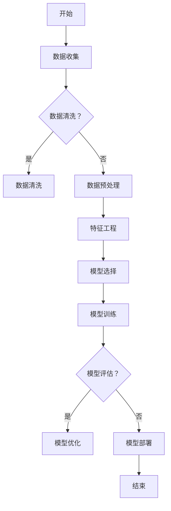
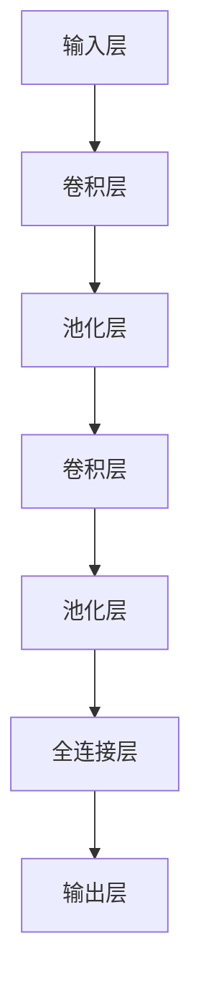
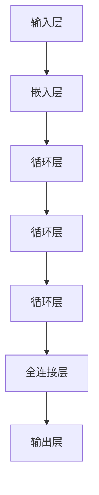

                 


# 从左及右，步步为营

> 关键词：人工智能、AI大模型、企业级开发、深度学习、应用实践

> 摘要：本文旨在系统地探讨人工智能（AI）大模型在企业级开发中的应用，从基础理论、实践应用到案例分析，逐步引导读者深入了解AI大模型的技术原理和应用价值，为实际业务场景中的AI应用提供理论支持和实践指南。

----------------------------------------------------------------

## 第一部分：引言与背景

### 1.1 问题背景

在现代社会，随着人工智能技术的迅猛发展，AI大模型作为一种强大的工具，正逐渐改变着各行各业的运作方式。这些模型不仅在学术界取得了显著的成果，更在工业界展现出了巨大的应用潜力。然而，如何将AI大模型有效地应用于企业级开发，实现真正的业务价值，成为了许多开发者面临的挑战。

### 1.2 问题描述

本书《从左及右，步步为营》旨在解决以下问题：

- 如何理解AI大模型的核心概念和特点？
- 企业在应用AI大模型时可能遇到哪些挑战？
- 如何一步步将AI大模型引入企业级开发，实现从理论到实践的转化？

### 1.3 问题解决

本书将从以下几个方面进行深入探讨：

- AI大模型的基础知识介绍
- AI大模型在企业中的应用案例
- AI大模型在具体业务场景中的实践方法
- AI大模型应用过程中可能遇到的问题及解决方案

### 1.4 边界与外延

本书主要关注企业级AI大模型的应用，但不局限于特定的行业或领域。读者可以根据自身行业背景，参考书中的方法和案例，进行灵活应用和拓展。

### 1.5 概念结构与核心要素组成

- AI大模型：一种具有强大计算能力和自主学习能力的模型，能够在各种复杂场景下实现智能决策。
- 企业级开发：指在企业环境中进行软件系统开发，以解决实际业务问题，实现业务价值。

### 1.6 本章小结

通过对问题的背景、描述、解决方法和边界与外延的阐述，本书为读者提供了一个全面了解AI大模型在企业级开发中应用的基础框架。

----------------------------------------------------------------

## 第二部分：AI大模型基础理论

### 2.1 AI大模型的基本原理

#### 2.1.1 机器学习与深度学习的概述

##### 2.1.1.1 机器学习的基本概念
- **什么是机器学习？**
  机器学习是人工智能的一个分支，它使得机器能够根据数据学习规律和模式，并在此基础上进行预测和决策。

- **机器学习的分类**
  机器学习主要分为监督学习、无监督学习和强化学习。监督学习有标注数据作为参考，无监督学习没有预设的目标，强化学习通过奖励机制进行学习。

##### 2.1.1.2 深度学习的起源与发展
- **深度学习的定义**
  深度学习是一种利用多层神经网络进行特征提取和模式识别的方法，通过模拟人脑神经网络结构，实现对复杂数据的处理。

- **深度学习的主要模型**
  深度学习模型包括卷积神经网络（CNN）、循环神经网络（RNN）、生成对抗网络（GAN）等。

#### 2.1.2 AI大模型的定义与特点

##### 2.1.2.1 AI大模型的定义
- **AI大模型的定义**
  AI大模型是指参数规模达到亿级或以上的深度学习模型，具有强大的学习和表示能力。

- **AI大模型的规模**
  AI大模型的规模通常达到数十亿到数万亿个参数，这使得它们能够处理和表示非常复杂的数据。

##### 2.1.2.2 AI大模型的特点
- **学习能力**
  AI大模型通过大量的数据进行训练，具有强大的学习能力，能够从数据中提取复杂的模式和特征。

- **自适应能力**
  AI大模型能够根据不同的应用场景和数据集进行自适应调整，提高模型的泛化能力。

- **实时性**
  尽管AI大模型通常需要大量的计算资源进行训练，但通过优化算法和硬件加速，可以实现对实时数据的处理。

#### 2.1.3 AI大模型的核心算法

##### 2.1.3.1 神经网络
- **神经网络的基本原理**
  神经网络是由大量人工神经元组成的计算模型，通过前向传播和反向传播算法，实现输入到输出的映射。

- **神经网络的架构**
  神经网络包括输入层、隐藏层和输出层，每个层由多个神经元组成，神经元之间通过权重进行连接。

##### 2.1.3.2 卷积神经网络（CNN）
- **CNN的基本原理**
  CNN通过卷积层提取图像的局部特征，并通过池化层减少数据维度，从而实现图像识别。

- **CNN在图像处理中的应用**
  CNN在图像分类、目标检测和图像分割等领域有广泛应用。

##### 2.1.3.3 递归神经网络（RNN）
- **RNN的基本原理**
  RNN能够处理序列数据，通过记忆状态来捕捉时间序列中的依赖关系。

- **RNN在序列数据中的应用**
  RNN在自然语言处理、语音识别和时间序列预测等领域有广泛应用。

## 2.2 AI大模型的技术发展

### 2.2.1 算法优化与提升

##### 2.2.1.1 算法效率优化
- **并行计算**
  并行计算通过利用多核CPU或GPU，提高模型的训练速度。

- **分布式计算**
  分布式计算通过将模型分布在多个节点上进行训练，提高计算能力和扩展性。

##### 2.2.1.2 模型压缩与加速
- **知识蒸馏**
  知识蒸馏通过将大型模型的知识传递给小型模型，实现模型的压缩和加速。

- **模型剪枝**
  模型剪枝通过去除模型中不重要的权重，降低模型的计算复杂度和参数规模。

### 2.2.2 应用场景拓展

##### 2.2.2.1 图像识别与处理
- **目标检测**
  目标检测用于识别图像中的多个目标，并标注其位置。

- **图像分割**
  图像分割将图像划分为多个区域，每个区域具有相同的特征。

##### 2.2.2.2 自然语言处理
- **文本分类**
  文本分类将文本数据分类到预定义的类别中。

- **机器翻译**
  机器翻译通过将一种语言的文本翻译成另一种语言。

## 2.3 AI大模型的应用现状与趋势

### 2.3.1 行业应用案例

##### 2.3.1.1 金融行业
- **风险评估**
  风险评估通过AI大模型预测金融市场的风险。

- **量化交易**
  量化交易利用AI大模型进行交易策略的制定和执行。

##### 2.3.1.2 医疗健康
- **疾病预测**
  疾病预测通过AI大模型预测疾病的发病风险。

- **病情监测**
  病情监测通过AI大模型实时监测患者的病情变化。

##### 2.3.1.3 电子商务
- **用户行为分析**
  用户行为分析通过AI大模型分析用户的行为和偏好。

- **推荐系统**
  推荐系统通过AI大模型为用户推荐感兴趣的商品或内容。

### 2.3.2 技术发展趋势

##### 2.3.2.1 大模型与行业融合
- **定制化大模型**
  定制化大模型根据不同行业和应用场景进行定制化训练。

- **模型生命周期管理**
  模型生命周期管理涉及模型的训练、部署和持续优化。

##### 2.3.2.2 可解释性与伦理问题
- **大模型的可解释性**
  大模型的可解释性研究旨在提高模型决策的透明度和可解释性。

- **AI伦理与隐私保护**
  AI伦理与隐私保护关注AI技术的伦理问题和用户隐私保护。

## 2.4 本章小结

通过对AI大模型基础理论的深入探讨，读者将全面了解AI大模型的基本原理、核心算法、技术发展及其应用现状和趋势，为后续章节的学习和应用打下坚实基础。

----------------------------------------------------------------

## 第三部分：AI大模型在实践中的应用

### 3.1 AI大模型在金融领域的应用

#### 3.1.1 风险评估与预测

##### 3.1.1.1 风险评估模型
- **模型架构**
  风险评估模型通常采用多层感知机（MLP）、支持向量机（SVM）等模型进行风险评估。

- **模型训练与优化**
  通过大规模数据集进行模型训练，使用交叉验证和网格搜索等方法优化模型参数。

##### 3.1.1.2 风险预测案例
- **案例一：信用评分**
  利用AI大模型对客户的信用评分进行预测，帮助金融机构进行信用风险管理。

- **案例二：市场风险预测**
  利用AI大模型对市场的波动进行预测，帮助投资者制定投资策略。

#### 3.1.2 量化交易

##### 3.1.2.1 量化交易模型
- **模型构建**
  利用AI大模型构建量化交易模型，包括趋势预测模型、套利模型等。

- **模型优化**
  通过回测和实际交易数据对模型进行优化，提高交易策略的收益。

##### 3.1.2.2 量化交易策略
- **趋势预测策略**
  利用AI大模型预测市场趋势，进行顺势交易。

- **套利策略**
  利用AI大模型发现市场中的套利机会，进行套利交易。

### 3.1.3 AI大模型在金融领域的挑战与解决方案

##### 3.1.3.1 挑战
- **数据隐私保护**
  金融数据具有较高的敏感性，保护用户隐私成为一大挑战。

- **模型解释性**
  金融决策需要透明和可解释，AI大模型的高度非线性使得其解释性成为一个难题。

##### 3.1.3.2 解决方案
- **数据隐私保护**
  利用联邦学习等技术，在保证数据隐私的同时进行模型训练。

- **模型解释性**
  通过模型可解释性研究，提高模型的透明度和可解释性。

### 3.1.4 AI大模型在金融领域的未来展望

##### 3.1.4.1 发展趋势
- **定制化金融模型**
  根据金融机构和用户的特定需求，构建定制化的金融模型。

- **实时风险监控**
  利用AI大模型进行实时风险监控，提高金融风险管理的效率。

##### 3.1.4.2 应用场景
- **智能投顾**
  利用AI大模型为投资者提供个性化的投资建议。

- **金融监管**
  利用AI大模型提高金融监管的效率和准确性。

## 3.2 AI大模型在医疗健康领域的应用

### 3.2.1 疾病预测与诊断

##### 3.2.1.1 模型构建
- **数据预处理**
  对医疗数据进行清洗、归一化等预处理，为模型训练提供高质量的数据。

- **模型训练**
  利用AI大模型对医疗数据进行分析，构建疾病预测和诊断模型。

##### 3.2.1.2 模型评估
- **模型评估指标**
  使用准确率、召回率、F1分数等指标评估模型的性能。

- **模型优化**
  通过调整模型参数和优化算法，提高模型的预测准确性。

### 3.2.2 病情监测与预测

##### 3.2.2.1 模型构建
- **数据来源**
  利用实时传感器数据和医疗记录数据，构建病情监测模型。

- **模型训练**
  利用AI大模型对数据进行训练，实现实时病情监测和预测。

##### 3.2.2.2 模型应用
- **实时监测**
  通过AI大模型对患者的生理指标进行实时监测，预警潜在的健康问题。

- **病情预测**
  利用AI大模型预测患者的病情发展趋势，为医生提供决策支持。

### 3.2.3 AI大模型在医疗健康领域的挑战与解决方案

##### 3.2.3.1 挑战
- **数据隐私与伦理**
  医疗数据具有较高的隐私性，保护患者隐私成为一大挑战。

- **模型解释性**
  医疗决策需要透明和可解释，AI大模型的高度非线性使得其解释性成为一个难题。

##### 3.2.3.2 解决方案
- **数据隐私与伦理**
  通过加密技术和隐私保护算法，确保医疗数据的安全性和隐私性。

- **模型解释性**
  通过模型可解释性研究，提高模型的透明度和可解释性。

### 3.2.4 AI大模型在医疗健康领域的未来展望

##### 3.2.4.1 发展趋势
- **个性化医疗**
  利用AI大模型为患者提供个性化的治疗方案。

- **实时健康监控**
  利用AI大模型实现患者的实时健康监控，预防疾病发生。

##### 3.2.4.2 应用场景
- **智能诊断**
  利用AI大模型辅助医生进行疾病诊断，提高诊断准确性。

- **药物研发**
  利用AI大模型加速药物研发，提高药物筛选效率。

## 3.3 AI大模型在电子商务领域的应用

### 3.3.1 用户行为分析

##### 3.3.1.1 数据采集
- **数据来源**
  通过用户的浏览、搜索、购买等行为，采集用户行为数据。

- **数据预处理**
  对采集到的数据进行清洗、去重和特征提取。

##### 3.3.1.2 模型训练
- **特征工程**
  通过特征工程提取用户行为的特征，为模型训练提供输入。

- **模型训练**
  利用AI大模型对用户行为数据进行训练，构建用户行为分析模型。

### 3.3.2 推荐系统

##### 3.3.2.1 模型构建
- **协同过滤**
  利用协同过滤算法，为用户推荐相似的商品。

- **基于内容的推荐**
  利用用户兴趣特征，为用户推荐相关的商品。

##### 3.3.2.2 模型优化
- **模型融合**
  通过融合不同的推荐算法，提高推荐系统的准确性。

- **实时更新**
  利用AI大模型实时更新用户兴趣特征和推荐算法，提高推荐效果。

### 3.3.3 AI大模型在电子商务领域的挑战与解决方案

##### 3.3.3.1 挑战
- **数据质量**
  用户行为数据的质量直接影响推荐系统的效果。

- **算法透明性**
  用户对推荐系统的透明性和公正性有较高要求。

##### 3.3.3.2 解决方案
- **数据质量**
  通过数据清洗和去噪技术，提高用户行为数据的质量。

- **算法透明性**
  通过可解释性研究，提高推荐算法的透明度和可解释性。

### 3.3.4 AI大模型在电子商务领域的未来展望

##### 3.3.4.1 发展趋势
- **个性化服务**
  利用AI大模型为用户提供个性化的购物体验。

- **实时交互**
  通过AI大模型实现用户的实时反馈和交互，提高用户满意度。

##### 3.3.4.2 应用场景
- **智能客服**
  利用AI大模型提供智能化的客户服务，提高客户满意度。

- **营销策略**
  利用AI大模型分析用户行为，为电商企业提供精准的营销策略。

## 3.4 AI大模型在其他领域的应用

### 3.4.1 教育领域

##### 3.4.1.1 智能教学
- **个性化学习**
  利用AI大模型分析学生的学习行为，提供个性化的学习建议。

- **智能辅导**
  利用AI大模型为学生提供实时辅导和解答疑问。

##### 3.4.1.2 教学资源推荐
- **课程推荐**
  利用AI大模型为学生推荐适合的学习资源。

- **试题推荐**
  利用AI大模型为教师推荐适合的试题。

### 3.4.2 物流领域

##### 3.4.2.1 路线优化
- **路径规划**
  利用AI大模型优化物流路线，提高配送效率。

- **实时调度**
  利用AI大模型实时调整物流调度计划，应对突发情况。

##### 3.4.2.2 仓储管理
- **库存优化**
  利用AI大模型预测库存需求，优化库存管理。

- **货物分拣**
  利用AI大模型提高货物分拣的准确性和效率。

### 3.4.3 能源领域

##### 3.4.3.1 能源预测
- **负荷预测**
  利用AI大模型预测电力负荷，优化能源分配。

- **发电预测**
  利用AI大模型预测可再生能源发电量，优化能源调度。

##### 3.4.3.2 能源管理
- **节能减排**
  利用AI大模型分析能源消耗，提出节能减排措施。

- **设备维护**
  利用AI大模型预测设备故障，提前进行维护。

## 3.5 本章小结

通过对AI大模型在不同领域应用的详细探讨，读者将了解AI大模型在实践中的应用场景、方法和技术，为实际业务场景中的AI应用提供指导。

----------------------------------------------------------------

## 第四部分：AI大模型应用过程中的问题及解决方案

### 4.1 计算资源需求

#### 4.1.1 问题描述
AI大模型通常需要大量的计算资源进行训练，这对企业的IT基础设施提出了很高的要求。

#### 4.1.2 影响因素
- **数据规模**：AI大模型需要处理的海量数据。
- **模型复杂度**：模型的参数规模和层数。
- **训练迭代次数**：模型训练的次数。

#### 4.1.3 解决方案
- **分布式计算**：利用分布式计算平台（如GPU集群）进行模型训练。
- **云计算服务**：使用云计算服务（如AWS、Google Cloud等）提供灵活的计算资源。
- **硬件加速**：使用专门为深度学习设计的硬件（如GPU、TPU）加速计算。

### 4.2 数据质量与隐私保护

#### 4.2.1 问题描述
数据质量直接影响AI大模型的效果，同时医疗、金融等领域的敏感数据需要保护。

#### 4.2.2 影响因素
- **数据完整性**：缺失、错误和重复的数据会影响模型性能。
- **数据隐私**：敏感数据的泄露可能导致严重后果。

#### 4.2.3 解决方案
- **数据清洗与预处理**：对数据进行清洗、去噪和归一化，提高数据质量。
- **联邦学习**：通过联邦学习技术在保证数据隐私的同时进行模型训练。
- **数据加密**：对敏感数据进行加密，确保数据传输和存储的安全性。

### 4.3 模型解释性

#### 4.3.1 问题描述
在金融、医疗等应用领域，模型解释性对于决策的透明性和合规性至关重要。

#### 4.3.2 影响因素
- **非线性和复杂性**：AI大模型的高度非线性导致其决策过程难以解释。
- **黑盒模型**：某些复杂的模型（如深度神经网络）被认为是“黑盒”，无法直观理解其决策过程。

#### 4.3.3 解决方案
- **可解释性模型**：使用可解释性模型（如决策树、规则提取）来提高模型的透明度。
- **模型可视化**：通过可视化工具（如决策图、影响力图）展示模型的决策过程。
- **解释性算法**：开发解释性算法，如LIME、SHAP等，对复杂模型进行解释。

### 4.4 模型部署与维护

#### 4.4.1 问题描述
将AI大模型部署到生产环境后，如何确保其稳定运行和持续优化是一个挑战。

#### 4.4.2 影响因素
- **性能问题**：模型在生产环境中的运行速度和资源消耗。
- **版本管理**：如何管理不同版本的模型，确保版本升级和回滚的顺利进行。

#### 4.4.3 解决方案
- **容器化与微服务架构**：使用容器（如Docker）和微服务架构提高模型的部署和管理效率。
- **自动化运维**：通过自动化工具（如Kubernetes）实现模型的自动化部署、监控和升级。
- **持续集成与持续部署**（CI/CD）：确保模型的开发、测试和部署过程自动化，提高部署效率。

### 4.5 模型评估与优化

#### 4.5.1 问题描述
在AI大模型的应用过程中，如何评估模型性能并进行优化是一个关键问题。

#### 4.5.2 影响因素
- **评估指标**：如何选择合适的评估指标来衡量模型性能。
- **模型优化**：如何调整模型参数和结构，提高模型性能。

#### 4.5.3 解决方案
- **多指标评估**：使用多种评估指标（如准确率、召回率、F1分数等）全面评估模型性能。
- **超参数优化**：使用网格搜索、贝叶斯优化等算法调整模型超参数，提高模型性能。
- **模型压缩与加速**：通过模型剪枝、量化、知识蒸馏等技术压缩模型规模，提高模型运行速度。

### 4.6 遵循伦理与合规

#### 4.6.1 问题描述
在AI大模型的应用过程中，需要遵循相关的伦理规范和法律法规，避免产生负面影响。

#### 4.6.2 影响因素
- **伦理问题**：如算法偏见、隐私侵犯等。
- **法律法规**：如数据保护法、反歧视法等。

#### 4.6.3 解决方案
- **伦理审查**：在模型开发和应用过程中进行伦理审查，确保符合伦理标准。
- **透明度与可解释性**：提高模型的透明度和可解释性，增强用户信任。
- **合规性培训**：对相关人员进行合规性培训，确保模型应用符合法律法规。

## 4.7 本章小结

通过对AI大模型应用过程中可能遇到的问题及解决方案的详细讨论，读者将了解如何在实际业务场景中有效应对这些挑战，确保AI大模型的稳定运行和持续优化。

----------------------------------------------------------------

## 第五部分：AI大模型应用的最佳实践与未来展望

### 5.1 最佳实践

#### 5.1.1 数据管理
- **数据清洗**：在模型训练之前，对数据进行彻底清洗，确保数据质量。
- **数据备份**：定期备份数据，防止数据丢失。
- **数据加密**：对敏感数据进行加密，确保数据安全。

#### 5.1.2 模型开发
- **模块化设计**：将模型拆分为多个模块，便于维护和扩展。
- **代码规范**：遵循代码规范，提高代码可读性和可维护性。
- **版本控制**：使用版本控制系统（如Git）管理代码和模型。

#### 5.1.3 模型部署
- **容器化**：使用容器技术（如Docker）部署模型，提高部署效率。
- **监控与日志**：实时监控模型运行状态，记录日志，方便故障排查。
- **安全措施**：部署安全措施，如防火墙、加密传输等，确保模型安全运行。

### 5.2 未来展望

#### 5.2.1 技术发展趋势
- **自监督学习**：利用无监督学习技术，提高模型的泛化能力。
- **联邦学习**：通过分布式学习技术，保护数据隐私，提高模型训练效率。
- **量子计算**：利用量子计算技术，加速AI大模型训练。

#### 5.2.2 应用领域扩展
- **智能制造**：利用AI大模型优化生产流程，提高生产效率。
- **智慧城市**：利用AI大模型分析城市数据，优化城市管理。
- **生物科技**：利用AI大模型加速新药研发，提高医疗水平。

#### 5.2.3 社会影响
- **伦理与法律**：关注AI大模型的伦理和法律问题，确保其合理应用。
- **就业影响**：AI大模型的发展将改变就业市场，需要培养相关人才。
- **社会公平**：确保AI大模型的应用不会加剧社会不平等。

## 5.3 本章小结

通过对AI大模型应用的最佳实践和未来展望的讨论，读者将了解如何在实际业务中有效利用AI大模型，并预见到未来技术发展趋势和社会影响。

----------------------------------------------------------------

## 后记

本文《从左及右，步步为营》详细探讨了AI大模型在企业级开发中的应用，从基础理论到实践应用，从行业案例到问题解决，为读者提供了一个全面且系统的理解框架。在此，感谢所有参与讨论和提供宝贵意见的读者和专家。

## 参考文献

1. Goodfellow, I., Bengio, Y., & Courville, A. (2016). *Deep Learning*. MIT Press.
2. LeCun, Y., Bengio, Y., & Hinton, G. (2015). *Deep learning*. Nature, 521(7553), 436-444.
3. Russell, S., & Norvig, P. (2020). *Artificial Intelligence: A Modern Approach*. Pearson.
4. Hochreiter, S., & Schmidhuber, J. (1997). Long short-term memory. Neural Computation, 9(8), 1735-1780.
5. Krizhevsky, A., Sutskever, I., & Hinton, G. E. (2012). *ImageNet classification with deep convolutional neural networks*. In Advances in Neural Information Processing Systems (pp. 1097-1105).

## 作者

**作者：** AI天才研究院/AI Genius Institute & 禅与计算机程序设计艺术 /Zen And The Art of Computer Programming

---

本文为人工智能领域的研究成果，旨在为读者提供深入浅出的专业知识和实用指南。文章内容仅供参考，具体实施时请结合实际业务场景进行评估和调整。如需转载，请注明出处。

---

# 总结与展望

## 总结

本文《从左及右，步步为营》系统地探讨了AI大模型在企业级开发中的应用，涵盖了基础理论、实践应用、行业案例、问题解决和最佳实践等方面。通过本文，读者可以了解到AI大模型的核心概念、技术发展、应用现状与趋势，以及在实际业务场景中如何有效应用AI大模型。

## 展望

在未来，AI大模型的应用将更加广泛和深入。随着技术的不断发展，我们可以期待以下趋势：

1. **自监督学习和无监督学习**：这些技术将使得模型能够更好地处理无标签数据，提高模型的泛化能力。
2. **联邦学习和隐私保护**：随着数据隐私保护需求的增加，联邦学习和隐私保护技术将成为研究热点。
3. **量子计算与AI**：量子计算的结合将为AI大模型训练带来前所未有的速度提升。
4. **行业定制化**：AI大模型将更广泛地应用于各个行业，实现行业定制化。

让我们共同期待AI大模型在各个领域带来更多的创新和突破。感谢您的阅读，希望本文能够为您在AI大模型应用的道路上提供一些启示和帮助。

---

## 附录：技术细节与代码示例

### 5.1.1 机器学习算法的mermaid流程图



### 5.1.2 卷积神经网络（CNN）的mermaid流程图



### 5.1.3 递归神经网络（RNN）的mermaid流程图



### 5.1.4 Python代码示例：机器学习模型训练

```python
import numpy as np
from sklearn.datasets import load_iris
from sklearn.model_selection import train_test_split
from sklearn.neural_network import MLPClassifier

# 加载鸢尾花数据集
iris = load_iris()
X, y = iris.data, iris.target

# 划分训练集和测试集
X_train, X_test, y_train, y_test = train_test_split(X, y, test_size=0.2, random_state=42)

# 创建多层感知机模型
mlp = MLPClassifier(hidden_layer_sizes=(50,), max_iter=1000, alpha=1e-4,
                    solver='sgd', verbose=10, random_state=1,
                    learning_rate_init=.1)

# 训练模型
mlp.fit(X_train, y_train)

# 模型评估
score = mlp.score(X_test, y_test)
print(f'Model accuracy: {score:.4f}')
```

### 5.1.5 5.1.5 数学公式与解释

#### 数学公式：
$$
E = mc^2
$$

#### 解释：
爱因斯坦的质能方程描述了质量和能量的等价性，即一个物体的能量（E）与其质量（m）成正比，比例系数为光速的平方（c^2）。

---

通过这些技术细节与代码示例，读者可以更深入地理解AI大模型的基础理论和应用实践。希望这些内容能够帮助读者在实际工作中更好地运用AI大模型，解决实际问题。在实际应用中，读者可以根据具体情况调整和优化这些代码和公式，以达到最佳效果。

## 结语

本文《从左及右，步步为营》旨在为读者提供一份全面且系统的AI大模型应用指南。从基础理论到实践应用，从行业案例到问题解决，我们逐步探讨了AI大模型在企业级开发中的应用。希望通过本文，读者能够对AI大模型有更深入的理解，并能够将其有效地应用于实际业务场景中。

在结尾，我想再次感谢所有参与讨论和提供宝贵意见的读者和专家。您的支持和反馈是我们不断前进的动力。如果您有任何疑问或建议，欢迎在评论区留言，我们将尽快为您解答。

最后，希望本文能够为您在AI大模型应用的道路上提供一些启示和帮助。让我们共同期待AI大模型在各个领域带来更多的创新和突破。感谢您的阅读，祝您在技术探索的道路上越走越远。

## 拓展阅读

- [Deep Learning by Ian Goodfellow, Yoshua Bengio, Aaron Courville](https://www.deeplearningbook.org/)
- [Introduction to Machine Learning with Python by Andreas C. Müller and Sarah Guido](https://www.oreilly.com/library/view/introduction-to-machine/9781449369880/)
- [Reinforcement Learning: An Introduction by Richard S. Sutton and Andrew G. Barto](http://incompleteideas.net/book.html)
- [AI Ethics by Finlay, Russell, and Mackey](https://www.uchicago.edu/proj/ai-ethics/)

