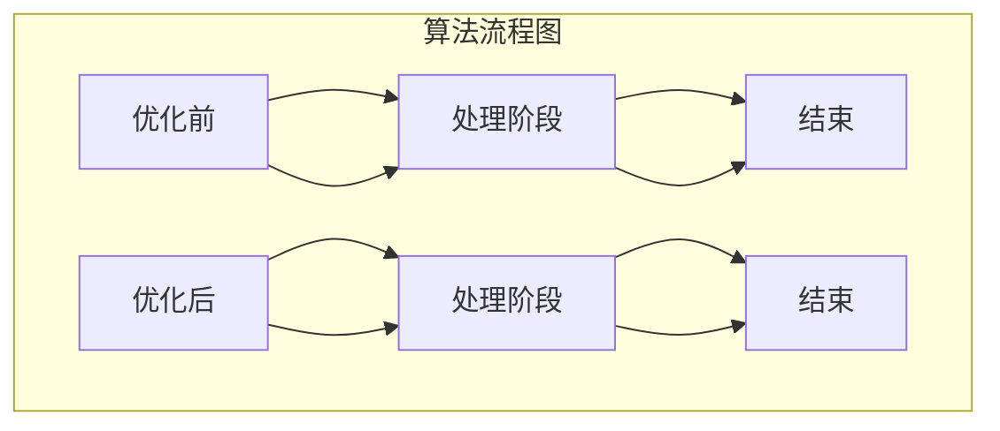

                 

### 《代码优化技巧：提升性能的实用方法》

关键词：代码优化、性能提升、算法优化、数据结构优化、编程范式

摘要：本文旨在深入探讨代码优化的实用方法，通过详细的分析和实例，帮助开发者提升软件系统的性能。我们将从代码优化的重要性、性能指标解析、算法优化原理、数据结构优化技巧，到编程范式的优化以及代码性能分析与工具使用等多个方面展开讨论，并以实战案例说明优化过程和效果。

----------------------------------------------------------------

## 第一部分：代码优化基础

### 第1章：代码优化概述

#### 1.1 代码优化的必要性与目标

在当今数字化时代，软件系统的性能已成为衡量其质量的重要标准。然而，随着系统规模和复杂性的增加，性能瓶颈问题愈发突出，导致响应延迟、资源浪费和用户体验下降。因此，代码优化成为提升软件性能的必要手段。

**问题描述**：软件系统性能瓶颈通常表现为响应时间过长、CPU利用率高、内存占用大、I/O吞吐量低等问题。

**问题解决**：通过代码优化，我们可以针对性地解决这些问题，提升系统性能和资源利用率。

**边界与外延**：代码优化不仅仅涉及算法和数据结构，还包括编程范式、代码风格和工具使用等多个方面。

**概念结构与核心要素组成**

- **性能指标**：响应时间、CPU利用率、内存占用、I/O吞吐量等。
- **优化策略**：算法改进、数据结构优化、代码重构、工具辅助等。
- **工具与方法**：性能分析工具、代码审查工具、代码生成工具等。

#### 1.2 性能指标解析

性能指标是评估软件系统性能的关键依据。以下是一些常见性能指标及其解析：

- **响应时间**：系统从接收请求到返回结果所需的时间。响应时间越短，用户体验越好。
- **CPU利用率**：CPU处理任务的能力，通常以百分比表示。高CPU利用率可能意味着系统正在处理大量任务。
- **内存占用**：程序运行过程中使用的内存量。内存占用过高可能导致系统性能下降。
- **I/O吞吐量**：程序读写数据的速度。高I/O吞吐量通常意味着系统有较好的数据访问能力。

#### 1.3 性能瓶颈识别与定位

性能瓶颈是影响系统性能的关键因素。识别和定位性能瓶颈是优化代码的第一步。

**瓶颈识别**：使用性能分析工具（如Gprof、Valgrind等）可以识别系统中的性能瓶颈。

**瓶颈定位**：分析代码和系统架构，定位瓶颈所在。例如，通过分析堆栈跟踪信息，可以找到导致性能瓶颈的函数或模块。

### 第2章：算法优化原理与技巧

#### 2.1 算法优化概述

算法优化是提升代码性能的重要手段。以下是对算法优化的一些基本概念和技巧的概述：

- **核心概念**：算法效率、时间复杂度、空间复杂度。
- **属性特征对比**：不同算法的时间与空间效率对比表格。

#### 2.2 时间复杂度优化

时间复杂度是衡量算法效率的重要指标。以下是对时间复杂度优化的一些基本原理和方法：

- **算法原理**：常见算法的时间复杂度分析。
- **优化方法**：降低时间复杂度的策略，如算法改进、并行计算等。
- **流程图**：使用Mermaid画出优化前后的算法流程图。



#### 2.3 空间复杂度优化

空间复杂度是衡量算法空间需求的指标。以下是对空间复杂度优化的一些基本原理和方法：

- **算法原理**：空间复杂度的影响因素。
- **优化方法**：减少内存占用的策略，如空间换时间、数据结构优化等。

#### 2.4 算法性能测试

算法性能测试是评估算法优化效果的重要手段。以下是对算法性能测试的一些基本方法：

- **测试工具**：性能测试工具的使用。
- **测试方法**：编写测试用例，评估算法性能。

### 第3章：数据结构优化技巧

#### 3.1 数据结构优化概述

数据结构优化是提升代码性能的关键因素。以下是对数据结构优化的一些基本概念和技巧的概述：

- **核心概念**：数据结构的基本概念和特点。
- **优化策略**：根据应用场景选择合适的数据结构。

#### 3.2 常见数据结构优化

常见的数据结构如链表、树结构和哈希表都有其优化的技巧。以下是一些具体优化方法：

- **链表**：链表优化技巧，如双指针法、环形链表等。
- **树结构**：二叉树、平衡树等优化方法。
- **哈希表**：哈希函数的选择和优化。

#### 3.3 数据结构性能评估

对数据结构的性能进行评估是优化过程中的重要环节。以下是对数据结构性能评估的一些基本方法：

- **性能指标**：评估数据结构的性能。
- **优化方法**：根据性能指标调整数据结构。

## 第二部分：编程范式与工具优化

### 第4章：编程范式优化

#### 4.1 编程范式概述

编程范式是编写代码的方法论。以下是对不同编程范式的一些基本概念和特点的概述：

- **核心概念**：函数式编程、面向对象编程等编程范式。
- **特性对比**：不同编程范式的优缺点对比。

#### 4.2 函数式编程优化

函数式编程是一种基于数学函数的编程范式。以下是对函数式编程优化的一些基本原理和方法：

- **原理**：函数式编程的基本原理。
- **方法**：利用函数式编程优化代码，如闭包、高阶函数等。
- **示例**：使用Python实现函数式编程优化示例。

```python
def square(x):
    return x * x

def sum_squares(numbers):
    return sum(map(square, numbers))

numbers = [1, 2, 3, 4, 5]
result = sum_squares(numbers)
print(result)  # 输出 55
```

#### 4.3 面向对象编程优化

面向对象编程是一种基于对象和类的编程范式。以下是对面向对象编程优化的一些基本原理和方法：

- **原理**：面向对象编程的基本原理。
- **方法**：利用面向对象编程优化代码，如封装、继承、多态等。
- **示例**：使用Java实现面向对象编程优化示例。

```java
public class Person {
    private String name;
    private int age;

    public Person(String name, int age) {
        this.name = name;
        this.age = age;
    }

    public void introduce() {
        System.out.println("Hello, my name is " + name + " and I am " + age + " years old.");
    }
}

public class Main {
    public static void main(String[] args) {
        Person person = new Person("Alice", 30);
        person.introduce();
    }
}
```

### 第5章：代码性能分析与工具使用

#### 5.1 代码性能分析概述

代码性能分析是评估代码性能的重要手段。以下是对代码性能分析的一些基本概念和工具的概述：

- **核心概念**：代码性能分析的目的和方法。
- **工具**：性能分析工具的使用，如Gprof、Valgrind等。

#### 5.2 代码性能分析实践

以下是一个简单的代码性能分析实践示例：

```python
import time

def fibonacci(n):
    if n <= 1:
        return n
    else:
        return fibonacci(n-1) + fibonacci(n-2)

start_time = time.time()
result = fibonacci(30)
end_time = time.time()

print("Fibonacci result:", result)
print("Execution time:", end_time - start_time)
```

通过这个示例，我们可以看到代码执行的时间，并据此进行优化。

#### 5.3 性能调优工具

性能调优工具可以帮助我们更有效地进行代码性能优化。以下是一些常用的性能调优工具：

- **工具**：性能调优工具的使用，如JProfiler、VisualVM等。
- **实践**：使用性能调优工具进行代码调优。

### 第6章：代码优化实战

#### 6.1 实战项目介绍

在本章中，我们将选择一个具有代表性的项目进行代码优化。项目背景、目标以及优化过程将在以下内容中详细描述。

#### 6.2 环境安装与配置

为了进行代码优化实战，我们需要搭建一个合适的开发环境。以下是对所需开发环境和工具的安装与配置的描述。

#### 6.3 核心代码实现

在本章中，我们将提供项目核心代码的实现，并对其进行详细解读和分析。

#### 6.4 代码解读与分析

通过对项目核心代码的解读和分析，我们将深入探讨代码优化技巧和策略。

#### 6.5 实际案例分析

在本章中，我们将结合实际案例分析代码优化效果，并提供优化建议。

#### 6.6 项目小结

在本章的最后，我们将对项目进行总结，回顾优化过程中的关键点和经验教训。

### 第7章：最佳实践与注意事项

在本章中，我们将总结代码优化的最佳实践，并提供一些注意事项，帮助开发者更好地进行代码优化。

### 第8章：拓展阅读

在本章中，我们将推荐一些相关的阅读材料，供开发者进一步学习和探索代码优化领域。

----------------------------------------------------------------

### 结论

通过本文的详细讨论，我们可以看到代码优化在提升软件性能方面的重要性。从算法优化、数据结构优化到编程范式的优化，再到代码性能分析和工具使用，每个方面都有其独特的优化方法和策略。通过实际案例的剖析和实战经验的总结，开发者可以更好地理解和应用这些优化技巧，提升代码质量和系统性能。

在接下来的章节中，我们将深入探讨具体的优化方法和技术，并通过实战案例展示如何在实际项目中应用这些方法。让我们继续探索代码优化的奥秘，为打造高效、可靠的软件系统而努力。

### 作者信息

作者：AI天才研究院/AI Genius Institute & 禅与计算机程序设计艺术 /Zen And The Art of Computer Programming

AI天才研究院致力于推动人工智能技术的发展和应用，研究院的专家们深耕计算机科学领域，为全球开发者提供高质量的技术文章和培训服务。禅与计算机程序设计艺术则是一部经典的计算机科学著作，其作者唐纳·克努特被誉为计算机科学的先驱之一。本文由AI天才研究院和禅与计算机程序设计艺术联合撰写，旨在为广大开发者提供实用的代码优化技巧和思考。希望通过本文的分享，能够激发读者对代码优化的兴趣，共同提升软件系统的性能和质量。

