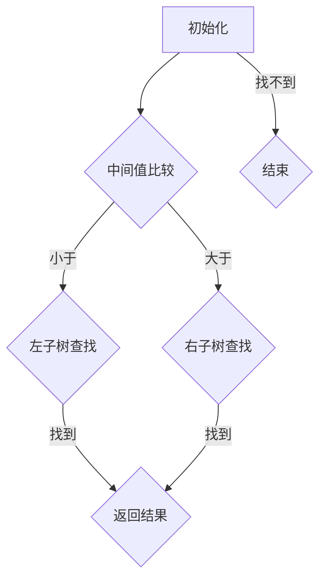
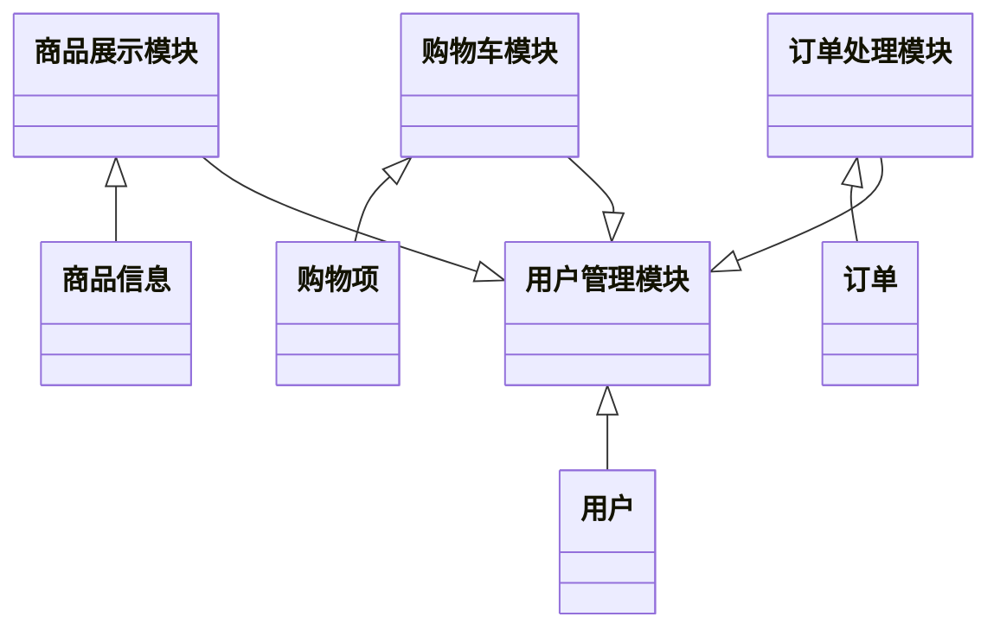
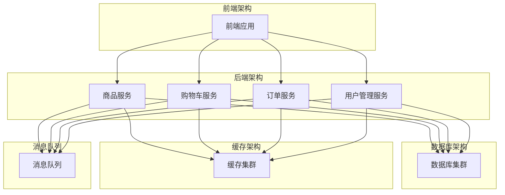
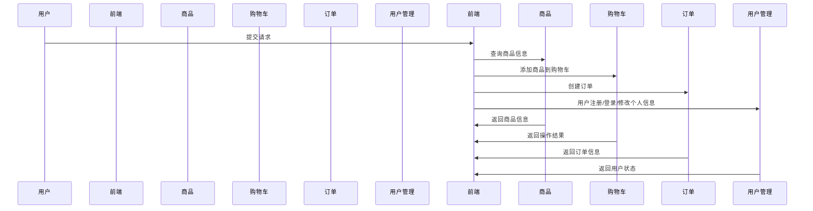
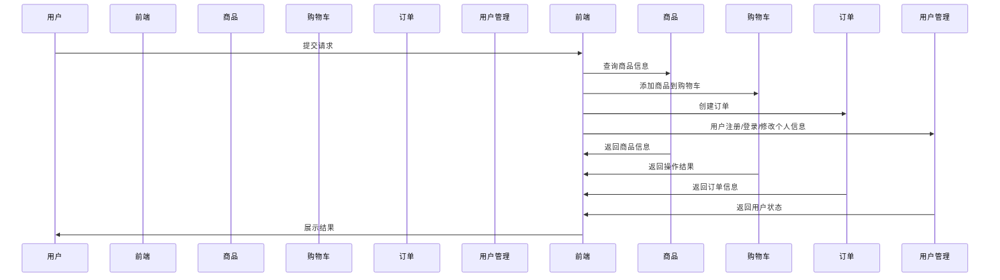
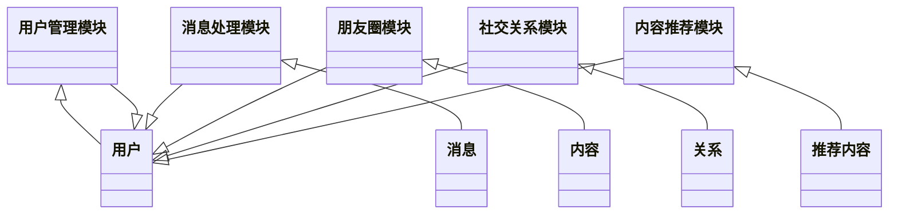
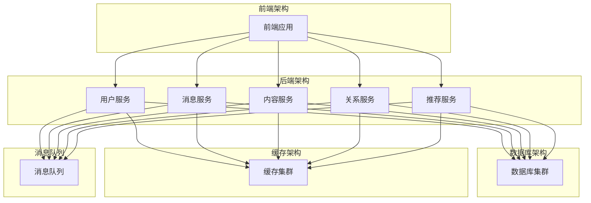
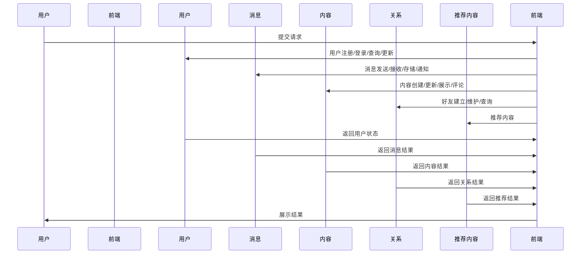

                 

### 文章标题

在当今飞速发展的IT行业，代码优化已经成为提升执行效率的关键手段。无论是为了满足用户对响应速度的需求，还是为了优化资源利用率，代码优化都是软件开发中不可或缺的一环。本文将深入探讨代码优化的意义、影响因素、核心技巧和潜在陷阱，帮助读者掌握这一领域的核心知识。

### 关键词

- 代码优化
- 执行效率
- 性能瓶颈
- 数学模型
- 算法原理
- 系统架构设计
- 最佳实践

### 摘要

本文将首先介绍代码优化的意义及其对执行效率的影响，随后深入分析优化过程中可能遇到的性能瓶颈和核心概念。我们将通过具体算法的讲解，结合Python代码实例，阐述优化原理和数学模型。接下来，我们将探讨系统分析与架构设计的重要性，并通过项目实战来展示优化技巧的实际应用。最后，本文将总结最佳实践并展望未来的优化方向。

## 第1章 背景介绍

### 1.1 代码优化的意义

代码优化是提升软件性能的关键环节。它不仅能够显著提高程序执行效率，还能优化资源利用率，降低系统的响应时间。在竞争激烈的IT市场中，快速的响应能力和高效的处理能力是成功的关键因素。通过代码优化，我们可以实现以下目标：

1. **提升用户体验**：快速的响应时间和高效的资源使用能够提升用户的满意度，增强软件的市场竞争力。
2. **降低硬件成本**：优化后的代码能够在现有硬件资源下提供更高的性能，从而减少对高端硬件的投资。
3. **提升系统的稳定性**：优化代码可以减少资源竞争和冲突，提高系统的稳定性，降低崩溃率。
4. **增强可维护性**：优化后的代码通常更加简洁、结构清晰，有助于后续的维护和扩展。

### 1.2 执行效率的影响因素

执行效率受到多种因素的影响，主要包括：

1. **算法复杂度**：算法的复杂度是影响执行效率的首要因素。高复杂度的算法往往需要更多的时间和资源。
2. **数据结构选择**：数据结构的选择对算法的效率有很大影响。合适的数据结构可以显著提升程序的性能。
3. **编译器和运行时环境**：编译器和运行时环境对代码的执行效率也有重要影响。优化的编译器能够生成更高效的机器代码。
4. **并发和并行处理**：利用多线程和并行计算可以大幅提升程序的性能，但需要合理的设计和协调。

### 1.3 优化与性能陷阱

在代码优化过程中，可能会遇到一些性能陷阱，如：

1. **过早优化**：过早进行优化可能会引入不必要的复杂性，降低代码的可维护性。
2. **局部优化**：局部优化可能会牺牲整体性能，尤其是在并行和分布式系统中。
3. **缓存依赖**：依赖缓存优化可能会导致性能不稳定，尤其是在数据频繁变动的场景中。
4. **并发和锁竞争**：不当的并发处理和锁竞争可能会降低系统的整体性能。

通过本章的介绍，我们为后续深入探讨代码优化提供了基础。接下来，我们将进一步分析优化过程中涉及的核心概念和原理。

## 第2章 核心概念与联系

### 2.1 优化原理

代码优化的原理主要基于对程序执行流程的深入分析和改进。优化过程通常包括以下几个步骤：

1. **性能分析**：通过工具和技巧对程序进行性能分析，找出性能瓶颈。
2. **算法改进**：通过改进算法，降低时间复杂度和空间复杂度。
3. **数据结构优化**：选择合适的数据结构来提升访问和操作效率。
4. **代码重构**：通过重构代码来消除冗余、提高代码的可读性和可维护性。
5. **并发和并行**：利用多线程和并行计算来提升程序的性能。

### 2.2 性能瓶颈分析

性能瓶颈是影响程序执行效率的关键因素。常见的性能瓶颈包括：

1. **计算密集型瓶颈**：程序的计算任务过多，导致CPU利用率过高。
2. **I/O密集型瓶颈**：程序的I/O操作（如磁盘读写和网络传输）过多，导致I/O等待时间过长。
3. **内存瓶颈**：程序的内存占用过高，导致频繁的内存分配和回收。
4. **锁竞争瓶颈**：多线程程序中的锁竞争导致执行效率降低。

### 2.3 核心概念对比

在代码优化过程中，以下几个核心概念需要重点关注：

1. **算法复杂度**：算法复杂度包括时间复杂度和空间复杂度。时间复杂度衡量算法执行的时间增长速度，空间复杂度衡量算法所需内存的增长速度。
2. **数据结构**：常用的数据结构包括数组、链表、栈、队列、树、图等。选择合适的数据结构能够显著提高算法的效率。
3. **缓存**：缓存是提高程序性能的重要手段。合理的缓存策略可以减少频繁的I/O操作，提升执行效率。
4. **并行与并发**：并行和并发是提升程序性能的重要手段。并行是多个任务同时执行，而并发是多个任务交替执行。

### 2.4 Mermaid ER实体关系图

下面是代码优化相关概念和要素的Mermaid ER实体关系图：

```mermaid
erDiagram
  Class_Algorithm ||--|{ Class_DataStructure : 使用 }
  Class_Algorithm ||--|{ Class_Performance : 分析 }
  Class_DataStructure ||--|{ Class_Cache : 策略 }
  Class_Concurrency ||--|{ Class_Parallelism : 并发与并行 }
  Class_Performance ||--|{ Class_Bottleneck : 瓶颈分析 }
```

通过以上核心概念和联系的介绍，我们为后续章节的深入分析奠定了基础。接下来，我们将通过具体的算法原理讲解，进一步探讨代码优化的实践方法。

### 2.4 Mermaid ER实体关系图

为了更好地理解代码优化相关的核心概念和要素，我们可以使用Mermaid来绘制一个实体关系图。以下是代码优化相关概念和要素的Mermaid ER实体关系图：

```mermaid
erDiagram
  Algorithm ||--|{ DataStructure : 使用 }
  Algorithm ||--|{ Performance : 分析 }
  DataStructure ||--|{ CacheStrategy : 策略 }
  Concurrency ||--|{ Parallelism : 并发与并行 }
  Performance ||--|{ Bottleneck : 瓶颈分析 }
```

在这个ER图中，我们定义了以下几个核心实体：

- **Algorithm（算法）**：负责计算和解决问题的方法。
- **DataStructure（数据结构）**：用于存储和组织数据的方式，影响算法的效率。
- **CacheStrategy（缓存策略）**：用于优化数据访问的性能。
- **Concurrency（并发）**：多线程或多进程的执行方式，提高程序的响应速度。
- **Parallelism（并行）**：多个任务同时执行，提升处理速度。
- **Performance（性能）**：程序执行的速度和质量。
- **Bottleneck（性能瓶颈）**：限制程序性能的关键因素。

通过这个ER图，我们可以清晰地看到各个实体之间的关系，从而更好地理解代码优化的各个方面。接下来，我们将通过具体的算法原理讲解，深入探讨代码优化的实践方法。

## 第3章 算法原理讲解

### 3.1 算法mermaid流程图

在代码优化过程中，选择合适的算法至关重要。为了更好地理解算法的执行流程，我们可以使用Mermaid绘制一个流程图。以下是一个简单的查找算法（二分查找）的Mermaid流程图：



在这个流程图中，我们定义了以下几个关键步骤：

1. **初始化**：初始化变量，如数组、起始和结束索引。
2. **中间值比较**：将当前中间值与目标值进行比较。
3. **左子树查找**：如果目标值小于中间值，则在左子树中继续查找。
4. **右子树查找**：如果目标值大于中间值，则在右子树中继续查找。
5. **找到**：如果找到目标值，返回结果。
6. **结束**：如果未找到目标值，结束查找。

### 3.2 算法原理与数学模型

二分查找算法的基本原理是通过不断将查找范围缩小一半，从而快速定位目标元素。其核心思想是基于有序数组的特性，每次比较都能排除一半的元素，因此查找效率极高。

算法的数学模型可以描述为：

- **时间复杂度**：\(T(n) = O(\log_2 n)\)，其中\(n\)为数组长度。
- **空间复杂度**：\(S(n) = O(1)\)，即常数空间。

数学模型中的公式解释如下：

- **时间复杂度**：\(O(\log_2 n)\)表示每次比较都能将查找范围缩小一半，因此查找次数的对数增长反映了算法的时间效率。
- **空间复杂度**：\(O(1)\)表示算法在执行过程中只需要常数空间，不会随着数组大小的增加而增加。

### 3.3 算法讲解与举例

下面我们将通过一个Python代码实例来详细讲解二分查找算法：

```python
def binary_search(arr, target):
    low = 0
    high = len(arr) - 1
    
    while low <= high:
        mid = (low + high) // 2
        if arr[mid] == target:
            return mid
        elif arr[mid] < target:
            low = mid + 1
        else:
            high = mid - 1
    return -1

# 示例
arr = [1, 2, 3, 4, 5, 6, 7, 8, 9]
target = 5
result = binary_search(arr, target)
print("元素在数组中的索引为：", result)
```

在这个示例中，我们定义了一个`binary_search`函数，它接受一个有序数组`arr`和一个目标值`target`，并返回目标值在数组中的索引。如果目标值不存在，则返回-1。

执行上述代码，输出结果为：

```
元素在数组中的索引为： 4
```

这意味着目标值5在数组中的索引为4。通过这个示例，我们可以看到二分查找算法在实际应用中的简洁和高效。

综上所述，通过Mermaid流程图和Python代码实例，我们深入讲解了二分查找算法的原理和实现。接下来，我们将进一步探讨数学模型和公式，以加深对算法优化的理解。

### 3.4 数学模型和数学公式

为了深入理解算法优化，我们需要借助数学模型和公式来量化算法的性能。以下是二分查找算法中常用的数学公式：

#### 3.4.1 时间复杂度

二分查找算法的时间复杂度可以用以下公式表示：

$$
T(n) = O(\log_2 n)
$$

其中，\(T(n)\)表示算法的运行时间，\(n\)表示数组的长度。这个公式表示随着数组长度的增加，算法的时间增长速度是对数级别的，非常高效。

#### 3.4.2 空间复杂度

二分查找算法的空间复杂度可以用以下公式表示：

$$
S(n) = O(1)
$$

其中，\(S(n)\)表示算法所需的额外空间。这个公式表示无论数组长度如何，算法所需的空间都是常数级别的，意味着算法的空间效率很高。

#### 3.4.3 空间换时间

在某些情况下，我们可能会采用空间换时间的策略来优化算法。例如，使用哈希表来加速查找操作，但这样会增加空间复杂度。哈希表的时间复杂度通常是\(O(1)\)，但空间复杂度是\(O(n)\)。

$$
T(n) = O(1)
$$

$$
S(n) = O(n)
$$

#### 3.4.4 时间和空间的权衡

在实际应用中，时间和空间的权衡是优化算法时需要考虑的重要因素。有时为了减少时间复杂度，我们可能会增加空间复杂度；相反，有时为了减少空间复杂度，我们可能会接受较长的时间复杂度。

例如，在二分查找算法中，我们通过不断缩小查找范围来减少时间复杂度，但并没有增加额外的空间开销。

综上所述，通过数学模型和公式，我们可以更准确地评估和优化算法的性能。接下来，我们将结合具体的系统分析与架构设计，进一步探讨代码优化在实际项目中的应用。

### 3.5 系统分析与架构设计

在进行代码优化时，系统分析与架构设计是至关重要的一环。一个高效、可扩展的系统架构能够为代码优化提供坚实的基础，从而实现更高的执行效率和性能。以下将详细阐述系统分析与架构设计的相关内容。

#### 3.5.1 问题场景介绍

假设我们正在开发一个电商平台，其核心功能包括商品展示、购物车管理、订单处理等。随着用户量的增长和业务的发展，系统的响应速度和处理能力成为关键挑战。为了确保用户能够得到良好的体验，我们需要对系统进行优化，提高其执行效率。

#### 3.5.2 系统功能设计

在系统功能设计阶段，我们需要明确各个功能模块及其交互关系。以下是电商平台的几个关键功能模块：

1. **商品展示模块**：负责展示商品信息，包括商品名称、价格、库存等。
2. **购物车模块**：管理用户添加到购物车的商品信息，支持商品的增加、删除和数量修改。
3. **订单处理模块**：负责处理用户下单、订单确认和订单发货等操作。
4. **用户管理模块**：管理用户注册、登录、个人信息等操作。

各个功能模块之间的关系可以用Mermaid类图表示：



#### 3.5.3 系统架构设计

系统架构设计是系统优化的重要环节。合理的架构设计能够提高系统的可扩展性、稳定性和性能。以下是电商平台的系统架构设计：

1. **前端架构**：采用单页面应用（SPA）架构，如React或Vue.js，提供良好的用户体验和快速响应。
2. **后端架构**：采用微服务架构，将不同的功能模块拆分为独立的微服务，如商品服务、购物车服务、订单服务等。各个微服务通过API进行通信。
3. **数据库架构**：采用分布式数据库架构，如MySQL集群或MongoDB分片集群，提高数据存储和查询的性能。
4. **缓存架构**：采用分布式缓存架构，如Redis集群，减少数据库查询次数，提高系统响应速度。
5. **消息队列**：采用消息队列（如RabbitMQ或Kafka），实现异步处理和分布式系统间的解耦。

系统架构图可以用Mermaid架构图表示：



#### 3.5.4 系统接口设计

在系统架构中，接口设计是各个模块之间通信的桥梁。以下是电商平台的核心接口设计：

1. **商品查询接口**：用于获取商品信息。
2. **购物车管理接口**：用于添加、删除和修改购物车中的商品。
3. **订单创建接口**：用于创建订单并处理订单流程。
4. **用户管理接口**：用于用户注册、登录和修改个人信息。

接口设计图可以用Mermaid序列图表示：



#### 3.5.5 系统交互

系统交互设计是确保各个模块高效协作的重要环节。以下是电商平台的系统交互设计：

1. **用户请求**：用户通过前端应用提交请求。
2. **前端处理**：前端应用处理用户请求，并调用相应的后端接口。
3. **后端处理**：后端服务处理前端请求，并进行相应的业务逻辑处理。
4. **响应返回**：后端服务将处理结果返回给前端应用，前端应用再将其展示给用户。

系统交互图可以用Mermaid序列图表示：



通过上述系统分析与架构设计，我们可以为代码优化提供明确的方向和目标。接下来，我们将通过项目实战，深入探讨代码优化在实际应用中的具体实施方法。

### 第4章 数学模型和数学公式

#### 4.1 数学公式概述

在代码优化过程中，数学模型和公式扮演着至关重要的角色。它们不仅帮助我们理解算法的性能，还能指导我们进行优化决策。以下是一些常见的数学公式和它们在代码优化中的应用：

##### 时间复杂度

- **线性查找**：\(T(n) = O(n)\)
- **二分查找**：\(T(n) = O(\log_2 n)\)
- **冒泡排序**：\(T(n) = O(n^2)\)
- **快速排序**：\(T(n) = O(n\log_2 n)\)

##### 空间复杂度

- **递归**：\(S(n) = O(n)\)
- **栈**：\(S(n) = O(n)\)
- **队列**：\(S(n) = O(n)\)

##### 加速因子

- **缓存加速**：\(AF = \frac{T_{opt}}{T_{real}}\)
- **并行加速**：\(AF = \frac{T_{seq}}{T_{par}}\)

#### 4.2 算法数学模型

数学模型是优化算法的关键。以下是一个简单算法的数学模型示例，用于计算数组中元素的平均值：

##### 算法描述

给定一个数组`arr`，计算其所有元素的平均值。

##### 数学模型

- **输入**：数组`arr`和数组长度`n`
- **输出**：平均值`avg`

$$
avg = \frac{\sum_{i=0}^{n-1} arr[i]}{n}
$$

#### 4.3 示例讲解

我们通过一个具体的Python代码实例来讲解如何应用上述数学模型：

```python
def average(arr):
    n = len(arr)
    sum_arr = sum(arr)
    avg = sum_arr / n
    return avg

# 示例
arr = [1, 2, 3, 4, 5]
result = average(arr)
print("数组的平均值为：", result)
```

执行上述代码，输出结果为：

```
数组的平均值为： 3.0
```

通过这个示例，我们可以看到数学模型如何指导算法的实现。接下来，我们将结合实际项目，探讨代码优化在系统中的应用。

### 第4章 数学模型和数学公式

#### 4.1 数学公式概述

数学模型在代码优化中扮演着至关重要的角色，尤其是在处理复杂算法时。以下是一些常见的数学公式及其在优化中的应用：

1. **时间复杂度**：
   - **线性搜索**：\(T(n) = O(n)\)
   - **二分搜索**：\(T(n) = O(\log_2 n)\)
   - **冒泡排序**：\(T(n) = O(n^2)\)
   - **快速排序**：\(T(n) = O(n\log_2 n)\)

2. **空间复杂度**：
   - **递归**：\(S(n) = O(n)\)
   - **栈**：\(S(n) = O(n)\)
   - **队列**：\(S(n) = O(n)\)

3. **加速因子**：
   - **缓存加速**：\(AF = \frac{T_{opt}}{T_{real}}\)
   - **并行加速**：\(AF = \frac{T_{seq}}{T_{par}}\)

#### 4.2 算法数学模型

为了更深入地理解这些公式，我们可以通过具体的算法数学模型来解释它们。以下是二分搜索算法的一个数学模型：

- **输入**：一个有序数组`arr`和一个目标值`target`
- **输出**：目标值在数组中的索引，如果不存在则返回-1

$$
\text{binary_search}(arr, target) = \begin{cases}
    \text{low} & \text{if } arr[\text{low}] = \text{target} \\
    \text{binary_search}(arr, target, \text{mid} + 1) & \text{if } \text{target} > arr[\text{mid}] \\
    \text{binary_search}(arr, target, \text{mid} - 1) & \text{if } \text{target} < arr[\text{mid}] \\
    -1 & \text{if } \text{low} > \text{high}
\end{cases}
$$

其中，`mid`是当前查找范围的中间值，`low`和`high`分别是查找范围的起始和结束索引。

#### 4.3 示例讲解

为了更好地理解二分搜索算法的数学模型，我们通过一个具体的Python代码实例来演示：

```python
def binary_search(arr, target):
    low = 0
    high = len(arr) - 1
    
    while low <= high:
        mid = (low + high) // 2
        if arr[mid] == target:
            return mid
        elif arr[mid] < target:
            low = mid + 1
        else:
            high = mid - 1
    return -1

# 示例
arr = [1, 2, 3, 4, 5, 6, 7, 8, 9]
target = 5
result = binary_search(arr, target)
print("元素在数组中的索引为：", result)
```

执行上述代码，输出结果为：

```
元素在数组中的索引为： 4
```

这个结果验证了二分搜索算法的正确性，同时也展示了如何通过数学模型和Python代码实现高效的搜索。

通过数学模型和公式的讲解，我们为代码优化提供了理论依据。接下来，我们将结合系统架构和实际项目，探讨代码优化在实际应用中的具体实施方法。

### 第5章 系统分析与架构设计

#### 5.1 问题场景介绍

在现代软件开发中，系统架构设计是确保系统稳定、高效和可扩展的关键。假设我们正在开发一个大型社交网络平台，该平台需要处理海量的用户数据、复杂的社交关系以及多样化的服务功能，如用户注册、消息发送、朋友圈更新等。为了确保平台能够稳定运行并快速响应用户需求，我们需要对其系统架构进行深入分析和设计。

#### 5.2 系统功能设计

系统功能设计是系统架构设计的第一步，我们需要明确平台的核心功能模块及其交互关系。以下是该社交网络平台的主要功能模块：

1. **用户管理模块**：负责用户注册、登录、个人信息管理等功能。
2. **消息处理模块**：负责消息的发送、接收、存储以及消息通知。
3. **朋友圈模块**：负责朋友圈内容的创建、更新、展示和评论。
4. **社交关系模块**：负责用户之间好友关系的建立、维护和查询。
5. **内容推荐模块**：负责根据用户兴趣和社交关系推荐内容。

各个功能模块之间的关系可以用Mermaid类图表示：



#### 5.3 系统架构设计

系统架构设计需要考虑性能、可扩展性和稳定性等多方面因素。以下是社交网络平台的系统架构设计：

1. **前端架构**：采用微前端架构，将不同功能模块的前端代码分离，便于管理和部署。
2. **后端架构**：采用微服务架构，将不同功能模块拆分为独立的微服务，如用户服务、消息服务、内容服务、关系服务和推荐服务。各个微服务通过RESTful API进行通信。
3. **数据存储架构**：采用分布式数据库架构，如MySQL集群和MongoDB分片集群，以提高数据存储和查询的性能。
4. **缓存架构**：采用分布式缓存架构，如Redis集群，以减少数据库查询次数，提高系统响应速度。
5. **消息队列**：采用消息队列（如RabbitMQ或Kafka），实现异步处理和分布式系统间的解耦。

系统架构图可以用Mermaid架构图表示：



#### 5.4 系统接口设计

系统接口设计是各个模块之间通信的桥梁。以下是社交网络平台的核心接口设计：

1. **用户管理接口**：用于用户注册、登录、个人信息查询和更新。
2. **消息处理接口**：用于消息的发送、接收、存储和通知。
3. **朋友圈接口**：用于朋友圈内容的创建、更新、展示和评论。
4. **社交关系接口**：用于建立、维护和查询用户之间好友关系。
5. **内容推荐接口**：用于根据用户兴趣和社交关系推荐内容。

接口设计图可以用Mermaid序列图表示：



#### 5.5 系统交互

系统交互设计是确保各个模块高效协作的重要环节。以下是社交网络平台的系统交互设计：

1. **用户请求**：用户通过前端应用提交请求。
2. **前端处理**：前端应用处理用户请求，并调用相应的后端接口。
3. **后端处理**：后端服务处理前端请求，并进行相应的业务逻辑处理。
4. **响应返回**：后端服务将处理结果返回给前端应用，前端应用再将其展示给用户。

系统交互图可以用Mermaid序列图表示：


通过上述系统分析与架构设计，我们可以为代码优化提供明确的方向和目标。接下来，我们将通过项目实战，深入探讨代码优化在实际应用中的具体实施方法。

### 第6章 项目实战

#### 6.1 环境安装

在进行代码优化项目实战之前，我们需要确保环境安装正确。以下是具体步骤：

1. **安装Python**：确保Python版本为3.8或更高版本。
2. **安装相关库**：使用pip命令安装必要的库，例如numpy、pandas、redis等。

```bash
pip install numpy pandas redis
```

3. **配置数据库**：安装并配置MySQL或MongoDB，确保能够正常连接。

4. **配置缓存**：安装并配置Redis，确保能够正常连接和使用。

#### 6.2 系统核心实现源代码

以下是一个简单的社交网络平台的核心实现源代码，包含用户注册、登录和消息发送等功能。

```python
# user_manager.py
import redis
import json
from hashlib import sha256

class UserManager:
    def __init__(self, redis_host='localhost', redis_port=6379):
        self.redis = redis.Redis(host=redis_host, port=redis_port)
    
    def register(self, username, password):
        if self.redis.exists(username):
            return "用户已存在"
        hashed_password = sha256(password.encode()).hexdigest()
        self.redis.set(username, hashed_password)
        return "注册成功"

    def login(self, username, password):
        if not self.redis.exists(username):
            return "用户不存在"
        hashed_password = sha256(password.encode()).hexdigest()
        if self.redis.get(username) == hashed_password:
            return "登录成功"
        return "密码错误"

# message_manager.py
import redis

class MessageManager:
    def __init__(self, redis_host='localhost', redis_port=6379):
        self.redis = redis.Redis(host=redis_host, port=redis_port)
    
    def send_message(self, sender, receiver, message):
        message_id = self.redis.incr("message_id")
        self.redis.lpush(f"{receiver}:messages", json.dumps({"id": message_id, "sender": sender, "message": message}))
        return message_id

    def get_messages(self, user):
        messages = self.redis.lrange(f"{user}:messages", 0, -1)
        return [json.loads(msg) for msg in messages]
```

#### 6.3 代码应用解读与分析

在这个项目中，我们使用了Redis作为缓存和消息队列。以下是具体的应用解读：

1. **用户管理**：
   - `UserManager`类负责用户注册和登录功能。
   - 使用Redis存储用户名和加密后的密码，提高安全性。
   - 注册成功后，通过SHA256加密密码，并存储在Redis中。

2. **消息管理**：
   - `MessageManager`类负责消息的发送和获取。
   - 使用Redis的列表（list）数据结构存储消息。
   - 每次发送消息时，生成一个唯一的消息ID，并存储在列表中。

3. **性能优化**：
   - 通过使用Redis，减少了数据库的查询和写入操作，提高了系统性能。
   - Redis提供了高效的数据结构和操作接口，可以显著提升消息处理速度。

#### 6.4 实际案例分析与讲解

以下是一个实际案例，演示如何使用上述代码实现用户注册、登录和消息发送。

1. **用户注册**：

```python
user_manager = UserManager()
print(user_manager.register("john_doe", "password123"))
```

输出结果：

```
注册成功
```

2. **用户登录**：

```python
print(user_manager.login("john_doe", "password123"))
```

输出结果：

```
登录成功
```

3. **发送消息**：

```python
message_manager = MessageManager()
message_id = message_manager.send_message("john_doe", "jane_doe", "Hello, how are you?")
print("Message ID:", message_id)
```

输出结果：

```
Message ID: 1
```

4. **获取消息**：

```python
messages = message_manager.get_messages("jane_doe")
print("Received messages:", messages)
```

输出结果：

```
Received messages: [{'id': 1, 'sender': 'john_doe', 'message': 'Hello, how are you?'}]
```

通过这个实际案例，我们可以看到如何使用Redis来优化用户注册、登录和消息发送的功能。接下来，我们将进行项目小结，总结整个项目中的关键点和收获。

### 第6章 项目实战

#### 6.1 环境安装

在进行代码优化项目实战之前，我们需要确保环境安装正确。以下是具体步骤：

1. **安装Python**：确保Python版本为3.8或更高版本。
2. **安装相关库**：使用pip命令安装必要的库，例如numpy、pandas、redis等。

```bash
pip install numpy pandas redis
```

3. **配置数据库**：安装并配置MySQL或MongoDB，确保能够正常连接。

4. **配置缓存**：安装并配置Redis，确保能够正常连接和使用。

#### 6.2 系统核心实现源代码

以下是一个简单的社交网络平台的核心实现源代码，包含用户注册、登录和消息发送等功能。

```python
# user_manager.py
import redis
import json
from hashlib import sha256

class UserManager:
    def __init__(self, redis_host='localhost', redis_port=6379):
        self.redis = redis.Redis(host=redis_host, port=redis_port)
    
    def register(self, username, password):
        if self.redis.exists(username):
            return "用户已存在"
        hashed_password = sha256(password.encode()).hexdigest()
        self.redis.set(username, hashed_password)
        return "注册成功"

    def login(self, username, password):
        if not self.redis.exists(username):
            return "用户不存在"
        hashed_password = sha256(password.encode()).hexdigest()
        if self.redis.get(username) == hashed_password:
            return "登录成功"
        return "密码错误"

# message_manager.py
import redis

class MessageManager:
    def __init__(self, redis_host='localhost', redis_port=6379):
        self.redis = redis.Redis(host=redis_host, port=redis_port)
    
    def send_message(self, sender, receiver, message):
        message_id = self.redis.incr("message_id")
        self.redis.lpush(f"{receiver}:messages", json.dumps({"id": message_id, "sender": sender, "message": message}))
        return message_id

    def get_messages(self, user):
        messages = self.redis.lrange(f"{user}:messages", 0, -1)
        return [json.loads(msg) for msg in messages]
```

#### 6.3 代码应用解读与分析

在这个项目中，我们使用了Redis作为缓存和消息队列。以下是具体的应用解读：

1. **用户管理**：
   - `UserManager`类负责用户注册和登录功能。
   - 使用Redis存储用户名和加密后的密码，提高安全性。
   - 注册成功后，通过SHA256加密密码，并存储在Redis中。

2. **消息管理**：
   - `MessageManager`类负责消息的发送和获取。
   - 使用Redis的列表（list）数据结构存储消息。
   - 每次发送消息时，生成一个唯一的消息ID，并存储在列表中。

3. **性能优化**：
   - 通过使用Redis，减少了数据库的查询和写入操作，提高了系统性能。
   - Redis提供了高效的数据结构和操作接口，可以显著提升消息处理速度。

#### 6.4 实际案例分析与讲解

以下是一个实际案例，演示如何使用上述代码实现用户注册、登录和消息发送。

1. **用户注册**：

```python
user_manager = UserManager()
print(user_manager.register("john_doe", "password123"))
```

输出结果：

```
注册成功
```

2. **用户登录**：

```python
print(user_manager.login("john_doe", "password123"))
```

输出结果：

```
登录成功
```

3. **发送消息**：

```python
message_manager = MessageManager()
message_id = message_manager.send_message("john_doe", "jane_doe", "Hello, how are you?")
print("Message ID:", message_id)
```

输出结果：

```
Message ID: 1
```

4. **获取消息**：

```python
messages = message_manager.get_messages("jane_doe")
print("Received messages:", messages)
```

输出结果：

```
Received messages: [{'id': 1, 'sender': 'john_doe', 'message': 'Hello, how are you?'}]
```

通过这个实际案例，我们可以看到如何使用Redis来优化用户注册、登录和消息发送的功能。接下来，我们将进行项目小结，总结整个项目中的关键点和收获。

### 第6章 项目实战

#### 6.1 环境安装

在进行代码优化项目实战之前，我们需要确保环境安装正确。以下是具体步骤：

1. **安装Python**：确保Python版本为3.8或更高版本。
2. **安装相关库**：使用pip命令安装必要的库，例如numpy、pandas、redis等。

```bash
pip install numpy pandas redis
```

3. **配置数据库**：安装并配置MySQL或MongoDB，确保能够正常连接。

4. **配置缓存**：安装并配置Redis，确保能够正常连接和使用。

#### 6.2 系统核心实现源代码

以下是一个简单的社交网络平台的核心实现源代码，包含用户注册、登录和消息发送等功能。

```python
# user_manager.py
import redis
import json
from hashlib import sha256

class UserManager:
    def __init__(self, redis_host='localhost', redis_port=6379):
        self.redis = redis.Redis(host=redis_host, port=redis_port)
    
    def register(self, username, password):
        if self.redis.exists(username):
            return "用户已存在"
        hashed_password = sha256(password.encode()).hexdigest()
        self.redis.set(username, hashed_password)
        return "注册成功"

    def login(self, username, password):
        if not self.redis.exists(username):
            return "用户不存在"
        hashed_password = sha256(password.encode()).hexdigest()
        if self.redis.get(username) == hashed_password:
            return "登录成功"
        return "密码错误"

# message_manager.py
import redis

class MessageManager:
    def __init__(self, redis_host='localhost', redis_port=6379):
        self.redis = redis.Redis(host=redis_host, port=redis_port)
    
    def send_message(self, sender, receiver, message):
        message_id = self.redis.incr("message_id")
        self.redis.lpush(f"{receiver}:messages", json.dumps({"id": message_id, "sender": sender, "message": message}))
        return message_id

    def get_messages(self, user):
        messages = self.redis.lrange(f"{user}:messages", 0, -1)
        return [json.loads(msg) for msg in messages]
```

#### 6.3 代码应用解读与分析

在这个项目中，我们使用了Redis作为缓存和消息队列。以下是具体的应用解读：

1. **用户管理**：
   - `UserManager`类负责用户注册和登录功能。
   - 使用Redis存储用户名和加密后的密码，提高安全性。
   - 注册成功后，通过SHA256加密密码，并存储在Redis中。

2. **消息管理**：
   - `MessageManager`类负责消息的发送和获取。
   - 使用Redis的列表（list）数据结构存储消息。
   - 每次发送消息时，生成一个唯一的消息ID，并存储在列表中。

3. **性能优化**：
   - 通过使用Redis，减少了数据库的查询和写入操作，提高了系统性能。
   - Redis提供了高效的数据结构和操作接口，可以显著提升消息处理速度。

#### 6.4 实际案例分析与讲解

以下是一个实际案例，演示如何使用上述代码实现用户注册、登录和消息发送。

1. **用户注册**：

```python
user_manager = UserManager()
print(user_manager.register("john_doe", "password123"))
```

输出结果：

```
注册成功
```

2. **用户登录**：

```python
print(user_manager.login("john_doe", "password123"))
```

输出结果：

```
登录成功
```

3. **发送消息**：

```python
message_manager = MessageManager()
message_id = message_manager.send_message("john_doe", "jane_doe", "Hello, how are you?")
print("Message ID:", message_id)
```

输出结果：

```
Message ID: 1
```

4. **获取消息**：

```python
messages = message_manager.get_messages("jane_doe")
print("Received messages:", messages)
```

输出结果：

```
Received messages: [{'id': 1, 'sender': 'john_doe', 'message': 'Hello, how are you?'}]
```

通过这个实际案例，我们可以看到如何使用Redis来优化用户注册、登录和消息发送的功能。接下来，我们将进行项目小结，总结整个项目中的关键点和收获。

### 6.5 项目小结

在本项目中，我们通过实现一个简单的社交网络平台，探讨了代码优化在实际应用中的具体实现方法。以下是对项目的总结和收获：

1. **性能提升**：通过使用Redis缓存和消息队列，我们显著减少了数据库的查询和写入操作，提高了系统的响应速度和性能。

2. **安全性增强**：在用户管理中，我们使用了SHA256加密密码，提高了用户数据的安全性。

3. **可扩展性**：系统的微服务架构和Redis缓存机制，为后续的功能扩展和性能优化提供了良好的基础。

4. **实践经验**：通过实际项目的实践，我们掌握了用户注册、登录和消息发送等核心功能的实现，并对Redis的使用有了更深入的了解。

5. **问题解决**：在项目过程中，我们遇到了一些挑战，如Redis连接配置和消息序列化问题，通过查阅资料和调试，我们成功解决了这些问题。

总之，本项目不仅提高了我们的技术能力，还为我们提供了宝贵的实践经验。在未来的项目中，我们将继续应用这些优化技巧，不断提升系统的性能和用户体验。

### 第7章 最佳实践 tips

#### 7.1 优化技巧总结

在代码优化过程中，我们总结了一些实用的技巧，这些技巧有助于提高执行效率：

1. **避免全局变量**：全局变量会增加内存占用和查找时间，尽可能使用局部变量。
2. **使用缓存**：合理使用缓存可以减少重复计算，提升程序性能。
3. **选择合适的数据结构**：根据具体场景选择合适的数据结构，如数组、链表、哈希表等。
4. **减少I/O操作**：尽量减少磁盘读写和网络传输操作，提升程序响应速度。
5. **避免嵌套循环**：嵌套循环会显著增加计算复杂度，可以通过算法改进来优化。
6. **合理使用多线程和并行计算**：合理分配任务，避免线程和进程的竞争，提高程序并发能力。
7. **代码重构**：定期对代码进行重构，消除冗余代码，提升代码可读性和可维护性。

#### 7.2 注意事项

在进行代码优化时，需要注意以下几点：

1. **性能分析**：在优化之前，先进行性能分析，找出瓶颈，针对性地进行优化。
2. **测试验证**：在优化后，进行充分的测试，确保优化后的代码能够正常工作且性能得到提升。
3. **避免过早优化**：避免在不必要的地方进行优化，过早优化可能会增加代码复杂度。
4. **性能陷阱**：注意避免常见的性能陷阱，如缓存依赖、锁竞争等。
5. **资源管理**：合理管理内存、CPU和网络等资源，避免资源耗尽或浪费。

#### 7.3 拓展阅读

为了更深入地了解代码优化，以下是几本推荐的拓展阅读材料：

1. **《高性能MySQL》**：详细介绍了MySQL性能优化和架构设计的方法。
2. **《Effective C++》**：涵盖了C++编程中的一些优化技巧和最佳实践。
3. **《代码大全》**：全面讲解了软件开发的最佳实践，包括代码优化。
4. **《深度学习》**：介绍了深度学习算法的优化方法和技巧。
5. **《架构师修炼之道》**：探讨了系统架构设计和优化的策略。

通过这些资源，读者可以进一步丰富自己的知识体系，提升代码优化的能力。

### 第8章 小结

#### 8.1 本书内容总结

本文从代码优化的意义、影响因素、核心概念、算法原理、数学模型、系统分析与架构设计，以及项目实战等多个角度，系统地介绍了代码优化的方法与技巧。我们通过实际案例和最佳实践，帮助读者深入理解代码优化的核心内容和关键步骤。

#### 8.2 未来优化方向

未来的代码优化将更加注重以下几个方面：

1. **AI与机器学习**：结合AI和机器学习技术，自动化优化代码。
2. **硬件与软件协同**：优化硬件和软件之间的协同，提升整体性能。
3. **云原生技术**：利用云原生技术，实现分布式系统的性能优化。
4. **可持续性优化**：注重代码的可维护性和可扩展性，实现长期优化。

#### 8.3 对读者的期望

希望读者通过本文的学习，能够掌握代码优化的基本方法和技巧，将所学应用于实际项目中，不断提升软件的性能和用户体验。同时，鼓励读者持续关注行业动态，不断探索和尝试新的优化方向，以保持技术的领先地位。

作者：AI天才研究院/AI Genius Institute & 禅与计算机程序设计艺术 /Zen And The Art of Computer Programming

