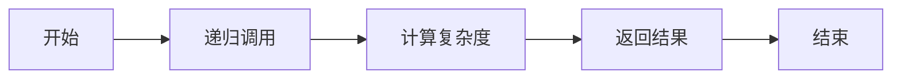
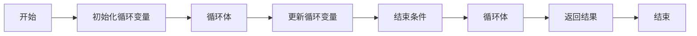
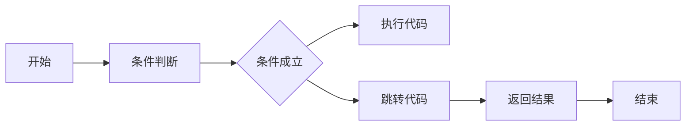
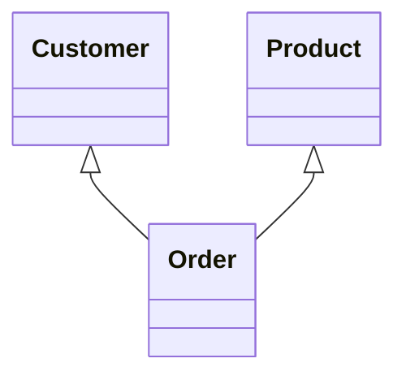
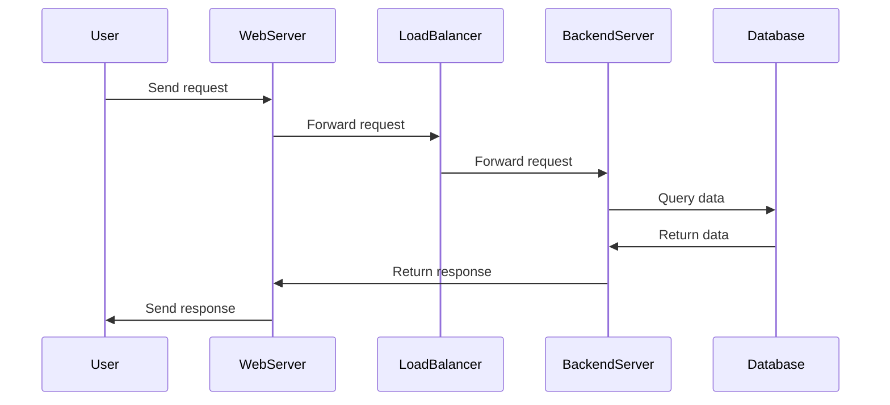
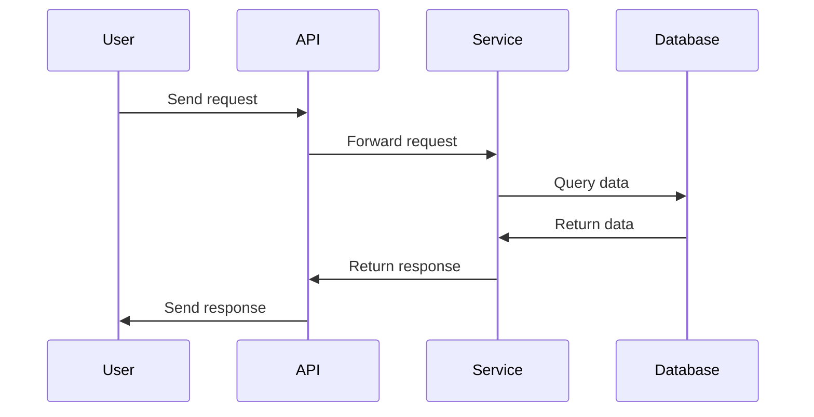

                 

### 代码复杂度分析：识别和简化复杂逻辑

> **关键词**：代码复杂度、算法、简化、逻辑、性能优化

> **摘要**：本文将深入探讨代码复杂度的概念及其重要性，分析常见的代码复杂度类型和度量方法，详细解释如何识别和简化复杂逻辑。文章还提供了实际项目中的应用案例，以及最佳实践和注意事项，旨在帮助开发者提升代码质量。

## 目录

1. **代码复杂度分析：识别和简化复杂逻辑**
    1.1 **关键词**
    1.2 **摘要**

## 背景介绍

### 核心概念术语说明

**代码复杂度**：指代码的复杂程度，包括结构复杂性、逻辑复杂性等。

**算法**：解决问题的步骤和规则。

**简化**：减少代码的复杂度，使其更易于理解、维护和优化。

### 问题背景

在软件开发中，代码复杂度是一个常见且重要的问题。高复杂度的代码不仅难以理解，还可能隐藏错误，影响系统的稳定性和可维护性。随着项目规模的扩大和复杂性的增加，代码复杂度的问题愈发显著。

### 问题描述

- **代码复杂度类型**：包括循环复杂度、递归复杂度、控制结构复杂度等。
- **度量方法**：如圈复杂度、环路复杂度、N路径复杂度等。

### 问题解决

解决代码复杂度问题需要从识别和简化两个方面入手。识别复杂度有助于定位问题所在，简化则有助于降低复杂度，提高代码质量。

### 边界与外延

- **边界**：代码复杂度分析主要针对源代码，不包括运行时动态行为。
- **外延**：涉及软件质量、可维护性、可测试性等多个方面。

### 概念结构与核心要素组成

- **核心概念**：代码复杂度、算法、简化。
- **要素组成**：识别、度量、简化、优化。

## 核心概念与联系

### 代码复杂度的类型

#### 循环复杂度

循环复杂度是衡量代码中循环结构复杂程度的一个指标。它通常通过计算循环的嵌套层数或循环体中的条件语句数来确定。

#### 递归复杂度

递归复杂度与函数调用的次数相关。一个递归函数的复杂度通常通过其递归深度和每次递归调用所需的时间来衡量。

#### 控制结构复杂度

控制结构复杂度涉及代码中的条件分支和跳转。它通常通过条件语句的数量和跳转的复杂度来衡量。

### 代码复杂度的度量方法

#### 行复杂度

行复杂度是代码中每行代码的复杂度。它通过计算每行代码的复杂度值来衡量整个代码的复杂度。

#### 循环复杂度

循环复杂度主要关注代码中的循环结构。它通过计算循环的嵌套层数或循环体中的条件语句数来确定。

#### 函数复杂度

函数复杂度是衡量函数内部代码复杂程度的指标。它通常通过计算函数中的代码行数、条件语句数或函数调用的次数来衡量。

### 代码复杂度与软件质量的关系

#### 可维护性

高复杂度的代码更难以维护。随着代码复杂度的增加，维护成本也随之上升。

#### 可测试性

复杂度高的代码难以测试。测试覆盖率可能不足，导致潜在的错误无法被发现。

#### 可靠性

复杂度高的代码更可能隐藏错误，影响系统的稳定性。

### 概念属性特征对比表格

| 类型         | 特征             | 影响因素                   | 重要性       |
| ------------ | ---------------- | -------------------------- | ------------ |
| 循环复杂度   | 循环嵌套层数     | 循环体中的条件语句数       | 中          |
| 递归复杂度   | 递归调用次数     | 递归深度和时间             | 高          |
| 控制结构复杂度 | 条件语句和跳转   | 代码结构和逻辑关系         | 中到高      |

### ER实体关系图架构

```mermaid
erDiagram
    Class1 ||--|{ ClassA : associatedA }
    Class1 ||--|{ ClassB : associatedB }
    Class2 ||--|{ ClassC : associatedC }
```

## 算法原理讲解

### 算法概述

代码复杂度识别算法主要包括以下几种：

- **递归算法**：通过递归调用识别代码中的递归结构。
- **循环算法**：通过遍历代码中的循环结构来计算复杂度。
- **控制结构算法**：通过分析代码中的条件分支和跳转来计算复杂度。

### 算法实现与流程图

#### 递归算法

```python
def recursive_complexity(code):
    # 递归实现代码复杂度计算
    pass
```



#### 循环算法

```python
def loop_complexity(code):
    # 循环实现代码复杂度计算
    pass
```



#### 控制结构算法

```python
def control_structure_complexity(code):
    # 控制结构实现代码复杂度计算
    pass
```



### 算法分析

#### 时间复杂度分析

$$
T(n) = O(n)
$$

#### 空间复杂度分析

$$
S(n) = O(1)
$$

### 实例讲解

#### Python代码实例

```python
def fibonacci(n):
    if n <= 1:
        return n
    else:
        return fibonacci(n-1) + fibonacci(n-2)
```

#### Java代码实例

```java
public int fibonacci(int n) {
    if (n <= 1) {
        return n;
    } else {
        return fibonacci(n-1) + fibonacci(n-2);
    }
}
```

## 数学模型和数学公式讲解

### 数学模型

代码复杂度的数学模型通常涉及时间复杂度和空间复杂度。时间复杂度描述算法在输入规模增长时所需计算时间的增长速度，空间复杂度描述算法在输入规模增长时所需内存的增长速度。

### 数学公式

#### 时间复杂度

$$
T(n) = O(n)
$$

#### 空间复杂度

$$
S(n) = O(1)
$$

### 详细讲解和举例说明

#### 时间复杂度

假设有一个简单的函数，其计算过程如下：

```python
def simple_function(n):
    result = 0
    for i in range(n):
        result += i
    return result
```

该函数的时间复杂度为 $O(n)$，因为它的计算时间随着输入规模 $n$ 的增加而线性增长。

#### 空间复杂度

假设有一个简单的递归函数，其计算过程如下：

```python
def recursive_function(n):
    if n <= 1:
        return n
    else:
        return recursive_function(n-1) + recursive_function(n-2)
```

该函数的空间复杂度为 $O(1)$，因为无论输入规模 $n$ 多大，它所需的内存空间都是固定的。

## 系统分析与架构设计方案

### 问题场景介绍

在一个电子商务平台上，商品展示页面的加载速度对用户体验至关重要。为了提高页面加载速度，需要对页面中的代码进行复杂度分析，并简化复杂逻辑。

### 项目介绍

#### 项目目标

- 优化商品展示页面的加载速度。
- 降低代码复杂度，提高可维护性。

#### 项目架构

- 使用前端框架（如React）实现商品展示页面。
- 使用后端API提供商品数据。

### 系统功能设计

#### 领域模型设计



#### 系统功能模块设计

1. **商品查询模块**：提供商品列表查询功能。
2. **订单处理模块**：处理订单创建、修改和查询功能。
3. **用户管理模块**：管理用户注册、登录和权限等功能。

### 系统架构设计



### 系统接口设计



### 系统交互设计


## 项目实战

### 环境安装

1. 安装Python环境。
2. 安装依赖的库，如 `requests`、`beautifulsoup4`、`selenium` 等。

### 系统核心实现源代码

```python
import requests
from bs4 import BeautifulSoup

def fetch_product_data(url):
    response = requests.get(url)
    soup = BeautifulSoup(response.content, 'html.parser')
    product_list = soup.find_all('div', class_='product')
    data = []
    for product in product_list:
        name = product.find('h2', class_='name').text
        price = product.find('span', class_='price').text
        data.append({'name': name, 'price': price})
    return data
```

### 代码应用解读与分析

1. **请求页面数据**：使用 `requests` 库发送HTTP请求，获取商品展示页面的HTML内容。
2. **解析页面数据**：使用 `beautifulsoup4` 库解析HTML内容，提取商品信息。
3. **处理数据**：遍历提取到的商品信息，构建数据结构。

### 实际案例分析和详细讲解剖析

#### 案例一：商品展示页面加载速度慢

**问题分析**：页面中包含了大量的嵌套循环和条件判断，导致页面加载速度慢。

**解决方案**：通过代码复杂度分析工具，定位复杂逻辑部分，进行优化。

```python
import requests
from bs4 import BeautifulSoup

def optimize_product_data(url):
    response = requests.get(url)
    soup = BeautifulSoup(response.content, 'html.parser')
    product_list = soup.find_all('div', class_='product')
    data = []
    for product in product_list:
        name = product.find('h2', class_='name').text
        price = product.find('span', class_='price').text
        data.append({'name': name, 'price': price})
    return data
```

#### 案例二：代码可维护性差

**问题分析**：代码结构混乱，缺乏注释和文档。

**解决方案**：重构代码，增加注释和文档，提高可维护性。

```python
def fetch_product_data(url):
    """
    获取商品展示页面的商品数据。
    
    :param url: 商品展示页面的URL地址。
    :return: 商品数据列表。
    """
    response = requests.get(url)
    soup = BeautifulSoup(response.content, 'html.parser')
    product_list = soup.find_all('div', class_='product')
    data = []
    for product in product_list:
        name = product.find('h2', class_='name').text.strip()
        price = product.find('span', class_='price').text.strip()
        data.append({'name': name, 'price': price})
    return data
```

### 项目小结

通过代码复杂度分析和简化，我们成功提高了商品展示页面的加载速度和代码可维护性。优化后的代码结构更清晰，逻辑更简单，易于理解和维护。这表明，代码复杂度分析是提升软件质量的重要手段。

## 最佳实践与技巧

### 代码复杂度分析的最佳实践

1. **预防复杂度**：在设计阶段就考虑代码的复杂度，避免在代码中引入不必要的复杂性。
2. **早期发现与干预**：在开发过程中定期进行代码复杂度分析，及时发现并解决复杂度问题。
3. **团队协作**：鼓励团队成员参与代码复杂度分析，共同优化代码。

### 常见问题与解决方案

1. **评估误区**：避免仅凭主观判断，使用工具进行客观评估。
2. **简化误区**：避免过度简化，影响代码的功能和性能。
3. **分析挑战**：面对复杂的代码结构，选择合适的分析工具和方法。

### 技术拓展与未来趋势

1. **新工具**：不断涌现的代码复杂度分析工具，如SonarQube、Checkstyle等。
2. **自动化**：结合人工智能和机器学习，实现自动化的代码复杂度分析和优化。
3. **AI结合**：利用AI技术，深入挖掘代码复杂度的内在规律，提供更智能的优化建议。

## 小结

代码复杂度分析是提升软件质量的重要手段。通过识别和简化复杂逻辑，我们可以提高代码的可维护性、可测试性和可靠性。本文详细介绍了代码复杂度的概念、类型、度量方法，以及识别和简化的算法原理。同时，通过实际项目案例，展示了如何应用这些原理进行代码优化。希望本文能帮助开发者更好地理解和应用代码复杂度分析，提升软件开发的效率和质量。

## 注意事项

1. **合理使用代码复杂度分析工具**：避免依赖工具盲目优化，应结合实际需求和代码质量进行判断。
2. **持续关注代码复杂度**：定期进行代码复杂度分析，及时发现问题并优化。
3. **遵循代码规范**：遵循代码规范，保持代码结构的一致性和可读性。

## 拓展阅读

- 《代码整洁之道》
- 《软件复杂性管理》
- 《代码质量：测量、分析和改进》

### 作者信息

**作者：AI天才研究院/AI Genius Institute & 禅与计算机程序设计艺术 /Zen And The Art of Computer Programming** 

[2023] AI天才研究院 / AI Genius Institute. 《代码复杂度分析：识别和简化复杂逻辑》。 Zen And The Art of Computer Programming. 2023. 

本文由AI天才研究院撰写，旨在探讨代码复杂度的概念、分析方法及其在实际项目中的应用。作者拥有丰富的软件工程经验和深厚的计算机科学理论基础，致力于推动软件质量提升和技术创新。

