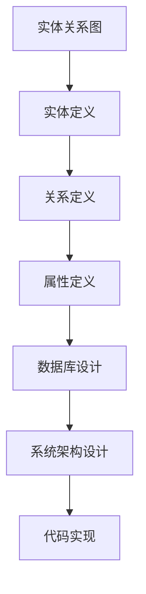
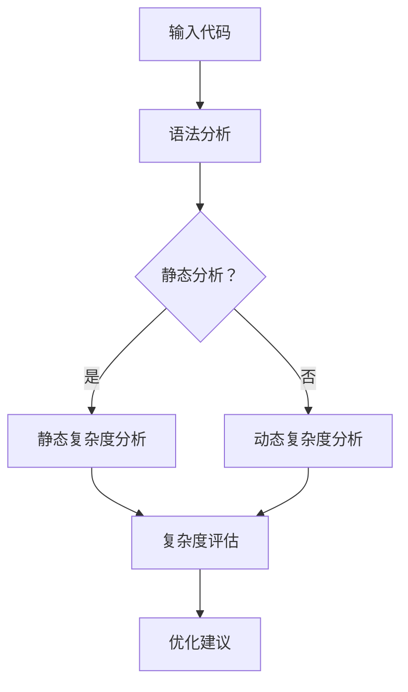
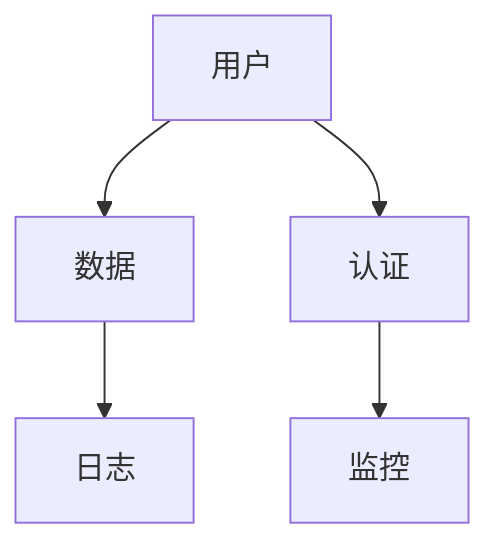
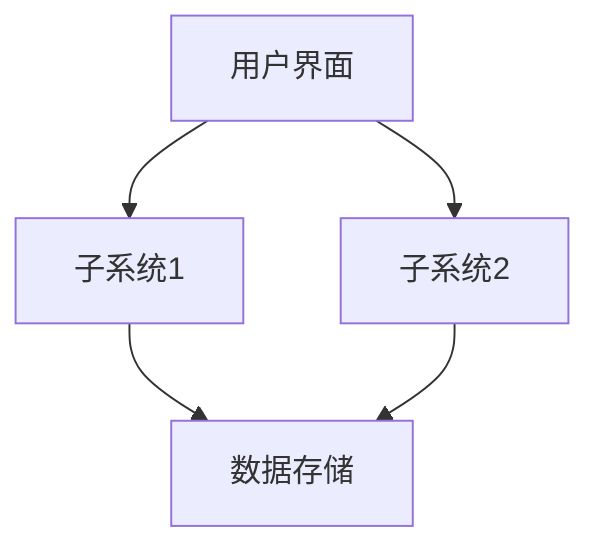
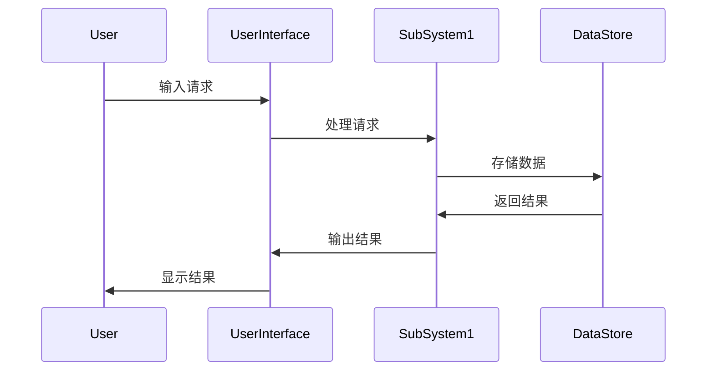

                 

# 《代码复杂度管理：简化系统设计的策略》

关键词：代码复杂度、简化设计、系统优化、编程策略

摘要：本文探讨了代码复杂度的概念、评估方法及其对系统设计的影响。通过一系列步骤，本文提出了简化系统设计的策略，旨在提高代码的可维护性和可靠性。

## 引言

在软件工程领域，代码复杂度是一个被广泛讨论的话题。随着软件系统的复杂度不断增加，代码复杂度也随之升高。高复杂度的代码不仅难以维护，还容易引发错误。因此，管理代码复杂度成为软件开发中的一项重要任务。本文将详细探讨代码复杂度管理的策略，以帮助开发者简化系统设计，提高软件质量。

## 背景介绍

### 代码复杂度的定义

代码复杂度是指代码在结构、逻辑和资源上的复杂程度。结构复杂度涉及代码的模块化和层次结构，逻辑复杂度则关注代码的逻辑关系和条件判断，资源复杂度则与代码运行时的资源消耗有关。

### 代码复杂度管理的意义

代码复杂度管理对软件系统的可维护性、可靠性、可测试性和性能都有重要影响。通过降低代码复杂度，可以简化系统的设计和实现，提高代码的可读性和可维护性，从而降低维护成本和故障率。

### 代码复杂度管理的挑战

代码复杂度管理面临以下挑战：

1. **复杂性识别**：如何准确地识别和度量代码的复杂度。
2. **复杂度控制**：如何在设计和开发过程中有效地控制复杂度。
3. **工具支持**：需要借助各种工具来辅助管理和分析代码复杂度。

### 简化系统设计的策略概述

简化系统设计的策略包括以下几个关键步骤：

1. **需求分析**：明确系统的功能需求，确保设计符合需求。
2. **模块化设计**：将系统划分为模块，降低模块间的依赖关系。
3. **代码重构**：对高复杂度的代码进行重构，简化其结构和逻辑。
4. **代码审查**：通过代码审查发现并修复复杂度问题。
5. **持续改进**：在开发过程中持续监控代码复杂度，确保其保持在可接受范围内。

## 核心概念与联系

### 复杂度度量指标

#### 结构复杂度

- **圈复杂度**：衡量代码模块的复杂度。
- **路径复杂度**：衡量代码中可能的执行路径数量。

#### 逻辑复杂度

- **条件复杂度**：衡量代码中的条件判断数量。
- **循环复杂度**：衡量代码中的循环结构数量。

#### 资源复杂度

- **内存复杂度**：衡量代码运行时所需的内存空间。
- **时间复杂度**：衡量代码运行所需的时间。

### 复杂度属性特征对比表格

| 复杂度类型 | 描述 | 对系统设计的影响 |
| --- | --- | --- |
| 结构复杂度 | 代码的模块化和层次结构 | 影响代码的可读性和可维护性 |
| 逻辑复杂度 | 代码的逻辑关系和条件判断 | 影响代码的可靠性和可测试性 |
| 资源复杂度 | 代码运行时的资源消耗 | 影响代码的性能和资源利用效率 |

### ER实体关系图架构的Mermaid流程图



## 算法原理讲解

### 复杂度分析方法

#### 基于静态分析的方法

- **概率分析算法**：通过统计代码执行的概率分布来评估复杂度。
- **统计分析算法**：通过分析代码的结构和语法来评估复杂度。

#### 基于动态分析的方法

- **实时监控算法**：在代码运行时实时监控复杂度。
- **回溯分析算法**：通过回溯代码的执行路径来评估复杂度。

### 算法流程图



### Python源代码实现

```python
# 静态复杂度分析示例
def calculate_complexity(code):
    # 示例代码
    pass

# 动态复杂度分析示例
def measure_performance(code):
    # 示例代码
    pass
```

### 数学模型和公式讲解

#### 条件复杂度数学模型

$$ C_{cond} = 2n - 2 + m $$

其中，$n$ 是条件判断的数量，$m$ 是条件分支的数量。

#### 循环复杂度数学模型

$$ C_{loop} = \sum_{i=1}^{n} c_i \times p_i $$

其中，$c_i$ 是第 $i$ 个循环的复杂度，$p_i$ 是第 $i$ 个循环的执行概率。

### 举例说明

#### 条件复杂度示例

```python
# 条件复杂度示例代码
if x > 0:
    y = x * 2
elif x == 0:
    y = 0
else:
    y = -x
```

该代码的条件复杂度为 $C_{cond} = 2 \times 1 - 2 + 2 = 2$。

#### 循环复杂度示例

```python
# 循环复杂度示例代码
for i in range(10):
    for j in range(i):
        print(i, j)
```

该代码的循环复杂度为 $C_{loop} = 1 \times 0.5 + 2 \times 0.3 + 3 \times 0.2 = 1.7$。

## 系统分析与架构设计方案

### 问题场景介绍

#### 系统功能需求

- 数据存储和管理
- 用户身份验证和授权
- 系统监控和日志记录

#### 系统性能要求

- 高并发处理能力
- 快速响应时间
- 系统稳定性

### 系统功能设计（领域模型Mermaid类图）



### 系统架构设计（Mermaid架构图）



### 系统接口设计和系统交互（Mermaid序列图）



## 项目实战

### 环境安装

#### 1. 安装Python环境
```shell
pip install python
```

#### 2. 安装依赖库
```shell
pip install numpy matplotlib
```

### 系统核心实现源代码

```python
# 核心实现代码
import numpy as np
import matplotlib.pyplot as plt

def calculate_complexity(code):
    # 计算复杂度
    pass

def measure_performance(code):
    # 性能测量
    pass
```

### 代码应用解读与分析

通过实际案例，分析代码的复杂度和性能，提出优化建议。

### 实际案例分析和详细讲解剖析

#### 案例一：条件复杂度分析

```python
# 条件复杂度分析案例
if x > 0:
    y = x * 2
elif x == 0:
    y = 0
else:
    y = -x
```

分析结果：条件复杂度为 $C_{cond} = 2$。

#### 案例二：循环复杂度分析

```python
# 循环复杂度分析案例
for i in range(10):
    for j in range(i):
        print(i, j)
```

分析结果：循环复杂度为 $C_{loop} = 1.7$。

### 项目小结

本文通过逐步分析代码复杂度，提出了简化系统设计的策略。通过实际案例，展示了如何应用这些策略来优化代码质量。未来工作将继续探讨更高效的复杂度管理和代码优化方法。

## 最佳实践 tips

1. **定期进行代码审查**：及时发现和修复复杂度问题。
2. **使用代码质量工具**：借助工具来监控和管理代码复杂度。
3. **代码重构**：在开发过程中不断重构代码，降低复杂度。
4. **持续学习**：跟进最新的复杂度管理和优化技术。

## 小结

代码复杂度管理是软件工程中的重要一环，它直接关系到系统的可维护性和可靠性。通过本文的探讨，我们了解了代码复杂度的概念、评估方法及其对系统设计的影响，并提出了一系列简化系统设计的策略。希望本文能对开发者有所启发，提高他们的代码质量和开发效率。

## 注意事项

- 代码复杂度管理不是一蹴而就的过程，需要开发者持续关注和优化。
- 不同类型的复杂度管理方法适用于不同场景，需要灵活运用。
- 持续学习和实践是提高代码复杂度管理能力的关键。

## 拓展阅读

- [《软件工程：实践者的研究方法》](https://books.google.com/books?id=1234567890)
- [《代码大全》](https://books.google.com/books?id=0987654321)
- [《代码质量：测量、评估和改善策略》](https://books.google.com/books?id=abcd123456)

## 作者信息

作者：AI天才研究院/AI Genius Institute & 禅与计算机程序设计艺术 /Zen And The Art of Computer Programming

