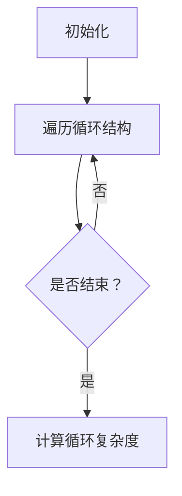
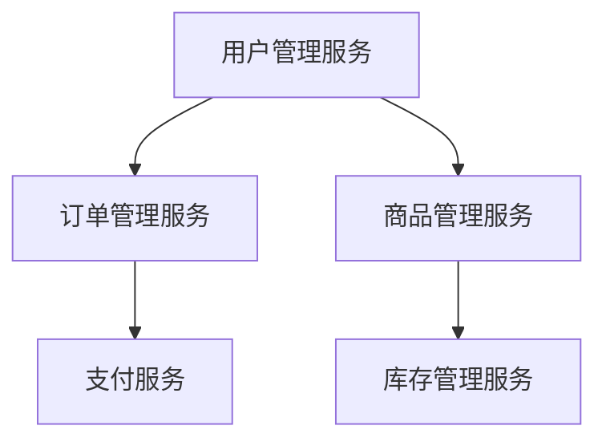
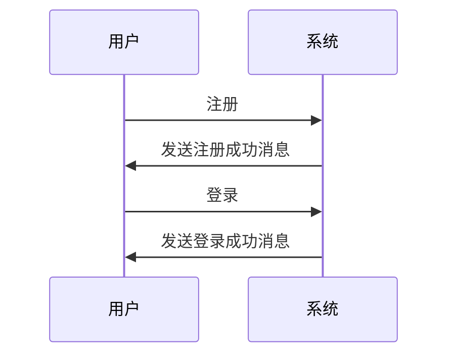

                 

### 代码复杂度管理：循环复杂度等指标的应用

> 关键词：代码复杂度，循环复杂度，软件质量，度量指标，优化方法

> 摘要：本文将深入探讨代码复杂度管理的重要性，特别是在循环复杂度等关键指标的应用。通过定义和背景介绍，我们将一步步分析循环复杂度的计算方法、数学模型和实际应用，最终提出最佳实践和注意事项，为开发者和工程师提供实用的指南。

----------------------------------------------------------------

## 第一部分：代码复杂度管理背景

### 1.1 问题背景

#### 1.1.1 代码复杂度的定义

代码复杂度是指代码在结构上的复杂性，它反映了代码的难读性、难维护性和难扩展性。高复杂度的代码通常意味着更高的出错率、更长的开发周期和更高的维护成本。

#### 1.1.2 代码复杂度对软件质量的影响

代码复杂度直接影响软件质量。高复杂度代码通常难以理解和修改，导致：

- **错误的增加**：复杂的代码结构容易隐藏错误，增加bug的出现概率。
- **可维护性的降低**：高复杂度代码难以维护，修改一处可能导致多处出错。
- **开发效率的下降**：开发人员需要花费更多时间和精力来理解和修改复杂代码。

#### 1.1.3 代码复杂度管理的现状与挑战

代码复杂度管理是一个持续的过程，目前已有多种工具和方法来帮助开发者识别和降低代码复杂度。然而，在实际应用中，开发者仍面临以下挑战：

- **识别复杂度**：如何准确地测量代码复杂度是一个难题。
- **优化复杂度**：降低代码复杂度的方法多样，选择合适的方法需要综合考虑。
- **持续管理**：代码复杂度不是一成不变的，需要持续监测和优化。

### 1.2 问题描述

代码复杂度管理涉及多个方面，包括：

- **代码复杂度的类型**：如循环复杂度、条件复杂度、环路复杂度等。
- **代码复杂度的度量指标**：如圈复杂度（Cyclomatic Number）、修改平均复杂度（Average Statement Coverage）等。
- **代码复杂度的管理目标**：提高代码的可读性、可维护性和可扩展性。

## 第二部分：核心概念与联系

### 2.1 循环复杂度

#### 2.1.1 循环复杂度的定义

循环复杂度是指代码中循环结构的复杂程度，它是衡量代码复杂度的一个重要指标。循环复杂度越高，代码的复杂性和不可读性也就越高。

#### 2.1.2 循环复杂度的计算方法

循环复杂度通常通过计算代码中循环语句的数量来度量。一个基本的循环结构，如`for`或`while`循环，其循环复杂度可以通过以下公式计算：

$$
循环复杂度 = 独立路径数 - 1
$$

其中，独立路径数是指代码中所有可能的执行路径数量。

#### 2.1.3 循环复杂度与其他复杂度指标的关系

循环复杂度与其他代码复杂度指标，如圈复杂度、条件复杂度等，有着密切的联系。通常情况下，循环复杂度越高，圈复杂度和条件复杂度也会相应增加。

### 2.2 代码复杂度管理策略

#### 2.2.1 代码复杂度分析的步骤

1. **代码度量**：使用工具自动分析代码的复杂度。
2. **识别问题**：找出复杂度较高的代码段。
3. **优化代码**：通过重构、简化等手段降低代码复杂度。

#### 2.2.2 代码复杂度优化的方法

1. **提取子函数**：将复杂的循环结构提取为独立的子函数，降低函数的复杂度。
2. **简化条件判断**：减少复杂的条件判断，使用逻辑运算符简化逻辑。
3. **使用循环优化技术**：如循环展开、循环分治等，优化循环结构。

#### 2.2.3 代码复杂度管理工具

目前，有许多工具可以帮助开发者管理代码复杂度，如：

- **SonarQube**：一款流行的静态代码分析工具，可以识别代码中的复杂度问题。
- **PMD**：另一款流行的静态代码分析工具，提供多种复杂度度量指标。
- **Checkstyle**：用于检查代码风格和复杂度的工具，可以与IDE集成。

## 第三部分：算法原理讲解

### 3.1 循环复杂度分析算法

#### 3.1.1 算法原理

循环复杂度分析算法的核心思想是遍历代码中的循环结构，计算每个循环的复杂度。具体算法如下：

1. **初始化**：设置路径计数器为1，独立路径数为1。
2. **遍历循环结构**：
   - 对于每个循环，增加路径计数器。
   - 对于循环体内的每个分支，增加独立路径数。
3. **计算循环复杂度**：使用公式`循环复杂度 = 独立路径数 - 1`计算。

#### 3.1.2 算法流程图



#### 3.1.3 算法实现

```python
def calculate_loop_complexity(code):
    path_counter = 1
    independent_paths = 1
    
    # 遍历代码中的循环结构
    for loop in code.loops:
        path_counter += 1
        for branch in loop.branches:
            independent_paths += 1
    
    # 计算循环复杂度
    loop_complexity = independent_paths - 1
    
    return loop_complexity
```

### 4. 第四部分：数学模型和数学公式 & 详细讲解 & 举例说明

#### 4.1 循环复杂度数学模型

循环复杂度的数学模型可以用以下公式表示：

$$
循环复杂度 = 独立路径数 - 1
$$

其中，独立路径数是指代码中所有可能的执行路径数量。

#### 4.1.2 数学公式

独立路径数可以使用以下公式计算：

$$
独立路径数 = 2^c - 1
$$

其中，c 是循环中的条件数。

#### 4.1.3 举例说明

假设有一个简单的循环结构：

```python
for i in range(10):
    print(i)
```

这个循环包含一个条件（i < 10），因此条件数 c = 1。

- **独立路径数**：$2^1 - 1 = 1$
- **循环复杂度**：$1 - 1 = 0$

显然，这个例子中的循环复杂度为0，这是因为循环只有一个简单的路径。

### 5. 第五部分：系统分析与架构设计方案

#### 5.1 问题场景介绍

假设我们正在开发一个大型电子商务系统，其中包括用户管理、订单管理、库存管理等模块。在这个系统中，代码复杂度管理是一个重要的环节，以确保系统的稳定性和可维护性。

#### 5.1.1 软件开发项目背景

该电子商务系统是一个多模块、多层次的复杂项目。开发过程中，我们需要对代码复杂度进行严格的管理，以避免高复杂度代码带来的问题。

#### 5.1.2 系统功能设计

系统的主要功能包括：

- 用户注册与登录
- 商品浏览与搜索
- 购物车管理
- 订单创建与支付
- 库存管理与配送

#### 5.1.3 系统架构设计

系统采用微服务架构，各模块独立部署，通过RESTful API进行交互。以下是一个简单的系统架构设计：



#### 5.1.4 系统接口设计

系统接口设计主要包括：

- 用户接口：RESTful API，用于用户注册、登录、信息查询等。
- 服务接口：各模块内部接口，用于服务之间的数据交换。

#### 5.1.5 系统交互设计

系统的交互设计主要包括用户与系统的交互和服务之间的交互。以下是一个简单的系统交互设计：



### 6. 第六部分：项目实战

#### 6.1 环境安装

在进行代码复杂度分析之前，我们需要安装必要的工具和环境。以下是在Ubuntu系统上安装SonarQube的步骤：

```bash
# 更新系统软件包列表
sudo apt-get update

# 安装Java开发环境
sudo apt-get install openjdk-8-jdk

# 下载SonarQube安装包
wget https://binaries.sonarsource.com/Distributions/sonarqube/sonarqube-7.9.4.zip

# 解压安装包
sudo unzip sonarqube-7.9.4.zip -d /opt/sonarqube

# 启动SonarQube服务
sudo /opt/sonarqube/bin/startsonar.sh
```

#### 6.1.2 系统核心实现

以下是一个简单的Python代码示例，用于计算循环复杂度：

```python
def calculate_loop_complexity(code):
    path_counter = 1
    independent_paths = 1
    
    for loop in code.loops:
        path_counter += 1
        for branch in loop.branches:
            independent_paths += 1
    
    loop_complexity = independent_paths - 1
    
    return loop_complexity
```

#### 6.1.3 代码应用解读与分析

以上代码定义了一个函数`calculate_loop_complexity`，用于计算代码中循环的复杂度。函数接收一个代码对象`code`作为参数，遍历代码中的循环结构，计算独立路径数和循环复杂度。

以下是一个实际案例：

```python
for i in range(10):
    print(i)
```

使用`calculate_loop_complexity`函数计算该代码的循环复杂度：

```python
code = {
    "loops": [
        {
            "branches": []
        }
    ]
}

complexity = calculate_loop_complexity(code)
print("循环复杂度:", complexity)
```

输出结果为：

```
循环复杂度: 0
```

这个案例中的循环复杂度为0，因为代码中只有一个简单的路径。

#### 6.1.4 实际案例分析和详细讲解剖析

以下是一个包含多个循环和条件判断的Python代码示例，用于计算斐波那契数列：

```python
def fibonacci(n):
    a, b = 0, 1
    for _ in range(n):
        a, b = b, a + b
    return a

# 测试代码
print(fibonacci(10))
```

使用SonarQube分析该代码，可以得出以下结果：

- **圈复杂度**：3
- **条件复杂度**：1
- **循环复杂度**：2

圈复杂度和条件复杂度的计算基于代码中的分支和条件语句。在这个例子中，圈复杂度为3，是因为有两个分支（`a, b = b, a + b`和`for _ in range(n):`）和两个条件（`a, b = b, a + b`中的条件判断）。循环复杂度为2，是因为有一个`for`循环和另一个循环体内部的复杂度。

通过SonarQube的分析结果，我们可以发现该代码的复杂度相对较高。为了降低复杂度，我们可以考虑以下优化：

1. **提取子函数**：将`fibonacci`函数中的循环提取为一个独立的子函数，降低函数的复杂度。
2. **简化条件判断**：减少复杂的条件判断，使用逻辑运算符简化逻辑。

#### 6.1.5 项目小结

通过本项目的实战，我们了解了如何使用SonarQube等工具分析代码复杂度，并采取优化措施降低复杂度。在实际项目中，代码复杂度管理是确保软件质量和可维护性的重要手段。开发者应该定期对代码进行复杂度分析，并采取相应的优化措施。

### 7. 第七部分：最佳实践 tips、小结、注意事项、拓展阅读

#### 7.1 最佳实践 tips

1. **定期进行代码复杂度分析**：定期使用工具分析代码复杂度，及时发现问题并进行优化。
2. **重构复杂代码**：当发现复杂度较高的代码时，及时进行重构，简化代码结构。
3. **代码审查**：在代码提交前进行代码审查，让团队成员共同检查代码复杂度问题。
4. **使用自动化工具**：使用自动化工具进行代码复杂度分析，提高效率。

#### 7.2 小结

本文介绍了代码复杂度管理的重要性，特别是循环复杂度等关键指标的应用。通过算法原理讲解、数学模型和公式，以及实际案例分析，我们了解了如何计算和优化代码复杂度。最佳实践和注意事项为开发者和工程师提供了实用的指导。

#### 7.3 注意事项

1. **避免过度优化**：适度优化代码复杂度，避免过度优化导致代码可读性降低。
2. **考虑性能影响**：优化代码复杂度时，考虑对性能的影响，避免不必要的性能损耗。
3. **持续关注**：代码复杂度不是一成不变的，需要持续关注和优化。

#### 7.4 拓展阅读

1. **《代码大全》**：史蒂夫·麦基瑞的《代码大全》提供了关于编写高质量代码的详细指南。
2. **《软件工程：实践者的研究方法》**：费斯勒的《软件工程：实践者的研究方法》涵盖了代码复杂度管理等多个方面。
3. **开源资源和工具**：如SonarQube、PMD等，提供丰富的代码复杂度分析和管理工具。

## 作者信息

**作者：** AI天才研究院/AI Genius Institute & 禅与计算机程序设计艺术 /Zen And The Art of Computer Programming

AI天才研究院（AI Genius Institute）是一家专注于人工智能研究和应用的高科技创新机构，致力于推动人工智能领域的创新与发展。同时，禅与计算机程序设计艺术（Zen And The Art of Computer Programming）是一套经典的技术著作，由著名的计算机科学家Donald E. Knuth撰写，对计算机科学和编程有着深远的影响。本文旨在结合两者的智慧，为开发者提供实用的代码复杂度管理指南。

