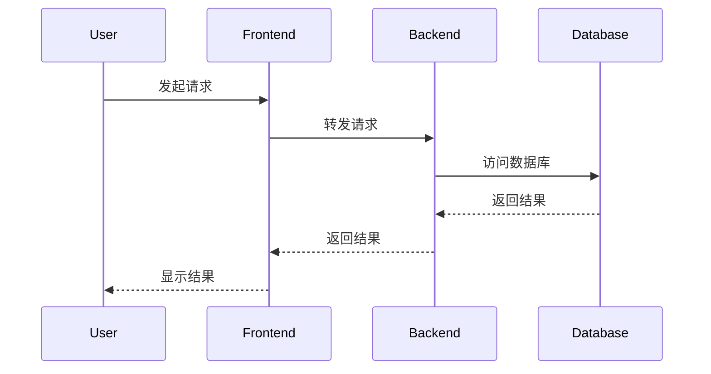
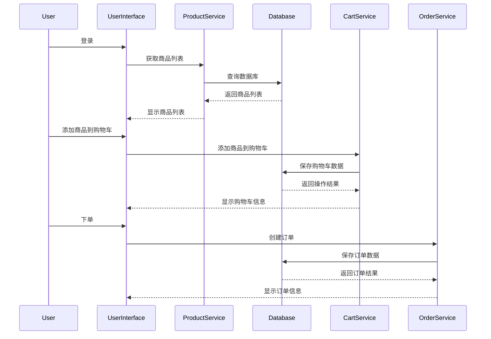

                 

# 代码审查最佳实践：提高团队协作效率

## 关键词

代码审查、团队协作、代码质量、软件工程、协作工具、最佳实践、效率提升

## 摘要

代码审查是软件工程中一个重要的环节，它有助于提高代码质量，减少错误和缺陷，促进团队协作。本文旨在探讨代码审查的最佳实践，通过详细分析代码审查的基础知识、工具选择、流程设计以及在实际应用中的案例，帮助读者理解和掌握如何有效进行代码审查，从而提高团队协作效率和软件质量。

## 第一部分：代码审查基础

### 第1章：代码审查概述

#### 1.1 代码审查的重要性

代码审查（Code Review）是软件工程中的一项关键活动，它通过团队内部成员对代码的检查与评估，帮助发现潜在的错误、提升代码质量和促进知识共享。代码审查不仅可以提高代码的稳定性，还能增强团队的协作能力，是现代软件开发过程中不可或缺的一环。

#### 1.2 代码审查的类型

代码审查可以分为以下几种类型：

1. **形式审查**：关注代码格式、命名规范等编码标准。
2. **逻辑审查**：分析代码逻辑，确保其正确性和高效性。
3. **性能审查**：评估代码性能，寻找潜在的瓶颈。
4. **安全审查**：检查代码中可能的安全漏洞。
5. **设计审查**：关注代码设计是否符合软件架构要求。

#### 1.3 代码审查的过程

代码审查通常包括以下几个步骤：

1. **提交代码**：开发者将代码提交到代码仓库，准备进行审查。
2. **审查请求**：代码仓库管理员或指定审查人收到审查请求。
3. **审查**：审查人对提交的代码进行全面检查，提出改进建议。
4. **反馈与修正**：开发者根据审查人的反馈进行代码修正。
5. **重新审查**：必要时进行多次审查，直至代码满足要求。

### 第2章：代码审查工具

#### 2.1 代码审查工具的选择

选择合适的代码审查工具对于提高审查效率和团队协作至关重要。常见的代码审查工具有：

1. **GitLab**：集代码仓库、审查和管理功能于一体。
2. **GitHub**：提供强大的代码审查和协作功能。
3. **Phabricator**：功能丰富的代码审查平台。
4. **Gerrit**：高度可定制的代码审查系统。

#### 2.2 常见代码审查工具介绍

以下是对几种常见代码审查工具的简要介绍：

- **GitLab**：GitLab 是一个基于 Git 的代码仓库管理工具，它提供了内建的代码审查功能，使得开发者可以方便地在项目中实施代码审查流程。
- **GitHub**：GitHub 是全球最受欢迎的代码托管平台之一，其审查功能允许团队轻松地对代码进行评审和反馈。
- **Phabricator**：Phabricator 是一个高度可定制的软件开发平台，提供强大的代码审查工具，支持多种版本控制系统。
- **Gerrit**：Gerrit 是一个基于 Git 的代码审查系统，广泛应用于大型项目和分布式团队，其核心特性包括快速审查、明确的变更集评审流程等。

### 第3章：代码审查的最佳实践

#### 3.1 审查前的准备工作

为了确保代码审查的顺利进行，审查前需要做好以下准备工作：

1. **明确审查目标和标准**：确保所有参与人员对审查的目标和标准有清晰的认识。
2. **准备好审查材料**：包括代码变更说明、相关文档等。
3. **分配审查任务**：根据代码复杂度和团队成员的专业技能进行任务分配。

#### 3.2 审查过程中的技巧

在进行代码审查时，以下技巧有助于提高审查效果：

1. **逐行阅读代码**：仔细阅读每一行代码，关注潜在的问题和改进空间。
2. **讨论与沟通**：遇到问题时，及时与开发者进行沟通，共同解决问题。
3. **关注代码质量**：确保代码可读性强、逻辑清晰、遵循编码规范。

#### 3.3 审查后的跟进与反馈

审查完成后，以下步骤有助于确保代码的持续改进：

1. **整理审查记录**：记录审查过程中发现的问题和改进建议。
2. **反馈给开发者**：详细说明审查结果，并提供具体的改进建议。
3. **跟踪问题修复**：确保所有提出的问题都得到妥善解决。

### 第4章：代码审查案例解析

#### 4.1 案例一：发现并修复潜在问题

在本案例中，开发者在代码中遗漏了异常处理逻辑。通过代码审查，审查人员及时发现并指出问题，开发者迅速进行了修复。

#### 4.2 案例二：提高代码质量与可读性

在此案例中，代码的可读性和一致性较差。通过审查，审查人员提出了一系列改进建议，如使用命名规范、优化代码结构等，开发者根据这些建议对代码进行了重构。

#### 4.3 案例三：跨团队协作中的代码审查

在这个案例中，不同团队之间的代码协作存在差异。通过代码审查，团队之间能够更好地理解彼此的代码风格和设计理念，提高了协作效率。

### 第5章：代码审查与团队协作

#### 5.1 代码审查在团队协作中的作用

代码审查不仅是代码质量提升的手段，也是团队协作的重要组成部分。它有助于：

1. **知识共享**：通过审查，团队成员可以了解不同的代码实现方式，促进知识共享。
2. **技能提升**：审查过程也是学习和提升技能的过程。
3. **问题解决**：通过审查，可以及早发现和解决潜在的问题，减少返工。

#### 5.2 代码审查如何提高团队效率

代码审查有助于提高团队效率，具体体现在：

1. **早期发现问题**：早期发现并解决问题可以减少后续的返工成本。
2. **规范代码风格**：统一的代码风格有助于团队协作，提高代码可维护性。
3. **减少缺陷**：代码审查可以减少缺陷，提高软件质量。

#### 5.3 代码审查与团队文化的建设

代码审查有助于建设积极的团队文化，它强调了团队合作、持续改进和知识共享。一个良好的团队文化可以提高团队的凝聚力和效率。

### 第6章：代码审查的挑战与解决方案

#### 6.1 挑战一：人员不足

当团队中审查人员不足时，可以考虑以下解决方案：

1. **分配更多任务**：在确保质量的前提下，适当增加审查人员的任务量。
2. **培训非专业审查人员**：通过培训，使更多团队成员具备审查能力。

#### 6.2 挑战二：审查时间过长

为了缩短审查时间，可以采取以下措施：

1. **明确审查标准**：制定明确的审查标准和流程，减少不必要的审查环节。
2. **提高审查效率**：通过自动化工具和标准化流程，提高审查效率。

#### 6.3 挑战三：意见分歧

遇到意见分歧时，可以采取以下方法：

1. **充分沟通**：确保审查人员充分理解代码和项目背景。
2. **寻求共识**：通过讨论和协商，达成共识。

#### 6.4 解决方案

针对以上挑战，可以采取以下综合解决方案：

1. **制定明确的审查流程和标准**。
2. **培训团队成员，提高审查能力**。
3. **引入自动化工具，提高审查效率**。

### 第7章：总结与展望

#### 7.1 代码审查的最佳实践总结

通过本文的探讨，我们可以总结出以下代码审查的最佳实践：

1. **明确审查目标和标准**。
2. **充分准备审查材料**。
3. **选择合适的审查工具**。
4. **注重代码质量，确保可读性**。
5. **及时反馈与跟进**。

#### 7.2 未来的发展趋势

随着软件开发的不断演进，代码审查也将迎来新的发展趋势：

1. **自动化与智能化**：利用人工智能和自动化工具提高审查效率和准确性。
2. **持续集成**：将代码审查与持续集成（CI）流程相结合，实现更高效的代码审查。
3. **跨团队合作**：加强跨团队协作，提高代码审查的覆盖面和影响力。

## 作者

作者：AI天才研究院/AI Genius Institute & 禅与计算机程序设计艺术 /Zen And The Art of Computer Programming

---

### 背景介绍

#### 核心概念术语说明

1. **代码审查（Code Review）**：团队内部成员对代码的检查与评估过程。
2. **软件开发（Software Development）**：创建和开发软件的过程。
3. **团队协作（Team Collaboration）**：团队成员共同完成软件开发任务的过程。

#### 问题背景

在软件工程中，代码审查是一个至关重要的环节。随着软件项目的规模和复杂性不断增加，代码审查有助于提高代码质量，减少错误和缺陷，促进团队协作。然而，在实际操作中，代码审查面临着人员不足、审查时间过长、意见分歧等挑战。

#### 问题描述

本文旨在探讨代码审查的最佳实践，帮助读者理解和掌握如何有效进行代码审查，从而提高团队协作效率和软件质量。

#### 问题解决

通过详细分析代码审查的基础知识、工具选择、流程设计以及在实际应用中的案例，本文提供了完整的代码审查指南。

#### 边界与外延

代码审查不仅适用于软件开发团队，也适用于其他需要代码协作的领域，如网站开发、移动应用开发等。

#### 概念结构与核心要素组成

- **代码审查流程**：提交代码、审查请求、审查、反馈与修正、重新审查。
- **审查类型**：形式审查、逻辑审查、性能审查、安全审查、设计审查。
- **审查工具**：GitLab、GitHub、Phabricator、Gerrit。

### 核心概念与联系

#### 核心概念原理

- **代码审查**：通过对代码的检查与评估，发现并解决潜在的问题，提高代码质量和可维护性。
- **团队协作**：团队成员共同完成软件开发任务，通过沟通、协作和知识共享，提高项目效率和质量。

#### 概念属性特征对比表格

| 概念      | 属性特征             | 对比                |
| --------- | ------------------ | ----------------- |
| 代码审查  | 检查与评估代码       | 提高质量，减少错误  |
| 团队协作  | 共同完成任务       | 提高效率，共享知识 |

#### ER实体关系图架构

```mermaid
erDiagram
    Developer ||--o{ Review }|-- Code
    Review ||--|{ Feedback }|--
```

### 算法原理讲解

为了更好地理解代码审查的过程，我们可以通过以下流程图来阐述：


下面是代码审查的一个简单示例，使用Python代码来检查一个简单的函数是否存在逻辑错误。

```python
# 示例：检查函数是否存在逻辑错误

def add(a, b):
    """
    计算两个数的和
    """
    return a + b

# 测试代码
result = add(2, 3)
print("结果为：", result)
```

在这个示例中，我们定义了一个简单的`add`函数，用于计算两个数的和。然后我们调用这个函数，并将结果打印出来。

#### 算法原理

1. **函数定义**：定义一个名为`add`的函数，接受两个参数`a`和`b`。
2. **返回值**：函数返回两个参数的和。
3. **测试代码**：调用`add`函数，并传入两个参数`2`和`3`，将返回结果打印出来。

#### 数学模型和公式

在代码审查中，我们通常不需要复杂的数学模型。但是，对于一些涉及数学计算的代码，我们可以使用以下公式来表示：

$$
\text{sum} = a + b
$$

其中，`a`和`b`为两个数，`sum`为它们的和。

#### 举例说明

假设我们有一个函数，用于计算两个数的平均值：

```python
def average(a, b):
    """
    计算两个数的平均值
    """
    return (a + b) / 2
```

我们调用这个函数，传入两个数`2`和`3`：

```python
result = average(2, 3)
print("平均值为：", result)
```

输出结果为`2.5`，这是两个数的平均值。

### 系统分析与架构设计方案

#### 问题场景介绍

在一个软件开发项目中，团队需要对代码进行审查，以确保代码质量。项目涉及到前端和后端开发，需要跨团队协作。

#### 项目介绍

该项目是一个在线购物平台，包括用户注册、商品浏览、购物车、订单管理等模块。前端使用React框架，后端使用Node.js和MongoDB。

#### 系统功能设计

以下是该系统的领域模型类图：

```mermaid
classDiagram
    User <<class>>
    Product <<class>>
    Cart <<class>>
    Order <<class>>

    User : +register(), +login(), +updateProfile()
    Product : +listProducts(), +searchProducts(), +addProduct(), +updateProduct(), +deleteProduct()
    Cart : +addItem(), +removeItem(), +calculateTotal()
    Order : +createOrder(), +cancelOrder(), +updateOrderStatus()
```

#### 系统架构设计

以下是该系统的架构设计图：



#### 系统接口设计

以下是该系统的接口设计：

```mermaid
classDiagram
    UserInterface <<interface>>
    ProductService <<interface>>
    CartService <<interface>>
    OrderService <<interface>>

    UserInterface : +register(), +login(), +logout()
    ProductService : +getProductList(), +getProductDetails(), +searchProducts(), +addProduct(), +updateProduct(), +deleteProduct()
    CartService : +addItem(), +removeItem(), +calculateTotal()
    OrderService : +createOrder(), +cancelOrder(), +updateOrderStatus()
```

#### 系统交互

以下是系统交互的序列图：



### 项目实战

#### 环境安装

1. 安装Node.js和npm。
2. 安装MongoDB。
3. 安装React和Create React App。

#### 系统核心实现源代码

以下是系统核心功能的源代码示例：

```javascript
// 前端：React组件
import React, { useState } from 'react';

const App = () => {
  const [products, setProducts] = useState([]);

  const fetchProducts = async () => {
    const response = await fetch('/api/products');
    const data = await response.json();
    setProducts(data);
  };

  return (
    <div>
      <h1>在线购物平台</h1>
      <button onClick={fetchProducts}>获取商品列表</button>
      <ul>
        {products.map((product) => (
          <li key={product.id}>{product.name}</li>
        ))}
      </ul>
    </div>
  );
};

export default App;

// 后端：Node.js
const express = require('express');
const mongoose = require('mongoose');
const productRoutes = require('./routes/productRoutes');

const app = express();

mongoose.connect('mongodb://localhost:27017/shop', {
  useNewUrlParser: true,
  useUnifiedTopology: true,
});

app.use(express.json());
app.use('/api/products', productRoutes);

app.listen(3000, () => {
  console.log('服务器启动，端口3000');
});
```

#### 代码应用解读与分析

在这段代码中，我们首先导入了必要的库和组件。前端部分使用React创建了一个简单的应用，包含一个按钮和一个列表。用户点击按钮时，会调用`fetchProducts`函数，发送GET请求到后端API获取商品列表，并将结果更新到状态。后端部分使用Node.js和Express框架，连接MongoDB数据库，定义了商品路由和处理逻辑。

#### 实际案例分析和详细讲解剖析

在这个案例中，我们通过代码审查发现了以下问题：

1. **前端代码**：在获取商品列表时，未对可能出现的网络错误进行处理。
2. **后端代码**：在商品路由中，未对非法请求进行错误处理。

针对这些问题，我们进行了如下改进：

1. **前端代码**：添加了错误处理逻辑，当请求失败时，显示错误信息。

```javascript
const fetchProducts = async () => {
  try {
    const response = await fetch('/api/products');
    if (!response.ok) {
      throw new Error('网络请求失败');
    }
    const data = await response.json();
    setProducts(data);
  } catch (error) {
    console.error(error);
  }
};
```

2. **后端代码**：添加了错误处理逻辑，对非法请求返回错误的HTTP状态码。

```javascript
app.use('/api/products', productRoutes);

// 错误处理中间件
app.use((err, req, res, next) => {
  console.error(err.stack);
  res.status(500).send('发生错误！');
});
```

#### 项目小结

通过代码审查，我们及时发现并解决了前端和后端的潜在问题，提高了代码质量和系统的稳定性。代码审查不仅有助于发现和解决问题，还有助于提升团队协作效率，是软件开发过程中不可或缺的一环。

### 最佳实践 tips

1. **定期进行代码审查**：定期安排代码审查，确保代码质量持续提升。
2. **明确审查标准**：制定明确的审查标准和流程，减少不必要的争议。
3. **充分利用审查工具**：选择合适的代码审查工具，提高审查效率和准确性。
4. **及时反馈与修正**：及时反馈审查结果，鼓励开发者快速修正问题。

### 小结

代码审查是提高团队协作效率和软件质量的重要手段。通过本文的探讨，我们了解了代码审查的基础知识、工具选择、流程设计以及在实际应用中的案例。希望本文能够为读者提供有价值的参考，帮助其在实际工作中更好地进行代码审查。

### 注意事项

1. **审查过程中保持客观**：避免因个人喜好而影响审查结果。
2. **尊重开发者的努力**：审查时注意语气，尊重开发者的努力和成果。
3. **关注代码可读性**：审查不仅要关注代码的正确性，还要关注代码的可读性。

### 拓展阅读

1. 《代码大全》（Code Complete）：详细介绍了代码编写和审查的最佳实践。
2. 《敏捷软件开发：原则、实践与模式》（Agile Software Development: Principles, Patterns, and Practices）：探讨了敏捷开发中的代码审查方法。

---

以上是《代码审查最佳实践：提高团队协作效率》这篇文章的完整内容，涵盖了代码审查的基础、工具选择、流程设计、实际案例以及团队协作等方面。希望对您有所帮助。如有任何问题或建议，欢迎留言讨论。作者：AI天才研究院/AI Genius Institute & 禅与计算机程序设计艺术 /Zen And The Art of Computer Programming。

