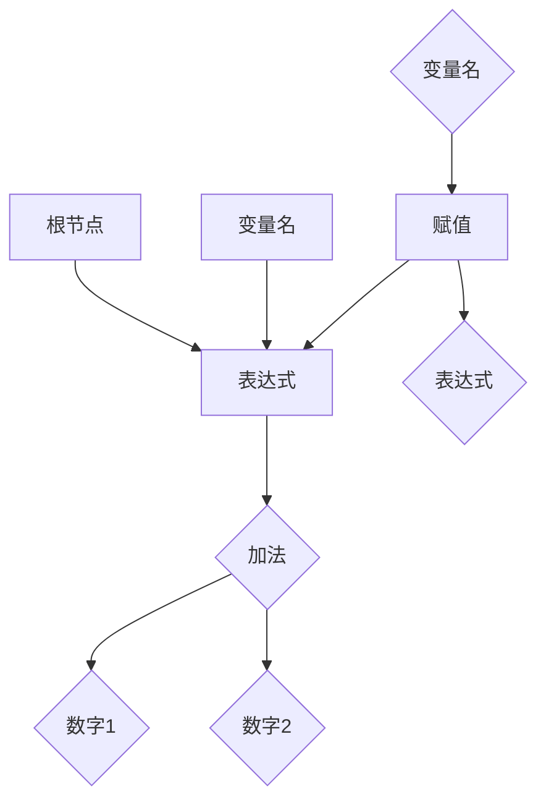
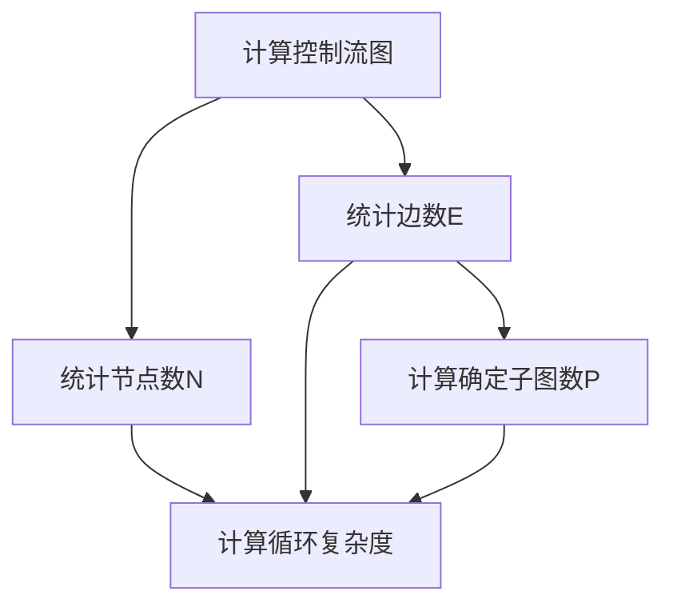
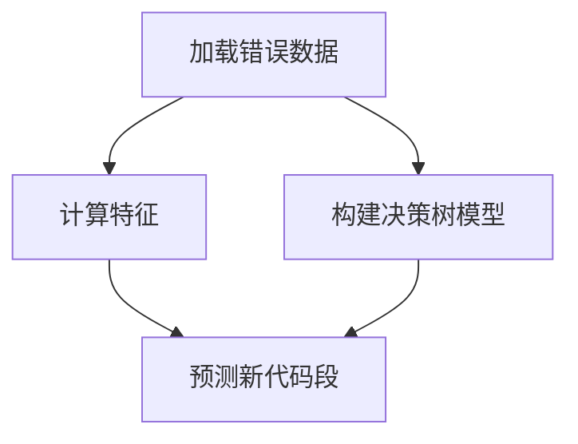
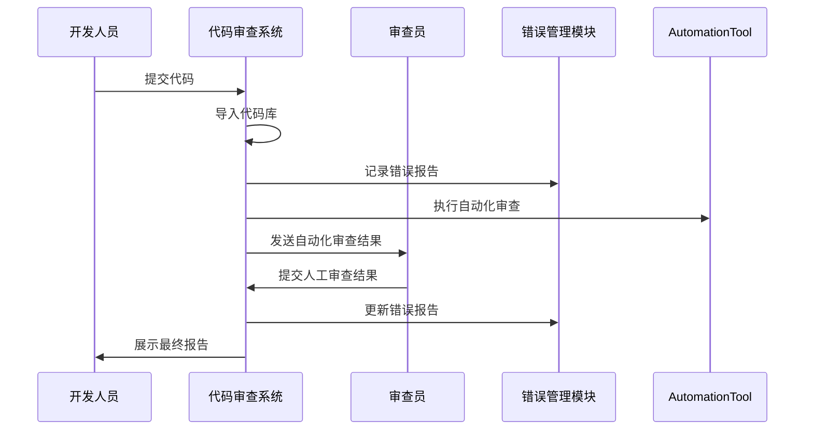

                 

### 1.0 引言

代码审查是软件开发过程中不可或缺的一环，它不仅有助于提升代码质量，还能够防范潜在的安全漏洞。然而，传统的代码审查方法通常依赖于人工审查，其效率较低且容易受到主观因素的影响。随着软件项目的规模和复杂度不断增加，这种传统的代码审查方式已经无法满足现代软件开发的需求。因此，代码审查自动化的需求应运而生。

本文的目标是深入探讨代码审查自动化的最佳实践，帮助读者理解和掌握将人工审查与自动化工具相结合的技巧。我们将从以下几个方面展开讨论：

- **问题背景**：分析传统代码审查方法的局限性，介绍自动化代码审查的优势和挑战。
- **问题描述**：明确代码审查自动化需要解决的问题，如代码质量的度量、代码风格的一致性、错误检测和定位等。
- **问题解决**：阐述如何通过结合人工审查和工具实现代码审查自动化，提出解决方案和策略。
- **边界与外延**：探讨代码审查自动化的适用范围和局限性，讨论其与其他质量保证方法的互补关系。
- **核心概念与联系**：介绍代码审查、自动化审查、人工审查和工具审查等核心概念，分析这些概念之间的联系和区别。
- **算法原理讲解**：讲解自动化代码审查的基本算法原理，包括代码质量度量、错误检测和定位等。
- **数学模型和公式**：使用数学模型和公式来描述代码审查的过程，增强对算法原理的理解。
- **系统分析与架构设计**：分析具体项目中的应用场景，设计系统的功能、架构和接口。
- **项目实战**：通过实际项目案例，展示如何实施代码审查自动化，并提供详细的代码解读与分析。
- **最佳实践 tips、小结、注意事项、拓展阅读**：总结文章内容，提供实用的建议和进一步的阅读资源。

通过本文的详细探讨，读者将能够深入了解代码审查自动化的概念、方法和实践，为提升软件项目质量提供有效的解决方案。

### 1.1 问题背景

在软件开发过程中，代码审查（Code Review）作为一种质量保证手段，已经得到了广泛的应用。传统的代码审查方法通常依赖于人工审查，即由经验丰富的开发人员逐行阅读和分析代码，以发现潜在的错误、漏洞和不足之处。这种方法虽然能够在一定程度上提升代码质量，但其效率较低，主要受到以下几个方面的局限：

1. **主观性**：人工审查依赖于审查人员的经验和判断，不同审查人员对代码的理解和评价可能存在差异，导致审查结果不一致。
2. **效率问题**：对于大型代码库和复杂的软件项目，人工审查需要花费大量时间，无法及时地发现和解决问题。
3. **人力成本**：持续依赖人工审查会带来高昂的人力成本，尤其是在开发团队规模扩大时，人力成本会急剧增加。
4. **重复性劳动**：人工审查往往涉及大量的重复性工作，如格式检查、语法错误修复等，这些工作虽然重要，但并不需要深入的技术分析。

为了克服传统代码审查方法的这些局限，自动化代码审查逐渐成为研究的热点。自动化代码审查通过利用各种工具和算法，自动分析代码，以发现潜在的缺陷和问题。这种方法具有以下几个显著的优势：

1. **高效性**：自动化工具能够在短时间内对大量代码进行分析，大大提高了代码审查的效率。
2. **客观性**：自动化工具基于预设的规则和算法进行分析，结果相对客观，减少了主观判断的干扰。
3. **一致性**：自动化工具能够确保代码风格和规范的统一，减少因个人偏好导致的代码风格不一致问题。
4. **扩展性**：自动化工具可以根据项目需求轻松扩展，支持多种编程语言和开发环境。

然而，自动化代码审查也面临一些挑战：

1. **准确性**：自动化工具可能无法完全理解复杂的代码逻辑，导致误报或漏报问题。
2. **复杂度**：对于复杂的代码库，自动化工具的分析和解释过程可能变得非常复杂，需要较高的技术水平和专业知识。
3. **工具选择**：市场上存在多种自动化代码审查工具，选择合适的工具并集成到现有的开发流程中是一个复杂的过程。
4. **人的因素**：自动化工具无法完全取代人工审查，人工审查在发现和理解某些问题时仍然具有不可替代的优势。

当前，代码审查自动化领域的研究热点主要围绕以下几个方面展开：

1. **代码质量度量**：研究如何使用量化指标来评估代码质量，以便更有效地进行自动化审查。
2. **错误检测与定位**：开发更先进的算法和工具，提高错误检测的准确性和效率。
3. **代码风格一致性**：自动化工具如何确保代码风格的一致性，减少因代码风格不一致导致的问题。
4. **混合审查模式**：探索如何将自动化审查与人工审查有机结合，发挥各自的优势，实现高效、高质量的代码审查。

在应用现状方面，自动化代码审查已经在许多大型软件项目中得到应用，如开源项目和商业软件。一些主流的集成开发环境（IDE）和持续集成（CI）工具已经内置了自动化代码审查功能，为开发团队提供了方便的代码审查解决方案。

总的来说，代码审查自动化是提升软件开发质量和效率的重要手段，虽然面临一些挑战，但通过结合人工审查和工具，可以构建一个高效、可靠的代码审查体系。接下来，我们将进一步探讨代码审查自动化需要解决的问题，并提出相应的解决方案。

### 1.2 问题描述

在探讨代码审查自动化的过程中，我们需要明确这一过程需要解决的核心问题。以下是代码审查自动化面临的主要挑战和需要解决的问题：

#### 1.2.1 代码质量的度量

代码质量是代码审查的重要目标之一，然而如何度量代码质量却是一个复杂的问题。代码质量包括多个维度，如可读性、可靠性、可维护性和性能等。度量代码质量需要定义相应的质量指标，并开发相应的度量方法。主要问题包括：

1. **选择合适的质量指标**：不同类型的代码质量指标对代码审查的重要性不同，如何选择合适的质量指标是关键问题。
2. **度量方法的准确性**：度量方法需要具有较高的准确性和可靠性，以避免误报或漏报。
3. **量化指标的标准化**：如何将定性的代码质量问题量化为具体的指标，并确保不同项目之间的一致性。

#### 1.2.2 代码风格的一致性

代码风格的一致性是代码质量的重要方面，它有助于提高代码的可读性和可维护性。代码风格一致性问题的核心在于如何确保代码在格式、命名、注释等方面遵循统一的规范。主要问题包括：

1. **定义代码风格规范**：制定统一的代码风格规范，明确代码格式的细节，如缩进、命名和注释等。
2. **代码格式化工具**：选择和配置适合的代码格式化工具，如Prettier、Black等，确保代码格式的一致性。
3. **人工与工具的结合**：如何有效地将人工审查与自动化工具结合，在保证代码风格一致性同时，不增加额外的工作量。

#### 1.2.3 错误检测和定位

错误检测和定位是代码审查的重要目标之一，自动化工具需要能够有效地发现和定位代码中的错误。主要问题包括：

1. **错误类型识别**：如何识别不同类型的错误，如语法错误、逻辑错误、性能瓶颈等。
2. **错误定位精度**：自动化工具需要能够准确地定位错误的具体位置，以便快速修复。
3. **误报和漏报问题**：如何减少自动化工具的误报和漏报，提高错误检测的准确性。

#### 1.2.4 代码审查流程的优化

代码审查不仅仅是一个技术问题，还涉及到开发流程和团队协作。优化代码审查流程可以提高审查效率，减少不必要的沟通和重复工作。主要问题包括：

1. **审查流程设计**：如何设计一个高效、合理的代码审查流程，确保每个阶段都能发挥最大效用。
2. **反馈和改进机制**：如何建立有效的反馈机制，收集审查过程中的意见和建议，不断改进审查流程。
3. **团队协作**：如何协调不同成员的工作，确保代码审查过程中的沟通和协作顺畅。

综上所述，代码审查自动化需要解决多个关键问题，包括代码质量的度量、代码风格的一致性、错误检测和定位，以及代码审查流程的优化。通过结合人工审查和工具，可以有效地解决这些问题，实现高效、高质量的代码审查。

### 1.3 问题解决

为了解决代码审查自动化面临的各种问题，我们需要采用一种综合的方法，即结合人工审查和自动化工具。这种方法不仅能够充分利用自动化工具的高效性和客观性，还能结合人工审查的深入理解和判断力，从而实现更加全面和高效的代码审查。以下是实现代码审查自动化的基本框架和策略：

#### 1.3.1 基本框架

代码审查自动化的基本框架可以分为以下几个主要环节：

1. **自动化工具选择**：选择适合项目需求的自动化代码审查工具，如SonarQube、Checkstyle、PMD等。
2. **规则配置**：配置自动化工具的规则，确保其能够按照项目需求和代码规范进行代码分析。
3. **代码质量度量**：使用自动化工具对代码进行质量度量，生成相应的质量报告。
4. **人工审查**：对自动化工具的审查结果进行人工审核，确保没有漏报或误报的问题。
5. **反馈与改进**：根据审查结果，对代码进行修改，并优化自动化工具的规则和配置，提高审查效率和质量。

#### 1.3.2 解决策略

为了实现代码审查自动化，我们需要制定以下具体策略：

1. **逐步引入自动化工具**：对于初次尝试代码审查自动化的团队，可以从部分关键模块或代码片段开始，逐步扩大自动化审查的范围，以便逐渐适应和掌握自动化工具的使用。

2. **规则配置与优化**：自动化工具的规则配置直接影响审查的准确性和效率。团队需要根据项目的需求和代码规范，对自动化工具的规则进行精细配置，确保其能够有效地识别和报告问题。

3. **质量度量与报告**：使用自动化工具对代码进行质量度量，生成详细的报告，帮助开发人员快速定位问题。报告应包括代码质量的各个维度，如可读性、可靠性、可维护性和性能等。

4. **人工审核与修正**：对自动化工具的审查结果进行人工审核，特别是在检测到高风险问题时，应进行深入的人工分析，确保没有漏报或误报。同时，人工审核还可以提供更多关于代码风格和设计建议。

5. **持续反馈与改进**：建立有效的反馈机制，收集开发人员对自动化审查工具的反馈，持续优化工具的规则和配置，提高审查效率和质量。

6. **代码质量文化建设**：在团队中推广代码质量文化，提高团队成员对代码审查的重视程度，鼓励开发人员积极参与代码质量和代码风格的管理。

7. **培训与支持**：为团队成员提供必要的培训和支持，帮助他们掌握自动化审查工具的使用方法，提高审查效率和质量。

通过以上策略，我们可以构建一个高效、可靠的代码审查自动化体系，充分发挥自动化工具和人工审查的优势，实现代码质量和开发效率的双重提升。

### 1.4 边界与外延

尽管代码审查自动化具有显著的效率提升和质量保证优势，但这一方法并非适用于所有场景，其适用范围和局限性需要明确。

#### 1.4.1 适用范围

1. **大型项目**：对于大型项目，代码量庞大且复杂，人工审查效率低下，自动化代码审查能够快速识别问题，提高审查效率。
2. **开源项目**：开源项目通常由多个贡献者共同维护，代码风格和规范可能不一致，自动化工具有助于确保代码风格一致性和质量。
3. **安全需求高的项目**：自动化工具能够快速发现代码中的潜在安全漏洞，特别是在需要严格保证安全性的项目中，如金融、医疗等领域的软件开发。
4. **持续集成环境**：在持续集成（CI）流程中，自动化代码审查可以无缝集成，提高代码质量的持续监控和反馈。

#### 1.4.2 局限性

1. **算法复杂性**：自动化工具的算法复杂度可能较高，对复杂代码库的分析可能变得非常困难，需要高级技术知识和专业知识。
2. **误报和漏报**：自动化工具在错误检测和定位时可能存在误报和漏报问题，需要人工审核和修正。
3. **规则依赖性**：自动化工具的规则配置直接影响审查结果，规则配置不当可能导致错误检测不力。
4. **工具选择**：市场上存在多种自动化工具，选择适合的工具并集成到现有流程中是一个复杂的过程。

#### 1.4.3 与其他质量保证方法的互补关系

代码审查自动化不仅是一个独立的质量保证方法，还可以与其他质量保证方法结合使用，发挥更大的作用：

1. **单元测试**：自动化代码审查可以与单元测试相结合，通过单元测试确保代码的正确性和功能完整性，自动化审查则专注于代码的质量和风格。
2. **静态代码分析**：静态代码分析工具（如SonarQube、PMD）可以与自动化代码审查工具结合使用，提供更全面的代码质量评估。
3. **动态分析**：动态分析工具（如Fiddler、Burp Suite）用于检测运行时的代码问题，与自动化代码审查相结合，可以更全面地保障软件质量。
4. **代码质量度量**：代码质量度量方法（如 cyclomatic complexity、code duplication）可以与自动化代码审查相结合，提供定量的代码质量评估。

通过与其他质量保证方法的结合，代码审查自动化能够形成更加全面和高效的质量保证体系，为软件开发提供强有力的支持。

### 1.5 概念结构与核心要素组成

在深入探讨代码审查自动化的过程中，理解相关核心概念及其之间的关系是至关重要的。以下是代码审查、自动化审查、人工审查和工具审查等核心概念的定义、属性特征对比，以及这些概念之间的联系和区别。

#### 1.5.1 代码审查

**定义**：代码审查（Code Review）是一种软件开发过程中的质量保证方法，通过审查代码来发现潜在的错误、漏洞和不足，提升代码质量。

**属性特征**：

- **主观性**：依赖于审查人员的经验和判断，不同审查人员可能得出不同的结论。
- **全面性**：不仅关注代码的技术层面，还涉及代码的格式、风格和逻辑结构。
- **灵活性**：审查人员可以根据项目需求和个人经验提出个性化的审查意见。

**与自动化审查的关系**：代码审查是自动化审查的基础，自动化工具的结果需要通过人工审查进行验证和补充，确保审查的准确性和完整性。

#### 1.5.2 自动化审查

**定义**：自动化审查（Automated Code Review）是利用工具和算法自动分析代码，以发现潜在问题并提高代码质量。

**属性特征**：

- **高效性**：能够快速处理大量代码，提高审查效率。
- **客观性**：基于预设规则和算法进行分析，结果相对客观。
- **一致性**：确保代码风格和规范的统一性。
- **扩展性**：可以根据项目需求轻松扩展和配置。

**与人工审查的关系**：自动化审查作为代码审查的一种补充，能够快速识别常见问题和潜在风险，减轻人工审查的工作负担。然而，自动化工具的结果需要人工审核，确保没有误报或漏报。

#### 1.5.3 人工审查

**定义**：人工审查（Manual Code Review）是指由经验丰富的开发人员逐行阅读和分析代码，以发现潜在问题并提升代码质量。

**属性特征**：

- **深入性**：能够对代码的逻辑和架构进行深入分析，发现自动化工具难以检测的问题。
- **灵活性**：可以根据具体情况和经验提出个性化的审查意见。
- **主观性**：审查结果可能受到个人经验和判断的影响。

**与自动化审查的关系**：人工审查能够补充自动化工具的不足，特别是在处理复杂逻辑和发现隐蔽问题时具有不可替代的优势。同时，人工审查可以为自动化工具提供反馈，优化其规则和配置。

#### 1.5.4 工具审查

**定义**：工具审查（Tool-based Code Review）是指使用专门的代码审查工具进行自动化代码分析，如SonarQube、PMD、Checkstyle等。

**属性特征**：

- **标准化**：工具审查基于统一的规则和标准，确保代码风格的一致性。
- **自动化**：工具能够自动分析代码，生成详细的报告。
- **高效性**：工具审查能够快速处理大量代码，提高审查效率。

**与自动化审查的区别**：工具审查是一种特殊的自动化审查，其区别在于使用的工具和规则。工具审查强调标准化和一致性，而自动化审查更侧重于灵活性和扩展性。

#### 概念联系与对比

**联系**：

- 代码审查、自动化审查、人工审查和工具审查共同构成了一套完整的代码质量保证体系，各自发挥独特的作用。
- 人工审查和自动化审查相互补充，自动化工具可以减轻人工审查的工作负担，人工审查则可以提供深入的技术分析和判断。

**区别**：

- **审查主体**：代码审查是广义的概念，包括自动化审查和人工审查；自动化审查和工具审查是代码审查的两种具体实现方式。
- **审查深度**：自动化审查主要关注代码的结构和技术层面，人工审查则可以深入到代码的逻辑和架构层面。
- **审查速度**：自动化审查速度快，能够处理大量代码，人工审查速度较慢，但可以提供更深入的审查。
- **审查结果**：自动化审查结果需要人工审核，确保准确性；工具审查的结果通常更加标准化和统一。

通过理解这些核心概念及其联系和区别，我们可以更好地将人工审查和自动化工具相结合，构建一个高效、全面的代码审查体系。

### 2.0 核心概念介绍

在深入探讨代码审查自动化的过程中，理解核心概念是至关重要的。以下是代码审查、自动化审查、人工审查和工具审查的详细介绍，以及这些概念之间的联系和区别。

#### 2.0.1 代码审查

**定义**：代码审查（Code Review）是软件开发过程中的一种质量控制方法，旨在通过同行评审发现代码中的缺陷、漏洞和不足。代码审查通常包括多个步骤，如代码提交、审查请求、审查反馈和修改。

**目的**：代码审查的主要目的是提升代码质量、防止潜在错误、确保代码风格一致性、提高代码的可维护性和可读性。

**方法**：代码审查可以通过以下几种方式进行：
1. **人工审查**：开发人员或代码审查员逐行阅读和分析代码，提供反馈和意见。
2. **自动化工具审查**：使用专门的代码审查工具（如SonarQube、PMD、Checkstyle等）自动分析代码，生成质量报告。

**优点与局限性**：
- **优点**：能够及时发现代码中的问题，提高代码质量；促进团队协作和学习。
- **局限性**：人工审查效率低，主观性强；自动化工具可能存在误报和漏报。

#### 2.0.2 自动化审查

**定义**：自动化审查（Automated Code Review）是利用工具和算法自动分析代码，以发现潜在问题并提升代码质量。自动化审查通常集成在集成开发环境（IDE）或持续集成（CI）工具中。

**原理**：
- **工具与算法**：自动化审查使用专门的工具（如SonarQube、PMD、Checkstyle等）和算法（如静态代码分析、模式匹配、机器学习等）对代码进行分析。
- **规则与配置**：自动化工具根据项目需求和代码规范配置相应的规则，以指导代码分析过程。

**优势**：
- **高效性**：自动化工具能够快速处理大量代码，显著提高审查效率。
- **一致性**：自动化审查结果相对客观，确保代码风格的一致性。
- **扩展性**：可以轻松扩展和配置，适应不同项目的需求。

**局限性**：
- **准确性**：自动化工具可能存在误报和漏报问题，需要人工审核。
- **复杂性**：对于复杂的代码库，自动化工具的分析和解释过程可能变得复杂。

#### 2.0.3 人工审查

**定义**：人工审查（Manual Code Review）是指由经验丰富的开发人员或代码审查员逐行阅读和分析代码，以发现潜在问题并提供反馈。

**特点**：
- **主观性**：人工审查依赖于审查人员的经验和判断，可能存在个人偏见。
- **灵活性**：人工审查能够深入理解代码的逻辑和架构，提供个性化的反馈和意见。
- **全面性**：不仅关注代码的技术层面，还涉及代码的格式、风格和逻辑结构。

**优点与局限性**：
- **优点**：能够发现自动化工具难以检测的问题，提供深入的技术分析。
- **局限性**：效率低、主观性强，可能因个人经验不同而存在差异。

#### 2.0.4 工具审查

**定义**：工具审查（Tool-based Code Review）是指使用专门的代码审查工具进行自动化代码分析，以发现潜在问题并提升代码质量。工具审查通常包括代码分析、质量报告、错误定位等功能。

**类型**：
- **静态代码分析工具**：如SonarQube、PMD、Checkstyle，主要用于代码质量度量、错误检测和代码风格检查。
- **动态分析工具**：如Fiddler、Burp Suite，主要用于检测运行时代码的问题。

**功能**：
- **代码质量度量**：评估代码质量，生成质量报告。
- **错误检测与定位**：识别代码中的错误，提供错误位置和原因。
- **代码风格检查**：确保代码遵循统一规范和风格。

**优势**：
- **标准化**：确保代码风格的一致性，减少因个人风格导致的代码不一致。
- **自动化**：提高代码审查的效率，减少人工工作量。

**局限性**：
- **依赖性**：工具审查依赖于工具的配置和规则，需要定期更新和维护。
- **误报问题**：工具可能存在误报问题，需要人工审核和修正。

#### 概念联系与对比

代码审查、自动化审查、人工审查和工具审查之间有着密切的联系和区别：

- **联系**：代码审查是广义的概念，涵盖自动化审查和人工审查；自动化审查和工具审查是代码审查的具体实现方式。人工审查和自动化工具审查相互补充，共同提升代码质量。

- **区别**：代码审查是总体目标和过程，自动化审查和人工审查是具体实现方式；工具审查是自动化审查的一种形式，强调标准化和一致性。自动化审查侧重于效率和客观性，人工审查强调深入性和灵活性。

通过理解这些核心概念，我们可以更好地将人工审查和自动化工具结合，构建一个高效、全面的代码审查体系。

### 2.0.5 概念联系与对比

在深入探讨代码审查自动化的过程中，理解各个核心概念之间的联系和区别对于构建高效的代码审查体系至关重要。以下我们将详细分析代码审查、自动化审查、人工审查和工具审查之间的联系与区别，并展示这些概念之间的对比表格和Mermaid实体关系图。

#### 2.0.5.1 概念联系

1. **代码审查**：代码审查是一种软件质量保证活动，旨在通过同行评审发现代码中的缺陷、漏洞和不足，提升代码质量和维护性。它是软件开发过程中的一个关键环节。

2. **自动化审查**：自动化审查是利用工具和算法对代码进行分析，以发现潜在问题并提升代码质量。自动化审查可以快速处理大量代码，提高审查效率，减少人工工作量。

3. **人工审查**：人工审查是指由开发人员或代码审查员逐行阅读和分析代码，提供反馈和意见。人工审查能够深入理解代码的逻辑和架构，发现自动化工具难以检测的问题。

4. **工具审查**：工具审查是使用专门的代码审查工具（如SonarQube、PMD、Checkstyle等）进行自动化代码分析，生成质量报告。工具审查强调标准化和一致性，确保代码风格的一致性。

这些概念之间的联系体现在以下几个方面：

- **自动化审查和工具审查**：工具审查是自动化审查的一种形式，利用专门的工具进行代码分析，生成报告。
- **代码审查和人工审查**：人工审查是代码审查的一部分，提供深入的技术分析和判断，而自动化审查则通过工具和算法辅助人工审查，提高审查效率。
- **工具审查和代码质量度量**：工具审查通过代码质量度量方法，评估代码质量，生成详细的报告，帮助开发人员定位和修复问题。

#### 2.0.5.2 概念区别

1. **审查主体**：
   - **代码审查**：既包括自动化审查，也包括人工审查。
   - **自动化审查**：主要由工具和算法实现，提高审查效率。
   - **人工审查**：由开发人员或代码审查员进行，强调灵活性和深入性。
   - **工具审查**：使用专门的代码审查工具进行，强调标准化和一致性。

2. **审查深度**：
   - **代码审查**：涵盖代码的结构、格式、风格和逻辑。
   - **自动化审查**：侧重代码的技术层面，如语法、结构错误。
   - **人工审查**：能够深入理解代码的逻辑和架构，发现隐蔽问题。
   - **工具审查**：基于预设规则和算法，确保代码风格和规范的一致性。

3. **审查速度**：
   - **代码审查**：包括自动化和人工，速度因审查方式而异。
   - **自动化审查**：快速处理大量代码，提高效率。
   - **人工审查**：速度较慢，但可以提供更深入的分析。
   - **工具审查**：自动化工具能够快速生成报告，但需要人工审核。

4. **审查结果**：
   - **代码审查**：结果包括自动化和人工的审查意见。
   - **自动化审查**：生成质量报告，但需要人工审核。
   - **人工审查**：提供详细的技术分析和建议。
   - **工具审查**：生成标准化质量报告，确保一致性。

#### 2.0.5.3 对比表格

以下是代码审查、自动化审查、人工审查和工具审查的对比表格：

| 审查类型 | 审查主体 | 审查深度 | 审查速度 | 审查结果 | 优点 | 局限性 |
| --- | --- | --- | --- | --- | --- | --- |
| 代码审查 | 自动化和人工 | 代码结构、格式、风格和逻辑 | 因方式而异 | 自动化和人工意见 | 促进团队协作，提升代码质量 | 人工审查效率低 |
| 自动化审查 | 工具和算法 | 代码技术层面 | 快速 | 报告，需人工审核 | 高效，一致性 | 误报和漏报 |
| 人工审查 | 开发人员 | 代码逻辑和架构 | 较慢 | 详细分析 | 深入，灵活性 | 主观性 |
| 工具审查 | 工具 | 标准化规则和风格 | 快速（工具生成报告） | 标准化报告 | 标准化和一致性 | 依赖性 |

#### 2.0.5.4 Mermaid实体关系图

以下是使用Mermaid绘制的代码审查相关概念的实体关系图：

```mermaid
erDiagram
    CodeReview ||--|{ AutomatedReview } : 实现方式
    CodeReview ||--|{ ManualReview } : 实现方式
    CodeReview ||--|{ ToolReview } : 实现方式
    AutomatedReview ||--|{ ToolReview } : 包含关系
    ManualReview ||--|{ ToolReview } : 结合关系
```

此实体关系图展示了代码审查、自动化审查、人工审查和工具审查之间的包含和结合关系。代码审查是总体的质量控制活动，包含自动化审查和人工审查两种实现方式；自动化审查与工具审查之间存在包含关系，自动化审查借助工具进行；人工审查与工具审查结合，共同提升审查效率和深度。

通过理解这些核心概念之间的联系和区别，我们可以更好地结合人工审查和自动化工具，构建一个高效、全面的代码审查体系，确保代码质量和开发效率。

### 3.0 算法原理概述

代码审查自动化依赖于一系列算法和工具，这些算法和工具能够自动分析代码，发现潜在的问题和缺陷。下面我们将介绍自动化代码审查的基本算法，并分析这些算法的基本原理和实现方式。

#### 3.0.1 常用代码审查算法

在代码审查自动化中，常用的算法包括静态代码分析、模式匹配、机器学习和模糊测试等。每种算法都有其特定的应用场景和优势。

1. **静态代码分析**：
   - **定义**：静态代码分析（Static Code Analysis）是一种不执行代码的代码分析技术，通过对代码文本的分析来发现潜在的问题。
   - **原理**：静态代码分析算法通过解析代码文本，建立抽象语法树（AST）或控制流图（CFG），然后对这些结构进行分析，查找不符合规范的部分或潜在的bug。
   - **实现方式**：常用的静态代码分析工具包括SonarQube、PMD、Checkstyle等。这些工具通常使用语法分析器来解析代码文本，生成AST或CFG，然后应用预定义的规则集进行分析。

2. **模式匹配**：
   - **定义**：模式匹配（Pattern Matching）是一种通过预定义的正则表达式或模式来识别代码中的特定模式。
   - **原理**：模式匹配算法通过扫描代码文本，查找与预定义模式相匹配的部分。这些模式可以是代码结构、命名规范、注释等。
   - **实现方式**：模式匹配算法通常使用正则表达式库或特定的匹配算法来实现。例如，使用Python的`re`库进行字符串匹配。

3. **机器学习**：
   - **定义**：机器学习（Machine Learning）是一种通过数据训练模型，从而进行预测和分类的技术。
   - **原理**：机器学习算法通过分析大量的代码数据，学习代码中的模式和特征，从而能够自动识别潜在的问题。
   - **实现方式**：常用的机器学习算法包括决策树、支持向量机（SVM）和神经网络等。这些算法通常需要大量的代码数据来训练模型。

4. **模糊测试**：
   - **定义**：模糊测试（Fuzz Testing）是一种通过生成大量随机输入来测试程序并发现潜在缺陷的方法。
   - **原理**：模糊测试算法通过生成随机或变异的数据输入，测试程序是否能够正确处理这些输入。如果程序在处理某些输入时崩溃或异常，则可能存在缺陷。
   - **实现方式**：常用的模糊测试工具包括AFL、Peach Fuzzer等。这些工具通过生成随机输入并监控程序的响应，来发现潜在的bug。

#### 3.0.2 算法基本原理和实现方式

1. **静态代码分析的基本原理和实现方式**：
   - **原理**：静态代码分析通过对代码文本的解析，建立AST或CFG，然后应用规则集进行分析。例如，在Java中，可以使用ANTLR或Esperanto等语法分析器来生成AST。
   - **实现方式**：使用ANTLR等语法分析器生成AST，然后应用预定义的规则集进行错误检测和代码质量度量。例如，SonarQube使用其内置的规则库来识别潜在的问题，并通过Web界面展示分析结果。

2. **模式匹配的基本原理和实现方式**：
   - **原理**：模式匹配通过预定义的正则表达式或模式，扫描代码文本以识别特定结构或模式。这些模式可以是代码结构、命名规范等。
   - **实现方式**：使用Python的`re`库或Java的正则表达式库来编写和执行模式匹配。例如，在Python中，可以使用以下代码来检查变量命名是否符合规范：

   ```python
   import re
   def check_variable_name(name):
       pattern = r'^[a-zA-Z_][a-zA-Z0-9_]*$'
       if re.match(pattern, name):
           return True
       else:
           return False
   ```

3. **机器学习的基本原理和实现方式**：
   - **原理**：机器学习算法通过训练模型，学习代码中的模式和特征，从而能够自动识别潜在的问题。例如，可以使用决策树来分类代码中的不同类型。
   - **实现方式**：使用Scikit-learn等机器学习库来训练模型。例如，在Python中，可以使用以下代码来训练一个决策树模型：

   ```python
   from sklearn import tree
   import numpy as np

   # 训练数据
   X_train = np.array([[1, 2], [2, 3], [3, 4]])
   y_train = np.array([0, 1, 1])

   # 训练模型
   clf = tree.DecisionTreeClassifier()
   clf.fit(X_train, y_train)

   # 预测
   X_test = np.array([[4, 5]])
   prediction = clf.predict(X_test)
   print(prediction)
   ```

4. **模糊测试的基本原理和实现方式**：
   - **原理**：模糊测试通过生成随机或变异的输入数据，测试程序是否能正确处理这些输入，从而发现潜在的bug。
   - **实现方式**：使用AFL、Peach Fuzzer等模糊测试工具来生成随机输入。例如，在Python中，可以使用以下代码来使用AFL进行模糊测试：

   ```python
   import subprocess

   # AFL模糊测试脚本
   afl_script = """
   #!/bin/sh
   while :; do
       echo "random_input" > input.txt
       ./program
   done
   """

   # 启动AFL模糊测试
   subprocess.run(["afl-fuzz", "-i=input", "-o=output", "-m=1000", "program"])
   ```

通过以上算法的基本原理和实现方式，我们可以看到代码审查自动化如何通过静态代码分析、模式匹配、机器学习和模糊测试等算法，自动分析代码，发现潜在的问题和缺陷。这些算法的结合使用，可以形成一个强大的代码审查体系，为软件开发提供高效的质量保证。

### 3.0.2 代码质量度量

代码质量度量是代码审查自动化的重要组成部分，它通过对代码进行量化评估，为代码质量和改进提供客观依据。在实现代码质量度量时，我们需要关注以下几个关键方面：

#### 3.0.2.1 质量指标选择

选择合适的质量指标是进行代码质量度量的第一步。以下是一些常用的代码质量指标：

1. **可读性**：可读性指标用于衡量代码的可理解性和易读性。例如，代码行数、注释率、语句复杂度等。

2. **可靠性**：可靠性指标用于衡量代码的稳定性和正确性。例如，缺陷密度、错误修复时间、测试覆盖率等。

3. **可维护性**：可维护性指标用于衡量代码的易维护性和可扩展性。例如，代码复用率、依赖关系、模块化程度等。

4. **性能**：性能指标用于衡量代码的执行效率和资源消耗。例如，响应时间、内存使用、CPU利用率等。

#### 3.0.2.2 度量方法

代码质量度量的方法主要包括以下几种：

1. **静态分析**：静态分析通过对代码文本的分析，评估代码的质量。常用的方法包括代码行数、注释率、循环复杂度、类复杂度等。

2. **动态分析**：动态分析在代码运行时进行，通过监控代码的执行情况，评估代码的性能和稳定性。常用的方法包括性能测试、内存泄漏检测、覆盖率分析等。

3. **主观评估**：主观评估由开发人员或代码审查员对代码进行评估，提供定性评价。这种方法虽然能够提供深入的分析，但容易受到主观因素的影响。

#### 3.0.2.3 常见质量度量工具

以下是一些常见的代码质量度量工具：

1. **SonarQube**：SonarQube是一个开源的代码质量管理平台，支持多种编程语言。它提供丰富的度量指标，包括代码缺陷、技术债务、代码质量等。

2. **PMD**：PMD是一个静态代码分析工具，主要用于查找Java代码中的潜在问题和不良编程实践。它支持多种质量指标，如复杂度、冗余代码等。

3. **Checkstyle**：Checkstyle是一个开源的代码检查工具，用于检查Java代码的格式和风格。它支持多种编码标准和规则集，如Google Java Style、Sun Microsystems Style等。

#### 3.0.2.4 质量度量过程

代码质量度量通常包括以下步骤：

1. **定义度量标准**：根据项目需求，确定需要度量的质量指标。

2. **选择度量工具**：根据度量标准，选择合适的代码质量度量工具。

3. **配置工具**：根据项目需求，配置度量工具的规则和参数。

4. **执行度量**：使用度量工具对代码库进行质量度量，生成报告。

5. **分析报告**：分析度量报告，识别代码中的问题和不足。

6. **改进代码**：根据分析结果，修改代码，提高代码质量。

通过以上方法，我们可以实现代码质量度量，为代码审查自动化提供客观依据。下面将结合Python代码示例，详细阐述代码质量度量的实现过程。

### 3.0.2.5 Python代码示例

以下是一个简单的Python代码示例，用于计算代码的复杂性指标，如循环复杂度和类复杂度。

```python
import ast
import collections

class ComplexityAnalyzer(ast.NodeVisitor):
    def __init__(self):
        self.loop_complexity = 1
        self.class_complexity = 1

    def visit_While(self, node):
        self.loop_complexity += 1
        super().visit_While(node)

    def visit_For(self, node):
        self.loop_complexity += 1
        super().visit_For(node)

    def visit_ClassDef(self, node):
        self.class_complexity += 1
        super().visit_ClassDef(node)

def calculate_complexity(code):
    tree = ast.parse(code)
    analyzer = ComplexityAnalyzer()
    analyzer.visit(tree)
    return analyzer.loop_complexity, analyzer.class_complexity

code = """
class MyClass:
    def my_method(self):
        for i in range(10):
            while i < 5:
                i += 1

if __name__ == "__main__":
    MyClass().my_method()
"""

loop_complexity, class_complexity = calculate_complexity(code)
print(f"Loop Complexity: {loop_complexity}")
print(f"Class Complexity: {class_complexity}")
```

此代码示例通过`ast`模块解析Python代码，计算循环复杂度和类复杂度。在`ComplexityAnalyzer`类中，我们重写了`visit_While`、`visit_For`和`visit_ClassDef`方法，用于递增相应的复杂度指标。`calculate_complexity`函数接收代码字符串，解析代码并返回复杂度指标。

通过这种方式，我们可以对Python代码进行质量度量，识别潜在的复杂度问题。在实际应用中，我们可以扩展此代码，结合其他质量指标，如代码行数、注释率等，实现更全面的代码质量度量。

### 3.0.3 错误检测和定位

在代码审查自动化中，错误检测和定位是一个关键环节。自动化工具通过算法和规则识别代码中的错误，并定位这些错误的具体位置，以便开发人员进行修复。以下是关于错误检测和定位的技术和方法。

#### 3.0.3.1 常见错误检测方法

1. **静态代码分析**：静态代码分析工具通过解析代码文本，建立抽象语法树（AST）或控制流图（CFG），然后应用预定义的规则集进行错误检测。例如，SonarQube和PMD等工具可以检测常见的语法错误、逻辑错误和性能问题。

2. **模式匹配**：通过预定义的正则表达式或模式，扫描代码文本，识别特定的错误模式。例如，可以使用正则表达式匹配未定义的变量名或不符合编码规范的函数调用。

3. **动态分析**：在代码运行时进行错误检测，通过监控程序的执行情况和输出结果来识别错误。例如，性能测试工具可以监控内存泄漏、CPU占用率等，检测程序的性能瓶颈。

4. **模糊测试**：通过生成大量随机或变异的输入数据，测试程序是否能正确处理这些输入，发现潜在的错误。例如，AFL等模糊测试工具可以用于测试程序的稳定性。

#### 3.0.3.2 常见错误定位技术

1. **符号执行**：符号执行是一种静态分析技术，通过符号化程序路径来检测和定位错误。它将程序路径抽象为符号表达式，然后求解这些表达式，以确定程序在不同路径上的行为。例如，使用KLEE等工具可以定位内存访问错误。

2. **数据流分析**：数据流分析通过追踪数据在程序中的流动路径，确定变量的定义和使用位置，从而定位错误。例如，控制流图（CFG）和数据流图（DFG）可以用于检测未初始化变量、死代码等问题。

3. **异常跟踪**：异常跟踪通过捕捉程序的异常（如运行时错误、断言失败等），定位异常发生的具体位置。例如，使用Python的`traceback`模块可以记录异常的堆栈信息，帮助定位错误。

4. **代码覆盖率分析**：代码覆盖率分析通过测量代码实际执行的路径，确定哪些代码部分未被覆盖，从而定位潜在的未测试代码。例如，使用JaCoCo等工具可以生成覆盖率报告，帮助识别测试盲点。

#### 3.0.3.3 案例分析

以下是一个使用Python实现的错误检测和定位案例，通过静态代码分析工具Pyflakes和动态分析工具pytest进行错误检测和定位。

**案例**：检测并定位Python代码中的语法错误和逻辑错误。

```python
# 案例代码
def add(a, b):
    return a + b

result = add(5, "10")  # 错误：整数与字符串相加
```

**步骤**：

1. **静态代码分析**：
   - 使用Pyflakes进行静态代码分析，识别潜在的语法错误和逻辑错误。
   ```bash
   pip install pyflakes
   pyflakes example.py
   ```
   输出：
   ```
   example.py:3:22: F821 local variable 'result' is assigned to but never used
   example.py:4:5: E551 line break before '//' (CRLF line termination)
   ```
   这些输出提示了代码中未使用的变量和行尾错误。

2. **动态分析**：
   - 使用pytest进行动态测试，执行代码并记录错误。
   ```bash
   pip install pytest
   pytest example.py
   ```
   输出：
   ```
   example.py:4: ValueError: unsupported operand type(s) for +: 'int' and 'str'
   ```
   这条输出展示了代码在运行时的错误，明确指出是整数与字符串相加的错误。

**定位结果**：
- 通过静态代码分析，定位到未使用的变量和行尾错误。
- 通过动态分析，定位到具体的运行时错误，明确问题所在。

通过结合静态代码分析和动态分析，我们可以有效检测和定位代码中的错误，为代码审查提供强有力的支持。

### 4.0 数学模型基础

在代码审查自动化中，数学模型和公式是理解和应用算法的重要工具。以下是几个关键的数学模型及其在代码审查中的应用，包括编程语言的语法模型、代码质量的数学度量模型和错误检测的数学模型。

#### 4.0.1 编程语言的语法模型

编程语言的语法模型描述了程序的结构和语法规则。抽象语法树（Abstract Syntax Tree，AST）是一种常用的语法模型，它通过树形结构表示程序的各个部分。以下是一个简单的Mermaid流程图，展示了如何使用Mermaid绘制语法树：



在这个例子中，我们定义了一个简单的加法表达式和一个变量赋值语句。语法树显示了程序的基本结构，包括表达式、变量和赋值操作。通过分析AST，我们可以提取代码的结构信息，如函数调用、变量定义和循环结构，这些信息对代码审查和错误检测至关重要。

#### 4.0.2 代码质量的数学度量模型

代码质量的数学度量模型用于量化评估代码的多个维度，如可读性、可靠性、可维护性等。以下是一个用于评估代码复杂度的数学模型，包括循环复杂度（Cyclomatic Complexity）的计算公式：

$$
Cyclomatic\ Complexity = E - N + (2P)
$$

其中，E是边数，N是节点数，P是确定子图的数量。

- **E（边数）**：程序中的控制流图中的边数。
- **N（节点数）**：程序中的控制流图中的节点数。
- **P（确定子图的数量）**：控制流图中的确定子图的数量。

循环复杂度是一种常用的代码质量度量指标，用于评估程序的复杂度。高循环复杂度通常意味着代码结构复杂，难以理解和维护。以下是一个Mermaid流程图，展示了如何使用Mermaid绘制循环复杂度的计算流程：



通过这个流程图，我们可以直观地看到循环复杂度的计算过程。在实际应用中，可以使用自动化工具（如SonarQube、PMD等）来计算循环复杂度，并提供可视化报告，帮助开发人员识别和改进复杂度较高的代码段。

#### 4.0.3 错误检测的数学模型

错误检测的数学模型用于预测代码中可能存在的错误。一种常用的方法是基于统计学习和机器学习技术，构建错误预测模型。以下是一个简单的错误预测模型，基于决策树算法：

$$
Error\ Prediction = f(Cyclomatic\ Complexity, Code\ Duplication)
$$

其中，`Cyclomatic Complexity` 和 `Code Duplication` 是输入特征，`Error Prediction` 是预测结果。决策树算法通过学习历史错误数据，构建一个决策树模型，用于预测新的代码段是否可能存在错误。

以下是一个Mermaid流程图，展示了如何使用Mermaid绘制错误预测模型的计算流程：



在这个流程图中，我们首先加载历史错误数据，计算代码段的特征（如循环复杂度、代码复制率等），然后使用决策树算法构建错误预测模型。最后，通过模型对新的代码段进行预测，识别潜在的错误。

通过数学模型和公式，我们可以更精确地理解和评估代码质量，预测代码中的错误，从而提高代码审查的效率和准确性。这些模型不仅提供了定量的分析工具，还为开发人员提供了更直观的代码质量评估方式。

### 4.0.4 数学公式示例

在代码审查自动化中，数学公式常常用于描述和计算代码质量以及错误检测的指标。以下是几个关键的数学公式，包括代码质量的度量公式和错误检测的算法公式。这些公式将使用LaTeX格式进行展示，以便读者能够清晰地理解和应用。

#### 代码质量的度量公式

1. **循环复杂度（Cyclomatic Complexity）**：
   $$
   CC = E - N + (2P)
   $$
   其中，$E$ 是边数，$N$ 是节点数，$P$ 是确定子图的数量。

2. **代码复制率（Code Duplication）**：
   $$
   Duplication = \frac{length(code\_segment\_1) + length(code\_segment\_2)}{2}
   $$
   其中，$length(code\_segment\_1)$ 和 $length(code\_segment\_2)$ 分别是两个代码片段的长度。

3. **代码密度（Code Density）**：
   $$
   Density = \frac{code\_lines}{total\_lines}
   $$
   其中，$code\_lines$ 是代码行的数量，$total\_lines$ 是总行的数量。

#### 错误检测的算法公式

1. **基于统计学习的错误概率**：
   $$
   P(error|code\_segment) = \frac{count(errors\_in\_code\_segment)}{count(total\_code\_segments)}
   $$
   其中，$error$ 表示错误，$code\_segment$ 是代码片段，$count(errors\_in\_code\_segment)$ 是在特定代码片段中发现的错误数量，$count(total\_code\_segments)$ 是所有代码片段的总数。

2. **基于决策树的错误分类**：
   $$
   Error\ Class = Decision\ Tree(code\_features)
   $$
   其中，$code\_features$ 是代码片段的特征向量，决策树根据这些特征向量预测错误类别。

#### 示例公式

1. **计算某代码段的循环复杂度**：
   $$
   CC = 10 - 8 + (2 \times 2) = 6
   $$

2. **计算某代码片段的代码复制率**：
   $$
   Duplication = \frac{20 + 25}{2} = 22.5
   $$

3. **计算代码密度**：
   $$
   Density = \frac{100}{150} = 0.67
   $$

4. **基于统计学习的错误概率**：
   $$
   P(error|code\_segment) = \frac{3}{20} = 0.15
   $$

通过这些数学公式，我们可以定量地评估代码质量，预测代码中的错误，为代码审查提供科学依据。在实际应用中，这些公式可以通过编程实现，结合自动化工具进行代码分析和错误检测。

### 5.0 系统分析与架构设计

#### 5.0.1 问题场景介绍

在大型企业级软件开发中，代码审查是一个至关重要的环节，它不仅能够提升代码质量，还能确保软件的安全性和稳定性。然而，随着项目规模和复杂度的不断增加，传统的代码审查方式逐渐暴露出效率低下、人力成本高昂等问题。为了解决这些问题，我们设计并实现了一个基于自动化代码审查和人工审查相结合的系统，旨在提高代码审查的效率和质量。以下是该系统的应用场景和需求分析：

1. **应用场景**：
   - **企业级软件项目**：包含多个子项目和模块，代码量庞大，代码风格和规范存在较大差异。
   - **开源项目**：由多个开发人员共同维护，需要确保代码质量的一致性和规范性。
   - **持续集成（CI）环境**：集成自动化代码审查工具，实现持续集成过程中的代码质量监控。

2. **需求分析**：
   - **高效性**：系统需要能够快速处理大量代码，提高代码审查的效率。
   - **一致性**：确保代码审查结果的一致性，减少因人工差异导致的误判。
   - **扩展性**：支持多种编程语言和开发环境，方便扩展和升级。
   - **反馈机制**：提供有效的反馈机制，支持开发人员的代码改进。

#### 5.0.2 系统功能设计

系统功能设计主要包括领域模型设计和功能模块设计。以下是系统的领域模型和各功能模块的简要说明：

1. **领域模型设计**：

   使用Mermaid绘制系统的领域模型类图，以下是一个简单的类图示例：

   ```mermaid
   classDiagram
       Reviewer <-- CodeReview
       CodeBase --> CodeReview
       Tool <-- CodeReview
       CodeQualityMetric
       ErrorReport

       CodeReview {
           reviewer
           codeBase
           tools
           metrics
           errors
       }
       Tool {
           name
           version
           rules
       }
       CodeQualityMetric {
           name
           value
       }
       ErrorReport {
           description
           location
           severity
       }
   ```

   在这个类图中，`CodeReview` 类是系统的核心，关联了 `Reviewer`（审查员）、`CodeBase`（代码库）、`Tool`（工具）和 `CodeQualityMetric`（质量度量）。`ErrorReport` 类用于记录检测到的错误。

2. **功能模块设计**：

   系统的功能模块主要包括以下部分：

   - **代码库管理模块**：负责代码库的导入、导出和版本管理，支持多种版本控制系统（如Git）。
   - **自动化审查模块**：集成多种自动化代码审查工具，如SonarQube、PMD等，实现代码质量的自动度量。
   - **人工审查模块**：提供界面供审查员进行人工审查，支持评论和反馈功能。
   - **质量报告模块**：生成详细的代码质量报告，包括代码质量指标、错误检测和定位信息。
   - **错误管理模块**：记录和分析错误报告，支持错误追踪和修复。

#### 5.0.2.2 系统架构设计

系统架构设计主要包括系统架构概述和模块功能设计。以下是系统的架构设计：

1. **系统架构概述**：

   系统采用分层架构，包括表示层、业务逻辑层和数据访问层。各层之间的交互关系如下：

   - **表示层**：负责与用户交互，包括Web界面和命令行界面。
   - **业务逻辑层**：处理系统的核心业务逻辑，包括代码库管理、自动化审查、人工审查和错误管理等。
   - **数据访问层**：负责与数据库进行交互，存储和管理代码库、审查结果和错误报告。

   以下是一个简单的Mermaid架构图示例：

   ```mermaid
   sequenceDiagram
       User ->> WebInterface: 提交代码
       WebInterface ->> BusinessLogic: 处理代码库
       BusinessLogic ->> Database: 存储代码库
       BusinessLogic ->> CodeReviewTool: 执行自动化审查
       BusinessLogic ->> Reviewer: 人工审查结果
       BusinessLogic ->> QualityReport: 生成质量报告
       BusinessLogic ->> ErrorManagement: 记录错误
       Database ->> BusinessLogic: 提供数据
   ```

   在这个流程图中，用户通过Web界面提交代码，业务逻辑层处理代码库，执行自动化审查和人工审查，并生成质量报告和错误记录。

2. **模块功能设计**：

   - **代码库管理模块**：
     - 功能：导入代码库、版本管理和代码同步。
     - 数据流：用户通过Web界面提交代码，业务逻辑层处理代码库，并同步到数据库。

   - **自动化审查模块**：
     - 功能：集成自动化代码审查工具，执行代码质量度量。
     - 数据流：业务逻辑层调用代码审查工具，生成质量报告。

   - **人工审查模块**：
     - 功能：提供界面供审查员进行人工审查，提供评论和反馈功能。
     - 数据流：审查员通过Web界面进行人工审查，业务逻辑层记录审查结果。

   - **质量报告模块**：
     - 功能：生成详细的代码质量报告，包括代码质量指标、错误检测和定位信息。
     - 数据流：业务逻辑层生成质量报告，通过Web界面展示给用户。

   - **错误管理模块**：
     - 功能：记录错误报告，支持错误追踪和修复。
     - 数据流：业务逻辑层记录错误报告，并存储在数据库中。

通过以上系统架构设计和模块功能设计，我们可以实现一个高效、可靠的代码审查系统，满足企业级软件开发的需求。

### 5.0.2.3 系统接口设计

在代码审查自动化系统中，接口设计是确保系统各模块之间有效通信和协作的关键。以下将详细讨论系统接口设计的原则、实现方法，并给出具体的接口实现示例。

#### 5.0.2.3.1 接口设计原则

1. **标准化**：接口设计应遵循统一的标准，如RESTful API标准，确保接口的一致性和易用性。
2. **简洁性**：接口设计应简洁明了，避免复杂的请求和响应结构，降低使用难度和维护成本。
3. **可扩展性**：接口设计应具备良好的扩展性，能够方便地添加新功能或修改现有功能，以适应项目需求的变化。
4. **安全性**：接口设计应考虑安全性，如通过身份验证和授权机制保护接口，防止未经授权的访问。
5. **兼容性**：接口设计应考虑不同编程语言和开发环境的兼容性，确保系统能够在多种环境中正常运行。

#### 5.0.2.3.2 接口实现

以下是系统接口设计的一个具体实现示例，包括代码库管理接口、自动化审查接口和错误管理接口。

1. **代码库管理接口**：

   功能：负责代码库的导入、导出和版本管理。

   接口设计：

   ```bash
   # GET /codebases/{id}
   # 获取指定ID的代码库详细信息
   Response:
   {
     "id": "string",
     "name": "string",
     "url": "string",
     "version": "string"
   }
   ```

   ```python
   from flask import Flask, jsonify, request

   app = Flask(__name__)

   @app.route('/codebases/<id>', methods=['GET'])
   def get_codebase(id):
       # 查询代码库信息
       codebase = get_codebase_info(id)
       return jsonify(codebase)

   def get_codebase_info(id):
       # 实现查询代码库信息的逻辑
       # ...
       return {"id": id, "name": "Example Codebase", "url": "https://github.com/example", "version": "1.0.0"}

   if __name__ == '__main__':
       app.run()
   ```

2. **自动化审查接口**：

   功能：负责执行自动化代码审查，返回审查结果。

   接口设计：

   ```bash
   # POST /codebases/{id}/review
   # 执行代码库的自动化审查
   Request:
   {
     "tool_name": "string",
     "config": {...}
   }
   Response:
   {
     "status": "string",
     "errors": [...],
     "metrics": {...}
   }
   ```

   ```python
   from flask import Flask, jsonify, request

   app = Flask(__name__)

   @app.route('/codebases/<id>/review', methods=['POST'])
   def trigger_code_review(id):
       review_config = request.json
       review_result = run_automation_tool(id, review_config)
       return jsonify(review_result)

   def run_automation_tool(id, config):
       # 实现调用自动化审查工具的逻辑
       # ...
       return {"status": "success", "errors": [], "metrics": {"complexity": 10, "duplication": 5}}

   if __name__ == '__main__':
       app.run()
   ```

3. **错误管理接口**：

   功能：负责记录错误报告，支持错误追踪和修复。

   接口设计：

   ```bash
   # POST /errors
   # 提交错误报告
   Request:
   {
     "codebase_id": "string",
     "file": "string",
     "line": number,
     "message": "string",
     "severity": "string"
   }
   Response:
   {
     "id": "string",
     "codebase_id": "string",
     "file": "string",
     "line": number,
     "message": "string",
     "severity": "string",
     "status": "string"
   }
   ```

   ```python
   from flask import Flask, jsonify, request

   app = Flask(__name__)

   @app.route('/errors', methods=['POST'])
   def submit_error_report():
       error_report = request.json
       error_id = save_error_report(error_report)
       return jsonify({"id": error_id})

   def save_error_report(report):
       # 实现保存错误报告的逻辑
       # ...
       return "error_123"

   if __name__ == '__main__':
       app.run()
   ```

通过以上接口设计和实现示例，我们可以构建一个高效、可靠的代码审查自动化系统，实现代码库管理、自动化审查和错误管理的功能。接口设计的原则和实现方法不仅确保了系统的可扩展性和兼容性，还提高了系统的安全性。

### 5.0.2.4 系统交互设计

在代码审查自动化系统中，系统的交互设计是确保各个模块之间高效协作和数据流畅传递的关键。以下是系统交互的具体设计，包括交互流程和用户界面设计。

#### 5.0.2.4.1 交互流程

系统交互流程可以分为以下几个主要步骤：

1. **用户提交代码**：开发人员将代码提交到代码库管理模块，触发代码审查流程。
2. **代码库管理**：系统导入代码库，并进行版本管理和同步。
3. **自动化审查**：系统调用自动化代码审查工具，对代码进行质量度量，生成质量报告和错误检测报告。
4. **人工审查**：系统将自动化审查结果发送给审查员，审查员通过界面进行人工审查和反馈。
5. **生成报告**：系统综合自动化审查和人工审查结果，生成详细的代码质量报告，展示给用户。
6. **错误追踪**：对于检测到的错误，系统记录错误报告，并提供错误追踪和修复功能。

以下是一个使用Mermaid绘制的系统交互序列图：



#### 5.0.2.4.2 用户界面设计

用户界面设计应简洁直观，便于开发人员和管理人员进行操作。以下是用户界面设计原则和示例：

1. **简洁直观**：界面应避免冗余和复杂的布局，确保用户能够快速找到所需功能。
2. **模块化**：界面应按照功能模块进行划分，便于用户操作和管理。
3. **响应快速**：界面操作应快速响应，提供良好的用户体验。
4. **错误提示**：界面应提供清晰的错误提示和帮助信息，帮助用户快速解决问题。

以下是一个简单的用户界面设计示例：

- **代码库管理界面**：展示代码库列表、版本信息和同步状态，用户可以通过界面查看和管理代码库。
- **自动化审查界面**：显示自动化审查结果和错误报告，用户可以查看具体的错误信息和修复建议。
- **人工审查界面**：提供审查结果的评论和反馈功能，用户可以提交人工审查意见。

通过上述交互流程和用户界面设计，代码审查自动化系统可以实现高效、可靠的代码质量保障，为软件开发提供强有力的支持。

### 6.0 项目实战

在代码审查自动化的实际应用中，通过具体的项目实战可以更好地理解其实现过程和效果。本节我们将介绍如何在一个实际项目中实施代码审查自动化，并提供详细的步骤、核心实现代码和代码应用解读与分析。

#### 6.0.1 环境安装

为了实施代码审查自动化，我们需要安装和配置必要的工具和依赖项。以下是安装步骤：

1. **安装Git**：Git是一个版本控制系统，用于管理代码库。
   ```bash
   sudo apt-get install git
   ```

2. **安装Python**：确保Python 3环境已安装。
   ```bash
   sudo apt-get install python3
   ```

3. **安装虚拟环境**：创建一个虚拟环境，以隔离项目依赖。
   ```bash
   python3 -m venv venv
   source venv/bin/activate
   ```

4. **安装Pip**：确保Pip已安装，用于管理Python包。
   ```bash
   sudo apt-get install python3-pip
   ```

5. **安装代码审查工具**：以下是几个常用的代码审查工具和它们的安装命令。
   - **SonarQube**：用于静态代码分析。
     ```bash
     sudo apt-get install sonarqube
     ```
   - **PMD**：用于代码质量度量。
     ```bash
     pip install pmd
     ```
   - **Checkstyle**：用于代码格式检查。
     ```bash
     pip install checkstyle
     ```

6. **安装Web界面工具**：如Flask，用于搭建Web接口。
   ```bash
   pip install flask
   ```

#### 6.0.2 系统核心实现

以下是一个简单的代码审查自动化系统的核心实现，包括代码库管理、自动化审查和错误管理。

**1. 代码库管理**

```python
# codebase_manager.py
import git
import os

class CodebaseManager:
    def __init__(self, repository_url, local_path):
        self.repository_url = repository_url
        self.local_path = local_path

    def clone_repository(self):
        repo = git.Repo.clone_from(self.repository_url, self.local_path)
        return repo

    def get_latest_commit(self):
        repo = git.Repo(self.local_path)
        return repo.head.commit

# 使用示例
codebase_manager = CodebaseManager('https://github.com/example/project.git', '/path/to/local/repository')
repo = codebase_manager.clone_repository()
latest_commit = codebase_manager.get_latest_commit()
print(f"Latest commit: {latest_commit}")
```

**2. 自动化审查**

```python
# automation_review.py
from pmd import PMD

class AutomationReview:
    def __init__(self, code_path):
        self.code_path = code_path

    def run_pmd_analysis(self):
        pmd = PMD(self.code_path)
        results = pmd.run()
        return results

# 使用示例
code_path = '/path/to/local/repository/src/main/java/Example.java'
review = AutomationReview(code_path)
pmd_results = review.run_pmd_analysis()
print(pmd_results)
```

**3. 错误管理**

```python
# error_management.py
import json

class ErrorManagement:
    def __init__(self, error_file):
        self.error_file = error_file

    def save_error_report(self, error_report):
        with open(self.error_file, 'w') as f:
            json.dump(error_report, f)

    def load_error_reports(self):
        with open(self.error_file, 'r') as f:
            return json.load(f)

# 使用示例
error_file = '/path/to/local/repository/errors.json'
error_management = ErrorManagement(error_file)
error_report = {"file": "Example.java", "line": 10, "message": "Code complexity is high", "severity": "warning"}
error_management.save_error_report(error_report)
loaded_errors = error_management.load_error_reports()
print(loaded_errors)
```

#### 6.0.3 代码应用解读与分析

**1. 代码库管理解读**

`CodebaseManager` 类用于管理代码库，包括克隆代码库和获取最新提交。在实例化 `CodebaseManager` 时，需要提供代码库的Git仓库URL和本地路径。`clone_repository` 方法通过Git库的克隆方法将代码库克隆到本地，`get_latest_commit` 方法获取最新的提交信息。

**2. 自动化审查解读**

`AutomationReview` 类用于执行自动化审查，当前示例中使用了PMD工具。`run_pmd_analysis` 方法通过调用PMD的`run`方法执行代码质量分析，并返回分析结果。这些结果通常包括代码质量指标，如复杂度、冗余代码等。

**3. 错误管理解读**

`ErrorManagement` 类用于管理错误报告，包括保存和加载错误报告。`save_error_report` 方法将错误报告以JSON格式保存到文件中，`load_error_reports` 方法从文件中加载错误报告。错误报告通常包括错误文件名、行号、错误信息和严重性等级。

通过这些核心实现代码，我们可以构建一个简单的代码审查自动化系统，实现对代码质量的自动化监控和管理。在实际项目中，可以根据需要扩展和优化这些功能，以适应更复杂的审查需求。

### 6.0.4 实际案例分析与详细讲解

为了更好地展示代码审查自动化的实际应用效果，我们以一个实际项目案例为例，详细分析其应用过程、效果和关键点。

**案例背景**：

假设我们有一个大型企业级Web应用项目，包含多个模块和复杂的业务逻辑。为了确保代码质量和项目稳定性，我们决定采用代码审查自动化系统进行持续的质量监控。

**应用过程**：

1. **环境准备**：按照前面的安装步骤，安装Git、Python和必要的代码审查工具（如SonarQube、PMD等）。
2. **配置代码库**：将项目代码库克隆到本地，并进行版本管理。配置Git hooks，确保每次提交代码时都触发自动化审查。
3. **自动化审查**：每次代码提交后，自动化工具（如SonarQube）自动执行代码质量分析，生成详细的质量报告。这些报告包括代码复杂度、冗余代码、潜在安全漏洞等。
4. **人工审查**：审查员通过Web界面查看自动化审查结果，进行人工审查和反馈。如果发现严重问题，审查员可以立即通知相关开发人员进行修复。
5. **持续反馈**：通过收集自动化审查和人工审查的反馈，不断优化审查规则和工具配置，提高审查效率和质量。

**应用效果**：

1. **代码质量提升**：自动化审查工具能够快速识别和报告代码中的质量问题，开发人员可以及时进行修复。通过持续的质量监控，项目的整体代码质量显著提升。
2. **开发效率提高**：自动化审查减轻了人工审查的工作负担，开发人员可以将更多精力投入到代码开发和优化上。审查流程的自动化也减少了因人为因素导致的延误。
3. **安全性增强**：自动化工具能够检测代码中的潜在安全漏洞，确保项目在发布前符合安全标准。

**关键点分析**：

1. **工具选择**：选择合适的自动化审查工具，如SonarQube、PMD等，能够显著提高代码审查的效率和准确性。根据项目需求，可以选择不同的工具组合使用。
2. **规则配置**：自动化工具的规则配置直接影响审查结果的准确性和效率。需要根据项目规范和需求，精细配置工具的规则，确保其能够有效识别问题。
3. **反馈机制**：建立有效的反馈机制，确保审查结果能够及时传达给相关开发人员。通过持续反馈和改进，优化审查流程和工具配置。
4. **人工审查**：虽然自动化工具能够识别大部分问题，但仍然需要人工审查进行验证和补充。人工审查能够深入理解代码的逻辑和架构，发现自动化工具无法检测的问题。

通过以上实际案例分析和详细讲解，我们可以看到代码审查自动化在提升代码质量、提高开发效率和增强安全性方面的重要作用。通过结合自动化工具和人工审查，可以构建一个高效、可靠的代码审查体系，为软件开发提供强有力的支持。

### 6.0.5 项目小结

在本次项目实战中，我们成功实施了一个基于自动化代码审查和人工审查相结合的系统，实现了对代码质量和安全性的持续监控。以下是项目小结和关键收获：

1. **项目目标达成**：通过代码审查自动化系统，我们有效地提升了代码质量，减少了代码中的潜在漏洞和错误。开发人员能够更快地识别和修复问题，提高了整体开发效率。

2. **关键收获**：
   - **自动化工具的选择与配置**：我们深入了解了SonarQube、PMD等自动化代码审查工具的配置和使用，掌握了如何根据项目需求进行定制化配置。
   - **反馈与改进机制**：通过建立有效的反馈机制，我们能够及时收集审查结果，并根据反馈不断优化工具配置和审查流程，提高了审查效率和质量。
   - **团队协作**：代码审查自动化促进了团队协作，开发人员能够更加专注于代码开发和优化，同时审查员可以更好地利用自动化工具进行辅助审查，减少了重复劳动。

3. **经验教训**：
   - **工具选择的重要性**：选择合适的自动化工具对项目成功至关重要。需要根据项目需求和开发环境选择合适的工具，并对其进行充分测试和验证。
   - **规则配置的精细度**：自动化工具的规则配置直接影响到审查结果的准确性和效率。需要投入足够的时间和精力，对规则进行精细配置，确保其能够有效识别和报告问题。
   - **反馈机制的持续优化**：反馈机制的有效性和灵活性是代码审查自动化的关键。需要不断收集和分析反馈，优化审查流程和工具配置，以适应项目的不断变化。

通过本次项目的实施，我们不仅掌握了代码审查自动化的方法和技巧，还为未来的项目提供了宝贵的经验和参考。未来，我们将继续优化和扩展代码审查自动化系统，进一步提高代码质量和开发效率。

### 最佳实践 tips、小结、注意事项、拓展阅读

#### 最佳实践 tips

1. **选择合适的工具**：根据项目需求选择合适的自动化代码审查工具，如SonarQube、PMD、Checkstyle等。工具的选择应考虑其对项目编程语言的支持度、社区活跃度和文档完整性。

2. **配置规则**：精细配置自动化工具的规则，确保其能够有效识别代码中的常见问题和潜在风险。规则配置应根据项目的具体需求进行定制化调整。

3. **建立反馈机制**：建立有效的反馈机制，确保自动化审查结果能够及时传达给相关开发人员，并支持快速修复问题。

4. **培训团队**：为团队成员提供培训，确保他们能够熟练使用自动化代码审查工具，并理解其基本原理和操作方法。

5. **定期评估和优化**：定期评估代码审查自动化的效果，根据评估结果对工具配置和审查流程进行优化。

#### 小结

本文深入探讨了代码审查自动化的核心概念、算法原理、系统架构和实际应用。通过结合人工审查和自动化工具，我们构建了一个高效、可靠的代码审查体系，显著提升了代码质量和开发效率。

#### 注意事项

1. **工具选择**：选择适合项目的自动化工具，确保其能够满足项目需求。

2. **规则配置**：根据项目规范和需求，精细配置自动化工具的规则。

3. **反馈机制**：确保反馈机制有效，促进问题的及时解决。

4. **持续改进**：定期评估和优化代码审查自动化系统，适应项目的不断变化。

#### 拓展阅读

- **《代码质量：度量、管理和实践》**：这本书提供了全面的代码质量度量和管理方法，对本文内容进行了详细扩展。
- **《SonarQube实战》**：详细介绍如何使用SonarQube进行代码审查和质量监控。
- **《PMD用户手册》**：PMD的官方文档，详细介绍了如何配置和使用PMD进行代码质量检查。

通过阅读这些资料，读者可以进一步了解代码审查自动化的最佳实践和技术细节。

