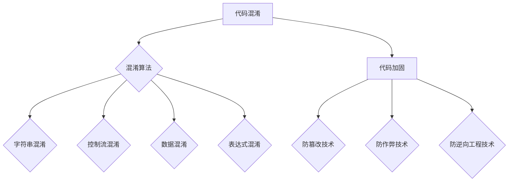

                 


### 《代码混淆与加固：保护知识产权的技术手段》

关键词：代码混淆、代码加固、知识产权保护、反逆向工程、安全措施

摘要：在信息技术快速发展的今天，软件知识产权保护变得尤为重要。代码混淆与加固作为保护软件知识产权的重要技术手段，能够有效防止代码被逆向工程破解，保障开发者的权益。本文将从代码混淆与加固的概述、技术原理、工具介绍以及实战案例等多个方面，深入探讨这一技术领域，为开发者提供有效的知识产权保护策略。

----------------------------------------------------------------

# 《代码混淆与加固：保护知识产权的技术手段》目录大纲

## 第一部分：基础知识与核心概念

### 第1章 代码混淆与加固概述

#### 1.1 代码混淆与加固的重要性

#### 1.2 代码混淆与加固的定义

#### 1.3 代码混淆与加固的动机

### 第2章 代码混淆技术原理

#### 2.1 代码混淆的基本方法

#### 2.2 混淆算法分类

##### 2.2.1 字符串混淆

##### 2.2.2 控制流混淆

##### 2.2.3 数据混淆

##### 2.2.4 表达式混淆

### 第3章 代码加固技术原理

#### 3.1 代码加固的基本方法

#### 3.2 加固算法分类

##### 3.2.1 防篡改技术

##### 3.2.2 防作弊技术

##### 3.2.3 防逆向工程技术

### 第4章 代码混淆与加固工具

#### 4.1 混淆工具介绍

##### 4.1.1 Java混淆工具

##### 4.1.2 .NET混淆工具

##### 4.1.3 Python混淆工具

#### 4.2 加固工具介绍

##### 4.2.1 Java加固工具

##### 4.2.2 .NET加固工具

##### 4.2.3 Python加固工具

## 第二部分：实战案例与项目应用

### 第5章 代码混淆与加固实战

#### 5.1 实战项目背景

#### 5.2 混淆与加固策略制定

##### 5.2.1 混淆策略

##### 5.2.2 加固策略

#### 5.3 实施步骤与流程

##### 5.3.1 代码混淆

##### 5.3.2 代码加固

##### 5.3.3 测试与验证

### 第6章 代码混淆与加固案例分析

#### 6.1 案例一：游戏客户端混淆与加固

#### 6.2 案例二：移动应用混淆与加固

#### 6.3 案例三：Web应用混淆与加固

### 第7章 代码混淆与加固的未来趋势

#### 7.1 技术发展前景

#### 7.2 技术挑战与对策

#### 7.3 法律法规与道德伦理

## 附录：参考资料与拓展阅读

### 附录A 技术文献与论文

### 附录B 开源混淆与加固工具列表

### 附录C 代码混淆与加固相关法律法规概览

### 附录D 混淆与加固技术课程与培训资源推荐

### Mermaid 流程图



### Python 源代码示例

```python
# 示例：字符串混淆

def simple_cipher(text, key):
    """
    简单的凯撒密码混淆函数。
    """
    cipher_text = ""
    for char in text:
        if char.isalpha():
            # 将字符移到字母表末尾的key个位置
            offset = key % 26
            if char.islower():
                cipher_text += chr((ord(char) - ord('a') + offset) % 26 + ord('a'))
            else:
                cipher_text += chr((ord(char) - ord('A') + offset) % 26 + ord('A'))
        else:
            cipher_text += char
    return cipher_text

# 测试混淆函数
original_text = "Hello, World!"
key = 3
print("Original Text:", original_text)
print("Ciphered Text:", simple_cipher(original_text, key))
```

### 数学模型与公式

$$
1 + 1 = 2
$$

$$
x^2 + 2xy + y^2 = (x + y)^2
$$

### 代码解读与分析

```python
# 示例：Python 字符串混淆

# 简单凯撒密码混淆算法实现
def caesar_cipher(text, shift):
    result = ""
    for char in text:
        if char.isupper():
            result += chr((ord(char) - 65 + shift) % 26 + 65)
        elif char.islower():
            result += chr((ord(char) - 97 + shift) % 26 + 97)
        else:
            result += char
    return result

# 测试代码
original_message = "HELLO WORLD"
shift_value = 4
encoded_message = caesar_cipher(original_message, shift_value)
print("Encoded Message:", encoded_message)

# 解密代码
def decode_caesar_cipher(text, shift):
    result = ""
    for char in text:
        if char.isupper():
            result += chr((ord(char) - 65 - shift) % 26 + 65)
        elif char.islower():
            result += chr((ord(char) - 97 - shift) % 26 + 97)
        else:
            result += char
    return result

decoded_message = decode_caesar_cipher(encoded_message, shift_value)
print("Decoded Message:", decoded_message)
```

## 1. 代码混淆与加固概述

### 1.1 代码混淆与加固的重要性

在当今的数字化时代，软件知识产权保护显得尤为重要。随着互联网技术的不断发展，软件的传播速度极快，如何保护自己的软件不被他人恶意破解、抄袭，成为了每一个软件开发者必须面对的问题。代码混淆与加固技术就是在这种情况下应运而生的一种有效手段。

代码混淆（Code Obfuscation）是指通过一系列算法和工具，将源代码转换为难以阅读和理解的形式，从而阻止他人通过逆向工程获取原始逻辑和算法。代码加固（Code Hardening）则是通过一系列技术手段，增强代码的安全性，防止代码被篡改、作弊和逆向工程。

代码混淆与加固的重要性主要体现在以下几个方面：

1. **保护知识产权**：软件是知识产权的重要组成部分，混淆与加固技术可以有效防止软件被恶意破解和抄袭，保护开发者的权益。
2. **防止商业机密泄露**：许多企业的商业机密都隐藏在源代码中，通过代码混淆与加固，可以防止商业机密泄露，维护企业竞争力。
3. **降低软件盗版率**：通过混淆与加固技术，可以增加盗版软件的破解难度，从而降低软件盗版率，保障软件产业的健康发展。
4. **提升软件安全性**：加固技术可以帮助检测和防御代码中的漏洞，提高软件的安全性，防止恶意攻击。

### 1.2 代码混淆与加固的定义

#### 代码混淆

代码混淆是指通过一系列算法和工具，将源代码转换为难以阅读和理解的形式，从而增加逆向工程的难度。混淆后的代码通常包含大量的冗余信息、虚假逻辑和复杂的控制流，使其难以理解和分析。

代码混淆的主要目标包括：

1. **增加逆向工程的难度**：通过混淆算法，使逆向工程师难以读懂和理解源代码，增加破解时间成本。
2. **保护商业秘密**：将源代码转换为难以理解的形式，防止他人获取商业机密。
3. **减少盗版**：通过增加破解难度，减少盗版软件的流通，提高正版软件的市场份额。

#### 代码加固

代码加固是指通过一系列技术手段，增强代码的安全性，防止代码被篡改、作弊和逆向工程。加固技术主要包括以下几个方面：

1. **防篡改技术**：通过加密和签名技术，确保代码在传输和存储过程中不被篡改。
2. **防作弊技术**：通过检测和防御作弊手段，防止恶意用户绕过代码逻辑，进行非法操作。
3. **防逆向工程技术**：通过混淆、加密和其他技术手段，防止逆向工程破解代码。

代码加固的主要目标包括：

1. **提高代码安全性**：防止代码被恶意篡改和攻击，确保软件的稳定性和可靠性。
2. **防止商业机密泄露**：通过加固技术，保护商业秘密不被恶意获取。
3. **减少盗版和作弊**：通过增加破解和作弊的难度，降低盗版和作弊行为的发生。

### 1.3 代码混淆与加固的动机

#### 代码混淆的动机

1. **防止软件盗版**：软件盗版是软件开发者面临的一大挑战。通过代码混淆，可以增加盗版软件的破解难度，从而减少盗版软件的流通。
2. **保护商业秘密**：许多企业的商业秘密都隐藏在源代码中，通过代码混淆，可以防止这些机密被恶意获取。
3. **增强软件安全性**：代码混淆可以阻止逆向工程师分析源代码，减少软件被恶意攻击的风险。
4. **提升软件质量**：通过代码混淆，可以减少代码的可读性，迫使开发者在编写代码时更加注重代码的模块化和可维护性。

#### 代码加固的动机

1. **防止代码篡改**：随着软件复杂性的增加，代码中的漏洞和缺陷也越来越多。通过代码加固，可以防止恶意用户篡改代码，确保软件的稳定性和安全性。
2. **防止逆向工程**：代码加固技术可以增加逆向工程的难度，保护软件的知识产权。
3. **防止作弊行为**：在许多游戏中，作弊行为严重影响了游戏公平性和用户体验。通过代码加固，可以防止作弊行为的发生，维护游戏的公平性。
4. **提高软件安全性**：代码加固可以帮助检测和防御代码中的漏洞，提高软件的整体安全性。

### 1.4 代码混淆与加固的关系

代码混淆与加固虽然有着不同的目标，但它们在很多方面是相辅相成的。

1. **相互补充**：代码混淆和加固可以相互补充，提高软件的安全性。例如，在代码混淆的基础上，使用加固技术可以进一步提高代码的防护能力。
2. **共同目标**：代码混淆和加固的共同目标是保护软件知识产权，防止软件被恶意破解、抄袭和盗版。
3. **不同阶段**：代码混淆通常在软件开发过程中进行，而代码加固则更多地关注于软件发布后的防护。两者都是软件安全策略的重要组成部分。

总的来说，代码混淆与加固是软件知识产权保护的重要技术手段。通过合理使用这些技术，开发者可以有效地保护自己的软件，减少知识产权泄露和盗版行为，提高软件的竞争力和市场价值。

----------------------------------------------------------------

## 2. 代码混淆技术原理

### 2.1 代码混淆的基本方法

代码混淆是通过对源代码进行一系列转换，使其变得难以阅读和理解的过程。混淆的基本方法主要包括以下几种：

#### 1. 字符串混淆

字符串混淆是通过将代码中的字符串进行替换、加密或编码，使其难以解读。常见的字符串混淆方法有：

- **替换**：将代码中的字符串替换为加密后的版本。
- **编码**：使用特定的编码算法（如Base64、Hex编码等）对字符串进行编码。
- **加密**：使用加密算法（如AES、DES等）对字符串进行加密。

#### 2. 控制流混淆

控制流混淆是通过改变代码的控制流程，使其变得复杂和难以追踪。常见的控制流混淆方法有：

- **跳转混淆**：通过插入无意义的跳转语句，使代码的控制流变得复杂。
- **条件分支混淆**：通过插入虚假的条件分支，使代码的控制流难以预测。
- **循环混淆**：通过插入无意义的循环，使代码的控制流变得复杂。

#### 3. 数据混淆

数据混淆是通过改变代码中的数据形式，使其难以解读。常见的数据混淆方法有：

- **数据加密**：使用加密算法对数据项进行加密。
- **数据替换**：将数据项替换为无意义的值。
- **数据混淆**：通过插入冗余数据项，使数据结构变得复杂。

#### 4. 表达式混淆

表达式混淆是通过改变代码中的表达式形式，使其难以解读。常见的方法有：

- **冗余计算**：在表达式中插入冗余计算，使表达式变得复杂。
- **隐式转换**：使用隐式类型转换，使表达式变得难以理解。
- **函数嵌套**：将多个函数嵌套在一起，使代码结构变得复杂。

### 2.2 混淆算法分类

代码混淆算法可以按照不同的分类方式进行划分，常见的分类方法有：

#### 1. 根据混淆程度

- **轻度混淆**：主要对代码进行简单的混淆，使代码的可读性降低，但仍然可以被理解。
- **中度混淆**：对代码进行较为复杂的混淆，使代码难以阅读，但仍然可以被逆向工程破解。
- **重度混淆**：对代码进行高度混淆，使其几乎无法被理解和逆向工程破解。

#### 2. 根据混淆方法

- **静态混淆**：在代码编译前进行混淆，生成混淆后的字节码或可执行文件。
- **动态混淆**：在代码运行时进行混淆，通过运行时的代码生成和修改实现混淆。

#### 3. 根据混淆目标

- **反逆向工程混淆**：主要目的是防止逆向工程，增加逆向工程的难度。
- **反调试混淆**：主要目的是防止调试，增加调试的难度。
- **反反编译混淆**：主要目的是防止反编译，增加反编译的难度。

### 2.3 代码混淆技术原理的具体实现

#### 字符串混淆

字符串混淆的实现方法主要包括字符串替换和字符串加密。

- **字符串替换**：使用一个查找表，将代码中的字符串替换为加密后的版本。例如，将字符串 "Hello, World!" 替换为 "H3ll0, W0rld!"。
- **字符串加密**：使用加密算法（如AES、DES等）对字符串进行加密。例如，使用AES加密算法，将字符串 "Hello, World!" 加密为 "rTM3oA==（Base64编码形式）"。

#### 控制流混淆

控制流混淆的实现方法主要包括跳转混淆和条件分支混淆。

- **跳转混淆**：在代码中插入无意义的跳转语句，使代码的控制流变得复杂。例如，在条件语句 "if (condition) { ... }" 中，插入一个无意义的跳转语句，使代码变为 "if (condition) { ... } else { goto label; }"。
- **条件分支混淆**：在条件语句中插入虚假的条件分支，使代码的控制流难以预测。例如，在条件语句 "if (condition1) { ... } else if (condition2) { ... } else { ... }" 中，插入一个虚假的条件分支，使代码变为 "if (condition1) { ... } else if (condition2) { ... } else if (false) { ... } else { ... }"。

#### 数据混淆

数据混淆的实现方法主要包括数据加密和数据替换。

- **数据加密**：使用加密算法（如AES、DES等）对数据项进行加密。例如，使用AES加密算法，将数据项 "123456" 加密为 "e4744c1c5a0e8e3d727d4e9d06d4ed3（Hex编码形式）"。
- **数据替换**：将数据项替换为无意义的值。例如，将数据项 "123456" 替换为 "abcdefg"。

#### 表达式混淆

表达式混淆的实现方法主要包括冗余计算和隐式转换。

- **冗余计算**：在表达式中插入冗余计算，使表达式变得复杂。例如，将表达式 "a + b" 改写为 "(a + 1) + (b + 1)"。
- **隐式转换**：使用隐式类型转换，使表达式变得难以理解。例如，将表达式 "a + b" 改写为 "int(a) + int(b)"。

### 2.4 代码混淆技术原理的优缺点

#### 优点

1. **增加逆向工程的难度**：代码混淆可以显著增加逆向工程的难度，使逆向工程师难以理解和分析源代码。
2. **保护商业秘密**：代码混淆可以有效地防止商业秘密泄露，保护开发者的权益。
3. **减少盗版**：通过增加破解难度，减少盗版软件的流通，提高正版软件的市场份额。

#### 缺点

1. **降低代码可读性**：代码混淆会降低代码的可读性，使代码维护和调试变得困难。
2. **性能影响**：某些混淆算法可能对代码性能产生负面影响，增加代码执行时间。
3. **依赖工具和算法**：代码混淆依赖于特定的工具和算法，不同的混淆工具和算法可能会导致不同的混淆效果。

总的来说，代码混淆技术是一种有效的保护软件知识产权的手段，但在实际应用中需要权衡其优缺点，根据具体需求选择合适的混淆策略和工具。

----------------------------------------------------------------

## 3. 代码加固技术原理

### 3.1 代码加固的基本方法

代码加固（Code Hardening）是通过一系列技术手段，提高代码的安全性，防止代码被恶意篡改、攻击和逆向工程。代码加固的基本方法主要包括以下几个方面：

#### 1. 防篡改技术

防篡改技术旨在防止代码在传输和存储过程中被恶意篡改。常见的方法有：

- **代码签名**：使用数字签名技术，对代码进行签名，确保代码的完整性和真实性。
- **加密存储**：使用加密算法对代码进行加密存储，防止未经授权的访问和篡改。
- **完整性校验**：通过校验和（如MD5、SHA-1等）对代码进行完整性校验，确保代码在传输和存储过程中未被篡改。

#### 2. 防作弊技术

防作弊技术主要用于防止软件被恶意用户绕过代码逻辑，进行非法操作。常见的方法有：

- **行为监控**：实时监控软件运行过程，检测异常行为，防止作弊行为。
- **访问控制**：通过访问控制策略，限制用户对软件功能的访问，防止非法操作。
- **数据加密**：对敏感数据进行加密存储，防止数据泄露。

#### 3. 防逆向工程技术

防逆向工程技术通过增加逆向工程的难度，保护代码的知识产权和商业秘密。常见的方法有：

- **代码混淆**：通过对代码进行混淆，使逆向工程师难以理解和分析源代码。
- **虚拟化**：使用虚拟化技术，将代码运行在沙盒环境中，防止逆向工程。
- **代码保护**：使用代码保护工具，对代码进行加密和保护，防止逆向工程。

### 3.2 加固算法分类

代码加固算法可以按照不同的分类方式进行划分，常见的分类方法有：

#### 1. 根据加固目标

- **安全加固**：提高代码的安全性，防止代码被恶意攻击和篡改。
- **隐私保护**：保护用户隐私，防止敏感数据泄露。
- **知识产权保护**：防止代码被逆向工程和盗版。

#### 2. 根据加固手段

- **加密技术**：使用加密算法对代码进行加密，防止未经授权的访问和篡改。
- **混淆技术**：通过对代码进行混淆，增加逆向工程的难度。
- **访问控制**：通过访问控制策略，限制用户对软件功能的访问。

#### 3. 根据加固范围

- **文件级加固**：对代码文件进行加固，防止文件被篡改。
- **模块级加固**：对代码模块进行加固，防止模块被篡改和逆向工程。
- **系统级加固**：对整个系统进行加固，提高系统的安全性。

### 3.3 代码加固技术原理的具体实现

#### 防篡改技术

防篡改技术的实现主要包括代码签名、加密存储和完整性校验。

- **代码签名**：使用数字签名技术，对代码进行签名。签名过程包括：生成签名私钥、使用私钥对代码进行签名、使用公钥验证签名。例如，使用RSA算法生成签名私钥，使用签名私钥对代码进行签名，然后使用签名公钥验证签名。
- **加密存储**：使用加密算法（如AES、RSA等）对代码进行加密存储。加密过程包括：生成加密密钥、使用加密密钥对代码进行加密、使用解密密钥对代码进行解密。例如，使用AES算法生成加密密钥，使用加密密钥对代码进行加密，然后使用解密密钥对代码进行解密。
- **完整性校验**：使用校验和（如MD5、SHA-1等）对代码进行完整性校验。校验过程包括：计算校验和、比较校验和。例如，使用MD5算法计算代码的MD5校验和，然后将计算出的校验和与存储的校验和进行比较。

#### 防作弊技术

防作弊技术的实现主要包括行为监控、访问控制和数据加密。

- **行为监控**：通过实时监控软件运行过程，检测异常行为。例如，使用日志记录软件运行过程，然后使用数据分析技术检测异常行为。
- **访问控制**：通过访问控制策略，限制用户对软件功能的访问。例如，使用角色权限控制技术，为不同的角色分配不同的访问权限。
- **数据加密**：对敏感数据进行加密存储。例如，使用AES算法对用户密码进行加密存储，然后使用解密算法在需要时对密码进行解密。

#### 防逆向工程技术

防逆向工程技术主要包括代码混淆、虚拟化和代码保护。

- **代码混淆**：通过对代码进行混淆，增加逆向工程的难度。例如，使用混淆工具对Java代码进行混淆，生成混淆后的字节码。
- **虚拟化**：使用虚拟化技术，将代码运行在沙盒环境中。例如，使用Java沙盒技术，将Java代码运行在沙盒环境中，防止逆向工程。
- **代码保护**：使用代码保护工具，对代码进行加密和保护。例如，使用PyInstaller工具，将Python代码打包成可执行文件，然后对可执行文件进行加密保护。

### 3.4 代码加固技术原理的优缺点

#### 优点

1. **提高代码安全性**：代码加固可以显著提高代码的安全性，防止代码被恶意篡改、攻击和逆向工程。
2. **保护知识产权**：代码加固可以有效地保护代码的知识产权，防止商业秘密泄露和盗版。
3. **降低风险**：代码加固可以降低软件系统的风险，减少因代码漏洞导致的攻击和数据泄露。

#### 缺点

1. **性能影响**：某些加固技术可能会对代码性能产生负面影响，增加代码执行时间。
2. **开发成本**：代码加固需要投入一定的开发资源和时间，增加开发成本。
3. **维护难度**：代码加固后的代码可能需要额外的维护和调试工作，增加维护难度。

总的来说，代码加固技术是一种有效的保护软件知识产权和安全性的手段，但在实际应用中需要权衡其优缺点，根据具体需求选择合适的加固策略和工具。

----------------------------------------------------------------

## 4. 代码混淆与加固工具

### 4.1 混淆工具介绍

在代码混淆领域，有许多成熟的工具可供选择，这些工具可以针对不同的编程语言和平台提供强大的混淆功能。以下是一些常见的混淆工具及其特点：

#### 1. Java混淆工具

- **ProGuard**：ProGuard 是一款功能强大的 Java 混淆工具，它能够对 Java 源代码、字节码以及资源文件进行混淆、优化和预处理。ProGuard 的特点是混淆强度高、支持多种配置选项，但配置较为复杂。
- **Obfuscar**：Obfuscar 是一款开源的 Java 混淆工具，它支持将 C# 和 VB.NET 代码混淆为 Java 代码。Obfuscar 的优点是易于使用，且混淆后代码的可读性相对较高。
- **Javapackager**：Javapackager 是由 Oracle 提供的一款工具，它可以将 Java 应用打包成独立的可执行文件。在打包过程中，Javapackager 还可以对代码进行混淆和优化。

#### 2. .NET混淆工具

- **ILSpy Duck**：ILSpy Duck 是一款针对 .NET 应用程序的开源混淆工具。它可以将 C# 和 VB.NET 代码混淆为 IL（中间语言），从而提高逆向工程的难度。
- **Crypto Obfuscator**：Crypto Obfuscator 是一款商业混淆工具，它能够对 .NET 应用程序进行混淆、加密和优化。Crypto Obfuscator 的特点是混淆强度高、支持多种加密算法，但价格较高。
- **dotfuscator**：dotfuscator 是一款功能强大的 .NET 混淆工具，它能够对 C# 和 VB.NET 代码进行混淆、加密和优化。dotfuscator 的优点是易于使用，且混淆后代码的可读性相对较高。

#### 3. Python混淆工具

- **PyObfuscator**：PyObfuscator 是一款开源的 Python 混淆工具，它能够对 Python 代码进行混淆，从而增加逆向工程的难度。
- **PyCryptoDome**：PyCryptoDome 是一款 Python 加密库，它提供了多种加密算法，可用于对 Python 代码进行混淆和加密。
- **PyInstaller**：PyInstaller 是一款 Python 打包工具，它可以将 Python 应用程序打包成独立的可执行文件。在打包过程中，PyInstaller 还可以对代码进行混淆和优化。

### 4.2 加固工具介绍

代码加固工具可以帮助开发者提高代码的安全性，防止代码被恶意篡改、攻击和逆向工程。以下是一些常见的加固工具及其特点：

#### 1. Java加固工具

- **JavaAgent**：JavaAgent 是一款 Java 代理工具，它可以在应用程序运行时进行代码加固和监控。JavaAgent 的优点是灵活性高，可以针对不同的应用场景进行定制化配置。
- **Fortify**：Fortify 是一款商业代码加固工具，它能够对 Java 代码进行静态和动态分析，检测潜在的漏洞和风险。Fortify 的特点是分析能力强，但价格较高。
- **VirusTotal**：VirusTotal 是一款免费的在线工具，它可以对 Java 应用程序进行静态分析，检测是否存在恶意代码。VirusTotal 的优点是易于使用，但分析能力相对有限。

#### 2. .NET加固工具

- **CodeSigner**：CodeSigner 是一款 .NET 代码签名工具，它能够对 .NET 应用程序进行数字签名，确保代码的完整性和真实性。
- **/crypto++**：crypto++ 是一款开源的 .NET 加密库，它提供了多种加密算法，可用于对 .NET 代码进行加密和混淆。
- **dotfuscator**：dotfuscator 是一款功能强大的 .NET 加固工具，它能够对 C# 和 VB.NET 代码进行混淆、加密和优化。dotfuscator 的优点是易于使用，且加固后代码的性能影响较小。

#### 3. Python加固工具

- **PyCrypto**：PyCrypto 是一款开源的 Python 加密库，它提供了多种加密算法，可用于对 Python 代码进行加密和混淆。
- **PyInstaller**：PyInstaller 是一款 Python 打包工具，它可以将 Python 应用程序打包成独立的可执行文件。在打包过程中，PyInstaller 还可以对代码进行混淆和优化。
- **PyAES**：PyAES 是一款 Python AES 加密库，它能够对 Python 代码进行 AES 加密，从而提高代码的安全性。

总的来说，代码混淆与加固工具在软件知识产权保护和代码安全性方面发挥着重要作用。开发者可以根据自己的需求，选择合适的混淆和加固工具，提高软件的安全性，降低逆向工程和盗版的风险。

### 4.3 工具选择与使用建议

在选用代码混淆与加固工具时，开发者需要考虑以下因素：

1. **编程语言支持**：确保工具支持目标编程语言，如 Java、.NET、Python 等。
2. **混淆强度**：选择适合项目需求的混淆强度，避免混淆过度或不足。
3. **性能影响**：考虑工具对代码性能的影响，选择对性能影响较小的工具。
4. **易用性**：选择易于使用和配置的工具，减少学习成本和调试时间。
5. **成本**：权衡工具的成本，选择性价比高的解决方案。

具体使用建议如下：

1. **初步评估**：在选择工具前，先对市场上的工具进行初步评估，了解其功能、性能和用户评价。
2. **定制化配置**：根据项目需求，对工具进行定制化配置，以达到最佳混淆和加固效果。
3. **持续更新**：随着安全威胁的不断发展，定期更新工具，确保其能够应对新的攻击手段。
4. **测试验证**：在实施混淆和加固后，对代码进行测试和验证，确保工具的有效性和安全性。

通过合理选择和使用代码混淆与加固工具，开发者可以有效地保护软件知识产权，提高代码安全性，降低逆向工程和盗版的风险。

----------------------------------------------------------------

## 5. 代码混淆与加固实战

### 5.1 实战项目背景

本次实战项目是一款用于企业内部数据管理的软件，其主要功能包括数据录入、查询、分析和报表生成。由于这款软件包含敏感数据和商业逻辑，为了防止数据泄露和商业机密被恶意获取，我们需要对其进行代码混淆与加固处理。

### 5.2 混淆与加固策略制定

在制定混淆与加固策略时，我们需要考虑以下几个关键点：

1. **目标**：提高代码的安全性，防止逆向工程和篡改，保护企业数据和商业机密。
2. **需求**：针对不同模块和功能，制定不同的混淆与加固策略，确保有效性和性能平衡。
3. **范围**：对源代码、配置文件和资源文件进行混淆与加固，确保整体安全。

#### 5.2.1 混淆策略

1. **源代码混淆**：使用混淆工具对 Java 源代码进行混淆，包括变量名、方法名和类名。
2. **资源文件混淆**：对配置文件和资源文件进行加密和编码，确保难以被读取。
3. **控制流混淆**：插入无意义的跳转和循环，增加代码复杂度。

#### 5.2.2 加固策略

1. **防篡改技术**：使用数字签名对代码和资源文件进行签名，确保完整性。
2. **数据加密**：对敏感数据进行加密存储，如用户密码和敏感配置。
3. **访问控制**：实施严格的访问控制策略，确保用户只能访问授权的功能和数据。
4. **代码保护**：使用虚拟化技术将代码运行在沙盒环境中，防止逆向工程。

### 5.3 实施步骤与流程

#### 5.3.1 代码混淆

1. **环境准备**：安装混淆工具，如 ProGuard。
2. **配置文件**：编写混淆配置文件，定义混淆规则和策略。
3. **混淆执行**：运行混淆工具，对 Java 源代码进行混淆。
4. **混淆验证**：检查混淆结果，确保关键功能未被破坏。

#### 5.3.2 代码加固

1. **代码签名**：使用数字签名工具对代码和资源文件进行签名。
2. **数据加密**：使用加密算法对敏感数据进行加密存储。
3. **访问控制**：实现访问控制逻辑，限制用户权限。
4. **代码保护**：使用虚拟化技术将代码运行在沙盒环境中。

#### 5.3.3 测试与验证

1. **功能测试**：测试混淆和加固后的代码，确保关键功能正常。
2. **安全测试**：使用逆向工程工具尝试破解代码，验证加固效果。
3. **性能测试**：评估混淆和加固对代码性能的影响，进行性能优化。

### 5.4 具体实现示例

以下是一个简单的示例，演示如何使用 ProGuard 对 Java 代码进行混淆：

#### 5.4.1 安装 ProGuard

下载 ProGuard 的二进制文件，并解压到合适的位置。

#### 5.4.2 编写混淆配置文件

创建一个名为 `proguard.conf` 的配置文件，并添加以下规则：

```plaintext
# 混淆所有类名和方法名
-inj

