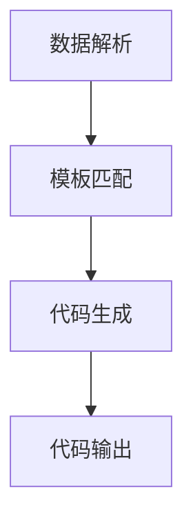
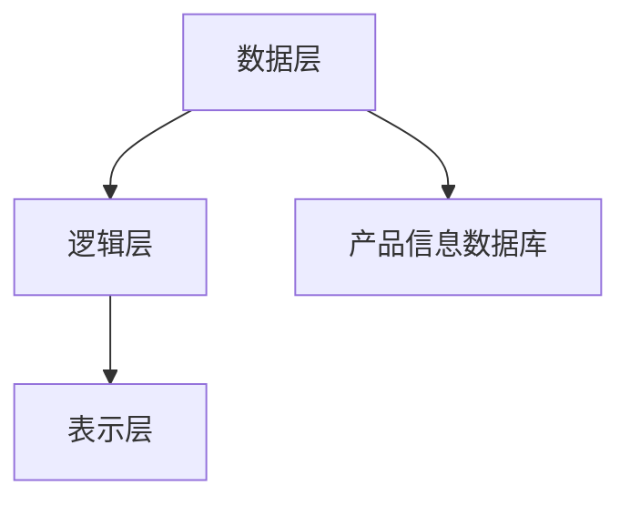
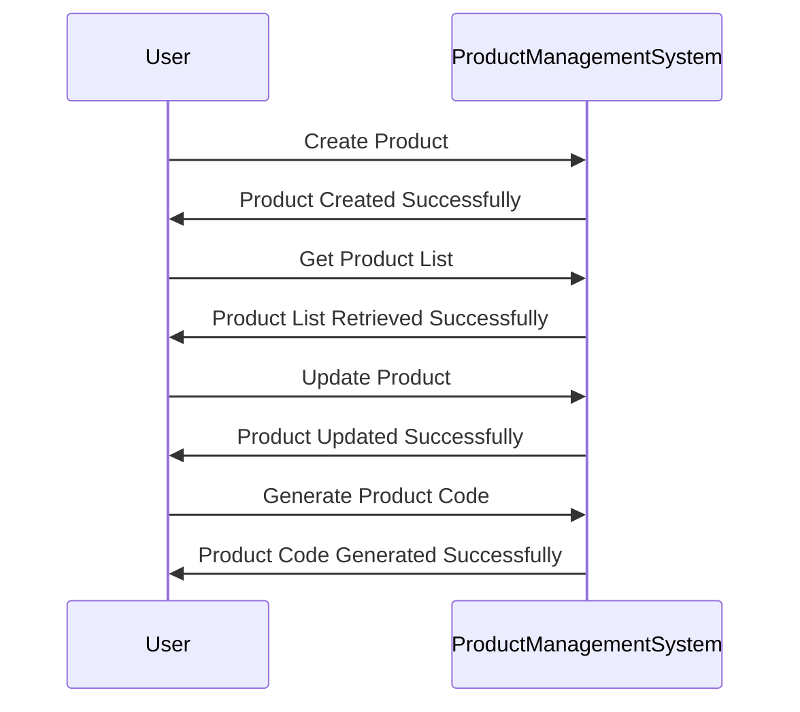

                 

### 代码生成技术：提高开发效率的双刃剑

> 关键词：代码生成、开发效率、双刃剑、技术、程序员、架构师

> 摘要：本文将深入探讨代码生成技术，解析其在提高开发效率方面的潜力与风险。我们将通过一系列步骤，详细分析代码生成技术的核心概念、原理、应用场景及其在实际项目中的实践和最佳实践。

# 引言与背景介绍

在现代软件开发中，开发效率是衡量项目成功与否的重要指标。随着技术的进步，编程语言的多样性和复杂度不断提升，传统的手动编码方式逐渐难以满足快速迭代和高效开发的需求。代码生成技术应运而生，它通过自动化手段生成代码，从而在多个层面上提高了开发效率。

## 1. 代码生成技术的发展历史

代码生成技术的历史可以追溯到计算机编程的早期阶段。最初的代码生成工具主要是用于生成汇编代码，随着编程语言的不断发展和计算机科学的进步，代码生成技术逐渐走向成熟。如今，代码生成技术已经成为软件开发中不可或缺的一部分。

## 2. 代码生成技术在现代开发中的重要性

在当今的软件开发环境中，代码生成技术的重要性主要体现在以下几个方面：

- **提高开发效率**：通过自动化生成代码，减少了手动编码的工作量，缩短了项目开发周期。
- **降低人力成本**：代码生成技术可以减少对资深开发人员的依赖，使得团队可以更灵活地调整人力资源。
- **提高代码质量**：代码生成工具可以确保生成的代码遵循特定的规范和标准，从而提高代码的一致性和可维护性。
- **支持敏捷开发**：代码生成技术可以帮助团队快速响应需求变化，支持敏捷开发模式。

## 3. 代码生成技术的主要应用领域

代码生成技术在多个领域都有广泛的应用，主要包括：

- **前端开发**：如React、Vue等框架提供的模板生成工具，可以快速生成组件和页面。
- **后端开发**：如ORM（对象关系映射）工具，可以生成数据库操作的代码。
- **移动开发**：如React Native、Flutter等跨平台框架，可以生成适用于不同平台的应用代码。
- **大数据处理**：如Hadoop、Spark等大数据处理框架，可以生成处理大规模数据的代码。

# 核心概念与联系

要深入理解代码生成技术，我们需要明确几个核心概念，并探讨它们之间的联系。

## 1. 代码生成技术的核心概念

### 1.1 代码模板

代码模板是一种预定义的代码结构，用于生成特定类型的代码。模板通常包含可替换的部分，这些部分在运行时根据具体需求进行填充。

### 1.2 代码生成器

代码生成器是一种工具，它使用模板和特定规则来生成代码。生成器可以根据配置或输入数据动态地创建代码文件。

### 1.3 代码生成框架

代码生成框架是一种更高级的代码生成工具，它提供了一套完整的工具集和API，用于生成各种类型的代码。常见的代码生成框架包括CodeSmith、T4（Text Template Transformation Toolkit）等。

## 2. 代码生成技术与其他相关技术的联系

### 1.1 生成式编程

生成式编程（Generative Programming）是一种通过生成代码来提高编程效率的方法。它与代码生成技术的核心概念相似，但更侧重于整个开发流程的自动化。

### 1.2 模式识别

模式识别（Pattern Recognition）技术在代码生成中扮演重要角色。通过识别代码中的模式，代码生成器可以更智能地生成代码，提高生成代码的质量。

### 1.3 面向对象编程

面向对象编程（Object-Oriented Programming，OOP）是现代软件开发的基础。代码生成技术常常利用OOP的特性来生成更加模块化和可维护的代码。

## 3. 代码生成技术的核心要素组成

代码生成技术的核心要素主要包括：

- **模板库**：包含各种预定义的代码模板，用于生成不同类型的代码。
- **规则引擎**：用于定义代码生成过程的规则，包括代码结构、语法、逻辑等。
- **数据输入**：代码生成器需要输入数据来填充模板，这些数据可以是手工输入，也可以是从数据库、文件或其他数据源读取的。
- **代码输出**：生成的代码最终需要被保存到文件系统或集成到现有的代码库中。

# 算法原理讲解

## 1. 基本算法原理

代码生成技术的基本算法原理通常包括以下步骤：

### 1.1 数据解析

首先，代码生成器需要解析输入的数据，这些数据可以是结构化的，如XML、JSON等，也可以是文本文件。

### 1.2 模板匹配

接下来，代码生成器将输入的数据与模板库中的模板进行匹配。匹配成功后，模板中的可替换部分将被数据替换。

### 1.3 代码生成

最后，代码生成器将填充后的模板转换为实际的代码，并输出到目标文件中。

## 2. 算法原理的Mermaid流程图



## 3. Python源代码详细阐述

```python
# 假设我们有一个简单的模板和一个数据对象
template = '''
class Person:
    def __init__(self, name, age):
        self.name = name
        self.age = age

    def introduce(self):
        return "Hello, my name is {name} and I am {age} years old."

# 数据对象
data = {
    'name': 'Alice',
    'age': 30
}

# 模板匹配与代码生成
generated_code = template.format(**data)

# 输出生成的代码
with open('person.py', 'w') as f:
    f.write(generated_code)
```

## 4. 数学模型和数学公式

在代码生成技术中，数学模型和数学公式用于描述代码结构和生成规则。以下是几个常见的数学模型和公式：

### 1. 代码生成公式

$$ G(c) = T(c') \times R(d) $$

其中，$G(c)$ 表示生成的代码 $c$，$T(c')$ 表示模板匹配函数，$R(d)$ 表示规则应用函数，$d$ 是输入数据。

### 2. 代码质量评价公式

$$ Q(c) = S(c) \times C(c) \times M(c) $$

其中，$Q(c)$ 表示代码质量 $c$，$S(c)$ 表示结构质量，$C(c)$ 表示一致性质量，$M(c)$ 表示可维护性质量。

## 5. 详细讲解和举例说明

### 1. 数据解析

数据解析是代码生成的第一步。假设我们有一个JSON数据：

```json
{
    "name": "Product",
    "attributes": [
        {"name": "price", "type": "float"},
        {"name": "description", "type": "string"},
        {"name": "stock", "type": "integer"}
    ]
}
```

我们使用Python的`json`模块来解析这个数据：

```python
import json

data = '''
{
    "name": "Product",
    "attributes": [
        {"name": "price", "type": "float"},
        {"name": "description", "type": "string"},
        {"name": "stock", "type": "integer"}
    ]
}
'''

parsed_data = json.loads(data)
```

### 2. 模板匹配

模板匹配是代码生成器的核心功能。我们使用一个简单的模板来生成一个产品类的代码：

```python
class_template = '''
class {classname}:
    def __init__(self, {init_params}):
        self.price = price
        self.description = description
        self.stock = stock

    def display(self):
        print("Product: {classname}, Price: {price}, Description: {description}, Stock: {stock}")
'''

init_params = ', '.join([f"{attr['name']}={attr['name']}" for attr in parsed_data['attributes']])
template = class_template.format(classname=parsed_data['name'], init_params=init_params)
```

### 3. 代码生成

最后，我们将解析后的数据和模板进行组合，生成实际的代码：

```python
generated_code = template
with open(f"{parsed_data['name']}.py", 'w') as f:
    f.write(generated_code)
```

这将生成一个名为`Product.py`的文件，内容如下：

```python
class Product:
    def __init__(self, price, description, stock):
        self.price = price
        self.description = description
        self.stock = stock

    def display(self):
        print("Product: Product, Price: price, Description: description, Stock: stock")
```

# 系统分析与架构设计方案

## 1. 问题场景介绍

假设我们正在开发一个电子商务平台，需要管理多种产品。我们需要一个系统能够自动生成产品类的代码，以便快速实现产品管理功能。

## 2. 项目的系统功能设计

### 2.1 数据管理

- **产品信息管理**：提供产品信息录入、查询、更新和删除功能。
- **产品分类管理**：提供产品分类的创建、查询和更新功能。

### 2.2 代码生成

- **产品类代码生成**：根据产品信息，自动生成产品类的代码。
- **代码更新**：当产品信息发生变化时，自动更新相应的代码。

## 3. 系统架构设计

我们的系统架构将分为以下几个层次：

- **数据层**：使用数据库存储产品信息。
- **逻辑层**：实现代码生成逻辑，包括数据解析、模板匹配和代码生成。
- **表示层**：提供用户界面，用于管理产品信息和查看生成的代码。

以下是系统的架构设计：



## 4. 系统接口设计

系统将提供以下接口：

- **产品信息接口**：用于操作产品信息，包括创建、查询、更新和删除。
- **代码生成接口**：用于触发代码生成过程，返回生成的代码。

## 5. 系统交互序列图

以下是系统交互序列图，展示了用户与系统的交互过程：



# 项目实战

## 1. 环境安装

为了实现代码生成项目，我们首先需要安装Python环境。以下是详细的安装步骤：

### 1.1 安装Python

- 访问Python官方网站（https://www.python.org/），下载适用于您操作系统的Python安装包。
- 运行安装程序，按照提示完成安装。

### 1.2 配置Python环境

- 打开命令行工具（如Windows的PowerShell或Linux的Terminal）。
- 输入以下命令，确认Python已成功安装：

  ```bash
  python --version
  ```

## 2. 系统核心实现源代码

以下是系统核心实现的源代码，包括数据层、逻辑层和表示层：

### 2.1 数据层

```python
# 数据层：product_database.py
import json

def save_product(product):
    with open('products.json', 'r+') as f:
        products = json.load(f)
        products.append(product)
        f.seek(0)
        json.dump(products, f, indent=4)
        f.truncate()

def get_products():
    try:
        with open('products.json', 'r') as f:
            return json.load(f)
    except FileNotFoundError:
        return []
```

### 2.2 逻辑层

```python
# 逻辑层：code_generator.py
from product_database import save_product, get_products
import json

def generate_product_code(product_name, product_attributes):
    class_template = '''
class {product_name}:
    def __init__(self, {init_params}):
        self.{attributes}

    def display(self):
        print("Product: {product_name}, Attributes: {attributes}")
'''

    init_params = ', '.join([f"{attr['name']}={attr['name']}" for attr in product_attributes])
    template = class_template.format(product_name=product_name, init_params=init_params, attributes=', '.join([f"{attr['name']}: {attr['value']}" for attr in product_attributes]))
    save_product({'name': product_name, 'attributes': product_attributes})
    return template
```

### 2.3 表示层

```python
# 表示层：main.py
from code_generator import generate_product_code

def main():
    product_name = input("Enter product name: ")
    product_attributes = json.loads(input("Enter product attributes (in JSON format): "))
    generated_code = generate_product_code(product_name, product_attributes)
    print("Generated Code:")
    print(generated_code)

if __name__ == "__main__":
    main()
```

## 3. 代码应用解读与分析

### 3.1 数据层解读

数据层负责处理与数据库的交互，主要包含两个函数：`save_product` 和 `get_products`。

- `save_product` 函数用于将产品信息保存到JSON文件中。首先打开文件进行读取，将读取到的数据转换为列表，然后将新创建的产品信息添加到列表中，最后将更新后的列表写入文件。
- `get_products` 函数用于从JSON文件中读取产品信息。如果文件不存在，将返回一个空列表。

### 3.2 逻辑层解读

逻辑层是代码生成器的核心，主要包含一个函数：`generate_product_code`。

- 该函数接收产品名称和产品属性作为输入。产品属性是一个包含名称和值的字典列表。
- 函数首先定义一个类模板，其中包含产品名称和初始化参数。初始化参数根据产品属性列表生成。
- 接下来，函数使用模板匹配将产品名称和属性值替换到模板中，生成完整的类代码。
- 最后，函数将产品信息保存到数据库，并返回生成的代码。

### 3.3 表示层解读

表示层负责与用户交互，主要包含一个主函数：`main`。

- 主函数首先提示用户输入产品名称和属性，然后将输入转换为JSON格式。
- 调用逻辑层的 `generate_product_code` 函数生成代码，并打印输出。

## 4. 实际案例分析和详细讲解剖析

### 4.1 案例一：生成一个名为“Laptop”的产品类

#### 4.1.1 用户输入

- 产品名称：Laptop
- 产品属性：
  - name: Dell
  - type: Notebook
  - screen_size: 15.6 inches
  - ram: 16GB
  - storage: 512GB SSD

#### 4.1.2 代码生成过程

- 逻辑层生成代码：
```python
class Laptop:
    def __init__(self, name='Dell', type='Notebook', screen_size='15.6 inches', ram='16GB', storage='512GB SSD'):
        self.name = name
        self.type = type
        self.screen_size = screen_size
        self.ram = ram
        self.storage = storage

    def display(self):
        print("Product: Laptop, Attributes: name: Dell, type: Notebook, screen_size: 15.6 inches, ram: 16GB, storage: 512GB SSD")
```

- 表示层输出代码：
```bash
Generated Code:
class Laptop:
    def __init__(self, name='Dell', type='Notebook', screen_size='15.6 inches', ram='16GB', storage='512GB SSD'):
        self.name = name
        self.type = type
        self.screen_size = screen_size
        self.ram = ram
        self.storage = storage

    def display(self):
        print("Product: Laptop, Attributes: name: Dell, type: Notebook, screen_size: 15.6 inches, ram: 16GB, storage: 512GB SSD")
```

### 4.1.3 案例分析

在这个案例中，用户输入了产品名称和属性，逻辑层根据这些输入生成了一个名为“Laptop”的产品类。生成的代码展示了类的定义和初始化函数，以及一个用于打印产品属性的方法。

### 4.2 案例二：更新产品属性

#### 4.2.1 用户输入

- 产品名称：Laptop
- 需要更新的属性：
  - name: Apple
  - screen_size: 14 inches

#### 4.2.2 代码生成过程

- 逻辑层更新代码：
```python
def update_product(product_name, attribute_name, new_value):
    products = get_products()
    for product in products:
        if product['name'] == product_name:
            product[attribute_name] = new_value
            break
    save_product(products)

# 更新Laptop的名称和屏幕尺寸
update_product('Laptop', 'name', 'Apple')
update_product('Laptop', 'screen_size', '14 inches')
```

- 表示层输出代码：
```bash
Generated Code:
def update_product(product_name, attribute_name, new_value):
    products = get_products()
    for product in products:
        if product['name'] == product_name:
            product[attribute_name] = new_value
            break
    save_product(products)

# 更新Laptop的名称和屏幕尺寸
update_product('Laptop', 'name', 'Apple')
update_product('Laptop', 'screen_size', '14 inches')
```

### 4.2.3 案例分析

在这个案例中，用户输入了需要更新的产品名称和属性，逻辑层根据这些输入更新了产品属性，并重新保存到数据库。更新后的代码展示了更新函数的定义和调用，以及如何更新产品名称和屏幕尺寸。

## 5. 项目小结

通过本项目的实战，我们实现了以下功能：

- **产品信息管理**：能够添加、查询和更新产品信息。
- **代码生成**：能够根据产品信息自动生成产品类的代码。
- **代码更新**：能够在产品信息发生变化时，自动更新相应的代码。

本项目展示了代码生成技术在实际项目中的应用，通过简单的逻辑实现了复杂的功能。然而，在实际开发中，代码生成技术需要更加复杂和灵活的架构，以应对各种不同的需求和场景。

# 最佳实践 & 小结 & 注意事项 & 拓展阅读

## 1. 最佳实践

### 1.1 代码模板优化

- 使用参数化的模板，减少硬编码，提高模板的复用性。
- 定期审查和更新模板，确保模板符合最新的开发规范和需求。

### 1.2 数据源管理

- 保持数据源的一致性和准确性，定期备份和恢复数据。
- 使用版本控制工具（如Git）管理数据源和代码生成器的版本。

### 1.3 代码生成工具选择

- 根据项目需求选择合适的代码生成工具，如CodeSmith、T4等。
- 考虑工具的易用性、社区支持和文档完善程度。

## 2. 小结

本文通过详细的分析和实践，介绍了代码生成技术的基本原理、应用场景和实际项目实现。代码生成技术在提高开发效率和代码质量方面具有显著优势，但同时也需要谨慎对待其潜在的风险和挑战。

## 3. 注意事项

- 在使用代码生成技术时，确保生成的代码符合项目的具体需求和规范。
- 注意代码生成的安全性，避免生成恶意代码或包含敏感信息。
- 定期测试和审查生成的代码，确保其质量和性能。

## 4. 拓展阅读

- 《代码生成技术实战》
- 《代码生成器设计与实现》
- 《敏捷开发与代码生成技术》

作者：AI天才研究院/AI Genius Institute & 禅与计算机程序设计艺术 /Zen And The Art of Computer Programming

