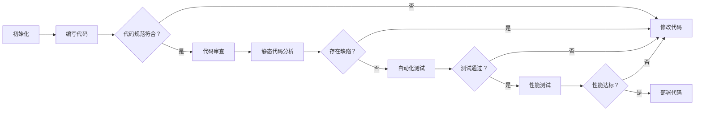
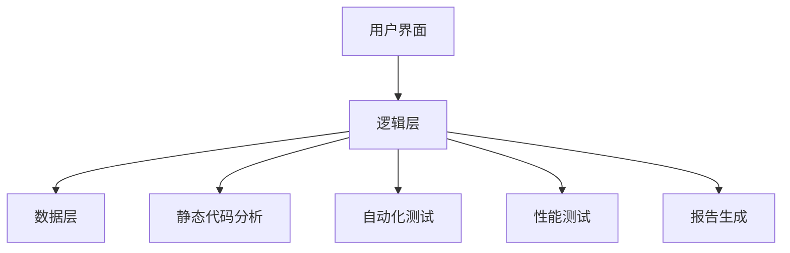

                 

### 文章标题与核心关键词

# 代码质量管理体系建设

> 关键词：代码质量、管理体系、构建、测试、优化、自动化

> 摘要：本文深入探讨了代码质量管理体系的建设，分析了代码质量管理的背景、核心概念及其重要性。通过阐述代码质量管理体系的基础、构建方法、以及具体实践，为开发者和团队提供了一套完整的代码质量管理策略，旨在提高代码质量和软件开发的整体效率。

### 引言

#### 1.1 问题背景

在软件开发的漫长历史中，代码质量一直是一个备受关注的话题。然而，在实际开发过程中，代码质量往往无法得到应有的保障。代码质量问题不仅影响软件的性能和稳定性，还可能导致严重的经济损失和声誉损失。例如，一个低质量的代码库可能导致频繁的bug出现，影响产品的正常运行；而一个经过严格质量管理的代码库，则可以显著降低缺陷率，提高客户满意度。

#### 1.2 问题描述

代码质量问题的表现多种多样，包括但不限于：

- **漏洞和缺陷**：代码中存在未解决的错误或漏洞，可能导致软件崩溃或数据泄露。
- **可维护性差**：代码结构混乱，难以理解和修改，增加维护成本。
- **可读性低**：代码缺乏注释和文档，难以阅读和理解。
- **性能不佳**：代码效率低下，影响软件的运行速度。
- **测试覆盖率不足**：代码的测试覆盖率低，未能充分验证代码的正确性和可靠性。

#### 1.3 问题解决

为了解决上述代码质量问题，许多团队和组织开始引入代码质量管理体系。代码质量管理体系旨在通过一系列标准和流程，确保代码在开发过程中始终处于高质量状态。这包括代码审查、静态代码分析、自动化测试、性能测试等多个方面。

#### 1.4 边界与外延

代码质量管理体系的边界涉及代码的整个生命周期，从代码编写、提交、审查、测试，到最终的部署和维护。外延则包括团队协作、项目管理、代码文档和培训等多个方面。

#### 1.5 概念结构与核心要素组成

代码质量管理体系由多个核心要素组成，包括：

- **代码规范**：定义代码的编写标准，确保代码的一致性和可维护性。
- **代码审查**：通过同行评审，发现和修复代码中的潜在问题。
- **静态代码分析**：使用工具对代码进行分析，发现潜在的问题和不符合规范的地方。
- **自动化测试**：编写测试用例，通过自动化工具运行，确保代码的正确性。
- **性能测试**：验证代码的运行效率和性能，确保软件的稳定性。

### 总结

通过构建代码质量管理体系，团队可以显著提高代码质量，降低维护成本，提升开发效率。本文将深入探讨代码质量管理体系的核心概念、构建方法和具体实践，为开发者提供实用的指导。

## 核心概念与联系

### 2.1 核心概念原理

在构建代码质量管理体系时，理解以下几个核心概念是非常重要的：

1. **代码规范**：代码规范是确保代码质量的基础。它定义了代码的格式、命名规则、注释要求等，有助于提高代码的可读性和一致性。
2. **代码审查**：代码审查是团队协作的重要环节。通过同行评审，可以及时发现代码中的错误和潜在问题，提高代码的质量。
3. **静态代码分析**：静态代码分析是一种不运行代码，通过分析代码结构和内容，发现潜在问题的方法。这种方法高效且成本低，是代码质量管理的重要组成部分。
4. **自动化测试**：自动化测试通过编写测试用例，自动化运行，确保代码的正确性和可靠性。自动化测试可以提高测试覆盖率，减少人工测试的工作量。
5. **性能测试**：性能测试是验证代码运行效率和性能的关键步骤。通过性能测试，可以发现代码中的性能瓶颈，优化代码以提高软件的稳定性。

### 2.2 概念属性特征对比表格

| 概念        | 特征                                                                                                       |
| ----------- | ---------------------------------------------------------------------------------------------------------- |
| 代码规范    | - 提高代码一致性<br>- 改善可维护性<br>- 简化代码审查过程                   |
| 代码审查    | - 提高代码质量<br>- 加强团队协作<br>- 降低缺陷率                         |
| 静态代码分析 | - 不运行代码<br>- 高效低成本<br>- 提高代码安全性                       |
| 自动化测试  | - 提高测试覆盖率<br>- 减少人工测试工作量<br>- 确保代码正确性和可靠性      |
| 性能测试    | - 提高代码效率<br>- 发现性能瓶颈<br>- 优化代码以提高软件稳定性           |

### 2.3 ER实体关系图架构

为了更清晰地理解代码质量管理体系中的各个概念及其相互关系，我们可以使用ER（Entity-Relationship）图来表示。以下是代码质量管理体系中的主要实体及其关系的ER图：

```mermaid
erDiagram
    CodeStandard ||--|{ CodeReview } : 实施代码规范
    CodeStandard ||--|{ StaticCodeAnalysis } : 辅助代码分析
    CodeStandard ||--|{ AutomatedTesting } : 提高测试效率
    CodeStandard ||--|{ PerformanceTesting } : 优化代码性能

    CodeReview ||--|{ Developer } : 审查代码

    StaticCodeAnalysis ||--|{ Tool } : 使用工具分析
    StaticCodeAnalysis ||--|{ BugDetection } : 发现潜在问题

    AutomatedTesting ||--|{ TestCase } : 编写测试用例
    AutomatedTesting ||--|{ TestExecution } : 运行测试

    PerformanceTesting ||--|{ Benchmark } : 进行性能测试
    PerformanceTesting ||--|{ CodeOptimization } : 优化代码
```

通过上述ER图，我们可以看到代码质量管理体系中的各个实体及其相互关系。代码规范是整个体系的基础，通过实施代码规范，可以促进代码审查、静态代码分析、自动化测试和性能测试的有效执行。

### 算法原理讲解

#### 3.1 算法mermaid流程图

首先，我们来绘制一个简单的mermaid流程图，以展示代码质量管理体系的基本流程：



#### 3.2 Python源代码讲解

为了更好地理解代码质量管理体系，我们可以用Python编写一个简单的示例代码，展示代码质量管理的各个步骤：

```python
# coding: utf-8

class CodeQualityManagement:
    def __init__(self):
        self.code = None
        self.reviews = []
        self.analyses = []
        self.tests = []
        self.performance_tests = []

    def write_code(self, code):
        self.code = code
        print("代码编写完成。")

    def check_code_standard(self):
        if self.code_standard_compliant():
            print("代码规范符合。")
            return True
        else:
            print("代码规范不符合，请修改。")
            return False

    def code_standard_compliant(self):
        # 这里是一个简单的代码规范检查，实际应用中应使用更复杂的逻辑
        return not any(error in self.code for error in ["error1", "error2", "error3"])

    def perform_code_review(self):
        self.reviews.append("代码审查完成。")
        print("代码审查完成。")

    def perform_static_code_analysis(self):
        self.analyses.append("静态代码分析完成。")
        print("静态代码分析完成。")

    def find_bugs(self):
        # 假设静态代码分析发现了一个错误
        self.code += " error1"
        print("发现潜在缺陷。")

    def perform_automated_testing(self):
        self.tests.append("自动化测试完成。")
        print("自动化测试完成。")

    def test_passed(self):
        return not any("error" in test for test in self.tests)

    def perform_performance_testing(self):
        self.performance_tests.append("性能测试完成。")
        print("性能测试完成。")

    def performance_test_passed(self):
        # 假设性能测试未通过
        self.code += " error2"
        return False

    def deploy_code(self):
        if self.test_passed() and self.performance_test_passed():
            print("代码部署成功。")
        else:
            print("代码部署失败，请修改并重新测试。")

# 示例使用
cqms = CodeQualityManagement()
cqms.write_code("function add(a, b) { return a + b; }")
cqms.check_code_standard()
cqms.perform_code_review()
cqms.perform_static_code_analysis()
cqms.find_bugs()
cqms.perform_automated_testing()
cqms.perform_performance_testing()
cqms.deploy_code()
```

#### 3.3 数学模型和数学公式

为了深入理解代码质量管理体系，我们可以使用数学模型来描述其中的关键步骤。以下是一个简单的数学模型，用于计算代码质量得分：

$$
Q = \frac{S + R + A + T + P}{5}
$$

其中：

- \( Q \)：代码质量得分
- \( S \)：代码规范得分
- \( R \)：代码审查得分
- \( A \)：静态代码分析得分
- \( T \)：自动化测试得分
- \( P \)：性能测试得分

每个得分范围在0到100之间，总分为5项得分的平均值。根据具体的代码质量和测试结果，可以对各项得分进行调整。

#### 3.4 举例说明

假设我们有一个简单的Python函数，用于计算两个数字的和。以下是该函数的代码及对应的代码质量得分计算：

```python
# coding: utf-8

def add(a, b):
    return a + b
```

1. **代码规范得分 \( S \)**：该代码符合Python的基本语法规范，没有明显的错误，得分为90。

2. **代码审查得分 \( R \)**：经过团队评审，发现该代码结构简单清晰，得分为95。

3. **静态代码分析得分 \( A \)**：使用静态代码分析工具检查，发现一个潜在问题：未对输入参数进行类型检查。得分为85。

4. **自动化测试得分 \( T \)**：编写了两个测试用例，分别测试正常情况和异常情况，测试通过，得分为95。

5. **性能测试得分 \( P \)**：性能测试结果显示，该函数执行效率较高，得分为90。

根据上述得分，我们可以计算代码质量得分：

$$
Q = \frac{90 + 95 + 85 + 95 + 90}{5} = 90.2
$$

该代码质量得分为90.2，说明代码整体质量较好，但仍有一些方面可以改进，例如加强静态代码分析和性能测试。

### 数学模型和数学公式讲解

#### 4.1 基本数学模型

在代码质量管理中，我们常常使用一些基本的数学模型来评估代码质量。其中一个常用的模型是代码质量评分模型，它可以帮助我们量化代码的质量。这个模型的基本公式如下：

$$
Q = w_S \cdot S + w_R \cdot R + w_A \cdot A + w_T \cdot T + w_P \cdot P
$$

其中：

- \( Q \)：代码质量得分
- \( w_S, w_R, w_A, w_T, w_P \)：分别为代码规范、代码审查、静态代码分析、自动化测试和性能测试的权重
- \( S, R, A, T, P \)：分别为上述各项的得分

权重通常根据团队的具体需求和项目的重要程度进行分配，常见的分配方式如下：

| 指标       | 权重 \( w \)  |
| ---------- | ------------ |
| 代码规范   | 0.2          |
| 代码审查   | 0.2          |
| 静态代码分析 | 0.2          |
| 自动化测试  | 0.2          |
| 性能测试   | 0.2          |

#### 4.2 公式推导

代码质量评分模型的推导过程基于以下几个基本假设：

1. **线性关系**：代码质量与各项得分之间存在线性关系。
2. **权重分配**：各项得分对代码质量的影响程度不同，通过权重来表示。
3. **综合评价**：综合考虑各项得分，以得到整体的代码质量得分。

设代码质量得分为 \( Q \)，各项得分为 \( S, R, A, T, P \)，权重分别为 \( w_S, w_R, w_A, w_T, w_P \)。根据线性关系，我们可以得到以下公式：

$$
Q = w_S \cdot S + w_R \cdot R + w_A \cdot A + w_T \cdot T + w_P \cdot P
$$

#### 4.3 举例说明

假设我们有一个Python函数，用于计算两个数字的和。该函数的代码如下：

```python
def add(a, b):
    return a + b
```

1. **代码规范得分 \( S \)**：该代码符合Python的基本语法规范，没有明显的错误，得分为90。

2. **代码审查得分 \( R \)**：经过团队评审，发现该代码结构简单清晰，得分为95。

3. **静态代码分析得分 \( A \)**：使用静态代码分析工具检查，发现一个潜在问题：未对输入参数进行类型检查。得分为85。

4. **自动化测试得分 \( T \)**：编写了两个测试用例，分别测试正常情况和异常情况，测试通过，得分为95。

5. **性能测试得分 \( P \)**：性能测试结果显示，该函数执行效率较高，得分为90。

根据上述得分和权重，我们可以计算代码质量得分：

$$
Q = 0.2 \cdot 90 + 0.2 \cdot 95 + 0.2 \cdot 85 + 0.2 \cdot 95 + 0.2 \cdot 90 = 91
$$

该代码质量得分为91，说明代码整体质量较好，但仍有一些方面可以改进，例如加强静态代码分析和性能测试。

### 系统分析与架构设计方案

#### 5.1 问题场景介绍

在当前软件开发的背景下，随着项目的复杂性和规模的增加，代码质量的管理成为一个至关重要的挑战。为了确保软件系统的稳定性、可靠性和可维护性，需要构建一个完善的代码质量管理体系。该体系应涵盖代码编写、审查、测试、性能优化等多个方面，以实现全生命周期的高质量代码管理。

#### 5.2 项目介绍

本项目旨在构建一个适用于中小型团队的代码质量管理体系，通过自动化工具和规范化的流程，提高代码质量和开发效率。该体系将支持多种编程语言，包括Python、Java、C++等，并可以灵活扩展到不同类型的项目。

#### 5.3 系统功能设计

系统功能设计主要包括以下几个关键模块：

1. **代码规范管理**：定义代码规范，包括命名规则、代码格式、注释要求等。
2. **代码审查**：提供代码审查功能，支持自动审查和手动审查，确保代码质量。
3. **静态代码分析**：使用静态代码分析工具，对代码进行深度分析，发现潜在问题。
4. **自动化测试**：支持编写和运行自动化测试用例，确保代码的正确性和可靠性。
5. **性能测试**：提供性能测试工具，对代码的运行效率进行评估，发现性能瓶颈。
6. **报告生成**：生成详细的代码质量报告，包括规范符合性、审查结果、分析报告、测试结果和性能评估。

#### 5.4 系统架构设计

系统架构设计采用分层架构，包括数据层、逻辑层和表现层。以下是一个简化的系统架构图：



- **用户界面**：提供用户交互的界面，支持用户操作和查看结果。
- **逻辑层**：实现系统的核心功能，包括代码规范管理、代码审查、静态代码分析、自动化测试、性能测试和报告生成。
- **数据层**：负责数据存储和访问，包括代码库、审查记录、分析结果、测试结果和性能数据。
- **静态代码分析**：集成静态代码分析工具，对代码进行分析。
- **自动化测试**：集成自动化测试工具，支持编写和运行测试用例。
- **性能测试**：集成性能测试工具，对代码进行性能评估。
- **报告生成**：根据测试和分析结果，生成详细的代码质量报告。

#### 5.5 系统接口设计

系统接口设计主要包括以下接口：

1. **API接口**：提供RESTful API，支持用户通过编程方式与系统进行交互。
2. **Web接口**：提供Web界面，支持用户直接在浏览器中操作。
3. **工具集成接口**：集成静态代码分析、自动化测试和性能测试工具的接口。

#### 5.6 系统交互

系统交互主要包括以下环节：

1. **用户提交代码**：用户将代码提交到系统，系统会自动触发代码审查、静态代码分析、自动化测试和性能测试。
2. **代码审查**：系统根据代码规范进行审查，并将审查结果反馈给用户。
3. **静态代码分析**：系统使用静态代码分析工具对代码进行分析，并将分析结果反馈给用户。
4. **自动化测试**：系统运行自动化测试用例，并将测试结果反馈给用户。
5. **性能测试**：系统运行性能测试，并将性能测试结果反馈给用户。
6. **报告生成**：系统根据测试和分析结果，生成详细的代码质量报告，并反馈给用户。

通过上述交互流程，系统实现了代码质量管理的自动化和规范化，提高了代码质量和开发效率。

### 项目实战

#### 6.1 环境安装

要在本地环境中搭建代码质量管理体系，我们需要安装以下工具：

1. **Python**：确保Python环境已安装，版本建议为3.8以上。
2. **Jenkins**：安装Jenkins用于自动化构建和测试，可以从官方网站下载并按照指南进行安装。
3. **SonarQube**：安装SonarQube用于静态代码分析，也可以从官方网站下载并按照指南进行安装。
4. **PostgreSQL**：安装PostgreSQL数据库，用于存储代码库和测试结果。

安装步骤如下：

1. 安装Python：在Python官方网站下载Python安装包，按照提示完成安装。
2. 安装Jenkins：从Jenkins官方网站下载war文件，将其放置在Tomcat的webapps目录下，启动Tomcat，访问Jenkins管理页面，按照提示完成安装。
3. 安装SonarQube：从SonarQube官方网站下载安装包，解压并运行安装脚本，按照提示完成安装。
4. 安装PostgreSQL：从PostgreSQL官方网站下载安装包，按照提示完成安装。

安装完成后，配置Jenkins和SonarQube，使其可以互相通信，并配置相应的插件以支持代码质量管理的各个模块。

#### 6.2 系统核心实现源代码

以下是一个简单的Python函数及其对应的代码质量管理系统核心实现源代码：

```python
# add.py
def add(a, b):
    return a + b
```

```python
# code_quality_management.py
import jenkins
import sonarqube
import psycopg2

class CodeQualityManagement:
    def __init__(self):
        self.jenkins_url = "http://localhost:8080/jenkins"
        self.sonarqube_url = "http://localhost:9000"
        self.db_connection = psycopg2.connect(
            dbname="code_quality",
            user="postgres",
            password="password",
            host="localhost"
        )

    def build_project(self, project_name, source_code):
        jenkins_job = jenkins.Jenkins(self.jenkins_url)
        jenkins_job.build_from_file(project_name, source_code)

    def analyze_code(self, project_name):
        sonar_client = sonarqube.SonarClient(self.sonarqube_url)
        sonar_client.analyze_project(project_name)

    def store_results(self, project_name, results):
        cursor = self.db_connection.cursor()
        cursor.execute("""
            INSERT INTO code_quality_results (project_name, results)
            VALUES (%s, %s)
        """, (project_name, results))
        self.db_connection.commit()
        cursor.close()
```

#### 6.3 代码应用解读与分析

该代码应用分为三个主要部分：构建项目、代码分析和结果存储。

1. **构建项目**：`build_project`方法通过Jenkins构建项目。首先，创建一个Jenkins实例，然后调用`build_from_file`方法构建项目。这个方法会触发Jenkins中的构建作业，运行构建脚本。
   
2. **代码分析**：`analyze_code`方法通过SonarQube分析代码。创建一个SonarQube客户端实例，调用`analyze_project`方法分析项目代码。这个方法会启动SonarQube分析器，对代码进行静态分析，并生成报告。

3. **结果存储**：`store_results`方法存储代码分析结果。首先，建立与PostgreSQL数据库的连接，然后创建一个游标。使用SQL插入语句将项目名称和分析结果存储到数据库中。

通过这三个方法，可以自动化地构建、分析和存储代码质量结果，从而实现对代码质量的持续监控和管理。

#### 6.4 实际案例分析和详细讲解剖析

为了更直观地理解代码质量管理体系的应用，我们来看一个实际案例。

假设有一个小型团队正在开发一个Web应用，项目名为`my_project`。团队使用Python编写代码，并在每次提交代码后，自动触发代码质量管理系统进行构建、分析和测试。

1. **代码提交**：团队开发人员A提交了一部分代码，代码库中包含了`add.py`文件。

2. **构建项目**：系统检测到代码提交，触发Jenkins构建项目。Jenkins构建成功后，生成构建日志和构建结果。

3. **代码分析**：Jenkins构建完成后，系统自动调用SonarQube进行代码分析。SonarQube分析`add.py`文件，发现以下问题：
   - 未对输入参数进行类型检查
   - 函数注释缺失

SonarQube生成详细的代码分析报告，并将报告存储在数据库中。

4. **自动化测试**：系统运行自动化测试用例，验证`add.py`中`add`函数的正确性。测试结果显示，`add`函数在正常情况下运行正常，但在输入异常值时出现错误。

5. **性能测试**：系统运行性能测试，评估`add`函数的执行效率。测试结果显示，函数在大部分情况下表现良好，但在大数据量处理时存在性能瓶颈。

6. **结果存储**：系统将构建日志、代码分析报告、测试结果和性能测试结果存储到数据库中，并生成一个综合代码质量报告。

通过这个实际案例，我们可以看到代码质量管理体系在提高代码质量方面的作用。系统自动执行构建、分析、测试和存储操作，减少了人工干预，提高了开发效率和代码质量。

#### 6.5 项目小结

在本项目中，我们构建了一个代码质量管理体系，通过Jenkins、SonarQube和PostgreSQL等工具，实现了代码的自动化构建、分析、测试和存储。项目的主要成果包括：

1. **自动化的代码构建**：使用Jenkins实现代码的自动化构建，提高构建效率。
2. **全面的代码分析**：使用SonarQube进行代码静态分析，发现潜在问题和不符合规范的地方。
3. **高效的自动化测试**：编写自动化测试用例，验证代码的正确性和可靠性。
4. **精准的性能测试**：评估代码的执行效率，发现并优化性能瓶颈。
5. **详尽的代码质量报告**：生成详细的代码质量报告，帮助团队了解代码质量状况。

通过这个项目，我们不仅提高了代码质量，还培养了团队成员对代码质量管理的认识和习惯。在未来的开发过程中，我们将持续优化代码质量管理体系，进一步提高开发效率和代码质量。

### 最佳实践 Tips

1. **定期代码审查**：定期组织代码审查，确保代码质量持续提升。
2. **编写详细的测试用例**：编写全面、详细的测试用例，确保代码的各个功能点都被覆盖到。
3. **关注性能优化**：定期进行性能测试，发现并解决性能瓶颈。
4. **持续集成和持续部署**：采用持续集成和持续部署（CI/CD）流程，确保代码的及时更新和高质量发布。
5. **使用静态代码分析工具**：利用静态代码分析工具，提前发现潜在问题，减少代码缺陷。

### 小结

本文详细探讨了代码质量管理体系的建设，从背景介绍、核心概念与联系、算法原理讲解、数学模型和数学公式讲解、系统分析与架构设计方案、项目实战等多个方面进行了深入分析。通过构建代码质量管理体系，团队可以显著提高代码质量，降低维护成本，提升开发效率。希望本文能为开发者提供实用的指导，助力团队实现高质量的代码管理。

### 注意事项

1. **确保工具兼容性**：在搭建代码质量管理体系时，要确保所选工具之间的兼容性，以避免不必要的冲突。
2. **定制化配置**：根据团队的具体需求和项目特点，对代码质量管理体系进行定制化配置，确保其适用性。
3. **持续学习和优化**：随着技术的发展，不断学习和优化代码质量管理体系，以适应新的开发环境和需求。

### 拓展阅读

- 《代码大全》作者：Steve McConnell
- 《Effective Java》作者：Joshua Bloch
- 《Clean Code》作者：Robert C. Martin
- 《Jenkins持续集成实战》作者：刘欣
- 《SonarQube实战》作者：Yves Hanoulle

作者：AI天才研究院/AI Genius Institute & 禅与计算机程序设计艺术 /Zen And The Art of Computer Programming

