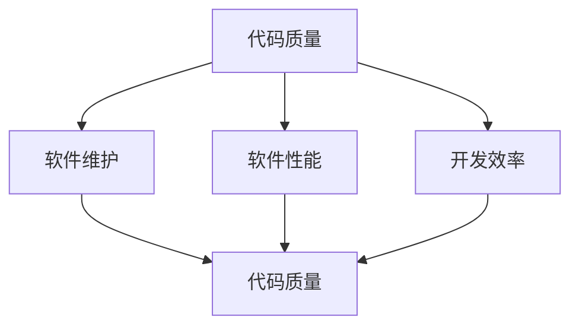
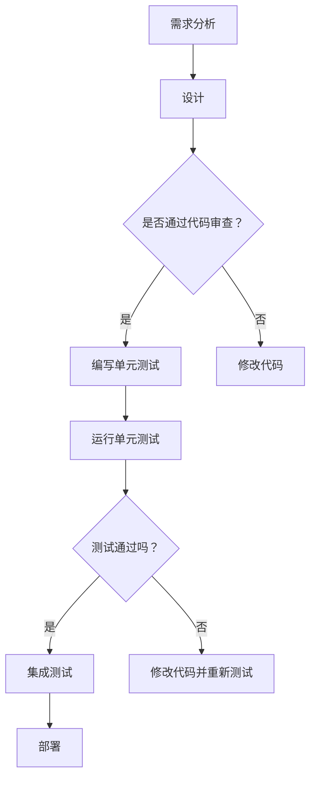

                 

# 代码质量管理：构建长期可维护的系统

## 关键词

- 代码质量管理
- 软件维护
- 单元测试
- 集成测试
- 代码复杂度
- 设计模式
- 代码优化

## 摘要

本文将探讨代码质量管理在构建长期可维护的系统中的重要性。通过详细分析代码质量度量、代码审查、单元测试和集成测试等核心环节，本文旨在为开发者提供一套系统化的代码质量管理方法，帮助他们在软件开发过程中实现代码质量持续提升。同时，本文还将探讨代码质量与软件维护、软件性能和开发效率之间的关系，并运用Mermaid流程图和Python源代码示例，深入讲解核心算法原理和数学模型，以帮助读者更好地理解和实践代码质量管理。

## 第一部分：代码质量管理的概述

### 1. 代码质量的重要性

代码质量是指代码的结构、逻辑、可读性、可维护性和可靠性等方面的特性。高质量的代码不仅能提高软件的性能，还能降低维护成本，延长软件的生命周期。因此，代码质量管理在软件开发过程中具有至关重要的地位。

#### 1.1 代码质量的定义

代码质量可以从多个维度进行评估，包括但不限于：

- **功能性**：代码是否能够正确地实现预期的功能。
- **可靠性**：代码在运行时是否稳定，是否会出现错误或异常。
- **可读性**：代码是否易于阅读和理解。
- **可维护性**：代码是否易于修改和维护。
- **性能**：代码是否高效，是否能够快速响应和处理请求。

#### 1.2 代码质量对项目的影响

高质量的代码对项目有诸多积极影响，包括：

- **减少故障率**：高质量的代码能减少软件在运行过程中出现故障的概率。
- **提高开发效率**：良好的代码结构可以减少开发者在理解和修改代码时所需的时间。
- **降低维护成本**：易于维护的代码可以减少后续的维护成本。
- **提高团队协作效率**：清晰的代码结构可以帮助团队成员更好地理解和协作。

#### 1.3 代码质量的管理方法

为了确保代码质量，可以采用以下管理方法：

- **代码审查**：通过团队成员之间的审查，发现和修复代码中的问题。
- **单元测试**：编写测试用例，验证代码的功能是否符合预期。
- **集成测试**：在多个模块集成后进行测试，确保系统整体功能的正确性。
- **代码度量**：使用工具对代码质量进行量化评估。

## 2. 代码质量度量

代码质量度量是指通过量化的方式评估代码质量的过程。度量指标可以反映代码在功能性、可靠性、可读性、可维护性等方面的表现。

### 2.1 代码质量度量指标

常见的代码质量度量指标包括：

- **代码行数（Lines of Code, LOC）**：代码的总行数。
- **复杂度（Cyclomatic Complexity）**：衡量代码结构的复杂性。
- **圈复杂度（Cyclomatic Complexity, CC）**：用于评估程序中独立路径的数量。
- **注释率（Comment Ratio）**：代码中注释行数与代码行数的比值。
- **代码重复率（Duplication Rate）**：代码中重复代码的比例。
- **测试覆盖率（Test Coverage）**：测试用例覆盖代码的比例。

### 2.2 使用工具进行代码质量度量

有多种工具可以帮助进行代码质量度量，如：

- **SonarQube**：一个开源的代码质量管理平台，支持多种编程语言的代码质量分析。
- **Checkstyle**：一个用于Java代码的静态代码分析工具。
- **FindBugs**：一个用于Java代码的静态错误检测工具。

### 2.3 代码质量度量结果分析

代码质量度量结果可以用于以下方面：

- **发现潜在问题**：识别代码中潜在的问题，如复杂度过高、重复代码等。
- **制定改进计划**：根据度量结果，制定针对性的改进计划。
- **持续监控**：定期进行代码质量度量，监控代码质量的趋势。

## 3. 代码审查

代码审查是一种通过团队成员之间的交流和协作，发现和修复代码中的问题，确保代码质量的方法。

### 3.1 代码审查的过程

代码审查通常包括以下步骤：

1. **提交代码**：开发者将修改后的代码提交到版本控制系统中。
2. **审查请求**：审查者接收到审查请求，开始对代码进行审查。
3. **审查过程**：审查者阅读代码，查找潜在的问题，并提出反馈。
4. **代码修改**：开发者根据审查者的反馈，修改代码。
5. **重新审查**：修改后的代码再次提交进行审查。

### 3.2 代码审查的方法

常见的代码审查方法包括：

- **同行评审（Peer Review）**：团队成员之间的审查。
- **形式审查（Formal Review）**：通过正式的文档和会议进行审查。
- **结对编程（Pair Programming）**：两位开发者一起编写代码，实时交流。

### 3.3 代码审查的工具

常见的代码审查工具有：

- **GitLab**：支持代码审查的功能。
- **GitHub**：提供代码审查和合并请求的功能。
- **Gerrit**：一个基于Git的代码审查系统。

## 4. 单元测试

单元测试是一种对代码中的最小功能单元进行验证的方法。通过编写测试用例，可以确保每个功能单元的正确性。

### 4.1 单元测试的概念

单元测试是指对软件中的最小功能单元（如函数、方法、类）进行验证，以确保其按照预期工作。单元测试通常由开发者编写，并在开发过程中进行。

### 4.2 单元测试的优点

单元测试的优点包括：

- **快速反馈**：可以在代码编写过程中及时发现和修复问题。
- **提高代码质量**：通过测试用例的编写，可以迫使开发者编写更高质量的代码。
- **降低风险**：在软件发布前，通过单元测试可以降低软件出现故障的风险。

### 4.3 单元测试的设计与实现

单元测试的设计与实现包括以下步骤：

1. **确定测试范围**：确定需要测试的功能单元。
2. **编写测试用例**：根据功能单元的预期行为，编写测试用例。
3. **编写测试代码**：实现测试用例，验证功能单元的正确性。
4. **运行测试**：执行测试用例，检查测试结果。

## 5. 集成测试

集成测试是对软件系统中多个模块进行组合和测试的方法。通过集成测试，可以确保系统整体功能的正确性。

### 5.1 集成测试的概念

集成测试是指将软件系统中各个模块组合起来，进行测试以验证系统整体功能的正确性。集成测试通常在单元测试之后进行。

### 5.2 集成测试的类型

常见的集成测试类型包括：

- **自底向上集成**：从最底层的模块开始，逐渐向上组合模块进行测试。
- **自顶向下集成**：从最高层的模块开始，逐渐向下组合模块进行测试。
- **三明治集成**：同时进行自底向上和自顶向下集成，以验证中间层的模块。

### 5.3 集成测试的实施策略

集成测试的实施策略包括：

1. **逐步集成**：将模块逐步组合，进行测试，确保每个阶段的正确性。
2. **自动化测试**：使用自动化测试工具，提高测试效率和覆盖范围。
3. **测试用例设计**：根据模块的功能和接口，设计相应的测试用例。

## 第二部分：核心概念与联系

### 6. 核心概念实体之间的关系架构

在代码质量管理中，核心概念实体包括代码质量、软件维护、软件性能和开发效率。它们之间的关系可以用以下Mermaid流程图表示：

### 6.1 代码质量与软件维护

软件维护是指对软件进行修改、更新和优化，以适应环境和用户需求的变化。代码质量与软件维护密切相关，高质量的代码可以降低软件维护的难度和成本。

#### 6.1.1 软件维护的概念

软件维护是指对软件产品进行修改、更新和优化，以适应环境和用户需求的变化。软件维护通常包括以下类型：

- **纠正性维护**：修复软件中的错误和缺陷。
- **适应性维护**：使软件适应新的环境和需求。
- **完善性维护**：对软件进行优化和改进，提高性能和用户体验。
- **预防性维护**：预防潜在的问题，延长软件的寿命。

#### 6.1.2 软件维护与代码质量的关系

高质量的代码可以降低软件维护的难度和成本，原因包括：

- **易于理解**：良好的代码结构可以提高代码的可读性，使开发者更容易理解和修改。
- **易于测试**：高质量的代码通常具有良好的测试覆盖率，可以及时发现和修复问题。
- **模块化设计**：模块化设计的代码可以降低系统的复杂度，使维护变得更加容易。

#### 6.1.3 软件维护的挑战

软件维护面临的挑战包括：

- **代码复杂度**：随着软件的迭代和更新，代码复杂度可能会不断增加，导致维护难度加大。
- **代码可读性**：随着时间的推移，代码的可读性可能会下降，使开发者难以理解和修改。
- **需求变化**：用户需求的变化可能导致软件需要进行频繁的更新和优化。

### 6.2 代码质量与软件性能

软件性能是指软件在特定硬件和软件环境下，响应和处理请求的能力。高质量的代码可以提高软件的性能，减少响应时间，提高用户体验。

#### 6.2.1 软件性能的定义

软件性能是指软件在特定硬件和软件环境下，响应和处理请求的能力。软件性能可以从多个维度进行评估，包括：

- **响应时间**：软件处理请求所需的时间。
- **吞吐量**：单位时间内软件处理的请求数量。
- **稳定性**：软件在运行过程中是否稳定，是否会出现错误或异常。

#### 6.2.2 软件性能与代码质量的关系

高质量的代码可以提高软件的性能，原因包括：

- **优化算法**：高质量的代码可以使用更高效的算法和数据结构，提高软件的运行效率。
- **减少冗余**：高质量的代码可以减少冗余和重复的代码，降低系统的复杂度。
- **优化资源使用**：高质量的代码可以更好地管理和使用系统资源，如内存和CPU。

#### 6.2.3 提高软件性能的方法

提高软件性能的方法包括：

- **性能测试**：通过性能测试，发现和解决性能瓶颈。
- **代码优化**：对代码进行优化，减少冗余和重复，提高代码的运行效率。
- **硬件优化**：优化硬件配置，提高系统的处理能力。

### 6.3 代码质量与开发效率

开发效率是指开发者完成特定任务所需的时间和资源。高质量的代码可以提高开发效率，减少开发时间和成本。

#### 6.3.1 开发效率的概念

开发效率是指开发者完成特定任务所需的时间和资源。开发效率可以从多个维度进行评估，包括：

- **代码编写速度**：开发者编写代码的速度。
- **代码维护速度**：开发者维护代码的速度。
- **任务完成速度**：开发者完成任务的效率。

#### 6.3.2 代码质量对开发效率的影响

高质量的代码可以提高开发效率，原因包括：

- **易于理解和修改**：高质量的代码具有良好的可读性和结构，使开发者更容易理解和修改。
- **减少错误和缺陷**：高质量的代码可以减少错误和缺陷，降低维护成本。
- **提高协作效率**：高质量的代码可以提高团队之间的协作效率，减少沟通成本。

#### 6.3.3 提高开发效率的策略

提高开发效率的策略包括：

- **代码规范化**：制定代码规范，确保代码的一致性和可读性。
- **代码审查**：通过代码审查，发现和修复代码中的问题，提高代码质量。
- **自动化测试**：使用自动化测试工具，提高测试效率和覆盖范围。
- **持续集成和持续部署**：通过持续集成和持续部署，提高开发流程的效率。

### 6.4 Mermaid流程图展示

下面是一个Mermaid流程图示例，展示了代码质量管理的流程：

## 第三部分：核心算法原理讲解

### 8.1 代码复杂度分析算法

代码复杂度分析是一种评估代码复杂度的方法，用于衡量代码的结构复杂性和可维护性。常见的代码复杂度分析算法包括Cyclomatic复杂度和圈复杂度。

#### 8.1.1 代码复杂度的定义

代码复杂度是指代码结构的复杂程度，通常用于衡量代码的可维护性和可理解性。高复杂度的代码通常难以理解和维护。

#### 8.1.2 代码复杂度分析的重要性

代码复杂度分析对于软件开发具有重要意义，原因包括：

- **评估代码质量**：通过代码复杂度分析，可以评估代码的质量，发现潜在的问题。
- **指导代码优化**：代码复杂度分析可以帮助开发者识别复杂的代码段，进行优化。
- **预测维护成本**：高复杂度的代码通常需要更多的时间和资源进行维护，代码复杂度分析可以预测维护成本。

#### 8.1.3 代码复杂度分析方法

常见的代码复杂度分析方法包括：

- **Cyclomatic复杂度**：Cyclomatic复杂度是一种基于代码控制流的复杂度度量方法，通过计算代码中的独立路径数量来评估复杂度。
- **圈复杂度**：圈复杂度是Cyclomatic复杂度的一种变体，通过计算代码中的圈数量来评估复杂度。

### 8.2 设计模式

设计模式是一套被广泛认可和使用的软件设计经验总结，用于解决软件开发中的常见问题。设计模式可以提高代码的可复用性、可维护性和可扩展性。

#### 8.2.1 设计模式的概念

设计模式是指一组被广泛认可和使用的软件设计经验总结，用于解决软件开发中的常见问题。设计模式通常包括命名规则、结构规范和行为模式。

#### 8.2.2 常见设计模式

常见的

