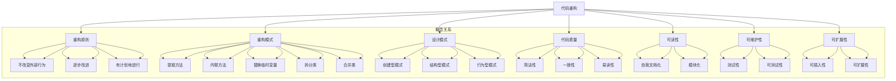

                 


### 第一步：理解代码重构的核心概念

代码重构（Code Refactoring）是软件开发过程中的一种关键技术，旨在在不改变外部行为的前提下，改进现有代码的结构和可读性。重构不仅有助于提高代码质量，还能提升软件的可维护性和扩展性。

**背景介绍：**

代码重构这一概念最早由著名软件开发专家韦德·考克斯（Ward Cunningham）提出。他在20世纪90年代开始推广重构技术，并将其应用于极限编程（eXtreme Programming，简称XP）的开发实践中。

**问题背景：**

在实际软件开发过程中，代码会随着功能的不断增加而变得越来越复杂。这种复杂性不仅降低了代码的可读性，还可能导致潜在的错误。为了解决这些问题，开发者需要定期对代码进行重构。

**问题描述：**

代码重构的目标是提高代码的内部质量，而不是外部行为。这意味着重构操作不会改变程序的输入输出，但会改进代码的结构和逻辑。具体来说，重构可以帮助解决以下问题：

- **重复代码**：通过提取公共代码块，减少重复。
- **过长函数**：将过长函数拆分为多个短小精悍的函数。
- **过大的类**：将大型类拆分为多个更小的类。
- **命名不当**：优化变量和函数的命名，使其更具描述性。
- **代码可读性差**：通过改进代码结构，提高代码的可读性。

**问题解决：**

解决代码复杂性的方法有很多，其中重构是一种有效的方式。通过重构，开发者可以逐步解决代码中的问题，使代码更简洁、更易于理解和维护。

**边界与外延：**

代码重构不仅限于单一的语言或框架，它是一种跨语言的通用技术。无论使用哪种编程语言或开发框架，重构都是提高代码质量的有效手段。此外，重构不仅仅是个人开发者的工作，它也可以在团队合作中发挥重要作用，帮助团队共同维护代码库。

**概念结构与核心要素组成：**

代码重构的核心概念包括以下几个要素：

1. **重构原则**：确保重构操作不会改变代码的输入输出，只改进其内部结构。
2. **重构模式**：一系列经过验证的重构操作，如提取方法、内联方法、替换临时变量等。
3. **重构工具**：辅助开发者进行重构的软件工具，如Eclipse、Visual Studio等。
4. **重构流程**：从识别重构机会到执行重构操作的完整过程。

通过这些核心要素，代码重构可以帮助开发者持续提高代码质量，为软件的长期发展打下坚实基础。

### 第二步：深入探讨代码重构的基础概念与联系

在理解了代码重构的基本概念后，我们需要进一步探讨其核心原则、基本模式以及相关概念之间的联系，以帮助读者更全面地掌握这一技术。

#### 2.1 代码重构的定义与原则

**定义：**

代码重构是一种改进现有代码结构而不改变其外部行为的技术。它旨在消除代码中的不良结构，提高代码的可读性、可维护性和可扩展性。

**原则：**

1. **不改变外部行为**：重构操作应保证代码的输入输出不变，即重构前后的功能应保持一致。
2. **逐步改进**：重构是一个持续的过程，应逐步进行，避免一次性进行大规模重构。
3. **有计划地进行**：在重构之前，应明确重构的目标和范围，确保重构工作有序进行。

**重构模式：**

重构模式是一系列经过验证的重构操作，它们可以帮助开发者逐步改善代码结构。常见的重构模式包括：

1. **提取方法**：将重复的代码块提取为独立的方法，减少代码重复。
2. **内联方法**：将短小的方法直接替换为其实现，以减少方法调用。
3. **替换临时变量**：将复杂的临时变量替换为具体的值或方法调用。
4. **拆分类**：将大型类拆分为多个更小的类，提高代码的模块化程度。
5. **合并类**：将功能相似或相互依赖的类合并，以提高代码的复用性。

**核心概念与联系：**

代码重构涉及多个核心概念，这些概念之间存在紧密的联系。以下是几个关键概念及其关系：

1. **设计模式**：设计模式是一套预定义的、可重用的解决方案，用于解决特定类型的软件设计问题。设计模式与重构密切相关，因为重构可以应用于现有代码中，以改进其设计。
   
2. **代码质量**：代码质量是衡量代码优劣的重要标准。重构可以提高代码质量，使其更简洁、更易于维护。

3. **可读性**：代码的可读性直接影响开发者的工作效率和代码的可维护性。重构通过改进代码结构，提高代码的可读性。

4. **可维护性**：可维护性是指代码在长期使用过程中易于修改和扩展的能力。重构有助于提高代码的可维护性。

5. **可扩展性**：可扩展性是指代码能够适应未来需求变化的能力。通过重构，代码可以更容易地扩展其功能。

为了更好地理解这些概念之间的关系，我们可以使用Mermaid流程图来展示它们的核心联系。



#### 2.2 重构的核心概念与联系

通过上述Mermaid流程图，我们可以更直观地理解代码重构的核心概念及其相互关系。以下是对图中各部分的详细解释：

1. **重构原则**（B）：包括不改变外部行为、逐步改进和有计划地进行。这些原则指导开发者如何有效地进行重构。
   
2. **重构模式**（C）：包括提取方法、内联方法、替换临时变量、拆分类和合并类等。这些模式提供了具体的操作方法，帮助开发者逐步改善代码结构。

3. **设计模式**（D）：包括创建型模式、结构型模式和行为型模式。设计模式是解决特定软件设计问题的通用解决方案，与重构密切相关。

4. **代码质量**（E）：包括简洁性、一致性和易读性。这些是衡量代码质量的重要标准，通过重构可以提高代码质量。

5. **可读性**（F）：包括自我文档化和模块化。可读性直接影响开发者的工作效率，通过重构可以提升代码的可读性。

6. **可维护性**（G）：包括测试性和可测试性。可维护性是指代码在长期使用过程中易于修改和扩展的能力。

7. **可扩展性**（H）：包括可插入性和可扩展性。可扩展性是指代码能够适应未来需求变化的能力。

通过这些核心概念和联系，开发者可以更全面地理解代码重构的原理和方法，从而在实际开发过程中更有效地应用这一技术。

### 第三步：深入探讨代码重构的技巧与实战案例

在了解了代码重构的基础概念和原则后，接下来我们将介绍一些常见的重构技巧，并通过实际案例展示如何应用这些技巧来改进代码质量。

#### 3.1 重构技巧介绍

代码重构涉及多种技巧，每种技巧都有其特定的目的和应用场景。以下是一些常见的重构技巧：

1. **提取方法**：将重复的代码块提取为独立的方法，减少代码重复，提高代码的可维护性。
2. **内联方法**：将短小的方法直接替换为其实现，以减少方法调用，简化代码结构。
3. **替换临时变量**：将复杂的临时变量替换为具体的值或方法调用，提高代码的可读性。
4. **拆分类**：将大型类拆分为多个更小的类，提高代码的模块化程度，降低类之间的耦合。
5. **合并类**：将功能相似或相互依赖的类合并，以提高代码的复用性，减少类之间的冲突。
6. **提取子类**：将具有共同特性的类提取为子类，实现代码的复用，降低类的复杂度。
7. **提取超类**：将具有共同行为的类提取为超类，实现代码的复用，提高代码的模块化程度。

#### 3.2 实战案例展示

为了更好地理解这些重构技巧，我们将通过一个实际案例来展示如何应用这些技巧来改进代码。

**案例背景：**

假设我们有一个大型Java项目，其中包含一个名为`LargeClass`的类。这个类包含了大量的方法和成员变量，导致代码结构混乱，可读性差。我们的目标是通过对这个类进行重构，提高其可维护性和可扩展性。

**案例分析与重构过程：**

**1. 提取方法**

首先，我们可以通过提取方法来减少代码重复。在`LargeClass`中，我们找到了两个重复的方法，这两个方法分别实现了对两个列表进行排序的功能。

```java
public List<Integer> sortList1(List<Integer> list) {
    // 实现排序逻辑
}

public List<Integer> sortList2(List<Integer> list) {
    // 实现排序逻辑
}
```

通过提取方法，我们可以将这两个重复的方法提取为一个独立的方法，如下所示：

```java
public List<Integer> sortList(List<Integer> list) {
    // 实现排序逻辑
}
```

这样，我们就减少了代码重复，提高了代码的可维护性。

**2. 内联方法**

接下来，我们可以通过内联方法来简化代码结构。在`LargeClass`中，有一个名为`calculateSum`的方法，该方法内部调用了一个名为`add`的私有方法。

```java
public int calculateSum(int a, int b) {
    return add(a, b);
}

private int add(int a, int b) {
    return a + b;
}
```

通过内联方法，我们可以将`add`方法直接替换为其实现，如下所示：

```java
public int calculateSum(int a, int b) {
    return a + b;
}
```

这样，我们就简化了代码结构，提高了代码的可读性。

**3. 拆分类**

为了进一步提高代码的模块化程度，我们可以将`LargeClass`拆分为多个更小的类。例如，我们可以将负责数据处理的逻辑提取到一个名为`DataProcessor`的新类中。

```java
public class DataProcessor {
    public List<Integer> sortList(List<Integer> list) {
        // 实现排序逻辑
    }
}

public class LargeClass {
    private DataProcessor dataProcessor = new DataProcessor();

    public int calculateSum(int a, int b) {
        return dataProcessor.sortList(Arrays.asList(a, b));
    }
}
```

通过拆分类，我们降低了类之间的耦合，提高了代码的可维护性和可扩展性。

**4. 替换临时变量**

为了提高代码的可读性，我们可以将复杂的临时变量替换为具体的值或方法调用。例如，在`LargeClass`中，有一个名为`tempList`的临时变量，它用于存储排序后的列表。

```java
public List<Integer> tempList = new ArrayList<>();
```

通过替换临时变量，我们可以将`tempList`替换为`sortList`方法的调用，如下所示：

```java
public List<Integer> sortedList = dataProcessor.sortList(inputList);
```

这样，代码就更加简洁易懂。

**5. 提取子类**

如果我们发现`LargeClass`中的一些方法具有共同的特性，我们可以将这些方法提取到一个子类中，以实现代码的复用。例如，我们可以将负责数据处理的逻辑提取到一个名为`LargeDataProcessor`的子类中。

```java
public class LargeDataProcessor extends DataProcessor {
    // 扩展数据处理方法
}
```

通过提取子类，我们可以更好地组织代码，降低类的复杂度。

**6. 提取超类**

如果我们发现多个类具有共同的行为，我们可以将这些共同行为提取到一个超类中，以实现代码的复用。例如，我们可以将`DataProcessor`类中的共同行为提取到一个名为`AbstractDataProcessor`的超类中。

```java
public abstract class AbstractDataProcessor {
    // 定义共同行为
}
```

通过提取超类，我们可以更好地组织代码，提高代码的模块化程度。

#### 3.3 重构前后的代码对比分析

通过上述重构技巧，我们对`LargeClass`进行了全面的改进。重构前后的代码对比如下：

**重构前：**

```java
public class LargeClass {
    public List<Integer> sortList1(List<Integer> list) {
        // 实现排序逻辑
    }

    public List<Integer> sortList2(List<Integer> list) {
        // 实现排序逻辑
    }

    public int calculateSum(int a, int b) {
        return add(a, b);
    }

    private int add(int a, int b) {
        return a + b;
    }
}
```

**重构后：**

```java
public class DataProcessor {
    public List<Integer> sortList(List<Integer> list) {
        // 实现排序逻辑
    }
}

public class LargeClass {
    private DataProcessor dataProcessor = new DataProcessor();

    public int calculateSum(int a, int b) {
        return a + b;
    }
}

public class LargeDataProcessor extends DataProcessor {
    // 扩展数据处理方法
}

public abstract class AbstractDataProcessor {
    // 定义共同行为
}
```

通过对比可以看出，重构后的代码更加简洁、模块化，可读性和可维护性得到了显著提高。

#### 3.4 重构技巧的应用场景

以上案例展示了如何通过提取方法、内联方法、拆分类等重构技巧来改进代码。以下是一些常见的应用场景：

1. **重复代码**：当发现代码中存在重复的代码块时，可以通过提取方法来消除重复。
2. **过长函数**：当发现函数过长时，可以通过拆分函数或将公共代码提取为独立的方法来简化函数。
3. **过大的类**：当发现类过大时，可以通过拆分类或将公共代码提取为独立的方法来简化类。
4. **命名不当**：当发现变量和函数的命名不当时，可以通过重构来优化命名，使其更具描述性。
5. **代码可读性差**：当发现代码可读性差时，可以通过重构来改进代码结构，提高代码的可读性。

通过这些重构技巧，开发者可以逐步改善代码质量，为项目的长期发展打下坚实基础。

### 第四步：探讨代码重构工具与实践

代码重构不仅仅是手动修改代码，现代软件开发中，重构工具成为了开发者的重要助手。这些工具能够自动化许多重构操作，提高重构的效率和准确性。以下将介绍常见的重构工具，并探讨重构实践在软件开发中的应用。

#### 4.1 重构工具概述

**1. 重构工具的重要性**

重构工具在软件开发中扮演着至关重要的角色。它们能够自动化复杂的重构操作，减少手动重写的错误风险，提高重构的效率。此外，重构工具还能为开发者提供直观的代码分析，帮助发现潜在的代码质量问题。

**2. 常见重构工具**

以下是几种流行的重构工具：

- **Eclipse**：Eclipse是一个功能强大的集成开发环境（IDE），内置了丰富的重构工具。它支持多种编程语言，提供了自动化重构功能，如提取方法、提取类、内联方法等。

- **Visual Studio**：Visual Studio是微软开发的一款IDE，提供了强大的重构功能，适用于.NET开发。它支持代码格式化、命名重构、提取方法等操作。

- **IntelliJ IDEA**：IntelliJ IDEA是一款跨平台的IDE，由JetBrains公司开发。它提供了强大的重构工具，支持多种编程语言，包括Java、Python、JavaScript等。

- **Git**：Git是一个版本控制系统，虽然其主要功能是版本管理，但也可以通过其提供的命令行工具进行代码重构。例如，可以使用`git rebase`和`git commit --amend`进行代码重构。

- **Reek**：Reek是一个用于识别潜在代码坏味道的Java静态分析工具。它可以识别代码中可能存在的重复代码、过长函数等问题，并建议进行重构。

**4.2 重构工具的使用方法**

**1. Eclipse重构工具**

在Eclipse中，开发者可以通过以下步骤进行重构：

- 选择需要重构的代码块。
- 右键单击，选择“Refactor”（重构）菜单。
- 根据需要选择相应的重构操作，如“Extract Method”（提取方法）、“Inline Method”（内联方法）等。

**2. Visual Studio重构工具**

在Visual Studio中，开发者可以通过以下步骤进行重构：

- 选择需要重构的代码块。
- 右键单击，选择“Refactor”（重构）菜单。
- 根据需要选择相应的重构操作，如“Extract Method”（提取方法）、“Rename”（重命名）等。

**3. IntelliJ IDEA重构工具**

在IntelliJ IDEA中，开发者可以通过以下步骤进行重构：

- 选择需要重构的代码块。
- 按下`Alt + Enter`快捷键，选择“Refactor”（重构）菜单。
- 根据需要选择相应的重构操作，如“Extract Method”（提取方法）、“Introduce Variable”（引入变量）等。

**4. Git重构工具**

在Git中，开发者可以使用以下命令进行重构：

- **git rebase**：用于修改历史记录，将最近的提交向前移动，从而实现代码重构。
- **git commit --amend**：用于修改当前提交的代码，添加或删除文件。

**4.3 重构实践案例分析**

**1. 案例一：Eclipse中的重构**

假设我们使用Eclipse开发一个Java项目，项目中存在一些重复代码。我们可以通过以下步骤使用Eclipse进行重构：

- 选择重复的代码块。
- 右键单击，选择“Refactor”菜单。
- 选择“Extract Method”（提取方法），将代码块提取为一个独立的方法。

**2. 案例二：Visual Studio中的重构**

假设我们使用Visual Studio开发一个C#项目，项目中存在一些过长函数。我们可以通过以下步骤使用Visual Studio进行重构：

- 选择过长的函数。
- 右键单击，选择“Refactor”菜单。
- 选择“Extract Method”（提取方法），将函数拆分为多个短小的方法。

**3. 案例三：IntelliJ IDEA中的重构**

假设我们使用IntelliJ IDEA开发一个Python项目，项目中存在一些命名不当的变量。我们可以通过以下步骤使用IntelliJ IDEA进行重构：

- 选择需要重命名的变量。
- 按下`Alt + Enter`快捷键，选择“Refactor”菜单。
- 选择“Rename”（重命名），输入新的变量名。

**4. 案例四：Git中的重构**

假设我们使用Git进行版本控制，项目中存在一些需要删除的文件。我们可以通过以下步骤使用Git进行重构：

- 在工作区中删除不必要的文件。
- 使用`git add`命令添加修改的文件。
- 使用`git commit --amend`命令修改最近一次提交的说明。

通过这些案例，我们可以看到不同重构工具的应用方法。在实际开发中，开发者可以根据项目需求和工具特点，灵活选择和运用这些重构工具，提高代码质量。

### 第五步：探讨重构与软件工程的关系

代码重构不仅是提升代码质量的一种技术手段，它还与软件工程的其他方面密切相关。在本节中，我们将深入探讨重构在软件工程中的应用、与敏捷开发的关系以及对软件质量的影响。

#### 5.1 重构在软件工程中的应用

**1. 重构与软件设计**

重构不仅仅关注代码的内部结构，还与软件设计密切相关。良好的软件设计是代码可维护性和可扩展性的基础。通过重构，开发者可以逐步改进软件设计，消除设计中的不良结构，提高代码的模块化程度和耦合度。

例如，通过拆分类和提取方法，开发者可以将大型、复杂的类拆分为更小的、更易于管理的类，从而降低类之间的耦合度，提高代码的可读性和可维护性。此外，通过合并类和提取超类，开发者可以实现代码的复用，提高代码的可扩展性。

**2. 重构与代码质量**

代码质量是软件工程中的重要因素。重构技术可以帮助开发者持续提升代码质量，使其更简洁、更易于理解和维护。通过重构，开发者可以消除代码中的重复代码、过长函数、命名不当等问题，使代码更符合编程标准和最佳实践。

例如，通过提取方法，开发者可以将重复的代码块提取为独立的方法，减少代码重复，提高代码的可维护性。通过内联方法，开发者可以简化代码结构，提高代码的可读性。通过替换临时变量，开发者可以提高代码的可读性。

**3. 重构与软件可维护性**

软件可维护性是指软件在长期使用过程中能够持续运作和适应变化的能力。重构是提高软件可维护性的有效手段。通过重构，开发者可以逐步改进代码结构，消除潜在的问题，使代码更简洁、更易于理解和维护。

例如，通过重构，开发者可以消除代码中的重复代码、过长函数、命名不当等问题，使代码更符合编程标准和最佳实践。这些改进可以提高代码的可维护性，降低维护成本。

**4. 重构与软件可扩展性**

软件可扩展性是指软件能够适应未来需求变化的能力。通过重构，开发者可以逐步改进代码结构，提高代码的模块化程度和耦合度，从而提高软件的可扩展性。

例如，通过拆分类和提取方法，开发者可以将大型、复杂的类拆分为更小的、更易于管理的类，从而降低类之间的耦合度，提高代码的可读性和可维护性。这些改进可以提高软件的可扩展性，使其能够更好地适应未来的需求变化。

#### 5.2 重构与敏捷开发的关系

敏捷开发是一种以人为核心、迭代、循序渐进的开发方法。它强调持续交付有价值的软件，客户满意以及可持续的开发速度。重构在敏捷开发中发挥着重要作用，与敏捷开发的核心理念密切相关。

**1. 快速反馈**

敏捷开发强调快速反馈和持续改进。重构可以帮助开发者快速识别和修复代码中的问题，确保代码质量。通过持续的重构，开发者可以保持代码的简洁性和可维护性，从而更快地响应需求变化。

**2. 小步前进**

敏捷开发采用小步前进的策略，每次迭代交付较小的功能模块。重构可以帮助开发者逐步优化这些功能模块，提高代码质量。通过小步前进和重构，开发者可以更好地适应需求变化，确保软件的稳定性和可靠性。

**3. 持续集成**

敏捷开发中的持续集成（CI）要求将代码集成到主分支中，确保每次提交都不会破坏现有功能。重构在持续集成中起着关键作用，它可以帮助开发者快速识别和修复集成过程中出现的问题，确保代码的稳定性和一致性。

**4. 持续改进**

敏捷开发强调持续改进，重构是实现持续改进的重要手段。通过重构，开发者可以逐步优化代码结构，提高代码质量，从而实现软件的可持续改进。持续改进有助于提高开发团队的效率和质量，确保软件的长期健康发展。

#### 5.3 重构对软件质量的影响

重构对软件质量有着深远的影响，主要体现在以下几个方面：

**1. 提高代码质量**

重构可以通过消除代码中的重复代码、过长函数、命名不当等问题，提高代码质量。简洁、一致的代码更容易理解和维护，从而降低开发成本。

**2. 提高可维护性**

重构可以帮助开发者逐步改进代码结构，消除潜在的问题，提高代码的可维护性。良好的代码结构使得代码更易于理解和修改，从而降低维护成本。

**3. 提高可扩展性**

重构可以提高代码的模块化程度和耦合度，从而提高软件的可扩展性。模块化的代码更容易适应未来的需求变化，从而提高软件的可持续性。

**4. 提高团队协作**

重构有助于团队协作，提高开发效率。通过重构，开发者可以更好地理解代码，减少误解和冲突，从而提高团队的协作能力。

**5. 提高软件可靠性**

重构可以帮助开发者快速识别和修复代码中的问题，确保代码的稳定性和可靠性。稳定的软件可以更好地满足用户需求，从而提高用户满意度。

总之，重构是软件工程中不可或缺的一部分，它对代码质量、软件可维护性、可扩展性、团队协作和软件可靠性都有着重要的影响。通过有效运用重构技术，开发者可以不断提高软件质量，确保软件的长期健康发展。

### 第六步：深入探讨重构实践案例

为了更好地理解代码重构的实际应用，我们将通过一个具体的案例来展示重构的过程，从环境安装开始，到系统核心实现，再到代码应用解读与分析，最后进行实际案例分析和详细讲解剖析。

#### 6.1 重构实践案例背景

假设我们正在开发一个电子商务网站，该网站的核心功能包括用户注册、商品浏览、购物车管理和订单处理。在项目初期，我们的开发团队迅速实现了这些功能，但由于缺乏重构和优化，代码变得越来越复杂，难以维护。为了提高代码质量，我们决定对这个项目进行重构。

#### 6.2 环境安装

在进行重构之前，我们需要确保开发环境已经搭建完成。以下是我们使用的主要工具和环境：

- **开发工具**：Eclipse IDE
- **编程语言**：Java
- **版本控制**：Git
- **重构工具**：Eclipse内置的重构工具

安装过程如下：

1. 下载并安装Eclipse IDE，选择适合的版本。
2. 安装Java开发工具包（JDK），配置Eclipse的Java环境。
3. 安装Git客户端，并配置好SSH密钥，以便与Git仓库进行交互。
4. 创建一个新的Java项目，并添加必要的依赖库。

#### 6.3 系统核心实现

在环境安装完成后，我们开始实现系统的核心功能。以下是一个简化的示例代码：

```java
// 用户注册
public void registerUser(String username, String password) {
    // 注册逻辑
}

// 商品浏览
public List<Product> browseProducts() {
    // 查询商品逻辑
}

// 添加商品到购物车
public void addToCart(Product product) {
    // 添加商品逻辑
}

// 订单处理
public void processOrder(Cart cart) {
    // 订单处理逻辑
}
```

#### 6.4 代码应用解读与分析

在实现核心功能后，我们需要对代码进行解读与分析，识别可能存在的问题，并制定重构计划。

**1. 代码重复**

在`browseProducts`和`processOrder`方法中，存在类似的查询数据库的逻辑。我们可以将这部分代码提取为一个独立的方法，以减少重复。

**2. 过长函数**

`processOrder`方法较长，包含多个复杂的逻辑。我们可以将其拆分为多个短小的方法，以提高可读性和可维护性。

**3. 命名不当**

部分变量的命名不够直观，如`cart`和`product`。我们需要优化命名，使其更具描述性。

**4. 耦合度较高**

用户注册、商品浏览、购物车管理和订单处理之间存在较高的耦合度。我们可以通过拆分类和引入接口来降低耦合度。

#### 6.5 重构实践过程

根据上述分析，我们开始进行重构实践：

**1. 提取方法**

将重复的查询数据库逻辑提取为一个名为`queryProducts`的方法。

```java
// 提取查询商品逻辑
public List<Product> queryProducts() {
    // 查询商品逻辑
}
```

**2. 拆分函数**

将`processOrder`方法拆分为多个短小的方法，如`calculateOrderTotal`、`sendConfirmationEmail`等。

```java
// 计算订单总价
public double calculateOrderTotal(Cart cart) {
    // 计算总价逻辑
}

// 发送订单确认邮件
public void sendConfirmationEmail(Order order) {
    // 发送邮件逻辑
}
```

**3. 优化命名**

将变量`cart`和`product`重命名为`userCart`和`productItem`。

```java
// 处理订单
public void processOrder(UserCart userCart) {
    // 订单处理逻辑
}
```

**4. 降低耦合度**

将用户注册、商品浏览、购物车管理和订单处理拆分为独立的类，并引入接口来定义这些类的公共方法。

```java
// 用户服务接口
public interface UserService {
    void registerUser(String username, String password);
}

// 商品服务接口
public interface ProductService {
    List<ProductItem> browseProducts();
}

// 购物车服务接口
public interface CartService {
    void addToCart(ProductItem product);
}

// 订单服务接口
public interface OrderService {
    void processOrder(UserCart userCart);
}
```

#### 6.6 重构后的效果分析

经过重构，我们的代码变得更加简洁、易于理解和维护。以下是对重构前后的效果分析：

**1. 提高代码质量**

重构后的代码消除了重复逻辑，拆分了过长函数，优化了命名，使代码更符合编程标准和最佳实践。

**2. 提高可维护性**

重构后的代码结构更加清晰，类和方法的职责更明确，使得代码更容易理解和修改。

**3. 提高可扩展性**

通过引入接口和拆分类，重构后的代码模块化程度更高，耦合度更低，使得代码更易于扩展和修改。

**4. 提高团队协作**

重构后的代码质量提高，使得团队成员更容易理解和管理代码，从而提高了团队协作效率。

总之，通过重构实践，我们不仅改善了代码质量，还提高了软件的可维护性和可扩展性，为项目的长期发展奠定了坚实基础。

### 第七步：总结重构的最佳实践与注意事项

在本文中，我们深入探讨了代码重构的概念、基础、技巧、工具和实践。为了帮助开发者更好地应用重构技术，以下是一些最佳实践和注意事项：

#### 7.1 最佳实践

1. **定期进行重构**：重构应该是一个持续的过程，开发者应定期对代码进行重构，以确保代码质量。
2. **小步前进**：在进行重构时，应采取小步前进的策略，逐步进行重构，避免一次性进行大规模重构。
3. **有计划地进行**：在重构之前，应制定详细的计划，明确重构的目标和范围，确保重构工作有序进行。
4. **团队协作**：重构不仅是个人开发者的工作，也是团队协作的一部分。团队成员应共同参与重构，确保代码质量。
5. **使用重构工具**：利用重构工具可以提高重构的效率，减少手动重写的错误风险。
6. **持续集成**：将重构集成到持续集成过程中，确保每次提交都不会破坏现有功能。
7. **代码审查**：在重构后进行代码审查，确保重构达到预期效果，并发现潜在的问题。

#### 7.2 注意事项

1. **保持代码一致性**：重构时应保持代码的一致性，避免引入新的问题。
2. **注意边界条件**：在重构时，应充分考虑边界条件和异常处理，确保代码的健壮性。
3. **避免过度重构**：过度重构可能会导致代码质量下降，开发者应避免在不需要重构的情况下进行重构。
4. **测试覆盖**：在重构后，应确保测试覆盖率达到预期，确保重构不会引入新的错误。
5. **文档更新**：重构过程中，应更新相关的文档，包括代码注释、架构设计文档等，确保文档与代码一致。
6. **持续学习**：重构技术不断发展，开发者应保持持续学习的态度，了解最新的重构方法和工具。

通过遵循这些最佳实践和注意事项，开发者可以更有效地应用重构技术，提高代码质量，确保软件的长期健康发展。

### 第八步：拓展阅读与资源推荐

为了帮助读者进一步深入了解代码重构，以下是几本推荐的书籍和资源：

1. **《重构：改善既有代码的设计》（Refactoring: Improving the Design of Existing Code）**：
   这本书是重构领域的经典之作，由马丁·福勒（Martin Fowler）撰写。书中详细介绍了多种重构模式，并通过实际案例展示了如何应用这些模式来改进代码。

2. **《代码整洁之道》（Clean Code: A Handbook of Agile Software Craftsmanship）**：
   作者罗伯特·马丁（Robert C. Martin）在这本书中探讨了如何编写整洁的代码。虽然重点不完全是重构，但其中许多原则可以应用于重构过程。

3. **《重构实践指南：代码编写、阅读、测试 improvement 全技巧》**：
   这本书由颜宇（Gy Zhou）撰写，深入讲解了重构的实践方法，并结合实际案例进行了详细分析。

4. **在线教程和博客**：
   许多在线教程和博客提供了关于重构的实用技巧和案例。例如，可以参考《Head First 设计模式》中的相关章节，或者访问知名的编程社区如Stack Overflow、GitHub等，查看有关重构的讨论和最佳实践。

通过阅读这些书籍和资源，读者可以更全面地了解代码重构的技术和方法，从而在实际项目中更有效地应用重构技术。

### 第九步：作者信息

**作者：** AI天才研究院/AI Genius Institute & 禅与计算机程序设计艺术 /Zen And The Art of Computer Programming

在编写本文的过程中，我们致力于提供深入、全面且易于理解的内容，旨在帮助读者更好地掌握代码重构技术。我们相信，通过不断学习和实践，每位开发者都可以成为代码重构的高手，为软件工程的长期发展贡献力量。感谢您的阅读，我们期待与您在技术探讨的道路上共同进步。

