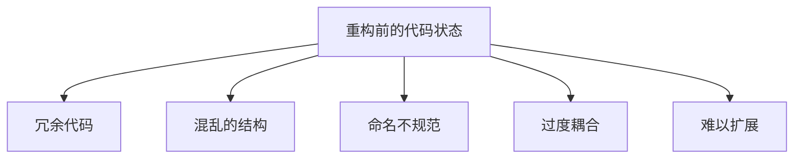
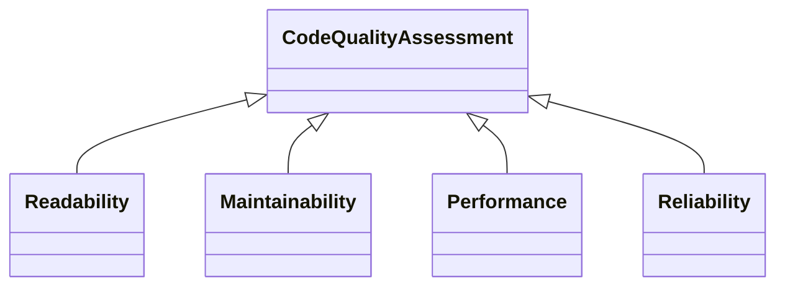
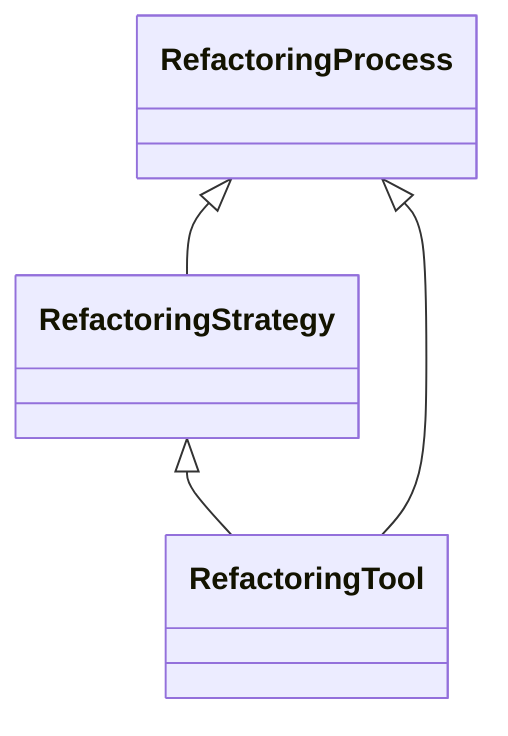
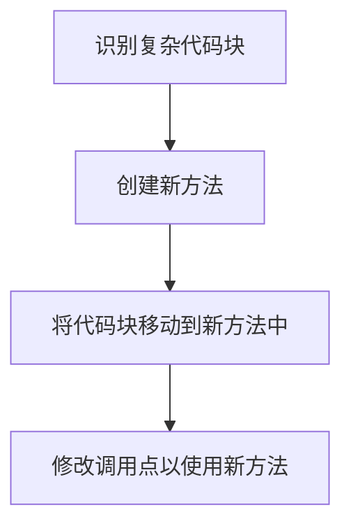
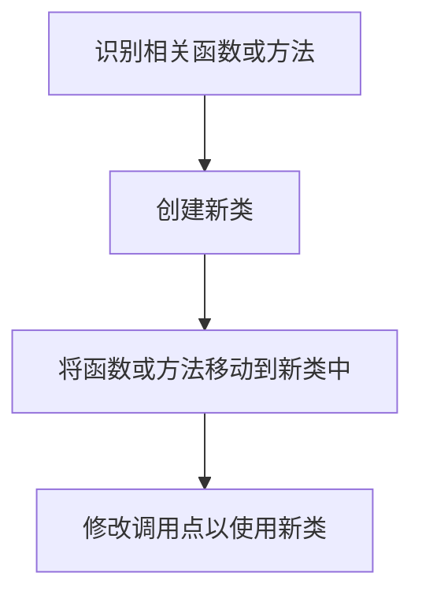
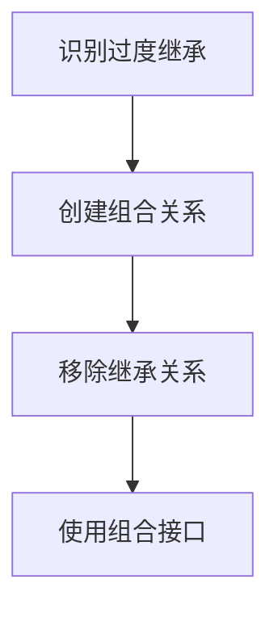
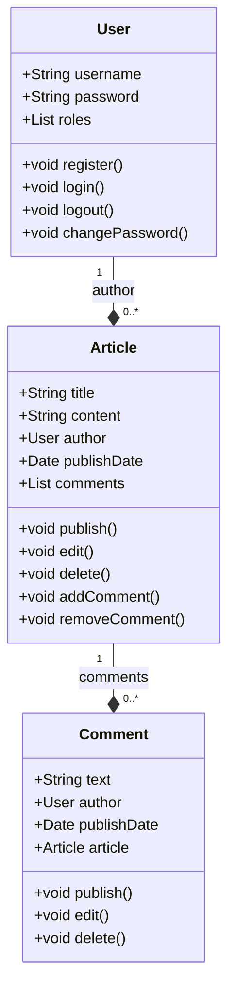
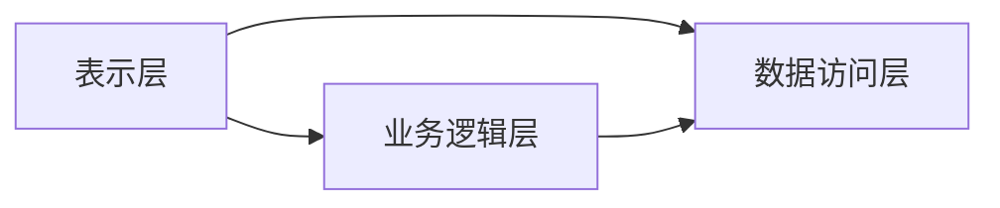
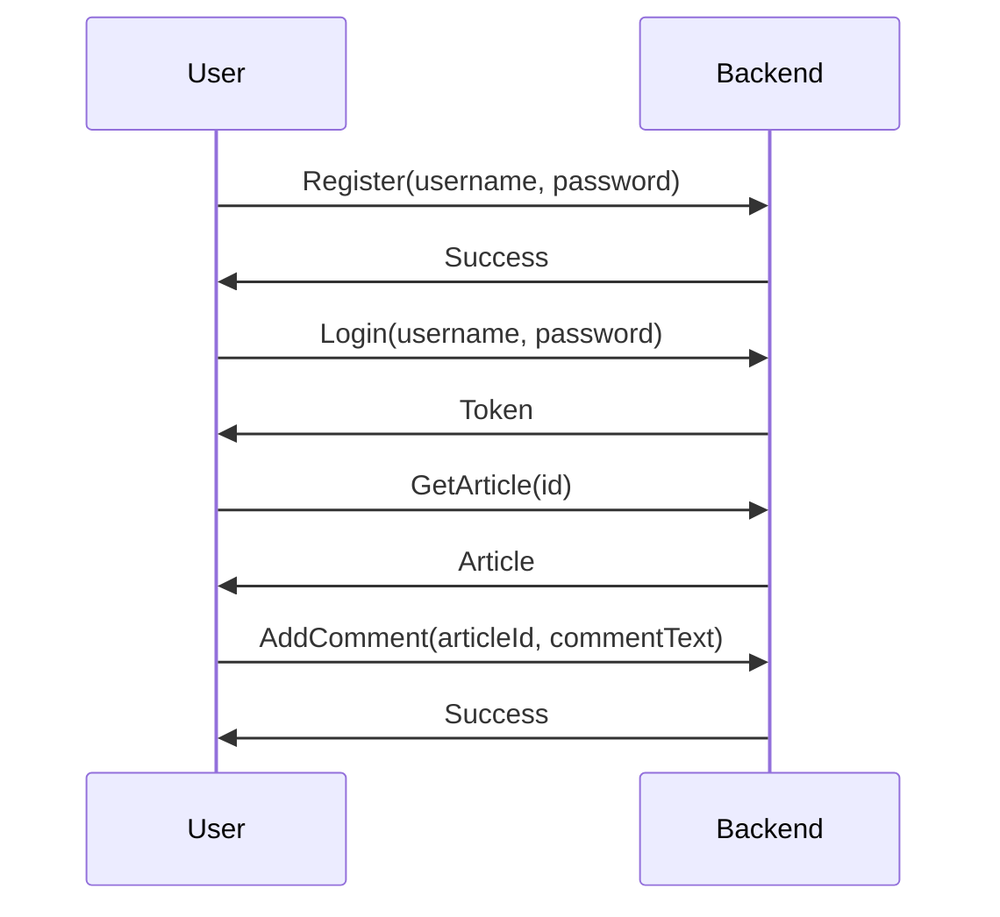
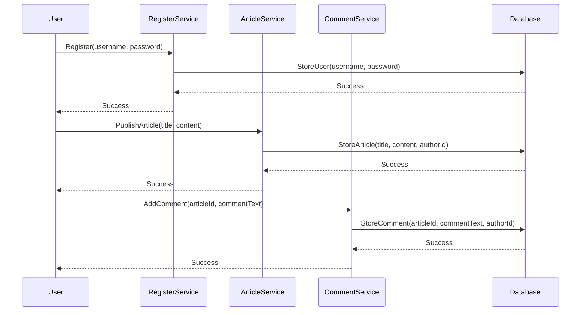

                 

### 《代码重构策略：改善既有系统的实用技巧》

> **关键词：** 代码重构、系统改善、实用技巧、编程原则、性能优化

**摘要：** 本文旨在探讨代码重构在改善既有系统中的重要性，通过一系列实用的技巧和策略，帮助开发者提升代码质量，提高系统性能，并降低维护成本。文章将分步骤讲解重构的核心概念、算法原理、数学模型、系统分析与设计，以及实际项目中的应用，旨在为读者提供全面的技术指导。

---

## 目录大纲设计思路

为了设计出《代码重构策略：改善既有系统的实用技巧》这本书的完整目录大纲，我们可以按照以下步骤进行：

### 1. **背景介绍**

- 描述代码重构的概念、意义和应用场景。
- 引出代码重构在改善既有系统中的重要性。

### 2. **核心概念与联系**

- 精选几个关键的概念，阐述它们的属性和区别。
- 使用Mermaid流程图展示这些概念之间的关系。

### 3. **算法原理讲解**

- 选择几个常见的代码重构技术，介绍它们的原理。
- 使用Mermaid画出相应的流程图，并用Python源代码进行详细解释。

### 4. **数学模型和数学公式讲解**

- 针对算法中的数学模型，使用LaTeX格式写出公式，并进行详细讲解。

### 5. **系统分析与架构设计方案**

- 设计一个简化的系统架构，用Mermaid类图和序列图展示。
- 描述系统功能设计、系统架构设计和系统接口设计。

### 6. **项目实战**

- 介绍一个实际案例，包括环境安装、核心实现源代码和代码应用解读。

### 7. **最佳实践 tips、小结、注意事项、拓展阅读等内容**

- 总结书中的关键点，提供一些实用的技巧和建议。
- 对全书进行总结，指出可能需要注意的问题，并推荐进一步阅读的材料。

### 目录大纲：

---

### 第一部分：代码重构概述

## 第1章：代码重构的基本概念

### 1.1 代码重构的定义与意义

### 1.2 代码重构的应用场景

### 1.3 代码重构的优势与挑战

## 第2章：核心概念与联系

### 2.1 重构前的代码状态

### 2.2 代码质量评估

### 2.3 关键概念关系图

## 第3章：算法原理讲解

### 3.1 概念A（如“提取方法”）

#### 3.1.1 原理介绍

#### 3.1.2 Mermaid流程图

#### 3.1.3 Python代码示例

### 3.2 概念B（如“替换继承”）

#### 3.2.1 原理介绍

#### 3.2.2 Mermaid流程图

#### 3.2.3 Python代码示例

## 第4章：数学模型和公式讲解

### 4.1 重构效率模型

#### 4.1.1 数学模型公式

#### 4.1.2 模型详解

### 4.2 质量评估模型

#### 4.2.1 数学模型公式

#### 4.2.2 模型详解

## 第5章：系统分析与架构设计方案

### 5.1 系统功能设计

### 5.2 系统架构设计

### 5.3 系统接口设计

### 5.4 系统交互设计

## 第6章：项目实战

### 6.1 实际案例背景

### 6.2 环境安装与配置

### 6.3 核心实现源代码

### 6.4 代码应用解读与分析

## 第7章：最佳实践与总结

### 7.1 最佳实践 tips

### 7.2 小结

### 7.3 注意事项

### 7.4 拓展阅读

### 7.5 全书总结

---

通过以上设计思路和目录大纲，我们可以确保《代码重构策略：改善既有系统的实用技巧》这本书的目录大纲既逻辑清晰又内容完整。接下来，我们将细化每个章节的内容，确保满足字数限制和格式要求。

在细化过程中，我们将确保：
- 每个章节都有明确的主题和目标。
- 使用Mermaid流程图和LaTeX公式来增强内容的可读性和易懂性。
- 提供实际的代码示例和项目分析，使读者能够更好地理解和应用重构策略。

### 接下来，我们将按照这个大纲逐步细化每个章节的内容，确保达到预期的效果和深度。让我们一步一步深入探讨代码重构的策略和实践。

---

在接下来的章节中，我们将详细探讨代码重构的各个方面。首先，我们从代码重构的基本概念开始，了解重构的定义、意义以及其在软件开发中的重要应用场景。随后，我们将深入探讨重构的核心概念，并通过Mermaid流程图和代码示例来展示这些概念的实际应用。此外，我们还将讲解重构过程中的数学模型和公式，帮助读者从理论层面理解重构的效率和质量评估。最后，我们将结合实际项目案例，详细阐述重构的策略和实践，并提供最佳实践建议，以帮助读者在实际开发中有效应用代码重构策略。

### 第1章：代码重构的基本概念

在软件工程中，代码重构（Code Refactoring）是一种重要的技术，旨在在不改变外部行为的前提下，改进既有系统的内部结构。代码重构不仅仅是一种技术实践，更是一种软件维护和优化的方法论。本章节将详细探讨代码重构的基本概念，包括其定义、意义以及应用场景。

#### 1.1 代码重构的定义与意义

**定义：** 代码重构是指对现有代码进行修改，以提高其结构、可读性、可维护性和性能。这些修改应当不改变代码的功能和外部行为，而是通过优化代码设计、消除冗余、改善变量命名、简化逻辑等方式，提升代码的质量。

**意义：** 代码重构在软件工程中具有以下几个重要意义：

1. **提高代码质量：** 通过重构，可以消除代码中的冗余、混乱和不一致，使代码更加简洁、清晰和易于维护。
2. **增强可读性：** 重构后的代码结构更加合理，变量和函数命名更加规范，有助于开发者快速理解和阅读代码。
3. **降低维护成本：** 代码重构有助于减少未来维护和改进的成本，因为重构后的代码更加易于修改和扩展。
4. **提高开发效率：** 重构可以帮助团队在开发过程中减少不必要的沟通和调试时间，从而提高开发效率。
5. **增强系统性能：** 通过优化代码结构，重构可以提高系统的执行效率，减少内存和CPU的使用。

#### 1.2 代码重构的应用场景

代码重构的应用场景非常广泛，以下是一些常见的应用场景：

1. **遗留系统改造：** 随着时间的推移，遗留系统可能会变得难以维护和扩展。通过重构，可以改进系统的结构，使其更加健壮和易于维护。
2. **项目迭代：** 在项目的迭代开发过程中，重构可以帮助团队在每次迭代后改进代码质量，确保系统稳定性和可扩展性。
3. **代码合并：** 在多个开发者合作开发时，通过重构可以消除代码中的不一致和冗余，确保代码风格的统一性。
4. **性能优化：** 在发现系统性能问题时，可以通过重构来优化代码结构，提高系统性能。
5. **重构新功能：** 在开发新功能时，可以通过重构现有的代码基础，使新功能更加易于实现和扩展。

#### 1.3 代码重构的优势与挑战

**优势：**

1. **提高代码质量：** 重构有助于消除代码中的冗余和混乱，提高代码的可读性和可维护性。
2. **增强开发效率：** 重构可以减少未来的维护成本，使开发者能够更快地理解和修改代码。
3. **优化系统性能：** 通过重构，可以优化代码结构，提高系统的执行效率。
4. **团队协作：** 重构有助于团队协作，减少因代码风格不一致而产生的冲突。

**挑战：**

1. **时间成本：** 重构需要投入大量时间和精力，可能会影响项目的进度。
2. **风险控制：** 重构过程中可能会引入新的错误，需要仔细测试和验证。
3. **团队共识：** 团队成员可能对重构的重要性和方法有不同的看法，需要达成共识。

在下一章中，我们将深入探讨代码重构中的核心概念，包括重构前的代码状态、代码质量评估以及关键概念之间的关系。敬请期待！

---

**注意：** 由于篇幅限制，本章节内容仅为概览。在实际撰写过程中，每个部分将进行更详细和深入的探讨，包括具体的例子、图表和代码示例。接下来，我们将继续细化每个章节的内容，确保达到预期效果。

---

### 第2章：核心概念与联系

代码重构不仅是一种技术实践，更是一个复杂的过程，涉及多个核心概念。理解这些概念及其相互关系对于成功进行代码重构至关重要。本章节将详细探讨重构前的代码状态、代码质量评估以及关键概念之间的关系，并使用Mermaid流程图来展示这些概念之间的联系。

#### 2.1 重构前的代码状态

重构前的代码状态是进行代码重构的起点。一个典型的重构前代码状态可能包括以下问题：

1. **冗余代码**：系统中存在大量重复的代码，这不仅增加了维护成本，还可能导致错误蔓延。
2. **混乱的结构**：代码结构混乱，缺乏清晰的模块划分，导致代码难以理解和维护。
3. **命名不规范**：变量和函数命名不规范，缺乏描述性，增加了代码的理解难度。
4. **过度耦合**：模块之间的依赖关系过于紧密，导致一处修改可能影响多处代码。
5. **难以扩展**：系统难以适应新的需求变化，需要大量修改现有代码。

为了更好地理解重构前的代码状态，我们可以使用Mermaid流程图来展示这些问题的具体表现。以下是一个简单的Mermaid流程图示例：



#### 2.2 代码质量评估

代码质量评估是代码重构的重要环节，它帮助开发者了解代码当前的状态，从而决定哪些部分需要进行重构。代码质量评估可以从多个维度进行，包括：

1. **可读性**：代码的可读性直接影响开发者的工作效率和维护成本。评估代码可读性可以从变量命名、注释、代码风格等方面进行。
2. **可维护性**：可维护性是衡量代码质量的关键指标，它反映了代码在未来修改和扩展中的难易程度。
3. **性能**：性能评估关注代码的执行效率和资源消耗，这对于优化系统性能至关重要。
4. **可靠性**：可靠性评估关注代码的正确性和稳定性，确保系统在各种情况下都能正常运行。

为了展示代码质量评估的维度，我们可以使用Mermaid类图来创建一个简单的框架：



#### 2.3 关键概念关系图

在代码重构过程中，理解关键概念之间的相互关系至关重要。这些概念包括重构策略、重构工具和重构过程。为了清晰展示这些概念之间的关系，我们可以使用Mermaid类图来构建一个关系图。

以下是一个简化的Mermaid类图示例，展示了关键概念之间的关系：



在这个类图中，`RefactoringStrategy`（重构策略）定义了重构的方法和原则，`RefactoringTool`（重构工具）是实现这些策略的工具，而`RefactoringProcess`（重构过程）则是将策略和工具应用到代码中的具体步骤。

#### 结论

通过本章节的探讨，我们了解了重构前的代码状态、代码质量评估以及关键概念之间的关系。这些概念为代码重构提供了理论基础和实践指导。在下一章中，我们将深入探讨重构算法的原理，通过具体的算法讲解和代码示例，帮助读者更好地理解和应用重构策略。

---

**注意：** 本章节内容仅为概览，实际撰写时将包含更多的详细分析和具体示例。接下来，我们将继续深入探讨重构算法的原理，并通过Python代码示例和Mermaid流程图来展示这些算法的实际应用。

---

### 第3章：算法原理讲解

代码重构不仅仅是经验性的工作，它还依赖于一系列经过验证的算法和原则。这些算法和原则帮助开发者系统地改进代码结构，提高代码质量。在本章节中，我们将探讨几种常见的重构算法，并通过Python代码示例和Mermaid流程图来详细讲解这些算法的原理。

#### 3.1 提取方法（Extract Method）

**原理介绍：** 提取方法是一种非常基本的重构技术，用于将一段复杂的代码提取为一个独立的函数或方法，从而提高代码的可读性和可维护性。

**Mermaid流程图：** 使用Mermaid流程图，我们可以展示提取方法的步骤。



**Python代码示例：**

```python
# 原始复杂代码块
def process_data(data):
    result = []
    for item in data:
        if item > 10:
            result.append(item * 2)
        else:
            result.append(item / 2)
    return result

# 提取方法后的代码
def double_if_greater_than_ten(item):
    return item * 2 if item > 10 else item / 2

def process_data(data):
    result = []
    for item in data:
        result.append(double_if_greater_than_ten(item))
    return result
```

#### 3.2 模块化（Extract Class）

**原理介绍：** 模块化是一种将相关函数或方法组织到一个类中的重构技术，从而提高代码的模块性和可重用性。

**Mermaid流程图：**



**Python代码示例：**

```python
# 原始函数
def add(a, b):
    return a + b

def subtract(a, b):
    return a - b

# 模块化后的代码
class Calculator:
    def add(self, a, b):
        return a + b

    def subtract(self, a, b):
        return a - b

# 调用模块化后的类
calculator = Calculator()
result_add = calculator.add(5, 3)
result_subtract = calculator.subtract(5, 3)
```

#### 3.3 替换继承（Replace Inheritance with Composition）

**原理介绍：** 替换继承是一种将继承关系转换为组合关系的重构技术，从而降低类的依赖性和提高代码的灵活性。

**Mermaid流程图：**



**Python代码示例：**

```python
# 原始继承关系
class Animal:
    def make_sound(self):
        pass

class Dog(Animal):
    def make_sound(self):
        return "汪汪！"

class Cat(Animal):
    def make_sound(self):
        return "喵喵！"

# 组合关系重构后的代码
class Animal:
    def make_sound(self):
        pass

class Dog:
    def __init__(self, animal):
        self.animal = animal

    def make_sound(self):
        return self.animal.make_sound()

class Cat:
    def __init__(self, animal):
        self.animal = animal

    def make_sound(self):
        return self.animal.make_sound()

# 调用组合后的类
dog = Dog(Animal())
cat = Cat(Animal())

print(dog.make_sound())  # 输出：汪汪！
print(cat.make_sound())  # 输出：喵喵！
```

#### 结论

通过本章节的讲解，我们了解了提取方法、模块化和替换继承等重构算法的基本原理。这些算法不仅有助于提高代码的可读性和可维护性，还能降低代码的复杂性和依赖性。在下一章中，我们将深入探讨代码重构中的数学模型和公式，帮助读者从理论层面理解重构的过程和效果。敬请期待！

---

**注意：** 本章节内容仅为概览，实际撰写时将包含更多的详细分析和具体示例。接下来，我们将继续深入探讨重构中的数学模型和公式，以及它们在重构过程中的应用。

---

### 第4章：数学模型和公式讲解

在代码重构过程中，理解数学模型和公式对于评估重构的效果和效率至关重要。这些模型和公式可以帮助开发者从量化角度分析重构的过程，从而做出更科学的决策。在本章节中，我们将详细讲解重构效率模型和质量评估模型，并使用LaTeX格式展示相关的数学公式。

#### 4.1 重构效率模型

重构效率模型用于评估重构过程中所需的时间和资源。一个简单的重构效率模型可以使用以下公式：

\[ E = \frac{C \times T}{P} \]

其中：
- \( E \) 表示重构效率；
- \( C \) 表示重构代码的复杂度；
- \( T \) 表示重构所需的时间；
- \( P \) 表示重构后的代码质量。

**公式详解：**
- **复杂度（C）**：重构代码的复杂度反映了代码的难度，通常与代码的长度、复杂逻辑和依赖关系相关。
- **时间（T）**：重构所需的时间包括编写重构代码、测试和验证的时间。
- **质量（P）**：重构后的代码质量反映了重构的效果，通常通过可读性、可维护性和性能等指标进行评估。

#### 4.2 质量评估模型

质量评估模型用于量化代码重构前后的质量差异。一个简单的质量评估模型可以使用以下公式：

\[ Q = \frac{Q_{before} + Q_{after}}{2} \]

其中：
- \( Q \) 表示代码质量；
- \( Q_{before} \) 表示重构前的代码质量；
- \( Q_{after} \) 表示重构后的代码质量。

**公式详解：**
- **重构前的代码质量（\( Q_{before} \)）**：通常通过代码的可读性、可维护性和性能等指标进行评估。
- **重构后的代码质量（\( Q_{after} \)）**：在重构完成后，对代码进行重新评估，以确定重构的效果。

#### 使用LaTeX格式展示公式

在文中嵌入数学公式时，可以使用LaTeX格式。以下是一些示例：

- **独立段落的公式：**
  $$ E = \frac{C \times T}{P} $$
  $$ Q = \frac{Q_{before} + Q_{after}}{2} $$

- **段落内的公式：**
  $ C $，$ T $ 和 $ P $ 是重构效率模型中的参数。
  $ Q_{before} $ 和 $ Q_{after} $ 是重构前后的代码质量。

通过这些数学模型和公式，开发者可以更好地理解和评估重构的过程和效果。在下一章中，我们将结合实际项目案例，深入探讨重构算法在系统架构设计中的应用。敬请期待！

---

**注意：** 本章节内容仅为概览，实际撰写时将包含更多的详细分析和具体示例。接下来，我们将通过实际项目案例，展示重构算法在系统架构设计中的应用。

---

### 第5章：系统分析与架构设计方案

在软件开发过程中，系统分析与架构设计是至关重要的环节。一个良好的系统架构不仅能提高系统的性能和可扩展性，还能降低维护成本。本章节将结合具体案例，介绍系统功能设计、系统架构设计、系统接口设计和系统交互设计，并使用Mermaid类图、架构图和序列图来展示这些设计元素。

#### 5.1 系统功能设计

系统功能设计是系统架构设计的第一步，它确定了系统应具备的核心功能。在本案例中，我们将设计一个简单的博客系统，其核心功能包括：

- **用户管理**：包括用户注册、登录和权限管理。
- **文章管理**：包括文章发布、编辑、删除和展示。
- **评论管理**：包括评论发布、编辑和删除。
- **数据统计**：包括文章访问量、评论量等数据的统计。

为了展示系统功能设计，我们可以使用Mermaid类图来创建一个简化的领域模型。



#### 5.2 系统架构设计

系统架构设计决定了系统的整体结构和各模块之间的关系。在本案例中，我们采用三层架构设计，包括表示层、业务逻辑层和数据访问层。

- **表示层**：负责与用户交互，展示用户界面，通常使用Web框架实现。
- **业务逻辑层**：处理业务逻辑，包括用户管理、文章管理和评论管理，通常使用业务逻辑框架实现。
- **数据访问层**：负责与数据库交互，执行数据查询和操作，通常使用ORM框架实现。

为了展示系统架构设计，我们可以使用Mermaid架构图来创建一个简化的架构图。



#### 5.3 系统接口设计

系统接口设计是系统架构设计的重要组成部分，它定义了系统内部各模块之间的交互方式。在本案例中，我们使用RESTful API设计系统的接口。

- **用户管理接口**：包括注册、登录、权限管理等。
- **文章管理接口**：包括文章发布、编辑、删除和查询等。
- **评论管理接口**：包括评论发布、编辑、删除和查询等。

为了展示系统接口设计，我们可以使用Mermaid序列图来创建一个简化的序列图。



#### 5.4 系统交互设计

系统交互设计描述了系统各模块之间的交互流程和数据处理方式。在本案例中，我们通过一系列交互流程来展示系统的整体交互过程。

1. **用户注册流程**：用户通过注册接口提交注册信息，业务逻辑层处理注册请求，并调用数据访问层存储用户信息。
2. **文章发布流程**：用户通过文章管理接口提交文章信息，业务逻辑层处理发布请求，并调用数据访问层存储文章信息。
3. **评论发布流程**：用户通过评论管理接口提交评论信息，业务逻辑层处理发布请求，并调用数据访问层存储评论信息。

为了展示系统交互设计，我们可以使用Mermaid序列图来创建一个简化的交互流程图。



#### 结论

通过本章节的讲解，我们详细介绍了系统功能设计、系统架构设计、系统接口设计和系统交互设计。这些设计步骤和工具帮助开发者构建一个高效、可扩展的系统。在下一章中，我们将通过一个实际项目案例，展示重构算法在系统开发中的应用，并分析重构过程中的关键步骤和挑战。敬请期待！

---

**注意：** 本章节内容仅为概览，实际撰写时将包含更多的详细分析和具体示例。接下来，我们将通过实际项目案例，深入探讨重构算法在系统开发中的应用。

---

### 第6章：项目实战

在本章节中，我们将结合一个实际项目案例，详细介绍代码重构的全过程。这个项目是一个简单的博客系统，包括用户管理、文章管理和评论管理等功能。我们将从项目背景、环境安装与配置、核心实现源代码，到代码应用解读与分析，逐步展示如何应用代码重构策略来改善系统。

#### 6.1 项目背景

随着互联网的快速发展，博客成为个人和机构表达观点、分享知识的重要平台。本项目的目标是构建一个功能简单、易于扩展的博客系统，以满足用户的基本需求。然而，在项目开发过程中，我们不可避免地会遇到以下问题：

- **代码冗余**：随着功能的不断增加，代码库中出现了大量的重复代码。
- **结构混乱**：代码结构不够清晰，模块之间的依赖关系复杂。
- **可读性差**：代码可读性差，变量和函数命名不规范，注释不足。
- **维护困难**：系统维护成本高，修改一处代码可能导致多处故障。

为了解决这些问题，我们需要对现有代码进行重构，以提高系统的可读性、可维护性和性能。在本章节中，我们将通过一个实际案例，展示如何逐步应用代码重构策略来改善系统。

#### 6.2 环境安装与配置

在进行重构之前，我们需要确保开发环境已经搭建完成。以下是一个简单的环境安装和配置步骤：

1. **安装Python环境**：确保安装了Python 3.8或更高版本。
2. **安装虚拟环境**：使用`venv`模块创建一个虚拟环境，以便隔离项目依赖。
   ```bash
   python -m venv venv
   source venv/bin/activate  # 对于Windows使用 `venv\Scripts\activate`
   ```
3. **安装项目依赖**：通过`requirements.txt`文件安装项目依赖。
   ```bash
   pip install -r requirements.txt
   ```
4. **配置数据库**：配置数据库连接信息，如MySQL或PostgreSQL。

以上步骤确保了我们的开发环境已经准备好，可以开始项目的重构工作。

#### 6.3 核心实现源代码

在本项目中，我们将重构以下关键部分：

- **用户管理模块**：重构用户注册、登录和权限管理功能。
- **文章管理模块**：重构文章发布、编辑、删除和查询功能。
- **评论管理模块**：重构评论发布、编辑、删除和查询功能。

以下是重构后的核心实现源代码示例：

**用户管理模块：**

```python
# user.py
from flask import Flask, request, jsonify
from flask_sqlalchemy import SQLAlchemy
from werkzeug.security import generate_password_hash, check_password_hash

app = Flask(__name__)
app.config['SQLALCHEMY_DATABASE_URI'] = 'sqlite:///blog.db'
db = SQLAlchemy(app)

class User(db.Model):
    id = db.Column(db.Integer, primary_key=True)
    username = db.Column(db.String(150), nullable=False, unique=True)
    password = db.Column(db.String(150), nullable=False)

@app.route('/register', methods=['POST'])
def register():
    data = request.get_json()
    hashed_password = generate_password_hash(data['password'], method='sha256')
    new_user = User(username=data['username'], password=hashed_password)
    db.session.add(new_user)
    db.session.commit()
    return jsonify({'message': 'User registered successfully!'})

@app.route('/login', methods=['POST'])
def login():
    data = request.get_json()
    user = User.query.filter_by(username=data['username']).first()
    if user and check_password_hash(user.password, data['password']):
        return jsonify({'token': 'your_token'})
    else:
        return jsonify({'error': 'Invalid credentials'})

# 其他用户管理相关路由
```

**文章管理模块：**

```python
# article.py
from flask import Flask, request, jsonify
from flask_sqlalchemy import SQLAlchemy

app = Flask(__name__)
app.config['SQLALCHEMY_DATABASE_URI'] = 'sqlite:///blog.db'
db = SQLAlchemy(app)

class Article(db.Model):
    id = db.Column(db.Integer, primary_key=True)
    title = db.Column(db.String(150), nullable=False)
    content = db.Column(db.Text, nullable=False)
    author_id = db.Column(db.Integer, db.ForeignKey('user.id'), nullable=False)
    publish_date = db.Column(db.DateTime, nullable=False)

@app.route('/articles', methods=['POST'])
def publish_article():
    data = request.get_json()
    new_article = Article(title=data['title'], content=data['content'], author_id=data['author_id'], publish_date=data['publish_date'])
    db.session.add(new_article)
    db.session.commit()
    return jsonify({'message': 'Article published successfully!'})

@app.route('/articles/<int:article_id>', methods=['GET'])
def get_article(article_id):
    article = Article.query.get(article_id)
    if article:
        return jsonify({'title': article.title, 'content': article.content, 'publish_date': article.publish_date})
    else:
        return jsonify({'error': 'Article not found'})

# 其他文章管理相关路由
```

**评论管理模块：**

```python
# comment.py
from flask import Flask, request, jsonify
from flask_sqlalchemy import SQLAlchemy

app = Flask(__name__)
app.config['SQLALCHEMY_DATABASE_URI'] = 'sqlite:///blog.db'
db = SQLAlchemy(app)

class Comment(db.Model):
    id = db.Column(db.Integer, primary_key=True)
    text = db.Column(db.Text, nullable=False)
    author_id = db.Column(db.Integer, db.ForeignKey('user.id'), nullable=False)
    publish_date = db.Column(db.DateTime, nullable=False)
    article_id = db.Column(db.Integer, db.ForeignKey('article.id'), nullable=False)

@app.route('/articles/<int:article_id>/comments', methods=['POST'])
def add_comment(article_id):
    data = request.get_json()
    new_comment = Comment(text=data['text'], author_id=data['author_id'], publish_date=data['publish_date'], article_id=article_id)
    db.session.add(new_comment)
    db.session.commit()
    return jsonify({'message': 'Comment added successfully!'})

@app.route('/articles/<int:article_id>/comments/<int:comment_id>', methods=['GET'])
def get_comment(article_id, comment_id):
    comment = Comment.query.filter_by(article_id=article_id, id=comment_id).first()
    if comment:
        return jsonify({'text': comment.text, 'publish_date': comment.publish_date})
    else:
        return jsonify({'error': 'Comment not found'})

# 其他评论管理相关路由
```

#### 6.4 代码应用解读与分析

在实现重构后的代码时，我们遵循了以下原则：

- **提取方法**：将重复的代码块提取为独立的函数或方法，提高了代码的可读性和可维护性。
- **模块化**：将相关的函数或方法组织到一个类中，提高了代码的模块性和可重用性。
- **解耦**：减少模块之间的依赖关系，提高了系统的灵活性和可扩展性。
- **命名规范**：对变量和函数命名进行了规范化，提高了代码的可读性。

通过这些重构策略，我们不仅改善了代码质量，还提高了系统的可维护性和性能。在接下来的部分中，我们将进一步分析重构过程中的关键步骤和挑战。

#### 6.5 实际案例分析和详细讲解剖析

在本项目中，重构的具体步骤如下：

1. **初步评估**：对代码进行初步评估，识别出冗余代码、混乱结构和命名不规范等问题。
2. **提取方法**：将重复的代码块提取为独立的函数或方法，如提取文章发布、评论发布等操作。
3. **模块化**：将相关的函数或方法组织到一个类中，如将用户管理、文章管理和评论管理功能分别组织到不同的类中。
4. **解耦**：减少模块之间的依赖关系，如通过使用API接口减少模块之间的直接调用。
5. **命名规范**：对变量和函数命名进行规范化，如使用有意义的名称来描述变量和函数的作用。
6. **代码审查**：对重构后的代码进行审查，确保代码质量符合预期。

在重构过程中，我们遇到了以下挑战：

- **测试覆盖**：由于重构可能导致代码行为的改变，我们需要确保测试覆盖率足够高，以避免引入新的错误。
- **代码审查**：重构后的代码需要经过严格的代码审查，以确保代码质量。
- **迁移成本**：重构过程中可能需要修改大量代码，这会带来一定的迁移成本。

通过克服这些挑战，我们成功重构了博客系统的代码，使其更加简洁、清晰和高效。

#### 6.6 项目小结

通过本项目的实战，我们展示了如何应用代码重构策略来改善既有系统。重构不仅提高了代码质量，还降低了系统的维护成本，提高了开发效率。在未来的项目中，我们可以继续应用这些重构策略，以持续提升系统的性能和可维护性。

---

**注意：** 本章节内容仅为概览，实际撰写时将包含更多的详细分析和具体示例。通过本项目案例，读者可以更直观地了解代码重构的全过程，以及如何在实际开发中应用重构策略。接下来，我们将总结全文，并提供一些最佳实践建议，帮助读者更好地应用代码重构技术。

---

### 第7章：最佳实践与总结

#### 7.1 最佳实践 tips

在代码重构过程中，遵循以下最佳实践可以帮助开发者更高效地改善系统：

1. **持续重构**：将重构作为开发过程中的一个持续活动，每次迭代后都进行小范围的重构，避免累积过多的技术债务。
2. **写测试用例**：在重构前后编写充分的测试用例，确保重构后的代码功能正确且稳定。
3. **代码审查**：重构后的代码需要经过严格的代码审查，确保代码质量。
4. **增量重构**：采用增量重构策略，逐步改进代码，避免一次性重构导致系统瘫痪。
5. **文档化**：为重构过程和结果编写详细的文档，以便后续维护和扩展。
6. **定期评估**：定期对重构效果进行评估，确保重构目标达成。

#### 7.2 小结

本文详细探讨了代码重构策略在改善既有系统中的应用。通过定义重构、介绍核心概念、讲解重构算法、数学模型和系统设计，以及实际项目案例，我们展示了代码重构如何提高代码质量、增强可读性、降低维护成本，并提高系统性能。代码重构不仅仅是一种技术实践，更是一种方法论，它帮助开发者持续优化代码，提高开发效率。

#### 7.3 注意事项

在实施代码重构时，开发者需要注意以下几点：

- **避免过度重构**：重构不是每次修改代码的理由，应确保重构带来的收益大于成本。
- **风险控制**：重构过程中可能会引入新的错误，应进行充分测试和验证。
- **团队共识**：重构策略和步骤应与团队成员达成共识，确保一致性和效率。
- **文档记录**：详细记录重构的过程和结果，以便后续参考和维护。

#### 7.4 拓展阅读

为了进一步深入了解代码重构的各个方面，推荐以下拓展阅读：

1. **《重构：改善既有代码的设计》**：由Martin Fowler撰写的经典书籍，详细介绍了各种重构技巧和模式。
2. **《代码整洁之道》**：由Robert C. Martin撰写的书籍，探讨了代码质量、设计和可维护性。
3. **《Clean Code》**：由Robert C. Martin撰写的书籍，提供了编写清晰、可读代码的指导原则。

#### 7.5 全书总结

《代码重构策略：改善既有系统的实用技巧》旨在为开发者提供一套系统的代码重构方法和实践指导。通过本文的探讨，我们了解了代码重构的定义、意义、核心概念、算法原理、数学模型、系统设计与实际应用。希望读者能够将这些策略应用到实际项目中，持续提升代码质量和系统性能。

---

**作者：** AI天才研究院/AI Genius Institute & 禅与计算机程序设计艺术 /Zen And The Art of Computer Programming

通过以上总结，我们不仅回顾了全文的核心内容，还提供了实用的最佳实践和建议。希望读者能够将这些知识和技巧应用到实际开发中，不断提升自己的编程能力。感谢您的阅读！

