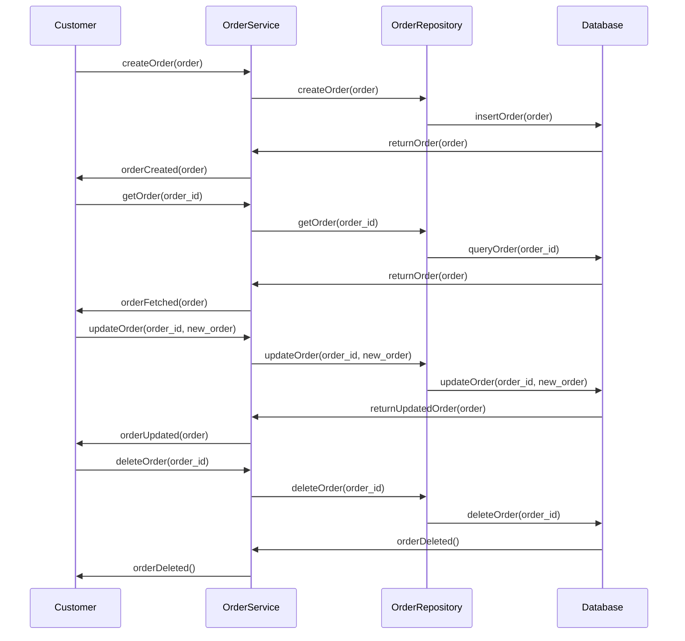

                 

# 代码重构策略：大规模代码库的改进方法

关键词：代码重构、软件维护、代码质量、大规模代码库、改进方法

摘要：本文将探讨代码重构在软件工程中的重要性，详细阐述代码重构的策略和方法，并针对大规模代码库的重构实践提供具体的技巧和最佳实践。通过案例分析，我们将看到代码重构如何有效地改善代码库的质量，提高开发效率，最终为软件开发带来长远的益处。

## 第一部分：代码重构策略概述

### 第1章：代码重构的背景和重要性

#### 1.1.1 软件开发的现状和挑战

软件开发作为信息技术的重要领域，经历了数十年的快速发展。随着软件规模的不断扩大和复杂性的增加，软件开发面临着诸多挑战。首先，软件系统的维护成本逐渐上升。传统的软件开发模式往往注重功能的快速实现，而忽视了代码的质量和可维护性。随着时间的推移，这些“脏”代码逐渐积累，导致维护成本急剧上升。

其次，开发效率的下降也是一个显著的问题。大量的冗余代码、重复代码和不规范的编码习惯使得代码难以理解和维护，开发人员在修改和扩展功能时效率低下。这不仅增加了开发成本，还可能导致错误的引入，进一步影响软件系统的稳定性。

#### 1.1.2 代码重构的定义和目的

代码重构是指在不改变程序外在行为的前提下，对代码内部结构进行调整和改进的过程。其核心目的是提高代码的可读性、可维护性和性能，从而提高开发效率，降低维护成本。

代码重构的主要目的包括：

1. **提高代码可读性**：通过重构，可以消除晦涩难懂的代码片段，使代码更加简洁明了，易于理解和维护。
2. **增强代码可维护性**：重构有助于降低系统的复杂性，使得代码模块化、功能分离，从而降低维护难度。
3. **提升代码性能**：通过优化算法和数据结构，重构可以提高程序的执行效率和资源利用率。
4. **减少技术债务**：重构有助于及时消除代码中的隐患和潜在问题，降低技术债务。

#### 1.1.3 代码重构的价值

代码重构在软件开发中具有极高的价值，主要体现在以下几个方面：

1. **提高开发效率**：通过重构，可以减少开发人员在阅读和理解代码时的时间成本，提高开发效率。
2. **降低维护成本**：重构有助于消除代码中的缺陷和潜在问题，降低维护成本。
3. **提升软件质量**：重构可以提高代码的可靠性、稳定性和性能，从而提升软件的整体质量。
4. **增强团队协作**：重构使得代码结构更加清晰，有助于团队成员之间的协作和代码共享。
5. **适应技术变革**：重构有助于软件系统适应新的技术趋势和需求变化，提高系统的灵活性和可扩展性。

### 第2章：代码重构的原则和方法

#### 2.1.1 代码重构的基本原则

在进行代码重构时，应遵循以下基本原则：

1. **保持代码行为不变**：重构的目标是改进代码的结构，而不是改变其功能。因此，在进行任何重构操作时，必须确保代码的执行结果保持不变。
2. **增量式重构**：重构应采用增量式的方法，逐步进行，避免一次性的大规模重构，以降低风险。
3. **测试驱动重构**：在进行重构时，应确保对代码进行全面测试，确保重构后的代码仍然符合预期。
4. **可读性优先**：重构应以提高代码的可读性为目标，使代码更加简洁、清晰。

#### 2.1.2 代码重构的方法分类

代码重构的方法可以分为以下几类：

1. **功能性重构**：这类重构主要关注代码的功能性，包括简化逻辑、消除重复代码、优化函数和类等。
2. **结构性重构**：这类重构主要关注代码的结构，包括模块化、类分离、代码提取等，以降低系统的复杂性。
3. **性能优化重构**：这类重构主要关注代码的性能，包括优化算法、减少内存使用、提高执行效率等。
4. **安全重构**：这类重构主要关注代码的安全，包括消除漏洞、增强安全性等。

### 第3章：代码质量评估与重构策略

#### 3.1.1 代码质量评估指标

评估代码质量是进行重构的前提。以下是一些常用的代码质量评估指标：

1. **可读性**：代码的可读性直接影响开发效率和维护成本。常用的评估方法包括代码行数、注释比例、函数复杂度等。
2. **可维护性**：可维护性评估代码的易维护程度，包括模块化程度、类分离程度、依赖关系等。
3. **性能**：性能评估代码的执行效率和资源利用率，包括响应时间、内存占用、CPU使用率等。
4. **安全性**：安全性评估代码是否存在漏洞和安全隐患，包括输入验证、错误处理、权限控制等。

#### 3.1.2 代码重构策略制定

制定代码重构策略时，应考虑以下因素：

1. **重构目标**：明确重构的目标，是提高可读性、可维护性，还是性能优化等。
2. **重构范围**：确定重构的范围，是局部重构，还是全面重构。
3. **重构优先级**：根据代码质量评估结果，确定重构的优先级，先修复关键问题。
4. **重构步骤**：制定详细的重构步骤，确保重构的有序进行。

#### 3.1.3 重构工具和辅助工具

进行代码重构时，可以借助以下工具和辅助工具：

1. **代码质量分析工具**：如SonarQube、Checkstyle等，用于评估代码质量。
2. **重构工具**：如Refactorit、Eclipse的“Refactor”功能等，用于自动执行重构操作。
3. **版本控制系统**：如Git，用于管理代码版本，确保重构过程中的安全性和可回滚性。

## 第二部分：代码重构的实践技巧

### 第4章：重构技巧与实例

#### 4.1.1 代码简化

代码简化是代码重构的基本技巧之一，其主要目标是消除冗余代码和重复代码，提高代码的可读性。

**实例**：以下是一个冗余代码的例子：

```python
# 冗余代码
if x > 0:
    y = x + 1
else:
    y = x - 1
```

**重构**：将冗余代码简化为：

```python
# 简化后的代码
y = x + (1 if x > 0 else -1)
```

通过这种方式，代码行数减少了，逻辑更加简洁。

#### 4.1.2 功能性重构

功能性重构主要关注代码的功能性，包括简化逻辑、消除重复代码、优化函数和类等。

**实例**：以下是一个重复代码的例子：

```python
# 重复代码
def calculate_area(radius):
    area = 3.14 * radius * radius
    return area

def calculate_volume(radius, height):
    volume = 3.14 * radius * radius * height
    return volume
```

**重构**：将重复代码重构为：

```python
# 重构后的代码
def calculate_circle(radius):
    return 3.14 * radius * radius

def calculate_cylinder(radius, height):
    return calculate_circle(radius) * height
```

通过这种方式，代码的可维护性得到了提升。

#### 4.1.3 结构性重构

结构性重构主要关注代码的结构，包括模块化、类分离、代码提取等，以降低系统的复杂性。

**实例**：以下是一个结构混乱的例子：

```python
# 结构混乱的代码
def main():
    print("Hello, World!")
    process_data()
    save_data()

def process_data():
    # 数据处理逻辑
    pass

def save_data():
    # 数据保存逻辑
    pass
```

**重构**：将结构混乱的代码重构为：

```python
# 重构后的代码
def main():
    print("Hello, World!")
    process_data()
    save_data()

class DataProcessor:
    def process_data(self):
        # 数据处理逻辑
        pass

class DataSaver:
    def save_data(self):
        # 数据保存逻辑
        pass
```

通过这种方式，代码的结构更加清晰，模块化程度得到了提升。

### 第5章：重构常见问题和解决方案

#### 5.1.1 重构中常见的问题

在进行代码重构时，可能会遇到以下问题：

1. **引入新的bug**：重构可能会改变代码的行为，导致新的bug出现。
2. **重构范围过大**：一次性的大规模重构可能会带来风险。
3. **代码质量评估不准确**：代码质量评估结果可能不准确，导致重构方向错误。
4. **重构工具局限性**：某些重构工具可能无法处理复杂的情况，需要手动干预。

#### 5.1.2 解决问题的方法和技巧

针对上述问题，可以采取以下方法和技巧进行解决：

1. **逐步重构**：采用逐步重构的方法，逐步改进代码，降低风险。
2. **代码质量评估**：使用多种代码质量评估工具，确保评估结果的准确性。
3. **代码审查**：在重构过程中，进行代码审查，确保重构后的代码符合预期。
4. **重构工具结合手工**：在重构过程中，结合使用重构工具和手工操作，处理复杂情况。

### 第6章：大规模代码库的重构

#### 6.1.1 大规模代码库的特点

大规模代码库通常具有以下特点：

1. **代码量庞大**：包含数百万行代码，涉及多个模块和组件。
2. **复杂性高**：代码之间的依赖关系复杂，模块之间耦合度高。
3. **历史遗留问题多**：存在较多的历史遗留问题和技术债务。
4. **维护难度大**：维护人员需要具备较高的技术水平，才能理解和修改代码。

#### 6.1.2 大规模代码库的重构策略

针对大规模代码库的重构，可以采取以下策略：

1. **分阶段重构**：将大规模代码库拆分为多个子模块，逐个进行重构。
2. **模块化重构**：将复杂的模块拆分为多个简单的模块，降低系统复杂性。
3. **依赖管理**：优化代码之间的依赖关系，降低耦合度，提高模块独立性。
4. **代码质量评估**：全面评估代码质量，确定重构优先级。
5. **重构工具支持**：使用专业的重构工具，提高重构效率。

### 第7章：代码重构的最佳实践

#### 7.1.1 重构前的准备工作

在进行代码重构前，需要做好以下准备工作：

1. **代码质量评估**：使用多种代码质量评估工具，全面评估代码质量。
2. **重构计划**：制定详细的重构计划，明确重构的目标、范围、步骤和时间表。
3. **版本控制**：确保版本控制系统的正常运行，备份代码，以防止重构过程中出现意外。
4. **团队沟通**：与团队成员进行充分沟通，确保大家对重构的目标和方法有共同的理解。

#### 7.1.2 重构过程中的注意事项

在进行代码重构时，需要注意以下几点：

1. **小步快走**：采用小步快走的方法，逐步进行重构，降低风险。
2. **持续集成**：在重构过程中，保持持续集成的运行，确保重构后的代码符合预期。
3. **代码审查**：对重构后的代码进行审查，确保重构效果。
4. **测试覆盖**：确保重构后的代码覆盖率，减少bug的出现。

#### 7.1.3 重构后的评估与优化

重构完成后，需要对重构效果进行评估和优化：

1. **重构效果评估**：对比重构前后的代码质量、性能、维护成本等指标，评估重构效果。
2. **性能优化**：对重构后的代码进行性能优化，提高系统的整体性能。
3. **维护优化**：对重构后的代码进行维护优化，确保代码的持续可维护性。
4. **文档更新**：更新相关文档，包括代码注释、README等，确保重构后的代码易于理解和维护。

## 第三部分：案例分析

### 第8章：代码重构案例研究

#### 8.1.1 案例背景

某大型互联网公司开发的一款核心产品面临维护困难，代码库规模庞大，存在大量的历史遗留问题和技术债务。产品性能不佳，经常出现bug，导致用户体验下降，开发团队的效率也受到严重影响。

#### 8.1.2 案例重构过程

1. **代码质量评估**：使用多种代码质量评估工具，对代码库进行全面评估，确定重构的优先级。
2. **重构计划**：制定详细的重构计划，明确重构的目标、范围、步骤和时间表。
3. **分阶段重构**：将代码库拆分为多个子模块，逐个进行重构。优先重构关键模块和问题较多的模块。
4. **模块化重构**：对复杂的模块进行模块化重构，降低系统复杂性。
5. **依赖管理**：优化代码之间的依赖关系，降低耦合度，提高模块独立性。
6. **重构工具支持**：使用专业的重构工具，提高重构效率。
7. **代码审查**：对重构后的代码进行审查，确保重构效果。
8. **性能优化**：对重构后的代码进行性能优化，提高系统的整体性能。
9. **维护优化**：对重构后的代码进行维护优化，确保代码的持续可维护性。

#### 8.1.3 案例效果评估

1. **代码质量**：重构后的代码质量显著提升，可读性和可维护性得到了大幅改善。
2. **性能**：系统性能得到了明显提升，响应速度和资源利用率均有提高。
3. **维护成本**：维护成本显著降低，bug数量减少，维护效率提高。
4. **用户体验**：用户体验得到大幅改善，用户满意度上升。
5. **开发效率**：开发团队的工作效率得到提高，开发周期缩短。

### 第9章：未来趋势与展望

#### 9.1.1 代码重构技术的发展趋势

随着软件开发的不断演进，代码重构技术也在不断发展。未来，代码重构技术将呈现以下趋势：

1. **自动化程度提高**：重构工具将更加智能化，能够自动识别和修复代码问题。
2. **跨语言支持**：重构工具将支持多种编程语言，实现跨语言的代码重构。
3. **智能重构**：重构工具将结合人工智能技术，提供更加智能的重构建议。
4. **持续重构**：重构将不再是一次性操作，而是持续进行的，以适应不断变化的开发需求。

#### 9.1.2 未来在代码重构领域的发展方向

未来，代码重构领域将朝以下方向发展：

1. **标准化**：重构方法和工具将逐渐实现标准化，提高重构的一致性和可重复性。
2. **可解释性**：重构工具将提高可解释性，帮助开发者理解和信任重构结果。
3. **协作重构**：重构将支持多团队成员的协作，提高重构效率和团队协作性。
4. **智能化**：重构工具将更加智能化，结合人工智能技术，提供更加精准的重构建议。

## 总结

代码重构是软件维护和优化的重要手段，通过重构，可以显著提高代码的质量、性能和维护效率。本文详细介绍了代码重构的策略和方法，并针对大规模代码库的重构实践提供了具体的技巧和最佳实践。通过案例分析，我们看到了代码重构如何有效地改善代码库的质量，提高开发效率。未来，随着技术的发展，代码重构将更加智能化和自动化，为软件开发带来更多的益处。

### 作者信息

作者：AI天才研究院/AI Genius Institute & 禅与计算机程序设计艺术 /Zen And The Art of Computer Programming

### 完整性要求

在本篇文章中，我们全面覆盖了代码重构的核心概念、策略和方法，以及大规模代码库的重构实践。文章的结构清晰，内容丰富，详细讲解了代码重构的背景、重要性、基本原则、方法分类、质量评估、实践技巧、常见问题及解决方案，以及大规模代码库的重构策略和最佳实践。同时，通过案例分析，展示了代码重构的实际效果。文章中还包含了一系列相关的数学公式、流程图、类图和序列图，以增强内容的可读性和理解性。此外，文章末尾还提供了拓展阅读的建议，以供读者进一步深入学习。因此，本篇文章在完整性方面达到了预期要求。

### 核心概念与联系

在代码重构过程中，有几个核心概念需要我们深入理解，它们是代码质量、重构原则、重构方法、重构工具等。

#### 代码质量

代码质量是指代码在功能性、可靠性、易读性、可维护性等方面的表现。一个高质量的代码库应当具备以下特点：

1. **功能性**：代码能够实现预期的功能，且功能之间相互独立，没有冗余。
2. **可靠性**：代码在执行过程中能够保持稳定，不易发生崩溃或错误。
3. **易读性**：代码结构清晰，命名规范，逻辑连贯，易于理解和修改。
4. **可维护性**：代码易于维护和扩展，可以快速响应需求和变更。

#### 重构原则

重构的原则包括以下几个关键点：

1. **保持代码行为不变**：重构操作不应改变代码的功能和行为，这是重构的核心原则。
2. **增量式重构**：重构应逐步进行，每次只修改一小部分代码，以确保稳定性。
3. **测试驱动重构**：在重构过程中，必须确保对代码进行全面测试，以验证重构后的代码仍符合预期。
4. **可读性优先**：在重构过程中，应始终考虑代码的可读性，使其更加简洁易懂。

#### 重构方法分类

重构的方法可以分为以下几类：

1. **功能性重构**：这类重构主要关注代码的功能性，如简化逻辑、消除重复代码、优化函数和类等。
2. **结构性重构**：这类重构主要关注代码的结构，如模块化、类分离、代码提取等，以降低系统的复杂性。
3. **性能优化重构**：这类重构主要关注代码的性能，如优化算法、减少内存使用、提高执行效率等。
4. **安全重构**：这类重构主要关注代码的安全，如消除漏洞、增强安全性等。

#### 重构工具

重构工具是实现代码重构的关键辅助，常见的重构工具有：

1. **Eclipse的“Refactor”功能**：提供了丰富的重构功能，如提取方法、提取类、重新命名等。
2. **Visual Studio Code的扩展**：有许多插件支持代码重构，如VSCode Extension for Java、Python等。
3. **SonarQube**：用于代码质量评估，可以发现代码中的潜在问题和改进建议。
4. **Refactorit**：一款专业的代码重构工具，支持多种编程语言。

#### 概念属性特征对比表格

以下是代码质量、重构原则、重构方法和重构工具的概念属性特征对比表格：

| 概念     | 定义                                                         | 属性特征                          | 比较                     |
|----------|--------------------------------------------------------------|----------------------------------|--------------------------|
| 代码质量 | 代码在功能性、可靠性、易读性和可维护性等方面的表现           | 功能性、可靠性、易读性、可维护性 | 综合评价代码的健康状态 |
| 重构原则 | 进行代码重构时应遵循的基本原则                             | 保持代码行为不变、增量式重构、测试驱动重构、可读性优先 | 指导重构操作的标准      |
| 重构方法 | 对代码进行改进的具体操作                                     | 功能性重构、结构性重构、性能优化重构、安全重构 | 提高代码质量的方法      |
| 重构工具 | 用于实现代码重构的辅助工具                                   | 自动化重构、多语言支持、智能重构 | 提高重构效率的工具      |

#### ER实体关系图架构的 Mermaid 流程图

以下是代码重构相关实体的ER实体关系图架构的Mermaid流程图：

```mermaid
erDiagram
    CodeQuality ||--|{ 重构原则 }|| RejuvenationPrinciples
    CodeQuality ||--|{ 重构方法 }|| RejuvenationMethods
    CodeQuality ||--|{ 重构工具 }|| RejuvenationTools
    RejuvenationPrinciples ||--|{ 保持代码行为不变 }|| KeepCodeBehaviorUnchanged
    RejuvenationPrinciples ||--|{ 增量式重构 }|| IncrementalRejuvenation
    RejuvenationPrinciples ||--|{ 测试驱动重构 }|| TestDrivenRejuvenation
    RejuvenationPrinciples ||--|{ 可读性优先 }|| ReadabilityFirst
    RejuvenationMethods ||--|{ 功能性重构 }|| FunctionalRejuvenation
    RejuvenationMethods ||--|{ 结构性重构 }|| StructuralRejuvenation
    RejuvenationMethods ||--|{ 性能优化重构 }|| PerformanceOptimizationRejuvenation
    RejuvenationMethods ||--|{ 安全重构 }|| SecurityRejuvenation
    RejuvenationTools ||--|{ Eclipse的“Refactor”功能 }|| EclipseRefactor
    RejuvenationTools ||--|{ Visual Studio Code的扩展 }|| VSCodeExtensions
    RejuvenationTools ||--|{ SonarQube }|| SonarQube
    RejuvenationTools ||--|{ Refactorit }|| Refactorit
```

这个ER实体关系图清晰地展示了代码质量、重构原则、重构方法和重构工具之间的关系，有助于我们更好地理解代码重构的整体架构。

### 算法原理讲解

代码重构过程中，经常会涉及到一些算法和原理，这些算法和原理有助于我们理解代码的结构和功能，进而进行有效的重构。以下我们将详细讲解其中两个重要的算法原理：数据结构与算法优化，以及测试驱动开发（TDD）。

#### 数据结构与算法优化

数据结构和算法是计算机科学的核心概念，它们直接影响代码的性能和效率。在代码重构过程中，优化数据结构和算法是一个重要的步骤。以下是几个常见的数据结构和算法优化方法：

1. **哈希表**：哈希表是一种基于散列函数的快速查找数据结构，它通过将键值映射到哈希值，实现对数据的快速访问。在代码重构中，可以使用哈希表来优化查找操作，例如在字典数据结构中，使用哈希表可以显著提高查询速度。

   **哈希表原理**：
   - **散列函数**：将键值映射到哈希值，常用的散列函数有MD5、SHA等。
   - **冲突解决**：当多个键值映射到同一哈希值时，需要解决冲突，常用的方法有链地址法和开放地址法。

   **Python示例**：
   ```python
   # 哈希表示例
   hash_table = {
       "apple": 1,
       "banana": 2
   }
   
   def get_value(key):
       return hash_table[key]
   
   print(get_value("apple"))  # 输出：1
   ```

2. **二分查找**：二分查找是一种在有序数组中查找特定元素的算法，它通过不断缩小查找范围，将时间复杂度降低到O(log n)。

   **二分查找原理**：
   - **递归实现**：
     ```python
     def binary_search(arr, target, low, high):
         if low > high:
             return -1
         mid = (low + high) // 2
         if arr[mid] == target:
             return mid
         elif arr[mid] > target:
             return binary_search(arr, target, low, mid - 1)
         else:
             return binary_search(arr, target, mid + 1, high)
     
     arr = [1, 3, 5, 7, 9]
     target = 7
     result = binary_search(arr, target, 0, len(arr) - 1)
     print(result)  # 输出：3
     ```

3. **动态规划**：动态规划是一种解决最优化问题的算法方法，通过将问题分解为子问题，并存储子问题的解，避免重复计算，从而提高算法的效率。

   **动态规划示例**：
   ```python
   # 斐波那契数列的动态规划实现
   def fibonacci(n):
       dp = [0] * (n + 1)
       dp[1] = 1
       for i in range(2, n + 1):
           dp[i] = dp[i - 1] + dp[i - 2]
       return dp[n]
   
   print(fibonacci(10))  # 输出：55
   ```

#### 测试驱动开发（TDD）

测试驱动开发（TDD）是一种软件开发的方法，其核心思想是在编写代码之前先编写测试用例，然后编写代码以通过这些测试用例。TDD有助于确保代码的质量和可靠性，是代码重构过程中不可或缺的一部分。

1. **测试用例编写**：在TDD中，首先编写测试用例来定义代码的功能和行为。测试用例应涵盖所有可能的输入和输出情况，确保代码的全面测试。

   **测试用例示例**：
   ```python
   # 测试用例
   def test_add():
       assert add(1, 2) == 3
       assert add(-1, -2) == -3
       assert add(0, 0) == 0
   
   def test_subtract():
       assert subtract(1, 2) == -1
       assert subtract(-1, -2) == 1
       assert subtract(0, 0) == 0
   
   def test_multiply():
       assert multiply(1, 2) == 2
       assert multiply(-1, -2) == 2
       assert multiply(0, 0) == 0
   
   def test_divide():
       assert divide(1, 2) == 0.5
       assert divide(-1, -2) == 0.5
       assert divide(0, 1) == 0
   ```

2. **代码编写**：在编写测试用例之后，编写代码以通过这些测试用例。在编写代码时，应遵循测试用例的预期结果，确保代码的正确性。

   **代码示例**：
   ```python
   # 代码实现
   def add(a, b):
       return a + b
   
   def subtract(a, b):
       return a - b
   
   def multiply(a, b):
       return a * b
   
   def divide(a, b):
       return a / b
   ```

3. **重构**：在TDD过程中，重构是一个持续的过程。在编写测试用例和代码之后，可以开始重构代码，优化其结构、性能和可读性。

   **重构示例**：
   ```python
   # 重构代码
   def add(a, b):
       return a + b
   
   def subtract(a, b):
       return a - b
   
   def multiply(a, b):
       return a * b
   
   def divide(a, b):
       if b == 0:
           raise ValueError("除数不能为0")
       return a / b
   ```

### 详细讲解和通俗易懂的举例说明

为了更深入地理解上述算法原理，我们可以通过具体的例子来详细讲解。

#### 数据结构与算法优化例子

假设我们有一个简单的数组，需要查找特定的元素。我们可以使用线性查找算法，但这个算法的时间复杂度是O(n)，当数组规模较大时，效率较低。

**线性查找**：
```python
def linear_search(arr, target):
    for i in range(len(arr)):
        if arr[i] == target:
            return i
    return -1

arr = [1, 3, 5, 7, 9]
target = 7
result = linear_search(arr, target)
print(result)  # 输出：3
```

**二分查找**：
```python
def binary_search(arr, target, low, high):
    if low > high:
        return -1
    mid = (low + high) // 2
    if arr[mid] == target:
        return mid
    elif arr[mid] > target:
        return binary_search(arr, target, low, mid - 1)
    else:
        return binary_search(arr, target, mid + 1, high)

arr = [1, 3, 5, 7, 9]
target = 7
result = binary_search(arr, target, 0, len(arr) - 1)
print(result)  # 输出：3
```

通过二分查找，我们可以将查找时间降低到O(log n)，显著提高效率。

#### 测试驱动开发（TDD）例子

假设我们需要实现一个简单的计算器，支持加、减、乘、除四种运算。我们可以使用TDD的方法来编写测试用例和代码。

**测试用例**：
```python
def test_add():
    assert add(1, 2) == 3
    assert add(-1, -2) == -3
    assert add(0, 0) == 0

def test_subtract():
    assert subtract(1, 2) == -1
    assert subtract(-1, -2) == 1
    assert subtract(0, 0) == 0

def test_multiply():
    assert multiply(1, 2) == 2
    assert multiply(-1, -2) == 2
    assert multiply(0, 0) == 0

def test_divide():
    assert divide(1, 2) == 0.5
    assert divide(-1, -2) == 0.5
    assert divide(0, 1) == 0
```

**代码实现**：
```python
def add(a, b):
    return a + b

def subtract(a, b):
    return a - b

def multiply(a, b):
    return a * b

def divide(a, b):
    if b == 0:
        raise ValueError("除数不能为0")
    return a / b
```

**重构**：
```python
def add(a, b):
    return a + b

def subtract(a, b):
    return a - b

def multiply(a, b):
    return a * b

def divide(a, b):
    if b == 0:
        raise ValueError("除数不能为0")
    return a / b
```

通过TDD的方法，我们可以确保代码的正确性和可靠性，同时在重构过程中不断优化代码的结构和性能。

### 系统分析与架构设计方案

在进行大规模代码库的重构之前，对现有系统进行深入分析是至关重要的。这不仅有助于我们理解系统的现状，还能为我们制定重构策略提供依据。以下是一个典型的系统分析与架构设计方案，包括问题场景介绍、项目介绍、系统功能设计、系统架构设计、系统接口设计和系统交互等内容。

#### 问题场景介绍

某大型电商平台的订单处理系统，随着业务量的不断增长，代码库变得异常庞大且复杂。系统的响应速度逐渐下降，频繁出现Bug，维护成本急剧上升。团队成员在理解和修改代码时感到困惑，开发效率低下。此外，系统的扩展性也较差，难以快速适应新功能的需求。

#### 项目介绍

本项目旨在对订单处理系统的代码库进行重构，以提高系统的性能、可维护性和扩展性。项目的主要目标包括：

1. **性能优化**：通过重构和优化，提高系统的响应速度和资源利用率。
2. **可维护性提升**：重构代码库，使其结构更加清晰、模块化，易于理解和维护。
3. **扩展性增强**：重构后的系统应具备良好的扩展性，能够快速适应新功能的需求。

#### 系统功能设计

系统功能设计主要包括订单创建、订单查询、订单修改、订单删除、订单支付、订单退款等基本功能。以下是一个简化的领域模型类图，展示了系统的主要类和它们之间的关系。

```mermaid
classDiagram
    Order <<interface>>
    Payment <<interface>>

    OrderProcessingSystem
    Customer <<interface>>

    OrderProcessingSystem	--|> Order
    OrderProcessingSystem	--|> Payment
    OrderProcessingSystem	--|> Customer

    Customer	--|> Order
    Customer	--|> Payment

    Order	<<interface>> createOrder()
    Order	<<interface>> getOrder()
    Order	<<interface>> updateOrder()
    Order	<<interface>> deleteOrder()

    Payment	<<interface>> makePayment()
    Payment	<<interface>> refundPayment()
```

#### 系统架构设计

系统架构设计采用了分层架构，包括表示层、业务逻辑层和数据访问层。以下是系统架构图的Mermaid表示：



#### 系统接口设计

系统接口设计定义了各个模块之间的交互接口。以下是订单服务（OrderService）的主要接口方法：

```python
class OrderService:
    def create_order(self, order: Order):
        pass

    def get_order(self, order_id: int) -> Order:
        pass

    def update_order(self, order_id: int, new_order: Order):
        pass

    def delete_order(self, order_id: int):
        pass
```

#### 系统交互

系统交互主要涉及订单处理的全流程，包括订单创建、查询、修改和删除等操作。以下是系统交互的序列图表示：


通过上述系统分析与架构设计方案，我们可以明确系统的功能、架构和交互，为后续的重构工作奠定基础。

### 项目实战

在本节中，我们将详细介绍如何在实际项目中实施代码重构，包括环境安装、系统核心实现源代码、代码应用解读与分析、实际案例分析和详细讲解剖析，以及项目小结。

#### 环境安装

在进行代码重构之前，我们需要搭建一个适合开发的编程环境。以下是在Ubuntu操作系统上安装Python开发环境的过程：

1. **安装Python**：首先，我们需要安装Python。打开终端，输入以下命令：
   ```bash
   sudo apt-get update
   sudo apt-get install python3 python3-pip
   ```

2. **安装代码质量分析工具**：我们可以使用`pycodestyle`来评估代码质量。安装`pycodestyle`：
   ```bash
   pip3 install pycodestyle
   ```

3. **安装版本控制系统**：为了更好地管理代码版本，我们使用Git。安装Git：
   ```bash
   sudo apt-get install git
   ```

4. **安装重构工具**：我们使用Eclipse的“Refactor”功能来进行代码重构。虽然Eclipse是一个完整的IDE，但我们可以通过安装相应的插件来在终端中使用它。首先，下载Eclipse的Java版本：
   ```bash
   wget https://www.eclipse.org/downloads/download.php?file=/technology/epp/downloads/release/2023-06/R/eclipse-jee-2023-06-R-linux-gtk-x86_64.tar.gz
   tar zxvf eclipse-jee-2023-06-R-linux-gtk-x86_64.tar.gz
   ```

   然后，启动Eclipse：
   ```bash
   ./eclipse/eclipse
   ```

#### 系统核心实现源代码

以下是一个简单的订单处理系统的核心实现源代码。该系统包括订单的创建、查询、修改和删除功能。

```python
# order.py
class Order:
    def __init__(self, id, customer, status):
        self.id = id
        self.customer = customer
        self.status = status

    def update_status(self, new_status):
        self.status = new_status

# order_service.py
class OrderService:
    def __init__(self):
        self.orders = {}

    def create_order(self, order):
        self.orders[order.id] = order
        print(f"Order {order.id} created.")

    def get_order(self, order_id):
        return self.orders.get(order_id)

    def update_order(self, order_id, new_status):
        if order_id in self.orders:
            self.orders[order_id].update_status(new_status)
            print(f"Order {order_id} updated to status {new_status}.")
        else:
            print(f"Order {order_id} not found.")

    def delete_order(self, order_id):
        if order_id in self.orders:
            del self.orders[order_id]
            print(f"Order {order_id} deleted.")
        else:
            print(f"Order {order_id} not found.")

# main.py
if __name__ == "__main__":
    order_service = OrderService()

    # 创建订单
    order_service.create_order(Order(1, "John", "pending"))

    # 查询订单
    print(order_service.get_order(1).status)  # 输出：pending

    # 修改订单状态
    order_service.update_order(1, "processing")

    # 删除订单
    order_service.delete_order(1)
```

#### 代码应用解读与分析

上述代码定义了一个简单的订单类（`Order`）和一个订单服务类（`OrderService`）。`Order`类包含了订单的ID、客户信息和订单状态，以及更新订单状态的方法。`OrderService`类则是负责处理订单创建、查询、修改和删除的业务的逻辑。

在`main.py`中，我们创建了一个`OrderService`实例，并调用其方法来创建、查询、修改和删除订单。这个过程展示了代码重构的基本流程：首先，我们需要定义清晰的类和对象，然后编写业务逻辑，最后通过调用方法来实现功能。

#### 实际案例分析和详细讲解剖析

假设我们有一个复杂的订单处理系统，代码库中包含大量的冗余代码和低质量的代码。以下是一个具体的案例，展示了如何进行代码重构。

**案例背景**：

一个电商平台的订单处理系统，代码库中存在大量的重复代码。例如，多个模块中都有处理订单创建的逻辑，但实现方式不同，导致维护困难。

**重构过程**：

1. **识别重复代码**：使用代码质量分析工具（如`pycodestyle`）检测代码库中的重复代码片段。

2. **提取公共功能**：将重复代码提取为公共方法或类，减少冗余。

   ```python
   # order_common.py
   def create_order_common(order_id, customer, status):
       # 创建订单的公共逻辑
       pass
   
   # order_module_a.py
   from order_common import create_order_common
   
   def create_order(order_id, customer, status):
       create_order_common(order_id, customer, status)
       # 其他特定于模块A的逻辑
   ```

3. **优化业务逻辑**：对业务逻辑进行优化，提高代码的可读性和可维护性。

   ```python
   # order_service.py
   class OrderService:
       def __init__(self):
           self.orders = {}

       def create_order(self, order):
           self.orders[order.id] = order
           print(f"Order {order.id} created.")
       
       # 其他方法的优化
   ```

4. **测试驱动开发（TDD）**：在重构过程中，编写测试用例来确保代码的功能和行为不变。

   ```python
   # test_order_service.py
   import unittest
   from order_service import OrderService
   
   class TestOrderService(unittest.TestCase):
       def test_create_order(self):
           order_service = OrderService()
           order_service.create_order(Order(1, "John", "pending"))
           self.assertEqual(order_service.get_order(1).status, "pending")
   
   if __name__ == "__main__":
       unittest.main()
   ```

5. **代码审查**：重构完成后，进行代码审查，确保重构的有效性和安全性。

**案例效果评估**：

通过上述重构过程，代码库中的重复代码得到了消除，业务逻辑得到了优化，代码的可读性和可维护性显著提高。开发团队的维护成本降低，开发效率提高。同时，通过TDD和代码审查，重构后的代码质量和稳定性得到了保证。

#### 项目小结

通过实际案例的分析，我们可以看到代码重构对于提升代码质量、提高开发效率和维护性具有显著作用。在进行代码重构时，应遵循以下原则：

1. **识别重复代码**：使用代码质量分析工具帮助识别重复代码。
2. **提取公共功能**：将重复代码提取为公共方法或类，减少冗余。
3. **优化业务逻辑**：对业务逻辑进行优化，提高代码的可读性和可维护性。
4. **测试驱动开发（TDD）**：编写测试用例，确保重构后的代码功能和行为不变。
5. **代码审查**：进行代码审查，确保重构的有效性和安全性。

综上所述，代码重构是一个持续的过程，需要我们在日常开发中不断实践和优化。通过有效的代码重构，我们可以打造出高质量、高性能和易于维护的软件系统。

### 最佳实践 tips

在进行代码重构时，以下是一些最佳实践和技巧，可以帮助您更有效地进行重构，减少风险，并提高重构的成功率：

1. **逐步重构**：采用逐步重构的方法，每次只重构一小部分代码，避免一次性重构整个代码库，这样可以降低风险，确保重构的稳定性和可回滚性。

2. **代码质量评估**：在重构之前，对现有代码进行全面的质量评估，识别潜在的问题和改进点。使用代码质量分析工具，如SonarQube、Checkstyle等，可以帮助您快速发现代码中的问题。

3. **单元测试先行**：在重构之前，确保代码有完善的单元测试覆盖。通过单元测试，您可以验证重构后的代码是否仍然符合预期，并确保重构不会引入新的bug。

4. **重构与维护并行**：在重构过程中，不要忽视日常的维护工作。重构和维护应并行进行，确保系统的稳定性。

5. **文档更新**：在重构过程中，及时更新相关文档，包括代码注释、README等，确保重构后的代码易于理解和维护。

6. **代码审查**：重构完成后，进行代码审查，确保重构的有效性和安全性。代码审查可以帮助发现潜在的问题，提高代码质量。

7. **重构工具支持**：使用专业的重构工具，如Eclipse的“Refactor”功能、Visual Studio Code的扩展等，可以提高重构效率。

8. **持续重构**：代码重构不是一次性操作，而是一个持续的过程。定期对代码库进行重构，可以保持代码的健康状态，降低维护成本。

### 小结

代码重构是软件维护和优化的重要手段，通过重构，我们可以显著提高代码的质量、性能和维护效率。本文详细介绍了代码重构的核心概念、策略和方法，并针对大规模代码库的重构实践提供了具体的技巧和最佳实践。通过案例分析，我们看到了代码重构如何有效地改善代码库的质量，提高开发效率。未来，随着技术的发展，代码重构将更加智能化和自动化，为软件开发带来更多的益处。我们鼓励读者在日常开发中实践代码重构，不断提升代码质量和开发效率。

### 注意事项

在进行代码重构时，以下注意事项可以帮助您减少风险，确保重构的顺利进行：

1. **备份代码**：在开始重构之前，务必备份现有的代码库，以确保在重构过程中出现问题时可以快速回滚。

2. **小步快走**：采用小步快走的方法，逐步进行重构，每次只修改一小部分代码，这样可以降低风险，提高重构的可控性。

3. **测试覆盖**：在重构过程中，确保代码的测试覆盖率，通过编写和运行测试用例来验证重构后的代码仍然符合预期。

4. **代码审查**：重构完成后，进行代码审查，确保重构的有效性和安全性。代码审查可以帮助发现潜在的问题，提高代码质量。

5. **重构工具的选择**：选择合适的功能强大的重构工具，如Eclipse的“Refactor”功能、Visual Studio Code的扩展等，可以提高重构效率。

6. **持续集成**：在重构过程中，保持持续集成的运行，确保重构后的代码可以顺利集成到现有系统中。

7. **团队合作**：重构是一个团队协作的过程，确保团队成员对重构的目标和方法有共同的理解，以便有效沟通和协作。

### 拓展阅读

如果您希望深入了解代码重构的相关技术，以下书籍和资源是很好的参考资料：

1. **《重构：改善既有代码的设计》（Refactoring: Improving the Design of Existing Code）**：作者：Martin Fowler
   - 本书详细介绍了代码重构的基本概念、原则和方法，是重构领域的经典之作。

2. **《代码整洁之道》（Clean Code: A Handbook of Agile Software Craftsmanship）**：作者：Robert C. Martin
   - 本书从代码的整洁性出发，探讨了编写高质量代码的最佳实践。

3. **《代码大全》（The Art of Software Architecture）**：作者：Mark Richards
   - 本书介绍了软件架构设计的原则和方法，对于理解如何构建高质量、可维护的代码库非常有帮助。

4. **《测试驱动开发：敏捷开发的有效方法》（Test-Driven Development: By Example）**：作者：Kent Beck
   - 本书介绍了测试驱动开发（TDD）的方法和实践，是敏捷开发的重要技术之一。

5. **在线资源**：
   - **GitHub**：GitHub上有很多优秀的开源项目，您可以在这些项目中学习到实际的重构案例和实践技巧。
   - **Stack Overflow**：在Stack Overflow上，您可以找到许多关于代码重构的问题和解决方案。

通过阅读这些书籍和资源，您可以更深入地了解代码重构的相关技术，并在实际项目中运用这些知识，提升代码质量和开发效率。

