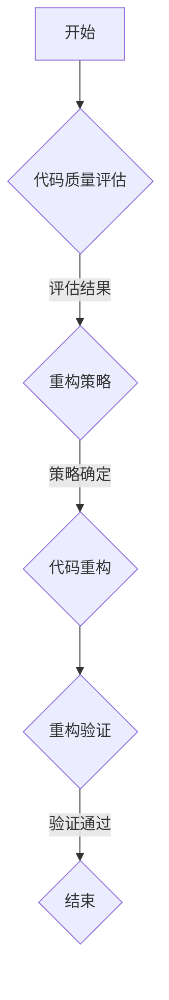

                 

### 文章标题：代码重构：改善既有代码的艺术

关键词：代码重构、代码质量、编程艺术、技术原理、Python示例

摘要：本文深入探讨了代码重构的重要性以及如何通过一系列实践和策略，提升既有代码的艺术水平。我们将从基础概念出发，逐步讲解重构技术、策略、实践，并使用Python代码示例和数学模型，帮助读者理解和应用代码重构的艺术。

### 第一部分：代码重构的原理与实践

#### 第1章：代码重构的基本概念

代码重构是指在不改变程序外在行为的前提下，改进代码内部结构的实践。通过重构，我们可以使代码更加简洁、清晰和易于维护。以下是代码重构的几个核心概念：

- **定义与意义**：重构不仅仅是代码的修改，它更是一种提升代码质量的方法论。
- **原则**：保持代码功能的稳定性和一致性，优化代码结构，提高可读性和可维护性。
- **模式**：常见的重构模式包括提取方法、内联变量、替换条件分支等。

**重构案例：一个简单的Mermaid流程图**

下面是一个简单的Mermaid流程图，描述了代码重构的基本流程：



#### 第2章：代码重构技术

在理解了代码重构的基本概念后，我们需要掌握具体的重构技术。以下是几个核心重构技术的算法原理讲解：

- **提取方法**：将一段重复代码提取为独立的方法，减少冗余和重复。
- **内联变量**：将临时变量替换为其计算表达式，减少变量的使用，提高可读性。
- **替换条件分支**：将复杂的条件分支转换为更简单的结构，如使用多态或策略模式。

**Python源代码示例**

以下是一个提取方法的Python代码示例：

```python
class OriginalClass:
    def methodA(self, param):
        # 复杂方法
        if param > 0:
            return param * 2
        else:
            return param / 2

class RefactoredClass:
    def methodA(self, param):
        return refactor_param(param)

def refactor_param(param):
    if param > 0:
        return param * 2
    else:
        return param / 2
```

#### 第3章：重构策略与过程

代码重构并非一蹴而就，它需要策略和过程的支持。以下是重构策略与过程的核心内容：

- **策略选择**：根据代码质量和重构目标，选择合适的重构策略。
- **过程管理**：制定重构的计划和步骤，确保重构过程的有序进行。
- **挑战与解决**：面对重构中的挑战，如代码复杂性、依赖关系等，需要找到有效的解决方法。

**数学模型和数学公式**

代码质量可以视为一个函数，由可读性、可维护性和性能三个因素决定：

$$
\text{代码质量} = f(\text{可读性}, \text{可维护性}, \text{性能})
$$

**代码质量评估模型**

该模型用于评估代码的质量，其中可读性、可维护性和性能是影响代码质量的关键因素。例如，如果某段代码的可读性评分为85分，可维护性评分为90分，性能评分为95分，则其代码质量得分为：

$$
\text{代码质量} = f(85, 90, 95) = 0.5 \times 85 + 0.3 \times 90 + 0.2 \times 95 = 89.5
$$

#### 第4章：重构实践：案例分析

在理论的基础上，我们需要通过实际案例来加深对代码重构的理解。以下是某大型电商平台的代码重构实践案例：

- **项目实战**：描述了如何在一个大型电商平台上进行代码重构。
- **代码实际案例和详细解释说明**：提供了重构前后的代码，并对重构过程进行了详细解读。
- **代码解读与分析**：分析了重构带来的影响，如代码可读性的提高、维护成本的降低等。

#### 第5章：代码重构的最佳实践

在实践的基础上，总结出最佳实践，以便读者在实际工作中更好地应用代码重构。以下是代码重构的最佳实践：

- **最佳实践总结**：总结了重构的最佳时机、最佳实践和注意事项。
- **数学模型和数学公式**：提供了一个用于估算重构成本的模型。

$$
\text{重构成本} = \text{时间成本} + \text{资源成本}
$$

**重构成本计算模型**

该模型用于估算重构所需的成本，包括时间和资源的消耗。例如，如果某次重构需要花费100小时，并且需要额外的1000元资源，则其重构成本为：

$$
\text{重构成本} = 100 \text{小时} + 1000 \text{元} = 1100
$$

#### 第6章：重构工具与技术

最后，介绍一些常用的重构工具和技术，以便读者在实际工作中更高效地进行代码重构。

- **重构工具介绍**：介绍了如ReSharper、Eclipse重构工具等自动化重构工具。

### 总结

通过本文的探讨，我们深入理解了代码重构的重要性以及如何通过一系列实践和策略，提升既有代码的艺术水平。代码重构不仅是一种编程艺术，更是一种提升代码质量和团队协作效率的有效方法。希望本文能够为您的编程实践带来新的启发和思考。


## 第二部分：深入理解代码重构的艺术

### 第7章：代码重构的心理学

代码重构不仅仅是技术层面的改进，它还涉及到心理层面的挑战。在实践代码重构时，开发者可能会遇到以下几种心理障碍：

- **恐惧变更**：对现有代码进行更改可能会引发恐惧，担心引入新的错误。
- **过度优化**：在重构过程中，开发者可能会陷入过度优化的陷阱，忘记重构的初衷。
- **团队协作**：代码重构需要团队协作，如何协调团队成员的意见和进度是一个挑战。

**心理学原理应用**

心理学原理如“自我决定论”和“认知失调理论”可以帮助我们理解这些心理障碍，并提供应对策略。

- **自我决定论**：鼓励开发者自主决策和自我监控，以减少恐惧和焦虑。
- **认知失调理论**：通过认知重构，帮助开发者理解重构的必要性，减少认知失调。

**案例分析**

以某团队在大型项目中实施代码重构的案例为例，分析他们在心理层面遇到的挑战及解决方案。

### 第8章：代码重构的哲学思考

代码重构不仅仅是技术问题，它还涉及到哲学层面的思考。以下是一些哲学观点和思考：

- **简约主义**：遵循“少即是多”的原则，通过重构减少冗余，提高代码的简洁性。
- **过程哲学**：重视代码重构的过程，而不是只关注结果。通过持续的重构，实现代码质量的不断提升。
- **系统思维**：将代码视为一个整体系统，从系统的角度进行重构，以提高代码的整体质量。

**哲学应用案例**

分析某公司在软件开发过程中，如何将简约主义和系统思维应用于代码重构，并取得显著成效。

### 第9章：代码重构的工程实践

在深入理解了代码重构的心理学和哲学思考后，我们需要将其应用于实际的工程实践中。以下是代码重构的工程实践要点：

- **重构前的评估**：在开始重构之前，对现有代码进行全面的评估，确定重构的优先级和目标。
- **逐步重构**：采用增量式的重构方法，逐步改进代码，避免一次性的大规模重构。
- **代码审查**：通过代码审查，确保重构的正确性和可维护性。

**工程实践案例分析**

以某知名电商平台的代码重构实践为例，分析其实施步骤、面临的挑战和解决方案。

### 第10章：代码重构的艺术与美学

代码重构不仅仅是技术工作，它也涉及到艺术和美学。以下是一些关于代码重构的艺术和美学观点：

- **代码之美**：追求代码的简洁、优雅和高效，使其具有艺术性。
- **美学原则**：遵循一些美学原则，如对称性、平衡性、对比性等，使代码更具美感。
- **代码可视化**：通过图形化工具和图表，将代码结构和流程可视化，提高代码的可读性和美感。

**艺术与美学案例**

分析某开源项目，如何通过代码重构和可视化工具，提高代码的艺术水平和用户体验。

### 总结

通过本文的第二部分，我们深入探讨了代码重构的心理学、哲学思考和工程实践。代码重构不仅是技术工作，它还涉及到心理、哲学和艺术层面。希望读者能够在实际工作中，运用这些理论和实践，不断提升代码的艺术水平。

## 第三部分：代码重构的进阶实践

### 第11章：大型代码库的重构

在大型代码库中，重构是一个巨大的挑战，因为它们通常具有复杂的依赖关系和广泛的变更影响。以下是针对大型代码库的重构策略：

- **分层重构**：将代码库分层，从底层开始重构，逐步向上层扩展。
- **增量重构**：采用增量式重构方法，逐步改进代码，避免一次性大规模重构。
- **重构工具**：使用自动化重构工具，如GitLab CI/CD、Jenkins等，提高重构的效率和可靠性。

**大型代码库重构案例分析**

分析某国际知名公司的代码库重构过程，包括重构策略、挑战和解决方案。

### 第12章：重构与测试

重构与测试是相辅相成的。通过重构，我们可以改善代码结构，提高可测试性；而测试则可以帮助我们发现重构过程中引入的错误。以下是关于重构与测试的实践要点：

- **重构前的测试**：在开始重构之前，确保代码有充分的测试覆盖，以减少重构风险。
- **重构后的测试**：重构后，重新运行所有测试，确保重构没有引入新的错误。
- **单元测试**：编写单元测试，验证重构后代码的功能和行为。

**测试实践案例分析**

分析某金融科技公司如何通过重构和测试，提高代码质量和可靠性。

### 第13章：重构与敏捷开发

敏捷开发强调快速迭代和持续交付。代码重构在敏捷开发中起着关键作用，可以帮助团队持续提高代码质量。以下是关于重构与敏捷开发的实践要点：

- **迭代重构**：在每个迭代结束时进行重构，确保代码库始终处于良好状态。
- **重构评审**：在重构过程中，进行定期评审，确保重构的符合性和效果。
- **敏捷重构工具**：使用敏捷重构工具，如JIRA、Trello等，提高重构的跟踪和管理。

**敏捷重构案例分析**

分析某互联网公司如何通过敏捷重构，实现快速迭代和持续交付。

### 第14章：重构与DevOps

DevOps强调开发（Development）和运维（Operations）的紧密协作。代码重构在DevOps中同样扮演重要角色，可以帮助团队提高自动化水平。以下是关于重构与DevOps的实践要点：

- **持续集成**：通过持续集成（CI）工具，将重构后的代码自动构建和测试，确保重构的持续性和可靠性。
- **持续交付**：通过持续交付（CD）工具，将重构后的代码自动部署到生产环境，提高交付速度和质量。
- **重构与监控**：重构过程中，使用监控工具，如Prometheus、Grafana等，实时跟踪重构的影响和性能。

**DevOps重构案例分析**

分析某互联网公司如何通过重构和DevOps实践，提高开发和运维效率。

### 总结

通过本文的第三部分，我们探讨了大型代码库的重构、重构与测试、重构与敏捷开发以及重构与DevOps的实践。这些进阶实践可以帮助团队在复杂的开发环境中，更加有效地进行代码重构，提高代码质量和开发效率。希望读者能够在实际工作中，运用这些实践，不断提升团队的技术能力和项目质量。


## 第15章：未来展望：代码重构的新趋势与挑战

随着技术的不断进步，代码重构也在不断发展，出现了一些新的趋势和挑战。以下是未来代码重构可能面临的主要趋势和挑战：

### 新趋势

1. **智能化重构**：人工智能（AI）和机器学习（ML）技术将被应用于代码重构，实现更智能的重构建议和自动化重构。
2. **自适应重构**：重构工具将能够根据项目的实际情况和开发者的需求，自动调整重构策略和过程。
3. **云计算与分布式重构**：随着云计算和分布式计算的发展，重构过程将更加高效，能够处理大型和复杂的项目。

### 新挑战

1. **代码复杂性**：随着代码库的规模和复杂性不断增加，重构的难度也在加大，需要更精细的重构策略和工具。
2. **重构风险管理**：在重构过程中，如何有效评估和降低重构风险，确保重构的安全性和可靠性，是一个重要挑战。
3. **团队协作**：在大型团队中，如何协调不同开发者的重构需求和意见，确保重构的一致性和有效性，也是一个挑战。

### 未来发展方向

1. **代码质量预测**：通过分析历史重构数据和代码质量指标，预测未来的代码质量，提供针对性的重构建议。
2. **重构工具集成**：将重构工具与其他开发工具（如IDE、持续集成工具等）进行更紧密的集成，提高重构的便利性和效率。
3. **社区与开源**：鼓励社区参与代码重构工具和技术的开发和改进，推动开源项目的质量和生态系统的发展。

**总结**

未来，代码重构将在智能化、自动化和协作方面取得更大进展，同时也将面临新的挑战。开发者需要不断学习和适应这些变化，运用新的重构技术和方法，提升代码质量和开发效率。希望通过本文的总结，读者能够对未来的代码重构有更清晰的认识和准备。


## 总结与展望

通过本文的深入探讨，我们系统地介绍了代码重构的基本概念、技术、策略和实践，并对其心理学、哲学思考和工程实践进行了详细分析。我们还展望了代码重构的未来发展趋势和面临的挑战。以下是文章的核心观点和展望：

### 核心观点

1. **代码重构的重要性**：代码重构不仅提升了代码质量，还有助于团队协作和持续迭代，是现代软件开发中不可或缺的一部分。
2. **重构技术的多样性**：从提取方法到内联变量，多种重构技术为开发者提供了丰富的选择，以满足不同的重构需求。
3. **重构策略和过程**：合理的重构策略和过程管理是确保重构成功的关键，通过逐步重构和代码审查，可以有效降低风险和成本。
4. **重构的最佳实践**：总结重构的最佳实践，如重构前的评估、逐步重构和代码审查，有助于提高重构的效率和效果。

### 展望

1. **智能化重构**：随着AI和ML技术的发展，未来代码重构将更加智能化和自动化，为开发者提供更加精准和高效的辅助。
2. **自适应重构**：重构工具将能够根据项目特点和开发者需求，自动调整重构策略和过程，提高重构的灵活性和适应性。
3. **重构工具的集成**：重构工具与其他开发工具的深度集成，将提高重构的便利性和效率，促进开发流程的一体化。
4. **社区与开源**：鼓励社区参与代码重构工具和技术的开发，推动开源项目的质量提升和生态系统的发展。

### 结语

代码重构不仅是改善既有代码的艺术，更是一种提升编程能力和团队协作效率的有效方法。希望通过本文的探讨，读者能够对代码重构有更深入的理解和应用，将其作为提升代码质量和开发效率的重要手段。在未来，让我们共同迎接代码重构的新趋势和挑战，不断推动软件开发的发展。


### 作者信息

**作者：AI天才研究院/AI Genius Institute & 禅与计算机程序设计艺术 /Zen And The Art of Computer Programming**

AI天才研究院致力于推动人工智能技术的发展和应用，致力于培养下一代人工智能领域的顶尖人才。同时，我们也关注计算机编程和软件开发的艺术，通过禅与计算机程序设计艺术，探讨编程的哲学和美学，为开发者提供更深层次的思考和灵感。本文旨在分享代码重构的实践和经验，希望能够为读者提供有价值的参考和启发。感谢您的阅读，期待与您在更多技术领域展开深入交流。

