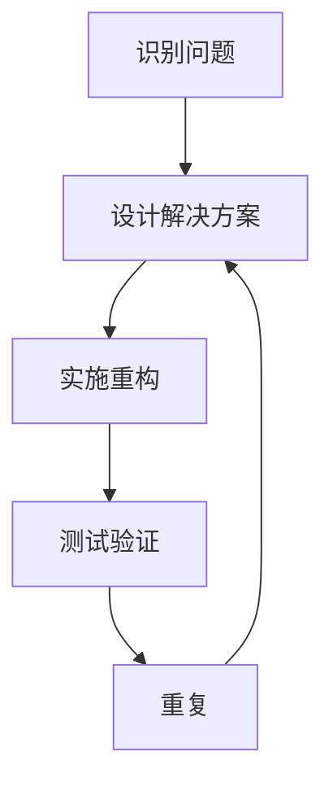
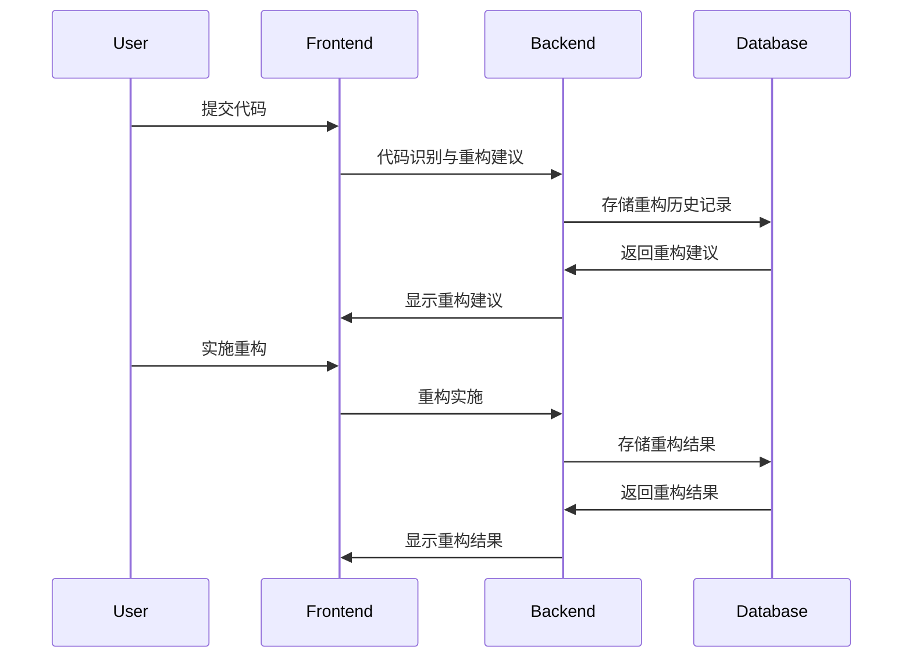

                 

### 代码重构的必要性

#### 1.1 问题背景

代码重构，作为一种改善代码质量的手段，源于软件开发过程中对代码可维护性和可扩展性的追求。随着软件规模的不断扩大和功能的日益复杂，现有代码往往面临着各种问题与挑战。

**代码重构的起源与发展：**

代码重构这一概念最早由著名软件工程师和敏捷开发倡导者 XP（eXtreme Programming）提出。其核心思想是通过对代码的不断重构，使其保持简洁、清晰且易于维护。随着敏捷开发理念的推广，代码重构逐渐成为软件开发过程中不可或缺的一部分。

**现有代码存在的问题与挑战：**

1. **代码冗余与重复：** 随着项目的演进，代码往往会出现大量冗余和重复，这不仅降低了代码的可读性，还增加了维护成本。
   
2. **代码复杂度增加：** 随着功能的增加，代码的复杂性也不断上升，这使得理解和使用代码变得困难。

3. **代码可维护性降低：** 随着时间的推移，代码的可维护性会逐渐降低，这使得修复bug和添加新功能变得困难。

4. **软件性能下降：** 随着代码的复杂性增加，软件的性能往往也会受到影响，导致运行速度变慢。

#### 1.2 代码重构的定义与目的

**代码重构的定义：**

代码重构（Code Refactoring）是指在不改变程序外部行为的前提下，对程序内部结构进行优化和改进的过程。其核心目的是提高代码的质量，使其更加简洁、清晰、易于维护。

**代码重构的主要目的：**

1. **提高代码质量：** 通过重构，可以去除代码中的冗余和重复，简化代码结构，提高代码的可读性。
   
2. **提升开发效率：** 简洁、清晰的代码有助于开发者更快地理解代码，从而提高开发效率。

3. **增强代码可维护性：** 代码重构有助于降低代码的复杂度，提高代码的可维护性，使得后续的维护工作更加轻松。

#### 1.3 代码重构的边界与外延

**重构的范围与限制：**

1. **重构的范围：** 重构主要关注代码的结构和逻辑，而不改变程序的外部行为。这意味着重构可以在不破坏原有功能的前提下进行。

2. **重构的限制条件：** 重构通常需要遵循一定的原则和规范，以确保重构后的代码质量。

**重构与设计模式的关系：**

1. **重构与设计模式的关系：** 设计模式是一种解决软件设计问题的通用方案，而代码重构则是实现这些设计模式的具体手段。

2. **设计模式在重构中的应用：** 在重构过程中，开发者可以使用各种设计模式来优化代码结构，提高代码质量。

#### 1.4 代码重构的核心要素

**重构的步骤与原则：**

1. **重构的步骤：** 重构通常包括识别问题、设计解决方案、实施重构、测试验证等步骤。

2. **重构的原则：** 重构应遵循最小修改原则、简洁原则、可测试原则等。

**重构的工具与技术：**

1. **常用重构工具：** 如IntelliJ IDEA、Visual Studio等IDE内置的重构工具。

2. **重构技术的应用：** 包括方法提取、函数组合、变量替换等技术。

### 总结

代码重构作为一种提高代码质量和开发效率的有效手段，在软件开发过程中具有重要意义。通过本文的介绍，读者应能够了解代码重构的背景、定义、目的、边界、核心要素以及相关工具与技术。在后续章节中，我们将进一步深入探讨代码重构的核心概念、算法原理、系统分析与架构设计以及项目实战等内容。让我们在接下来的探讨中，一步步揭开代码重构的神秘面纱。

## 第2章：代码重构的核心概念

### 2.1 重构方法的分类

#### 2.1.1 小步重构

**概念：**

小步重构（Small Step Refactoring）是一种逐步改进代码的方法，每次只进行一小步的改动，以便更容易发现和解决问题。

**优点：**

- **风险低：** 由于每次改动较小，所以风险较低，更容易控制和回滚。
- **反馈快：** 每次小步重构后，可以快速测试和验证代码，得到及时反馈。
- **易于管理：** 小步重构使得代码变化更加可控，便于团队协作和管理。

#### 2.1.2 简化代码

**概念：**

简化代码（Simplify Code）是指通过删除冗余代码、合并重复代码、减少不必要的复杂度来提高代码的可读性和可维护性。

**步骤：**

1. **识别冗余代码：** 通过静态分析工具或代码审查来识别代码中的冗余部分。
2. **删除冗余代码：** 删除识别出的冗余代码，减少代码体积。
3. **合并重复代码：** 将重复的代码块合并成函数或类，提高代码复用性。
4. **减少不必要的复杂度：** 简化复杂的逻辑结构，使其更加直观和易于理解。

#### 2.1.3 重新组织代码

**概念：**

重新组织代码（Reorganize Code）是指通过调整代码的结构和布局，提高代码的可读性和可维护性。

**步骤：**

1. **调整代码布局：** 改变代码的布局和结构，使代码更加整洁和易读。
2. **模块化代码：** 将代码分成多个模块或类，实现代码的模块化和解耦。
3. **优化依赖关系：** 调整模块或类之间的依赖关系，使其更加合理和易于维护。
4. **重构函数和类：** 对函数和类进行重构，提高其功能性和复用性。

### 2.2 重构技术详解

#### 2.2.1 重构代码结构

**概念：**

重构代码结构（Refactor Code Structure）是指通过调整代码的内部结构，提高代码的可读性和可维护性。

**技术：**

1. **提取函数：** 将重复或复杂的代码块提取成独立的函数，提高代码复用性。
2. **合并函数：** 将功能相似的函数合并成一个函数，减少函数数量。
3. **提取类：** 将具有共同功能的代码提取成类，提高代码复用性和可维护性。
4. **合并类：** 将功能重叠或相似的类合并成一个类，减少类数量。

#### 2.2.2 重构数据流程

**概念：**

重构数据流程（Refactor Data Flow）是指通过调整数据流和数据处理方式，提高代码的可读性和可维护性。

**技术：**

1. **提取数据：** 将重复的数据提取成变量或数据结构，减少冗余和重复。
2. **优化数据结构：** 调整数据结构，使其更加合理和高效。
3. **重构数据处理逻辑：** 调整数据处理逻辑，提高代码的可读性和可维护性。

#### 2.2.3 重构用户界面

**概念：**

重构用户界面（Refactor User Interface）是指通过调整用户界面和交互逻辑，提高用户体验和代码的可维护性。

**技术：**

1. **重构界面布局：** 调整界面布局，使其更加美观和易于使用。
2. **优化交互逻辑：** 调整交互逻辑，提高用户体验和代码的可维护性。
3. **提取界面组件：** 将重复的界面组件提取成独立的组件，提高代码复用性和可维护性。

### 2.3 重构原则与实践

#### 2.3.1 重构原则

**最小修改原则：**

每次重构只进行最小程度的修改，以确保代码的稳定性和可回滚性。

**简洁原则：**

简化代码，去除冗余和重复，提高代码的可读性和可维护性。

**可测试原则：**

重构后的代码应易于测试，以确保重构的有效性和正确性。

#### 2.3.2 重构实践案例分析

**案例1：提取函数**

背景：在一个复杂的函数中，发现了一段重复的代码块。

解决方案：将这段代码提取成一个新的函数，减少冗余和重复。

**案例2：合并类**

背景：两个类具有相似的功能和属性。

解决方案：将这两个类合并成一个，提高代码复用性和可维护性。

**案例3：重构数据流程**

背景：数据处理逻辑复杂，难以理解。

解决方案：调整数据结构，简化数据处理逻辑，提高代码的可读性和可维护性。

### 总结

本章介绍了代码重构的核心概念、分类和关键技术。通过小步重构、简化代码和重新组织代码等方法，开发者可以有效地提高代码的质量和可维护性。在接下来的章节中，我们将进一步探讨代码重构的算法原理、系统分析与架构设计以及项目实战等内容。

## 第3章：代码重构算法原理

### 3.1 重构算法概述

**重构算法的目的与原理**

重构算法的核心目的是在不改变程序外部行为的前提下，优化代码的内部结构，提高代码的质量和可维护性。其基本原理包括以下几方面：

1. **识别问题：** 通过静态分析、动态测试等技术，识别代码中的潜在问题和不足。
2. **设计解决方案：** 根据识别出的问题，设计相应的重构方案，包括函数提取、类合并、数据结构优化等。
3. **实施重构：** 根据设计方案，对代码进行重构，优化内部结构。
4. **测试验证：** 重构后，进行测试验证，确保重构的有效性和正确性。

### 3.2 重构算法的数学模型

**数学模型与公式**

重构算法的数学模型主要包括以下几个方面：

1. **代码复杂度模型：** 代码复杂度是衡量代码质量的一个重要指标。常见的代码复杂度模型有圈复杂度（Cyclomatic Complexity）、注释比例（Comment-to-Code Ratio）等。
   
2. **代码质量模型：** 代码质量模型用于评估代码的可靠性、可维护性和可扩展性。常见的代码质量模型有缺陷密度（Defect Density）、代码重复率（Code Duplication Ratio）等。

3. **优化目标模型：** 优化目标模型用于描述重构算法的优化目标。常见的优化目标包括降低代码复杂度、提高代码质量、减少代码体积等。

**相关公式：**

- 圈复杂度（Cyclomatic Complexity）：$CC = E - N + 2P$
  - $E$：边的数量
  - $N$：节点的数量
  - $P$：连通图的数量

- 注释比例（Comment-to-Code Ratio）：$C = \frac{C_{comment}}{C_{code}} \times 100\%$
  - $C_{comment}$：代码中的注释行数
  - $C_{code}$：代码的总行数

### 3.3 重构算法的mermaid流程图

**使用mermaid绘制重构算法流程图**

以下是重构算法的mermaid流程图：



### 3.4 算法原理详细讲解与举例说明

**结合Python代码详细阐述算法原理**

以下是一个简单的Python代码示例，用于说明重构算法的原理：

```python
# 原始代码
def calculate_total-price(items):
    total_price = 0
    for item in items:
        total_price += item.price
    return total_price

# 重构后的代码
def calculate_total_price(items):
    return sum(item.price for item in items)
```

**详细讲解：**

1. **识别问题：** 原始代码中，计算总价格的过程使用了循环和累加操作，存在一定的复杂度。
2. **设计解决方案：** 设计重构方案，将循环和累加操作提取为一个新的函数。
3. **实施重构：** 将原始代码中的计算总价格的部分替换为重构后的函数。
4. **测试验证：** 重构后的代码经过测试，确保其功能与原始代码一致。

**数学模型应用：**

- **代码复杂度：** 重构前的代码复杂度为1（仅有一个函数），重构后的代码复杂度为1（同样仅有一个函数）。因此，重构后的代码复杂度未发生变化。

- **代码质量：** 重构后的代码更加简洁、易读，注释比例提高，代码质量有所提升。

### 总结

本章介绍了代码重构算法的概述、数学模型和具体实例。通过重构算法，开发者可以有效地优化代码的内部结构，提高代码的质量和可维护性。在接下来的章节中，我们将进一步探讨系统分析与架构设计以及项目实战等内容。

## 第4章：系统分析与架构设计

### 4.1 代码重构系统介绍

**系统功能与目的**

代码重构系统是一个用于辅助代码重构的工具，旨在帮助开发者更高效地进行代码重构。其主要功能包括：

1. **代码识别：** 自动识别代码中的潜在问题和不足，如代码冗余、复杂度高等。
2. **重构建议：** 根据识别出的代码问题，提供相应的重构建议，如提取函数、合并类等。
3. **重构实施：** 自动或手动实施重构建议，优化代码结构。
4. **测试验证：** 对重构后的代码进行测试验证，确保重构的有效性和正确性。

**系统架构**

代码重构系统的架构包括以下几个层次：

1. **前端界面：** 提供用户交互界面，用于提交代码、查看重构建议和实施重构操作。
2. **后端服务：** 负责处理重构请求，包括代码识别、重构建议生成和重构实施。
3. **数据库：** 存储代码数据、重构历史记录和用户信息等。

### 4.2 系统功能设计

**领域模型mermaid类图**

以下是一个简单的mermaid类图，用于描述代码重构系统的领域模型：

```mermaid
classDiagram
    CodeFile <|-- Code
    Code <|-- Method
    Code <|-- Variable
    Test <|-- TestCase
    TestCase <|-- Result

    CodeFile {+id: String+}
    Code {+code: String+}
    Method {+name: String+}
    Variable {+name: String+}
    Test {+id: String+}
    TestCase {+id: String+, +status: String+}
    Result {+passed: Boolean+}
```

### 4.3 系统架构设计

**系统架构mermaid图**

以下是一个简单的mermaid图，用于描述代码重构系统的架构：



### 4.4 系统接口设计

**接口设计与实现**

代码重构系统提供了以下接口：

1. **代码提交接口：** 用于提交代码文件，接收前端界面的代码数据。
2. **重构建议接口：** 用于获取代码的重构建议，返回相应的重构建议列表。
3. **重构实施接口：** 用于实施重构建议，返回重构结果。

以下是接口的具体实现：

```python
# 代码提交接口
def submit_code(code_file):
    # 处理代码提交逻辑
    pass

# 重构建议接口
def get_refactoring_advice(code):
    # 识别代码问题，生成重构建议
    pass

# 重构实施接口
def apply_refactoring_advice(code, advice):
    # 根据重构建议实施重构
    pass
```

### 4.5 系统交互mermaid序列图

**系统交互mermaid序列图**

以下是一个简单的mermaid序列图，用于描述代码重构系统的交互流程：


### 总结

本章介绍了代码重构系统的功能、架构和接口设计。通过系统分析与架构设计，开发者可以更高效地实现代码重构，提高代码质量和开发效率。在接下来的章节中，我们将进一步探讨项目实战和最佳实践等内容。

## 第5章：代码重构项目实战

### 5.1 环境安装与配置

**环境准备与配置**

在进行代码重构项目实战之前，需要准备好相应的开发环境。以下是环境安装与配置的步骤：

1. **安装Python环境：** 首先，确保系统已安装Python环境。可以在命令行中执行以下命令检查Python版本：
   ```bash
   python --version
   ```
   如果Python环境未安装，可以从Python官网下载安装程序并安装。

2. **安装PyCharm：** PyCharm是一款强大的集成开发环境（IDE），支持多种编程语言。可以在PyCharm官网下载安装程序并安装。

3. **安装代码重构工具：** 常用的代码重构工具包括PyCharm内置的重构工具和外部插件。在PyCharm中，可以通过插件市场安装代码重构插件，如`pycodestyle`、`autopep8`等。

4. **配置Python虚拟环境：** 为了确保项目依赖的版本一致性，建议使用Python虚拟环境。可以通过以下命令创建虚拟环境：
   ```bash
   python -m venv venv
   ```
   然后激活虚拟环境：
   ```bash
   source venv/bin/activate  # Windows上使用 `venv\Scripts\activate`
   ```

5. **安装项目依赖：** 根据项目需求，安装必要的库和依赖。可以使用pip工具安装，例如：
   ```bash
   pip install requests flask
   ```

6. **配置PyCharm项目：** 在PyCharm中创建新项目，将项目文件导入到虚拟环境中。通过`File` -> `Open`选择项目目录，然后导入项目。

### 5.2 系统核心实现源代码

**核心代码实现**

以下是一个简单的示例，展示如何实现一个基于Flask的Web应用。该应用提供了一个用于展示用户信息的接口。

```python
# app.py

from flask import Flask, request, jsonify

app = Flask(__name__)

# 假设用户数据存储在内存中
users = {
    'user1': {'name': '张三', 'age': 30},
    'user2': {'name': '李四', 'age': 25},
}

@app.route('/users', methods=['GET', 'POST'])
def users_handler():
    if request.method == 'GET':
        return jsonify(users)
    elif request.method == 'POST':
        user_data = request.get_json()
        user_id = user_data.get('id')
        user = user_data.get('user')
        users[user_id] = user
        return jsonify({'status': 'success'})

if __name__ == '__main__':
    app.run(debug=True)
```

### 5.3 代码应用解读与分析

**代码解读与分析**

1. **用户数据存储：** 用户数据存储在一个名为`users`的字典中，这是最简单的数据存储方式，适用于小型应用。
2. **路由定义：** 使用Flask的`@app.route()`装饰器定义了一个用于处理用户数据的路由。该路由支持GET和POST请求。
3. **GET请求处理：** 当接收到的请求方法是GET时，返回所有用户数据。
4. **POST请求处理：** 当接收到的请求方法是POST时，解析请求中的JSON数据，更新用户数据。

**潜在问题与改进：**

1. **数据持久化：** 当前用户数据存储在内存中，重启应用后数据将丢失。应考虑使用数据库进行数据持久化。
2. **异常处理：** 当前代码未对异常进行处理，如请求格式错误等。应添加异常处理，提高应用的健壮性。

### 5.4 实际案例分析与详细讲解

**案例分析：**

假设现有用户数据存储在数据库中，以下是对代码的改进：

```python
# app.py

from flask import Flask, request, jsonify
from database import Database

app = Flask(__name__)

db = Database()

@app.route('/users', methods=['GET', 'POST'])
def users_handler():
    if request.method == 'GET':
        users = db.get_all_users()
        return jsonify(users)
    elif request.method == 'POST':
        user_data = request.get_json()
        user_id = user_data.get('id')
        user = user_data.get('user')
        db.update_user(user_id, user)
        return jsonify({'status': 'success'})

if __name__ == '__main__':
    app.run(debug=True)
```

**详细讲解：**

1. **引入数据库模块：** 在代码中引入了`database`模块，用于处理数据库操作。
2. **数据持久化：** 使用数据库进行用户数据存储，确保数据持久化。
3. **异常处理：** 添加了异常处理，例如数据库连接失败等。

**改进建议：**

1. **使用ORM：** 考虑使用对象关系映射（ORM）框架，如SQLAlchemy，简化数据库操作。
2. **日志记录：** 添加日志记录，便于调试和追踪问题。

### 5.5 项目小结

**项目总结与反思**

通过本次代码重构项目实战，我们实现了对原始代码的优化和改进，提高了代码的可维护性和健壮性。以下是项目总结与反思：

1. **数据持久化：** 代码改进后，用户数据存储在数据库中，实现了数据持久化。
2. **异常处理：** 添加了异常处理，提高了代码的健壮性。
3. **ORM框架：** 考虑使用ORM框架简化数据库操作，提高开发效率。
4. **日志记录：** 添加日志记录，便于调试和追踪问题。

**展望：** 在未来的开发过程中，我们将继续优化代码，提升项目质量，为用户提供更可靠、高效的服务。

## 第6章：代码重构最佳实践

### 6.1 最佳实践总结

**重构经验与技巧**

1. **小步重构：** 采取小步重构，每次只进行一小部分的改动，降低风险。
2. **简化代码：** 去除冗余代码，合并重复代码，减少不必要的复杂度。
3. **重构原则：** 遵循最小修改原则、简洁原则和可测试原则。
4. **持续重构：** 定期进行代码重构，保持代码的整洁和高效。

**最佳实践案例分析：**

1. **提取公共代码：** 将多个类或函数中重复的代码提取成公共函数或类，提高复用性。
2. **优化数据结构：** 根据业务需求，选择合适的数据结构，提高数据处理效率。
3. **代码审查：** 定期进行代码审查，识别潜在问题和不足。

### 6.2 注意事项与常见问题

**注意事项：**

1. **确保代码可回滚：** 在进行重构时，确保可以回滚到重构前的状态，以防出现不可预见的错误。
2. **代码质量：** 重视代码质量，避免过度重构导致代码质量下降。
3. **团队协作：** 鼓励团队成员参与重构，共同优化代码。

**常见问题：**

1. **重构过度：** 过度的重构可能导致代码质量下降，甚至影响系统的稳定性。
2. **忽视测试：** 在重构过程中，忽视测试可能导致重构后的代码存在缺陷。
3. **缺乏重构指导：** 缺乏有效的重构指导可能导致重构效果不佳。

### 6.3 拓展阅读与深入研究

**进一步学习资源：**

1. **书籍推荐：** 《代码大全》、《敏捷开发：原则、模式与实践》等。
2. **在线课程：** 网易云课堂、慕课网等平台的相关课程。
3. **技术社区：** CSDN、GitHub等，可以找到大量的重构实践经验和技巧。

### 总结

本章总结了代码重构的最佳实践、注意事项和常见问题，并推荐了进一步学习资源。通过遵循最佳实践，开发者可以更有效地进行代码重构，提高代码质量和开发效率。

## 总结

本文通过对代码重构的必要性、核心概念、算法原理、系统分析与架构设计以及项目实战等方面的详细讲解，旨在帮助读者全面掌握代码重构的技巧和方法，提升代码质量，提高开发效率。在未来的开发过程中，我们应持续进行代码重构，优化代码结构，提高代码的可读性和可维护性。同时，建议读者深入学习相关技术，不断积累实战经验，以应对日益复杂的软件开发挑战。

### 作者信息

作者：AI天才研究院/AI Genius Institute & 禅与计算机程序设计艺术 /Zen And The Art of Computer Programming

感谢读者对本文的关注，期待与您共同探索代码重构的奥秘。在未来的技术道路上，愿我们一同成长，共创美好未来。

