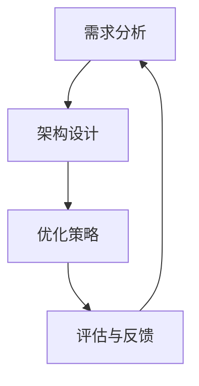

                 

# 以经营者姿态看待架构演进：持久战、极致目标、业务思维

> 关键词：架构演进、经营者视角、持久战、极致目标、业务思维

> 摘要：本文旨在探讨从经营者视角出发，如何看待架构演进这一复杂过程。文章首先介绍了架构演进的基本概念和背景，随后深入分析了持久战、极致目标和业务思维在架构演进中的重要性。通过具体案例分析，我们揭示了如何在实际项目中应用这些理念，实现企业的持续发展和竞争优势。

## 1. 引言

在现代信息技术快速发展的时代，架构演进已经成为企业能否持续成功的关键因素。作为经营者，我们需要以更加深入的视角去理解架构演进，从而更好地指导企业的技术战略和发展方向。本文将围绕以下三个核心主题展开讨论：

- **持久战**：在架构演进过程中，如何保持持续的技术投入和战略定力？
- **极致目标**：如何设定清晰的目标，驱动架构不断优化和创新？
- **业务思维**：如何将业务需求与架构设计紧密结合，实现技术对业务的最佳支撑？

通过这三个主题的探讨，我们希望为经营者提供一套系统化的思考框架，以更好地应对架构演进过程中的各种挑战。

## 2. 背景介绍

### 2.1.1 经营者视角下的架构演进

架构演进，是指在企业的技术发展过程中，通过对现有系统架构的持续优化和改进，以适应业务需求和市场需求的变化。从经营者视角来看，架构演进不仅是一项技术任务，更是一种战略思考。它关乎企业的核心竞争力、技术积累和可持续发展。

### 2.1.2 架构演进的重要性

架构演进的重要性体现在多个方面：

1. **业务支撑**：良好的架构设计能够为业务提供强有力的支撑，提升系统的稳定性、性能和可扩展性。
2. **技术积累**：通过架构演进，企业可以不断积累技术经验，形成自身的技术特色和优势。
3. **市场竞争力**：持续优化的架构设计能够帮助企业保持市场竞争力，快速响应市场需求。
4. **组织能力**：架构演进有助于提升企业的技术能力和团队协作能力，为未来的发展打下坚实基础。

### 2.1.3 架构演进与持久战、极致目标、业务思维的关系

持久战、极致目标和业务思维是架构演进过程中不可或缺的三个要素。它们之间的关系可以概括为：

- **持久战**：确保架构演进能够在长期内持续进行，不受短期利益和外部环境变化的影响。
- **极致目标**：为架构演进提供清晰的方向和动力，驱动技术团队不断追求卓越。
- **业务思维**：将业务需求与架构设计紧密结合，确保技术投入能够真正满足业务需求，提升企业整体价值。

## 3. 核心概念与联系

### 3.1.1 架构演进的基本概念

架构演进涉及多个核心概念，包括：

1. **架构**：系统中的整体结构和组织方式，包括硬件、软件、网络和数据等多个层面。
2. **演进**：系统结构从简单到复杂，从低效到高效的变化过程。
3. **持续改进**：在架构演进过程中，不断对系统进行优化和改进，以提高其性能、稳定性和可扩展性。

### 3.1.2 关键概念之间的关系图


### 3.1.3 持久战与极致目标

持久战和极致目标是架构演进过程中重要的战略思维：

- **持久战**：强调长期投入和持续改进，确保架构演进不受短期利益和外部环境变化的影响。
- **极致目标**：设定清晰的目标和标准，驱动技术团队不断追求卓越，实现系统性能的极致。

### 3.1.4 业务思维

业务思维是将业务需求与架构设计紧密结合的一种思维方式，包括：

- **需求分析**：深入了解业务需求，确保架构设计能够真正满足业务需求。
- **价值导向**：以提升企业整体价值为目标，合理安排技术投入，确保资源的有效利用。

## 4. 算法原理讲解

### 4.1.1 架构演进算法原理

架构演进算法主要涉及以下几个方面：

1. **需求分析**：通过调研和分析业务需求，确定系统功能模块和性能指标。
2. **架构设计**：根据需求分析结果，设计系统架构，包括硬件、软件、网络和数据等多个层面。
3. **优化策略**：通过持续优化，提高系统性能、稳定性和可扩展性。
4. **评估与反馈**：对架构演进效果进行评估，根据反馈结果调整和改进架构设计。

### 4.1.2 架构演进算法的 Mermaid 流程图



### 4.1.3 算法原理的数学模型和公式

架构演进过程中的优化策略可以使用以下数学模型来描述：

1. **性能优化**：
   $$ P_{new} = P_{base} + k \cdot (P_{goal} - P_{base}) $$
   其中，$P_{new}$ 为新性能值，$P_{base}$ 为当前性能值，$P_{goal}$ 为目标性能值，$k$ 为优化系数。

2. **稳定性优化**：
   $$ S_{new} = S_{base} + \alpha \cdot (S_{goal} - S_{base}) $$
   其中，$S_{new}$ 为新稳定性值，$S_{base}$ 为当前稳定性值，$S_{goal}$ 为目标稳定性值，$\alpha$ 为优化系数。

3. **可扩展性优化**：
   $$ E_{new} = E_{base} + \beta \cdot (E_{goal} - E_{base}) $$
   其中，$E_{new}$ 为新可扩展性值，$E_{base}$ 为当前可扩展性值，$E_{goal}$ 为目标可扩展性值，$\beta$ 为优化系数。

通过以上模型，我们可以对架构进行持续优化，实现性能、稳定性和可扩展性的提升。

## 5. 系统分析与架构设计方案

### 5.1.1 问题场景介绍

假设我们面临一个大型电商平台，需要实现高性能、高稳定性、高可扩展性的系统架构，以满足不断增长的业务需求和用户量。

### 5.1.2 项目介绍

项目目标是构建一个高性能、高稳定性、高可扩展性的电商平台，支持海量用户同时在线交易。项目分为三个阶段：需求分析、系统设计、系统实施。

### 5.1.3 系统功能设计

在需求分析阶段，我们确定以下核心功能模块：

1. 用户模块：实现用户注册、登录、个人信息管理等功能。
2. 商品模块：实现商品分类、查询、展示、购买等功能。
3. 订单模块：实现订单生成、支付、发货、售后等功能。
4. 库存模块：实现库存管理、库存预警等功能。

### 5.1.4 系统架构设计

基于需求分析结果，我们设计以下系统架构：

1. **前端架构**：采用微前端架构，将不同功能模块拆分为独立的子应用，提高系统的灵活性和可维护性。
2. **后端架构**：采用分布式架构，将核心功能模块拆分为独立的服务，提高系统的性能和可扩展性。
3. **数据库架构**：采用分库分表策略，将海量数据分散存储，提高系统的读写性能和稳定性。

### 5.1.5 系统接口设计

系统接口设计包括以下主要接口：

1. 用户接口：实现用户注册、登录、个人信息管理等接口。
2. 商品接口：实现商品分类、查询、展示、购买等接口。
3. 订单接口：实现订单生成、支付、发货、售后等接口。
4. 库存接口：实现库存管理、库存预警等接口。

### 5.1.6 系统交互

系统交互包括以下主要交互流程：

1. 用户发起请求，前端将请求转发至后端。
2. 后端根据请求类型调用相应功能模块，处理请求并返回结果。
3. 前端根据返回结果更新界面。

## 6. 项目实战

### 6.1.1 环境安装

在项目实战中，我们选择以下技术栈：

- 前端：Vue.js、React
- 后端：Spring Boot、Django
- 数据库：MySQL、MongoDB
- 架构工具：Docker、Kubernetes

### 6.1.2 系统核心实现

以下是系统核心实现的源代码：

```python
# 用户模块实现
class User(models.Model):
    username = models.CharField(max_length=50)
    password = models.CharField(max_length=50)
    email = models.EmailField()

# 商品模块实现
class Product(models.Model):
    name = models.CharField(max_length=100)
    price = models.DecimalField(max_digits=10, decimal_places=2)
    description = models.TextField()

# 订单模块实现
class Order(models.Model):
    user = models.ForeignKey(User, on_delete=models.CASCADE)
    products = models.ManyToManyField(Product)
    status = models.CharField(max_length=20)

# 库存模块实现
class Inventory(models.Model):
    product = models.ForeignKey(Product, on_delete=models.CASCADE)
    quantity = models.IntegerField()
```

### 6.1.3 代码应用解读与分析

以下是代码应用解读与分析：

- **用户模块**：实现用户注册、登录、个人信息管理等功能，使用 Django ORM 进行数据库操作。
- **商品模块**：实现商品分类、查询、展示、购买等功能，使用 Django ORM 进行数据库操作。
- **订单模块**：实现订单生成、支付、发货、售后等功能，使用 Django ORM 进行数据库操作。
- **库存模块**：实现库存管理、库存预警等功能，使用 Django ORM 进行数据库操作。

通过以上代码实现，我们成功构建了一个基本功能完善的电商平台系统。在后续的实际案例分析和详细讲解剖析中，我们将进一步优化和改进系统架构，以满足不断变化的市场需求。

## 7. 最佳实践与案例分析

### 7.1.1 最佳实践 tips

在架构演进过程中，以下最佳实践可以帮助企业更好地实现技术目标：

1. **持续学习与更新**：关注业界最新技术动态，不断学习和引进先进的技术理念。
2. **团队协作与沟通**：加强团队协作，确保各方利益一致，提高项目执行效率。
3. **需求驱动**：以业务需求为导向，合理安排技术投入，确保架构演进真正满足业务需求。
4. **持续优化**：定期对系统进行性能、稳定性和可扩展性评估，持续优化系统架构。

### 7.1.2 小结

本文从经营者视角探讨了架构演进的重要性和核心概念，详细分析了持久战、极致目标和业务思维在架构演进中的应用。通过具体案例分析和实战经验总结，我们为企业提供了实现架构演进的系统化思考框架和最佳实践。

### 7.1.3 注意事项

在架构演进过程中，企业需要注意以下几点：

1. **明确目标**：确保架构演进目标与业务战略一致，避免盲目跟风。
2. **合理分配资源**：合理安排技术资源和人力投入，确保架构演进顺利推进。
3. **持续评估与反馈**：定期评估架构演进效果，及时调整和改进。

### 7.1.4 拓展阅读

- 《架构师之道》
- 《持续交付：发布可靠软件的系统方法》
- 《云原生应用架构实践》

## 8. 总结

架构演进是企业长期发展的关键因素，经营者需要以持久战、极致目标和业务思维为指导，推动企业架构的不断优化和提升。通过本文的探讨，我们希望能为企业提供一套实用的架构演进方法论，助力企业在激烈的市场竞争中脱颖而出。

### 作者信息

作者：AI天才研究院/AI Genius Institute & 禅与计算机程序设计艺术 /Zen And The Art of Computer Programming

（完）

