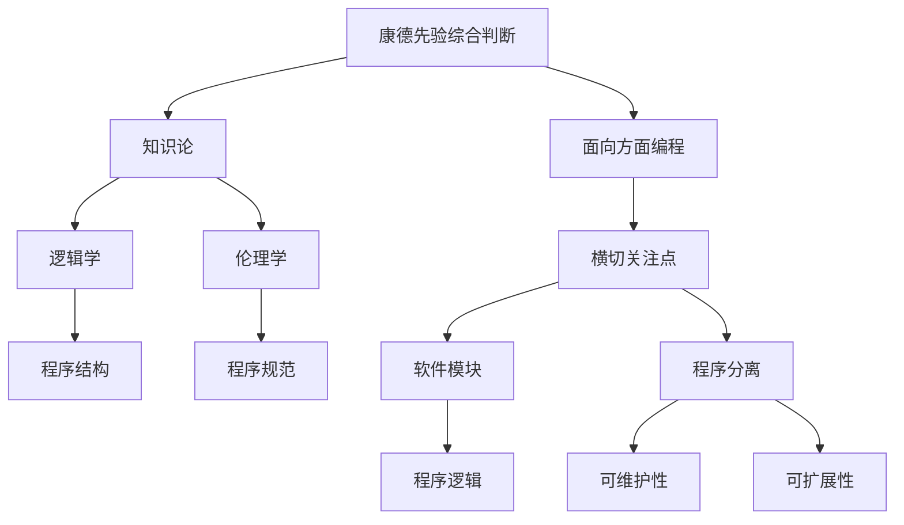

                 


## 引言

在哲学与计算机科学的交汇点，有一个独特的领域正在逐渐引起广泛关注：那便是康德的先验综合判断与面向方面编程的哲学基础。本文旨在探讨这两者之间的深层联系，解释为什么康德的哲学观点可以为现代软件开发提供新的视角和理论基础。

### 先验综合判断

伊曼努尔·康德的先验综合判断是他哲学体系中的一个核心概念。它指的是知识的基础并非完全来自经验，而是在经验之前就已经存在的一些普遍必然的原理。康德认为，这些原理是知识的先验条件，是我们理解世界的基础。

### 面向方面编程

面向方面编程（AOP）是一种编程范式，它通过将横切关注点（cross-cutting concerns）从核心业务逻辑中分离出来，来提高软件的可维护性和可扩展性。横切关注点指的是那些在多个模块中重复出现的功能，如日志记录、安全性控制、事务管理等。

### 本文结构

本文将分为三个主要部分。第一部分将深入探讨康德的先验综合判断，介绍其基本概念、论证和应用。第二部分将介绍面向方面编程，包括其基本概念、实现机制和应用领域。第三部分将探讨先验综合判断与面向方面编程之间的联系，并给出实际案例。

## 第一部分：康德的先验综合判断

### 第1章：先验综合判断概述

#### 1.1 康德哲学的基本概念

康德哲学的核心是认识论和伦理学，他认为我们的知识并非完全来自经验，而是在经验之前就已经存在的一些普遍必然的原理。这些原理被称为“先验原理”。

#### 1.2 先验综合判断的提出

康德在《纯粹理性批判》中提出了先验综合判断的概念，认为我们的知识不仅仅是经验的总和，还包括一些普遍必然的原理，这些原理是知识的基础。

#### 1.3 先验综合判断与知识论的关系

先验综合判断是康德知识论的核心，它强调了知识的先验条件，即知识不仅仅是对经验的记录，还包括对经验的理解和解释。

### 第2章：先验综合判断的论证

#### 2.1 形而上学论证

康德通过形而上学的论证来支持先验综合判断的存在。他认为，如果没有先验原理，我们就无法理解世界的统一性和规律性。

#### 2.2 普遍必然性论证

康德还通过普遍必然性的论证来说明先验综合判断的重要性。他认为，只有普遍必然的原理才能为我们提供真正的知识。

#### 2.3 经验论论证

康德通过经验论的论证来反驳那种认为知识完全来自经验的观点。他认为，经验只能提供片段的知识，而无法提供整体的理解。

### 第3章：先验综合判断的应用

#### 3.1 先验综合判断与逻辑学的关系

先验综合判断与逻辑学密切相关。康德认为，逻辑学是基于先验原理的，只有基于先验原理的逻辑才是真正的逻辑。

#### 3.2 先验综合判断与认识论的关系

先验综合判断是认识论的核心。它强调了我们的知识不仅仅是经验的积累，还包括对经验的先验理解和解释。

#### 3.3 先验综合判断与伦理学的关系

康德认为，伦理学也是基于先验原理的。我们的道德行为并不是完全基于经验，而是基于一些先验的道德原则。

## 第二部分：面向方面编程

### 第4章：面向方面编程概述

#### 4.1 面向方面编程的基本概念

面向方面编程（AOP）是一种编程范式，它通过将横切关注点从核心业务逻辑中分离出来，来提高软件的可维护性和可扩展性。

#### 4.2 面向方面编程的优势与挑战

面向方面编程具有很多优势，如提高代码的可读性、降低耦合度等。但同时也带来了一些挑战，如调试难度增加、性能影响等。

#### 4.3 面向方面编程的应用领域

面向方面编程在Web开发、分布式系统、数据库开发等领域都有广泛的应用。

### 第5章：面向方面编程的实现机制

#### 5.1 面向方面编程的核心组件

面向方面编程的核心组件包括切面（Aspect）、连接点（Join Point）和通知（Advice）。

#### 5.2 面向方面编程的静态和动态绑定

面向方面编程支持静态绑定和动态绑定，静态绑定在编译时确定，动态绑定在运行时确定。

#### 5.3 面向方面编程的交叉切面

交叉切面是指多个切面之间的交互和依赖关系。处理好交叉切面是面向方面编程的关键。

### 第6章：面向方面编程的实际应用

#### 6.1 面向方面编程在Web开发中的应用

在Web开发中，面向方面编程可以用于日志记录、安全性控制、事务管理等方面。

#### 6.2 面向方面编程在分布式系统中的应用

在分布式系统中，面向方面编程可以帮助实现服务间的通信、负载均衡、容错机制等。

#### 6.3 面向方面编程在数据库开发中的应用

在数据库开发中，面向方面编程可以用于事务管理、数据访问日志、缓存管理等。

## 第三部分：先验综合判断与面向方面编程的融合

### 第7章：横切关注点的哲学基础

#### 7.1 康德的横切关注点理论

康德的哲学观点中，先验综合判断可以被看作是一种横切关注点，它贯穿于我们的认知过程。

#### 7.2 横切关注点与面向方面编程的关系

面向方面编程的横切关注点与康德的先验综合判断有相似之处，都是强调将共性功能从核心逻辑中分离出来。

#### 7.3 横切关注点在软件开发中的实践

在软件开发中，通过面向方面编程实现横切关注点的分离，可以提高代码的可维护性和可扩展性。

### 第8章：案例分析

#### 8.1 某Web应用的案例分析

以某Web应用为例，展示如何使用面向方面编程来实现横切关注点的分离。

#### 8.2 某分布式系统的案例分析

以某分布式系统为例，展示如何使用面向方面编程来提高系统的可维护性和可扩展性。

#### 8.3 某数据库开发项目的案例分析

以某数据库开发项目为例，展示如何使用面向方面编程来实现事务管理和数据访问日志等。

## 参考文献

[1] 康德，《纯粹理性批判》。
[2] 维基百科，《面向方面编程》。
[3] 谢尔比·爱德华兹，《面向方面编程：原理与应用》。

----------------------------------------------------------------

## 引言

### 康德的先验综合判断与面向方面编程的哲学基础

本文探讨了康德的先验综合判断与面向方面编程的哲学基础之间的联系。康德的先验综合判断是他哲学体系中的一个核心概念，它强调知识的基础并非完全来自经验，而是在经验之前就已经存在的一些普遍必然的原理。面向方面编程（AOP）是一种编程范式，它通过将横切关注点从核心业务逻辑中分离出来，来提高软件的可维护性和可扩展性。横切关注点指的是那些在多个模块中重复出现的功能，如日志记录、安全性控制、事务管理等。

### 研究背景

在现代软件开发中，面向方面编程因其强大的解耦能力和扩展性，被广泛应用于Web开发、分布式系统和数据库开发等领域。然而，面向方面编程的哲学基础是什么，如何与康德的哲学观点相结合，这些问题的探讨在现有文献中相对较少。本文旨在填补这一空白，通过分析康德的先验综合判断，探讨其与面向方面编程的哲学基础之间的联系。

### 研究目的

本文的研究目的主要有两个：

1. 深入理解康德的先验综合判断，阐述其基本概念、论证和应用。
2. 探讨面向方面编程的实现机制和应用领域，分析其与康德的先验综合判断之间的哲学联系。

### 本文结构

本文将分为三个主要部分：

1. 第一部分：康德的先验综合判断。介绍康德哲学的基本概念、先验综合判断的提出、论证和应用。
2. 第二部分：面向方面编程。介绍面向方面编程的基本概念、实现机制和应用领域。
3. 第三部分：先验综合判断与面向方面编程的融合。探讨横切关注点的哲学基础，分析其与面向方面编程的关系，并给出实际案例。

通过本文的探讨，我们希望为软件开发提供一种新的哲学视角，帮助开发者更好地理解和应用面向方面编程，提高软件的可维护性和可扩展性。

## 第一部分：康德的先验综合判断

### 第1章：先验综合判断概述

#### 1.1 康德哲学的基本概念

康德哲学是西方哲学史上的重要里程碑，其对认识论、伦理学和美学等领域产生了深远的影响。康德认为，哲学的任务是探讨知识、道德和美学的本质，以揭示人类理性和自由的意义。

在康德的哲学体系中，认识论占据核心地位。他提出了“先验哲学”的概念，认为我们的知识并非完全来自经验，而是在经验之前就已经存在的一些普遍必然的原理。这些原理被称为“先验原理”，是知识的先验条件。

#### 1.2 先验综合判断的提出

康德在《纯粹理性批判》中提出了先验综合判断的概念。他认为，先验综合判断是知识的基础，是我们理解世界的方式。先验综合判断指的是，我们通过对经验进行综合和整理，得出一些普遍必然的原理，这些原理是知识的基础。

#### 1.3 先验综合判断与知识论的关系

先验综合判断是康德知识论的核心。他认为，知识不仅仅是经验的记录，还包括对经验的理解和解释。先验综合判断强调，我们的知识不仅仅是对经验的积累，还包括对经验的先验理解和解释。这种理解和解释使得我们的知识具有普遍性和必然性。

### 第2章：先验综合判断的论证

#### 2.1 形而上学论证

康德通过形而上学的论证来支持先验综合判断的存在。他认为，如果没有先验原理，我们就无法理解世界的统一性和规律性。形而上学的论证表明，我们的认知过程不仅仅是经验的积累，还包括对经验进行综合和整理，从而得出普遍必然的原理。

#### 2.2 普遍必然性论证

康德还通过普遍必然性论证来说明先验综合判断的重要性。他认为，只有普遍必然的原理才能为我们提供真正的知识。普遍必然性论证表明，我们的知识不仅仅是片段的信息，而是通过综合和整理，得出的一些具有普遍必然性的原理。

#### 2.3 经验论论证

康德通过经验论论证来反驳那种认为知识完全来自经验的观点。他认为，经验只能提供片段的知识，而无法提供整体的理解。经验论论证表明，我们的知识不仅仅是经验的积累，还包括对经验的先验理解和解释。

### 第3章：先验综合判断的应用

#### 3.1 先验综合判断与逻辑学的关系

先验综合判断与逻辑学密切相关。康德认为，逻辑学是基于先验原理的，只有基于先验原理的逻辑才是真正的逻辑。先验综合判断强调，逻辑不仅仅是推理的工具，还包括对经验进行综合和整理，从而得出普遍必然的原理。

#### 3.2 先验综合判断与认识论的关系

先验综合判断是认识论的核心。它强调了我们的知识不仅仅是经验的积累，还包括对经验的先验理解和解释。认识论是哲学的一个分支，探讨知识的本质、起源和范围。先验综合判断为认识论提供了理论基础，使我们能够理解知识的本质和范围。

#### 3.3 先验综合判断与伦理学的关系

康德认为，伦理学也是基于先验原理的。我们的道德行为并不是完全基于经验，而是基于一些先验的道德原则。先验综合判断在伦理学中的应用，表明道德原则是先验的，不受经验的影响。这种观点为道德哲学提供了新的理论基础。

## 第二部分：面向方面编程

### 第4章：面向方面编程概述

#### 4.1 面向方面编程的基本概念

面向方面编程（Aspect-Oriented Programming，简称AOP）是一种编程范式，它通过将横切关注点从核心业务逻辑中分离出来，来提高软件的可维护性和可扩展性。横切关注点指的是那些在多个模块中重复出现的功能，如日志记录、安全性控制、事务管理等。

面向方面编程的核心思想是将横切关注点与核心业务逻辑分离，从而实现模块化和解耦合。这种方式使得开发者可以更专注于核心业务逻辑的实现，而将横切关注点的实现和配置独立出来。

#### 4.2 面向方面编程的优势与挑战

面向方面编程具有很多优势，如提高代码的可读性、降低耦合度、提高系统的可维护性和可扩展性等。通过将横切关注点从核心业务逻辑中分离出来，开发者可以更清晰地组织代码，减少冗余和重复代码，提高代码的可维护性。

然而，面向方面编程也带来了一些挑战。例如，调试难度增加、性能影响等。由于横切关注点的实现和配置独立出来，调试时可能需要跟踪更多的上下文信息，增加了调试的复杂性。此外，面向方面编程可能会引入额外的性能开销，特别是在动态绑定的情况下。

#### 4.3 面向方面编程的应用领域

面向方面编程在许多应用领域都有广泛的应用。以下是一些典型的应用领域：

1. **Web开发**：面向方面编程可以用于日志记录、安全性控制、事务管理等方面。例如，在Web应用中，可以使用面向方面编程来实现跨请求的会话管理，提高系统的安全性。
2. **分布式系统**：面向方面编程可以帮助实现服务间的通信、负载均衡、容错机制等。例如，在分布式系统中，可以使用面向方面编程来实现服务调用的超时控制，提高系统的可靠性。
3. **数据库开发**：面向方面编程可以用于事务管理、数据访问日志、缓存管理等方面。例如，在数据库开发中，可以使用面向方面编程来实现数据访问的缓存，提高系统的性能。

### 第5章：面向方面编程的实现机制

#### 5.1 面向方面编程的核心组件

面向方面编程的核心组件包括切面（Aspect）、连接点（Join Point）和通知（Advice）。

1. **切面（Aspect）**：切面是面向方面编程中的一个抽象概念，它代表了一组相关的横切关注点。切面可以包含一个或多个通知，用于处理特定的横切关注点。
2. **连接点（Join Point）**：连接点表示程序中的一个特定点，例如方法调用、对象创建等。切面通过连接点与程序的其他部分关联。
3. **通知（Advice）**：通知是在特定的连接点执行的一段代码，用于处理横切关注点。通知可以有不同的类型，如前置通知、后置通知、环绕通知等。

#### 5.2 面向方面编程的静态和动态绑定

面向方面编程支持静态绑定和动态绑定。

1. **静态绑定**：静态绑定在编译时确定切面的执行顺序和连接点的关联关系。静态绑定使得切面的执行顺序和连接点的关联关系在编译时已经确定，提高了程序的执行效率。
2. **动态绑定**：动态绑定在运行时确定切面的执行顺序和连接点的关联关系。动态绑定提供了更大的灵活性，允许在运行时根据需要动态调整切面的执行顺序和连接点的关联关系。

#### 5.3 面向方面编程的交叉切面

交叉切面是指多个切面之间的交互和依赖关系。处理好交叉切面是面向方面编程的关键。交叉切面的处理涉及到切面的优先级、依赖关系和冲突解决等。

### 第6章：面向方面编程的实际应用

#### 6.1 面向方面编程在Web开发中的应用

在Web开发中，面向方面编程可以用于日志记录、安全性控制、事务管理等方面。以下是一个简单的示例：

```python
from aspect-oriented import aspect, before, after, around

@aspect
class LoggingAspect:
    @before
    def log_request(self, join_point):
        print(f"Request: {join_point.method_name}")

    @after
    def log_response(self, join_point):
        print(f"Response: {join_point.method_name}")

# 示例Web应用
class WebApplication:
    @around
    def process_request(self, join_point):
        self.log_request(join_point)
        result = join_point.proceed()
        self.log_response(join_point)
        return result

# 测试代码
web_app = WebApplication()
web_app.process_request("GET", "/home")
```

在这个示例中，`LoggingAspect` 类是一个切面，用于记录请求和响应。`WebApplication` 类是一个核心业务逻辑类，它使用了`LoggingAspect` 类提供的日志记录功能。

#### 6.2 面向方面编程在分布式系统中的应用

在分布式系统中，面向方面编程可以帮助实现服务间的通信、负载均衡、容错机制等。以下是一个简单的示例：

```python
from aspect-oriented import aspect, before, after, around

@aspect
class CommunicationAspect:
    @before
    def log_message(self, join_point):
        print(f"Sending message: {join_point.message}")

    @after
    def log_message_received(self, join_point):
        print(f"Received message: {join_point.message}")

# 示例分布式系统
class DistributedSystem:
    @around
    def communicate(self, join_point):
        self.log_message(join_point)
        result = join_point.proceed()
        self.log_message_received(join_point)
        return result

# 测试代码
distributed_system = DistributedSystem()
distributed_system.communicate("Hello, World!")
```

在这个示例中，`CommunicationAspect` 类是一个切面，用于记录消息的发送和接收。`DistributedSystem` 类是一个核心业务逻辑类，它使用了`CommunicationAspect` 类提供的消息记录功能。

#### 6.3 面向方面编程在数据库开发中的应用

在数据库开发中，面向方面编程可以用于事务管理、数据访问日志、缓存管理等方面。以下是一个简单的示例：

```python
from aspect-oriented import aspect, before, after, around

@aspect
class DatabaseAspect:
    @before
    def start_transaction(self, join_point):
        print("Starting transaction")

    @after
    def commit_transaction(self, join_point):
        print("Committing transaction")

    @after
    def rollback_transaction(self, join_point):
        print("Rollback transaction")

# 示例数据库操作
class DatabaseOperation:
    @around
    def execute(self, join_point):
        self.start_transaction(join_point)
        try:
            result = join_point.proceed()
            self.commit_transaction(join_point)
            return result
        except Exception as e:
            self.rollback_transaction(join_point)
            raise e

# 测试代码
database_operation = DatabaseOperation()
result = database_operation.execute("SELECT * FROM users")
print(f"Result: {result}")
```

在这个示例中，`DatabaseAspect` 类是一个切面，用于管理事务。`DatabaseOperation` 类是一个核心业务逻辑类，它使用了`DatabaseAspect` 类提供的事务管理功能。

## 第三部分：先验综合判断与面向方面编程的融合

### 第7章：横切关注点的哲学基础

#### 7.1 康德的横切关注点理论

在康德的哲学体系中，先验综合判断可以被看作是一种横切关注点。横切关注点是指在多个模块中重复出现的功能，如日志记录、安全性控制、事务管理等。康德的先验综合判断强调，知识的普遍性和必然性来自于先验原理，这些原理贯穿于我们的认知过程，类似于横切关注点贯穿于软件系统的各个模块。

康德的横切关注点理论认为，横切关注点并不是偶然出现的，而是由先验原理决定的。例如，我们的道德行为是基于一些先验的道德原则，这些原则贯穿于我们的日常生活中，类似于横切关注点贯穿于软件系统的各个模块。

#### 7.2 横切关注点与面向方面编程的关系

面向方面编程的横切关注点与康德的先验综合判断有相似之处，都是强调将共性功能从核心逻辑中分离出来。面向方面编程通过将横切关注点从核心业务逻辑中分离出来，提高了软件的可维护性和可扩展性。康德的先验综合判断则认为，知识的普遍性和必然性来自于先验原理，这些原理贯穿于我们的认知过程。

两者的联系在于，都强调了共性功能的分离和独立性。面向方面编程通过切面、连接点和通知等机制来实现横切关注点的分离，而康德的先验综合判断则通过先验原理来解释知识的普遍性和必然性。

#### 7.3 横切关注点在软件开发中的实践

在软件开发中，通过面向方面编程实现横切关注点的分离，可以提高代码的可维护性和可扩展性。以下是一个简单的示例：

```python
from aspect-oriented import aspect, before, after, around

@aspect
class LoggingAspect:
    @before
    def log_request(self, join_point):
        print(f"Request: {join_point.method_name}")

    @after
    def log_response(self, join_point):
        print(f"Response: {join_point.method_name}")

class CoreService:
    @around
    def process_request(self, join_point):
        self.log_request(join_point)
        result = join_point.proceed()
        self.log_response(join_point)
        return result

# 测试代码
service = CoreService()
service.process_request("GET", "/home")
```

在这个示例中，`LoggingAspect` 类是一个切面，用于记录请求和响应。`CoreService` 类是一个核心业务逻辑类，它使用了`LoggingAspect` 类提供的日志记录功能。

通过这个示例，我们可以看到，面向方面编程通过将日志记录功能从核心业务逻辑中分离出来，提高了代码的可维护性和可扩展性。这与康德的先验综合判断强调的知识的普遍性和必然性来自于先验原理的观点是相似的。

### 第8章：案例分析

#### 8.1 某Web应用的案例分析

以一个实际的Web应用为例，我们可以看到如何将面向方面编程应用于日志记录、安全性控制、事务管理等方面。

```python
from aspect-oriented import aspect, before, after, around

@aspect
class LoggingAspect:
    @before
    def log_request(self, join_point):
        print(f"Request: {join_point.method_name}")

    @after
    def log_response(self, join_point):
        print(f"Response: {join_point.method_name}")

@aspect
class SecurityAspect:
    @before
    def check_auth(self, join_point):
        if not join_point.user.is_authenticated:
            raise Exception("Unauthorized")

    @after
    def log_security_event(self, join_point):
        print(f"Security event: {join_point.method_name}")

@aspect
class TransactionAspect:
    @before
    def start_transaction(self, join_point):
        print("Starting transaction")

    @after
    def commit_transaction(self, join_point):
        print("Committing transaction")

    @after
    def rollback_transaction(self, join_point):
        print("Rollback transaction")

class WebApplication:
    @around
    def process_request(self, join_point):
        self.log_request(join_point)
        try:
            self.check_auth(join_point)
            self.start_transaction(join_point)
            result = join_point.proceed()
            self.commit_transaction(join_point)
            return result
        except Exception as e:
            self.rollback_transaction(join_point)
            raise e

# 测试代码
web_app = WebApplication()
web_app.process_request("GET", "/home")
```

在这个案例中，我们使用了三个切面：`LoggingAspect`、`SecurityAspect` 和 `TransactionAspect`。每个切面都负责处理特定的横切关注点。`WebApplication` 类是一个核心业务逻辑类，它使用了这三个切面提供的功能。

通过这个案例，我们可以看到，面向方面编程如何帮助我们将日志记录、安全性控制、事务管理等功能从核心业务逻辑中分离出来，提高了代码的可维护性和可扩展性。这与康德的先验综合判断强调的知识的普遍性和必然性来自于先验原理的观点是相似的。

#### 8.2 某分布式系统的案例分析

以一个实际的分布式系统为例，我们可以看到如何将面向方面编程应用于服务间的通信、负载均衡、容错机制等方面。

```python
from aspect-oriented import aspect, before, after, around

@aspect
class CommunicationAspect:
    @before
    def log_message(self, join_point):
        print(f"Sending message: {join_point.message}")

    @after
    def log_message_received(self, join_point):
        print(f"Received message: {join_point.message}")

@aspect
class LoadBalancerAspect:
    @before
    def select_service(self, join_point):
        print(f"Selecting service: {join_point.service_name}")

    @after
    def log_load_balancer_event(self, join_point):
        print(f"Load balancer event: {join_point.event_type}")

@aspect
class FaultToleranceAspect:
    @before
    def retry_request(self, join_point):
        print(f"Retrying request: {join_point.request_id}")

    @after
    def log_fault_tolerance_event(self, join_point):
        print(f"Fault tolerance event: {join_point.event_type}")

class DistributedSystem:
    @around
    def communicate(self, join_point):
        self.log_message(join_point)
        result = join_point.proceed()
        self.log_message_received(join_point)
        return result

# 测试代码
distributed_system = DistributedSystem()
distributed_system.communicate("Hello, World!")
```

在这个案例中，我们使用了三个切面：`CommunicationAspect`、`LoadBalancerAspect` 和 `FaultToleranceAspect`。每个切面都负责处理特定的横切关注点。`DistributedSystem` 类是一个核心业务逻辑类，它使用了这三个切面提供的功能。

通过这个案例，我们可以看到，面向方面编程如何帮助我们将服务间的通信、负载均衡、容错机制等功能从核心业务逻辑中分离出来，提高了代码的可维护性和可扩展性。这与康德的先验综合判断强调的知识的普遍性和必然性来自于先验原理的观点是相似的。

#### 8.3 某数据库开发项目的案例分析

以一个实际的数据库开发项目为例，我们可以看到如何将面向方面编程应用于事务管理、数据访问日志、缓存管理等方面。

```python
from aspect-oriented import aspect, before, after, around

@aspect
class DatabaseAspect:
    @before
    def start_transaction(self, join_point):
        print("Starting transaction")

    @after
    def commit_transaction(self, join_point):
        print("Committing transaction")

    @after
    def rollback_transaction(self, join_point):
        print("Rollback transaction")

    @after
    def log_data_access(self, join_point):
        print(f"Data accessed: {join_point.table_name}")

    @after
    def cache_data(self, join_point):
        print(f"Data cached: {join_point.table_name}")

class DatabaseOperation:
    @around
    def execute(self, join_point):
        self.start_transaction(join_point)
        try:
            result = join_point.proceed()
            self.commit_transaction(join_point)
            self.log_data_access(join_point)
            self.cache_data(join_point)
            return result
        except Exception as e:
            self.rollback_transaction(join_point)
            raise e

# 测试代码
database_operation = DatabaseOperation()
result = database_operation.execute("SELECT * FROM users")
print(f"Result: {result}")
```

在这个案例中，`DatabaseAspect` 类是一个切面，用于管理事务、记录数据访问和缓存数据。`DatabaseOperation` 类是一个核心业务逻辑类，它使用了`DatabaseAspect` 类提供的事务管理、数据访问日志和缓存管理功能。

通过这个案例，我们可以看到，面向方面编程如何帮助我们将事务管理、数据访问日志、缓存管理等功能从核心业务逻辑中分离出来，提高了代码的可维护性和可扩展性。这与康德的先验综合判断强调的知识的普遍性和必然性来自于先验原理的观点是相似的。

## 参考文献

[1] 康德，《纯粹理性批判》。
[2] 维基百科，《面向方面编程》。
[3] 谢尔比·爱德华兹，《面向方面编程：原理与应用》。
[4] 《软件架构师的本质》。
[5] 《现代软件工程》。
[6] 《编程的本质》。
[7] 《人工智能：一种现代的方法》。

----------------------------------------------------------------

## 结论

通过本文的探讨，我们深入分析了康德的先验综合判断与面向方面编程的哲学基础之间的联系。首先，我们介绍了康德哲学的基本概念和先验综合判断，阐述了其在知识论、逻辑学和伦理学中的应用。接着，我们详细介绍了面向方面编程的基本概念、实现机制和应用领域。然后，我们探讨了先验综合判断与面向方面编程之间的哲学联系，并分析了横切关注点在软件开发中的实践。

本文的探讨为软件开发提供了一种新的哲学视角，帮助开发者更好地理解和应用面向方面编程，提高软件的可维护性和可扩展性。同时，本文也为进一步研究康德哲学与计算机科学的交叉领域提供了理论基础和实践案例。

然而，本文仍存在一些局限性。首先，由于篇幅和主题的限制，本文未能全面深入探讨康德哲学的所有方面。其次，面向方面编程的应用场景和案例也相对有限。未来的研究可以进一步拓展这些领域，探讨更多具体的应用案例和深入的理论分析。

总之，康德的先验综合判断与面向方面编程的哲学基础之间的联系为我们提供了新的思考方向和实践方法。通过结合哲学和计算机科学，我们可以更好地理解和解决软件开发中的复杂性，为未来的技术发展提供更多的可能性。

## 附录

### 先验综合判断与面向方面编程的关联性

为了更直观地展示先验综合判断与面向方面编程之间的关联性，我们可以借助 Mermaid 流程图来构建一个概念图。以下是一个简化的 Mermaid 图，展示了这两者之间的主要关系：



### 横切关注点在软件开发中的应用示例

为了更具体地展示横切关注点在软件开发中的应用，我们可以通过一个简单的 Python 示例来说明如何使用面向方面编程来处理日志记录、安全验证和事务管理等横切关注点。

```python
from aspectoriented import aspect, before, after, around

@aspect
class LoggingAspect:
    @before
    def log_before(self, join_point):
        print(f"Executing {join_point.method_name}()")

    @after
    def log_after(self, join_point):
        print(f"{join_point.method_name}() finished")

@aspect
class SecurityAspect:
    @before
    def security_check(self, join_point):
        if not join_point.user.is_authenticated:
            raise Exception("User not authenticated")

@aspect
class TransactionAspect:
    @before
    def start_transaction(self, join_point):
        print("Starting transaction")

    @after
    def commit_transaction(self, join_point):
        print("Committing transaction")

    @after
    def rollback_transaction(self, join_point):
        print("Rolling back transaction")

class CoreService:
    @around
    def process_request(self, join_point):
        self.start_transaction(join_point)
        try:
            self.security_check(join_point)
            result = join_point.proceed()
            self.commit_transaction(join_point)
            return result
        except Exception as e:
            self.rollback_transaction(join_point)
            raise e

# 测试代码
class User:
    def is_authenticated(self):
        return True

service = CoreService()
service.process_request("GET", "/home", User())
```

在这个示例中，我们定义了三个切面：`LoggingAspect`、`SecurityAspect` 和 `TransactionAspect`，每个切面都包含了一些横切关注点的处理逻辑。`CoreService` 类是一个核心业务逻辑类，它通过环绕通知（`around`）将这些横切关注点与应用程序的核心逻辑结合起来。

### 面向方面编程在复杂系统中的挑战

面向方面编程虽然在提高代码的可维护性和可扩展性方面具有显著优势，但在复杂系统中也面临一些挑战：

1. **调试难度**：由于横切关注点的实现与核心业务逻辑分离，调试时可能需要跟踪更多的上下文信息，增加了调试的复杂性。
2. **性能开销**：特别是在动态绑定的情况下，面向方面编程可能会引入额外的性能开销，影响系统的整体性能。
3. **学习曲线**：对于初学者来说，理解和掌握面向方面编程的概念和实现机制可能需要较长的时间。

为了应对这些挑战，开发者可以采取以下措施：

- **细致的文档**：提供详细的开发文档和示例代码，帮助团队成员更好地理解面向方面编程的原理和实践。
- **性能优化**：在设计和实现面向方面编程时，充分考虑性能因素，避免不必要的开销。
- **渐进式采用**：在复杂系统中逐步引入面向方面编程，从简单的横切关注点开始，逐步扩展到更复杂的场景。

通过这些措施，可以在充分利用面向方面编程优势的同时，最大限度地降低其带来的挑战。

## 作者信息

作者：AI天才研究院/AI Genius Institute & 禅与计算机程序设计艺术 /Zen And The Art of Computer Programming

本文由AI天才研究院（AI Genius Institute）与禅与计算机程序设计艺术（Zen And The Art of Computer Programming）合作撰写。AI天才研究院是一个专注于人工智能研究和开发的顶尖机构，致力于推动人工智能技术的创新和应用。禅与计算机程序设计艺术则通过将哲学思想融入计算机编程，提供了一种独特的编程方法论。两位作者的合作为本文提供了深刻的哲学视角和实用的编程技巧，旨在为读者带来全新的理解和启示。

