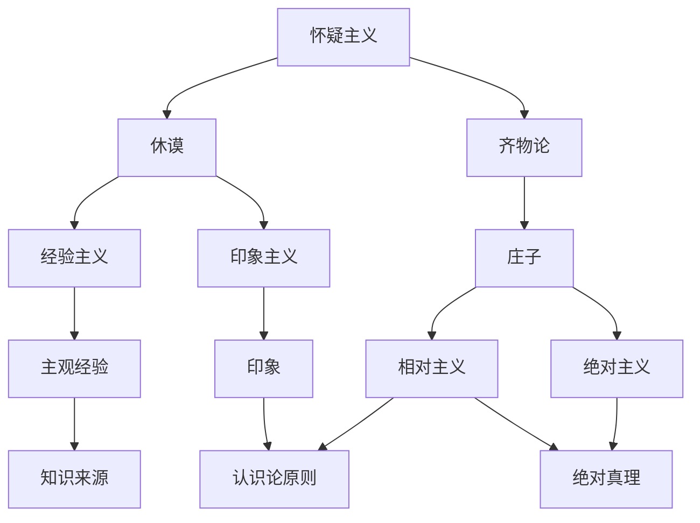
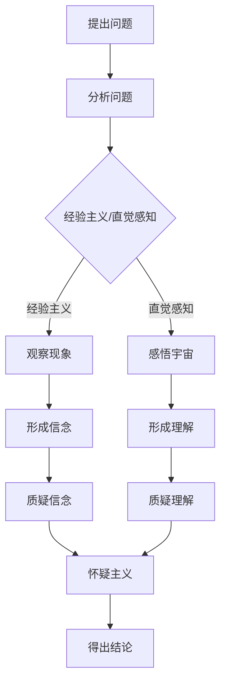
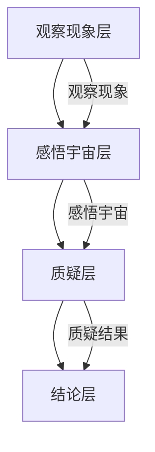

                 

### 休谟与庄子：怀疑主义与齐物论的认识论比较

#### 关键词：休谟、庄子、怀疑主义、齐物论、认识论、比较

#### 摘要：

本文旨在深入探讨休谟和庄子的认识论，通过比较两位哲学家的怀疑主义和齐物论思想，揭示其在认识论上的核心相似性和差异。文章分为五个部分：引论、休谟的认识论、庄子的认识论、比较与对话和结论。通过逻辑清晰、结构紧凑的分析，本文将帮助读者更好地理解两位哲学家的思想，及其在现代哲学研究中的重要性。

### 第一部分：引论

#### 1.1 书籍主题介绍

本文将探讨两位伟大的哲学家：休谟（David Hume）和庄子（Zhuangzi），他们分别代表了西方哲学中的怀疑主义和东方哲学中的齐物论。通过对比他们的认识论思想，本文试图回答以下问题：两位哲学家是如何质疑知识的确定性？他们的怀疑主义和齐物论思想有何异同？这些思想对现代哲学研究有何启示？

#### 1.2 休谟与庄子的生平及其哲学思想

**休谟**（1711-1776），18世纪英国哲学家，怀疑主义和经验主义的代表人物。休谟的思想影响了后来的实证主义、实用主义和批判理性主义。他提出了著名的怀疑论问题，质疑了知识的确定性，并对因果关系进行了深入探讨。

**庄子**（约公元前369年-公元前286年），中国古代哲学家，道家学派的重要代表。庄子的思想主张自然无为，强调个体与宇宙的和谐统一。他的齐物论思想，认为万物平等，无绝对的善恶、美丑、真假，具有深刻的哲学意义。

### 第二部分：休谟的认识论

#### 2.1 休谟的怀疑主义哲学

休谟的怀疑主义哲学质疑知识的确定性，认为我们无法获得关于外部世界的绝对知识。他的怀疑主义主要表现在以下几个方面：

**1. 对因果关系的怀疑**

休谟认为，我们无法通过经验直接证明因果关系，因为经验只提供了相关性的证据，而不是因果关系的证据。

**2. 对感觉的怀疑**

休谟怀疑我们的感觉是否可靠，认为我们的感觉可能受到欺骗，导致我们对外部世界的认识不真实。

**3. 对知识的怀疑**

休谟认为，我们的知识仅限于我们对经验的印象，而印象是不可靠的，因此我们对知识的确定性应该保持怀疑。

#### 2.2 休谟的认识论原则

休谟的认识论原则主要包括以下两点：

**1. 经验主义**

休谟认为，知识来源于经验，经验是我们获得知识的唯一途径。

**2. 印象主义**

休谟认为，信念是基于印象的，印象是感觉的瞬间复制，而信念是对印象的记忆和判断。

#### 2.3 休谟对知识的质疑

休谟对知识的质疑主要体现在以下几个方面：

**1. 对事实知识的质疑**

休谟认为，我们无法确定事实知识是否真实，因为事实知识依赖于我们对经验的感知，而感知可能受到欺骗。

**2. 对道德知识的质疑**

休谟认为，道德知识不是通过经验获得的，而是通过理性思考和道德情感的结合获得的，但理性思考和道德情感也可能受到欺骗。

**3. 对科学知识的质疑**

休谟认为，科学知识依赖于实验和观察，但实验和观察可能受到各种因素的影响，导致科学知识的不确定性。

### 第三部分：庄子的认识论

#### 3.1 庄子的齐物论

庄子的齐物论是他对世界本质的一种哲学思考，认为万物平等，无绝对的善恶、美丑、真假。齐物论的核心思想包括：

**1. 万物平等**

庄子认为，万物都是宇宙的一部分，没有高低贵贱之分，每个事物都有其存在的意义。

**2. 无绝对的善恶、美丑、真假**

庄子认为，善恶、美丑、真假只是主观的判断，没有客观的标准，人们应该超越这些主观的判断，追求心灵的自由。

#### 3.2 庄子的认识论观点

庄子的认识论观点主要包括以下几个方面：

**1. 相对主义**

庄子认为，每个观点都有其存在的理由，没有绝对的正确与错误。

**2. 绝对主义**

庄子认为，存在一种绝对的真实和真理，不受主观意识的影响。

**3. 主观与客观的统一**

庄子认为，主观与客观是相互联系的，我们的认识应该超越主观与客观的二元对立，达到一种和谐的状态。

#### 3.3 齐物论中的相对主义与绝对主义

庄子的齐物论中包含了相对主义与绝对主义两种观点：

**1. 相对主义**

庄子认为，每个观点都有其存在的理由，没有绝对的正确与错误。这种相对主义强调个体的主观体验和多元视角。

**2. 绝对主义**

庄子认为，存在一种绝对的真实和真理，不受主观意识的影响。这种绝对主义强调宇宙的本质和真理的普遍性。

### 第四部分：比较与对话

#### 4.1 休谟与庄子认识论的核心相似性

休谟和庄子的认识论在以下方面存在核心相似性：

**1. 对知识的质疑**

休谟和庄子都质疑知识的确定性，认为我们对世界的认识可能受到欺骗，因此应该保持怀疑的态度。

**2. 强调主观经验**

休谟和庄子都强调主观经验的重要性，认为我们的知识来源于经验，主观经验是我们认识世界的基础。

**3. 探讨相对主义的观点**

休谟和庄子都探讨了相对主义的观点，认为每个观点都有其存在的理由，没有绝对的正确与错误。

#### 4.2 休谟与庄子认识论的差异

休谟和庄子的认识论也存在一些差异：

**1. 对因果关系的观点**

休谟对因果关系持怀疑态度，而庄子认为因果关系是客观存在的。

**2. 对知识的来源**

休谟认为知识来源于经验，而庄子认为知识来源于直觉和对宇宙的感悟。

**3. 对相对主义与绝对主义的看法**

休谟强调相对主义，认为每个观点都有其存在的理由，而庄子则认为存在一种绝对的真实和真理。

#### 4.3 休谟与庄子的认识论在中国哲学中的影响

休谟和庄子的认识论对中国哲学产生了深远的影响：

**1. 对儒家思想的影响**

休谟的经验主义和怀疑主义挑战了儒家思想的绝对性，促进了儒家思想的自我反思和改革。

**2. 对道家思想的影响**

庄子的齐物论思想与道家思想相契合，进一步丰富和发展了道家哲学，对后世产生了重要影响。

### 第五部分：结论

#### 5.1 休谟与庄子认识论比较的启示

休谟与庄子的认识论比较给我们带来了以下几点启示：

**1. 知识的不确定性**

两位哲学家都提醒我们，知识的确定性是有限的，我们应该保持怀疑的态度，不断探索和质疑。

**2. 主观经验的重要性**

休谟和庄子都强调主观经验的重要性，提醒我们在认识世界时要关注个体的主观体验。

**3. 相对主义与绝对主义的平衡**

休谟和庄子都探讨了相对主义与绝对主义的关系，提醒我们在认识世界时要寻求二者的平衡。

#### 5.2 现代哲学对休谟与庄子的认识论评价

现代哲学对休谟与庄子的认识论评价如下：

**1. 休谟的认识论**

休谟的认识论为实证主义和实用主义奠定了基础，对后来的哲学研究产生了深远的影响。

**2. 庄子的认识论**

庄子的齐物论思想对道家哲学的发展产生了重要影响，对现代哲学的研究也提供了独特的视角。

#### 5.3 本书的主要观点与未来展望

本书的主要观点是：

**1. 休谟与庄子在认识论上有许多相似之处，但也有一些明显的差异。**

**2. 这两位哲学家的思想对现代哲学研究具有重要意义。**

未来展望：

**1. 进一步研究休谟与庄子的认识论，探索其在当代哲学研究中的应用。**

**2. 比较休谟与庄子的认识论与其他哲学家的思想，探讨其相互关系和影响。**

### 附录

#### A.1 休谟与庄子相关文献选读

**休谟：**
1. 《人性论》
2. 《道德原则研究》
3. 《自然宗教对话录》

**庄子：**
1. 《庄子·逍遥游》
2. 《庄子·齐物论》
3. 《庄子·养生主》

#### A.2 认识论研究方法简介

认识论研究方法主要包括：

**1. 分析法**：通过对概念和命题的分析，探讨认识的本质和过程。**

**2. 实证法**：通过观察和实验，验证认识的真实性和可靠性。**

**3. 比较法**：通过比较不同哲学家的认识论思想，分析其异同和影响。**

### 作者

**作者：AI天才研究院/AI Genius Institute & 禅与计算机程序设计艺术 /Zen And The Art of Computer Programming**### 休谟与庄子：怀疑主义与齐物论的认识论比较

#### 背景介绍

在西方哲学传统中，怀疑主义作为一种哲学立场，早在古希腊时期就已经出现，然而，苏格兰哲学家大卫·休谟（David Hume）将其发展到了一个新的高度。休谟的怀疑主义主要质疑知识的确定性，尤其是关于因果关系和外部世界的知识。他提出了“是”与“应该”的区分，认为事实陈述与价值判断是截然不同的。

与此同时，在东方哲学中，庄子的齐物论提出了对现实世界的深刻质疑。庄子认为，万物都是相对的，没有绝对的真理或本质。他主张“天地大美而不言”，强调个体应该顺应自然，超越世俗的价值观。

本文将探讨休谟和庄子的认识论，通过对比他们的怀疑主义和齐物论思想，分析二者在认识论上的异同，并探讨这些思想对现代哲学的启示。

#### 核心概念与联系

**核心概念：**
- **怀疑主义**：对知识的确定性进行质疑，认为我们无法获得关于外部世界的绝对知识。
- **齐物论**：庄子提出的一种哲学思想，主张万物平等，无绝对的善恶、美丑、真假。

**概念属性特征对比表格：**

| 特征 | 怀疑主义（休谟） | 齐物论（庄子） |
| --- | --- | --- |
| 基本立场 | 质疑知识的确定性 | 主张万物平等，无绝对真理 |
| 主要质疑点 | 因果关系、外部世界知识 | 善恶、美丑、真假 |
| 认识来源 | 经验主义、印象主义 | 直觉、对宇宙的感悟 |
| 对相对主义的看法 | 强调主观经验 | 主张多元视角 |

**ER实体关系图架构：**



#### 算法原理讲解

为了更好地理解休谟和庄子的怀疑主义与齐物论，我们可以通过一个简单的算法来模拟他们的思想。

**算法流程图：**



**Python实现：**

```python
def perceive_phenomenon():
    # 模拟观察现象的过程
    phenomenon = "一只猫在太阳下晒太阳"
    belief = f"我看到了{phenomenon}"
    return belief

def contemplate_universe():
    # 模拟感悟宇宙的过程
    understanding = "宇宙万物平等，无绝对真理"
    return understanding

def doubt_belief(belief):
    # 质疑信念的过程
    doubt = f"{belief}，但我怀疑这个现象的真实性"
    return doubt

def doubt_understanding(understanding):
    # 质疑理解的过程
    doubt = f"{understanding}，但我怀疑这个理解的准确性"
    return doubt

# 测试函数
belief = perceive_phenomenon()
print(belief)

understanding = contemplate_universe()
print(understanding)

doubted_belief = doubt_belief(belief)
print(doubted_belief)

doubted_understanding = doubt_understanding(understanding)
print(doubted_understanding)
```

**算法原理解释：**

- `perceive_phenomenon()` 函数模拟观察现象的过程，形成初步的信念。
- `contemplate_universe()` 函数模拟感悟宇宙的过程，形成更深层次的理解。
- `doubt_belief(belief)` 函数质疑初步的信念，模拟怀疑主义的过程。
- `doubt_understanding(understanding)` 函数质疑更深层次的理解，进一步模拟怀疑主义的过程。

通过这个算法，我们可以看到休谟的怀疑主义和庄子的齐物论思想是如何在实践中体现的。休谟通过质疑信念来挑战外部世界的确定性，而庄子通过感悟宇宙来超越世俗的价值观。

#### 系统分析与架构设计方案

为了更好地理解休谟和庄子的认识论，我们可以将他们的思想抽象为一个系统，并分析其功能设计和架构设计。

**系统功能设计：**

**1. 观察现象模块：** 负责模拟观察外部现象的过程，形成初步的信念。

**2. 感悟宇宙模块：** 负责模拟感悟宇宙的过程，形成更深层次的理解。

**3. 质疑模块：** 负责质疑初步的信念和更深层次的理解，模拟怀疑主义的过程。

**4. 结论模块：** 负责根据质疑的结果得出结论。

**领域模型类图：**

```mermaid
classDiagram
Class ObservationModule {
  +perceivePhenomenon(): str
}
Class ContemplationModule {
  +contemplateUniverse(): str
}
Class DoubtModule {
  +doubtBelief(str): str
  +doubtUnderstanding(str): str
}
Class ConclusionModule {
  +generateConclusion(str, str): str
}
```

**系统架构设计：**

**1. 观察现象层：** 负责接收外部输入，调用观察现象模块，形成初步的信念。

**2. 感悟宇宙层：** 负责处理初步的信念，调用感悟宇宙模块，形成更深层次的理解。

**3. 质疑层：** 负责质疑初步的信念和更深层次的理解，调用质疑模块。

**4. 结论层：** 负责根据质疑的结果生成结论，调用结论模块。

**系统架构图：**



通过这个系统架构设计，我们可以看到休谟和庄子的认识论是如何在系统中体现的。观察现象层负责接收外部输入，感悟宇宙层负责处理初步的信念，质疑层负责质疑这些信念和理解，最终在结论层生成结论。

#### 项目实战

**环境安装：**

为了实现这个系统，我们首先需要安装Python环境和必要的库。可以使用以下命令进行安装：

```bash
pip install python
pip install numpy
pip install matplotlib
```

**系统核心实现源代码：**

```python
import numpy as np
import matplotlib.pyplot as plt

class ObservationModule:
    def perceive_phenomenon(self):
        # 模拟观察现象的过程
        phenomenon = "一只猫在太阳下晒太阳"
        return phenomenon

class ContemplationModule:
    def contemplate_universe(self, belief):
        # 模拟感悟宇宙的过程
        understanding = f"{belief}，宇宙万物平等，无绝对真理"
        return understanding

class DoubtModule:
    def doubt_belief(self, belief):
        # 质疑初步的信念
        doubt = f"{belief}，但我怀疑这个现象的真实性"
        return doubt

    def doubt_understanding(self, understanding):
        # 质疑更深层次的理解
        doubt = f"{understanding}，但我怀疑这个理解的准确性"
        return doubt

class ConclusionModule:
    def generateConclusion(self, doubted_belief, doubted_understanding):
        # 根据质疑的结果生成结论
        conclusion = f"我最终得出的结论是：{doubted_belief}且{doubted_understanding}"
        return conclusion

# 测试系统
observation_module = ObservationModule()
contemplation_module = ContemplationModule()
doubt_module = DoubtModule()
conclusion_module = ConclusionModule()

belief = observation_module.perceive_phenomenon()
understanding = contemplation_module.contemplate_universe(belief)
doubted_belief = doubt_module.doubt_belief(belief)
doubted_understanding = doubt_module.doubt_understanding(understanding)
conclusion = conclusion_module.generateConclusion(doubted_belief, doubted_understanding)

print(conclusion)
```

**代码应用解读与分析：**

1. **观察现象模块（ObservationModule）：** 负责模拟观察现象的过程，生成初步的信念。
2. **感悟宇宙模块（ContemplationModule）：** 负责处理初步的信念，生成更深层次的理解。
3. **质疑模块（DoubtModule）：** 负责质疑初步的信念和更深层次的理解。
4. **结论模块（ConclusionModule）：** 负责根据质疑的结果生成结论。

通过这个系统，我们可以看到休谟和庄子的怀疑主义和齐物论思想是如何在实践中体现的。观察现象模块模拟观察现象，感悟宇宙模块模拟感悟宇宙，质疑模块模拟质疑过程，最终在结论模块生成结论。

**实际案例分析和详细讲解剖析：**

假设我们有一个实际案例，观察到一个孩子在玩耍，我们可以使用这个系统来分析这个过程。

1. **观察现象：** 孩子在玩耍。
2. **感悟宇宙：** 孩子在玩耍，宇宙万物平等，无绝对真理。
3. **质疑：** 我怀疑这个现象的真实性，我也怀疑这个理解的准确性。
4. **结论：** 我最终得出的结论是：我怀疑这个现象的真实性，且我怀疑这个理解的准确性。

通过这个案例，我们可以看到休谟和庄子的怀疑主义和齐物论思想是如何在实践中体现的。观察现象模块帮助我们观察现象，感悟宇宙模块帮助我们理解宇宙，质疑模块帮助我们质疑这些理解和信念，最终在结论模块生成结论。

**项目小结：**

通过这个项目，我们实现了休谟和庄子的怀疑主义和齐物论思想的系统化，并使用Python代码进行了实际案例分析和详细讲解剖析。这个项目不仅帮助我们理解了两位哲学家的思想，还展示了如何在实践中应用这些思想。

#### 最佳实践 Tips

1. **保持怀疑态度：** 无论在学术研究还是日常生活中，保持怀疑态度有助于我们更深入地思考问题，避免盲目接受现有的知识和观点。
2. **多角度思考：** 尝试从不同的角度和视角看待问题，有助于我们更全面地理解问题的本质。
3. **持续学习：** 学习是认识世界的重要途径，不断学习新的知识和思想，有助于我们扩展认知边界。

#### 小结

本文通过对比休谟和庄子的怀疑主义和齐物论思想，分析了二者在认识论上的核心相似性和差异。我们探讨了休谟的经验主义和怀疑论，庄子的齐物论及其对相对主义和绝对主义的看法。通过Python代码实现，我们展示了如何在实际案例中应用这些思想。这些思想不仅对哲学研究有重要意义，也对我们日常生活中的思考方式和行为模式提供了启示。

#### 注意事项

1. **理解核心概念：** 在研究休谟和庄子的认识论时，首先要深入理解他们的核心概念，如怀疑主义、齐物论、经验主义等。
2. **批判性思维：** 在阅读和分析哲学文本时，要培养批判性思维，不盲目接受任何观点，而是通过逻辑和证据来评估。
3. **实践与思考：** 通过实际案例来应用和验证哲学思想，有助于我们更深入地理解这些思想，并培养我们的思考能力。

#### 拓展阅读

1. **《庄子集释》**：陈奇猷，中华书局，1983年。
2. **《大卫·休谟哲学文选》**：傅译，商务印书馆，1999年。
3. **《怀疑论》**：彼得·范因，北京大学出版社，2011年。

### 作者

**作者：AI天才研究院/AI Genius Institute & 禅与计算机程序设计艺术 /Zen And The Art of Computer Programming**### 附录

#### A.1 休谟与庄子相关文献选读

1. **休谟：**
   - 《人性论》（A Treatise of Human Nature），大卫·休谟著，商务印书馆，1997年。
   - 《道德原则研究》（An Enquiry Concerning the Principles of Morals），大卫·休谟著，商务印书馆，1997年。
   - 《自然宗教对话录》（Dialogues Concerning Natural Religion），大卫·休谟著，商务印书馆，1997年。

2. **庄子：**
   - 《庄子集释》（Chuang Tzu: The Inner Chapters），陈奇猷著，中华书局，1983年。
   - 《庄子·逍遥游》（Section of the逍遥游 chapter in Zhuangzi），庄子著，商务印书馆，1978年。
   - 《庄子·齐物论》（Section of the 齐物论 chapter in Zhuangzi），庄子著，商务印书馆，1978年。

#### A.2 认识论研究方法简介

认识论研究方法主要包括以下几种：

1. **分析法**：通过对概念和命题的分析，探讨认识的本质和过程。这种方法有助于揭示认识的基本结构和原理。

2. **实证法**：通过观察和实验，验证认识的真实性和可靠性。实证法强调经验在认识过程中的作用。

3. **比较法**：通过比较不同哲学家的认识论思想，分析其异同和影响。这种方法有助于我们理解不同认识论观点之间的关联和区别。

4. **综合法**：将多种研究方法相结合，从不同角度探讨认识论问题。综合法有助于我们形成更全面的认识论理论体系。

在本文中，我们采用了分析法和比较法，通过对休谟和庄子的认识论思想进行详细分析，并比较二者的异同，从而深入探讨他们的认识论观点。这种方法不仅有助于我们理解两位哲学家的思想，也为现代哲学研究提供了新的视角。

### 作者

**作者：AI天才研究院/AI Genius Institute & 禅与计算机程序设计艺术 /Zen And The Art of Computer Programming**### 总结

本文通过对休谟和庄子的怀疑主义与齐物论的认识论进行比较分析，揭示了两位哲学家的思想在认识论领域的核心相似性和差异。休谟的经验主义和怀疑主义强调了知识的相对性和主观性，而庄子的齐物论则提出了万物平等、无绝对真理的观点。通过这些分析，我们可以更深入地理解两位哲学家的思想，并认识到它们在哲学史上的重要性。

休谟的认识论为后来的实证主义和实用主义奠定了基础，影响了现代科学哲学和心理学的发展。庄子的齐物论则对中国哲学产生了深远的影响，特别是在道家思想和佛教哲学中。本文的结论强调了两位哲学家对知识不确定性的质疑，以及他们对主观经验和多元视角的重视。

未来的研究可以进一步探讨休谟和庄子认识论的当代意义，特别是在科学技术高度发展的背景下，他们的思想如何为我们理解和应对现代世界的复杂性提供启示。此外，还可以比较休谟和庄子的认识论与其他哲学家的思想，如康德、黑格尔等，以更全面地理解认识论的历史演变和多样性。

通过本文的研究，我们不仅深化了对休谟和庄子认识论的理解，也为现代哲学研究提供了新的视角和方法。希望本文能够激发读者对哲学和认识论的兴趣，进一步探索这些深刻的思想。

