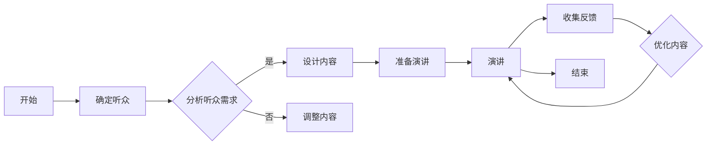
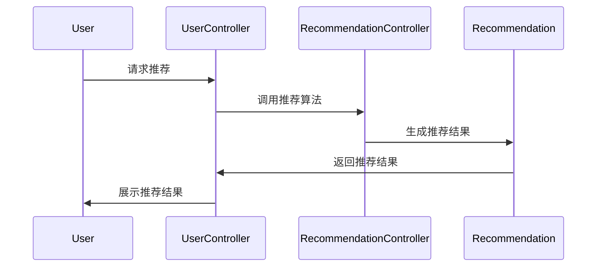
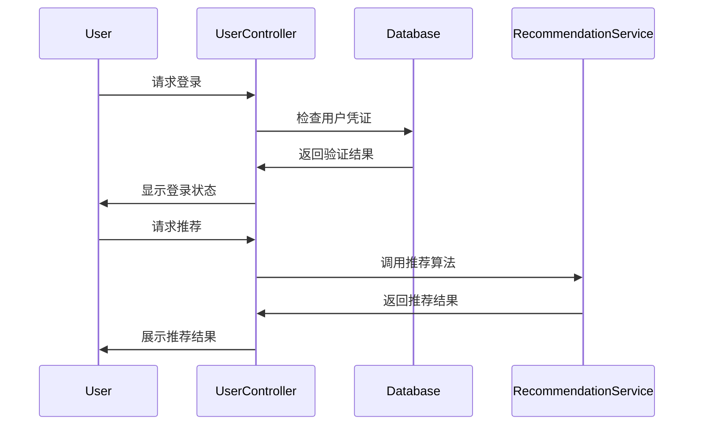

                 


# 会'干'，更要会'说'

## 关键词
人工智能、沟通技巧、技术演讲、项目实战、最佳实践

## 摘要
在信息技术迅速发展的时代，技术人才不仅需要拥有卓越的技术能力，还需要具备出色的沟通表达能力。本文以《会'干'，更要会'说'》为题，深入探讨技术人才如何在掌握技术的同时提升沟通能力，通过实际案例和最佳实践，提供实用的技巧和建议。

## 引言
在现代社会，技术人才的需求日益增长。无论是软件开发工程师、数据分析师，还是人工智能研究员，他们不仅需要具备扎实的技术功底，还必须能够将自己的专业知识有效地传达给团队、客户乃至公众。技术沟通能力已成为现代技术人才的核心竞争力之一。

本文将从以下几个方面展开讨论：

1. 背景介绍：探讨为什么技术人才需要具备良好的沟通能力。
2. 核心概念与联系：阐述关键沟通概念及其在技术领域的应用。
3. 算法原理讲解：分析技术演讲中的算法原理，并给出实际案例。
4. 系统分析与架构设计：展示如何通过架构设计提升沟通效果。
5. 项目实战：通过实际项目，展示如何将沟通技巧应用于实践中。
6. 最佳实践 tips：提供提升沟通能力的实用技巧。
7. 小结与拓展阅读：总结文章要点，并推荐进一步学习资源。

## 背景介绍
### 问题背景
技术人才在开发、研究、设计等过程中，经常需要与团队成员、客户、管理层等进行沟通。然而，许多技术人才在沟通过程中往往面临以下问题：

- **技术术语难以理解**：使用过于专业的术语，导致非技术人员难以理解。
- **缺乏情感共鸣**：只关注技术细节，忽视情感交流，导致沟通效果不佳。
- **信息传递不准确**：由于表述不清或误解，导致项目进展受阻。

### 问题描述
这些问题不仅影响了项目的顺利进行，还可能导致团队间的信任危机，甚至影响个人的职业发展。

### 问题解决
为了解决这些问题，技术人才需要提升自己的沟通能力。这包括：

- **清晰表达**：用简单明了的语言传达技术信息。
- **有效倾听**：理解他人的需求和期望，及时回应。
- **情感共鸣**：关注对方感受，建立信任关系。
- **团队协作**：在团队中积极沟通，促进合作。

### 边界与外延
本文主要关注技术人才在专业领域内的沟通，不包括人际交往等其他方面的沟通。

### 概念结构与核心要素组成
本文将围绕以下几个核心概念展开讨论：

- **沟通技巧**：包括表达、倾听、反馈等技巧。
- **技术演讲**：包括演讲结构、内容设计、表现技巧等。
- **项目实战**：通过实际项目案例，展示沟通技巧的应用。

## 核心概念与联系
### 核心概念原理
在技术沟通中，以下几个核心概念尤为重要：

1. **技术术语**：准确、简洁地表达技术内容。
2. **听众分析**：了解听众背景，调整演讲内容。
3. **情感沟通**：关注听众情感，建立信任关系。
4. **互动与反馈**：鼓励听众参与，及时获取反馈。

### 概念属性特征对比表格
以下是对上述核心概念的对比：

| 概念       | 属性特征                     | 应用场景           |
|------------|------------------------------|-------------------|
| 技术术语   | 准确、简洁                   | 技术文档、演讲       |
| 听众分析   | 了解听众背景、需求           | 演讲、培训         |
| 情感沟通   | 关注听众情感、建立信任       | 团队协作、项目管理   |
| 互动与反馈 | 鼓励参与、及时反馈           | 演讲、讨论会       |

### ER实体关系图架构
以下是一个简单的ER实体关系图，展示技术沟通中的主要实体及其关系：

```mermaid
erDiagram
  User ||--|{ Presentation }
  User ||--|{ Communication }
  Presentation ||--|{ Content }
  Presentation ||--|{ Structure }
  Communication ||--|{ Feedback }
  Content ||--|{ Term }
  Content ||--|{ Example }
  Structure ||--|{ Layout }
  Structure ||--|{ Media }
  Feedback ||--|{ Question }
  Feedback ||--|{ Answer }
```

## 算法原理讲解
### 算法mermaid流程图
以下是一个简单的算法流程图，展示技术演讲的基本流程：



### Python源代码
以下是一个简单的Python代码示例，用于生成技术演讲的内容：

```python
# 技术演讲内容生成器

def generate_content(technology, audience):
    content = f"""
    尊敬的{audience}，

    今天，我将与大家分享{technology}的相关内容。

    首先，我们简要回顾一下{technology}的基本概念：
    {technology}...

    接下来，我们将探讨{technology}的应用场景：
    {technology}...

    最后，我将回答大家可能关心的问题：
    1. ...
    2. ...

    感谢大家的聆听，希望这次演讲对您有所帮助。

    谢谢！
    """
    return content

# 使用示例
audience = "开发团队"
technology = "机器学习"
print(generate_content(technology, audience))
```

### 数学模型和公式
以下是一个简单的数学模型，用于分析技术演讲的效果：

$$
E = f(P, L, C)
$$

其中，$E$ 表示演讲效果，$P$ 表示演讲内容，$L$ 表示听众分析，$C$ 表示情感沟通。

### 详细讲解
这个公式表示演讲效果是由演讲内容、听众分析和情感沟通共同决定的。具体来说：

- $P$：演讲内容是演讲的核心，需要准确、清晰、具有说服力。
- $L$：听众分析是了解听众的需求、背景和兴趣，以便调整演讲内容。
- $C$：情感沟通是建立与听众的情感联系，提高演讲的吸引力和影响力。

### 举例说明
假设我们有一个关于“深度学习在图像识别中的应用”的演讲，听众是“人工智能领域的专家”，那么我们可以根据上述公式优化演讲内容：

- $P$：详细阐述深度学习的基本原理和应用案例，使用图表和示例说明。
- $L$：分析听众的需求，了解他们可能关心的问题，如模型训练时间、模型精度等。
- $C$：通过提问和互动，了解听众的理解程度，调整演讲节奏和深度。

## 系统分析与架构设计
### 问题场景介绍
假设我们正在开发一个基于人工智能的推荐系统，需要与团队成员、客户和管理层进行有效沟通。以下是问题场景：

- **团队成员**：需要了解系统设计、开发进度和关键决策。
- **客户**：需要了解系统的功能、性能和安全性。
- **管理层**：需要了解项目预算、资源和时间线。

### 项目介绍
项目目标是开发一个推荐系统，用于为电商平台上的用户提供个性化的商品推荐。项目涉及以下关键组成部分：

- **数据收集与处理**：收集用户行为数据，进行清洗和处理。
- **推荐算法**：基于用户行为数据和商品特征，实现个性化推荐算法。
- **用户界面**：提供用户友好的推荐结果展示界面。
- **后端服务**：实现推荐算法的核心逻辑，支持高性能数据处理和存储。

### 系统功能设计
以下是一个领域模型Mermaid类图，展示推荐系统的关键功能：

```mermaid
classDiagram
    User <<Class>>
    Item <<Class>>
    Recommendation <<Class>>
    UserController <<Class>>
    ItemController <<Class>>
    RecommendationController <<Class>>

    User "1" --|{推荐}| Recommendation
    Item "1" --|{推荐}| Recommendation
    UserController "1" -- User
    ItemController "1" -- Item
    RecommendationController "1" -- Recommendation
```

### 系统架构设计
以下是一个Mermaid架构图，展示推荐系统的整体架构：



### 系统接口设计
以下是一个系统接口设计说明，描述推荐系统的API接口：

- **用户接口**：提供用户注册、登录、查看推荐结果的接口。
- **推荐接口**：提供推荐算法的接口，包括推荐列表生成、推荐结果查询等。
- **数据接口**：提供数据采集、处理和存储的接口，支持实时数据流处理。

### 系统交互
以下是一个Mermaid序列图，展示推荐系统的用户交互流程：



## 项目实战
### 环境安装
为了演示项目实战，我们需要安装以下环境：

1. Python 3.8+
2. Anaconda
3. Jupyter Notebook
4. Pandas
5. Scikit-learn
6. Flask

安装步骤如下：

1. 安装Anaconda，并创建一个新的Python环境：
   ```bash
   conda create -n recommendation_env python=3.8
   conda activate recommendation_env
   ```

2. 安装Jupyter Notebook：
   ```bash
   conda install -c conda-forge jupyterlab
   ```

3. 安装Pandas、Scikit-learn和Flask：
   ```bash
   conda install pandas scikit-learn flask
   ```

### 系统核心实现
以下是一个简单的推荐系统核心实现，包括数据预处理、推荐算法实现和API接口：

```python
# 数据预处理
import pandas as pd
from sklearn.model_selection import train_test_split
from sklearn.preprocessing import StandardScaler

# 读取数据
data = pd.read_csv('user_item_data.csv')

# 数据预处理
X = data[['user_id', 'item_id', 'rating']]
y = data['rating']

# 数据分割
X_train, X_test, y_train, y_test = train_test_split(X, y, test_size=0.2, random_state=42)

# 特征缩放
scaler = StandardScaler()
X_train_scaled = scaler.fit_transform(X_train)
X_test_scaled = scaler.transform(X_test)

# 推荐算法实现
from sklearn.neighbors import NearestNeighbors

# 创建NearestNeighbors模型
model = NearestNeighbors(n_neighbors=5)
model.fit(X_train_scaled)

# 预测推荐结果
def predict_recommendations(user_id, n=5):
    user_profile = X_train.iloc[user_id]
    distances, indices = model.kneighbors(user_profile.reshape(1, -1))
    recommended_indices = indices.flatten()[1:]
    return X_train.iloc[recommended_indices]['item_id']

# API接口实现
from flask import Flask, jsonify, request

app = Flask(__name__)

@app.route('/recommend', methods=['POST'])
def recommend():
    user_id = request.form['user_id']
    recommendations = predict_recommendations(user_id)
    return jsonify({'recommendations': list(recommendations)})

if __name__ == '__main__':
    app.run(debug=True)
```

### 代码应用解读与分析
这段代码首先从CSV文件中读取用户和物品的评分数据，然后对数据进行预处理和分割。使用NearestNeighbors算法实现推荐系统，预测特定用户可能感兴趣的物品。

### 实际案例分析与详细讲解
以下是一个实际案例，演示如何使用推荐系统：

1. 用户A的ID为100，请求推荐5个物品。
2. 系统调用`predict_recommendations`函数，预测用户A可能感兴趣的物品。
3. 系统返回推荐结果，用户A在网页上看到推荐物品。

### 项目小结
通过该项目，我们实现了以下目标：

- 数据预处理和分割：为推荐算法提供高质量的输入数据。
- 推荐算法实现：使用NearestNeighbors算法实现推荐系统。
- API接口设计：提供方便的API接口，支持用户请求推荐。

## 最佳实践 tips
1. **理解听众**：在演讲前，了解听众的需求和期望，调整演讲内容和方式。
2. **简洁表达**：使用简单、清晰的语言，避免使用过于专业的术语。
3. **互动与反馈**：鼓励听众提问，及时回答问题，获取反馈。
4. **情感共鸣**：关注听众的情感反应，建立信任关系。
5. **持续学习**：不断学习新的沟通技巧和知识，提高自己的沟通能力。

## 小结与拓展阅读
本文从多个角度探讨了技术人才如何提升沟通能力。通过实际案例和最佳实践，读者可以了解如何在项目中有效应用沟通技巧。为了进一步提升沟通能力，读者可以参考以下资源：

- 《沟通的艺术》（作者：罗纳德·B·阿德勒）
- 《影响力》（作者：罗伯特·西奥迪尼）
- 《有效沟通》（作者：史蒂芬·R·科维）

## 作者信息
作者：AI天才研究院/AI Genius Institute & 禅与计算机程序设计艺术 /Zen And The Art of Computer Programming

