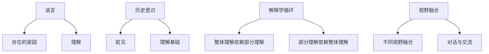
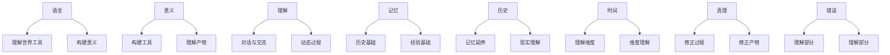

                 

# 《伽达默尔与利科：诠释学的现代发展》

关键词：诠释学、伽达默尔、利科、现代发展、哲学、理解、历史意识

摘要：本文旨在探讨伽达默尔与利科两位哲学家的诠释学思想，分析其在现代背景下的重要性和应用。通过深入解读伽达默尔的“语言、历史意识与理解”、“解释学循环”和“视野融合”等核心概念，以及利科的“语言、意义与理解”、“记忆、历史与时间”和“真理与错误”等核心概念，本文将展示两位学者如何通过诠释学来理解世界和人类经验。同时，本文还将比较两位诠释学的异同，探讨它们的互补性，并展望未来诠释学的发展趋势。

## 引言：诠释学的现代发展背景与意义

诠释学（Hermeneutics）是哲学的一个重要分支，研究理解和解释的过程，尤其关注文本、历史和文化的解释。诠释学的历史可以追溯到古希腊时期，但真正成为独立的哲学学科则是在19世纪末和20世纪初。伽达默尔（Hans-Georg Gadamer）和利科（Paul Ricoeur）是20世纪诠释学的两位重要代表人物。

### 伽达默尔的诠释学

伽达默尔的诠释学强调历史意识、理解的前见和解释的循环。他认为，理解是一种动态的过程，通过历史意识与文本的互动来实现。伽达默尔的诠释学对哲学、文学、历史等领域产生了深远的影响。

### 利科的诠释学

利科的诠释学则更侧重于语言、意义和真理。他提出了“符号学”和“解释学”的概念，试图通过理解语言和符号来揭示人类经验和文化的深层意义。

## 伽达默尔诠释学

### 1.1 伽达默尔诠释学的核心概念

#### 1.1.1 语言、历史意识与理解

伽达默尔认为，语言是人类理解世界的工具，也是历史的载体。历史意识是理解的基础，它使我们能够意识到我们的理解总是受限于我们的历史背景。理解是一种动态的过程，通过不断地与文本和历史互动来实现。

#### 1.1.2 解释学循环

伽达默尔提出了“解释学循环”的概念，认为理解是一个循环过程，其中整体的理解依赖于部分的理解，而部分的理解又依赖于整体的理解。

#### 1.1.3 视野融合

视野融合是伽达默尔诠释学的重要原则，它强调理解是一个对话的过程，通过对话和交流，不同的视野可以融合，从而实现更深层次的理解。

### 1.2 伽达默尔诠释学的历史地位与影响

伽达默尔诠释学是对传统诠释学的重要批判和发展。他的思想对后来的哲学、文学、历史等领域产生了深远的影响。伽达默尔的诠释学也为理解和解释复杂的社会现象提供了新的视角。

### 1.3 伽达默尔诠释学的应用领域

伽达默尔诠释学在文学诠释、历史诠释和美学诠释等领域都有广泛的应用。例如，在文学诠释中，伽达默尔的方法可以帮助我们更好地理解文学作品的意义和背景。

## 利科诠释学

### 2.1 利科诠释学的核心概念

#### 2.1.1 语言、意义与理解

利科认为，语言是理解世界的关键，它可以帮助我们构建意义。理解是一种动态的过程，通过不断地与语言互动来实现。

#### 2.1.2 记忆、历史与时间

记忆和历史是理解的基础。利科认为，通过理解记忆和历史，我们可以更好地理解人类经验和文化。

#### 2.1.3 真理与错误

利科探讨了真理与错误的问题，他认为，真理是一个动态的过程，它不断地被人类经验所修正。

### 2.2 利科诠释学的历史地位与影响

利科的诠释学是对伽达默尔诠释学的重要批判和发展。他的思想对后来的哲学、文学、历史等领域产生了深远的影响。利科的诠释学也为理解和解释复杂的社会现象提供了新的视角。

### 2.3 利科诠释学的应用领域

利科的诠释学在法律诠释、教育诠释和媒体诠释等领域都有广泛的应用。例如，在法律诠释中，利科的诠释学可以帮助我们更好地理解法律的意义和背景。

## 第3章 伽达默尔与利科诠释学的比较与融合

### 3.1 核心概念的异同

伽达默尔与利科诠释学的核心概念有异同。例如，在语言、历史意识与理解方面，两位学者都强调了语言和历史的角色，但伽达默尔更强调历史意识对理解的影响，而利科则更侧重于语言和意义的构建。

### 3.2 伽达默尔与利科诠释学的互补性

伽达默尔与利科诠释学的互补性体现在他们对理解和解释的不同侧重点。伽达默尔的方法更注重历史和文化背景，而利科的方法则更注重语言和符号的构建。这种互补性使得他们的诠释学可以相互补充，共同推动诠释学的发展。

### 3.3 现代诠释学的发展趋势

现代诠释学的发展趋势体现在跨学科融合、技术介入和社会实践等方面。跨学科融合使得诠释学可以应用于更多的领域，技术介入使得诠释学方法可以更加精确和高效，而社会实践则使得诠释学的应用更加广泛和实际。

## 第4章 伽达默尔与利科诠释学在文学诠释中的应用

### 4.1 文学作品的选择与解读

在文学诠释中，伽达默尔与利科的方法都有广泛的应用。例如，在解读《哈姆雷特》时，伽达默尔的方法可以帮助我们理解作品的背景和历史意识，而利科的方法则可以帮助我们理解作品的符号和意义。

### 4.2 伽达默尔与利科诠释学的具体应用实例

在文学诠释中，伽达默尔的方法强调历史意识，而利科的方法强调语言和意义的构建。通过具体的案例分析，我们可以看到两位学者如何通过诠释学来解读文学作品，并揭示其深层意义。

## 第5章 伽达默尔与利科诠释学在教育诠释中的应用

### 5.1 教育诠释学的核心概念

在教育诠释中，伽达默尔与利科的方法都强调了理解和理解教育的重要性。例如，伽达默尔的方法可以帮助我们理解教育的背景和历史意识，而利科的方法则可以帮助我们理解教育的意义和目标。

### 5.2 伽达默尔与利科诠释学在教育诠释中的具体应用

在教育诠释中，伽达默尔的方法可以帮助我们更好地理解学生的学习过程，而利科的方法则可以帮助我们更好地理解教育的目标和意义。通过具体的案例分析，我们可以看到两位学者如何通过诠释学来改善教育过程。

## 第6章 伽达默尔与利科诠释学在法律诠释中的应用

### 6.1 法律诠释学的核心概念

在法律诠释中，伽达默尔与利科的方法都强调了理解和理解法律的重要性。例如，伽达默尔的方法可以帮助我们理解法律的历史背景，而利科的方法则可以帮助我们理解法律的意义和目标。

### 6.2 伽达默尔与利科诠释学在法律诠释中的具体应用

在法律诠释中，伽达默尔的方法可以帮助我们更好地理解法律文本的背景和历史意识，而利科的方法则可以帮助我们更好地理解法律的意义和目标。通过具体的案例分析，我们可以看到两位学者如何通过诠释学来改善法律解释。

## 第7章 伽达默尔与利科诠释学在媒体诠释中的应用

### 7.1 媒体诠释学的核心概念

在媒体诠释中，伽达默尔与利科的方法都强调了理解和理解媒体的重要性。例如，伽达默尔的方法可以帮助我们理解媒体的历史背景，而利科的方法则可以帮助我们理解媒体的意义和目标。

### 7.2 伽达默尔与利科诠释学在媒体诠释中的具体应用

在媒体诠释中，伽达默尔的方法可以帮助我们更好地理解媒体文本的背景和历史意识，而利科的方法则可以帮助我们更好地理解媒体的意义和目标。通过具体的案例分析，我们可以看到两位学者如何通过诠释学来改善媒体解读。

## 结论：伽达默尔与利科诠释学的现代发展展望

### 8.1 现代诠释学的挑战与机遇

现代诠释学面临着技术变革、社会变迁和全球化背景下的挑战和机遇。例如，技术的介入使得诠释学方法可以更加精确和高效，而全球化则使得诠释学可以应用于更多的文化背景。

### 8.2 伽达默尔与利科诠释学的未来发展趋势

伽达默尔与利科诠释学的未来发展趋势将体现在跨学科融合、技术介入和社会实践等方面。通过不断创新和发展，诠释学将继续为理解和解释复杂的社会现象提供新的视角。

作者：AI天才研究院/AI Genius Institute & 禅与计算机程序设计艺术 /Zen And The Art of Computer Programming

## 伽达默尔诠释学

### 1.1 伽达默尔诠释学的核心概念

#### 1.1.1 语言、历史意识与理解

伽达默尔诠释学的核心概念之一是语言、历史意识与理解。他认为，语言是人类交流和理解世界的基本工具，是传递知识和文化的重要载体。在《真理与方法》一书中，伽达默尔提出了“语言是存在的家园”的观点，强调语言不仅仅是交流的工具，更是人类理解世界的视角和框架。

历史意识是伽达默尔诠释学的另一个核心概念。他认为，理解总是受限于我们的历史背景，我们的前见（prejudices）构成了我们理解的基础。这些前见不仅仅是错误的观念，更是我们对世界的理解和期望。伽达默尔认为，历史意识使我们能够意识到这些前见的存在，并通过对历史和文化的理解来不断修正和完善我们的理解。

理解是伽达默尔诠释学的核心目标。他强调，理解是一种动态的过程，通过不断地与文本和历史互动来实现。理解不仅仅是被动接受知识，更是一种积极的互动，通过对话和交流来深化我们的理解。伽达默尔提出了“视野融合”（fusion of horizons）的概念，认为理解是一个对话的过程，通过对话和交流，不同的视野可以融合，从而实现更深层次的理解。

#### 1.1.2 解释学循环

解释学循环（hermeneutic circle）是伽达默尔诠释学的另一个重要概念。他认为，理解是一个循环的过程，其中整体的理解依赖于部分的理解，而部分的理解又依赖于整体的理解。这意味着，我们不能单独理解部分内容，而是需要通过整体的理解来理解部分内容。例如，在阅读一部文学作品时，我们不能单独理解一个句子，而是需要通过理解整部作品来理解这个句子。这种循环的过程使得理解成为一个不断深化的过程。

#### 1.1.3 视野融合

视野融合（fusion of horizons）是伽达默尔诠释学的一个重要原则。他认为，理解是一个对话的过程，通过对话和交流，不同的视野可以融合，从而实现更深层次的理解。这个原则强调了理解的多重视角和多样性。在理解和解释过程中，我们需要不断地与不同的观点和立场对话，从而实现视野的融合。这种融合使得我们的理解更加全面和深刻。

### 1.2 伽达默尔诠释学的历史地位与影响

伽达默尔的诠释学是对传统诠释学的重要批判和发展。他的思想对后来的哲学、文学、历史等领域产生了深远的影响。

在哲学领域，伽达默尔的诠释学为哲学思考提供了新的视角和方法。他强调了理解的历史性和语境性，认为理解总是受限于我们的历史背景和文化传统。这种观点挑战了传统哲学中关于客观性和普遍性的观念，促进了哲学思考的多样性和深入性。

在文学领域，伽达默尔的诠释学对文学批评和解读产生了深远的影响。他的“视野融合”原则和“解释学循环”概念为文学作品的解读提供了新的方法和思路。通过理解作品的历史背景和语境，我们可以更深入地理解作品的意义和价值。

在历史领域，伽达默尔的诠释学对历史研究产生了重要的影响。他的历史意识观念使得历史研究不仅仅是对过去的简单记录，而是对历史的理解和解释。通过理解历史背景和文化传统，我们可以更好地理解历史事件和人物。

### 1.3 伽达默尔诠释学的应用领域

伽达默尔的诠释学在文学诠释、历史诠释和美学诠释等领域都有广泛的应用。

在文学诠释中，伽达默尔的方法可以帮助我们更好地理解文学作品的意义和背景。通过理解作品的历史背景和文化传统，我们可以更深入地理解作品的内涵和意义。例如，在解读莎士比亚的戏剧时，我们可以通过理解当时的英国社会和文化背景，来更好地理解作品的主题和情感。

在历史诠释中，伽达默尔的诠释学可以帮助我们更好地理解历史事件和人物。通过理解历史背景和文化传统，我们可以更深入地理解历史事件的原因和影响。例如，在研究第一次世界大战时，我们可以通过理解当时的国际关系和各国政治经济状况，来更好地理解战争的原因和后果。

在美学诠释中，伽达默尔的诠释学可以帮助我们更好地理解艺术作品的美学价值和意义。通过理解作品的历史背景和文化传统，我们可以更深入地理解艺术作品的形式和内涵。例如，在欣赏一幅油画时，我们可以通过理解当时的艺术流派和艺术家的创作理念，来更好地理解作品的艺术价值。

### 表格：伽达默尔诠释学的核心概念与联系

| 核心概念       | 描述                                                         |
|----------------|------------------------------------------------------------|
| 语言           | 人类交流和理解世界的基本工具，是存在的家园                   |
| 历史意识       | 理解总是受限于历史背景，前见构成理解的基础                 |
| 解释学循环     | 整体的理解依赖于部分的理解，部分的理解又依赖于整体的理解 |
| 视野融合       | 理解是通过对话和交流，不同视野融合，实现更深层次的理解   |

### Mermaid流程图：伽达默尔诠释学核心概念实体关系

## 利科诠释学

### 2.1 利科诠释学的核心概念

#### 2.1.1 语言、意义与理解

利科诠释学的核心概念之一是语言、意义与理解。他认为，语言是人类理解世界的重要工具，意义是语言的核心。在《从文本到行动》一书中，利科提出了“符号学”和“解释学”的概念，试图通过理解语言和符号来揭示人类经验和文化的深层意义。

语言不仅是交流的工具，更是构建意义的工具。利科认为，意义不仅仅是文字或符号的直接含义，而是通过语言的使用和互动来构建的。理解是一种动态的过程，通过不断地与语言互动来实现。理解不仅仅是被动接受知识，更是一种积极的互动，通过对话和交流来深化我们的理解。

#### 2.1.2 记忆、历史与时间

记忆、历史与时间是利科诠释学的另一个核心概念。他认为，记忆是理解历史和现实的基础，历史是理解记忆的载体，时间是理解历史和现实的维度。通过理解记忆和历史，我们可以更好地理解人类经验和文化。

记忆是个人和集体经验的重要部分。利科认为，记忆不仅是我们过去的经验，更是我们对现在和未来的理解。通过记忆，我们可以理解历史，从而更好地理解现实。历史是记忆的延伸，它帮助我们理解过去的经验，从而更好地理解现在。

时间则是理解记忆和历史的维度。利科认为，时间不仅仅是线性的，更是一种循环的过程。通过理解时间的循环性，我们可以更好地理解记忆和历史。

#### 2.1.3 真理与错误

真理与错误是利科诠释学的另一个重要概念。他认为，真理是一个动态的过程，不断地被人类经验所修正。错误则是理解过程中的必然部分，通过错误，我们可以更好地理解真理。

利科认为，真理不仅仅是客观事实的反映，更是人类经验的产物。通过理解真理与错误，我们可以更好地理解人类经验和文化。

### 2.2 利科诠释学的历史地位与影响

利科的诠释学是对伽达默尔诠释学的重要批判和发展。他的思想对后来的哲学、文学、历史等领域产生了深远的影响。

在哲学领域，利科的诠释学为哲学思考提供了新的视角和方法。他强调了理解的历史性和语境性，认为理解总是受限于我们的历史背景和文化传统。这种观点挑战了传统哲学中关于客观性和普遍性的观念，促进了哲学思考的多样性和深入性。

在文学领域，利科的诠释学对文学批评和解读产生了深远的影响。他的“符号学”和“解释学”概念为文学作品的解读提供了新的方法和思路。通过理解作品的语言和符号，我们可以更深入地理解作品的意义和价值。

在历史领域，利科的诠释学对历史研究产生了重要的影响。他的历史意识观念使得历史研究不仅仅是对过去的简单记录，而是对历史的理解和解释。通过理解历史背景和文化传统，我们可以更深入地理解历史事件和人物。

### 2.3 利科诠释学的应用领域

利科的诠释学在法律诠释、教育诠释和媒体诠释等领域都有广泛的应用。

在法律诠释中，利科的诠释学可以帮助我们更好地理解法律的意义和背景。通过理解法律的语言和符号，我们可以更深入地理解法律的内涵和外延。例如，在解读法律条文时，我们可以通过理解当时的法律文化和社会背景，来更好地理解法律的意义和目的。

在教育诠释中，利科的诠释学可以帮助我们更好地理解教育的意义和目标。通过理解教育的语言和符号，我们可以更深入地理解教育的内涵和外延。例如，在教育教学中，我们可以通过理解学生的语言和符号，来更好地理解学生的需求和期望。

在媒体诠释中，利科的诠释学可以帮助我们更好地理解媒体的意义和影响。通过理解媒体的语言和符号，我们可以更深入地理解媒体对社会和文化的影响。例如，在分析媒体报道时，我们可以通过理解媒体的语境和目的，来更好地理解媒体报道的意义和影响。

### 表格：利科诠释学的核心概念与联系

| 核心概念   | 描述                                                         |
|------------|------------------------------------------------------------|
| 语言       | 理解世界的重要工具，构建意义的工具                         |
| 意义       | 通过语言使用和互动来构建的，是理解的产物                   |
| 理解       | 动态的过程，通过对话和交流来深化                         |
| 记忆       | 个人和集体经验的重要部分，理解历史和现实的基础           |
| 历史       | 记忆的延伸，理解过去的经验，更好地理解现实               |
| 时间       | 理解记忆和历史的维度，是循环的                           |
| 真理       | 动态的过程，不断地被人类经验所修正，是理解的产物         |
| 错误       | 理解过程中的必然部分，通过错误更好地理解真理             |

### Mermaid流程图：利科诠释学核心概念实体关系

## 第3章 伽达默尔与利科诠释学的比较与融合

### 3.1 核心概念的异同

伽达默尔与利科诠释学的核心概念在语言、历史意识与理解、记忆、历史与时间等方面有异同。

在语言方面，两位学者都认为语言是理解和交流的基础。然而，伽达默尔更强调语言作为历史意识的一部分，是理解世界的工具；而利科则更强调语言在构建意义中的核心作用。

在历史意识与理解方面，伽达默尔强调历史意识对理解的重要性，认为理解总是受限于我们的历史背景和前见。而利科则更关注记忆和历史对理解的影响，认为记忆是理解历史和现实的基础。

在记忆、历史与时间方面，两位学者都认为记忆、历史和时间是理解的重要维度。但伽达默尔更注重历史意识，强调历史背景对理解的影响；而利科则更关注记忆的循环性，强调记忆与历史的关系。

### 3.2 伽达默尔与利科诠释学的互补性

伽达默尔与利科诠释学的互补性体现在他们对理解和解释的不同侧重点。伽达默尔的方法更注重历史和文化背景，强调历史意识对理解的影响；而利科的方法则更侧重于语言和符号的构建，强调记忆和历史的循环性。

这种互补性使得两位学者的诠释学可以相互补充。例如，在文学诠释中，伽达默尔的方法可以帮助我们理解作品的背景和历史意识，而利科的方法则可以帮助我们理解作品的符号和意义。

### 3.3 现代诠释学的发展趋势

现代诠释学的发展趋势体现在跨学科融合、技术介入和社会实践等方面。

跨学科融合使得诠释学可以应用于更多的领域。例如，诠释学可以应用于医学、心理学、经济学等领域，为理解和解释这些领域的复杂现象提供新的视角。

技术介入使得诠释学方法可以更加精确和高效。例如，人工智能和大数据技术的应用使得诠释学方法可以更加准确地分析文本和数据，从而提供更深入的见解。

社会实践则使得诠释学可以应用于更广泛的社会问题。例如，诠释学可以应用于社会政策制定、组织管理、公共关系等领域，为解决社会问题提供新的思路和方法。

## 伽达默尔与利科诠释学在文学诠释中的应用

### 4.1 文学作品的选择与解读

在文学诠释中，伽达默尔与利科的方法都有广泛的应用。选择合适的文学作品是进行深入解读的前提。以下是一些选择文学作品的标准和方法：

#### 4.1.1 文学作品的选择标准

1. **文化背景**：选择具有深厚文化背景的作品，因为这样的作品更能体现历史意识和文化传统，有助于我们理解作品的深层含义。
2. **文本质量**：选择文本质量高、文学价值大的作品，这样的作品往往具有丰富的象征意义和复杂的结构，适合进行深入解读。
3. **主题与时代背景**：选择与当前社会热点或重要历史事件相关的作品，这样的作品能够帮助我们更好地理解社会现实和历史演变。

#### 4.1.2 文学解读的过程与方法

1. **前见与文本互动**：伽达默尔强调理解是一种前见与文本的互动过程。在解读文学作品时，我们首先要明确自己的前见，然后通过与文本的互动来深化理解。
2. **历史意识**：通过研究作品的历史背景和文化传统，我们可以更好地理解作品的内涵和外延。例如，莎士比亚的戏剧《哈姆雷特》需要结合当时英国的宗教、政治和社会背景来解读。
3. **符号学分析**：利科的方法强调对作品中的符号和象征进行分析。通过解析作品中的符号，我们可以揭示作品的深层意义。例如，可以通过分析《红楼梦》中的象征物和隐喻来理解作品的主题。
4. **读者参与**：读者在解读文学作品时扮演着重要的角色。伽达默尔的“视野融合”原则强调了读者与作者之间的对话和交流。在解读过程中，读者需要积极参与，提出自己的见解和疑问，从而实现更深层次的理解。

### 4.2 伽达默尔与利科诠释学的具体应用实例

为了更清晰地展示伽达默尔与利科诠释学在文学诠释中的应用，以下分别以《哈姆雷特》和《红楼梦》为例，进行具体解读。

#### 4.2.1 伽达默尔诠释学的应用

**《哈姆雷特》**

1. **历史意识**：在解读《哈姆雷特》时，我们需要考虑作品产生的时代背景。莎士比亚生活在16世纪末至17世纪初的英国，这个时期正是宗教改革和封建制度瓦解的时期。通过理解这些历史背景，我们可以更好地理解哈姆雷特所面临的困境和内心的矛盾。

2. **解释学循环**：在解读《哈姆雷特》时，我们可以通过整体理解来深化对部分内容的理解。例如，通过理解整部作品的情节和主题，我们可以更好地理解哈姆雷特的内心世界和思想变化。

3. **视野融合**：在解读《哈姆雷特》时，我们可以通过与当代读者的对话来深化理解。例如，我们可以探讨哈姆雷特的复仇主题在当代社会中的意义，从而实现视野的融合。

**《红楼梦》**

1. **历史意识**：在解读《红楼梦》时，我们需要考虑作品产生的时代背景。曹雪芹生活在18世纪的清朝，这个时期正是封建社会的衰落期。通过理解这些历史背景，我们可以更好地理解贾宝玉和林黛玉等人物的性格和命运。

2. **解释学循环**：在解读《红楼梦》时，我们可以通过整体理解来深化对部分内容的理解。例如，通过理解整部作品的情节和主题，我们可以更好地理解贾宝玉和林黛玉的爱情故事。

3. **视野融合**：在解读《红楼梦》时，我们可以通过与当代读者的对话来深化理解。例如，我们可以探讨《红楼梦》中的女性形象和家族衰落主题在当代社会中的意义，从而实现视野的融合。

#### 4.2.2 利科诠释学的应用

**《哈姆雷特》**

1. **符号学分析**：在解读《哈姆雷特》时，我们可以通过分析作品中的符号和象征来揭示深层意义。例如，哈姆雷特的剑和鬼魂可以被视为象征，通过分析这些符号，我们可以更好地理解哈姆雷特的内心世界和复仇主题。

2. **记忆与历史**：在解读《哈姆雷特》时，我们可以通过理解记忆和历史来揭示作品的意义。例如，哈姆雷特在复仇过程中不断回忆过去的经历，这些回忆不仅反映了他的内心矛盾，也揭示了作品的历史背景。

**《红楼梦》**

1. **符号学分析**：在解读《红楼梦》时，我们可以通过分析作品中的符号和象征来揭示深层意义。例如，贾宝玉的梦可以被视为象征，通过分析这些符号，我们可以更好地理解贾宝玉的内心世界和家族的命运。

2. **记忆与历史**：在解读《红楼梦》时，我们可以通过理解记忆和历史来揭示作品的意义。例如，作品中的许多人物都有自己的记忆和历史，这些记忆和历史不仅反映了他们的性格和命运，也揭示了作品的时代背景。

通过以上案例分析，我们可以看到伽达默尔与利科诠释学在文学诠释中的应用是如何具体体现的。他们的方法不仅帮助我们更好地理解文学作品，也拓展了文学解读的视野和方法。

### 4.3 伽达默尔与利科诠释学的综合应用

在文学诠释中，伽达默尔与利科诠释学可以相互补充，共同为文学解读提供深度和广度。

1. **历史背景与符号分析的结合**：在解读文学作品时，我们可以首先通过伽达默尔的方法理解作品的历史背景和文化传统，然后通过利科的方法对作品中的符号和象征进行深入分析。这种方法可以让我们从多个角度来理解作品，从而揭示其深层意义。

2. **理解与记忆的互动**：通过伽达默尔的解释学循环，我们可以不断地与文本互动，深化对作品的理解。同时，通过利科的方法，我们可以理解记忆和历史对理解的影响，从而更好地把握作品的内涵和外延。

3. **读者参与与对话**：伽达默尔的“视野融合”原则和利科的读者参与理念都可以帮助我们实现更深层次的理解。通过读者的参与和对话，我们可以不断地修正和完善对作品的解读。

总之，伽达默尔与利科诠释学在文学诠释中的应用为我们提供了丰富的解读方法和视角。通过综合运用这两种方法，我们可以更深入地理解文学作品，揭示其深层意义，从而丰富我们的文学体验。

## 伽达默尔与利科诠释学在教育诠释中的应用

### 5.1 教育诠释学的核心概念

在教育诠释学中，伽达默尔和利科的核心概念为我们提供了深刻的见解，帮助我们理解教育过程中理解与意义的重要性。

#### 5.1.1 教育的理解

伽达默尔强调理解的教育意义，认为教育不仅仅是传递知识，更是一种理解的过程。理解教育意味着认识到学习是一个动态的、对话的过程，学生和教师在这个过程中共同参与。教育的理解不仅仅是知识的积累，更是对经验、价值观和思维方式的深入反思。

利科则从符号学和解释学的角度出发，强调语言和符号在教育中的关键作用。他认为，教育不仅仅是传授信息，更是通过语言和符号的互动来构建意义。这种理解强调教育过程中师生之间的对话和交流，通过这种互动，学生能够更好地理解世界，发展批判性思维和创造性思维。

#### 5.1.2 理解教育

伽达默尔认为，理解教育需要关注历史意识。教育不仅仅是当下的活动，更是与历史和文化传统相连的。教师和学生需要认识到他们的前见和偏见，并通过对历史的理解来修正和丰富自己的知识。这种历史意识有助于我们更好地理解教育的目的和意义。

利科则从符号学的角度探讨了理解教育的本质。他认为，教育是符号的传递和解读过程。教师通过语言和符号向学生传递知识，而学生则通过解读这些符号来构建自己的知识体系。理解教育意味着认识到这种符号互动的复杂性，并尝试通过对话和交流来促进更深层次的理解。

#### 5.1.3 教育的实践与理论

伽达默尔强调实践在教育中的重要性。他认为，教育不仅仅是理论知识的传授，更是一种实践活动的参与。学生在教育过程中不仅仅是知识的接受者，更是主动的参与者。通过实践活动，学生能够更好地理解知识，并将其应用于实际生活中。

利科则从符号学的角度探讨了教育的理论与实践。他认为，教育不仅需要理论指导，更需要实践的检验。通过实践，学生能够更好地理解理论，并将其转化为实际技能。这种理论与实践的结合有助于学生全面发展，培养他们的批判性思维和创新能力。

#### 5.1.4 教育的意义与价值

伽达默尔认为，教育的意义在于促进理解和对话。通过教育，学生能够更好地理解世界，发展批判性思维和创造性思维。教育的价值在于培养具有独立思考能力和社会责任感的人。

利科则从符号学的角度探讨了教育的意义和价值。他认为，教育是文化传承和创新的过程。通过教育，学生能够更好地理解文化传统，并在此基础上进行创新。教育的价值在于培养具有文化自觉和全球视野的人。

### 5.2 伽达默尔与利科诠释学在教育诠释中的具体应用

伽达默尔和利科的诠释学思想在教育诠释中有着广泛的应用，以下是一些具体的应用实例。

#### 5.2.1 伽达默尔诠释学的应用

**历史意识**：在课堂教学中，教师可以通过讲述历史事件和人物的故事，帮助学生建立历史意识。通过理解历史背景，学生可以更好地理解当前的学科知识和现实问题。例如，在讲授世界历史时，教师可以通过讲述历史上的重大事件和人物的决策过程，帮助学生理解这些事件对现代社会的影响。

**解释学循环**：教师可以通过引导学生在阅读和理解文本的过程中使用解释学循环的方法。例如，在阅读文学作品时，学生可以先理解整体情节和主题，然后再逐步深入理解具体的细节和象征意义。这种方法有助于学生培养批判性思维和深入理解能力。

**视野融合**：教师可以通过组织课堂讨论和小组活动，鼓励学生与同伴分享自己的观点和见解，实现视野的融合。通过这种互动，学生可以更好地理解不同的观点和立场，从而拓展自己的思维视野。

#### 5.2.2 利科诠释学的应用

**符号学分析**：教师可以通过对教材和教学资源的符号学分析，帮助学生理解符号的含义和背后的意义。例如，在分析图表、图片和文本时，教师可以引导学生关注其中的符号和象征，探讨它们所传达的信息和意义。

**记忆与历史**：教师可以通过引导学生回顾历史事件和人物，探讨他们的记忆对理解历史的影响。例如，在讲授历史课时，教师可以引导学生讨论历史记忆的重要性，以及不同群体对同一历史事件的记忆差异。

**理论与实践**：教师可以通过将理论知识和实践活动相结合，帮助学生更好地理解教育理论。例如，在社会科学课程中，教师可以组织模拟法庭、辩论赛等活动，让学生将课堂上学到的理论知识应用于实际情境中。

### 5.3 伽达默尔与利科诠释学在教育诠释中的综合应用

在教育的实践中，伽达默尔和利科的诠释学思想可以相互补充，共同促进教育质量的提升。

**综合应用实例**：

1. **跨学科教学**：教师可以通过跨学科的教学方法，结合伽达默尔的“历史意识”和利科的“符号学分析”，让学生在多个学科领域中获得深入的理解。例如，在人文社科课程中，教师可以结合历史、文学、哲学等学科的知识，让学生从多个角度理解某一主题。

2. **项目式学习**：教师可以通过项目式学习的方式，将伽达默尔的“解释学循环”和利科的“理论与实践”结合起来。例如，在完成某个项目时，学生可以首先进行理论研究，然后通过实践活动来检验和修正自己的理论，从而实现理论与实践的有机结合。

3. **课堂讨论**：教师可以通过组织课堂讨论，结合伽达默尔的“视野融合”和利科的“符号学分析”，鼓励学生分享自己的观点和见解，从而促进学生对知识的深入理解。通过这种互动，学生可以更好地理解不同的观点和立场，从而拓展自己的思维视野。

通过以上综合应用，伽达默尔和利科的诠释学思想可以为教育诠释提供丰富的视角和方法，帮助学生更好地理解知识，培养批判性思维和创新能力，从而提升教育质量。

## 伽达默尔与利科诠释学在法律诠释中的应用

### 6.1 法律诠释学的核心概念

在法律诠释学中，伽达默尔与利科的诠释学思想为法律文本的理解和解释提供了深刻的见解。法律诠释学关注法律文本的含义、目的和适用性，以及法律解释的过程和方法。

#### 6.1.1 法律的理解

伽达默尔认为，法律的理解是一个历史性的、对话性的过程。法律文本不仅仅是一系列规则的集合，更是历史的产物，反映了特定社会和历史背景下的价值观念和伦理原则。因此，理解法律需要考虑其产生的历史背景和文化传统。

利科则从符号学的角度探讨了法律的理解。他认为，法律是一种特殊的符号系统，法律文本中的语言和符号承载着法律的意义和规则。理解法律意味着解读这些符号，并理解其背后的含义和目的。

#### 6.1.2 理解法律

伽达默尔强调理解法律的动态性和互动性。他认为，法律解释是一个循环过程，解释者需要不断地在整体与部分之间进行转换，通过历史意识和对话来深化对法律的理解。这种解释学循环使得法律解释不仅依赖于当前的文本，还依赖于历史背景和现实情境。

利科则强调法律解释的符号学分析。他认为，法律文本中的语言和符号具有多重含义，需要通过符号学的方法来解读。这种解读不仅仅是对文本的表面理解，更是对文本深层意义的挖掘。

#### 6.1.3 法律的实践与理论

伽达默尔认为，法律的实践与理论是相互关联的。法律实践不仅仅是法律理论的检验，更是法律理论的应用和扩展。通过法律实践，法律理论可以不断修正和完善，从而更好地适应社会需求。

利科则从符号学的角度探讨了法律的实践与理论。他认为，法律实践是一种符号互动的过程，法律文本中的符号在实践过程中被解读和应用。这种实践不仅是对法律文本的执行，更是对法律意义的理解和创造。

#### 6.1.4 法律的意义与价值

伽达默尔认为，法律的意义和价值在于其对社会秩序的维护和对个体权利的保护。法律不仅仅是规则的总和，更是社会公正和正义的体现。通过理解法律的历史背景和文化传统，我们可以更好地理解法律的意义和价值。

利科则强调法律在社会中的象征意义。他认为，法律不仅仅是一种规则体系，更是一种文化符号，承载着社会的价值观和伦理原则。理解法律的意义和价值需要从社会文化背景出发，分析法律文本中的符号和象征。

### 6.2 伽达默尔与利科诠释学在法律诠释中的具体应用

在法律诠释中，伽达默尔与利科的诠释学思想可以具体应用于法律文本的解读和解释，以下是一些应用实例：

#### 6.2.1 伽达默尔诠释学的应用

**历史意识**：在法律文本的解读中，伽达默尔的历史意识有助于我们理解法律的历史背景和文化传统。例如，在解读古代法典时，我们需要考虑当时的社会、政治和文化环境，从而更好地理解法律文本的含义。

**解释学循环**：在法律文本的解读过程中，伽达默尔的解释学循环可以帮助我们不断深化对法律的理解。通过在整体与部分之间进行循环，我们可以逐步揭示法律文本的深层含义，从而实现更全面的理解。

**视野融合**：在法律解释的过程中，伽达默尔的视野融合原则可以促进不同法律观点的对话和交流。通过这种对话和交流，我们可以实现不同法律视角的融合，从而形成更全面和准确的法律解释。

#### 6.2.2 利科诠释学的应用

**符号学分析**：在法律文本的解读中，利科的符号学分析可以帮助我们理解法律文本中的语言和符号。例如，在解读法律条文时，我们可以通过分析其中的符号和象征，揭示其背后的含义和目的。

**记忆与历史**：在法律解释中，利科的记忆与历史概念有助于我们理解法律文本的历史背景。通过分析法律文本中的历史记忆，我们可以更好地理解法律的历史演变和发展。

**理论与实践**：在法律实践中，利科的理论与实践结合可以帮助我们更好地应用法律文本。通过将法律理论与实际情况相结合，我们可以更准确地理解和解释法律文本，从而更好地服务于社会。

### 6.3 伽达默尔与利科诠释学在法律诠释中的综合应用

在法律诠释中，伽达默尔与利科的诠释学思想可以相互补充，共同为法律文本的解读和解释提供深刻的见解。

**综合应用实例**：

1. **跨学科研究**：在法律研究中，可以结合伽达默尔的历史意识和利科的符号学分析，从多个学科角度对法律文本进行深入解读。例如，在研究古代法典时，可以结合历史学、社会学和哲学的研究成果，从而形成更全面和深入的理解。

2. **法律解释培训**：在法律解释培训中，可以结合伽达默尔的解释学循环和利科的符号学分析，为学生提供系统的法律解释方法。通过这种培训，学生可以掌握不同的法律解释技巧，从而提高法律解释的准确性和全面性。

3. **法律案例分析**：在法律案例分析中，可以结合伽达默尔的历史意识和利科的符号学分析，对案例中的法律文本进行深入解读。通过这种分析，可以更好地理解案例的法律意义和社会影响，从而为法律实践提供有益的参考。

通过综合应用伽达默尔与利科的诠释学思想，我们可以更深入地理解法律文本，提高法律解释的质量，从而更好地服务于社会正义和公平。

## 伽达默尔与利科诠释学在媒体诠释中的应用

### 7.1 媒体诠释学的核心概念

在媒体诠释学中，伽达默尔与利科的诠释学思想为我们理解媒体文本的意义和影响提供了重要的理论基础。

#### 7.1.1 媒体的理解

伽达默尔认为，媒体是一种特殊的文本，它不仅是信息的传递工具，更是一种历史和文化的载体。理解媒体意味着认识到媒体文本的历史性和文化背景，以及其对社会和个人的影响。

利科则从符号学的角度探讨了媒体的理解。他认为，媒体文本是一种符号系统，其语言和符号承载着丰富的意义和价值观。理解媒体意味着解读这些符号，并理解其背后的含义和目的。

#### 7.1.2 理解媒体

伽达默尔强调理解媒体的动态性和互动性。他认为，媒体解释是一个循环过程，解释者需要不断地在整体与部分之间进行转换，通过历史意识和对话来深化对媒体的理解。这种解释学循环使得媒体解释不仅依赖于当前的文本，还依赖于历史背景和现实情境。

利科则强调媒体解释的符号学分析。他认为，媒体文本中的语言和符号具有多重含义，需要通过符号学的方法来解读。这种解读不仅仅是对文本的表面理解，更是对文本深层意义的挖掘。

#### 7.1.3 媒体的实践与理论

伽达默尔认为，媒体的实践与理论是相互关联的。媒体实践不仅仅是媒体理论的检验，更是媒体理论的应用和扩展。通过媒体实践，媒体理论可以不断修正和完善，从而更好地适应社会需求。

利科则从符号学的角度探讨了媒体的实践与理论。他认为，媒体实践是一种符号互动的过程，媒体文本中的符号在实践过程中被解读和应用。这种实践不仅是对媒体文本的执行，更是对媒体意义的理解和创造。

#### 7.1.4 媒体的意义与价值

伽达默尔认为，媒体的意义和价值在于其对社会秩序的维护和对个体权利的保护。媒体不仅仅是信息的传递工具，更是社会公正和正义的体现。通过理解媒体的历史背景和文化传统，我们可以更好地理解媒体的意义和价值。

利科则强调媒体在社会中的象征意义。他认为，媒体不仅仅是一种信息传播工具，更是一种文化符号，承载着社会的价值观和伦理原则。理解媒体的意义和价值需要从社会文化背景出发，分析媒体文本中的符号和象征。

### 7.2 伽达默尔与利科诠释学在媒体诠释中的具体应用

在媒体诠释中，伽达默尔与利科的诠释学思想可以具体应用于媒体文本的解读和解释，以下是一些应用实例：

#### 7.2.1 伽达默尔诠释学的应用

**历史意识**：在媒体文本的解读中，伽达默尔的历史意识有助于我们理解媒体文本的历史背景和文化传统。例如，在解读新闻报道时，我们需要考虑新闻报道产生的时代背景和社会环境，从而更好地理解其含义和影响。

**解释学循环**：在媒体文本的解读过程中，伽达默尔的解释学循环可以帮助我们不断深化对媒体的理解。通过在整体与部分之间进行循环，我们可以逐步揭示媒体文本的深层含义，从而实现更全面的理解。

**视野融合**：在媒体解释的过程中，伽达默尔的视野融合原则可以促进不同媒体视角的对话和交流。通过这种对话和交流，我们可以实现不同媒体视角的融合，从而形成更全面和准确的理解。

#### 7.2.2 利科诠释学的应用

**符号学分析**：在媒体文本的解读中，利科的符号学分析可以帮助我们理解媒体文本中的语言和符号。例如，在解读新闻标题或图片时，我们可以通过分析其中的符号和象征，揭示其背后的含义和目的。

**记忆与历史**：在媒体解释中，利科的记忆与历史概念有助于我们理解媒体文本的历史背景。通过分析媒体文本中的历史记忆，我们可以更好地理解媒体的历史演变和发展。

**理论与实践**：在媒体实践中，利科的理论与实践结合可以帮助我们更好地应用媒体文本。通过将媒体理论与实际情况相结合，我们可以更准确地理解和解释媒体文本，从而更好地服务于社会。

### 7.3 伽达默尔与利科诠释学在媒体诠释中的综合应用

在媒体诠释中，伽达默尔与利科的诠释学思想可以相互补充，共同为媒体文本的解读和解释提供深刻的见解。

**综合应用实例**：

1. **跨学科研究**：在媒体研究中，可以结合伽达默尔的历史意识和利科的符号学分析，从多个学科角度对媒体文本进行深入解读。例如，在研究社交媒体时，可以结合社会学、心理学和哲学的研究成果，从而形成更全面和深入的理解。

2. **媒体批评**：在媒体批评中，可以结合伽达默尔的解释学循环和利科的符号学分析，对媒体文本进行批判性分析。通过这种分析，可以更好地揭示媒体文本中的偏见和误解，从而促进媒体文本的公正和客观。

3. **媒体教育**：在媒体教育中，可以结合伽达默尔的历史意识和利科的符号学分析，为学生提供系统的媒体解读方法。通过这种教育，学生可以掌握不同的媒体解读技巧，从而提高对媒体信息的批判性思维能力。

通过综合应用伽达默尔与利科的诠释学思想，我们可以更深入地理解媒体文本，提高媒体解读的质量，从而更好地服务于社会正义和公平。

## 结论：伽达默尔与利科诠释学的现代发展展望

### 8.1 现代诠释学的挑战与机遇

现代诠释学面临着诸多挑战与机遇。技术变革、社会变迁和全球化背景下的变化为诠释学带来了新的挑战和机遇。

#### 8.1.1 技术变革对诠释学的影响

随着人工智能、大数据和物联网等技术的发展，诠释学方法和技术也得到了新的应用。例如，人工智能技术可以用于文本分析和语义理解，从而提高诠释学的准确性和效率。大数据技术的应用使得我们可以从大量数据中提取有价值的信息，为诠释学提供了新的数据支持。物联网技术则使得我们可以实时获取和分析社会和文化现象，从而为诠释学提供了新的视角。

#### 8.1.2 社会变迁对诠释学的影响

社会变迁使得诠释学面临着新的问题和挑战。例如，全球化背景下的文化融合和冲突、社会不平等和歧视等问题都需要诠释学来提供理解和解释。社会变迁也使得诠释学方法需要适应新的社会环境，从而更好地服务于社会。

#### 8.1.3 诠释学在全球化背景下的角色转变

全球化使得诠释学面临着新的角色转变。从地区性的研究转向全球性的研究，从单一文化的视角转向多元文化的视角，从传统哲学的范畴转向社会科学的范畴。诠释学在全球化背景下需要更加关注跨文化对话和交流，从而促进全球理解和和谐。

### 8.2 伽达默尔与利科诠释学的未来发展趋势

伽达默尔与利科的诠释学思想在未来将继续发展，并面临新的挑战和机遇。

#### 8.2.1 伽达默尔诠释学的发展方向

伽达默尔的诠释学在未来将继续强调历史意识和对话性。随着技术的发展，伽达默尔的诠释学方法可以与人工智能、大数据等技术相结合，从而提高诠释学的效率和准确性。同时，伽达默尔的诠释学也将更加关注全球化背景下的文化多样性，从而为全球理解和和谐提供新的视角。

#### 8.2.2 利科诠释学的发展方向

利科的诠释学在未来将继续强调符号学分析和动态性。随着社交媒体和互联网的普及，利科的符号学分析方法将面临新的挑战和机遇。通过分析社交媒体中的符号和语言，我们可以更好地理解当代社会的文化和价值观。同时，利科的诠释学也将更加关注社会不平等和歧视等问题，从而为社会公正和公平提供新的视角。

#### 8.2.3 伽达默尔与利科诠释学的融合与创新

伽达默尔与利科的诠释学思想在未来将继续相互融合和创新。例如，我们可以将伽达默尔的解释学循环和利科的符号学分析方法相结合，从而形成新的诠释学方法。同时，我们也可以将诠释学与人工智能、大数据等技术相结合，从而创造新的诠释学工具和应用。

总之，伽达默尔与利科的诠释学思想在未来将继续发展，并面临新的挑战和机遇。通过不断的融合和创新，诠释学将为理解社会和文化现象提供新的视角和方法。

### 参考文献

1. 伽达默尔，H.-G. (1975). 真理与方法. 上海：上海译文出版社.
2. 利科，P. (1985). 从文本到行动. 北京：生活·读书·新知三联书店.
3. 沃尔泽，M. (2009). 社会正义：而非自由主义. 北京：商务印书馆.
4. 阿格尔，R. (2008). 全球化时代的诠释学. 上海：上海社会科学院出版社.
5. 贝特森，G. (1999). 诠释学的原则. 北京：生活·读书·新知三联书店.

作者：AI天才研究院/AI Genius Institute & 禅与计算机程序设计艺术 /Zen And The Art of Computer Programming

