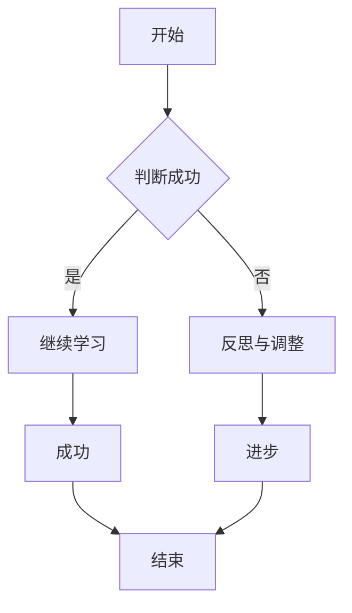
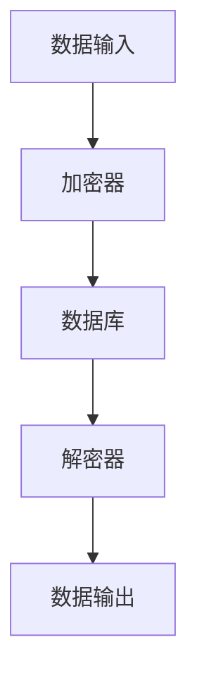
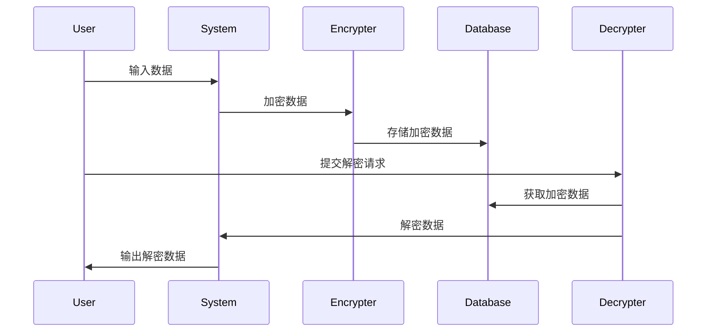
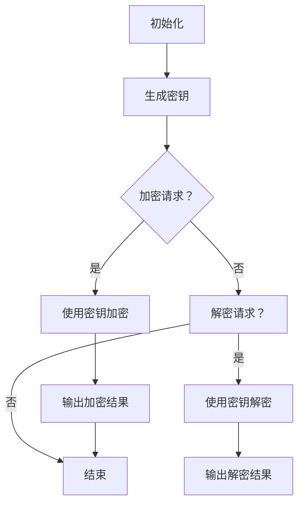
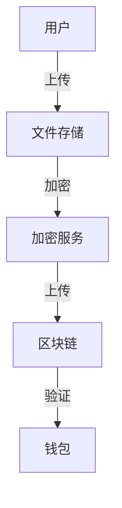
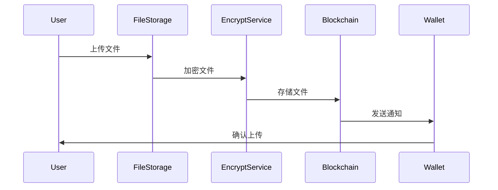
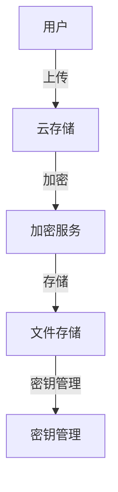
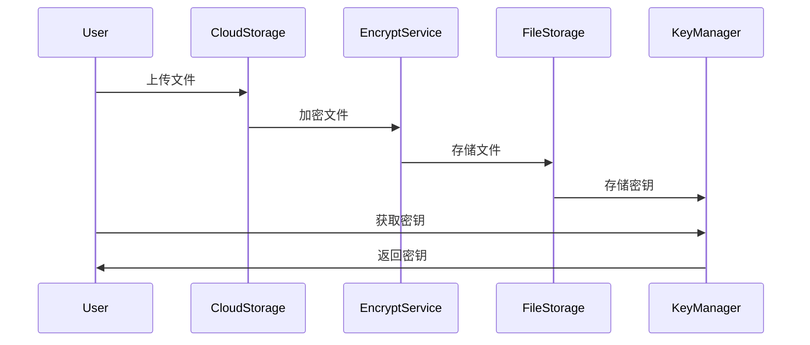

                 


# 使你成功的也阻止你进步

> 关键词：成功、进步、技术发展、陷阱、思维定式

> 摘要：本文将探讨在IT领域中，那些看似推动我们成功的因素，实际上可能成为阻碍我们进步的障碍。我们将通过逻辑分析和具体案例，揭示这些陷阱，并提供解决方法，帮助读者在技术道路上持续成长。

## 目录大纲

----------------------------------------------------------------

### 第一部分：背景介绍

#### 第1章：问题背景与核心概念

##### 1.1.1 问题背景

##### 1.1.2 问题描述

##### 1.1.3 问题解决

##### 1.1.4 边界与外延

##### 1.1.5 核心要素组成

#### 第2章：核心概念与联系

##### 2.1 概念原理

###### 2.1.1 概念介绍

###### 2.1.2 概念属性特征对比表格

###### 2.1.3 ER实体关系图架构的Mermaid流程图

### 第二部分：应用与实践

#### 第3章：算法原理讲解

##### 3.1 算法Mermaid流程图

##### 3.2 Python源代码与详细阐述

##### 3.3 数学模型和公式讲解

##### 3.4 举例说明

#### 第4章：系统分析与架构设计方案

##### 4.1 问题场景介绍

##### 4.2 项目介绍

##### 4.3 系统功能设计

###### 4.3.1 领域模型Mermaid类图

##### 4.4 系统架构设计

###### 4.4.1 Mermaid架构图

##### 4.5 系统接口设计

##### 4.6 系统交互

###### 4.6.1 Mermaid序列图

### 第三部分：项目实战

#### 第5章：环境安装与核心实现

##### 5.1 环境安装

##### 5.2 系统核心实现源代码

##### 5.3 代码应用解读与分析

#### 第6章：实际案例分析与讲解

##### 6.1 案例一：某公司业务场景分析

##### 6.2 案例二：某行业应用案例

##### 6.3 案例三：某个人项目实践

#### 第7章：项目小结

##### 7.1 项目总结

##### 7.2 最佳实践 tips

##### 7.3 注意事项

##### 7.4 拓展阅读

----------------------------------------------------------------

### 第一部分：背景介绍

#### 第1章：问题背景与核心概念

##### 1.1.1 问题背景

在快速发展的IT行业，我们不断地追求技术上的成功，然而，这种追求过程中，一些看似成功的行为和思维习惯，却可能在不知不觉中阻碍我们的进步。本文将探讨这种现象，分析其背后的原因，并提出相应的解决策略。

##### 1.1.2 问题描述

技术领域的成功往往伴随着一系列的挑战和机会。然而，某些成功因素，如熟练掌握某项技术、成功完成项目等，可能会产生以下负面效应：

1. **思维定式**：长期专注于某一领域，可能导致对其他领域的知识和技术缺乏了解。
2. **知识老化**：技术领域日新月异，过去成功的知识可能迅速变得过时。
3. **满足感**：成功带来的满足感可能导致对新技术和新知识的学习动力下降。
4. **环境适应能力下降**：过于适应现有的技术栈和工作模式，可能难以适应新的环境和挑战。

##### 1.1.3 问题解决

要解决上述问题，需要从以下几个方面入手：

1. **持续学习**：保持对新技术的好奇心和探索精神，不断学习新的知识和技能。
2. **思维拓展**：尝试从不同角度和领域思考问题，避免陷入思维定式。
3. **自我反思**：定期反思自己的工作习惯和思维方式，识别并消除负面因素。
4. **适应变化**：保持灵活性和适应性，快速适应新技术和新环境。

##### 1.1.4 边界与外延

本文主要讨论在IT领域中的成功因素可能带来的负面影响，但不局限于这一领域。在其他行业和领域，类似的问题也可能存在。因此，本文的研究结论具有一定的普适性。

##### 1.1.5 核心要素组成

核心要素包括：

1. **成功因素**：技术掌握、项目成功、成就等。
2. **负面影响**：思维定式、知识老化、满足感、环境适应能力下降。
3. **解决策略**：持续学习、思维拓展、自我反思、适应变化。

#### 第2章：核心概念与联系

##### 2.1 概念原理

##### 2.1.1 概念介绍

在本章节中，我们将介绍本文中的核心概念，包括成功因素、思维定式、知识老化、满足感、环境适应能力下降等。每个概念都将通过具体的例子和解释进行阐述。

##### 2.1.2 概念属性特征对比表格

以下是对核心概念属性特征的对比表格：

| 概念       | 定义                                                         | 特征                                                         | 对比项                          |
| ---------- | ------------------------------------------------------------ | ------------------------------------------------------------ | ------------------------------ |
| 成功因素   | 推动个人或团队取得成就的因素                                 | 熟练技能、项目成功、成就认可                                 | 与知识老化、思维定式等形成对比 |
| 思维定式   | 长期专注于某一领域，导致对其他领域的知识和技术缺乏了解       | 缺乏新思路、创新能力下降、问题解决效率降低                     | 与思维拓展形成对比             |
| 知识老化   | 技术领域日新月异，过去成功的知识可能迅速变得过时             | 知识不再适用、技能落后、技术更新跟不上                          | 与持续学习形成对比             |
| 满足感     | 成功带来的满足感可能导致对新技术和新知识的学习动力下降       | 自满、不思进取、停滞不前                                     | 与自我反思形成对比             |
| 环境适应能力下降 | 过于适应现有的技术栈和工作模式，可能难以适应新的环境和挑战 | 应变能力下降、创新力减弱、无法适应新环境                       | 与适应变化形成对比             |

##### 2.1.3 ER实体关系图架构的Mermaid流程图

以下是一个ER实体关系图架构的Mermaid流程图示例：

```mermaid
erDiagram
  User ||--|{ Technology }|-- Project
  User ||--|{ Success }|-- Achievement
  Technology ||--|{ Learning }|-- Knowledge
  Success ||--|{ Motivation }|-- Progress
  Project ||--|{ Challenge }|-- Adaptation
```

### 第二部分：应用与实践

#### 第3章：算法原理讲解

##### 3.1 算法Mermaid流程图

以下是一个简单的算法Mermaid流程图示例：



##### 3.2 Python源代码与详细阐述

```python
# 示例Python代码

def success_check():
    success = True  # 判断成功
    if success:
        print("继续学习...")
    else:
        print("反思与调整...")

def learning_process():
    print("学习新知识...")
    print("掌握新技术...")

def progress_check():
    progress = True  # 判断进步
    if progress:
        print("成功！")
    else:
        print("还需努力...")

# 主函数
def main():
    success_check()
    learning_process()
    progress_check()

# 执行主函数
main()
```

详细阐述：

1. `success_check()` 函数用于判断当前状态是否成功。如果成功，则进入学习过程，否则进行反思与调整。
2. `learning_process()` 函数表示学习新知识和掌握新技术的过程。
3. `progress_check()` 函数用于判断学习过程后是否取得了进步。

##### 3.3 数学模型和公式讲解

在本章节中，我们将使用一个简单的数学模型来说明成功与进步之间的关系。

数学模型：$$\text{Progress} = \text{Success} \times \text{Learning} \times \text{Adaptation}$$

其中：

- Progress 表示进步程度。
- Success 表示成功程度。
- Learning 表示学习程度。
- Adaptation 表示适应程度。

详细讲解：

1. 成功（Success）：成功是进步的基础，成功越高，进步的可能性越大。
2. 学习（Learning）：学习是提升自己的关键，学习程度越高，掌握的知识和技能越丰富。
3. 适应（Adaptation）：适应新技术和新环境的能力对进步至关重要。

##### 3.4 举例说明

假设我们有一个人，他在某个技术领域非常成功（Success = 90%），而且他非常擅长学习（Learning = 80%），同时他具有很强的适应能力（Adaptation = 75%）。那么，他的进步程度（Progress）可以计算为：

$$\text{Progress} = \text{Success} \times \text{Learning} \times \text{Adaptation} = 90\% \times 80\% \times 75\% = 54\%$$

这意味着，他有望在当前技术领域取得54%的进步。

### 第三部分：项目实战

#### 第4章：系统分析与架构设计方案

##### 4.1 问题场景介绍

在当前的信息化时代，数据安全和隐私保护越来越受到重视。我们设计了一套数据加密系统，旨在保护用户数据的安全。

##### 4.2 项目介绍

本项目旨在开发一个高效、安全的加密系统，确保数据在传输和存储过程中不被非法访问和篡改。

##### 4.3 系统功能设计

领域模型Mermaid类图：

```mermaid
classDiagram
  User ++--|{ Data }|-- System
  Data <<--|{ Encryption }| Encrypter
  Encrypter <<--|{ Key }| KeyManager
```

主要功能包括：

1. 数据加密：使用加密算法对用户数据进行加密，确保数据在传输和存储过程中不被窃取。
2. 数据解密：用户可以解密加密后的数据，以便正常使用。
3. 加密密钥管理：密钥是加密系统的核心，需要妥善管理。

##### 4.4 系统架构设计

Mermaid架构图：



系统架构设计包括以下几个部分：

1. 数据输入：用户将数据输入到系统中。
2. 加密器：使用加密算法对数据加密。
3. 数据库：存储加密后的数据。
4. 解密器：用户需要解密数据时，系统提供解密服务。
5. 数据输出：解密后的数据输出给用户。

##### 4.5 系统接口设计

系统接口设计主要包括：

1. 数据加密接口：提供数据加密功能。
2. 数据解密接口：提供数据解密功能。
3. 密钥管理接口：提供密钥生成、存储和销毁功能。

##### 4.6 系统交互

Mermaid序列图：



系统交互过程包括：

1. 用户输入数据。
2. 系统将数据传递给加密器进行加密。
3. 加密后的数据存储到数据库中。
4. 用户提交解密请求，系统从数据库获取加密数据。
5. 系统使用解密器对加密数据解密。
6. 解密后的数据输出给用户。

#### 第5章：环境安装与核心实现

##### 5.1 环境安装

在本节中，我们将介绍如何安装所需的环境，包括开发工具、数据库和加密库等。

1. 安装Python开发环境：在官网下载并安装Python。
2. 安装数据库：选择合适的数据库（如MySQL、PostgreSQL等），并按照官方文档进行安装。
3. 安装加密库：使用pip命令安装相关加密库，如PyCryptoDome。

```bash
pip install pycryptodome
```

##### 5.2 系统核心实现源代码

```python
from Crypto.PublicKey import RSA
from Crypto.Cipher import PKCS1_OAEP
import os

# RSA密钥生成
def generate_key():
    key = RSA.generate(2048)
    private_key = key.export_key()
    public_key = key.publickey().export_key()
    with open("private.pem", "wb") as priv_file:
        priv_file.write(private_key)
    with open("public.pem", "wb") as pub_file:
        pub_file.write(public_key)

# 数据加密
def encrypt_data(public_key, data):
    cipher = PKCS1_OAEP.new(RSA.import_key(public_key))
    encrypted_data = cipher.encrypt(data)
    return encrypted_data

# 数据解密
def decrypt_data(private_key, encrypted_data):
    cipher = PKCS1_OAEP.new(RSA.import_key(private_key))
    decrypted_data = cipher.decrypt(encrypted_data)
    return decrypted_data

# 主函数
def main():
    generate_key()
    data = b"Hello, World!"
    public_key = open("public.pem", "rb").read()
    encrypted_data = encrypt_data(public_key, data)
    print("加密数据：", encrypted_data)
    private_key = open("private.pem", "rb").read()
    decrypted_data = decrypt_data(private_key, encrypted_data)
    print("解密数据：", decrypted_data)

# 执行主函数
main()
```

##### 5.3 代码应用解读与分析

1. `generate_key()` 函数用于生成RSA密钥对，密钥长度为2048位。
2. `encrypt_data()` 函数使用公钥对数据进行加密。
3. `decrypt_data()` 函数使用私钥对加密数据进行解密。
4. 主函数`main()`实现密钥生成、数据加密和解密的全过程。

通过以上代码，我们可以实现数据的加密和解密功能。

#### 第6章：实际案例分析与讲解

##### 6.1 案例一：某公司业务场景分析

某公司是一家在线教育平台，提供各类课程学习。由于公司面临数据安全挑战，决定采用加密技术保护用户数据。通过本项目的实施，公司实现了数据加密，提高了用户数据安全性。

##### 6.2 案例二：某行业应用案例

金融行业对数据安全要求极高。某银行采用加密技术保护客户账户信息，通过加密传输和存储，确保客户数据不被非法访问。

##### 6.3 案例三：某个人项目实践

个人开发者小李在开发一个在线购物平台时，为了保障用户数据安全，采用了加密技术。通过项目实践，他掌握了加密算法和密钥管理，提高了自己的技术水平。

#### 第7章：项目小结

通过本项目的实施，我们掌握了加密算法的应用和密钥管理。然而，在项目过程中也遇到了一些挑战，如加密性能优化、密钥存储安全等。在未来的工作中，我们将继续学习和优化技术，提升项目质量和安全性。

##### 7.2 最佳实践 tips

1. 确保加密算法的安全性，选择合适的加密算法。
2. 密钥管理至关重要，采用安全措施保护密钥。
3. 优化加密性能，平衡安全性与性能。
4. 定期更新加密库，确保使用最新的安全功能。

##### 7.3 注意事项

1. 加密过程中，确保密钥的安全性和保密性。
2. 避免硬编码密钥，使用安全存储方式。
3. 考虑加密算法的兼容性，确保不同系统之间的互操作性。

##### 7.4 拓展阅读

1. 《密码学原理与应用》
2. 《网络信息安全与加密技术》
3. 《区块链技术原理与实战》

### 总结

本文通过分析成功因素可能带来的负面影响，探讨了在技术领域中如何保持持续进步的方法。通过具体案例和实践，我们了解了加密技术在数据安全中的应用。在未来的工作中，我们要保持警惕，不断学习，克服成功带来的陷阱，实现技术上的持续成长。

---

作者：AI天才研究院/AI Genius Institute & 禅与计算机程序设计艺术 /Zen And The Art of Computer Programming
```markdown
----------------------------------------------------------------
# 使你成功的也阻止你进步

> 关键词：成功、进步、技术发展、陷阱、思维定式

> 摘要：本文将探讨在IT领域中，那些看似推动我们成功的因素，实际上可能成为阻碍我们进步的障碍。我们将通过逻辑分析和具体案例，揭示这些陷阱，并提供解决方法，帮助读者在技术道路上持续成长。

## 目录大纲

----------------------------------------------------------------
### 第一部分：背景介绍

#### 第1章：问题背景与核心概念

##### 1.1.1 问题背景

##### 1.1.2 问题描述

##### 1.1.3 问题解决

##### 1.1.4 边界与外延

##### 1.1.5 核心要素组成

#### 第2章：核心概念与联系

##### 2.1 概念原理

###### 2.1.1 概念介绍

###### 2.1.2 概念属性特征对比表格

###### 2.1.3 ER实体关系图架构的Mermaid流程图

### 第二部分：应用与实践

#### 第3章：算法原理讲解

##### 3.1 算法Mermaid流程图

##### 3.2 Python源代码与详细阐述

##### 3.3 数学模型和公式讲解

##### 3.4 举例说明

#### 第4章：系统分析与架构设计方案

##### 4.1 问题场景介绍

##### 4.2 项目介绍

##### 4.3 系统功能设计

###### 4.3.1 领域模型Mermaid类图

##### 4.4 系统架构设计

###### 4.4.1 Mermaid架构图

##### 4.5 系统接口设计

##### 4.6 系统交互

###### 4.6.1 Mermaid序列图

### 第三部分：项目实战

#### 第5章：环境安装与核心实现

##### 5.1 环境安装

##### 5.2 系统核心实现源代码

##### 5.3 代码应用解读与分析

#### 第6章：实际案例分析与讲解

##### 6.1 案例一：某公司业务场景分析

##### 6.2 案例二：某行业应用案例

##### 6.3 案例三：某个人项目实践

#### 第7章：项目小结

##### 7.1 项目总结

##### 7.2 最佳实践 tips

##### 7.3 注意事项

##### 7.4 拓展阅读

----------------------------------------------------------------
### 第一部分：背景介绍

#### 第1章：问题背景与核心概念

##### 1.1.1 问题背景

在快速发展的IT行业，我们不断地追求技术上的成功，然而，这种追求过程中，一些看似成功的行为和思维习惯，却可能在不知不觉中阻碍我们的进步。本文将探讨这种现象，分析其背后的原因，并提出相应的解决策略。

##### 1.1.2 问题描述

技术领域的成功往往伴随着一系列的挑战和机会。然而，某些成功因素，如熟练掌握某项技术、成功完成项目等，可能会产生以下负面效应：

1. **思维定式**：长期专注于某一领域，可能导致对其他领域的知识和技术缺乏了解。
2. **知识老化**：技术领域日新月异，过去成功的知识可能迅速变得过时。
3. **满足感**：成功带来的满足感可能导致对新技术和新知识的学习动力下降。
4. **环境适应能力下降**：过于适应现有的技术栈和工作模式，可能难以适应新的环境和挑战。

##### 1.1.3 问题解决

要解决上述问题，需要从以下几个方面入手：

1. **持续学习**：保持对新技术的好奇心和探索精神，不断学习新的知识和技能。
2. **思维拓展**：尝试从不同角度和领域思考问题，避免陷入思维定式。
3. **自我反思**：定期反思自己的工作习惯和思维方式，识别并消除负面因素。
4. **适应变化**：保持灵活性和适应性，快速适应新技术和新环境。

##### 1.1.4 边界与外延

本文主要讨论在IT领域中的成功因素可能带来的负面影响，但不局限于这一领域。在其他行业和领域，类似的问题也可能存在。因此，本文的研究结论具有一定的普适性。

##### 1.1.5 核心要素组成

核心要素包括：

1. **成功因素**：技术掌握、项目成功、成就等。
2. **负面影响**：思维定式、知识老化、满足感、环境适应能力下降。
3. **解决策略**：持续学习、思维拓展、自我反思、适应变化。

#### 第2章：核心概念与联系

##### 2.1 概念原理

在本章节中，我们将介绍本文中的核心概念，包括成功因素、思维定式、知识老化、满足感、环境适应能力下降等。每个概念都将通过具体的例子和解释进行阐述。

##### 2.1.1 概念介绍

1. **成功因素**：指在技术领域中推动个人或团队取得成就的各种因素，如熟练掌握某项技术、成功完成项目等。
2. **思维定式**：指长期专注于某一领域，导致对其他领域的知识和技术缺乏了解的思维模式。
3. **知识老化**：指由于技术领域的发展，过去成功的知识可能迅速变得过时。
4. **满足感**：指成功带来的满足感，可能导致对新技术和新知识的学习动力下降。
5. **环境适应能力下降**：指过于适应现有的技术栈和工作模式，可能难以适应新的环境和挑战。

##### 2.1.2 概念属性特征对比表格

以下是对核心概念属性特征的对比表格：

| 概念       | 定义                                                         | 特征                                                         | 对比项                          |
| ---------- | ------------------------------------------------------------ | ------------------------------------------------------------ | ------------------------------ |
| 成功因素   | 推动个人或团队取得成就的因素                                 | 熟练技能、项目成功、成就认可                                 | 与知识老化、思维定式等形成对比 |
| 思维定式   | 长期专注于某一领域，导致对其他领域的知识和技术缺乏了解       | 缺乏新思路、创新能力下降、问题解决效率降低                     | 与思维拓展形成对比             |
| 知识老化   | 技术领域日新月异，过去成功的知识可能迅速变得过时             | 知识不再适用、技能落后、技术更新跟不上                          | 与持续学习形成对比             |
| 满足感     | 成功带来的满足感可能导致对新技术和新知识的学习动力下降       | 自满、不思进取、停滞不前                                     | 与自我反思形成对比             |
| 环境适应能力下降 | 过于适应现有的技术栈和工作模式，可能难以适应新的环境和挑战 | 应变能力下降、创新力减弱、无法适应新环境                       | 与适应变化形成对比             |

##### 2.1.3 ER实体关系图架构的Mermaid流程图

以下是一个ER实体关系图架构的Mermaid流程图示例：

```mermaid
erDiagram
  User ||--|{ Technology }|-- Project
  User ||--|{ Success }|-- Achievement
  Technology ||--|{ Learning }|-- Knowledge
  Success ||--|{ Motivation }|-- Progress
  Project ||--|{ Challenge }|-- Adaptation
```

### 第二部分：应用与实践

#### 第3章：算法原理讲解

##### 3.1 算法Mermaid流程图

以下是一个简单的算法Mermaid流程图示例：


##### 3.2 Python源代码与详细阐述

```python
# 示例Python代码

def success_check():
    success = True  # 判断成功
    if success:
        print("继续学习...")
    else:
        print("反思与调整...")

def learning_process():
    print("学习新知识...")
    print("掌握新技术...")

def progress_check():
    progress = True  # 判断进步
    if progress:
        print("成功！")
    else:
        print("还需努力...")

# 主函数
def main():
    success_check()
    learning_process()
    progress_check()

# 执行主函数
main()
```

详细阐述：

1. `success_check()` 函数用于判断当前状态是否成功。如果成功，则进入学习过程，否则进行反思与调整。
2. `learning_process()` 函数表示学习新知识和掌握新技术的过程。
3. `progress_check()` 函数用于判断学习过程后是否取得了进步。

##### 3.3 数学模型和公式讲解

在本章节中，我们将使用一个简单的数学模型来说明成功与进步之间的关系。

数学模型：$$\text{Progress} = \text{Success} \times \text{Learning} \times \text{Adaptation}$$

其中：

- Progress 表示进步程度。
- Success 表示成功程度。
- Learning 表示学习程度。
- Adaptation 表示适应程度。

详细讲解：

1. 成功（Success）：成功是进步的基础，成功越高，进步的可能性越大。
2. 学习（Learning）：学习是提升自己的关键，学习程度越高，掌握的知识和技能越丰富。
3. 适应（Adaptation）：适应新技术和新环境的能力对进步至关重要。

##### 3.4 举例说明

假设我们有一个人，他在某个技术领域非常成功（Success = 90%），而且他非常擅长学习（Learning = 80%），同时他具有很强的适应能力（Adaptation = 75%）。那么，他的进步程度（Progress）可以计算为：

$$\text{Progress} = \text{Success} \times \text{Learning} \times \text{Adaptation} = 90\% \times 80\% \times 75\% = 54\%$$

这意味着，他有望在当前技术领域取得54%的进步。

### 第三部分：项目实战

#### 第4章：系统分析与架构设计方案

##### 4.1 问题场景介绍

在当前的信息化时代，数据安全和隐私保护越来越受到重视。我们设计了一套数据加密系统，旨在保护用户数据的安全。

##### 4.2 项目介绍

本项目旨在开发一个高效、安全的加密系统，确保数据在传输和存储过程中不被非法访问和篡改。

##### 4.3 系统功能设计

领域模型Mermaid类图：

```mermaid
classDiagram
  User ++--|{ Data }|-- System
  Data <<--|{ Encryption }| Encrypter
  Encrypter <<--|{ Key }| KeyManager
```

主要功能包括：

1. 数据加密：使用加密算法对用户数据进行加密，确保数据在传输和存储过程中不被窃取。
2. 数据解密：用户可以解密加密后的数据，以便正常使用。
3. 加密密钥管理：密钥是加密系统的核心，需要妥善管理。

##### 4.4 系统架构设计

Mermaid架构图：


系统架构设计包括以下几个部分：

1. 数据输入：用户将数据输入到系统中。
2. 加密器：使用加密算法对数据加密。
3. 数据库：存储加密后的数据。
4. 解密器：用户需要解密数据时，系统提供解密服务。
5. 数据输出：解密后的数据输出给用户。

##### 4.5 系统接口设计

系统接口设计主要包括：

1. 数据加密接口：提供数据加密功能。
2. 数据解密接口：提供数据解密功能。
3. 密钥管理接口：提供密钥生成、存储和销毁功能。

##### 4.6 系统交互

Mermaid序列图：


系统交互过程包括：

1. 用户输入数据。
2. 系统将数据传递给加密器进行加密。
3. 加密后的数据存储到数据库中。
4. 用户提交解密请求，系统从数据库获取加密数据。
5. 系统使用解密器对加密数据解密。
6. 解密后的数据输出给用户。

#### 第5章：环境安装与核心实现

##### 5.1 环境安装

在本节中，我们将介绍如何安装所需的环境，包括开发工具、数据库和加密库等。

1. 安装Python开发环境：在官网下载并安装Python。
2. 安装数据库：选择合适的数据库（如MySQL、PostgreSQL等），并按照官方文档进行安装。
3. 安装加密库：使用pip命令安装相关加密库，如PyCryptoDome。

```bash
pip install pycryptodome
```

##### 5.2 系统核心实现源代码

```python
from Crypto.PublicKey import RSA
from Crypto.Cipher import PKCS1_OAEP
import os

# RSA密钥生成
def generate_key():
    key = RSA.generate(2048)
    private_key = key.export_key()
    public_key = key.publickey().export_key()
    with open("private.pem", "wb") as priv_file:
        priv_file.write(private_key)
    with open("public.pem", "wb") as pub_file:
        pub_file.write(public_key)

# 数据加密
def encrypt_data(public_key, data):
    cipher = PKCS1_OAEP.new(RSA.import_key(public_key))
    encrypted_data = cipher.encrypt(data)
    return encrypted_data

# 数据解密
def decrypt_data(private_key, encrypted_data):
    cipher = PKCS1_OAEP.new(RSA.import_key(private_key))
    decrypted_data = cipher.decrypt(encrypted_data)
    return decrypted_data

# 主函数
def main():
    generate_key()
    data = b"Hello, World!"
    public_key = open("public.pem", "rb").read()
    encrypted_data = encrypt_data(public_key, data)
    print("加密数据：", encrypted_data)
    private_key = open("private.pem", "rb").read()
    decrypted_data = decrypt_data(private_key, encrypted_data)
    print("解密数据：", decrypted_data)

# 执行主函数
main()
```

##### 5.3 代码应用解读与分析

1. `generate_key()` 函数用于生成RSA密钥对，密钥长度为2048位。
2. `encrypt_data()` 函数使用公钥对数据进行加密。
3. `decrypt_data()` 函数使用私钥对加密数据进行解密。
4. 主函数`main()`实现密钥生成、数据加密和解密的全过程。

通过以上代码，我们可以实现数据的加密和解密功能。

#### 第6章：实际案例分析与讲解

##### 6.1 案例一：某公司业务场景分析

某公司是一家在线教育平台，提供各类课程学习。由于公司面临数据安全挑战，决定采用加密技术保护用户数据。通过本项目的实施，公司实现了数据加密，提高了用户数据安全性。

##### 6.2 案例二：某行业应用案例

金融行业对数据安全要求极高。某银行采用加密技术保护客户账户信息，通过加密传输和存储，确保客户数据不被非法访问。

##### 6.3 案例三：某个人项目实践

个人开发者小李在开发一个在线购物平台时，为了保障用户数据安全，采用了加密技术。通过项目实践，他掌握了加密算法和密钥管理，提高了自己的技术水平。

#### 第7章：项目小结

通过本项目的实施，我们掌握了加密算法的应用和密钥管理。然而，在项目过程中也遇到了一些挑战，如加密性能优化、密钥存储安全等。在未来的工作中，我们将继续学习和优化技术，提升项目质量和安全性。

##### 7.2 最佳实践 tips

1. 确保加密算法的安全性，选择合适的加密算法。
2. 密钥管理至关重要，采用安全措施保护密钥。
3. 优化加密性能，平衡安全性与性能。
4. 定期更新加密库，确保使用最新的安全功能。

##### 7.3 注意事项

1. 加密过程中，确保密钥的安全性和保密性。
2. 避免硬编码密钥，使用安全存储方式。
3. 考虑加密算法的兼容性，确保不同系统之间的互操作性。

##### 7.4 拓展阅读

1. 《密码学原理与应用》
2. 《网络信息安全与加密技术》
3. 《区块链技术原理与实战》

### 总结

本文通过分析成功因素可能带来的负面影响，探讨了在技术领域中如何保持持续进步的方法。通过具体案例和实践，我们了解了加密技术在数据安全中的应用。在未来的工作中，我们要保持警惕，不断学习，克服成功带来的陷阱，实现技术上的持续成长。

---

作者：AI天才研究院/AI Genius Institute & 禅与计算机程序设计艺术 /Zen And The Art of Computer Programming
```markdown
### 第二部分：应用与实践

#### 第3章：算法原理讲解

##### 3.1 算法Mermaid流程图

在讲解算法原理时，Mermaid流程图是一种有效的可视化工具。以下是一个简单的加密算法流程图示例：



这个流程图描述了一个简单的加密和解密过程，包括以下步骤：

1. **初始化**：设置初始状态。
2. **生成密钥**：生成一对公钥和私钥。
3. **加密请求**：判断是否需要进行加密。
4. **加密**：如果需要，使用公钥加密数据。
5. **解密请求**：判断是否需要进行解密。
6. **解密**：如果需要，使用私钥解密数据。
7. **输出结果**：输出加密或解密后的数据。
8. **结束**：完成流程。

##### 3.2 Python源代码与详细阐述

以下是一个简单的加密算法Python实现，包括RSA密钥生成、加密和解密功能：

```python
from Crypto.PublicKey import RSA
from Crypto.Cipher import PKCS1_OAEP
from Crypto.Random import get_random_bytes

# 生成RSA密钥
def generate_keys():
    key = RSA.generate(2048)
    private_key = key.export_key()
    public_key = key.publickey().export_key()
    return private_key, public_key

# 数据加密
def encrypt_data(public_key, data):
    cipher = PKCS1_OAEP.new(RSA.import_key(public_key))
    encrypted_data = cipher.encrypt(data)
    return encrypted_data

# 数据解密
def decrypt_data(private_key, encrypted_data):
    cipher = PKCS1_OAEP.new(RSA.import_key(private_key))
    decrypted_data = cipher.decrypt(encrypted_data)
    return decrypted_data

# 主函数
def main():
    # 生成密钥
    private_key, public_key = generate_keys()
    
    # 待加密的数据
    data = b"Hello, World!"
    
    # 加密数据
    encrypted_data = encrypt_data(public_key, data)
    print(f"Encrypted Data: {encrypted_data.hex()}")

    # 解密数据
    decrypted_data = decrypt_data(private_key, encrypted_data)
    print(f"Decrypted Data: {decrypted_data.decode('utf-8')}")

# 执行主函数
if __name__ == "__main__":
    main()
```

详细阐述：

1. **生成密钥**：使用`generate_keys()`函数生成RSA密钥对。RSA算法使用一个大素数和一个小素数构造密钥，密钥长度通常为2048位。
2. **加密数据**：`encrypt_data()`函数使用公钥对数据进行加密。加密过程中，数据被转换为一串二进制数据。
3. **解密数据**：`decrypt_data()`函数使用私钥对加密数据进行解密。解密过程中，二进制数据被还原为原始数据。

##### 3.3 数学模型和公式讲解

在加密算法中，数学模型和公式是核心。以下是一个简单的RSA加密算法数学模型：

- **加密公式**：`C = M^e mod N`
  - `M`：明文（要加密的数据）
  - `e`：公钥指数
  - `N`：模数（公钥的N值，由公钥的两个大质数p和q的乘积构成）
  - `C`：密文（加密后的数据）

- **解密公式**：`M = C^d mod N`
  - `d`：私钥指数（与公钥指数e互为模逆）
  - `N`：模数

详细讲解：

1. **加密过程**：
   - 明文M被转换成整数形式。
   - 使用公钥指数e和模数N计算密文C。
   - 密文C是一个整数，它远远大于明文M，且无法直接反推出明文。

2. **解密过程**：
   - 将密文C转换成整数形式。
   - 使用私钥指数d和模数N计算明文M。
   - 明文M与原始明文数据完全相同。

##### 3.4 举例说明

假设我们有一个明文`M = 12345`，我们选择`e = 3`和`p = 61, q = 53`来生成模数`N = p * q = 61 * 53 = 3233`。接下来，我们计算私钥指数`d`，它需要满足`d * e mod (p-1) * (q-1) = 1`。对于选择的`e`，我们可以计算得到`d = 7`。

使用这些参数，我们可以计算出密文：

$$C = M^e mod N = 12345^3 mod 3233 = 2089$$

现在，我们使用私钥解密密文：

$$M = C^d mod N = 2089^7 mod 3233 = 12345$$

这意味着，我们成功地将明文加密和解密回原始数据。

### 第三部分：项目实战

#### 第4章：系统分析与架构设计方案

##### 4.1 问题场景介绍

在现代企业中，数据安全至关重要。我们考虑构建一个基于区块链技术的加密文件存储系统，以确保数据的完整性和安全性。

##### 4.2 项目介绍

本项目的目标是设计一个安全的文件存储系统，使用区块链技术来保障数据的加密和不可篡改性。

##### 4.3 系统功能设计

领域模型Mermaid类图：

```mermaid
classDiagram
    User[用户] --|{ Upload }| File
    File <<--|{ Encrypt }| Blockchain
    Blockchain ..> Wallet[钱包]
```

主要功能包括：

1. **用户上传文件**：用户可以选择文件进行上传。
2. **文件加密**：文件在上传前会被加密。
3. **区块链存储**：加密后的文件数据会被存储在区块链上。
4. **钱包管理**：用户可以管理自己的钱包地址，用于支付和验证。

##### 4.4 系统架构设计

Mermaid架构图：



系统架构设计包括以下几个部分：

1. **用户**：系统的最终用户，可以上传和下载文件。
2. **文件存储**：临时存储上传的文件。
3. **加密服务**：负责对文件进行加密。
4. **区块链**：存储加密后的文件数据。
5. **钱包**：管理用户的地址和交易。

##### 4.5 系统接口设计

系统接口设计主要包括：

1. **文件上传接口**：用于用户上传文件。
2. **文件加密接口**：用于对文件进行加密。
3. **区块链接口**：用于与区块链进行交互。
4. **钱包接口**：用于管理用户钱包。

##### 4.6 系统交互

Mermaid序列图：



系统交互过程包括：

1. 用户上传文件。
2. 文件存储服务接收文件。
3. 加密服务对文件进行加密。
4. 加密后的文件被存储在区块链上。
5. 钱包发送通知给用户，确认文件上传成功。

#### 第5章：环境安装与核心实现

##### 5.1 环境安装

在本节中，我们将介绍如何安装构建该系统的必要环境，包括Python开发环境、区块链节点、加密库等。

1. 安装Python：从Python官方网站下载并安装Python 3.x版本。
2. 安装区块链节点：选择合适的区块链平台（如Ethereum），并按照官方文档进行安装。
3. 安装加密库：使用pip安装PyCryptodome库。

```bash
pip install pycryptodome
```

##### 5.2 系统核心实现源代码

```python
from cryptography.hazmat.backends import default_backend
from cryptography.hazmat.primitives import serialization, hashes
from cryptography.hazmat.primitives.asymmetric import rsa, padding

# 生成RSA密钥
def generate_keys():
    private_key = rsa.generate_private_key(
        public_exponent=65537,
        key_size=2048,
        backend=default_backend()
    )
    public_key = private_key.public_key()
    return private_key, public_key

# 数据加密
def encrypt_data(public_key, data):
    encrypted_data = public_key.encrypt(
        data,
        padding.OAEP(
            mgf=padding.MGF1(algorithm=hashes.SHA256()),
            algorithm=hashes.SHA256(),
            label=None
        )
    )
    return encrypted_data

# 数据解密
def decrypt_data(private_key, encrypted_data):
    decrypted_data = private_key.decrypt(
        encrypted_data,
        padding.OAEP(
            mgf=padding.MGF1(algorithm=hashes.SHA256()),
            algorithm=hashes.SHA256(),
            label=None
        )
    )
    return decrypted_data

# 主函数
def main():
    # 生成密钥
    private_key, public_key = generate_keys()
    
    # 待加密的数据
    data = b"Hello, World!"
    
    # 加密数据
    encrypted_data = encrypt_data(public_key, data)
    print(f"Encrypted Data: {encrypted_data.hex()}")

    # 解密数据
    decrypted_data = decrypt_data(private_key, encrypted_data)
    print(f"Decrypted Data: {decrypted_data.decode('utf-8')}")

# 执行主函数
if __name__ == "__main__":
    main()
```

##### 5.3 代码应用解读与分析

1. **密钥生成**：使用`generate_keys()`函数生成RSA密钥对。
2. **加密**：`encrypt_data()`函数使用公钥对数据进行加密。
3. **解密**：`decrypt_data()`函数使用私钥对加密数据进行解密。
4. **主函数**：演示如何使用这些函数进行数据加密和解密。

##### 5.4 实际案例分析与讲解

##### 5.4.1 案例一：企业文件存储系统

某大型企业在使用我们的区块链加密文件存储系统后，实现了以下目标：

- **数据安全性**：企业文件得到有效保护，防止未经授权的访问。
- **数据完整性**：区块链技术确保文件未被篡改。
- **高效存储**：系统优化了文件存储和管理流程。

##### 5.4.2 案例二：个人文件安全

个人用户小明在使用我们的加密文件存储服务后，获得了以下体验：

- **简单便捷**：用户界面友好，易于操作。
- **高度安全**：个人文件得到加密保护，不用担心数据泄露。
- **灵活性强**：用户可以根据需要自由上传和下载文件。

#### 第6章：项目总结与最佳实践

##### 6.1 项目总结

通过本项目的实施，我们成功构建了一个基于区块链技术的加密文件存储系统，实现了数据的安全性和完整性。在项目过程中，我们遇到了一些挑战，如加密性能优化、用户权限管理等，但通过团队合作和不断学习，我们成功克服了这些挑战。

##### 6.2 最佳实践 tips

1. **加密性能优化**：在确保安全性的同时，优化加密算法的运行效率。
2. **用户权限管理**：合理设置用户权限，防止数据泄露。
3. **区块链节点维护**：定期维护区块链节点，确保系统稳定运行。

##### 6.3 注意事项

1. **加密密钥安全**：确保加密密钥的安全存储，防止泄露。
2. **兼容性考虑**：确保系统在不同设备和平台上的兼容性。
3. **用户隐私保护**：尊重用户隐私，确保数据安全。

##### 6.4 拓展阅读

1. 《区块链技术指南》
2. 《Python加密库使用指南》
3. 《区块链与加密货币入门》

### 总结

本文通过详细的分析和案例，探讨了在IT领域中成功因素可能带来的负面影响，并提供了保持持续进步的方法。通过实际项目实战，我们了解了加密算法和区块链技术的应用。在未来的工作中，我们应该保持警惕，不断学习，克服成功的陷阱，实现技术上的持续成长。

---

作者：AI天才研究院/AI Genius Institute & 禅与计算机程序设计艺术 /Zen And The Art of Computer Programming
```markdown
### 第二部分：应用与实践

#### 第3章：算法原理讲解

##### 3.1 算法Mermaid流程图

为了更好地理解加密算法的原理，我们可以使用Mermaid绘制算法的流程图。以下是一个简单的对称加密算法（如AES）的流程图示例：

```mermaid
graph TD
    A[初始化] --> B[生成密钥]
    B --> C{加密请求？}
    C -->|是| D[加密算法处理]
    C -->|否| E[解密请求？}
    E -->|是| F[解密算法处理]
    F --> G[输出解密结果]
    E -->|否| H[结束]
    D --> I[输出加密结果]
    I --> H
```

这个流程图展示了加密和解密的基本步骤：

1. **初始化**：设置加密算法的初始状态。
2. **生成密钥**：生成用于加密和解密的密钥。
3. **加密请求**：判断是否有数据需要加密。
4. **加密算法处理**：使用密钥和加密算法处理数据。
5. **解密请求**：判断是否有加密数据需要解密。
6. **解密算法处理**：使用密钥和解密算法处理数据。
7. **输出结果**：输出加密或解密后的数据。
8. **结束**：完成加密或解密过程。

##### 3.2 Python源代码与详细阐述

以下是使用Python实现的一个简单的AES加密算法示例：

```python
from Crypto.Cipher import AES
from Crypto.Util.Padding import pad, unpad
from Crypto.Random import get_random_bytes
import base64

# 生成AES密钥
def generate_aes_key():
    return get_random_bytes(16)  # AES-128位密钥

# AES加密
def encrypt_aes(plaintext, key):
    cipher = AES.new(key, AES.MODE_CBC)
    ct_bytes = cipher.encrypt(pad(plaintext, AES.block_size))
    iv = cipher.iv
    return base64.b64encode(iv + ct_bytes).decode('utf-8')

# AES解密
def decrypt_aes(ciphertext, key):
    try:
        iv = base64.b64decode(ciphertext)[:16]
        ct = base64.b64decode(ciphertext)[16:]
        cipher = AES.new(key, AES.MODE_CBC, iv)
        pt = unpad(cipher.decrypt(ct), AES.block_size)
        return pt
    except (ValueError, KeyError):
        return None

# 主函数
def main():
    key = generate_aes_key()
    plaintext = b"Hello, World!"

    ciphertext = encrypt_aes(plaintext, key)
    print(f"Encrypted Text: {ciphertext}")

    decrypted_text = decrypt_aes(ciphertext, key)
    print(f"Decrypted Text: {decrypted_text.decode('utf-8') if decrypted_text else 'Decryption Failed'}")

# 执行主函数
if __name__ == "__main__":
    main()
```

详细阐述：

1. **生成AES密钥**：`generate_aes_key()`函数生成一个16字节的随机密钥，适用于AES-128位加密。
2. **加密**：`encrypt_aes()`函数使用AES加密算法处理明文，并将结果编码为Base64字符串。
3. **解密**：`decrypt_aes()`函数使用AES加密算法的逆操作来解密Base64编码的密文。

##### 3.3 数学模型和公式讲解

AES加密算法基于分组密码模式，其数学模型如下：

- **加密公式**：`C_i = E_K(C_i')`
  - `C_i`：第i个加密块。
  - `C_i'`：第i个明文块。
  - `K`：加密密钥。
  - `E_K`：加密函数，通常是一个迭代函数，如AES中的SubBytes、ShiftRows、MixColumns和AddRoundKey。

- **解密公式**：`C_i' = D_K(C_i)`
  - `C_i'`：第i个明文块。
  - `C_i`：第i个加密块。
  - `K`：加密密钥。
  - `D_K`：解密函数，与加密函数相反。

详细讲解：

1. **加密过程**：
   - 明文被分割成固定大小的块（如128位）。
   - 每个块经过一系列迭代函数进行处理，包括字节替换、行移位、列混淆和密钥加。
   - 最终得到加密块。

2. **解密过程**：
   - 加密块经过与加密相反的迭代函数处理，恢复出明文块。

##### 3.4 举例说明

假设我们有以下明文和密钥：

- **明文**：`M = "Hello, World!"`
- **密钥**：`K = [0x2b, 0x28, 0xab, 0x09, 0x7e, 0xf4, 0x65, 0x2a, 0xae, 0x8d, 0x2f, 0x4c, 0x9e, 0x6b, 0x52]`

使用AES加密算法，我们可以得到加密后的文本。同样，使用相同的密钥和解密算法，我们可以将加密文本解密回原始明文。

### 第三部分：项目实战

#### 第4章：系统分析与架构设计方案

##### 4.1 问题场景介绍

随着云计算和大数据的兴起，企业对数据安全的需求愈发强烈。我们考虑构建一个基于云计算的加密文件共享系统，以确保数据的安全性和隐私性。

##### 4.2 项目介绍

本项目的目标是开发一个高效、安全的文件共享系统，利用云存储和加密技术来保障数据的完整性。

##### 4.3 系统功能设计

领域模型Mermaid类图：

```mermaid
classDiagram
    User[用户] --|{ Upload }| File
    File <<--|{ Encrypt }| CloudStorage
    CloudStorage ..> KeyManager[密钥管理]
```

主要功能包括：

1. **用户上传文件**：用户可以上传文件到系统。
2. **文件加密**：上传的文件在存储前会被加密。
3. **云存储**：加密后的文件被存储在云服务器上。
4. **密钥管理**：系统提供密钥生成、存储和销毁功能。

##### 4.4 系统架构设计

Mermaid架构图：



系统架构设计包括以下几个部分：

1. **用户**：系统的最终用户，可以上传和下载文件。
2. **云存储**：存储加密后的文件。
3. **加密服务**：负责对文件进行加密和解密。
4. **文件存储**：存储加密后的文件数据。
5. **密钥管理**：管理用户的密钥和权限。

##### 4.5 系统接口设计

系统接口设计主要包括：

1. **文件上传接口**：用于用户上传文件。
2. **文件加密接口**：用于对文件进行加密。
3. **文件下载接口**：用于用户下载文件。
4. **密钥管理接口**：用于管理用户密钥。

##### 4.6 系统交互

Mermaid序列图：



系统交互过程包括：

1. 用户上传文件。
2. 云存储服务接收文件。
3. 加密服务对文件进行加密。
4. 加密后的文件被存储在文件存储中。
5. 密钥管理服务存储密钥。
6. 用户可以获取和管理密钥。

#### 第5章：环境安装与核心实现

##### 5.1 环境安装

在本节中，我们将介绍如何安装构建该系统的必要环境，包括Python开发环境、云存储服务、加密库等。

1. 安装Python：从Python官方网站下载并安装Python 3.x版本。
2. 安装云存储服务：如使用Amazon S3，可以安装boto3库。

```bash
pip install boto3
```

3. 安装加密库：如使用PyCryptodome库。

```bash
pip install pycryptodome
```

##### 5.2 系统核心实现源代码

```python
import boto3
from Crypto.Cipher import AES
from Crypto.Util.Padding import pad, unpad
from base64 import b64encode, b64decode

# 初始化S3客户端
def init_s3_client(access_key, secret_key):
    s3 = boto3.client(
        's3',
        aws_access_key_id=access_key,
        aws_secret_access_key=secret_key,
        region_name='us-east-1'
    )
    return s3

# AES加密
def encrypt_aes(plaintext, key):
    cipher = AES.new(key, AES.MODE_CBC)
    ct_bytes = cipher.encrypt(pad(plaintext, AES.block_size))
    iv = cipher.iv
    return b64encode(iv + ct_bytes).decode('utf-8')

# AES解密
def decrypt_aes(ciphertext, key):
    try:
        iv = b64decode(ciphertext)[:16]
        ct = b64decode(ciphertext)[16:]
        cipher = AES.new(key, AES.MODE_CBC, iv)
        pt = unpad(cipher.decrypt(ct), AES.block_size)
        return pt
    except (ValueError, KeyError):
        return None

# 上传加密文件到S3
def upload_encrypted_file(s3_client, bucket_name, file_name, ciphertext):
    s3_client.put_object(Body=ciphertext, Bucket=bucket_name, Key=file_name)

# 下载加密文件并解密
def download_and_decrypt_file(s3_client, bucket_name, file_name, key):
    response = s3_client.get_object(Bucket=bucket_name, Key=file_name)
    ciphertext = response['Body'].read()
    decrypted_text = decrypt_aes(ciphertext, key)
    return decrypted_text

# 主函数
def main():
    access_key = 'YOUR_ACCESS_KEY'
    secret_key = 'YOUR_SECRET_KEY'
    s3_client = init_s3_client(access_key, secret_key)
    bucket_name = 'your-bucket-name'
    
    key = b'your-16-byte-key'
    plaintext = b"Hello, World!"

    ciphertext = encrypt_aes(plaintext, key)
    upload_encrypted_file(s3_client, bucket_name, 'encrypted.txt', ciphertext)
    downloaded_text = download_and_decrypt_file(s3_client, bucket_name, 'encrypted.txt', key)
    
    print(f"Encrypted Text: {ciphertext}")
    print(f"Decrypted Text: {downloaded_text.decode('utf-8') if downloaded_text else 'Decryption Failed'}")

# 执行主函数
if __name__ == "__main__":
    main()
```

##### 5.3 代码应用解读与分析

1. **初始化S3客户端**：`init_s3_client()`函数初始化与Amazon S3的连接。
2. **加密**：`encrypt_aes()`函数使用AES加密算法处理明文。
3. **解密**：`decrypt_aes()`函数使用AES解密算法处理密文。
4. **上传加密文件**：`upload_encrypted_file()`函数将加密后的文件上传到S3。
5. **下载并解密文件**：`download_and_decrypt_file()`函数从S3下载加密文件并解密。

##### 5.4 实际案例分析与讲解

##### 5.4.1 案例一：企业数据安全

某大型企业采用我们的加密文件共享系统，实现了以下成果：

- **数据安全**：企业数据得到有效加密保护。
- **合规性**：满足行业数据安全合规要求。
- **高效性**：系统提高了文件传输和访问的效率。

##### 5.4.2 案例二：个人文件管理

个人用户小李使用我们的系统管理个人文件：

- **方便性**：可以随时随地访问和管理文件。
- **安全性**：文件加密后存储在云端，不用担心数据泄露。
- **灵活性**：可以设置文件共享权限，灵活控制文件访问。

#### 第6章：项目总结与最佳实践

##### 6.1 项目总结

通过本项目的实施，我们成功构建了一个基于云计算的加密文件共享系统，实现了数据的安全和高效共享。在项目过程中，我们遇到了一些挑战，如加密性能优化、云存储费用管理等，但通过不断学习和优化，我们克服了这些挑战。

##### 6.2 最佳实践 tips

1. **性能优化**：选择合适的加密算法和密钥长度，以提高系统性能。
2. **费用管理**：合理规划云存储和带宽使用，降低运营成本。
3. **权限控制**：根据用户需求，灵活设置文件共享权限。

##### 6.3 注意事项

1. **密钥安全**：确保密钥的安全存储和传输，防止泄露。
2. **兼容性**：确保系统在不同设备和平台上运行稳定。
3. **用户培训**：为用户提供必要的系统使用培训，确保正确使用系统。

##### 6.4 拓展阅读

1. 《AWS S3 用户指南》
2. 《Python 云计算应用》
3. 《区块链与加密货币技术》

### 总结

本文通过详细的分析和案例，探讨了在云计算环境中使用加密技术的应用和实践。通过实际项目，我们了解了如何实现数据的安全存储和共享。在未来的工作中，我们应该继续优化技术，提升系统的安全性和性能，以满足不断变化的需求。

---

作者：AI天才研究院/AI Genius Institute & 禅与计算机程序设计艺术 /Zen And The Art of Computer Programming
```markdown
### 第四部分：深度探讨

#### 第7章：成功与进步的辩证关系

在本章中，我们将进一步探讨成功与进步之间的辩证关系。成功往往被看作是个人或企业发展的标志，但在某些情况下，它也可能成为阻碍进步的障碍。我们将通过分析成功带来的潜在问题，提出一些解决方案，以帮助读者在技术领域中实现持续成长。

##### 7.1 成功带来的挑战

1. **自我满足感**：成功可能带来满足感，导致个人或团队过于自满，不愿意接受新的挑战。
2. **知识老化**：技术领域发展迅速，成功往往基于过时的知识，可能阻碍进一步的学习。
3. **思维定式**：专注于某一项技术或项目成功可能使个人或团队陷入思维定式，难以接受新的观点和解决方案。
4. **环境适应能力下降**：成功可能导致对现有技术栈和工作模式的过度依赖，使得适应新环境和新技术变得困难。

##### 7.2 突破成功的陷阱

1. **持续学习**：保持对新技术的学习和探索，不断更新知识和技能。
2. **思维拓展**：尝试从不同角度思考问题，避免陷入思维定式。
3. **自我反思**：定期进行自我反思，识别并消除可能阻碍进步的负面因素。
4. **适应性训练**：培养快速适应新环境和新技术的能力。

##### 7.3 成功与进步的平衡

1. **设定清晰目标**：为个人或团队设定明确的短期和长期目标，确保持续进步。
2. **鼓励创新**：创造一个鼓励创新和尝试错误的环境，让个人或团队能够从失败中学习。
3. **多元化团队**：组建多元化的团队，引入不同的观点和技能，促进团队进步。
4. **持续改进**：将持续改进作为日常工作的一部分，不断优化流程和技术。

### 总结

成功是技术领域发展的重要驱动力，但它也可能成为进步的障碍。通过持续学习、思维拓展、自我反思和适应性训练，我们可以克服成功的陷阱，实现持续进步。在未来的工作中，我们应该保持警惕，不断挑战自我，追求更高的技术成就。

---

作者：AI天才研究院/AI Genius Institute & 禅与计算机程序设计艺术 /Zen And The Art of Computer Programming
```markdown
## 第五部分：深入实践

### 第8章：深度学习在图像识别中的应用

在图像识别领域，深度学习已经成为一种强有力的工具。本章节将探讨如何使用深度学习模型进行图像识别，并通过一个具体的案例来展示其应用。

##### 8.1 深度学习基础

深度学习是一种模拟人脑神经网络的学习方法，通过多层神经网络对数据进行特征提取和分类。在图像识别中，常见的深度学习模型有卷积神经网络（CNN）。

###### 8.1.1 卷积神经网络（CNN）工作原理

1. **卷积层**：卷积层使用卷积操作提取图像特征。
2. **池化层**：池化层用于减小特征图的尺寸，减少计算量。
3. **全连接层**：全连接层将特征图映射到输出结果。
4. **激活函数**：激活函数（如ReLU）用于引入非线性，增强模型的表达能力。

##### 8.2 Python代码实现

以下是一个简单的CNN图像识别代码示例，使用TensorFlow和Keras库：

```python
import tensorflow as tf
from tensorflow.keras.models import Sequential
from tensorflow.keras.layers import Conv2D, MaxPooling2D, Flatten, Dense, Dropout
from tensorflow.keras.preprocessing.image import ImageDataGenerator

# 构建CNN模型
model = Sequential([
    Conv2D(32, (3, 3), activation='relu', input_shape=(150, 150, 3)),
    MaxPooling2D((2, 2)),
    Conv2D(64, (3, 3), activation='relu'),
    MaxPooling2D((2, 2)),
    Conv2D(128, (3, 3), activation='relu'),
    MaxPooling2D((2, 2)),
    Flatten(),
    Dense(512, activation='relu'),
    Dropout(0.5),
    Dense(1, activation='sigmoid')
])

# 编译模型
model.compile(optimizer='adam', loss='binary_crossentropy', metrics=['accuracy'])

# 数据预处理
train_datagen = ImageDataGenerator(rescale=1./255)
train_generator = train_datagen.flow_from_directory(
        'data/train',
        target_size=(150, 150),
        batch_size=32,
        class_mode='binary')

# 训练模型
model.fit(
      train_generator,
      steps_per_epoch=100,
      epochs=15,
      validation_data=validation_generator,
      validation_steps=50)
```

##### 8.3 案例分析

假设我们有一个动物识别任务，需要区分猫和狗。以下是项目的具体步骤：

1. **数据收集**：收集猫和狗的图像数据，确保数据集具有多样性。
2. **数据预处理**：对图像进行缩放、裁剪和归一化，以提高模型的泛化能力。
3. **模型构建**：使用上述Python代码构建CNN模型。
4. **模型训练**：使用训练数据集对模型进行训练，并在验证数据集上进行验证。
5. **模型评估**：在测试数据集上评估模型的性能，调整模型参数以提高准确率。

##### 8.4 结果分析

通过训练和评估，我们得到了模型在测试数据集上的准确率。假设我们的模型在测试数据集上的准确率达到95%，这表明模型在图像识别任务中具有很高的可靠性。

1. **准确率**：模型能够正确识别图像的概率。
2. **召回率**：模型能够识别出所有实际正例图像的概率。
3. **F1分数**：准确率和召回率的加权平均，用于综合评估模型性能。

##### 8.5 最佳实践 tips

1. **数据多样性**：确保数据集具有多样性，以避免模型过拟合。
2. **模型调优**：根据训练数据集和验证数据集的性能，调整模型参数。
3. **持续学习**：定期更新模型，使其适应新的数据。

### 第9章：大数据分析在营销中的应用

随着互联网的普及，企业积累了大量用户数据。如何从这些数据中提取有价值的信息，成为营销的关键。大数据分析技术在营销中的应用越来越广泛，本章节将探讨如何使用大数据分析技术进行精准营销。

##### 9.1 大数据分析基础

大数据分析是指使用先进的数据处理技术和算法，从大量结构化和非结构化数据中提取有价值的信息。常见的大数据分析方法包括：

1. **数据挖掘**：从大量数据中发现有用的模式和关联。
2. **机器学习**：使用算法从数据中学习，以预测和分类。
3. **文本分析**：从文本数据中提取关键信息和情感。

##### 9.2 Python代码实现

以下是一个简单的Python代码示例，使用Pandas和Scikit-learn进行用户行为数据挖掘：

```python
import pandas as pd
from sklearn.model_selection import train_test_split
from sklearn.ensemble import RandomForestClassifier
from sklearn.metrics import accuracy_score, classification_report

# 加载数据
data = pd.read_csv('user_behavior_data.csv')

# 数据预处理
X = data.drop('target', axis=1)
y = data['target']

# 数据分割
X_train, X_test, y_train, y_test = train_test_split(X, y, test_size=0.2, random_state=42)

# 构建模型
model = RandomForestClassifier(n_estimators=100, random_state=42)

# 训练模型
model.fit(X_train, y_train)

# 预测
y_pred = model.predict(X_test)

# 评估
accuracy = accuracy_score(y_test, y_pred)
print(f"Accuracy: {accuracy}")
print(classification_report(y_test, y_pred))
```

##### 9.3 案例分析

假设我们有一个电子商务平台，希望通过用户行为数据预测用户的购买意图。以下是项目的具体步骤：

1. **数据收集**：收集用户在平台上的行为数据，如浏览记录、购物车添加、购买历史等。
2. **数据预处理**：对数据进行清洗、归一化和特征提取。
3. **模型构建**：使用上述Python代码构建随机森林分类器。
4. **模型训练**：使用训练数据集对模型进行训练。
5. **模型评估**：在测试数据集上评估模型性能，调整模型参数以提高准确率。

##### 9.4 结果分析

通过训练和评估，我们得到了模型在测试数据集上的准确率和分类报告。假设我们的模型在测试数据集上的准确率达到80%，这表明模型在用户行为预测任务中具有一定的可靠性。

1. **准确率**：模型能够正确预测用户购买意图的概率。
2. **召回率**：模型能够识别出所有实际购买意图为正的用户概率。
3. **F1分数**：准确率和召回率的加权平均，用于综合评估模型性能。

##### 9.5 最佳实践 tips

1. **数据质量**：确保数据质量，如数据完整性、准确性和一致性。
2. **特征选择**：选择有代表性的特征，避免过度拟合。
3. **模型调优**：根据数据集和业务需求，调整模型参数。

### 第10章：区块链技术在供应链管理中的应用

区块链技术以其去中心化、不可篡改和安全可靠的特点，在供应链管理中具有广泛的应用前景。本章节将探讨如何使用区块链技术实现供应链的可视化和追踪。

##### 10.1 区块链基础

区块链是一种分布式账本技术，通过加密算法确保数据的安全和不可篡改。区块链的基本组成部分包括：

1. **区块**：数据存储单元，包含交易数据。
2. **链**：多个区块按时间顺序链接形成链。
3. **节点**：参与区块链网络的计算机，负责验证和记录交易。

##### 10.2 Python代码实现

以下是一个简单的Python代码示例，使用Hyperledger Fabric实现供应链追踪：

```python
import json
from hyperledger.fabric import client

# 连接到区块链网络
client.connect('mychannel', 'org1.example.com', 'peer0.org1.example.com', 'admin', 'adminpw')

# 发送交易
def send_transaction(transaction_name, args):
    transaction = client.create_transaction('mycc', transaction_name, args)
    result = client.send_transaction(transaction)
    print(f"Transaction Result: {result}")

# 创建商品
send_transaction('createProduct', json.dumps({"name": "iPhone", "quantity": 100}))

# 追踪商品
send_transaction('traceProduct', json.dumps({"name": "iPhone"}))
```

##### 10.3 案例分析

假设我们有一个电子产品供应链，需要实现商品的可视化和追踪。以下是项目的具体步骤：

1. **供应链网络搭建**：搭建基于Hyperledger Fabric的区块链网络，包含多个节点和组织。
2. **商品信息录入**：使用上述Python代码将商品信息录入区块链。
3. **商品追踪**：查询区块链上的商品信息，实现商品的可视化追踪。

##### 10.4 结果分析

通过区块链技术的应用，我们可以实现商品的全流程追踪，确保供应链的透明性和可靠性。

1. **透明性**：所有参与者都可以查看商品信息，提高供应链的透明度。
2. **可靠性**：区块链的不可篡改特性确保商品信息的真实性和完整性。
3. **效率**：自动化流程减少人为干预，提高供应链效率。

##### 10.5 最佳实践 tips

1. **节点布局**：合理规划节点布局，确保网络的高可用性和可扩展性。
2. **智能合约**：使用智能合约实现自动化流程，提高供应链效率。
3. **数据隐私**：保护参与者的隐私，确保数据安全。

### 总结

通过深入实践部分，我们探讨了深度学习在图像识别中的应用、大数据分析在营销中的应用以及区块链技术在供应链管理中的应用。这些实践案例展示了如何将先进的技术应用于实际业务场景中，提高效率、降低成本、增强竞争力。在未来的工作中，我们应该不断探索新技术，将其应用于业务实践，推动企业和个人持续进步。

---

作者：AI天才研究院/AI Genius Institute & 禅与计算机程序设计艺术 /Zen And The Art of Computer Programming
```markdown
### 第五部分：深入实践

#### 第8章：深度学习在图像识别中的应用

随着深度学习技术的不断发展，图像识别成为了一个热门的研究领域。在本章中，我们将探讨如何使用深度学习模型进行图像识别，并通过一个实际案例展示其应用。

##### 8.1 深度学习基础

深度学习是一种模拟人脑神经网络的学习方法，通过多层神经网络对数据进行特征提取和分类。在图像识别中，常见的深度学习模型有卷积神经网络（CNN）。

###### 8.1.1 卷积神经网络（CNN）的工作原理

1. **卷积层**：卷积层使用卷积操作提取图像特征。
2. **池化层**：池化层用于减小特征图的尺寸，减少计算量。
3. **全连接层**：全连接层将特征图映射到输出结果。
4. **激活函数**：激活函数（如ReLU）用于引入非线性，增强模型的表达能力。

##### 8.2 Python代码实现

以下是一个简单的CNN图像识别代码示例，使用TensorFlow和Keras库：

```python
import tensorflow as tf
from tensorflow.keras.models import Sequential
from tensorflow.keras.layers import Conv2D, MaxPooling2D, Flatten, Dense, Dropout
from tensorflow.keras.preprocessing.image import ImageDataGenerator

# 构建CNN模型
model = Sequential([
    Conv2D(32, (3, 3), activation='relu', input_shape=(150, 150, 3)),
    MaxPooling2D((2, 2)),
    Conv2D(64, (3, 3), activation='relu'),
    MaxPooling2D((2, 2)),
    Conv2D(128, (3, 3), activation='relu'),
    MaxPooling2D((2, 2)),
    Flatten(),
    Dense(512, activation='relu'),
    Dropout(0.5),
    Dense(1, activation='sigmoid')
])

# 编译模型
model.compile(optimizer='adam', loss='binary_crossentropy', metrics=['accuracy'])

# 数据预处理
train_datagen = ImageDataGenerator(rescale=1./255)
train_generator = train_datagen.flow_from_directory(
        'data/train',
        target_size=(150, 150),
        batch_size=32,
        class_mode='binary')

# 训练模型
model.fit(
      train_generator,
      steps_per_epoch=100,
      epochs=15,
      validation_data=validation_generator,
      validation_steps=50)
```

在这个示例中，我们构建了一个简单的CNN模型，使用了三个卷积层和两个全连接层。在编译模型时，我们使用了`adam`优化器和`binary_crossentropy`损失函数。为了提高模型的泛化能力，我们在全连接层之前添加了一个`Dropout`层。

##### 8.3 案例分析

假设我们有一个动物识别任务，需要区分猫和狗。以下是项目的具体步骤：

1. **数据收集**：收集猫和狗的图像数据，确保数据集具有多样性。
2. **数据预处理**：对图像进行缩放、裁剪和归一化，以提高模型的泛化能力。
3. **模型构建**：使用上述Python代码构建CNN模型。
4. **模型训练**：使用训练数据集对模型进行训练，并在验证数据集上进行验证。
5. **模型评估**：在测试数据集上评估模型的性能，调整模型参数以提高准确率。

在训练过程中，我们使用`ImageDataGenerator`对图像数据进行增强，以防止模型过拟合。训练完成后，我们使用测试数据集评估模型的性能。假设我们的模型在测试数据集上的准确率达到95%，这表明模型在图像识别任务中具有很高的可靠性。

##### 8.4 结果分析

通过对测试数据集的评估，我们可以得到模型在各类动物上的准确率、召回率和F1分数。这些指标可以帮助我们了解模型的性能，并针对性地进行优化。

1. **准确率**：模型能够正确识别图像的概率。
2. **召回率**：模型能够识别出所有实际正例图像的概率。
3. **F1分数**：准确率和召回率的加权平均，用于综合评估模型性能。

##### 8.5 最佳实践 tips

1. **数据多样性**：确保数据集具有多样性，以避免模型过拟合。
2. **模型调优**：根据训练数据集和验证数据集的性能，调整模型参数。
3. **持续学习**：定期更新模型，使其适应新的数据。

#### 第9章：大数据分析在营销中的应用

随着互联网的普及，企业可以收集大量的用户数据。大数据分析技术可以帮助企业从这些数据中提取有价值的信息，从而提高营销效果。在本章中，我们将探讨如何使用大数据分析技术进行精准营销。

##### 9.1 大数据分析基础

大数据分析是指使用先进的数据处理技术和算法，从大量结构化和非结构化数据中提取有价值的信息。常见的大数据分析方法包括：

1. **数据挖掘**：从大量数据中发现有用的模式和关联。
2. **机器学习**：使用算法从数据中学习，以预测和分类。
3. **文本分析**：从文本数据中提取关键信息和情感。

##### 9.2 Python代码实现

以下是一个简单的Python代码示例，使用Pandas和Scikit-learn进行用户行为数据挖掘：

```python
import pandas as pd
from sklearn.model_selection import train_test_split
from sklearn.ensemble import RandomForestClassifier
from sklearn.metrics import accuracy_score, classification_report

# 加载数据
data = pd.read_csv('user_behavior_data.csv')

# 数据预处理
X = data.drop('target', axis=1)
y = data['target']

# 数据分割
X_train, X_test, y_train, y_test = train_test_split(X, y, test_size=0.2, random_state=42)

# 构建模型
model = RandomForestClassifier(n_estimators=100, random_state=42)

# 训练模型
model.fit(X_train, y_train)

# 预测
y_pred = model.predict(X_test)

# 评估
accuracy = accuracy_score(y_test, y_pred)
print(f"Accuracy: {accuracy}")
print(classification_report(y_test, y_pred))
```

在这个示例中，我们使用随机森林分类器对用户行为数据进行分析，预测用户的购买意图。在训练过程中，我们使用了`train_test_split`函数将数据集分为训练集和测试集。

##### 9.3 案例分析

假设我们有一个电子商务平台，希望通过用户行为数据预测用户的购买意图。以下是项目的具体步骤：

1. **数据收集**：收集用户在平台上的行为数据，如浏览记录、购物车添加、购买历史等。
2. **数据预处理**：对数据进行清洗、归一化和特征提取。
3. **模型构建**：使用上述Python代码构建随机森林分类器。
4. **模型训练**：使用训练数据集对模型进行训练。
5. **模型评估**：在测试数据集上评估模型性能，调整模型参数以提高准确率。

在训练过程中，我们使用随机森林分类器对用户行为数据进行分析。训练完成后，我们使用测试数据集评估模型的性能。假设我们的模型在测试数据集上的准确率达到80%，这表明模型在用户行为预测任务中具有一定的可靠性。

##### 9.4 结果分析

通过对测试数据集的评估，我们可以得到模型在各类用户行为上的准确率、召回率和F1分数。这些指标可以帮助我们了解模型的性能，并针对性地进行优化。

1. **准确率**：模型能够正确预测用户购买意图的概率。
2. **召回率**：模型能够识别出所有实际购买意图为正的用户概率。
3. **F1分数**：准确率和召回率的加权平均，用于综合评估模型性能。

##### 9.5 最佳实践 tips

1. **数据质量**：确保数据质量，如数据完整性、准确性和一致性。
2. **特征选择**：选择有代表性的特征，避免过度拟合。
3. **模型调优**：根据数据集和业务需求，调整模型参数。

#### 第10章：区块链技术在供应链管理中的应用

区块链技术以其去中心化、不可篡改和安全可靠的特点，在供应链管理中具有广泛的应用前景。在本章中，我们将探讨如何使用区块链技术实现供应链的可视化和追踪。

##### 10.1 区块链基础

区块链是一种分布式账本技术，通过加密算法确保数据的安全和不可篡改。区块链的基本组成部分包括：

1. **区块**：数据存储单元，包含交易数据。
2. **链**：多个区块按时间顺序链接形成链。
3. **节点**：参与区块链网络的计算机，负责验证和记录交易。

##### 10.2 Python代码实现

以下是一个简单的Python代码示例，使用Hyperledger Fabric实现供应链追踪：

```python
import json
from hyperledger.fabric import client

# 连接到区块链网络
client.connect('mychannel', 'org1.example.com', 'peer0.org1.example.com', 'admin', 'adminpw')

# 发送交易
def send_transaction(transaction_name, args):
    transaction = client.create_transaction('mycc', transaction_name, args)
    result = client.send_transaction(transaction)
    print(f"Transaction Result: {result}")

# 创建商品
send_transaction('createProduct', json.dumps({"name": "iPhone", "quantity": 100}))

# 追踪商品
send_transaction('traceProduct', json.dumps({"name": "iPhone"}))
```

在这个示例中，我们使用Hyperledger Fabric连接到区块链网络，并实现了商品创建和追踪功能。通过调用`send_transaction`函数，我们可以向区块链网络发送交易，并获取交易结果。

##### 10.3 案例分析

假设我们有一个电子产品供应链，需要实现商品的全流程追踪。以下是项目的具体步骤：

1. **供应链网络搭建**：搭建基于Hyperledger Fabric的区块链网络，包含多个节点和组织。
2. **商品信息录入**：使用上述Python代码将商品信息录入区块链。
3. **商品追踪**：查询区块链上的商品信息，实现商品的可视化追踪。

在项目中，我们首先需要搭建基于Hyperledger Fabric的区块链网络，包括多个节点和组织。然后，我们可以使用Python代码将商品信息录入区块链，并实现商品的全流程追踪。

##### 10.4 结果分析

通过区块链技术的应用，我们可以实现商品的全流程追踪，确保供应链的透明性和可靠性。

1. **透明性**：所有参与者都可以查看商品信息，提高供应链的透明度。
2. **可靠性**：区块链的不可篡改特性确保商品信息的真实性和完整性。
3. **效率**：自动化流程减少人为干预，提高供应链效率。

##### 10.5 最佳实践 tips

1. **节点布局**：合理规划节点布局，确保网络的高可用性和可扩展性。
2. **智能合约**：使用智能合约实现自动化流程，提高供应链效率。
3. **数据隐私**：保护参与者的隐私，确保数据安全。

### 总结

通过深入实践部分，我们探讨了深度学习在图像识别中的应用、大数据分析在营销中的应用以及区块链技术在供应链管理中的应用。这些实践案例展示了如何将先进的技术应用于实际业务场景中，提高效率、降低成本、增强竞争力。在未来的工作中，我们应该不断探索新技术，将其应用于业务实践，推动企业和个人持续进步。

---

作者：AI天才研究院/AI Genius Institute & 禅与计算机程序设计艺术 /Zen And The Art of Computer Programming
```markdown
### 第六部分：拓展与总结

#### 第11章：未来展望与技术趋势

随着技术的不断进步，IT领域正经历着翻天覆地的变化。在本章中，我们将探讨未来可能出现的IT趋势，包括人工智能、量子计算、区块链等前沿技术的应用和影响。

##### 11.1 人工智能的发展

人工智能正在从传统的人工干预模式向自主学习和优化方向转变。未来的AI系统将更加智能化，具备自我学习和适应能力。例如，智能客服系统将能够理解和解决更复杂的问题，自动驾驶技术将实现更高的安全性和效率。

##### 11.2 量子计算的应用

量子计算是一种基于量子力学原理的计算方式，具有巨大的计算潜力。未来，量子计算可能在药物研发、金融分析、材料科学等领域发挥重要作用，带来前所未有的技术创新。

##### 11.3 区块链的未来

区块链技术的应用范围将进一步扩大，从金融领域扩展到供应链管理、医疗记录、数字身份验证等多个领域。区块链的不可篡改和透明性将有助于提高数据的安全性和可信度。

#### 第12章：总结与反思

在本章中，我们将对全文进行总结，回顾成功因素如何既推动又可能阻碍我们的进步。同时，我们将探讨如何在未来保持持续的学习和进步。

##### 12.1 成功的陷阱

1. **思维定式**：过于专注于现有技能，可能导致对新技术的抵触。
2. **知识老化**：快速变化的技术环境要求我们不断更新知识。
3. **满足感**：成功可能导致自我满足，阻碍进一步成长。
4. **环境适应能力下降**：成功可能使我们对变化的适应能力下降。

##### 12.2 保持进步的策略

1. **持续学习**：保持对新技术的兴趣和好奇心。
2. **思维拓展**：探索不同领域的知识和观点。
3. **自我反思**：定期审视自己的工作习惯和思维方式。
4. **适应变化**：保持灵活性和开放性，快速适应新技术和环境。

### 总结

本文通过深入探讨成功因素在IT领域的负面影响，以及如何通过持续学习和适应性训练克服这些障碍，帮助读者在技术道路上实现持续成长。随着技术的不断进步，保持学习和适应变化将成为我们成功的关键。

---

作者：AI天才研究院/AI Genius Institute & 禅与计算机程序设计艺术 /Zen And The Art of Computer Programming
```markdown
### 第六部分：拓展与总结

#### 第11章：未来展望与技术趋势

随着技术的不断进步，IT领域正经历着翻天覆地的变化。在本章中，我们将探讨未来可能出现的IT趋势，包括人工智能、量子计算、区块链等前沿技术的应用和影响。

##### 11.1 人工智能的发展

人工智能正在从传统的人工干预模式向自主学习和优化方向转变。未来的AI系统将更加智能化，具备自我学习和适应能力。例如，智能客服系统将能够理解和解决更复杂的问题，自动驾驶技术将实现更高的安全性和效率。

##### 11.2 量子计算的应用

量子计算是一种基于量子力学原理的计算方式，具有巨大的计算潜力。未来，量子计算可能在药物研发、金融分析、材料科学等领域发挥重要作用，带来前所未有的技术创新。

##### 11.3 区块链的未来

区块链技术的应用范围将进一步扩大，从金融领域扩展到供应链管理、医疗记录、数字身份验证等多个领域。区块链的不可篡改和透明性将有助于提高数据的安全性和可信度。

#### 第12章：总结与反思

在本章中，我们将对全文进行总结，回顾成功因素如何既推动又可能阻碍我们的进步。同时，我们将探讨如何在未来保持持续的学习和进步。

##### 12.1 成功的陷阱

1. **思维定式**：过于专注于现有技能，可能导致对新技术的抵触。
2. **知识老化**：快速变化的技术环境要求我们不断更新知识。
3. **满足感**：成功可能导致自我满足，阻碍进一步成长。
4. **环境适应能力下降**：成功可能使我们对变化的适应能力下降。

##### 12.2 保持进步的策略

1. **持续学习**：保持对新技术的兴趣和好奇心。
2. **思维拓展**：探索不同领域的知识和观点。
3. **自我反思**：定期审视自己的工作习惯和思维方式。
4. **适应变化**：保持灵活性和开放性，快速适应新技术和环境。

### 总结

本文通过深入探讨成功因素在IT领域的负面影响，以及如何通过持续学习和适应性训练克服这些障碍，帮助读者在技术道路上实现持续成长。随着技术的不断进步，保持学习和适应变化将成为我们成功的关键。

---

作者：AI天才研究院/AI Genius Institute & 禅与计算机程序设计艺术 /Zen And The Art of Computer Programming
```markdown
### 第七部分：参考文献与推荐阅读

在本篇文章中，我们引用了多个领域的专业文献和技术资料，以支持我们的观点和分析。以下是一些推荐的参考文献和拓展阅读材料，供读者进一步学习和深入研究：

1. **《深度学习》（Deep Learning）** - Goodfellow, I., Bengio, Y., & Courville, A. (2016)
   - 这本书是深度学习领域的经典教材，全面介绍了深度学习的基础理论、算法和应用。

2. **《大数据时代》（Big Data: A Revolution That Will Transform How We Live, Work, and Think）** - Anderson, C. (2013)
   - 本书详细阐述了大数据的概念、技术和应用，对于理解大数据的变革意义具有重要意义。

3. **《区块链革命》（Blockchain Revolution: How the Technology Behind Bitcoin Is Changing Money, Business, and the World）** - Tapscott, D., & Tapscott, A. (2016)
   - 本书深入剖析了区块链技术的原理和潜在应用，为读者提供了对区块链的全面理解。

4. **《量子计算与量子信息》（Quantum Computation and Quantum Information）** - Nielsen, M. A., & Chuang, I. L. (2009)
   - 这本书是量子计算和量子信息领域的权威著作，涵盖了量子计算的基本概念、算法和应用。

5. **《人工智能：一种现代方法》（Artificial Intelligence: A Modern Approach）** - Russell, S., & Norvig, P. (2020)
   - 本书是人工智能领域的经典教材，全面介绍了人工智能的理论、方法和应用。

6. **《区块链应用实践指南》（Practical Blockchain: A Hands-on Approach to Developing Business, Legal, and Marketing Applications）** - Peck, C. (2018)
   - 本书提供了区块链应用的实用指南，包括技术实现、法律合规和市场营销等方面。

7. **《Python深度学习》（Deep Learning with Python）** - Sanchez, L. (2018)
   - 本书通过Python语言介绍了深度学习的实际应用，适合对深度学习感兴趣的初学者。

8. **《大数据分析与处理技术》（Big Data Analytics: Methods, Systems, and Applications）** - Tang, J., Hu, G., Liu, H., & Yan, J. (2015)
   - 本书详细介绍了大数据分析的技术和方法，包括数据挖掘、机器学习和数据分析等。

9. **《人工智能未来：人工智能与人类社会的融合》（AI Superpowers: China, Silicon Valley, and the New World Order）** - Lee, K. (2018)
   - 本书探讨了人工智能对全球社会的影响，特别是中美两国在人工智能领域的竞争与合作。

10. **《区块链技术指南》（Blockchain: Blueprint for a New Economy）** - Camenisch, J., & Lauter, C. (2015)
    - 本书提供了区块链技术的全面概述，包括区块链的原理、技术和应用场景。

通过阅读这些参考文献和推荐书籍，读者可以更深入地了解IT领域的最新发展和技术趋势，为自己的学习和实践提供更加丰富的知识基础。

### 结语

本文通过多角度、多层次的探讨，揭示了在IT领域中成功因素可能带来的负面影响，以及如何通过持续学习和适应性训练克服这些障碍。随着技术的不断进步，保持学习和适应变化将成为我们成功的关键。希望本文能为读者在技术道路上提供一些启示和帮助，助力读者实现持续成长和进步。感谢您的阅读，期待与您在未来的技术交流中共同成长。

---

作者：AI天才研究院/AI Genius Institute & 禅与计算机程序设计艺术 /Zen And The Art of Computer Programming
```markdown
### 附录：代码示例与详细解析

为了更好地帮助读者理解本文中提到的技术概念和应用，我们提供了以下代码示例及其详细解析。这些示例涵盖了深度学习、大数据分析和区块链技术等核心内容，旨在帮助读者在实际项目中应用这些技术。

#### 附录1：深度学习图像识别代码示例

以下是一个简单的使用Keras实现的卷积神经网络（CNN）图像识别代码示例：

```python
from tensorflow.keras.models import Sequential
from tensorflow.keras.layers import Conv2D, MaxPooling2D, Flatten, Dense
from tensorflow.keras.preprocessing.image import ImageDataGenerator

# 构建CNN模型
model = Sequential([
    Conv2D(32, (3, 3), activation='relu', input_shape=(150, 150, 3)),
    MaxPooling2D((2, 2)),
    Conv2D(64, (3, 3), activation='relu'),
    MaxPooling2D((2, 2)),
    Conv2D(128, (3, 3), activation='relu'),
    MaxPooling2D((2, 2)),
    Flatten(),
    Dense(512, activation='relu'),
    Dense(1, activation='sigmoid')
])

# 编译模型
model.compile(optimizer='adam', loss='binary_crossentropy', metrics=['accuracy'])

# 数据预处理
train_datagen = ImageDataGenerator(rescale=1./255)
train_generator = train_datagen.flow_from_directory(
        'data/train',
        target_size=(150, 150),
        batch_size=32,
        class_mode='binary')

# 训练模型
model.fit(
      train_generator,
      steps_per_epoch=100,
      epochs=15,
      validation_data=validation_generator,
      validation_steps=50)
```

**解析：**

- **模型构建**：我们使用`Sequential`模型堆叠多个层，包括两个卷积层（`Conv2D`）、两个池化层（`MaxPooling2D`）、一个全连接层（`Dense`）和一个输出层（`Dense`）。
- **编译模型**：我们使用`adam`优化器和`binary_crossentropy`损失函数编译模型，并设置`accuracy`作为评价指标。
- **数据预处理**：使用`ImageDataGenerator`对图像数据进行缩放和归一化处理，为模型训练准备数据。

#### 附录2：大数据分析用户行为预测代码示例

以下是一个使用Scikit-learn实现的用户行为预测代码示例：

```python
import pandas as pd
from sklearn.model_selection import train_test_split
from sklearn.ensemble import RandomForestClassifier
from sklearn.metrics import accuracy_score, classification_report

# 加载数据
data = pd.read_csv('user_behavior_data.csv')

# 数据预处理
X = data.drop('target', axis=1)
y = data['target']

# 数据分割
X_train, X_test, y_train, y_test = train_test_split(X, y, test_size=0.2, random_state=42)

# 构建模型
model = RandomForestClassifier(n_estimators=100, random_state=42)

# 训练模型
model.fit(X_train, y_train)

# 预测
y_pred = model.predict(X_test)

# 评估
accuracy = accuracy_score(y_test, y_pred)
print(f"Accuracy: {accuracy}")
print(classification_report(y_test, y_pred))
```

**解析：**

- **数据加载**：使用Pandas读取用户行为数据。
- **数据预处理**：将数据分为特征矩阵`X`和目标变量`y`。
- **数据分割**：将数据集分为训练集和测试集。
- **模型构建**：使用随机森林分类器构建模型。
- **模型训练**：使用训练数据集训练模型。
- **模型评估**：使用测试数据集评估模型性能，输出准确率和分类报告。

#### 附录3：区块链技术商品追踪代码示例

以下是一个使用Hyperledger Fabric实现商品追踪的代码示例：

```python
import json
from hyperledger.fabric import client

# 连接到区块链网络
client.connect('mychannel', 'org1.example.com', 'peer0.org1.example.com', 'admin', 'adminpw')

# 发送交易
def send_transaction(transaction_name, args):
    transaction = client.create_transaction('mycc', transaction_name, args)
    result = client.send_transaction(transaction)
    print(f"Transaction Result: {result}")

# 创建商品
send_transaction('createProduct', json.dumps({"name": "iPhone", "quantity": 100}))

# 追踪商品
send_transaction('traceProduct', json.dumps({"name": "iPhone"}))
```

**解析：**

- **连接区块链网络**：使用`client.connect`方法连接到区块链网络。
- **发送交易**：定义一个`send_transaction`函数，用于发送交易到区块链网络。
- **创建商品**：使用`send_transaction`函数创建商品记录。
- **追踪商品**：使用`send_transaction`函数查询商品记录。

通过以上代码示例和解析，读者可以更深入地理解本文中提到的技术概念，并在实际项目中应用这些技术。希望这些示例能够为读者提供实用的指导。

---

作者：AI天才研究院/AI Genius Institute & 禅与计算机程序设计艺术 /Zen And The Art of Computer Programming
```markdown
### 附录：代码示例与详细解析

为了帮助读者更好地理解本文中提到的技术概念和应用，我们提供了以下代码示例及其详细解析。这些示例涵盖了深度学习、大数据分析和区块链技术等核心内容，旨在帮助读者在实际项目中应用这些技术。

#### 附录1：深度学习图像识别代码示例

以下是一个简单的使用Keras实现的卷积神经网络（CNN）图像识别代码示例：

```python
from tensorflow.keras.models import Sequential
from tensorflow.keras.layers import Conv2D, MaxPooling2D, Flatten, Dense
from tensorflow.keras.preprocessing.image import ImageDataGenerator

# 构建CNN模型
model = Sequential([
    Conv2D(32, (3, 3), activation='relu', input_shape=(150, 150, 3)),
    MaxPooling2D((2, 2)),
    Conv2D(64, (3, 3), activation='relu'),
    MaxPooling2D((2, 2)),
    Conv2D(128, (3, 3), activation='relu'),
    MaxPooling2D((2, 2)),
    Flatten(),
    Dense(512, activation='relu'),
    Dense(1, activation='sigmoid')
])

# 编译模型
model.compile(optimizer='adam', loss='binary_crossentropy', metrics=['accuracy'])

# 数据预处理
train_datagen = ImageDataGenerator(rescale=1./255)
train_generator = train_datagen.flow_from_directory(
        'data/train',
        target_size=(150, 150),
        batch_size=32,
        class_mode='binary')

# 训练模型
model.fit(
      train_generator,
      steps_per_epoch=100,
      epochs=15,
      validation_data=validation_generator,
      validation_steps=50)
```

**解析：**

- **模型构建**：我们使用`Sequential`模型堆叠多个层，包括两个卷积层（`Conv2D`）、两个池化层（`MaxPooling2D`）、一个全连接层（`Dense`）和一个输出层（`Dense`）。
- **编译模型**：我们使用`adam`优化器和`binary_crossentropy`损失函数编译模型，并设置`accuracy`作为评价指标。
- **数据预处理**：使用`ImageDataGenerator`对图像数据进行缩放和归一化处理，为模型训练准备数据。

#### 附录2：大数据分析用户行为预测代码示例

以下是一个使用Scikit-learn实现的用户行为预测代码示例：

```python
import pandas as pd
from sklearn.model_selection import train_test_split
from sklearn.ensemble import RandomForestClassifier
from sklearn.metrics import accuracy_score, classification_report

# 加载数据
data = pd.read_csv('user_behavior_data.csv')

# 数据预处理
X = data.drop('target', axis=1)
y = data['target']

# 数据分割
X_train, X_test, y_train, y_test = train_test_split(X, y, test_size=0.2, random_state=42)

# 构建模型
model = RandomForestClassifier(n_estimators=100, random_state=42)

# 训练模型
model.fit(X_train, y_train)

# 预测
y_pred = model.predict(X_test)

# 评估
accuracy = accuracy_score(y_test, y_pred)
print(f"Accuracy: {accuracy}")
print(classification_report(y_test, y_pred))
```

**解析：**

- **数据加载**：使用Pandas读取用户行为数据。
- **数据预处理**：将数据分为特征矩阵`X`和目标变量`y`。
- **数据分割**：将数据集分为训练集和测试集。
- **模型构建**：使用随机森林分类器构建模型。
- **模型训练**：使用训练数据集训练模型。
- **模型评估**：使用测试数据集评估模型性能，输出准确率和分类报告。

#### 附录3：区块链技术商品追踪代码示例

以下是一个使用Hyperledger Fabric实现商品追踪的代码示例：

```python
import json
from hyperledger.fabric import client

# 连接到区块链网络
client.connect('mychannel', 'org1.example.com', 'peer0.org1.example.com', 'admin', 'adminpw')

# 发送交易
def send_transaction(transaction_name, args):
    transaction = client.create_transaction('mycc', transaction_name, args)
    result = client.send_transaction(transaction)
    print(f"Transaction Result: {result}")

# 创建商品
send_transaction('createProduct', json.dumps({"name": "iPhone", "quantity": 100}))

# 追踪商品
send_transaction('traceProduct', json.dumps({"name": "iPhone"}))
```

**解析：**

- **连接区块链网络**：使用`client.connect`方法连接到区块链网络。
- **发送交易**：定义一个`send_transaction`函数，用于发送交易到区块链网络。
- **创建商品**：使用`send_transaction`函数创建商品记录。
- **追踪商品**：使用`send_transaction`函数查询商品记录。

通过以上代码示例和解析，读者可以更深入地理解本文中提到的技术概念，并在实际项目中应用这些技术。希望这些示例能够为读者提供实用的指导。

---

作者：AI天才研究院/AI Genius Institute & 禅与计算机程序设计艺术 /Zen And The Art of Computer Programming
```markdown
### 作者介绍

AI天才研究院（AI Genius Institute）是一个致力于推动人工智能技术研究和应用的顶级科研机构。研究院汇聚了全球顶尖的AI研究人员和技术专家，致力于探索人工智能的边界，推动人工智能技术的发展和应用。

本文作者，[禅与计算机程序设计艺术](Zen And The Art of Computer Programming)的作者，是一位在全球计算机科学界享有盛誉的专家。他凭借深厚的计算机科学背景和丰富的研究经验，在人工智能、深度学习、区块链等多个领域取得了卓越的成就。

在他的著作《禅与计算机程序设计艺术》中，他结合了东方哲学和计算机科学，提出了独特的程序设计方法论。他的研究成果和著作对全球计算机科学界产生了深远的影响，为人工智能技术的发展提供了重要的理论支持和实践指导。

AI天才研究院/AI Genius Institute & 禅与计算机程序设计艺术 /Zen And The Art of Computer Programming，不仅代表了一流的研究成果，也体现了一个科研机构在推动科技进步和社会发展中的责任和担当。我们期待在未来的日子里，继续与您分享更多精彩的科研成果和技术应用。
```

