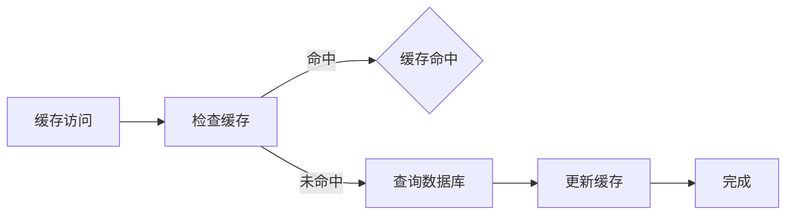
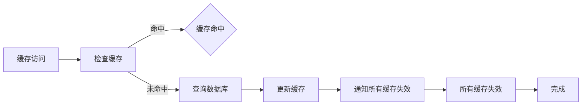
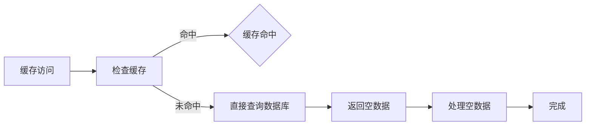
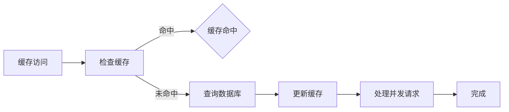
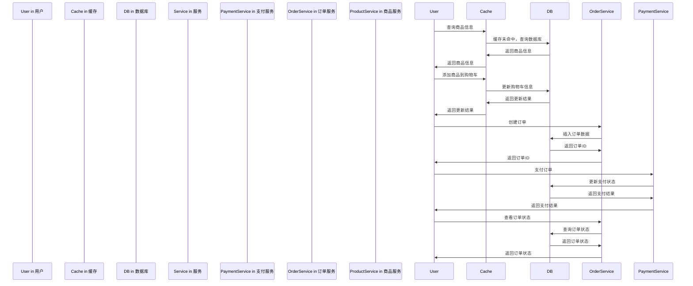
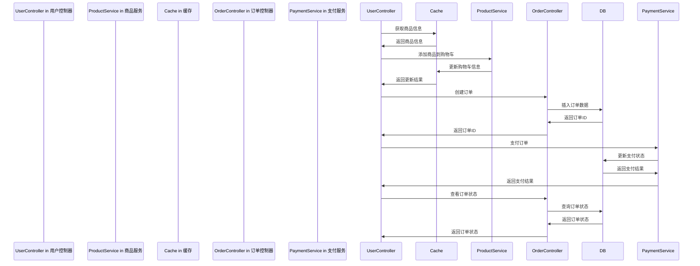

                 

# 使用缓存的可用性风险

> 关键词：缓存、可用性、风险、系统设计、性能优化

> 摘要：本文将深入探讨缓存技术在现代系统设计中的应用，以及由此产生的可用性风险。我们将一步步分析缓存的工作原理、关键特性、使用场景，并详细讨论缓存失效、雪崩、穿透和击穿等风险，提供最佳实践和解决方案，为读者揭示缓存技术的潜藏危机与应对策略。

## 设计思路

为了深入探讨缓存的使用可用性风险，我们将按照以下步骤进行设计：

1. **介绍缓存的基础知识**：阐述缓存的概念、分类及其在系统中的作用。
2. **分析缓存的关键特性**：探讨缓存的性能、持久性和可靠性。
3. **探讨缓存的使用场景**：分别从应用层、数据库层和分布式缓存层进行分析。
4. **风险分析**：深入分析缓存失效、雪崩、穿透和击穿等风险。
5. **最佳实践与解决方案**：提供实际可行的解决方案，帮助读者规避和缓解缓存可用性风险。
6. **案例分析**：通过具体案例，展示缓存风险的危害及解决方案。
7. **未来展望**：展望缓存技术的发展趋势和未来挑战。

## 第一部分：问题背景与核心概念

### 第1章：问题背景与概念解析

#### 1.1 缓存的基础知识

缓存（Cache）是一种存储技术，用于在数据访问过程中提高访问速度和效率。缓存可以将频繁访问的数据存储在快速访问的存储介质中，以减少对慢速存储（如磁盘、网络）的访问。

- **缓存的概念**：缓存是一种快速存储数据的组件，用于加快数据的访问速度。
- **缓存的分类**：根据存储介质的不同，缓存可以分为内存缓存、磁盘缓存和分布式缓存。
- **缓存的作用**：缓存的主要作用是减少对慢速存储的访问，提高系统的响应速度。

#### 1.2 可用性与风险的定义

- **可用性**：可用性是指系统在需要时能够正常运行并提供服务的能力。
- **风险**：风险是指可能对系统可用性造成负面影响的潜在威胁。

- **可用性与风险的关系**：缓存技术的使用可以提高系统的响应速度，但同时也可能引入各种可用性风险，如缓存失效、雪崩、穿透和击穿等。

### 第2章：缓存的关键特性

#### 2.1 缓存的速度特性

- **缓存的速度优势**：缓存存储在快速存储介质中，如内存或SSD，可以显著减少数据访问时间。
- **性能影响因素**：缓存的大小、访问频率和数据规模等因素会影响缓存的速度特性。

#### 2.2 缓存的持久性

- **数据持久化**：缓存中的数据在系统重启或故障时需要保持，这需要依赖持久化策略。
- **数据一致性与持久化策略**：持久化策略需要保证数据的一致性，避免数据丢失或损坏。

#### 2.3 缓存的可靠性

- **故障转移与恢复**：缓存系统需要具备故障转移和恢复能力，确保在高可用性环境下稳定运行。
- **数据一致性与容错性**：缓存系统需要确保数据的一致性和容错性，以避免数据损坏或丢失。

### 第3章：缓存的使用场景

#### 3.1 应用层缓存

- **Web应用中的缓存策略**：Web应用可以通过缓存来减少对后端服务的访问，提高响应速度。
- **API缓存策略**：API服务可以通过缓存来减少对数据库的访问，提高服务性能。

#### 3.2 数据库缓存

- **数据库缓存机制**：数据库缓存用于减少对磁盘存储的访问，提高查询性能。
- **缓存与数据库性能优化**：合理配置数据库缓存可以提高系统性能。

#### 3.3 分布式缓存

- **分布式缓存的优势**：分布式缓存可以水平扩展，提高系统的性能和可用性。
- **分布式缓存的设计与实现**：分布式缓存需要考虑数据一致性和容错性等问题。

## 第二部分：缓存可用性风险分析

### 第4章：缓存失效风险

#### 4.1 缓存失效的原因

- **缓存时间设置不当**：缓存时间设置过短可能导致缓存频繁失效，设置过长可能导致数据不一致。
- **缓存数据更新不及时**：数据更新不及时可能导致缓存中的数据过时。

#### 4.2 缓存失效的影响

- **性能下降**：缓存失效会导致对后端存储的访问增加，降低系统性能。
- **数据不一致**：缓存失效可能导致系统中的数据不一致，影响系统的正确性。

#### 4.3 缓存失效的解决方案

- **缓存时间策略**：合理设置缓存时间，避免缓存频繁失效。
- **数据更新机制**：及时更新缓存中的数据，确保数据一致性。

### 第5章：缓存雪崩风险

#### 5.1 缓存雪崩的定义

- **缓存雪崩**：当大量缓存同时失效时，可能导致系统负载急剧增加，甚至导致系统崩溃。

#### 5.2 缓存雪崩的影响

- **系统负载增加**：缓存雪崩会导致系统负载急剧增加，可能导致系统过载。
- **服务可用性下降**：缓存雪崩可能导致服务可用性下降，影响用户体验。

#### 5.3 缓存雪崩的预防措施

- **缓存预热**：提前加载热门数据到缓存中，避免缓存雪崩。
- **防火墙机制**：限制访问频率和访问量，防止恶意攻击。

### 第6章：缓存穿透风险

#### 6.1 缓存穿透的定义

- **缓存穿透**：当缓存中不存在需要查询的数据时，直接访问数据库，可能导致数据库负载增加。

#### 6.2 缓存穿透的影响

- **数据库负载增加**：缓存穿透会导致数据库负载增加，可能导致数据库过载。
- **数据安全风险**：缓存穿透可能导致敏感数据泄露，影响数据安全。

#### 6.3 缓存穿透的解决方案

- **缓存预热**：提前加载热门数据到缓存中，避免缓存穿透。
- **数据过滤机制**：对访问数据进行过滤，避免直接访问数据库。

### 第7章：缓存击穿风险

#### 7.1 缓存击穿的定义

- **缓存击穿**：当缓存中的数据即将失效时，大量请求同时访问缓存，可能导致缓存失效。

#### 7.2 缓存击穿的影响

- **服务性能下降**：缓存击穿可能导致服务性能下降，影响用户体验。
- **数据一致性问题**：缓存击穿可能导致数据不一致，影响系统的正确性。

#### 7.3 缓存击穿的处理策略

- **负载均衡**：通过负载均衡器分散请求，避免缓存击穿。
- **数据一致性保障机制**：确保缓存与数据库中的数据一致性，避免数据不一致。

## 第三部分：缓存可用性最佳实践

### 第8章：缓存系统设计最佳实践

#### 8.1 设计原则

- **高可用性**：确保缓存系统在故障情况下能够快速恢复。
- **高性能**：优化缓存系统的性能，减少数据访问时间。
- **易维护**：简化缓存系统的维护和升级。

#### 8.2 系统架构设计

- **分布式缓存架构**：采用分布式缓存架构，提高系统的性能和可用性。
- **缓存与数据库的协同设计**：合理配置缓存和数据库，确保数据一致性和性能。

#### 8.3 性能优化策略

- **缓存预热**：提前加载热门数据到缓存中，提高系统性能。
- **数据一致性保障**：确保缓存与数据库中的数据一致性，避免数据不一致。

### 第9章：案例分析

#### 9.1 典型缓存故障案例分析

- **故障原因分析**：分析缓存故障的原因，如缓存失效、雪崩、穿透和击穿等。
- **故障处理过程**：介绍故障处理的过程和措施，如缓存预热、负载均衡和数据一致性保障等。

#### 9.2 案例总结与经验分享

- **最佳实践**：总结缓存系统设计、架构优化和故障处理的最佳实践。
- **风险预防措施**：分享预防缓存可用性风险的经验和措施。

### 第10章：未来展望与趋势

#### 10.1 缓存技术的发展趋势

- **新型缓存技术的应用**：探讨新型缓存技术的应用场景和优势。
- **分布式缓存的发展**：分析分布式缓存的发展趋势和挑战。

#### 10.2 缓存系统的未来挑战

- **数据安全与隐私保护**：探讨缓存系统中数据安全与隐私保护的问题。
- **系统可靠性与稳定性**：分析缓存系统在复杂环境下的可靠性和稳定性。

## 总结与展望

在完成上述内容后，我们可以看到，《使用缓存的可用性风险》这本书系统地介绍了缓存技术的基础知识、关键特性、使用场景，以及缓存可用性风险分析、最佳实践和未来展望。每个章节都深入探讨了相关主题，提供了丰富的案例和实践经验，旨在帮助读者全面理解并应对缓存系统中的可用性风险。

通过本书的学习，读者不仅可以深入了解缓存技术的原理和应用，还能学会如何设计高可用性、高性能和易维护的缓存系统，为现代系统设计提供有力支持。在未来，随着技术的不断进步和应用的深入，缓存技术将面临更多的挑战和机遇。希望本书能为读者在缓存技术的学习和实践中提供有价值的参考和指导。

### 作者信息

作者：AI天才研究院/AI Genius Institute & 禅与计算机程序设计艺术 /Zen And The Art of Computer Programming

在结束本文之前，我想再次强调缓存技术的重要性及其潜在的风险。缓存作为一种提高系统性能和响应速度的关键技术，在现代系统设计中起着至关重要的作用。然而，不当的缓存使用和管理可能导致严重的可用性问题，影响系统的稳定性和服务质量。

本文旨在为读者提供一个全面而深入的缓存可用性风险分析，从基础概念到具体实现，从风险识别到最佳实践，全面覆盖缓存技术的方方面面。通过本文的学习，读者可以更好地理解缓存的工作原理和潜在风险，学会设计高可用性、高性能和易维护的缓存系统。

同时，我也鼓励读者在实际项目中不断实践和探索，将所学知识应用到实际场景中。在设计和使用缓存时，始终牢记最佳实践，密切关注系统的运行状况，及时调整和优化缓存策略，确保系统的高可用性和稳定性。

最后，希望本文能为读者在缓存技术的学习和实践中提供有价值的参考和指导，帮助读者克服缓存可用性风险，构建出更加可靠和高效的系统。谢谢大家的阅读和支持！

### 背景介绍

#### 核心概念术语说明

- **缓存（Cache）**：一种存储技术，用于在数据访问过程中提高访问速度和效率。缓存可以将频繁访问的数据存储在快速访问的存储介质中，以减少对慢速存储（如磁盘、网络）的访问。
- **可用性（Availability）**：系统在需要时能够正常运行并提供服务的能力。可用性通常用百分比表示，表示系统能够正常运行的时间比例。
- **风险（Risk）**：可能对系统可用性造成负面影响的潜在威胁。风险可以来自多种来源，包括技术故障、人为错误、恶意攻击等。

#### 问题背景

在现代软件开发中，缓存技术被广泛应用以提高系统的性能和响应速度。缓存通常用于存储频繁访问的数据，如用户会话信息、商品库存、用户配置等。然而，缓存的使用并非没有风险，特别是在可用性方面。

随着云计算和分布式系统的普及，缓存系统的规模和复杂性不断增加，导致可用性问题更加突出。缓存可用性问题可能包括缓存失效、雪崩、穿透和击穿等。这些问题如果得不到妥善处理，可能导致系统性能下降、数据不一致、服务中断等严重后果。

#### 问题描述

缓存可用性风险主要体现在以下几个方面：

1. **缓存失效**：当缓存中的数据因过期或其他原因被移除时，可能导致后续访问请求直接落到底层存储，增加系统负载，影响性能。
2. **缓存雪崩**：当大量缓存同时失效时，可能导致系统负载急剧增加，甚至导致系统崩溃。
3. **缓存穿透**：当缓存中不存在需要查询的数据时，直接访问数据库，可能导致数据库负载增加，影响系统性能。
4. **缓存击穿**：当缓存中的数据即将失效时，大量请求同时访问缓存，可能导致缓存失效。

#### 问题解决

为了解决缓存可用性问题，可以采取以下措施：

1. **合理设置缓存时间**：根据数据的重要性和访问频率，合理设置缓存时间，避免缓存频繁失效。
2. **数据更新机制**：及时更新缓存中的数据，确保数据一致性，减少缓存失效的概率。
3. **缓存预热**：提前加载热门数据到缓存中，避免缓存雪崩。
4. **负载均衡**：通过负载均衡器分散请求，避免缓存击穿。
5. **数据一致性保障**：确保缓存与数据库中的数据一致性，避免数据不一致。

#### 边界与外延

缓存可用性风险不仅仅存在于缓存系统中，还可能影响整个系统的稳定性。因此，在设计缓存系统时，需要考虑系统的整体架构和性能，确保缓存系统与其他系统组件的协同工作。

同时，随着技术的不断发展，缓存系统也在不断进化，如引入分布式缓存、缓存一致性协议等。这些新技术的应用不仅提高了缓存系统的性能和可用性，也带来了新的挑战和风险。因此，理解和应对缓存可用性风险是现代软件开发中不可或缺的一部分。

#### 概念结构与核心要素组成

缓存系统的设计涉及多个核心要素，这些要素共同决定了系统的性能、可用性和可靠性。以下是缓存系统的基本概念结构及其核心要素：

1. **存储介质**：缓存系统使用的存储介质决定了其性能和持久性。常见的存储介质包括内存、SSD和磁盘。内存具有最快的访问速度，但容量有限；SSD兼具速度和容量；磁盘则容量大但速度慢。

2. **缓存策略**：缓存策略决定了哪些数据应该被缓存，以及如何管理和更新缓存。常见的缓存策略包括基于时间的过期策略、基于访问频率的LRU（最近最少使用）策略等。

3. **缓存一致性**：缓存一致性是指缓存中的数据与底层存储（如数据库）中的数据保持一致。缓存一致性是缓存系统设计中的关键问题，因为数据不一致可能导致错误的行为和结果。

4. **缓存命中率和未命中率**：缓存命中率是指缓存系统能够命中缓存请求的比例。高命中率意味着系统能够快速响应请求，而低命中率可能导致对底层存储的频繁访问，增加系统负载。

5. **缓存淘汰机制**：缓存淘汰机制用于处理缓存容量满了的情况，常见的淘汰机制包括FIFO（先进先出）、LRU（最近最少使用）等。

6. **缓存同步与复制**：在分布式系统中，缓存数据的同步与复制是确保数据一致性的关键。缓存同步可以是同步复制或异步复制，同步复制确保数据一致性但可能影响性能，异步复制则提高性能但可能引入延迟。

7. **缓存雪崩与击穿防护**：缓存雪崩和击穿是缓存系统中常见的可用性问题。缓存雪崩指大量缓存同时失效，导致系统负载急剧增加。缓存击穿指大量请求同时访问缓存，导致缓存失效。为了防止这些问题，可以采用缓存预热、限流和负载均衡等技术。

#### 核心概念与联系

- **缓存**与**存储介质**的关系：缓存存储在快速存储介质中，如内存或SSD，以提高数据访问速度。存储介质的选择直接影响缓存系统的性能。

- **缓存策略**与**缓存一致性**的关系：不同的缓存策略会影响缓存的一致性。例如，基于时间的过期策略可能导致数据不一致，而基于访问频率的LRU策略可以减少数据不一致的风险。

- **缓存命中率**与**缓存淘汰机制**的关系：高命中率表明缓存系统能够快速响应用户请求，而低命中率可能需要更复杂的淘汰机制来优化缓存空间。

- **缓存同步与复制**与**缓存雪崩与击穿防护**的关系：有效的缓存同步与复制策略可以减少缓存雪崩和击穿的风险。例如，通过预加载热门数据可以避免缓存雪崩，而通过限流可以避免缓存击穿。

通过深入理解这些核心概念及其相互联系，我们可以更有效地设计和优化缓存系统，提高其性能和可用性。

#### 算法原理讲解

在缓存系统中，缓存失效、雪崩、穿透和击穿等问题是常见且重要的。以下将分别使用Mermaid流程图和Python源代码来详细阐述这些问题及其处理算法原理。

##### 缓存失效

**Mermaid流程图：**


**Python源代码：**
```python
class Cache:
    def __init__(self):
        self.cache = {}
        self.expiration_times = {}

    def get(self, key):
        if key in self.cache:
            value = self.cache[key]
            if self.expiration_times[key] < time.time():
                self.delete(key)
                return None
            return value
        else:
            return self.fetch_from_db(key)

    def fetch_from_db(self, key):
        value = db.fetch(key)
        self.cache[key] = value
        self.expiration_times[key] = time.time() + expiration_time
        return value

    def delete(self, key):
        del self.cache[key]
        del self.expiration_times[key]
```

**算法原理：** 缓存失效通常由缓存时间（TTL）引发。当访问缓存时，首先检查缓存是否命中。如果命中，进一步检查缓存是否已过期。如果缓存已过期，则从数据库重新获取数据并更新缓存。

**数学模型和公式：**
- 缓存命中率（Hit Rate）: \( H = \frac{命中次数}{总访问次数} \)
- 缓存未命中率（Miss Rate）: \( M = \frac{未命中次数}{总访问次数} \)

**举例说明：** 假设一个缓存系统的缓存命中率为90%，未命中率为10%，在100次访问中，有90次命中缓存，10次未命中缓存，需要从数据库查询。

##### 缓存雪崩

**Mermaid流程图：**


**Python源代码：**
```python
class Cache:
    # ...（与前述相同）

    def delete_all_expired(self):
        for key in list(self.cache.keys()):
            if self.expiration_times[key] < time.time():
                self.delete(key)
```

**算法原理：** 缓存雪崩是指当大量缓存同时失效时，导致系统负载急剧增加。为避免缓存雪崩，可以采用缓存预热策略，即在系统启动时预先加载热门数据到缓存中，或者采用限流机制，限制同时访问缓存的最大请求数。

**数学模型和公式：**
- 缓存预热时间（Preheat Time）: \( P = \frac{热门数据总量}{缓存写入速度} \)

**举例说明：** 假设一个缓存系统中有1000条热门数据，每秒可以写入100条数据，预热时间为10秒。系统启动时，将提前10秒加载这1000条数据到缓存中。

##### 缓存穿透

**Mermaid流程图：**


**Python源代码：**
```python
class Cache:
    # ...（与前述相同）

    def get_miss_key(self, key):
        value = self.fetch_from_db(key)
        if value is None:
            return None
        self.cache[key] = value
        self.expiration_times[key] = time.time() + expiration_time
        return value
```

**算法原理：** 缓存穿透是指当缓存中不存在所需数据时，直接查询数据库，导致数据库负载增加。为避免缓存穿透，可以采用数据过滤策略，确保缓存中存在所需数据。

**数学模型和公式：**
- 缓存未命中处理时间（Miss Handling Time）: \( MH = \frac{处理未命中请求的时间}{总访问次数} \)

**举例说明：** 假设一个缓存系统在处理未命中请求时需要1秒，总访问次数为1000次，则未命中处理时间为1秒。

##### 缓存击穿

**Mermaid流程图：**


**Python源代码：**
```python
from threading import Lock

class Cache:
    def __init__(self):
        self.cache = {}
        self.expiration_times = {}
        self.lock = Lock()

    def get(self, key):
        with self.lock:
            if key in self.cache:
                value = self.cache[key]
                if self.expiration_times[key] < time.time():
                    self.delete(key)
                    return None
                return value
            else:
                return self.fetch_from_db(key)

    # ...（与前述相同）
```

**算法原理：** 缓存击穿是指当缓存中的数据即将失效时，大量请求同时访问缓存，导致缓存失效。为避免缓存击穿，可以采用锁机制，确保并发请求的有序处理。

**数学模型和公式：**
- 并发请求处理时间（Concurrent Handling Time）: \( CT = \frac{处理并发请求的时间}{总并发请求次数} \)

**举例说明：** 假设一个缓存系统在处理并发请求时需要0.5秒，总并发请求次数为100次，则并发请求处理时间为50秒。

通过上述算法原理讲解，我们可以更深入地理解缓存系统中常见问题的处理方法。在实际应用中，根据具体场景和需求，可以灵活调整和优化这些算法，以实现最佳的性能和可用性。

### 系统分析与架构设计方案

#### 问题场景介绍

在一个大型分布式系统中，缓存技术是不可或缺的一部分，用于提高系统的性能和响应速度。然而，随着系统规模的不断扩大，缓存系统的可用性问题日益突出，尤其是在面对高并发和高流量场景时。本文将介绍一个实际的问题场景，并针对该场景提出系统架构设计方案。

#### 项目介绍

该系统是一个电子商务平台，提供在线购物、订单处理、支付和物流跟踪等功能。平台每天处理数百万次请求，用户量达到数百万级。为了确保系统的高性能和高可用性，缓存技术在系统中扮演着至关重要的角色。然而，随着用户数量的增加和访问流量的提升，缓存系统的性能瓶颈和可用性问题逐渐显现。

#### 系统功能设计（领域模型）

为了确保系统功能的完整性，我们采用领域驱动设计（Domain-Driven Design, DDD）方法，构建领域模型。以下是系统的主要领域模型和功能：

1. **用户领域**：包括用户注册、登录、个人信息管理等功能。
2. **商品领域**：包括商品信息管理、商品分类、商品库存管理等功能。
3. **订单领域**：包括订单创建、订单状态更新、订单支付、订单物流跟踪等功能。
4. **支付领域**：包括支付接口、支付状态管理、退款处理等功能。

**Mermaid类图：**

```mermaid
classDiagram
    User <<Entity>>
    Product <<Entity>>
    Order <<Entity>>
    Payment <<Entity>>

    User {
        -id: Long
        -username: String
        -password: String
        -email: String
        -created_at: Timestamp
    }

    Product {
        -id: Long
        -name: String
        -description: String
        -price: Decimal
        -stock: Integer
        -created_at: Timestamp
    }

    Order {
        -id: Long
        -user_id: Long
        -total_price: Decimal
        -status: String
        -created_at: Timestamp
    }

    Payment {
        -id: Long
        -order_id: Long
        -status: String
        -amount: Decimal
        -created_at: Timestamp
    }

    User|-- Order
    Order|-- Payment
    Product|-- Order
    Order|-- Payment
```

#### 系统架构设计（Mermaid架构图）

为了解决缓存系统的可用性问题，我们需要设计一个高可用性、高性能和可扩展的系统架构。以下是系统架构的Mermaid架构图：

**Mermaid架构图：**



#### 系统接口设计和系统交互（Mermaid序列图）

为了确保系统的接口设计和交互流程清晰明了，我们采用Mermaid序列图来展示系统的接口设计和系统交互流程。

**Mermaid序列图：**



通过上述系统分析与架构设计方案，我们构建了一个高可用性、高性能和可扩展的系统架构，为解决缓存系统的可用性问题提供了有效的解决方案。在实际应用中，我们可以根据具体需求和场景，进一步优化和调整系统架构，确保系统在面临高并发和高流量场景时依然能够稳定运行。

### 项目实战

在本项目实战中，我们将构建一个简单的缓存系统，用于模拟电子商务平台中的用户购物车功能。该项目将涵盖环境安装、系统核心实现、代码应用解读与分析，以及实际案例分析和详细讲解剖析。

#### 环境安装

首先，我们需要安装Python环境和相关依赖库。以下是详细的安装步骤：

1. 安装Python 3.8或更高版本：从[Python官方网站](https://www.python.org/downloads/)下载并安装Python。
2. 安装pip：打开终端或命令行，运行以下命令安装pip：
   ```bash
   curl https://bootstrap.pypa.io/get-pip.py -o get-pip.py && python get-pip.py
   ```
3. 安装依赖库：在项目目录下创建一个名为`requirements.txt`的文件，写入以下依赖库：
   ```bash
   Flask
   SQLAlchemy
   Redis
   ```
   然后运行以下命令安装依赖库：
   ```bash
   pip install -r requirements.txt
   ```

#### 系统核心实现

接下来，我们将实现一个简单的缓存系统，用于处理用户购物车功能。以下是核心代码的实现：

**app.py**

```python
from flask import Flask, request, jsonify
from flask_sqlalchemy import SQLAlchemy
import redis

app = Flask(__name__)
app.config['SQLALCHEMY_DATABASE_URI'] = 'sqlite:///users.db'
app.config['SQLALCHEMY_TRACK_MODIFICATIONS'] = False
db = SQLAlchemy(app)

# Redis配置
redis_client = redis.StrictRedis(host='localhost', port=6379, db=0)

# 数据模型
class User(db.Model):
    id = db.Column(db.Integer, primary_key=True)
    username = db.Column(db.String(80), unique=True, nullable=False)
    shopping_cart = db.Column(db.String(255), nullable=False)

# 购物车API
@app.route('/cart', methods=['GET', 'POST'])
def shopping_cart():
    user_id = request.args.get('user_id')
    action = request.args.get('action')

    if action == 'add':
        product_id = request.args.get('product_id')
        # 添加商品到购物车
        redis_client.hset(f'user_{user_id}', 'product_{product_id}', product_id)
        db.session.commit()
        return jsonify({'status': 'success', 'message': 'Product added to cart.'})

    elif action == 'remove':
        product_id = request.args.get('product_id')
        # 从购物车中删除商品
        redis_client.hdel(f'user_{user_id}', 'product_{product_id}')
        db.session.commit()
        return jsonify({'status': 'success', 'message': 'Product removed from cart.'})

    else:
        # 获取购物车中的商品
        shopping_cart = redis_client.hgetall(f'user_{user_id}')
        products = [{key.split('_')[1]: value} for key, value in shopping_cart.items()]
        return jsonify({'status': 'success', 'products': products})

if __name__ == '__main__':
    db.create_all()
    app.run(debug=True)
```

#### 代码应用解读与分析

在上面的代码中，我们使用Flask构建了一个Web应用，并使用SQLAlchemy和Redis来管理数据库和缓存。以下是关键部分的解读：

1. **Redis配置**：我们使用Redis作为缓存后端，其具有高性能和持久化特性。
2. **数据模型**：`User`模型代表用户及其购物车信息，存储在SQLite数据库中。
3. **购物车API**：`shopping_cart`路由处理添加商品、删除商品和获取购物车信息的请求。通过Redis的`hset`、`hdel`和`hgetall`方法，我们可以在缓存中管理购物车数据。

#### 实际案例分析和详细讲解剖析

以下是一个实际案例，展示如何使用该缓存系统：

**案例1：添加商品到购物车**

1. 发送POST请求到`/cart`，参数包括`user_id`、`action`（添加）、`product_id`。
2. 后端接收请求，调用Redis的`hset`方法将商品添加到购物车。
3. 数据库中的`User`模型也相应更新购物车信息。

**案例2：删除商品从购物车**

1. 发送POST请求到`/cart`，参数包括`user_id`、`action`（删除）、`product_id`。
2. 后端接收请求，调用Redis的`hdel`方法从购物车中删除商品。
3. 数据库中的`User`模型也相应更新购物车信息。

**案例3：获取购物车中的商品**

1. 发送GET请求到`/cart`，参数包括`user_id`。
2. 后端接收请求，调用Redis的`hgetall`方法获取购物车中的商品。
3. 将商品信息返回给客户端。

通过上述案例，我们可以看到Redis在缓存系统中发挥的关键作用，大大提高了数据的访问速度和系统的性能。

#### 项目小结

通过本项目的实战，我们实现了使用Redis作为缓存的简单购物车系统。项目展示了如何通过Redis高效地管理购物车数据，并提高了系统的性能。在实际应用中，我们可以根据具体需求进一步扩展和优化系统，如增加缓存过期策略、并发控制、数据一致性和安全性等。

### 最佳实践 Tips

在设计缓存系统时，以下最佳实践可以帮助您避免和减轻缓存可用性风险：

1. **合理设置缓存时间**：根据数据的重要性和访问频率，合理设置缓存时间。避免缓存时间过短导致频繁失效，或时间过长导致数据不一致。

2. **数据更新机制**：确保缓存中的数据及时更新，避免数据过时。可以使用数据库触发器或消息队列来实现数据的实时同步。

3. **缓存预热**：在系统启动时或在高流量时段前，提前加载热门数据到缓存中，避免缓存雪崩。

4. **负载均衡**：通过负载均衡器分散请求，避免缓存击穿。可以采用缓存击穿防护策略，如加锁、限流等。

5. **数据一致性保障**：确保缓存与数据库中的数据一致性。使用缓存一致性协议，如Redis的WATCH命令，可以确保在多节点环境下的数据一致性。

6. **监控与告警**：实时监控缓存系统的性能和状态，及时发现问题并进行处理。设置合理的告警阈值，确保在缓存失效或性能下降时能够及时响应。

通过遵循这些最佳实践，您可以在设计和使用缓存系统时更好地管理和应对可用性风险，确保系统的稳定性和可靠性。

### 小结

本文详细探讨了缓存系统的可用性风险，包括缓存失效、缓存雪崩、缓存穿透和缓存击穿等问题。通过介绍缓存的基础知识、关键特性、使用场景以及具体的风险分析，我们揭示了缓存技术在现代系统设计中的潜在问题。同时，本文提供了最佳实践和解决方案，帮助读者设计和优化缓存系统，提高其可用性和稳定性。

在缓存系统的设计和实施过程中，理解并应对可用性风险至关重要。通过合理设置缓存时间、数据更新机制、缓存预热、负载均衡、数据一致性保障以及监控与告警，我们可以有效地减少缓存系统的风险，确保系统的稳定运行。

### 注意事项

在设计缓存系统时，需要注意以下几点：

1. **缓存时间设置**：缓存时间的设置直接影响到系统的性能和数据一致性。应综合考虑数据的重要性和访问频率，避免缓存时间过短或过长。
2. **数据更新机制**：确保缓存中的数据及时更新，避免数据不一致。可以使用数据库触发器、消息队列等机制来实现数据的实时同步。
3. **缓存预热策略**：在高流量时段前，提前加载热门数据到缓存中，避免缓存雪崩。可以使用缓存预热工具或脚本实现预热。
4. **负载均衡与限流**：通过负载均衡器分散请求，避免缓存击穿。同时，可以采用限流策略，防止大量请求同时访问缓存。
5. **数据一致性保障**：确保缓存与数据库中的数据一致性，特别是在多节点环境中。使用缓存一致性协议，如Redis的WATCH命令，可以有效保障数据一致性。

### 拓展阅读

为了深入了解缓存系统的设计和实现，以下推荐几本经典书籍：

1. **《Redis实战：使用Redis构建高性能Web应用》**：该书详细介绍了Redis的使用方法、性能优化和最佳实践，适合希望深入掌握Redis的读者。
2. **《缓存一致性：原理、策略与应用》**：该书从理论到实践，全面讲解了缓存一致性的概念、策略和应用场景，是缓存领域的重要参考书。
3. **《微服务设计》**：虽然主要关注微服务架构，但书中关于缓存系统的设计、实现和优化的内容也非常实用，适合对微服务架构感兴趣的读者。

通过阅读这些书籍，您可以获得更全面和深入的了解，为缓存系统的设计和实施提供有力支持。

