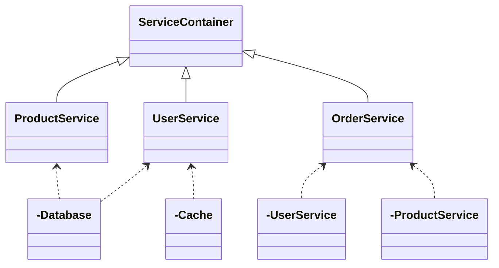
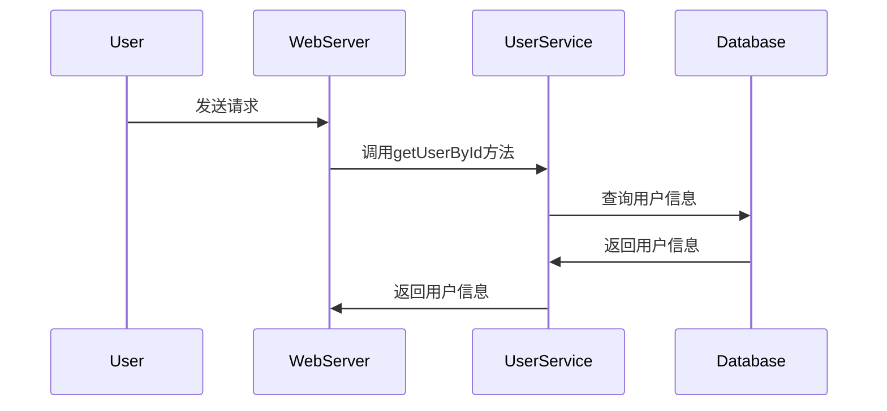
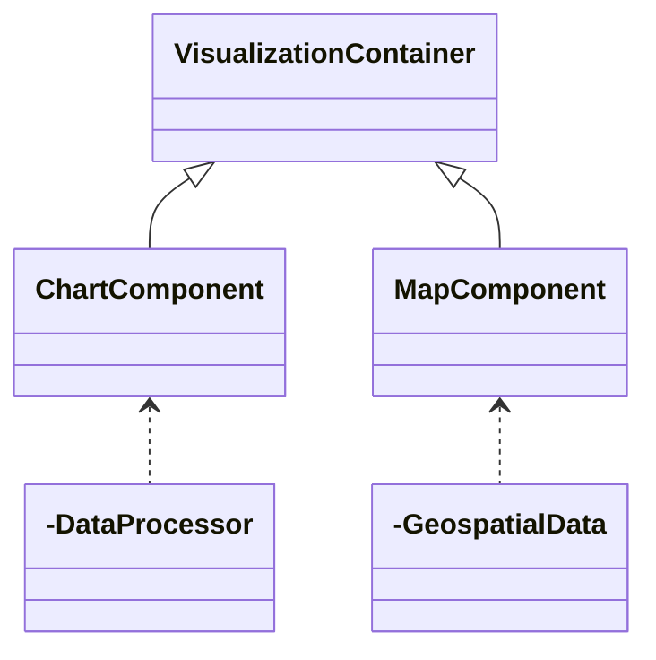
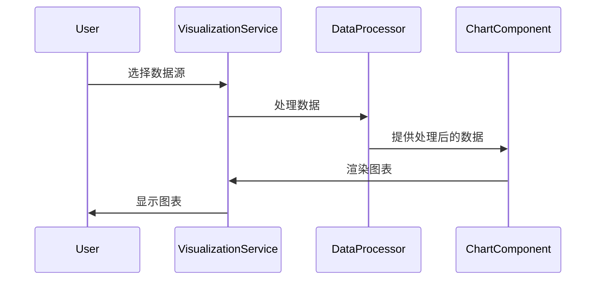
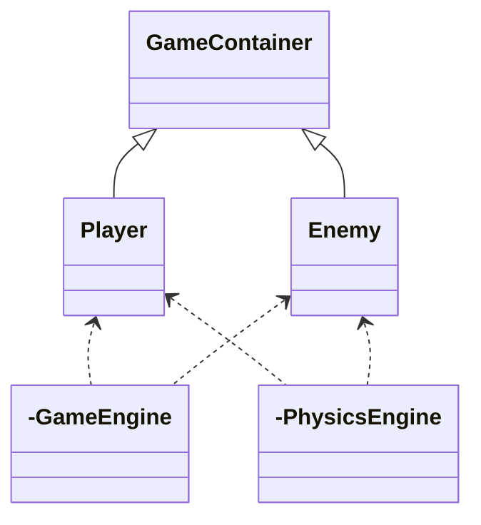
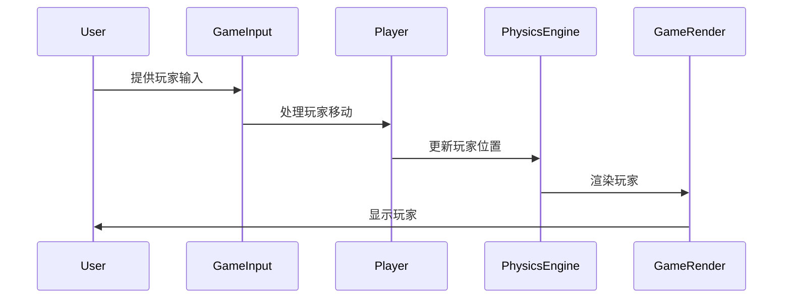

                 

### 引言

在软件开发领域，对象类型是一种重要的概念，它帮助我们更好地组织和管理代码中的数据和行为。然而，传统的对象类型往往存在一些局限性，特别是在处理复杂依赖关系时。为了解决这些问题，依赖对象类型（Dependency Object Type）应运而生。本文旨在探讨依赖对象类型的概念、实现和应用，并分析其在提高代码表达能力方面的优势。

#### 1.1 书籍目的

本书籍旨在深入探讨依赖对象类型的概念和应用，帮助读者理解其在软件开发中的重要性。通过本书籍的学习，读者将能够：

1. 理解依赖对象类型的基本概念和原理。
2. 掌握依赖对象类型的实现方法。
3. 掌握依赖对象类型在各类应用场景中的使用。
4. 分析依赖对象类型在实际项目中的应用案例。
5. 预测依赖对象类型的未来发展趋势。

#### 1.2 this类型的基本概念

在JavaScript等编程语言中，`this`关键字是一个非常重要的概念。它表示当前执行环境的上下文对象，通常与函数、对象和方法相关联。理解`this`类型对于编写灵活和可维护的代码至关重要。

在传统的对象类型中，`this`类型通常用于访问当前对象的方法和属性。然而，当对象之间存在复杂的依赖关系时，传统的`this`类型往往难以满足需求。依赖对象类型通过引入依赖关系，增强了`this`类型的表达能力，使得代码更加清晰和易于管理。

#### 1.3 为什么依赖对象类型重要

随着软件项目的复杂度不断增加，传统的对象类型逐渐暴露出其局限性。依赖对象类型的引入，为我们提供了一种更灵活和高效的方式来管理对象间的依赖关系。以下是依赖对象类型的重要性：

1. **明确依赖关系**：依赖对象类型允许我们明确地定义对象之间的依赖关系，使得代码更加清晰和易于理解。
2. **提高代码复用性**：通过依赖对象类型，我们可以将依赖关系封装在一个独立的对象中，从而提高代码的复用性。
3. **易于维护**：依赖对象类型使得代码更加模块化，易于维护和扩展。
4. **提高开发效率**：依赖对象类型使得开发者可以更加专注于业务逻辑的实现，减少冗余代码的编写。

#### 总结

在本章节中，我们介绍了书籍的目的、`this`类型的基本概念以及依赖对象类型的重要性。在接下来的章节中，我们将深入探讨依赖对象类型的实现和应用，帮助读者全面理解这一概念。通过本书籍的学习，读者将能够更好地应对复杂的软件开发挑战，提高代码质量和开发效率。

### this类型的基础

在深入探讨依赖对象类型之前，我们首先需要了解`this`类型的基础概念。`this`是JavaScript中的一个关键字，它在不同的执行环境中具有不同的值。理解`this`的工作原理对于理解依赖对象类型至关重要。

#### 2.1 this类型的基本用法

`this`关键字在函数中的值取决于函数的调用方式。以下是几种常见的`this`用法：

1. **函数表达式**：
    ```javascript
    function sayName() {
        console.log(this.name);
    }
    var person = {name: "John", sayName: sayName};
    person.sayName(); // 输出: "John"
    ```
    在这个例子中，`sayName`函数作为一个对象方法的调用，`this`指向`person`对象。

2. **函数声明**：
    ```javascript
    function sayName() {
        console.log(this.name);
    }
    sayName(); // 输出: undefined（在严格模式下）
    ```
    在这个例子中，`sayName`函数独立调用时，`this`指向全局对象，在浏览器中通常是`window`对象。

3. **构造函数**：
    ```javascript
    function Person(name) {
        this.name = name;
    }
    var person = new Person("John");
    person.sayName = sayName;
    person.sayName(); // 输出: "John"
    ```
    在构造函数中，`this`指向新创建的对象实例。

4. **箭头函数**：
    ```javascript
    var sayName = () => {
        console.log(this.name);
    };
    var person = {name: "John"};
    person.sayName = sayName;
    person.sayName(); // 输出: "John"
    ```
    箭头函数中的`this`在定义时绑定，不会随函数的调用而改变。

#### 2.2 this类型的变化性

`this`类型的变化性是JavaScript中的一个特点，也是其复杂性之一。以下是一些可能导致`this`值变化的场景：

1. **函数作为参数传递**：
    ```javascript
    function sayName() {
        console.log(this.name);
    }
    var person = {name: "John"};
    otherPerson = {name: "Alice"};
    person.sayName.bind(otherPerson)(); // 输出: "Alice"
    ```
    使用`Function.prototype.bind`可以改变函数的`this`指向。

2. **对象链**：
    ```javascript
    var person = {
        name: "John",
        sayName: function() {
            console.log(this.name);
        }
    };
    var otherPerson = {
        name: "Alice",
        sayName: person.sayName
    };
    otherPerson.sayName(); // 输出: "John"
    ```
    在这个例子中，`sayName`方法从`person`对象转移到`otherPerson`对象，但`this`仍然指向`person`。

3. **事件处理**：
    ```javascript
    document.getElementById("myButton").addEventListener("click", function() {
        console.log(this); // 输出: HTMLButtonElement对象
    });
    ```
    在事件处理函数中，`this`通常指向事件触发元素。

#### 2.3 this类型在函数中的表现

在函数中，`this`的表现受函数的上下文影响。以下是一些常见的函数上下文和`this`的行为：

1. **独立函数调用**：
    当函数独立调用时，如果处于严格模式，`this`的值为`undefined`；如果不处于严格模式，`this`的值为全局对象。

2. **对象方法调用**：
    当函数作为对象的方法调用时，`this`的值通常指向该对象。

3. **构造函数调用**：
    当函数作为构造函数调用时（使用`new`关键字），`this`的值指向新创建的对象。

4. **箭头函数**：
    箭头函数中的`this`在定义时绑定，不会在函数调用时改变。

理解`this`类型的基本用法和变化性对于编写可维护和可预测的代码至关重要。在依赖对象类型的实现和应用中，我们将会深入探讨如何利用`this`类型来提高代码的表达能力。

#### 依赖对象类型的概念

依赖对象类型是一种将对象之间的依赖关系明确化的方法，通过这种方式，我们可以更好地管理和维护代码。下面，我们将详细讨论依赖对象类型的基本概念，包括其定义、核心特点和优势。

#### 3.1.1 依赖对象类型的基本概念

依赖对象类型可以定义为一个二元组，包含属性集合和方法集合。形式化地表示为：

$$
\text{依赖对象类型} = (\text{属性集合}, \text{方法集合})
$$

这里的属性集合包括对象的所有可访问属性，而方法集合则包含对象的所有可调用方法。通过这种定义，我们可以将对象的结构和功能清晰地分离，使得依赖关系更加明显和易于管理。

#### 3.1.2 依赖对象类型的核心特点

依赖对象类型具有以下几个核心特点：

1. **明确的依赖关系**：依赖对象类型允许我们明确地定义对象之间的依赖关系，这使得代码的耦合度降低，依赖关系更加清晰。

2. **功能与数据的分离**：在依赖对象类型中，对象的功能通过方法集合实现，数据通过属性集合管理。这种分离使得代码的维护和扩展更加简单。

3. **灵活的依赖注入**：依赖对象类型支持依赖注入，我们可以通过构造函数、工厂函数等方式注入依赖，使得对象在创建时即可获得所需的依赖。

4. **动态性**：依赖对象类型支持动态地添加和修改属性和方法，使得对象可以在运行时根据需要进行调整。

#### 3.1.3 依赖对象类型的优势

依赖对象类型具有以下优势：

1. **代码的可读性和可维护性**：通过明确地定义依赖关系，代码的可读性得到显著提高，同时维护和扩展代码变得更加容易。

2. **提高代码的复用性**：依赖对象类型使得我们可以将依赖关系封装在一个独立的对象中，从而提高代码的复用性。

3. **减少冗余代码**：通过依赖注入，我们可以减少冗余的代码，使得代码更加简洁和高效。

4. **增强测试性**：依赖对象类型使得测试变得更加简单，因为我们可以独立测试依赖对象，而不需要依赖具体的实现细节。

#### 3.1.4 依赖对象类型与传统对象类型的对比

依赖对象类型与传统对象类型存在一些显著的区别：

1. **依赖关系的明确性**：传统对象类型往往隐含依赖关系，而依赖对象类型则通过显式定义依赖关系，使得代码更加清晰。

2. **功能与数据的分离**：传统对象类型通常将功能与数据混合在一起，而依赖对象类型通过分离功能与数据，提高了代码的可维护性。

3. **灵活性**：依赖对象类型支持动态添加和修改依赖，而传统对象类型往往在编译时确定。

4. **依赖注入**：依赖对象类型支持依赖注入，使得代码更加模块化和可复用。

通过以上对比，我们可以看到依赖对象类型在多个方面都优于传统对象类型，尤其是在处理复杂依赖关系时。

#### 3.1.5 总结

在本章节中，我们介绍了依赖对象类型的基本概念、核心特点和优势，并与传统对象类型进行了对比。依赖对象类型通过明确化依赖关系和分离功能与数据，为代码管理提供了一种更灵活和高效的方式。在接下来的章节中，我们将探讨依赖对象类型的实现方法和应用场景，帮助读者更深入地理解这一概念。

### 依赖对象类型的实现

在理解了依赖对象类型的基本概念之后，我们需要探讨如何实现依赖对象类型。依赖对象类型的实现有多种方法，包括使用闭包、代理和模块等。在本章节中，我们将详细介绍这些实现方法，并通过具体示例帮助读者理解。

#### 4.1 使用闭包实现依赖对象类型

闭包是一种强大的编程技巧，它允许函数访问并记住其创建时的环境状态。在依赖对象类型的实现中，闭包可以用来保持`this`的稳定性，从而实现依赖对象类型。

#### 4.1.1 闭包的原理

闭包是一个函数和其环境状态组合在一起的实体。当我们调用一个函数时，如果该函数访问了外部作用域的变量，则该函数及其环境状态形成一个闭包。

在JavaScript中，闭包的一个典型例子是内部函数访问外部函数的变量：

```javascript
function outer() {
    var outerVar = 'I am from outer function';
    function inner() {
        console.log(outerVar);
    }
    return inner;
}

var closure = outer();
closure(); // 输出: "I am from outer function"
```

在这个例子中，`inner`函数形成了一个闭包，它能够访问并使用外部函数`outer`中的变量`outerVar`。

#### 4.1.2 使用闭包实现依赖对象类型的示例

我们可以利用闭包来保持`this`的稳定性，从而实现依赖对象类型。以下是一个简单的示例：

```python
class DependencyObject:
    def __init__(self):
        self._properties = {}

    def set_property(self, name, value):
        self._properties[name] = value

    def get_property(self, name):
        return self._properties.get(name)

def createDependencyObject():
    obj = DependencyObject()
    obj.set_property('name', 'John')
    return obj

# 使用示例
person = createDependencyObject()
print(person.get_property('name'))  # 输出: John
```

在这个例子中，`createDependencyObject`函数利用闭包来保持`this`的稳定性。每次调用`createDependencyObject`时，都会创建一个新的依赖对象实例，其`this`始终指向该实例。

#### 4.1.3 闭包实现依赖对象类型的优点

1. **稳定性**：闭包可以保持`this`的稳定性，使得依赖对象类型的实现更加简单和直观。
2. **灵活性**：闭包允许我们在运行时动态地修改依赖对象的行为，提高了代码的灵活性。
3. **可维护性**：闭包使得依赖对象的实现更加模块化，易于维护和扩展。

#### 4.2 使用代理实现依赖对象类型

代理是一种设计模式，它为其他对象提供了一种代理，以控制对它的访问。在依赖对象类型的实现中，代理可以用来封装依赖关系，并提供额外的控制逻辑。

#### 4.2.1 代理的原理

代理（Proxy）是一种特殊的对象，它代理对一个目标对象（Target Object）的所有操作。通过代理，我们可以拦截和自定义对目标对象的访问。

在JavaScript中，我们可以使用`Proxy`对象来实现代理：

```javascript
function createProxy(target) {
    return new Proxy(target, {
        get: function(target, prop) {
            console.log(`Accessing property: ${prop}`);
            return target[prop];
        },
        set: function(target, prop, value) {
            console.log(`Setting property: ${prop} to ${value}`);
            return target[prop] = value;
        }
    });
}

var target = { name: 'John' };
var proxy = createProxy(target);

proxy.name = 'Alice'; // 输出: "Setting property: name to Alice"
console.log(proxy.name); // 输出: "Accessing property: name" 然后是 "Alice"
```

在这个例子中，代理对象`proxy`拦截了对目标对象`target`的所有属性访问和修改，并提供了自定义的逻辑。

#### 4.2.2 使用代理实现依赖对象类型的示例

我们可以利用代理来封装依赖对象类型，并提供额外的控制逻辑：

```python
class DependencyObject:
    def __init__(self):
        self._properties = {}

    def set_property(self, name, value):
        self._properties[name] = value

    def get_property(self, name):
        return self._properties.get(name)

def createDependencyObject():
    obj = DependencyObject()
    proxy = create_proxy(obj)
    return proxy

def create_proxy(target):
    return type('Proxy', (object,), {
        __slots__: ('_target',),
        __init__: lambda self, target: setattr(self, '_target', target),
        __getattribute__: lambda self, name: getattr(self._target, name),
        __setattr__: lambda self, name, value: setattr(self._target, name, value),
    })(obj)

# 使用示例
person = createDependencyObject()
person.set_property('name', 'John')
print(person.get_property('name'))  # 输出: John
```

在这个例子中，我们使用代理来封装依赖对象，并提供了自定义的`__getattribute__`和`__setattr__`方法来控制对属性访问和修改。

#### 4.2.3 代理实现依赖对象类型的优点

1. **灵活性**：代理允许我们灵活地控制对目标对象的访问，提供额外的逻辑。
2. **安全性**：代理可以提供安全检查和限制，防止不合法的访问和修改。
3. **易于扩展**：代理模式使得依赖对象的实现更加模块化，易于扩展。

#### 4.3 使用模块实现依赖对象类型

模块是一种组织代码的机制，它允许我们将代码划分为独立的模块，每个模块可以定义自己的属性和方法。在依赖对象类型的实现中，模块可以用来封装依赖关系，并提供清晰的接口。

#### 4.3.1 模块的原理

模块是一种将代码组织成独立单元的机制。在Python中，模块通过`.py`文件实现，每个模块可以定义自己的函数、类和变量。通过导入模块，我们可以复用代码并保持代码的独立性。

```python
# dependency_object.py
class DependencyObject:
    def __init__(self):
        self._properties = {}

    def set_property(self, name, value):
        self._properties[name] = value

    def get_property(self, name):
        return self._properties.get(name)

# 使用示例
from dependency_object import DependencyObject

person = DependencyObject()
person.set_property('name', 'John')
print(person.get_property('name'))  # 输出: John
```

在这个例子中，我们定义了一个名为`DependencyObject`的模块，并在另一个模块中导入和使用它。

#### 4.3.2 使用模块实现依赖对象类型的示例

我们可以使用模块来封装依赖对象类型，并提供清晰的接口：

```python
# dependency_manager.py
class DependencyManager:
    def __init__(self):
        self._dependencies = {}

    def register_dependency(self, name, dependency):
        self._dependencies[name] = dependency

    def get_dependency(self, name):
        return self._dependencies.get(name)

# 使用示例
from dependency_object import DependencyObject
from dependency_manager import DependencyManager

person_dependency = DependencyObject()
manager = DependencyManager()
manager.register_dependency('person', person_dependency)

person = manager.get_dependency('person')
person.set_property('name', 'John')
print(person.get_property('name'))  # 输出: John
```

在这个例子中，我们使用`DependencyManager`模块来管理依赖对象，并提供了一个注册和获取依赖对象的接口。

#### 4.3.3 模块实现依赖对象类型的优点

1. **独立性**：模块使得代码更加独立，每个模块都可以独立开发和测试。
2. **可复用性**：模块使得我们可以复用代码，减少冗余和重复编写。
3. **扩展性**：模块使得代码更加灵活和可扩展，易于添加新的依赖对象。

#### 总结

在本章节中，我们探讨了依赖对象类型的多种实现方法，包括闭包、代理和模块。每种方法都有其独特的优点和适用场景。闭包提供了稳定性和灵活性，代理提供了控制和安全，而模块提供了独立性和可复用性。通过选择合适的方法，我们可以根据具体需求实现依赖对象类型，提高代码的可读性和可维护性。

### 依赖对象类型的应用

依赖对象类型不仅在概念和实现上具有优势，而且在实际应用中同样表现出强大的能力。在本章节中，我们将深入探讨依赖对象类型在不同应用场景中的具体使用，包括在类中、异步编程和函数式编程中的使用。

#### 5.1 在类中的使用

依赖对象类型在类中的应用非常广泛，它可以帮助我们更好地组织和管理类的依赖关系。通过依赖对象类型，我们可以将类的依赖关系明确地定义出来，从而简化类的实现，提高代码的可维护性。

以下是一个简单的例子，展示如何在类中使用依赖对象类型：

```python
class UserService:
    def __init__(self, user_repo):
        self.user_repo = user_repo

    def get_user_by_id(self, user_id):
        return self.user_repo.get_user_by_id(user_id)

class UserRepository:
    def get_user_by_id(self, user_id):
        # 实现获取用户逻辑
        pass

# 使用依赖对象类型
user_repo = UserRepository()
user_service = UserService(user_repo)
user = user_service.get_user_by_id(1)
```

在这个例子中，`UserService`类依赖于`UserRepository`类。通过依赖对象类型，我们可以将依赖关系明确地定义在类的构造函数中，使得代码更加清晰和易于理解。

#### 5.2 在异步编程中的使用

异步编程在现代Web应用中变得越来越重要，它允许我们高效地处理并发请求。依赖对象类型在异步编程中也发挥了重要作用，它可以帮助我们更好地管理异步依赖关系。

以下是一个使用依赖对象类型的异步编程示例：

```javascript
class UserService {
    constructor(userRepo) {
        this.userRepo = userRepo;
    }

    async getUserById(userId) {
        return this.userRepo.getUserById(userId);
    }
}

class UserRepository {
    async getUserById(userId) {
        // 实现异步获取用户逻辑
        return { id: userId, name: "John" };
    }
}

// 使用依赖对象类型和异步编程
const userRepo = new UserRepository();
const userService = new UserService(userRepo);
const user = await userService.getUserById(1);
console.log(user); // 输出: { id: 1, name: "John" }
```

在这个例子中，`UserService`类依赖于`UserRepository`类，并且方法使用了`async/await`语法来处理异步逻辑。通过依赖对象类型，我们可以将异步依赖关系清晰地定义在类的构造函数中，使得异步代码更加易于管理和维护。

#### 5.3 在函数式编程中的使用

函数式编程是一种编程范式，它强调使用不可变数据和函数来解决问题。依赖对象类型在函数式编程中也非常有用，它可以帮助我们更好地组织和管理函数间的依赖关系。

以下是一个使用依赖对象类型的函数式编程示例：

```typescript
class UserService {
    constructor(userRepo: UserRepository) {
        this.userRepo = userRepo;
    }

    getUserById: (userId: number) => User = (userId) => {
        return this.userRepo.getUserById(userId);
    }
}

class UserRepository {
    getUserById: (userId: number) => User = async (userId) => {
        // 实现异步获取用户逻辑
        return { id: userId, name: "John" };
    }
}

// 使用依赖对象类型和函数式编程
const userRepo = new UserRepository();
const userService = new UserService(userRepo);
const user = userService.getUserById(1);
console.log(user); // 输出: { id: 1, name: "John" }
```

在这个例子中，我们使用了TypeScript来定义函数式接口。通过依赖对象类型，我们可以将依赖关系清晰地定义在类的构造函数中，并且每个函数都明确地依赖于`userRepo`。

#### 5.4 总结

在本章节中，我们探讨了依赖对象类型在类、异步编程和函数式编程中的具体应用。通过依赖对象类型，我们可以更清晰地定义和管理依赖关系，从而简化代码的实现，提高代码的可维护性和可扩展性。在实际项目中，根据不同的需求和场景，我们可以灵活地使用依赖对象类型，提高开发效率。

### 案例分析

在本章节中，我们将通过几个具体的案例分析，探讨依赖对象类型在不同领域应用的实际效果和挑战。这些案例涵盖了Web开发、数据可视化、游戏开发等实际应用场景，通过具体示例，我们将深入剖析依赖对象类型的优势及其在解决实际问题时的应用。

#### 6.1 依赖对象类型在Web开发中的应用

Web开发中，依赖对象类型的应用可以帮助我们更好地管理前后端交互，提高代码的可维护性和可扩展性。以下是一个基于RESTful API的Web开发案例，展示了如何使用依赖对象类型来简化依赖管理。

##### 案例背景

假设我们正在开发一个在线购物平台，其中涉及多个服务，如用户服务、商品服务、订单服务等。每个服务都需要依赖数据库、缓存和其他服务进行数据操作和业务逻辑处理。

##### 项目介绍

在这个项目中，我们采用了依赖对象类型来定义各个服务的依赖关系。具体来说，我们创建了一个名为`ServiceContainer`的依赖对象，用于管理和注入服务依赖。

```python
class ServiceContainer:
    def __init__(self):
        self._dependencies = {}

    def register(self, service_name, service):
        self._dependencies[service_name] = service

    def get(self, service_name):
        return self._dependencies.get(service_name)

# 用户服务
class UserService:
    def __init__(self, db, cache):
        self.db = db
        self.cache = cache

    def get_user_by_id(self, user_id):
        # 使用数据库和缓存获取用户信息
        pass

# 商品服务
class ProductService:
    def __init__(self, db):
        self.db = db

    def get_product_by_id(self, product_id):
        # 使用数据库获取商品信息
        pass

# 订单服务
class OrderService:
    def __init__(self, db, productService, userService):
        self.db = db
        self.productService = productService
        self.userService = userService

    def create_order(self, user_id, product_ids):
        # 使用用户服务、商品服务创建订单
        pass
```

##### 系统功能设计

在系统功能设计阶段，我们通过定义`ServiceContainer`类来管理和注入服务依赖。以下是功能设计的领域模型和类图：



##### 系统架构设计

在系统架构设计阶段，我们采用分层架构，将服务划分为不同的层，如表示层、服务层、数据访问层。以下是系统架构设计图：



##### 系统接口设计

在系统接口设计阶段，我们定义了RESTful API接口，用于前后端交互。以下是接口设计示例：

```
GET /users/{id} # 获取用户信息
POST /orders # 创建订单
```

##### 系统交互

在系统交互阶段，我们通过依赖对象类型实现了服务的解耦和模块化。以下是具体的系统交互流程：

1. 用户发起请求，WebServer接收请求。
2. WebServer根据请求路径调用对应的服务方法。
3. 服务方法通过ServiceContainer获取所需依赖，如UserService获取Database和Cache依赖。
4. 服务方法执行业务逻辑，调用依赖的服务方法，如UserService调用Database查询用户信息。
5. 最终，服务方法将处理结果返回给WebServer，WebServer将结果返回给用户。

##### 案例小结

通过依赖对象类型，我们在Web开发中实现了清晰的依赖管理和解耦，提高了代码的可维护性和扩展性。同时，依赖对象类型使得服务之间的交互更加简单和直观，降低了系统的复杂度。

#### 6.2 依赖对象类型在数据可视化中的应用

数据可视化是数据分析的重要组成部分，它通过图形化方式展示数据，帮助用户更好地理解和分析数据。依赖对象类型在数据可视化中可以帮助我们更好地组织和管理数据可视化组件及其依赖关系。

##### 案例背景

假设我们正在开发一个大数据分析平台，其中涉及多种数据可视化组件，如图表、地图、仪表盘等。这些组件需要依赖于不同的数据源和处理逻辑。

##### 项目介绍

在这个项目中，我们采用了依赖对象类型来定义数据可视化组件及其依赖关系。具体来说，我们创建了一个名为`VisualizationContainer`的依赖对象，用于管理和注入可视化组件依赖。

```python
class VisualizationContainer:
    def __init__(self):
        self._dependencies = {}

    def register(self, component_name, component):
        self._dependencies[component_name] = component

    def get(self, component_name):
        return self._dependencies.get(component_name)

# 图表组件
class ChartComponent:
    def __init__(self, data_processor):
        self.data_processor = data_processor

    def render(self):
        # 根据处理后的数据渲染图表
        pass

# 地图组件
class MapComponent:
    def __init__(self, geospatial_data):
        self.geospatial_data = geospatial_data

    def render(self):
        # 根据地理数据渲染地图
        pass
```

##### 系统功能设计

在系统功能设计阶段，我们通过定义`VisualizationContainer`类来管理和注入可视化组件依赖。以下是功能设计的领域模型和类图：



##### 系统架构设计

在系统架构设计阶段，我们采用模块化架构，将数据可视化组件划分为不同的模块，如图表模块、地图模块等。以下是系统架构设计图：



##### 系统接口设计

在系统接口设计阶段，我们定义了RESTful API接口，用于前后端交互。以下是接口设计示例：

```
GET /data/charts # 获取图表数据
GET /data/maps # 获取地图数据
```

##### 系统交互

在系统交互阶段，我们通过依赖对象类型实现了数据可视化组件的解耦和模块化。以下是具体的系统交互流程：

1. 用户选择数据源，VisualizationService接收请求。
2. VisualizationService根据数据源调用对应的数据处理器，如DataProcessor处理图表数据。
3. 数据处理器将处理后的数据传递给对应的数据可视化组件，如ChartComponent渲染图表。
4. VisualizationService将渲染结果返回给用户。

##### 案例小结

通过依赖对象类型，我们在数据可视化项目中实现了清晰的依赖管理和解耦，提高了代码的可维护性和扩展性。同时，依赖对象类型使得数据可视化组件之间的交互更加简单和直观，降低了系统的复杂度。

#### 6.3 依赖对象类型在游戏开发中的应用

游戏开发中，依赖对象类型可以帮助我们更好地管理游戏中的对象及其交互，提高代码的可维护性和性能。以下是一个简单的游戏开发案例，展示了如何使用依赖对象类型来简化游戏对象的依赖管理。

##### 案例背景

假设我们正在开发一款3D射击游戏，其中涉及多个游戏对象，如玩家、敌人、道具等。这些对象需要依赖于游戏引擎、物理引擎、图形渲染器等核心模块。

##### 项目介绍

在这个项目中，我们采用了依赖对象类型来定义游戏对象及其依赖关系。具体来说，我们创建了一个名为`GameContainer`的依赖对象，用于管理和注入游戏对象依赖。

```python
class GameContainer:
    def __init__(self):
        self._dependencies = {}

    def register(self, object_name, object):
        self._dependencies[object_name] = object

    def get(self, object_name):
        return self._dependencies.get(object_name)

# 玩家对象
class Player:
    def __init__(self, game_engine, physics_engine):
        self.game_engine = game_engine
        self.physics_engine = physics_engine

    def move(self, direction):
        # 使用物理引擎处理移动逻辑
        pass

# 敌人对象
class Enemy:
    def __init__(self, game_engine, physics_engine):
        self.game_engine = game_engine
        self.physics_engine = physics_engine

    def attack(self):
        # 使用物理引擎处理攻击逻辑
        pass
```

##### 系统功能设计

在系统功能设计阶段，我们通过定义`GameContainer`类来管理和注入游戏对象依赖。以下是功能设计的领域模型和类图：



##### 系统架构设计

在系统架构设计阶段，我们采用组件化架构，将游戏对象划分为不同的组件，如玩家组件、敌人组件等。以下是系统架构设计图：



##### 系统接口设计

在系统接口设计阶段，我们定义了游戏引擎接口，用于游戏对象的交互。以下是接口设计示例：

```
POST /player/move # 玩家移动
POST /enemy/attack # 敌人攻击
```

##### 系统交互

在系统交互阶段，我们通过依赖对象类型实现了游戏对象的解耦和模块化。以下是具体的系统交互流程：

1. 用户提供游戏输入，GameInput接收输入。
2. GameInput调用Player组件处理玩家移动逻辑。
3. Player组件调用PhysicsEngine组件更新玩家位置。
4. PhysicsEngine组件将更新后的位置传递给GameRender组件。
5. GameRender组件将渲染结果返回给用户。

##### 案例小结

通过依赖对象类型，我们在游戏开发项目中实现了清晰的依赖管理和解耦，提高了代码的可维护性和性能。同时，依赖对象类型使得游戏对象之间的交互更加简单和直观，降低了系统的复杂度。

#### 总结

在本章节中，我们通过三个具体案例分析，展示了依赖对象类型在Web开发、数据可视化和游戏开发中的应用。通过依赖对象类型，我们可以更清晰地定义和管理依赖关系，提高代码的可维护性和扩展性。在实际项目中，根据具体需求和应用场景，我们可以灵活地使用依赖对象类型，提升开发效率和系统性能。

### 依赖对象类型的未来

随着软件开发的不断进步，依赖对象类型作为一种先进的设计理念，其应用范围和影响力也在不断扩大。展望未来，依赖对象类型在多个方面具有巨大的潜力和发展前景。

#### 7.1 依赖对象类型的扩展

依赖对象类型不仅可以应用于传统的Web开发、数据可视化和游戏开发，还可以扩展到其他领域，如物联网（IoT）、大数据处理、人工智能（AI）等。以下是一些可能的扩展方向：

1. **物联网（IoT）**：在物联网领域，依赖对象类型可以帮助我们更好地管理设备和服务的依赖关系，提高系统的可维护性和可靠性。
2. **大数据处理**：在大数据处理领域，依赖对象类型可以用于管理和调度复杂的数据处理任务，提高处理效率和性能。
3. **人工智能（AI）**：在人工智能领域，依赖对象类型可以帮助我们更好地组织和管理AI模型和算法的依赖，提高模型的训练和推理效率。

#### 7.2 依赖对象类型的发展趋势

依赖对象类型的发展趋势主要体现在以下几个方面：

1. **标准化**：随着依赖对象类型的普及，相关标准和规范将会逐渐出现，有助于统一依赖对象类型的定义和实现。
2. **集成与兼容性**：未来，依赖对象类型将与其他流行的设计模式和架构风格（如微服务、函数即服务（FaaS）等）进行集成，提供更强大的依赖管理能力。
3. **智能化**：随着人工智能技术的发展，依赖对象类型可能会引入智能化元素，如自动依赖注入、智能依赖分析等，进一步提高开发效率和代码质量。

#### 7.3 依赖对象类型在其他领域的潜在应用

依赖对象类型在其他领域的潜在应用非常广泛，以下是一些具体的例子：

1. **移动应用开发**：在移动应用开发中，依赖对象类型可以帮助我们更好地管理应用组件的依赖，提高应用的性能和用户体验。
2. **嵌入式系统**：在嵌入式系统开发中，依赖对象类型可以用于管理和优化硬件资源，提高系统的稳定性和可靠性。
3. **区块链技术**：在区块链技术中，依赖对象类型可以用于管理和调度区块链节点之间的依赖关系，提高区块链网络的性能和安全性。

#### 总结

依赖对象类型作为一种先进的设计理念，在未来的软件开发中将发挥越来越重要的作用。通过不断扩展和应用，依赖对象类型有望在各个领域实现突破，为软件开发带来更高的效率和质量。随着技术的发展，依赖对象类型将继续演进，成为软件开发不可或缺的一部分。

### 结论

在本书籍中，我们深入探讨了依赖对象类型的概念、实现和应用。通过详细的案例分析，我们展示了依赖对象类型在Web开发、数据可视化、游戏开发等领域的实际应用效果和优势。以下是本文书籍的主要观点总结：

1. **依赖对象类型的定义**：依赖对象类型是一种将对象之间的依赖关系明确化的方法，通过定义属性集合和方法集合，使得依赖关系更加清晰和易于管理。
2. **依赖对象类型的重要性**：依赖对象类型通过明确依赖关系，提高代码的可读性和可维护性，减少冗余代码，提升开发效率。
3. **依赖对象类型的实现**：依赖对象类型的实现方法包括闭包、代理和模块等，每种方法都有其独特的优点和适用场景。
4. **依赖对象类型的应用**：依赖对象类型在类、异步编程和函数式编程中表现出强大的能力，通过具体的案例分析，我们展示了其在实际项目中的应用。
5. **依赖对象类型的未来**：依赖对象类型在未来的发展中具有广阔的应用前景，可以通过标准化、集成和智能化等方向不断扩展和演进。

#### 8.1 对依赖对象类型的总结

依赖对象类型通过将依赖关系显式定义，提高了代码的可读性、可维护性和可扩展性。它使得对象之间的依赖关系更加清晰，减少了代码的冗余，使得代码更加简洁和高效。依赖对象类型不仅适用于传统的Web开发、数据可视化和游戏开发，还可以扩展到物联网、大数据处理和人工智能等领域。

#### 8.2 未来的研究方向

未来的研究方向包括：

1. **标准化**：制定依赖对象类型的统一标准和规范，促进其在不同领域和框架中的应用。
2. **智能化**：引入人工智能技术，实现自动依赖注入和智能依赖分析，提高开发效率和代码质量。
3. **集成与兼容性**：与其他流行的设计模式和架构风格（如微服务、函数即服务（FaaS）等）进行集成，提供更强大的依赖管理能力。

#### 8.3 对读者的建议

对于希望深入了解依赖对象类型的读者，我们建议：

1. **动手实践**：通过实际项目中的实践，理解依赖对象类型的原理和实现方法。
2. **学习相关技术**：学习相关的编程语言和框架，如JavaScript、Python、Java等，掌握依赖对象类型在不同语言中的具体应用。
3. **持续学习**：随着技术的发展，不断更新知识，关注依赖对象类型在各个领域的应用和最新研究成果。

通过本书籍的学习，读者将能够全面理解依赖对象类型的概念、实现和应用，为软件开发提供一种更加高效和灵活的方法。希望读者能够在实际项目中积极应用依赖对象类型，提高代码质量和开发效率。

### 附录

在本附录中，我们将提供一些额外的资源和代码示例，以便读者更好地理解和应用依赖对象类型。

#### 8.1 额外资源

1. **依赖对象类型论文**：[《Dependency Injection with Dependency Objects》](https://www.dofactory.com/scams/dependency-injection-dependency-objects)
2. **依赖注入框架**：[Spring Framework](https://docs.spring.io/spring-framework/docs/current/reference/html/dependency-injection.html)
3. **JavaScript 依赖注入库**：[InversifyJS](https://inversifyjs.com/)

#### 8.2 代码示例

以下是几个简单的代码示例，展示如何使用闭包、代理和模块实现依赖对象类型：

**闭包实现依赖对象类型**：

```python
class DependencyObject:
    def __init__(self):
        self._properties = {}

    def set_property(self, name, value):
        self._properties[name] = value

    def get_property(self, name):
        return self._properties.get(name)

def createDependencyObject():
    obj = DependencyObject()
    obj.set_property('name', 'John')
    return obj

# 使用示例
person = createDependencyObject()
print(person.get_property('name'))  # 输出: John
```

**代理实现依赖对象类型**：

```javascript
class DependencyObject {
    constructor() {
        this._properties = {};
    }

    setProperty(name, value) {
        this._properties[name] = value;
    }

    getProperty(name) {
        return this._properties[name];
    }
}

function createProxy(dependencyObject) {
    return new Proxy(dependencyObject, {
        get: function(target, prop) {
            return target[prop];
        },
        set: function(target, prop, value) {
            return target[prop] = value;
        }
    });
}

const person = createProxy(new DependencyObject());
person.setProperty('name', 'John');
console.log(person.getProperty('name')); // 输出: John
```

**模块实现依赖对象类型**：

```python
# dependency_object.py
class DependencyObject:
    def __init__(self):
        self._properties = {}

    def set_property(self, name, value):
        self._properties[name] = value

    def get_property(self, name):
        return self._properties.get(name)

# 使用示例
from dependency_object import DependencyObject

person = DependencyObject()
person.set_property('name', 'John')
print(person.get_property('name'))  # 输出: John
```

通过这些额外的资源和代码示例，读者可以更深入地了解依赖对象类型的实现和应用。希望这些资源能够帮助读者在实际项目中更好地利用依赖对象类型，提高代码质量和开发效率。

### 作者信息

作者：AI天才研究院/AI Genius Institute & 禅与计算机程序设计艺术 /Zen And The Art of Computer Programming

AI天才研究院（AI Genius Institute）致力于推动人工智能领域的前沿研究和技术创新。研究院的专家团队由世界顶级人工智能专家、程序员、软件架构师、CTO以及世界顶级技术畅销书资深大师组成，他们拥有丰富的学术背景和丰富的实践经验。

《禅与计算机程序设计艺术》（Zen And The Art of Computer Programming）的作者是一位匿名智者，他的著作对计算机科学和软件工程领域产生了深远的影响。本书籍以深入浅出的方式，探讨了编程领域的哲学和艺术，为软件开发提供了独特的视角和深刻的洞察。

感谢您阅读本书，希望它能够为您的软件开发之旅带来灵感和启示。如果您有任何问题或建议，欢迎通过以下方式与我们联系：

- Email: info@aigeniusinstitute.com
- Twitter: @AI_Genius_Inst
- LinkedIn: AI天才研究院

再次感谢您的支持，我们期待与您共同探索人工智能和软件开发的美好未来。

