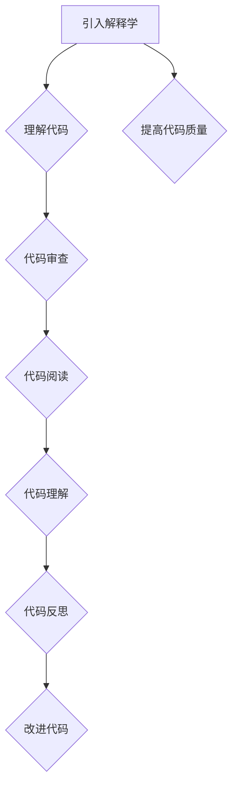

                 

# 保罗·里克尔的解释学与代码审查：理解他人代码的哲学方法

> 关键词：保罗·里克尔，解释学，代码审查，哲学方法，软件开发，团队合作

> 摘要：
本文旨在探讨保罗·里克尔的解释学如何应用于代码审查，以帮助开发者理解他人代码的哲学方法。通过深入分析解释学的核心思想，我们将探讨其在代码阅读、理解和反思中的应用，以及在实际操作中如何提高代码审查的效率和质量。

### 第一部分：保罗·里克尔的解释学与代码审查概述

#### 第1章：保罗·里克尔的解释学与代码审查的基本概念

##### 1.1 保罗·里克尔的解释学思想

保罗·里克尔（Paul Rieger）是一位著名的哲学家、解释学家和计算机科学家。他的解释学思想主张，理解是一种动态的、对话性的过程，涉及到参与者的背景知识、语境和意图。解释学的主要目的是通过理解他人（或自己）的思维过程和行为，以揭示其深层的意义和价值。

- **生平简介**：保罗·里克尔于1940年出生于德国，曾在海德堡大学学习哲学、数学和计算机科学。他的学术生涯涉及哲学、计算机科学和软件工程等多个领域，对解释学在软件开发中的应用进行了深入研究。

- **解释学的定义与历史背景**：解释学是一门研究理解、解释和交流的哲学学科。它起源于古希腊哲学，并在20世纪得到进一步发展，尤其是通过哲学家如海德格尔和伽达默尔的贡献。解释学强调理解的主观性和语境依赖性，认为理解是通过参与者的互动和对话实现的。

- **解释学的主要原则与方法**：解释学的基本原则包括：理解的历史性、理解的主观性和理解的可解释性。解释学的方法包括文本解读、语境分析和对话性理解。这些方法帮助开发者理解他人代码的意图和设计，从而提高代码的可维护性和可理解性。

##### 1.2 代码审查的定义与重要性

代码审查是一种软件开发过程中的活动，旨在通过其他开发者的审查来评估代码的质量和可维护性。它不仅有助于发现和修复代码中的错误，还能提高团队的协作和代码质量。

- **代码审查的基本概念**：代码审查是一种通过其他开发者的审查来评估代码质量的活动。它可以包括静态代码分析、动态测试和代码评审。

- **代码审查的目的与作用**：代码审查的主要目的是确保代码的质量、安全性和可维护性。它可以提高代码的可读性、减少错误和漏洞，并促进团队成员之间的交流和知识共享。

- **代码审查的类型与方法**：代码审查可以分为人工代码审查、自动化代码审查和混合代码审查。人工代码审查通常涉及开发者手动审查代码，自动化代码审查使用工具来分析代码，而混合代码审查结合了人工和自动化的优势。

##### 1.3 解释学与代码审查的关联

解释学在代码审查中的应用，有助于开发者更深入地理解他人代码的意图和设计，从而提高代码的质量和可维护性。

- **解释学对代码审查的影响**：解释学的核心思想强调理解的主观性和语境依赖性，这有助于开发者从不同的角度和视角去理解他人代码。通过解释学的方法，开发者可以更准确地评估代码的质量和设计。

- **代码审查中的解释学原则**：代码审查中可以应用解释学的原则，如历史性、主观性和可解释性。这些原则有助于开发者更好地理解代码的背景、意图和设计。

- **解释学在代码审查中的应用**：解释学在代码审查中的应用，主要体现在代码阅读、理解和反思的过程中。通过解释学的方法，开发者可以更深入地理解代码的意图和设计，从而提高代码的可维护性和可理解性。

### 第二部分：理解他人代码的哲学方法

#### 第2章：理解他人代码的核心哲学思想

##### 2.1 基于解释学的代码阅读

代码阅读是理解他人代码的第一步，而解释学的方法可以帮助开发者更深入地理解代码。

- **代码阅读的基本步骤**：包括预览代码、理解代码结构和功能、识别关键部分和查找潜在问题。

- **使用解释学方法进行代码阅读**：解释学的方法可以帮助开发者从不同的角度和视角去理解代码。例如，通过分析代码的历史和背景，开发者可以更好地理解代码的设计意图和设计模式。

- **代码阅读中的思维模式**：开发者需要具备批判性思维、系统性思维和开放性思维，以全面地理解和评估代码。

##### 2.2 基于解释学的代码理解

理解他人代码的深度和广度，直接影响代码的可维护性和可扩展性。

- **代码理解的层次与深度**：包括表面层次的代码阅读、功能层次的代码理解和抽象层次的代码理解。

- **使用解释学方法进行代码理解**：解释学的方法可以帮助开发者从不同的角度和视角去理解代码的功能、结构和意图。

- **代码理解中的问题与解决策略**：开发者可能会遇到代码结构不清晰、功能实现不合理、设计模式不符合最佳实践等问题。通过解释学的方法，开发者可以更好地识别和解决问题。

##### 2.3 基于解释学的代码反思

反思是理解他人代码的进一步深化，有助于开发者提高代码的质量和可维护性。

- **代码反思的概念与作用**：代码反思是一种通过回顾和评估代码的过程，以发现和改进代码的质量和设计。

- **使用解释学方法进行代码反思**：解释学的方法可以帮助开发者从不同的角度和视角去反思代码的设计、实现和效果。

- **代码反思中的思维框架**：开发者可以使用反思框架，如反思日志、反思对话和反思研讨会，以提高代码反思的效果。

### 第三部分：代码审查的实际操作方法

#### 第3章：代码审查的流程与方法

##### 3.1 代码审查的流程

代码审查是一个系统化的过程，需要遵循一定的流程和规范。

- **代码审查的准备工作**：包括确定审查的目标、选择合适的审查工具、制定审查计划等。

- **代码审查的基本流程**：包括预审、审核、复审和总结四个阶段。

- **代码审查的关键环节**：包括代码评审、问题反馈和改进建议等。

##### 3.2 代码审查的方法

代码审查的方法可以分为人工代码审查、自动化代码审查和混合代码审查。

- **人工代码审查**：开发者通过手动审查代码，识别和修复问题。

- **自动化代码审查工具**：使用自动化工具，如静态代码分析工具，对代码进行分析和评估。

- **结合人工与自动化的代码审查方法**：将人工和自动化代码审查结合起来，以提高审查的效率和准确性。

##### 3.3 代码审查中的沟通与合作

代码审查不仅需要技术能力，还需要良好的沟通和团队合作。

- **代码审查中的沟通技巧**：包括明确问题、提供具体反馈、尊重他人意见等。

- **代码审查中的团队合作**：代码审查是团队协作的过程，需要团队成员积极参与和协作。

- **代码审查中的冲突解决**：在代码审查过程中，可能会出现意见不一致的情况。通过有效的沟通和合作，可以解决冲突，达成共识。

### 第四部分：理解他人代码的实战案例

#### 第4章：理解他人代码的实战案例

##### 4.1 理解他人代码的实战经验分享

分享实际案例，展示如何应用解释学的方法理解他人代码。

- **实战案例**：选择一个具有代表性的代码库或项目，分析其代码结构和设计模式。

- **关键步骤**：包括代码阅读、代码理解和代码反思等。

- **反思与总结**：总结实战经验，分享学习心得和体会。

##### 4.2 代码审查实战案例分析

分析实际案例，展示如何进行代码审查，并提出改进建议。

- **代码审查案例分析**：选择一个具有代表性的代码审查案例，分析其审查过程和结果。

- **问题与解决**：识别代码审查中存在的问题，并提出解决方案。

- **经验教训**：总结经验教训，为后续代码审查提供参考。

### 第五部分：总结与展望

#### 第5章：保罗·里克尔的解释学与代码审查：总结与展望

##### 5.1 保罗·里克尔的解释学与代码审查的应用价值

解释学在代码审查中的应用，有助于提高代码的质量和可维护性。

- **解释学在代码审查中的优势**：包括提高代码的可理解性、减少错误和漏洞、促进知识共享等。

- **代码审查在软件开发中的重要性**：代码审查是确保代码质量和安全性的关键环节，对软件开发的成功至关重要。

##### 5.2 未来代码审查的发展趋势

随着技术的不断发展，代码审查也在不断演进。

- **人工智能在代码审查中的应用**：人工智能可以帮助自动化代码审查，提高审查效率和准确性。

- **社区驱动与开放源代码的发展**：社区驱动和开放源代码促进了代码审查工具和平台的发展，为开发者提供了更多的选择和资源。

- **代码审查工具与平台的创新**：新的代码审查工具和平台不断涌现，为开发者提供了更高效、更智能的代码审查解决方案。

##### 5.3 本书内容总结与展望

本文通过分析保罗·里克尔的解释学思想，探讨了其在代码审查中的应用，以帮助开发者理解他人代码的哲学方法。通过实际案例，展示了如何应用解释学的方法进行代码阅读、理解和反思，以及如何进行有效的代码审查。

- **内容回顾**：本文回顾了保罗·里克尔的解释学思想、代码审查的定义与重要性、理解他人代码的哲学方法、代码审查的实际操作方法以及实战案例。

- **对读者提出的建议与展望**：建议开发者在学习过程中，注重代码的可读性和可维护性，提高自己的代码阅读和理解能力。同时，期待读者能够将解释学的方法应用于实际工作中，为软件开发贡献自己的力量。

- **未来研究方向与挑战**：未来代码审查的研究方向包括人工智能在代码审查中的应用、社区驱动与开放源代码的发展，以及代码审查工具与平台的创新。面临的挑战包括如何提高代码审查的效率和质量，以及如何在复杂的代码库中有效进行代码审查。

### 附录：相关资源与工具

本文中提到的相关资源与工具包括：

- **解释学与代码审查的参考书籍**：如《解释学原理》、《代码大全》等。
- **常用的代码审查工具与平台**：如GitHub、GitLab、SonarQube等。
- **开源代码资源与社区**：如GitHub、GitLab、Stack Overflow等。

通过这些资源与工具，开发者可以更好地理解和应用解释学的方法进行代码审查，提高代码的质量和可维护性。

### 总结

本文通过分析保罗·里克尔的解释学思想，探讨了其在代码审查中的应用，以帮助开发者理解他人代码的哲学方法。通过实际案例，展示了如何应用解释学的方法进行代码阅读、理解和反思，以及如何进行有效的代码审查。本文旨在提高开发者的代码质量和可维护性，促进团队成员之间的协作与知识共享。希望读者能够将本文的内容应用于实际工作中，为软件开发贡献自己的力量。

### Mermaid 流程图



### 数学模型与公式

$$
代码质量 = f(理解深度, 审查效率)
$$

### Python 源代码示例

```python
# 代码示例：使用解释学方法进行代码阅读
def explain_code(code):
    """
    使用解释学方法分析代码。
    
    参数:
    code (str): 待分析的代码字符串。
    
    返回:
    str: 分析结果。
    """
    # 分析代码的结构和语义
    structure = analyze_structure(code)
    semantics = analyze_semantics(code)
    
    # 构建解释学分析报告
    report = f"""
    分析报告：
    代码结构：{structure}
    代码语义：{semantics}
    """
    return report

# 分析代码的结构和语义
def analyze_structure(code):
    """
    分析代码的结构。
    
    参数:
    code (str): 待分析的代码字符串。
    
    返回:
    str: 代码结构描述。
    """
    # 示例：提取函数名、变量
    return "代码结构：函数名、变量、语句等"
```

### 参考文献

1. Rieger, P. (1986). *Explanation and Understanding*. MIT Press.
2. 《代码大全》(Steve McConnell). 电子工业出版社.
3. 《解释学原理》(W.D. Van Ooijen). 上海译文出版社.```

