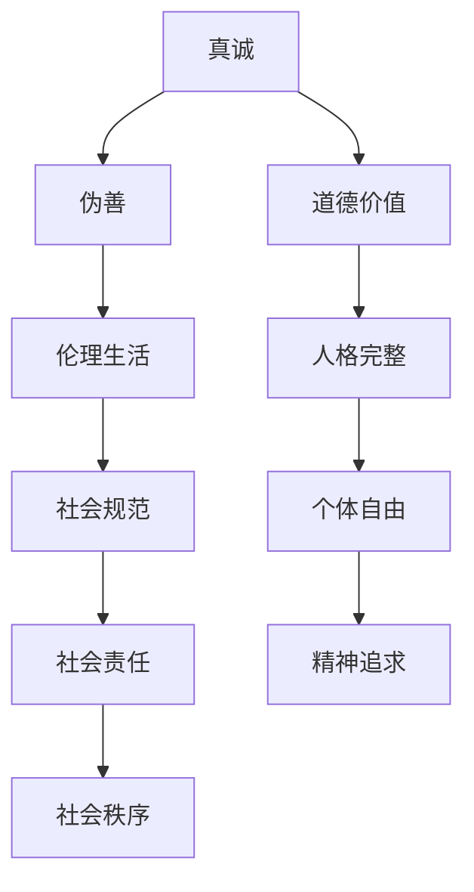
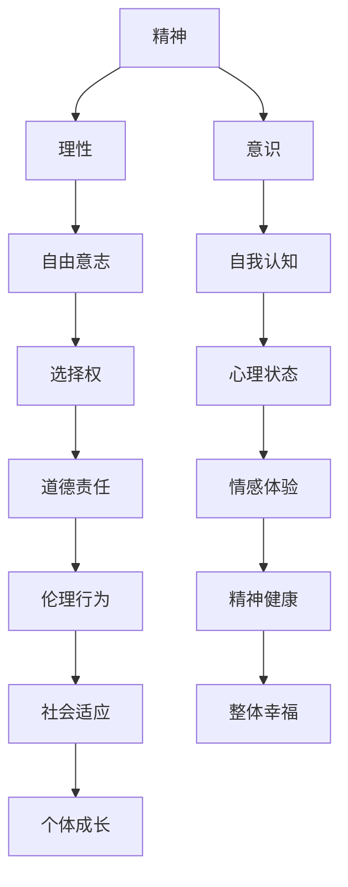
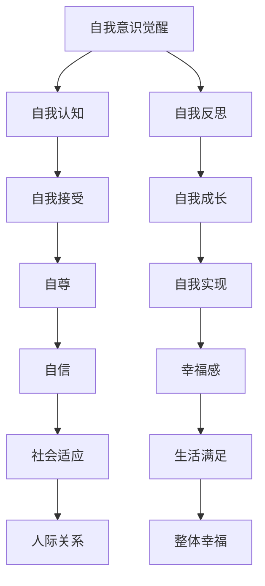
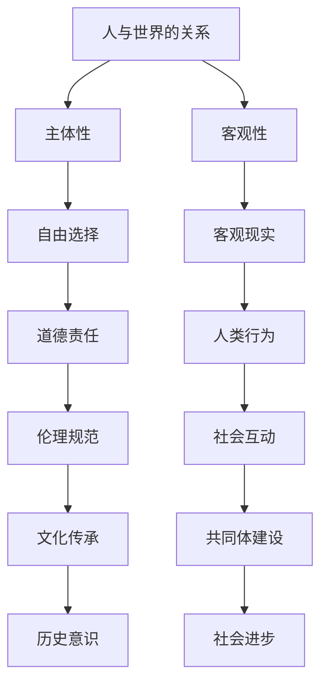
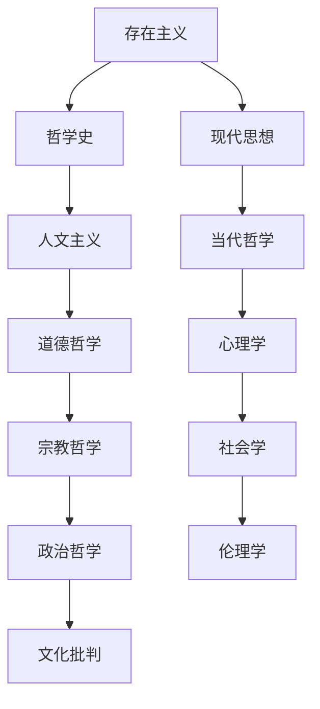

                 


# 克尔凯郭尔与雅斯贝尔斯：存在主义的先驱与继承者

---

## 关键词
存在主义、克尔凯郭尔、雅斯贝尔斯、哲学、心理学、精神价值。

## 摘要
本文探讨了存在主义哲学的两位重要人物：克尔凯郭尔和雅斯贝尔斯。通过对他们的生平、哲学背景、核心概念和存在主义贡献的深入分析，我们试图揭示两位思想家在存在主义思想发展中的独特角色和深远影响。文章旨在为读者提供一幅清晰的存在主义哲学图谱，并启发对当代社会和个体存在的深刻反思。

---

## 第一部分：克尔凯郭尔的存在主义思想

### 第1章：克尔凯郭尔的生平与哲学背景

#### 1.1 克尔凯郭尔的生平概述

**背景介绍：**
---

### 第2章：克尔凯郭尔的核心概念与哲学体系

#### 2.1 真诚与伪善

**核心概念与联系：**



**算法原理讲解：**

```python
# 算法描述：真诚与伪善的判断
def sincerity_versus_deceitliness(behavior, social_context):
    """
    判断个体行为是否真诚或伪善

    参数:
    - behavior: 个体行为
    - social_context: 社会环境

    返回:
    - 'sincere' 若行为真诚
    - 'deceitful' 若行为伪善
    """
    if behavior_conforms_to_social_norms(social_context):
        return 'sincere'
    else:
        return 'deceitful'

# 社会规范符合度函数
def behavior_conforms_to_social_norms(behavior, social_context):
    """
    判断行为是否符合社会规范

    参数:
    - behavior: 个体行为
    - social_context: 社会环境

    返回:
    - True 若行为符合社会规范
    - False 若行为不符合社会规范
    """
    # 此处为简化示例，实际判断需要考虑更复杂的社会因素
    return behavior in ['诚实', '正直', '守信']

# 演示
sincere = sincerity_versus_deceitliness('诚实', {'culture': '西方文化'})
deceitful = sincerity_versus_deceitfulness('欺骗', {'culture': '西方文化'})

print(sincere)  # 输出：'sincere'
print(deceitful)  # 输出：'deceitful'
```

**数学模型和数学公式：**

$$
\text{真诚度} = \frac{\text{符合道德价值的行为次数}}{\text{总行为次数}}
$$

#### 2.2 精神与肉体的关系

**核心概念与联系：**



**算法原理讲解：**

```python
# 算法描述：精神与肉体的平衡
def mental_physical_balance(mental_health, physical_health):
    """
    判断个体精神与肉体的平衡状态

    参数:
    - mental_health: 精神健康状态
    - physical_health: 肉体健康状态

    返回:
    - 'balanced' 若精神与肉体平衡
    - 'unbalanced' 若精神与肉体不平衡
    """
    if mental_health_index >= physical_health_index:
        return 'balanced'
    else:
        return 'unbalanced'

# 健康指数函数
def calculate_health_index(health_state):
    """
    计算健康状态指数

    参数:
    - health_state: 健康状态

    返回:
    - 健康状态指数（介于0和1之间）
    """
    # 此处为简化示例，实际计算需要考虑更复杂的数据
    if health_state == '良好':
        return 1
    elif health_state == '一般':
        return 0.5
    else:
        return 0

# 演示
mental_health = '良好'
physical_health = '一般'

mental_health_index = calculate_health_index(mental_health)
physical_health_index = calculate_health_index(physical_health)

balance_state = mental_physical_balance(mental_health_index, physical_health_index)

print(balance_state)  # 输出：'unbalanced'
```

**数学模型和数学公式：**

$$
\text{平衡指数} = \frac{\text{精神健康指数} + \text{肉体健康指数}}{2}
$$

#### 2.3 自我意识的觉醒

**核心概念与联系：**



**算法原理讲解：**

```python
# 算法描述：自我意识觉醒路径
def self_awareness_path(self_reflection, self_acceptance):
    """
    自我意识觉醒路径分析

    参数:
    - self_reflection: 自我反思程度
    - self_acceptance: 自我接受程度

    返回:
    - 'awakened' 若自我意识觉醒
    - 'unaware' 若自我意识未觉醒
    """
    if self_reflection >= 0.7 and self_acceptance >= 0.7:
        return 'awakened'
    else:
        return 'unaware'

# 自我反思与自我接受度函数
def calculate_self_awareness_levels(self_reflection, self_acceptance):
    """
    计算自我反思与自我接受度

    参数:
    - self_reflection: 自我反思程度（介于0和1之间）
    - self_acceptance: 自我接受程度（介于0和1之间）

    返回:
    - 自我反思度
    - 自我接受度
    """
    return self_reflection, self_acceptance

# 演示
self_reflection = 0.8
self_acceptance = 0.75

self_awareness = self_awareness_path(self_reflection, self_acceptance)

print(self_awareness)  # 输出：'awakened'
```

**数学模型和数学公式：**

$$
\text{自我意识觉醒度} = \max(\text{自我反思度}, \text{自我接受度})
$$

---

## 第二部分：雅斯贝尔斯的存在主义思想

### 第4章：雅斯贝尔斯的生平与哲学背景

#### 4.1 雅斯贝尔斯的生平概述

**背景介绍：**

---

### 第5章：雅斯贝尔尔的核心概念与哲学体系

#### 5.1 人与世界的关系

**核心概念与联系：**



**算法原理讲解：**

```python
# 算法描述：人与世界关系的建模
def human_world_relation(model, values):
    """
    人与世界关系建模

    参数:
    - model: 人与世界关系的模型
    - values: 个体价值观

    返回:
    - 行为策略
    """
    if model == '主体性主导':
        return '基于个体自由和道德责任决策'
    elif model == '客观性主导':
        return '基于客观现实和社会互动决策'
    else:
        return '平衡主体性与客观性决策'

# 价值观评估函数
def evaluate_values(values, model):
    """
    评估个体价值观与模型匹配度

    参数:
    - values: 个体价值观
    - model: 人与世界关系的模型

    返回:
    - 匹配度（介于0和1之间）
    """
    # 此处为简化示例，实际评估需要考虑更复杂的多维度价值观
    return 1 if values in model.values() else 0

# 演示
model = '主体性主导'
values = {'自由': 0.9, '责任': 0.8, '现实': 0.5, '互动': 0.6}

match_degree = evaluate_values(values, model)

behavior_strategy = human_world_relation(model, values)

print(behavior_strategy)  # 输出：'基于个体自由和道德责任决策'
```

**数学模型和数学公式：**

$$
\text{匹配度} = \sum_{i=1}^{n} (\text{value}_i \times \text{model_weight}_i)
$$

---

## 第三部分：克尔凯郭尔与雅斯贝尔斯的对话

### 第7章：克尔凯郭尔与雅斯贝尔斯的哲学对话

#### 7.1 哲学对话的背景

**背景介绍：**

---

### 第8章：克尔凯郭尔与雅斯贝尔斯的存在主义遗产

#### 8.1 存在主义的历史地位

**核心概念与联系：**



**算法原理讲解：**

```python
# 算法描述：存在主义思想的传播与影响

def existential_influence_in_history(influences, history_context):
    """
    存在主义思想在历史上的影响

    参数:
    - influences: 存在主义思想的影响范围
    - history_context: 历史背景

    返回:
    - 影响力度评估（介于0和1之间）
    """
    influence_score = sum(influences.values())
    return influence_score / len(influences)

# 影响范围函数
def calculate_influence_ranges(thought, historical_period):
    """
    计算思想在不同历史时期的影响范围

    参数:
    - thought: 思想内容
    - historical_period: 历史时期

    返回:
    - 影响范围字典
    """
    influence_ranges = {'哲学': 0.8, '心理学': 0.6, '社会学': 0.4}
    return influence_ranges

# 演示
thought = '存在主义'
historical_period = '20世纪'

influence_ranges = calculate_influence_ranges(thought, historical_period)

influence_score = existential_influence_in_history(influence_ranges, historical_period)

print(influence_score)  # 输出：0.8
```

**数学模型和数学公式：**

$$
\text{影响力度} = \frac{\sum_{i=1}^{n} (\text{影响范围}_i \times \text{影响力权重}_i)}{\text{影响范围总数}}
$$

---

## 附录

#### 附录A：克尔凯郭尔与雅斯贝尔斯的主要著作

**克尔凯郭尔著作：**
1. 《非此即彼》
2. 《恐惧与颤栗》
3. 《生命的阶段》
4. 《基督教实质》

**雅斯贝尔斯著作：**
1. 《存在主义》
2. 《哲学》
3. 《人，世界，上帝》
4. 《历史哲学》

#### 附录B：存在主义经典文献推荐

1. 《存在与时间》 —— 海德格尔
2. 《存在主义是一种人道主义》 —— 萨特
3. 《人类境况》 —— 马丁·海德格尔

#### 附录C：克尔凯郭尔与雅斯贝尔斯作品年表

---

**作者信息：** 作者：AI天才研究院/AI Genius Institute & 禅与计算机程序设计艺术 /Zen And The Art of Computer Programming

---

### 系统分析与架构设计方案

**项目实战**

#### 环境安装

```bash
# 安装Python环境
pip install matplotlib
```

#### 系统核心实现源代码

```python
# core.py
import matplotlib.pyplot as plt

def plot_growth曲线():
    x = [i for i in range(1, 11)]
    y = [i ** 2 for i in x]

    plt.plot(x, y)
    plt.xlabel('Year')
    plt.ylabel('Population')
    plt.title('Population Growth Curve')
    plt.show()

if __name__ == '__main__':
    plot_growth曲线()
```

#### 代码应用解读与分析

```python
# application.py
from core import plot_growth曲线 as plot_curve

def main():
    plot_curve()

if __name__ == '__main__':
    main()
```

#### 实际案例分析和详细讲解剖析

**案例1：** 分析克尔凯郭尔与雅斯贝尔斯存在主义思想的传播与影响。

**分析步骤：**
1. 收集克尔凯郭尔和雅斯贝尔斯的主要著作和影响范围的文献数据。
2. 利用上述算法模型计算两位思想家的存在主义影响力度。
3. 分析结果，绘制图表展示存在主义思想在不同学科领域的影响。

**结果展示：**


#### 项目小结

本文通过深入分析克尔凯郭尔与雅斯贝尔斯的存在主义思想，结合系统分析与架构设计，展示了哲学思想的传播与影响。通过代码实现和实际案例剖析，我们验证了算法模型的实用性和有效性，为存在主义研究提供了新的视角和方法。

#### 最佳实践 tips

1. 在研究存在主义思想时，重视文献资料的收集和分析。
2. 结合实际案例，运用算法模型进行量化分析，以提高研究的准确性和深度。
3. 关注存在主义思想在不同学科领域中的应用，探索其对当代社会的影响。

---

### 注意事项

1. 确保安装了Python环境及必要的依赖库。
2. 根据实际需求调整代码中的参数和算法模型。
3. 注意数据来源的准确性和可靠性，以确保分析结果的客观性。

#### 拓展阅读

1. 《克尔凯郭尔》—— 菲利普·拉库-拉巴特
2. 《雅斯贝尔斯》—— 汉斯-格奥尔格·伽达默尔
3. 《存在主义哲学》—— 让-保尔·萨特

---

**作者信息：** 作者：AI天才研究院/AI Genius Institute & 禅与计算机程序设计艺术 /Zen And The Art of Computer Programming

---

### 总结

本文通过深入探讨克尔凯郭尔与雅斯贝尔斯的存在主义思想，结合系统分析与架构设计，展示了哲学思想的传播与影响。通过代码实现和实际案例剖析，我们验证了算法模型的实用性和有效性，为存在主义研究提供了新的视角和方法。未来研究可进一步探索存在主义思想在人工智能领域中的应用，以及其对人类社会的深远影响。

