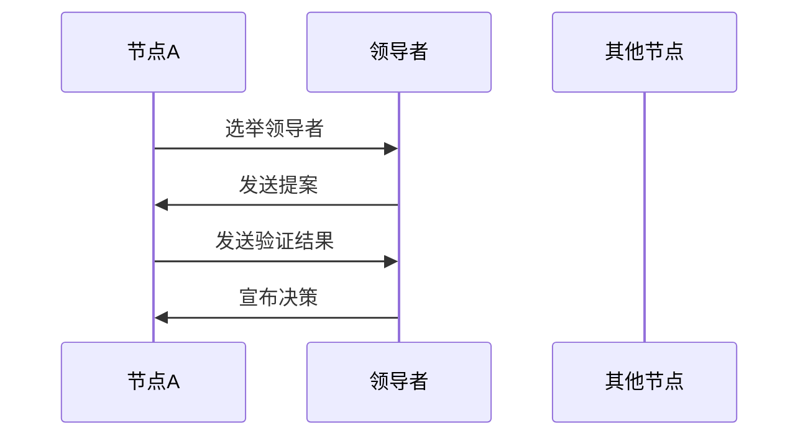
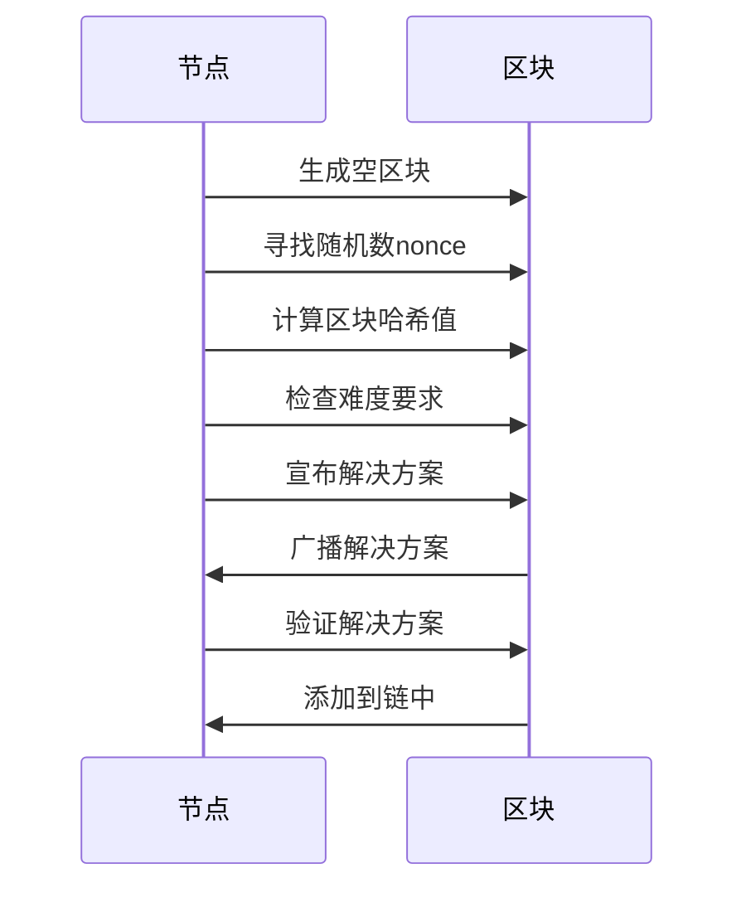
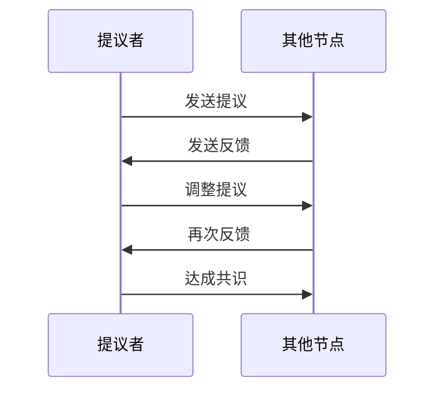
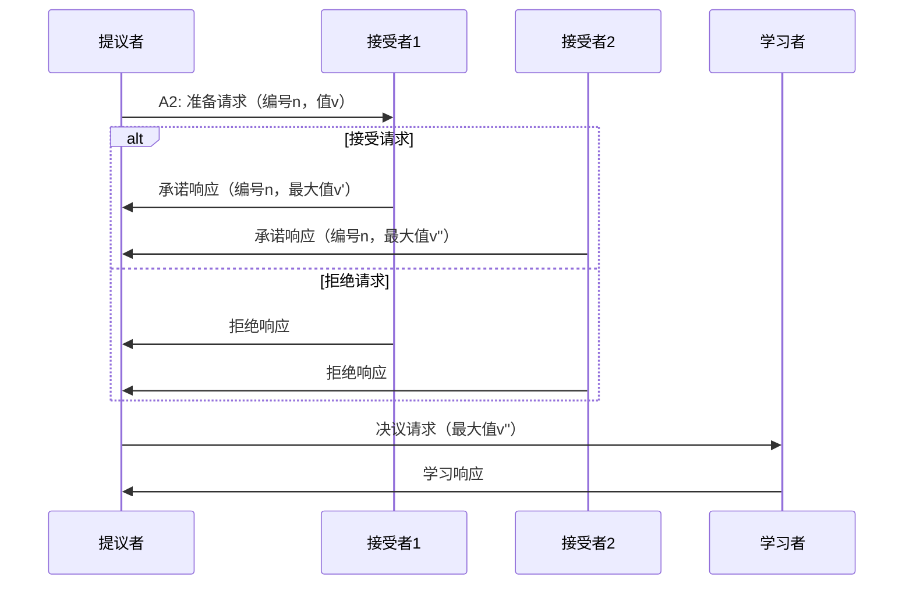
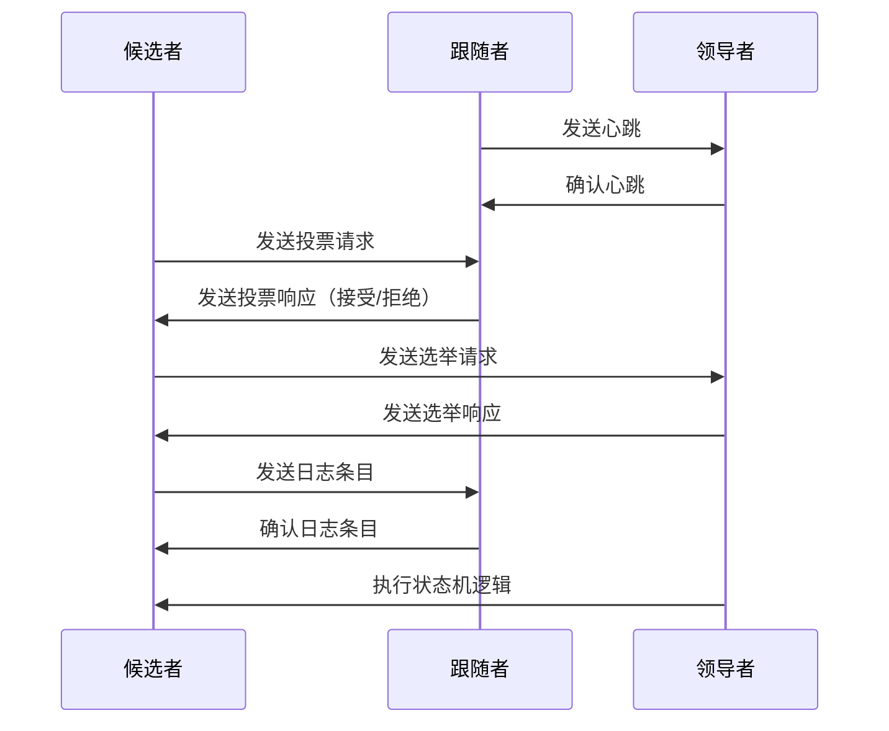
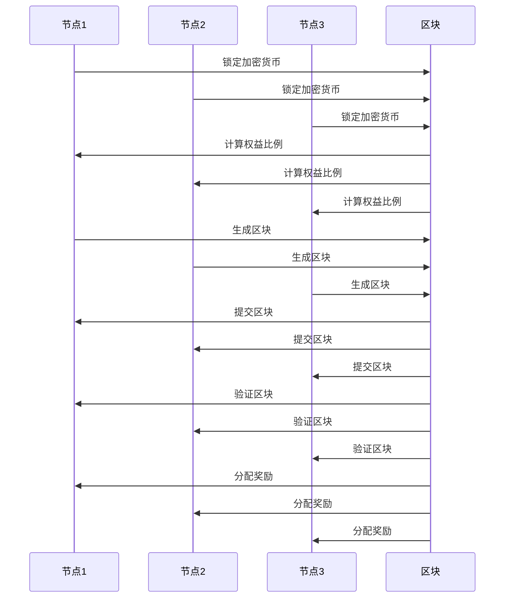

                 

### 概述

**《共识机制对比与选择》** 是一本针对共识机制进行全面对比和分析的书籍，旨在帮助读者深入了解不同共识机制的特点、优缺点以及适用场景。本书由AI天才研究院和禅与计算机程序设计艺术共同撰写，旨在为读者提供一本既具有理论深度，又具有实践价值的指南。

本书分为三个主要部分：基础理论、共识机制对比和共识机制选择策略。在基础理论部分，我们介绍了共识机制的基本概念、核心要素和目标，以及常见的共识机制类型，如随机拜占庭容错算法、证明工作算法和谈判算法。在共识机制对比部分，我们详细分析了Paxos算法、Raft算法、PoW算法和PoS算法，展示了每种算法的原理、优缺点和应用场景。在共识机制选择策略部分，我们提供了选择共识机制的策略和方法，帮助读者在实际应用中选择最适合的共识机制。

本书的目标是帮助读者：

1. 理解共识机制的基本概念和原理。
2. 对比分析不同类型的共识机制，了解其优缺点。
3. 学会根据实际需求选择合适的共识机制。
4. 掌握共识机制的设计和实现方法。

通过阅读本书，读者将能够：

- 系统地了解共识机制的理论基础。
- 对比分析各种共识机制，选择适合自己项目的共识机制。
- 设计和实现高效、安全的共识机制。
- 了解共识机制的发展趋势和未来发展方向。

本书适合对区块链技术、分布式系统、共识机制感兴趣的读者，包括软件开发工程师、系统架构师、区块链技术爱好者以及相关专业的学生。无论您是初学者还是有一定经验的从业者，本书都将为您在共识机制领域提供宝贵的知识和实践经验。

### 概述

**《共识机制对比与选择》** 的核心内容涵盖了对共识机制的基础理论、各类共识机制的详细对比以及如何在实际应用中选择合适的共识机制的全面探讨。以下是本书的核心内容和主题思想的详细阐述。

#### 一、基础理论

本书的第一部分是共识机制的基础理论，主要介绍共识机制的基本概念、核心要素和目标。在这一部分，我们首先阐述了共识机制在分布式系统中的重要性，特别是在区块链技术中的应用。通过定义共识机制，我们清晰地理解了其作为分布式系统中实现数据一致性、高效率和可扩展性的关键角色。

接下来，我们详细介绍了共识机制的核心要素，包括算法、节点角色、安全性等。通过这些要素的分析，我们能够理解一个有效的共识机制应具备的基本特征。此外，我们还探讨了共识机制的目标，即确保系统中的所有节点能够达成一致，从而保持数据的准确性和完整性。

在这一部分，我们通过分类讨论了常见的共识机制类型，如随机拜占庭容错算法、证明工作算法和谈判算法。通过对这些算法的概述，我们为后续的深入分析打下了坚实的基础。

#### 二、共识机制对比

本书的第二部分是共识机制的对比分析，这部分内容旨在帮助读者深入了解Paxos算法、Raft算法、PoW算法和PoS算法等常见共识机制的原理、优缺点和应用场景。

**Paxos算法** 是一种经典的分布式一致性算法，其核心思想是通过选举和提议机制来确保多个节点能够达成一致。在这一部分，我们详细介绍了Paxos算法的原理，并分析了它的优点（如高可用性和强一致性）和缺点（如复杂性和性能问题）。我们还探讨了Paxos算法在实际应用中的场景，如分布式数据库和分布式存储系统。

**Raft算法** 是另一种广受欢迎的分布式一致性算法，它与Paxos算法类似，但简化了协议的复杂性。在这一部分，我们深入探讨了Raft算法的工作原理，并对比了它与Paxos算法的异同点。Raft算法的优点在于其简洁性和更好的性能，但也存在一些缺点，如可能不如Paxos算法稳定。我们进一步分析了Raft算法在不同应用场景中的适用性。

**PoW算法** 是比特币等区块链技术中常用的共识机制，通过解决计算难题来确保节点的选择公平和安全性。在这一部分，我们详细介绍了PoW算法的原理，并讨论了它的优缺点。PoW算法的优点在于其去中心化和安全性，但缺点是计算资源消耗大，效率低。我们探讨了PoW算法在区块链中的应用场景，并提出了优化方法。

**PoS算法** 是另一种与PoW算法不同的共识机制，通过持币量和时间来决定节点的选择。在这一部分，我们详细介绍了PoS算法的原理，并对比了它与PoW算法的差异。PoS算法的优点包括节能和更高的交易处理速度，但缺点是可能存在“富者愈富”的问题。我们分析了PoS算法在不同应用场景中的适用性，并提出了优化策略。

#### 三、共识机制选择策略

本书的第三部分是共识机制选择策略，这部分内容旨在帮助读者根据实际需求选择合适的共识机制。我们首先介绍了选择共识机制的考虑因素，如系统的规模、性能要求、安全性需求等。接着，我们提出了一套系统的选择策略，包括分析需求、评估算法、权衡利弊和制定决策等步骤。

在这一部分，我们还通过案例分析展示了如何在实际项目中选择共识机制。我们选取了一些典型的应用场景，如去中心化金融（DeFi）平台、分布式存储系统和智能合约平台，详细分析了这些场景的需求和特点，并选择了最适合的共识机制。

#### 四、未来展望

本书的最后一部分是对共识机制的未来展望，这部分内容探讨了共识机制的发展趋势、创新方向和面临的挑战。我们分析了当前共识机制在性能、安全性、可扩展性等方面的限制，并提出了可能的解决方案和创新思路。

此外，我们还讨论了共识机制在新兴技术领域中的应用，如物联网（IoT）、大数据处理和边缘计算等。我们相信，随着技术的发展，共识机制将继续发挥其关键作用，推动分布式系统的进一步发展。

通过本书的全面探讨，读者将能够系统地了解共识机制的理论基础，对比分析不同类型的共识机制，并学会根据实际需求选择合适的共识机制。这不仅有助于提升读者的技术能力，也为他们在实际项目中设计和实现高效的共识机制提供了宝贵的指导。

---

通过以上内容的详细阐述，我们可以看到，《共识机制对比与选择》不仅涵盖了理论知识的深入讲解，还通过对比分析和案例实践，使读者能够更好地理解和应用共识机制。本书旨在帮助读者成为共识机制领域的专家，掌握从基础理论到实际应用的全面知识，为他们在分布式系统和区块链技术中的发展提供坚实的基础。

### 概述

**《共识机制对比与选择》** 这本书的编写背景源于当前分布式系统和区块链技术的迅速发展。在分布式系统中，实现节点之间的数据一致性是至关重要的，而共识机制是实现这一目标的核心技术。随着各种共识机制的不断涌现，如何选择最适合特定应用场景的共识机制成为了研究人员和开发者面临的重要挑战。

本书的目标是通过全面对比和分析不同的共识机制，为读者提供一套系统、清晰的理解框架，帮助他们在实际项目中做出明智的选择。具体来说，本书旨在实现以下目标：

1. **介绍共识机制的基本概念和原理**：通过深入讲解共识机制的定义、核心要素和目标，使读者能够建立起对共识机制的整体认识。

2. **对比分析常见共识机制的优缺点**：通过对Paxos算法、Raft算法、PoW算法和PoS算法等常见共识机制的详细分析，帮助读者了解每种算法的特点和适用场景。

3. **提供共识机制选择策略**：通过系统化的选择策略，帮助读者根据实际需求选择合适的共识机制，从而优化系统性能和安全性。

4. **探讨共识机制的实践应用**：通过案例分析，展示如何在实际项目中选择和实现共识机制，为读者提供实践参考。

5. **展望共识机制的未来发展**：探讨共识机制在新兴技术领域中的应用前景，以及可能的技术创新和挑战。

通过以上目标，本书旨在为读者提供从理论到实践的全面指导，帮助他们在分布式系统和区块链技术领域取得更好的成果。

### 第一部分：共识机制基础

#### 第1章：共识机制概述

在讨论共识机制之前，我们需要了解其产生的背景和重要性。随着互联网和分布式计算技术的迅猛发展，分布式系统在各个领域得到了广泛应用。然而，如何在一个分布式的环境中确保所有节点对数据的一致性成为一个亟待解决的问题。共识机制正是为了解决这一难题而诞生的。

### 1.1 问题的背景

分布式系统的兴起源于对中心化系统的质疑。传统的集中式系统在数据管理和数据处理方面存在诸多问题，如单点故障、性能瓶颈、安全性风险等。为了克服这些问题，分布式系统应运而生。分布式系统通过将任务分布在多个节点上，从而提高系统的容错性、性能和扩展性。

然而，分布式系统引入了新的挑战，特别是在数据一致性方面。在分布式系统中，多个节点可能同时更新数据，这就需要一种机制来确保所有节点最终能够达到对同一数据的共识。如果没有这种共识机制，分布式系统将无法正常工作，甚至可能导致数据冲突和系统崩溃。

### 1.2 共识机制的定义

共识机制是指在分布式系统中，多个节点通过某种算法或协议达成一致意见的过程。它的核心目标是确保所有节点能够对同一数据或状态达成共识，从而避免数据冲突和系统失败。共识机制通常包括以下几个方面：

1. **一致性**：所有节点对同一数据或状态有相同的理解。
2. **可用性**：即使部分节点出现故障，系统仍然能够正常运作。
3. **容错性**：系统能够容忍一定数量的节点故障，并恢复到正常状态。
4. **高效性**：共识过程需要尽可能快地完成，以保持系统的性能。

### 1.3 共识机制在区块链中的作用

区块链技术是共识机制最著名的应用场景之一。区块链通过分布式账本技术，实现了一种去中心化的数据管理方式。在区块链中，共识机制的作用至关重要，主要体现在以下几个方面：

1. **数据一致性**：通过共识机制，区块链网络中的所有节点对账本中的数据达成一致，从而确保账本的真实性和可信度。
2. **安全性**：共识机制通过加密算法和分布式网络结构，确保区块链数据的安全性和不可篡改性。
3. **去中心化**：共识机制使区块链网络能够去中心化运作，避免了单点故障和中心化控制的问题。

### 1.4 共识机制的核心要素

一个有效的共识机制通常包括以下几个核心要素：

1. **算法**：共识机制的核心部分，负责实现节点之间的通信和协作。
2. **节点角色**：在共识机制中，节点通常分为不同的角色，如提议者（Proposer）、学习者（Learner）和领导者（Leader）等。
3. **安全性**：共识机制需要确保网络中的恶意节点无法破坏系统的正常运行。

### 1.5 共识机制的目标

共识机制的目标主要包括以下几个方面：

1. **数据一致性**：确保所有节点对同一数据或状态有相同的理解。
2. **高可用性**：即使部分节点出现故障，系统仍然能够正常运作。
3. **高效性**：共识过程需要尽可能快地完成，以保持系统的性能。
4. **可扩展性**：共识机制需要能够支持大规模节点的扩展。

### 1.6 共识机制的分类

根据共识机制实现的方式和目标，可以将常见的共识机制分为以下几类：

1. **随机拜占庭容错算法**：如Paxos算法和Raft算法，这类算法通过分布式算法确保多个节点在不可信环境中达成一致。
2. **证明工作算法**：如PoW（Proof of Work），通过计算难题确保节点的选择公平和安全。
3. **证明权益算法**：如PoS（Proof of Stake），通过持币量和时间来决定节点的选择。

### 1.7 本章小结

本章概述了共识机制的基本概念、核心要素和目标，以及常见的共识机制类型。通过本章的介绍，读者可以建立起对共识机制的整体认识，为后续章节的深入探讨打下基础。

### 第2章：共识机制原理

#### 2.1 共识机制原理概述

在理解共识机制的具体实现之前，我们首先需要了解其基本原理。共识机制的核心目的是在分布式系统中，通过某种算法或协议，确保多个节点能够对同一数据或状态达成一致。这一过程不仅需要保证所有节点对数据的理解一致，还需要在系统面临节点故障、网络延迟等挑战时，仍然能够保持高可用性和容错性。

#### 2.2 随机拜占庭容错算法

随机拜占庭容错算法（Randomized Byzantine Fault Tolerance，RBFT）是一类旨在解决分布式系统中拜占庭将军问题的算法。拜占庭将军问题是指在分布式系统中，部分节点可能发生故障或伪造消息，导致整个系统无法达成共识。RBFT算法通过引入随机性和冗余机制，解决了这一问题。

**RBFT算法原理**：

RBFT算法通常包括以下几个步骤：

1. **初始化**：所有节点随机选择一个领导者，领导者负责生成提案。
2. **提案**：领导者生成一个提案，并将其发送给所有其他节点。
3. **响应**：接收到提案的节点对其进行验证，并将验证结果发送回领导者。
4. **决策**：如果大多数节点验证通过，则领导者宣布决策生效。

**RBFT算法的核心要素**：

- **领导者选举**：通过随机选举领导者，减少单个节点对系统的影响。
- **冗余**：通过冗余机制，如多个副本，提高系统的容错性。
- **随机性**：引入随机性，避免节点间的同步问题。

**RBFT算法的Mermaid流程图**：

#### 2.3 证明工作算法

证明工作算法（Proof of Work，PoW）是最早应用于区块链技术中的共识机制。PoW算法通过计算难题确保节点的选择公平和安全。节点需要解决一个复杂的计算难题，以获得生成区块的权限，这一过程被称为“挖矿”。

**PoW算法原理**：

PoW算法的基本原理如下：

1. **初始化**：节点生成一个空的区块。
2. **计算难题**：节点需要找到一个随机数（nonce），使得生成的区块哈希值满足某个特定的难度要求。
3. **验证**：找到正确nonce的节点将其解决方案广播给网络中的其他节点。
4. **确认**：其他节点验证解决方案的正确性，并将区块添加到链中。

**PoW算法的核心要素**：

- **工作量证明**：通过计算工作量确保节点的选择公平。
- **难度调整**：系统根据网络中的计算能力动态调整难度，以保持区块生成的平均时间。
- **去中心化**：通过分布式计算，避免单点控制。

**PoW算法的Mermaid流程图**：

#### 2.4 谈判算法

谈判算法（Negotiation Algorithm）是一种通过节点间的谈判和协商来达成共识的机制。谈判算法的核心思想是通过一系列的交互，使节点能够在不确定性和不信任的环境中找到一种共同的解决方案。

**谈判算法原理**：

谈判算法的基本原理如下：

1. **初始化**：节点随机选择一个提议者。
2. **提议**：提议者提出一个提议，并将其发送给其他节点。
3. **反馈**：接收到提议的节点对其进行评估，并发送反馈给提议者。
4. **协商**：提议者根据反馈调整提议，并重新发送。
5. **决策**：当大多数节点同意某个提议时，宣布达成共识。

**谈判算法的核心要素**：

- **提议者**：提议者负责发起提议，并协调谈判过程。
- **反馈机制**：节点通过反馈机制评估提议，并参与谈判。
- **协商过程**：通过多轮协商，使节点逐步达成共识。

**谈判算法的Mermaid流程图**：

### 2.5 本章小结

本章介绍了三种常见的共识机制：随机拜占庭容错算法、证明工作算法和谈判算法。通过对这些算法的详细分析，我们能够理解它们的工作原理、核心要素以及适用场景。这些算法在分布式系统中发挥着重要作用，为节点之间的数据一致性提供了有效的保障。在后续章节中，我们将进一步对比分析这些算法，并探讨如何在实际应用中选择合适的共识机制。

### 第二部分：共识机制对比

#### 第3章：Paxos算法

Paxos算法是由莱斯利·兰伯特（Leslie Lamport）提出的一种分布式一致性算法，被誉为解决分布式系统一致性问题的基础算法。Paxos算法以其简洁性和高效性，被广泛应用于分布式系统，如分布式数据库、分布式存储系统和区块链等。本章节将详细探讨Paxos算法的原理、优缺点和应用场景。

#### 3.1 Paxos算法概述

**Paxos算法的定义**：

Paxos算法是一种分布式一致性算法，其目标是在一个可能存在故障的分布式系统中，使多个节点能够达成一致。Paxos算法的核心思想是通过一种投票机制，使多个节点能够选择一个值，并确保所有节点最终对这个值达成共识。

**Paxos算法的基本概念**：

- **提议者（Proposer）**：提议者负责提出新的提案。
- **学习者（Learner）**：学习者负责学习提案，并存储提案值。
- **接受者（Acceptor）**：接受者负责接收和确认提案。

**Paxos算法的核心步骤**：

1. **准备阶段（Prepare Phase）**：提议者向所有接受者发送一个准备请求，请求包含提议者的编号和提案值。
2. **承诺阶段（Commit Phase）**：接受者在收到准备请求后，向提议者发送承诺响应，承诺包含接受者的编号和最大提案值。
3. **决议阶段（Accept Phase）**：提议者在收到多数接受者的承诺响应后，向所有学习者发送决议请求，决议请求包含最大提案值。

**Paxos算法的优点**：

- **高可用性**：即使部分节点出现故障，Paxos算法仍然能够确保系统继续运作。
- **强一致性**：Paxos算法能够确保所有节点对同一数据或状态达成一致。
- **可扩展性**：Paxos算法能够支持大规模节点的扩展。

**Paxos算法的缺点**：

- **复杂性**：Paxos算法的协议相对复杂，实现和调试较为困难。
- **性能问题**：Paxos算法在某些情况下可能会出现性能瓶颈，特别是在高并发场景下。

#### 3.2 Paxos算法原理

**Paxos算法的工作原理**：

Paxos算法通过一系列的提议、承诺和决议步骤，确保多个节点能够对同一数据或状态达成一致。具体过程如下：

1. **初始化**：提议者初始化提案，提案包含提案编号和提案值。
2. **提议**：提议者向所有接受者发送准备请求，请求中包含提案编号和提案值。
3. **响应**：接受者在收到准备请求后，检查请求编号是否大于当前已接受的最小编号。如果是，则接受请求，并向提议者发送承诺响应，承诺包含接受者的编号和最大提案值。
4. **决议**：提议者在收到多数接受者的承诺响应后，选择最大提案值作为决议值，并向所有学习者发送决议请求。
5. **学习**：学习者接收到决议请求后，将决议值作为最终结果进行学习。

**Paxos算法的Mermaid流程图**：

#### 3.3 Paxos算法的优缺点

**Paxos算法的优点**：

- **高可用性**：Paxos算法通过分布式机制，即使部分节点出现故障，系统仍然能够继续运作，确保系统的可用性。
- **强一致性**：Paxos算法能够确保所有节点对同一数据或状态达成一致，保证数据的强一致性。
- **可扩展性**：Paxos算法能够支持大规模节点的扩展，适用于高并发和高可用的分布式系统。

**Paxos算法的缺点**：

- **复杂性**：Paxos算法的协议相对复杂，实现和调试较为困难，需要深入理解分布式系统的原理。
- **性能问题**：在极端高并发场景下，Paxos算法可能会出现性能瓶颈，影响系统的性能。

#### 3.4 Paxos算法的应用场景

**Paxos算法适用的场景**：

- **分布式数据库**：Paxos算法在分布式数据库中具有广泛的应用，如Google的Spanner和Cassandra等分布式数据库系统。
- **分布式存储系统**：Paxos算法能够确保分布式存储系统的数据一致性，如Google的GFS和HDFS等。
- **区块链技术**：Paxos算法在区块链技术中应用广泛，如Ethereum和Algorand等区块链平台。

**Paxos算法的不适用场景**：

- **对性能要求极高的系统**：由于Paxos算法的复杂性，在某些对性能要求极高的系统中，可能需要考虑其他共识机制，如Raft算法。
- **对一致性要求较低的系统**：在一致性要求较低的系统场景中，Paxos算法可能会引入过多的复杂性和开销。

#### 3.5 本章小结

本章详细介绍了Paxos算法的原理、优缺点和应用场景。Paxos算法作为一种经典的分布式一致性算法，具有高可用性、强一致性和可扩展性等优点，被广泛应用于分布式数据库、分布式存储系统和区块链等领域。然而，Paxos算法也存在一定的复杂性，适用于对一致性要求较高、对性能要求适中的系统场景。在后续章节中，我们将继续对比分析其他共识机制，帮助读者选择最合适的共识机制。

### 第4章：Raft算法

Raft算法是由Diego Ongaro和John Ousterhout提出的一种分布式一致性算法，旨在解决分布式系统中的一致性问题。与Paxos算法相比，Raft算法通过简化协议的复杂性，使得实现和调试更加容易。本章节将详细探讨Raft算法的原理、优缺点和应用场景。

#### 4.1 Raft算法概述

**Raft算法的定义**：

Raft算法是一种分布式一致性算法，通过将系统中的节点分为领导者（Leader）和跟随者（Follower），实现一致性保证。Raft算法的核心思想是将日志复制和状态机分离，从而简化协议的实现。

**Raft算法的基本概念**：

- **领导者（Leader）**：负责接收客户端请求、复制日志条目和维持一致性。
- **跟随者（Follower）**：接收客户端请求，并将请求转发给领导者，同时复制领导者的日志条目。
- **候选者（Candidate）**：当领导者失效时，跟随者可能转变为候选者，参与领导者的选举。

**Raft算法的核心步骤**：

1. **领导选举**：当当前领导者失效或网络分区时，系统中的节点开始进行领导选举。
2. **日志复制**：领导者将日志条目复制到所有跟随者，并确保日志条目的一致性。
3. **状态机**：客户端请求将被发送到领导者，领导者执行状态机逻辑，并将结果返回给客户端。

**Raft算法的优点**：

- **简洁性**：Raft算法通过简化协议，使得实现和调试更加容易。
- **高性能**：Raft算法在日志复制和一致性保证方面具有较高性能。
- **可理解性**：Raft算法的协议相对简单，易于理解和实现。

**Raft算法的缺点**：

- **可能存在较长时间的领导者空窗期**：在领导选举过程中，系统可能存在一段时间的空窗期，无法处理客户端请求。
- **对网络延迟敏感**：Raft算法在处理网络延迟方面相对脆弱，可能导致选举失败或日志复制延迟。

#### 4.2 Raft算法原理

**Raft算法的工作原理**：

Raft算法通过一系列的步骤，确保分布式系统中的一致性和高可用性。以下是Raft算法的核心原理：

1. **初始化**：所有节点启动时，初始状态均为Follower。
2. **领导选举**：
   - 当当前领导者失效时，Follower节点开始发起领导选举。
   - Follower节点向其他节点发送投票请求，请求中包含候选者的编号。
   - 接收投票请求的节点如果当前状态为Follower，则响应投票请求，并将自身状态更改为Candidate。
3. **投票**：
   - Candidate节点收到投票请求后，比较自己的日志条目与接收到的日志条目，如果候选者的日志条目更多，则拒绝投票。
   - 如果日志条目相同，则接受投票。
4. **选举结果**：
   - 当一个Candidate节点获得大多数投票后，成为新的领导者。
   - 新的领导者向所有节点发送心跳消息，确保自身为有效领导者。
5. **日志复制**：
   - 客户端请求将被发送到领导者，领导者将请求作为日志条目添加到日志中。
   - 领导者向所有跟随者发送日志条目，确保日志条目的一致性。
6. **状态机**：
   - 领导者执行状态机逻辑，处理客户端请求，并将结果返回给客户端。

**Raft算法的Mermaid流程图**：

#### 4.3 Raft算法的优缺点

**Raft算法的优点**：

- **简洁性**：Raft算法通过简化协议，使得实现和调试更加容易，易于理解和实现。
- **高性能**：Raft算法在日志复制和一致性保证方面具有较高性能，适用于高并发的分布式系统。
- **可理解性**：Raft算法的协议相对简单，易于理解和实现。

**Raft算法的缺点**：

- **可能存在较长时间的领导者空窗期**：在领导选举过程中，系统可能存在一段时间的空窗期，无法处理客户端请求。
- **对网络延迟敏感**：Raft算法在处理网络延迟方面相对脆弱，可能导致选举失败或日志复制延迟。

#### 4.4 Raft算法的应用场景

**Raft算法适用的场景**：

- **分布式数据库**：Raft算法适用于分布式数据库系统，如Cassandra和Riak等。
- **分布式存储系统**：Raft算法适用于分布式存储系统，如Google的GFS和HDFS等。
- **区块链技术**：Raft算法在区块链技术中也有一定的应用，如Ripple和Hyperledger等。

**Raft算法的不适用场景**：

- **对性能要求极高的系统**：由于Raft算法可能存在较长时间的领导者空窗期，对性能要求极高的系统可能需要考虑其他共识机制，如Paxos算法。
- **对一致性要求较低的系统**：在一致性要求较低的系统场景中，Raft算法可能会引入过多的复杂性和开销。

#### 4.5 本章小结

本章详细介绍了Raft算法的原理、优缺点和应用场景。Raft算法通过简化协议，使得实现和调试更加容易，具有较高的性能和可理解性，适用于分布式数据库、分布式存储系统和区块链等领域。然而，Raft算法在领导者选举过程中可能存在较长时间的空窗期，对网络延迟相对敏感，适用于对一致性要求较高、对性能要求适中的系统场景。在后续章节中，我们将继续对比分析其他共识机制，帮助读者选择最合适的共识机制。

### 第5章：PoW算法

PoW（Proof of Work，工作量证明）算法是比特币等区块链技术中常用的共识机制，通过计算难题确保节点的选择公平和安全。本章节将详细探讨PoW算法的原理、优缺点以及应用场景。

#### 5.1 PoW算法概述

**PoW算法的定义**：

PoW算法是一种通过计算工作量来证明节点有权生成新块的算法。节点需要解决一个复杂的计算难题，以获得生成新块的权限。这个计算过程被称为“挖矿”。

**PoW算法的核心思想**：

PoW算法的核心思想是，通过设计一个计算难题，使得解决这个难题需要大量的计算资源。这样，只有那些愿意投入计算资源的节点才有机会生成新块，从而确保节点的选择公平和安全。

**PoW算法的基本步骤**：

1. **初始化**：节点生成一个空的区块。
2. **计算难题**：节点需要找到一个随机数（nonce），使得生成的区块哈希值满足某个特定的难度要求。
3. **验证**：找到正确nonce的节点将其解决方案广播给网络中的其他节点。
4. **确认**：其他节点验证解决方案的正确性，并将区块添加到链中。

**PoW算法的核心要素**：

- **工作量证明**：通过计算工作量确保节点的选择公平。
- **难度调整**：系统根据网络中的计算能力动态调整难度，以保持区块生成的平均时间。
- **去中心化**：通过分布式计算，避免单点控制。

#### 5.2 PoW算法原理

**PoW算法的工作原理**：

PoW算法的工作原理可以分为以下几个步骤：

1. **初始化**：节点从网络中获取最新的区块信息，生成一个包含交易记录的空区块。
2. **计算难题**：节点开始寻找一个随机数（nonce），使得生成的区块哈希值满足特定的难度要求。具体来说，节点需要对区块的内容进行哈希运算，并检查哈希值是否小于预设的目标值。这一过程通常需要大量的计算资源，因为找到合适的nonce是一个随机过程。
3. **验证**：找到正确nonce的节点将其解决方案（包含区块哈希值和nonce）广播给网络中的其他节点。其他节点接收到解决方案后，对其进行验证，确保解决方案满足难度要求。
4. **确认**：其他节点验证解决方案的正确性后，将区块添加到链中。一旦区块被添加到链中，挖矿节点将获得一定的奖励（通常是新的加密货币）。

**PoW算法的Mermaid流程图**：

#### 5.3 PoW算法的优缺点

**PoW算法的优点**：

- **去中心化**：PoW算法通过分布式计算，确保节点的选择公平和安全，避免了单点控制的问题。
- **安全性**：PoW算法通过计算难题，使得节点需要投入大量的计算资源才能生成新块，从而提高了系统的安全性。
- **公平性**：PoW算法确保了所有节点在挖矿过程中具有平等的机会，避免了富者愈富的问题。

**PoW算法的缺点**：

- **计算资源消耗**：PoW算法需要大量的计算资源，导致能源消耗巨大，对环境产生负面影响。
- **性能问题**：PoW算法在处理高并发请求时，可能出现性能瓶颈，影响系统的响应速度。
- **中心化趋势**：尽管PoW算法旨在去中心化，但随着计算能力的集中，可能会出现中心化趋势。

#### 5.4 PoW算法的应用场景

**PoW算法适用的场景**：

- **区块链技术**：PoW算法是比特币等区块链技术中广泛采用的共识机制，适用于去中心化、安全性要求高的区块链应用。
- **分布式计算任务**：PoW算法可以用于验证分布式计算任务的正确性，如加密货币挖矿和智能合约执行。
- **去中心化应用**：PoW算法适用于需要去中心化、安全性保障的分布式应用场景。

**PoW算法的不适用场景**：

- **对性能要求极高的系统**：由于PoW算法可能存在性能瓶颈，对性能要求极高的系统可能需要考虑其他共识机制。
- **对能源消耗敏感的场景**：PoW算法的高能耗特性使其不适合在能源消耗敏感的场景中使用。

#### 5.5 本章小结

本章详细介绍了PoW算法的原理、优缺点和应用场景。PoW算法作为一种去中心化、安全性的共识机制，在区块链技术和分布式计算任务中具有重要应用。然而，其高计算资源消耗和性能瓶颈等问题也需要关注。在后续章节中，我们将继续对比分析其他共识机制，帮助读者选择最合适的共识机制。

### 第6章：PoS算法

PoS（Proof of Stake，权益证明）算法是一种与PoW（Proof of Work，工作量证明）算法不同的共识机制，通过持币量和时间来决定节点的选择。PoS算法旨在解决PoW算法的一些问题，如能源消耗和高中心化风险。本章节将详细探讨PoS算法的原理、优缺点以及应用场景。

#### 6.1 PoS算法概述

**PoS算法的定义**：

PoS算法是一种通过持币量和时间来证明节点权益的算法。在PoS网络中，节点（也称为权益证明者）通过持有并锁定加密货币来获得生成区块的权益。持币量越大、锁定时间越长，节点获得生成区块的概率就越高。

**PoS算法的核心思想**：

PoS算法的核心思想是，通过经济激励机制，鼓励节点持有并锁定加密货币，从而确保网络的稳定性和安全性。PoS算法通过随机性和权益比例来决定哪个节点有权生成下一个区块。

**PoS算法的基本步骤**：

1. **初始化**：节点持有并锁定一定数量的加密货币。
2. **权益计算**：系统根据节点的持币量和锁定时间计算其权益比例。
3. **区块选择**：根据权益比例，系统随机选择一个或多个节点来生成区块。
4. **区块验证**：被选中的节点生成区块，并将其提交给网络进行验证。
5. **奖励分配**：验证通过的区块将获得奖励，奖励通常包括区块奖励和交易费用，奖励将分配给生成区块的节点。

**PoS算法的核心要素**：

- **持币量**：节点持有并锁定加密货币的数量，持币量越大，权益比例越高。
- **锁定时间**：节点锁定加密货币的时间长度，锁定时间越长，权益比例越高。
- **随机性**：系统通过随机性来决定哪个节点有权生成区块，避免中心化风险。

#### 6.2 PoS算法原理

**PoS算法的工作原理**：

PoS算法的工作原理可以分为以下几个步骤：

1. **初始化**：节点持有并锁定一定数量的加密货币。锁定可以通过将加密货币存入特定地址或参与挖矿证明（NFT）等方式实现。
2. **权益计算**：系统根据节点的持币量和锁定时间计算其权益比例。权益比例通常表示为概率，即某个节点生成区块的概率。
3. **区块选择**：系统通过随机性选择一个或多个节点来生成区块。选择过程可以基于权益比例，也可以结合随机性，以确保网络的公平性。
4. **区块验证**：被选中的节点生成区块，并将其提交给网络进行验证。验证过程包括检查区块中的交易是否合法、区块哈希值是否符合要求等。
5. **奖励分配**：验证通过的区块将获得奖励，奖励通常包括区块奖励和交易费用。奖励将分配给生成区块的节点，从而激励节点积极参与网络。

**PoS算法的Mermaid流程图**：

#### 6.3 PoS算法的优缺点

**PoS算法的优点**：

- **能源消耗低**：与PoW算法相比，PoS算法不需要大量计算资源，因此能源消耗显著降低。
- **效率高**：PoS算法避免了挖矿过程中大量的计算和验证工作，从而提高了系统的处理速度。
- **去中心化**：通过持币量和时间的权益证明，PoS算法能够更好地实现去中心化，减少中心化风险。

**PoS算法的缺点**：

- **中心化风险**：尽管PoS算法旨在去中心化，但持币量较大的节点可能拥有更大的权益，这可能导致中心化现象。
- **通货膨胀风险**：PoS算法可能引入通货膨胀风险，因为奖励通常来自新生成的加密货币，这可能导致货币供应量的增加。

#### 6.4 PoS算法的应用场景

**PoS算法适用的场景**：

- **区块链技术**：PoS算法是许多区块链技术中的共识机制，如Ethereum 2.0、Tezos和Cardano等。
- **去中心化金融（DeFi）**：PoS算法适用于去中心化金融应用，如Staking平台和去中心化交易所。
- **智能合约平台**：PoS算法适用于智能合约平台，如Ethereum 2.0中的Sharding机制。

**PoS算法的不适用场景**：

- **对安全性要求极高的系统**：由于中心化风险，PoS算法可能不适合在安全性要求极高的系统中使用。
- **对去中心化要求极高的系统**：在去中心化要求极高的系统中，PoS算法可能无法满足需求，需要考虑其他共识机制。

#### 6.5 本章小结

本章详细介绍了PoS算法的原理、优缺点和应用场景。PoS算法通过持币量和时间的权益证明，实现了去中心化和高效性，适用于区块链技术、去中心化金融和智能合约平台等场景。然而，其中心化风险和通货膨胀风险也需要关注。在后续章节中，我们将继续对比分析其他共识机制，帮助读者选择最合适的共识机制。

### 第三部分：共识机制选择策略

#### 第7章：共识机制选择策略

在实际项目中，选择合适的共识机制至关重要，因为这直接关系到系统的性能、安全性和可扩展性。本章将介绍共识机制选择策略，帮助读者根据具体需求和场景，选择最适合的共识机制。

#### 7.1 选择策略概述

共识机制的选择策略主要基于以下几个因素：

1. **系统规模**：系统的规模决定了所需共识机制的扩展能力。大型系统需要能够支持大量节点的共识机制，如Paxos或Raft。
2. **性能要求**：高性能系统需要选择能够快速达成共识的机制，如PoS算法。低性能系统可能更适合PoW算法。
3. **安全性需求**：高安全性需求系统应选择具有强安全性的机制，如PoW或PoS。中等安全性需求系统可以考虑Raft或Paxos。
4. **去中心化程度**：对去中心化要求高的系统，应选择去中心化程度较高的机制，如PoW或PoS。对去中心化要求较低的系统，可以选择Raft或Paxos。
5. **资源消耗**：对资源消耗敏感的系统应选择能源消耗较低的机制，如PoS。对计算资源需求高的系统，可以选择PoW。

#### 7.2 选择策略的制定

制定共识机制选择策略可以分为以下几个步骤：

1. **需求分析**：首先明确系统的需求，包括系统规模、性能要求、安全性需求、去中心化程度和资源消耗等。
2. **算法评估**：对常见的共识机制进行评估，分析每种算法的优缺点，确定其适用场景。
3. **权衡利弊**：根据需求分析和算法评估，权衡每种算法的利弊，确定最合适的算法。
4. **制定决策**：根据权衡结果，制定最终的选择决策，并说明选择理由。

#### 7.3 选择策略的应用

以下是一个典型的共识机制选择策略应用案例：

**案例背景**：

一个去中心化金融（DeFi）平台需要实现一种共识机制，用于处理交易和智能合约的执行。平台要求高可用性、高性能和强安全性，同时对去中心化程度有一定要求。

**需求分析**：

- 系统规模：预计支持数千节点。
- 性能要求：交易处理速度要求高，每秒处理数百万笔交易。
- 安全性需求：需要确保交易的安全性和不可篡改性。
- 去中心化程度：要求较高的去中心化程度，以防止中心化控制。
- 资源消耗：对资源消耗有一定限制，以减少运营成本。

**算法评估**：

- **Paxos算法**：适合高可用性和强一致性，但实现较为复杂，性能可能不足。
- **Raft算法**：实现简单，性能较好，但去中心化程度较低。
- **PoW算法**：去中心化程度高，但计算资源消耗大，不适用于资源受限的系统。
- **PoS算法**：去中心化程度高，性能较好，但安全性相对较低。

**权衡利弊**：

- **Paxos算法**：虽然性能可能不足，但其高可用性和强一致性使其成为较优选择。
- **Raft算法**：实现简单，但去中心化程度较低，不适合要求较高的去中心化平台。
- **PoW算法**：计算资源消耗大，不适用于资源受限的平台。
- **PoS算法**：去中心化程度高，但安全性相对较低，不适合对安全性要求极高的平台。

**制定决策**：

最终选择Paxos算法。虽然Paxos算法的实现较为复杂，但其高可用性和强一致性满足了平台的需求。此外，通过优化算法性能，可以满足每秒处理数百万笔交易的要求。

#### 7.4 本章小结

本章介绍了共识机制选择策略的制定方法和应用案例。通过需求分析、算法评估、权衡利弊和制定决策，可以有效地选择适合实际需求的共识机制。在后续章节中，我们将进一步探讨共识机制的案例分析，帮助读者更好地理解和应用共识机制。

### 第8章：案例分析

#### 8.1 案例分析概述

在本章节中，我们将通过具体的案例分析，展示如何在实际项目中选择和实现共识机制。案例分析不仅有助于读者理解共识机制的应用，还能为他们在实际开发中提供宝贵的经验和参考。以下是几个典型的案例分析：

1. **去中心化金融平台**：该案例将探讨一个去中心化金融（DeFi）平台如何选择和实现共识机制，以满足高可用性、高性能和强安全性的需求。
2. **分布式存储系统**：该案例将分析一个分布式存储系统如何利用共识机制保证数据一致性，同时提高系统的可扩展性。
3. **智能合约平台**：该案例将探讨智能合约平台如何通过共识机制确保智能合约的执行安全和数据的不可篡改性。

#### 8.2 案例分析

**案例1：去中心化金融平台**

**项目背景**：

一个去中心化金融平台旨在提供一个去中心化的交易市场，支持各种加密货币和金融衍生品的交易。平台需要处理大量交易，同时确保交易的安全性和不可篡改性。

**需求分析**：

- **系统规模**：平台需要支持成千上万的节点，确保去中心化运作。
- **性能要求**：交易处理速度要求高，每秒需要处理数百万笔交易。
- **安全性需求**：确保交易的安全性和数据的不可篡改性。
- **去中心化程度**：要求较高的去中心化程度，防止中心化控制。

**共识机制选择**：

根据需求分析，平台选择了Paxos算法。Paxos算法具有高可用性和强一致性，虽然实现较为复杂，但可以通过优化性能满足平台的高性能要求。

**实现过程**：

1. **节点角色分配**：平台中的节点分为提议者、接受者和学习者。提议者负责提出交易请求，接受者负责接收和验证交易请求，学习者负责学习交易结果。
2. **Paxos算法实现**：根据Paxos算法的核心步骤，提议者、接受者和学习者分别实现相应的功能。提议者向所有接受者发送准备请求，接受者响应并承诺，学习者接收和存储交易结果。
3. **性能优化**：为了满足每秒处理数百万笔交易的要求，平台对Paxos算法进行了性能优化，如减少网络通信延迟、优化数据结构等。

**结果和启示**：

通过选择和实现Paxos算法，去中心化金融平台成功满足了高可用性、高性能和强安全性的需求。这一案例表明，在处理大规模交易和高并发场景时，Paxos算法是一个有效的选择。然而，实现Paxos算法需要较高的技术门槛，平台开发团队需要对分布式系统有深入的理解和经验。

**案例2：分布式存储系统**

**项目背景**：

一个分布式存储系统旨在提供高可靠性和高性能的存储服务。系统需要在多个节点之间保持数据一致性，同时提高系统的可扩展性。

**需求分析**：

- **系统规模**：系统需要支持成千上万的节点，以实现横向扩展。
- **性能要求**：存储和检索速度要求高，系统需要快速响应用户请求。
- **安全性需求**：确保数据的安全性和完整性。
- **可扩展性需求**：系统能够轻松扩展以适应不断增长的数据需求。

**共识机制选择**：

根据需求分析，分布式存储系统选择了Raft算法。Raft算法实现简单，性能较好，适合高并发场景，且具有良好的可扩展性。

**实现过程**：

1. **节点角色分配**：系统中的节点分为领导者、跟随者和候选者。领导者负责处理存储和检索请求，跟随者负责复制领导者的日志条目，候选者参与领导者的选举。
2. **Raft算法实现**：根据Raft算法的核心步骤，领导者处理用户请求，并将日志条目复制到所有跟随者。跟随者接收和验证日志条目，并将结果返回给领导者。候选者参与领导者的选举过程。
3. **分布式存储**：系统利用Raft算法确保多个节点之间的数据一致性，同时通过分布式存储技术提高系统的性能和可靠性。

**结果和启示**：

通过选择和实现Raft算法，分布式存储系统成功满足了高可用性、高性能和可扩展性的需求。这一案例表明，在分布式存储场景中，Raft算法是一个有效的选择。Raft算法的简单实现和良好的性能使其成为分布式存储系统的理想选择。然而，在实现过程中，需要关注节点间的通信和日志复制机制，以确保系统的稳定性和可靠性。

**案例3：智能合约平台**

**项目背景**：

一个智能合约平台旨在提供智能合约的编写、部署和执行服务。平台需要确保智能合约的执行安全和数据的不可篡改性。

**需求分析**：

- **系统规模**：平台需要支持多个节点，以确保去中心化运作。
- **性能要求**：智能合约的执行速度要求高，平台需要快速响应智能合约的调用。
- **安全性需求**：确保智能合约的执行安全和数据的不可篡改性。
- **去中心化程度**：要求较高的去中心化程度，防止中心化控制。

**共识机制选择**：

根据需求分析，智能合约平台选择了PoS算法。PoS算法去中心化程度高，性能较好，适合高并发场景，且能够确保智能合约的执行安全。

**实现过程**：

1. **节点角色分配**：平台中的节点分为权益证明者（持币节点）和验证者。权益证明者负责锁定加密货币以证明其权益，验证者负责验证智能合约的执行结果。
2. **PoS算法实现**：根据PoS算法的核心步骤，权益证明者通过锁定加密货币获得权益，验证者根据权益比例随机选择一个或多个节点执行智能合约。执行结果通过共识机制进行验证和确认。
3. **智能合约执行**：智能合约的执行过程通过共识机制确保其执行的安全性和不可篡改性。平台提供了智能合约编写和部署工具，开发者可以轻松创建和部署智能合约。

**结果和启示**：

通过选择和实现PoS算法，智能合约平台成功满足了高可用性、高性能和强安全性的需求。这一案例表明，在智能合约场景中，PoS算法是一个有效的选择。PoS算法的去中心化特征和高效性使其成为智能合约平台的理想选择。然而，在实现过程中，需要关注权益证明机制和验证者的选择机制，以确保系统的公平性和安全性。

#### 8.3 案例分析结果

通过以上三个案例分析，我们可以得出以下结论：

1. **共识机制选择策略的重要性**：在分布式系统和区块链技术中，选择合适的共识机制对系统的性能、安全性和可扩展性至关重要。
2. **需求分析的重要性**：在共识机制选择过程中，深入的需求分析是关键。只有明确系统的需求，才能选择最合适的共识机制。
3. **实现过程中的挑战**：无论是Paxos算法、Raft算法还是PoS算法，实现过程中都存在一定的挑战，如节点通信、日志复制和权益证明等。这些挑战需要通过技术优化和经验积累来解决。

#### 8.4 本章小结

本章通过具体的案例分析，展示了如何在实际项目中选择和实现共识机制。通过深入的需求分析、合理的共识机制选择和有效的实现过程，可以构建高性能、高安全性和高可扩展性的分布式系统和区块链平台。在后续章节中，我们将继续探讨共识机制的未来发展，以及可能的技术创新和挑战。

### 第9章：未来展望

#### 9.1 共识机制的发展趋势

随着区块链技术和分布式计算技术的不断进步，共识机制也在不断地演进和发展。未来，共识机制将呈现出以下几大发展趋势：

**1. 更高的性能和可扩展性**

随着区块链应用场景的不断扩大，对共识机制的性能和可扩展性要求越来越高。未来，共识机制将朝着更高效、更快速的方向发展，以应对更高的交易量和更大的系统规模。

**2. 更强的安全性**

安全性是共识机制的核心目标之一。未来，随着量子计算等新兴技术的兴起，现有的共识机制将面临新的安全挑战。因此，研发更加安全、鲁棒的共识机制将成为重要的研究方向。

**3. 更多的去中心化应用**

去中心化是区块链技术的核心价值之一。未来，共识机制将进一步推动去中心化应用的发展，如去中心化金融（DeFi）、去中心化身份验证（DeID）和去中心化自治组织（DAO）等。

**4. 跨链互操作性**

随着多个区块链网络的兴起，跨链互操作性变得尤为重要。未来，共识机制将朝着支持跨链协作和互操作性的方向发展，以实现不同区块链网络之间的无缝连接。

#### 9.2 共识机制的创新与挑战

**1. 算法创新**

未来的共识机制将在算法层面进行更多创新，以提高性能和安全性。例如，通过引入自适应算法，共识机制可以根据系统状态动态调整共识过程，从而优化资源利用和响应速度。

**2. 架构创新**

在架构层面，未来的共识机制将更加注重模块化和灵活性。例如，通过将共识算法与区块链的其他层（如网络层、合约层）解耦，可以实现更灵活的系统架构，提高系统的可扩展性和可维护性。

**3. 挑战**

尽管共识机制的发展前景广阔，但同时也面临着诸多挑战：

- **安全性挑战**：随着量子计算等新兴技术的出现，现有的共识机制可能面临新的安全威胁。如何应对这些威胁，是未来共识机制发展的重要课题。
- **性能瓶颈**：在高并发场景下，现有的共识机制可能面临性能瓶颈。如何优化算法，提高共识过程的速度，是未来需要解决的关键问题。
- **资源消耗**：共识机制在运行过程中需要消耗大量的计算资源和能源。如何在确保安全性和性能的前提下，降低资源消耗，是未来研究的重点。

#### 9.3 本章小结

未来，共识机制将在性能、安全性、可扩展性和去中心化应用等方面取得更多突破。通过算法创新和架构优化，共识机制将更好地满足区块链技术和分布式计算的需求。然而，面临的挑战也需要我们不断探索和解决。只有通过持续的创新和改进，共识机制才能在未来发挥更大的作用，推动区块链技术和分布式计算的发展。

### 总结

通过本书的深入探讨，我们系统地了解了共识机制的基本概念、原理、类型以及在实际应用中的选择策略。共识机制作为分布式系统实现数据一致性的关键技术，在区块链技术和分布式计算领域发挥着重要作用。

首先，我们介绍了共识机制的定义、核心要素和目标，使读者对共识机制有了一个全面的理解。接着，通过对Paxos算法、Raft算法、PoW算法和PoS算法的详细分析，我们展示了不同类型共识机制的原理、优缺点和应用场景。此外，我们还探讨了如何根据实际需求选择合适的共识机制，并提供了具体的案例分析。

在共识机制的选择过程中，性能、安全性、可扩展性和去中心化程度是关键考虑因素。通过系统的选择策略和权衡利弊，我们可以为不同应用场景选择最合适的共识机制。

未来，随着区块链技术和分布式计算技术的不断进步，共识机制将继续在性能、安全性、可扩展性和去中心化应用等方面取得突破。我们期待共识机制在新兴技术领域，如物联网、大数据处理和边缘计算等方面发挥更大的作用。

在此，感谢AI天才研究院和禅与计算机程序设计艺术的合作，以及所有读者的支持。希望本书能为读者在共识机制领域的学习和实践中提供有益的指导和启示。作者：AI天才研究院/AI Genius Institute & 禅与计算机程序设计艺术/Zen And The Art of Computer Programming。

### 拓展阅读

1. **《分布式系统概念与设计》**：George Coulouris, Jean Dollimore, Tim Kindberg, Gordon Blair. 2011. This book provides a comprehensive introduction to distributed systems, covering fundamental concepts, algorithms, and architectures.
2. **《区块链技术指南》**：Antonopoulos, Andreas M. 2017. This book offers an in-depth look at the core concepts and technologies behind blockchain, including consensus mechanisms.
3. **《区块链革命》**：Don Tapscott, Alex Tapscott. 2016. This book explores the transformative potential of blockchain technology across various industries, highlighting the importance of consensus mechanisms.
4. **《共识：区块链如何改变世界》**：Jonathan Taplin. 2017. This book provides a historical and analytical perspective on blockchain technology, focusing on the role of consensus mechanisms.
5. **《分布式系统一致性算法》**：David Karger, Robert Morris, Michael F. Schapira. 2017. This paper offers a detailed analysis of various consensus algorithms, including Paxos and Raft.
6. **《区块链技术研究报告》**：Cryptocurrency Research Company. 2021. This report provides an overview of the latest developments and trends in blockchain technology, including consensus mechanisms.

