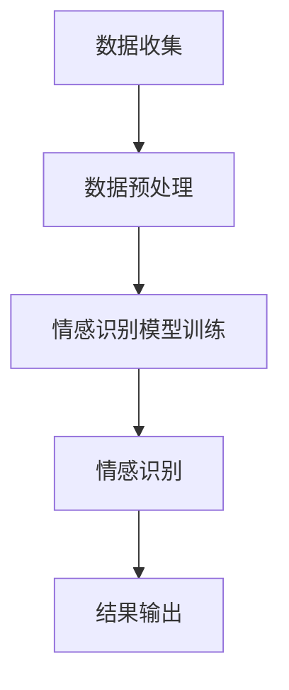

                 

# 具有情感的AI：新型犯罪的出现与预防

> 关键词：情感AI、新型犯罪、预防、法律框架、技术手段、社会策略

> 摘要：随着人工智能技术的发展，具有情感的AI逐渐成为现实。这种新型技术不仅带来了巨大的社会变革，也引发了一系列新型犯罪问题。本文将深入探讨情感AI的定义、技术原理及其在新型犯罪中的运用，分析情感AI犯罪的特点与挑战，并探讨预防这些犯罪的法律框架、技术手段和社会策略。

## 第一部分：引言与背景

### 1.1 具有情感的AI：一个新纪元的到来

#### 1.1.1 AI发展的新阶段

人工智能（AI）技术自诞生以来，经历了从规则驱动到知识驱动，再到数据驱动的三个主要阶段。近年来，随着深度学习、自然语言处理和计算机视觉等技术的发展，AI进入了具有情感的阶段。这一阶段不仅要求AI具备处理数据的能力，更要求其理解、表达和模拟人类情感。

#### 1.1.2 情感AI的定义与特点

情感AI是指能够识别、理解、表达和模拟人类情感的人工智能系统。其特点包括：

- **情感识别**：通过语音、文字、面部表情等多种方式识别用户的情感状态。
- **情感表达**：能够通过语言、动作、表情等方式表达情感。
- **情感模拟**：模仿人类的情感反应，与用户建立情感联系。

#### 1.1.3 情感AI的应用前景

情感AI在医疗、教育、金融、娱乐等多个领域具有广泛的应用前景。例如，在医疗领域，情感AI可以帮助医生更好地理解患者的情感状态，提高治疗效果；在教育领域，情感AI可以帮助教师更有效地与学生互动，提高教育质量。

### 1.2 新型犯罪的出现

#### 1.2.1 传统犯罪与新型犯罪

传统犯罪主要是指传统的刑事犯罪活动，如盗窃、抢劫、谋杀等。而新型犯罪则是随着科技发展而产生的一种犯罪形式，包括网络犯罪、金融犯罪等。新型犯罪具有以下特点：

- **隐蔽性**：利用网络等现代通信技术，犯罪行为更加隐蔽。
- **跨区域性**：犯罪活动跨越国界，涉及多个地区。
- **技术依赖性**：依赖于现代信息技术，如AI、区块链等。

#### 1.2.2 情感AI如何引发新型犯罪

情感AI技术的发展为犯罪分子提供了新的手段和工具。例如，犯罪分子可以利用情感AI进行网络诈骗，通过情感分析了解用户的情感状态，从而进行有针对性的诈骗。

#### 1.2.3 新型犯罪的特点与挑战

新型犯罪的特点包括：

- **高度智能化**：利用人工智能技术进行犯罪，使得犯罪行为更加复杂。
- **难以监控**：犯罪活动利用网络等现代通信技术，使得监控和追踪变得更加困难。
- **法律困境**：新型犯罪涉及新技术，现有法律体系难以有效监管。

### 1.3 预防新型犯罪的重要性

#### 1.3.1 社会影响与经济损失

新型犯罪对社会和经济造成了巨大的损失。例如，网络诈骗每年可能导致数百亿美元的经济损失。

#### 1.3.2 法律法规与道德规范

预防新型犯罪需要完善法律法规，并建立相应的道德规范，确保AI技术的健康发展。

#### 1.3.3 社会安全与个人隐私

新型犯罪威胁社会安全和个人隐私。预防新型犯罪有助于维护社会安全和保护个人隐私。

## 第二部分：情感AI技术解析

### 2.1 情感AI的核心概念

#### 2.1.1 情感计算

情感计算是情感AI的核心概念之一，它涉及如何让计算机识别、理解、表达和模拟人类情感。

#### 2.1.2 情感识别与表达

情感识别与表达是情感AI的两个重要功能。情感识别是指计算机如何从语音、文字、面部表情等数据中识别情感；情感表达是指计算机如何通过语言、动作、表情等方式表达情感。

#### 2.1.3 情感建模与预测

情感建模与预测是指如何利用机器学习技术建立情感模型，并使用该模型对用户的情感进行预测。

### 2.2 情感AI的技术原理

#### 2.2.1 神经网络与深度学习

神经网络与深度学习是情感AI的技术基础。它们通过模拟人脑神经元的工作方式，实现对数据的处理和分析。

#### 2.2.2 自然语言处理

自然语言处理是情感AI的重要组成部分，它涉及如何让计算机理解和处理自然语言。

#### 2.2.3 计算机视觉

计算机视觉是情感AI的另一重要技术，它涉及如何让计算机理解和分析图像和视频。

### 2.3 情感AI的实现方法

#### 2.3.1 数据收集与预处理

数据收集与预处理是情感AI实现的关键步骤，它包括收集大量情感数据，并对数据进行清洗、标注等处理。

#### 2.3.2 模型训练与优化

模型训练与优化是情感AI实现的核心步骤，它包括选择合适的模型，对模型进行训练和优化。

#### 2.3.3 模型评估与部署

模型评估与部署是情感AI实现的最后步骤，它包括评估模型的性能，并将模型部署到实际应用中。

### 2.4 情感AI的潜在风险

#### 2.4.1 情感误导与偏差

情感误导与偏差是情感AI的潜在风险之一，它可能导致AI产生错误的情感判断。

#### 2.4.2 情感滥用与伦理问题

情感滥用与伦理问题是情感AI面临的另一大挑战，它涉及如何确保AI在道德和伦理框架内运行。

#### 2.4.3 安全性与隐私保护

安全性与隐私保护是情感AI实现中的关键问题，它涉及如何确保AI系统的安全性，并保护用户的隐私。

## 第三部分：新型犯罪案例分析

### 3.1 网络诈骗与情感操控

#### 3.1.1 情感AI在网络诈骗中的应用

情感AI在网络诈骗中的应用日益广泛，犯罪分子利用情感AI识别用户的情感状态，从而进行有针对性的诈骗。

#### 3.1.2 情感操控的原理与手段

情感操控是指犯罪分子利用情感AI影响用户的情感状态，从而实现诈骗等犯罪行为。

#### 3.1.3 案例分析：诈骗短信与聊天机器人

通过分析诈骗短信和聊天机器人的案例，我们可以深入了解情感AI在网络诈骗中的应用和情感操控的手段。

### 3.2 网络恐怖主义与情感暴力

#### 3.2.1 情感AI在网络恐怖主义中的应用

情感AI在网络恐怖主义中的应用日益显著，犯罪分子利用情感AI制造和传播恐怖信息，煽动仇恨和暴力。

#### 3.2.2 情感暴力的特点与影响

情感暴力是指利用情感AI进行网络骚扰、侮辱、威胁等行为，对受害者造成心理和生理上的伤害。

#### 3.2.3 案例分析：网络仇恨言论与暴力行为

通过分析网络仇恨言论和暴力行为的案例，我们可以了解情感AI在网络恐怖主义和情感暴力中的应用和影响。

### 3.3 情感AI犯罪的社会影响

#### 3.3.1 社会秩序与道德观念的挑战

情感AI犯罪对社会秩序和道德观念提出了新的挑战，需要我们深入思考和应对。

#### 3.3.2 法律监管与伦理约束

法律监管与伦理约束是预防情感AI犯罪的关键，需要我们不断完善相关法律法规，并加强对AI技术的伦理约束。

#### 3.3.3 公共安全与个人隐私的保护

公共安全与个人隐私的保护是预防情感AI犯罪的重要任务，需要我们采取措施确保AI技术的安全性和隐私性。

## 第四部分：预防与对策

### 4.1 预防新型犯罪的法律框架

#### 4.1.1 现行法律的不足与挑战

现行法律在应对新型犯罪方面存在不足，需要我们进一步完善相关法律法规。

#### 4.1.2 国际合作与法律协调

国际合作与法律协调是预防新型犯罪的重要手段，需要我们加强国际间的合作与协调。

#### 4.1.3 法律体系的完善与更新

完善与更新法律体系是预防新型犯罪的关键，需要我们不断推动法律体系的完善与更新。

### 4.2 技术手段的运用

#### 4.2.1 情感AI监控与预警

情感AI监控与预警是预防新型犯罪的重要手段，通过实时监测和分析情感数据，发现潜在的犯罪行为。

#### 4.2.2 情感AI的伦理审查与监管

情感AI的伦理审查与监管是确保AI技术健康发展的关键，需要我们建立健全的伦理审查与监管机制。

#### 4.2.3 技术防御措施与技术对抗

技术防御措施与技术对抗是预防新型犯罪的重要策略，通过技术手段防范和对抗情感AI犯罪。

### 4.3 社会策略与公众教育

#### 4.3.1 公众对情感AI的认知与接受度

提高公众对情感AI的认知与接受度是预防新型犯罪的重要策略，需要我们加强公众教育。

#### 4.3.2 社会组织的参与与合作

社会组织的参与与合作是预防新型犯罪的重要力量，需要我们充分发挥社会组织的积极作用。

#### 4.3.3 教育与宣传的持续性与有效性

教育与宣传的持续性与有效性是预防新型犯罪的关键，需要我们不断推动教育和宣传工作的深入进行。

## 第五部分：未来展望

### 4.4.1 情感AI与犯罪预防的挑战与机遇

情感AI与犯罪预防面临着诸多挑战，同时也带来了新的机遇，需要我们积极应对。

### 4.4.2 情感AI技术的社会影响与伦理考量

情感AI技术的社会影响与伦理考量是未来需要重点关注的领域，需要我们深入研究和探讨。

### 4.4.3 社会安全与个人隐私的平衡与协调

社会安全与个人隐私的平衡与协调是未来需要努力实现的目标，需要我们采取有效的措施进行平衡与协调。

## 附录

### 5.1 情感AI相关资源与工具

#### 5.1.1 情感AI研究机构与论文

#### 5.1.2 开源情感AI工具与框架

#### 5.1.3 情感AI相关的书籍与教程

### 5.2 案例研究

#### 5.2.1 网络诈骗案例分析

#### 5.2.2 网络恐怖主义案例分析

#### 5.2.3 情感AI在犯罪预防中的成功案例

### 5.3 附录

#### 5.3.1 情感AI相关的Mermaid流程图

#### 5.3.2 情感AI核心算法的Python源代码

#### 5.3.3 数学模型与公式的latex代码示例

---

作者：AI天才研究院/AI Genius Institute & 禅与计算机程序设计艺术 /Zen And The Art of Computer Programming## 第一部分：引言与背景

### 1.1 具有情感的AI：一个新纪元的到来

#### 1.1.1 AI发展的新阶段

人工智能（AI）技术自诞生以来，经历了从规则驱动到知识驱动，再到数据驱动的三个主要阶段。在早期的规则驱动阶段，AI主要通过预设的规则和算法来解决问题，例如专家系统和逻辑推理。随着计算机性能的提升和数据量的增加，AI进入了知识驱动阶段，通过大量数据和知识库来支持决策和推理，如知识图谱和语义网络。而近年来，随着深度学习、自然语言处理和计算机视觉等技术的突破，AI进入了数据驱动阶段，通过大数据和机器学习算法实现自我学习和智能决策。

然而，传统的数据驱动AI仍然存在一定的局限性，它们往往只能处理结构化数据，难以理解人类情感和非结构化信息。随着人工智能技术的发展，研究者开始探索如何让AI具备情感智能，即能够识别、理解、表达和模拟人类情感。这一阶段被称为情感AI，标志着人工智能发展进入了一个新的纪元。

#### 1.1.2 情感AI的定义与特点

情感AI是指通过模拟人类情感过程，使计算机能够识别、理解、表达和模拟人类情感的人工智能系统。情感AI不同于传统的数据驱动AI，它不仅要处理数据，还要处理情感。情感AI的特点包括：

- **情感识别**：情感AI能够通过语音、文字、面部表情等多种渠道识别用户的情感状态。例如，通过分析用户的语音语调、文字表达和面部表情，情感AI可以判断用户是高兴、悲伤还是愤怒。

- **情感表达**：情感AI能够通过语言、动作、表情等方式表达情感。例如，当用户表达负面情感时，情感AI可以通过调整语气、表情和动作来安慰用户，或通过自动生成合适的回复来缓解用户情绪。

- **情感模拟**：情感AI能够模仿人类的情感反应，与用户建立情感联系。例如，在教育领域，情感AI可以模拟教师的情感表达，帮助学生建立积极的情感体验。

- **情感预测**：情感AI可以通过对历史数据的分析，预测用户的未来情感状态。例如，在医疗领域，情感AI可以通过分析患者的病历和情绪变化，预测患者可能的健康风险。

#### 1.1.3 情感AI的应用前景

情感AI在多个领域具有广泛的应用前景，不仅能够提高人工智能系统的用户体验，还能推动社会进步和经济发展。以下是一些典型应用场景：

- **医疗领域**：情感AI可以帮助医生更好地理解患者的情感状态，提高治疗效果。例如，通过分析患者的语音和面部表情，情感AI可以判断患者是否对治疗方案有疑虑或焦虑，从而提供个性化的心理支持。

- **教育领域**：情感AI可以帮助教师更有效地与学生互动，提高教育质量。例如，通过分析学生的情绪变化，情感AI可以提醒教师何时需要调整教学策略，或何时需要提供额外的情感支持。

- **金融领域**：情感AI可以帮助金融机构更好地了解客户需求，提供个性化服务。例如，通过分析客户的情绪和语言表达，情感AI可以判断客户是否对某个理财产品感兴趣，从而推荐合适的投资方案。

- **娱乐领域**：情感AI可以为用户提供更加个性化的娱乐体验。例如，通过分析用户的情绪和偏好，情感AI可以推荐合适的电影、音乐和游戏。

- **社交领域**：情感AI可以帮助人们建立更紧密的社交联系。例如，通过分析用户的情感状态，情感AI可以提醒用户何时需要与朋友或家人联系，以保持积极的社交状态。

总的来说，情感AI的应用前景非常广阔，它不仅能够提高人工智能系统的用户体验，还能为人类带来更多的便利和幸福感。

### 1.2 新型犯罪的出现

#### 1.2.1 传统犯罪与新型犯罪

传统犯罪主要是指那些在计算机和互联网出现之前就已经存在的犯罪行为，如盗窃、抢劫、谋杀等。这些犯罪行为通常以直接接触或物理手段进行，犯罪者通过直接的暴力或欺骗手段实现犯罪目的。

随着信息技术的发展，犯罪形式也发生了巨大的变化，新型犯罪逐渐兴起。新型犯罪主要是指利用计算机和互联网技术进行的犯罪活动，如网络诈骗、网络盗窃、网络恐怖主义等。这些犯罪行为通常具有以下特点：

- **隐蔽性**：新型犯罪利用网络作为犯罪载体，犯罪行为难以被发现和追踪。例如，网络诈骗分子可以隐藏在虚拟空间中，通过伪装身份和虚构事实来欺骗受害人。

- **跨国性**：新型犯罪往往涉及多个国家和地区，犯罪分子可以在全球范围内进行犯罪活动。例如，网络盗窃犯罪可能涉及多个国家的金融机构和用户。

- **技术依赖性**：新型犯罪依赖于先进的技术手段，如人工智能、区块链、物联网等。例如，网络恐怖主义分子可以利用AI技术生成虚假信息，煽动暴力行为。

#### 1.2.2 情感AI如何引发新型犯罪

情感AI技术的发展为犯罪分子提供了新的手段和工具，使得新型犯罪形式更加多样化。以下是情感AI如何引发新型犯罪的一些具体方式：

- **情感操纵**：情感AI可以识别和模拟人类情感，犯罪分子可以利用这一特性进行情感操纵。例如，通过分析受害人的语音和文字表达，情感AI可以判断受害人是否处于脆弱状态，然后利用情感操控手段诱骗受害人进行转账或提供个人信息。

- **定制化诈骗**：情感AI可以根据受害人的情感状态和行为习惯，定制化地生成诈骗信息。例如，情感AI可以通过分析受害人的社交媒体信息，了解其兴趣和情绪状态，然后生成有针对性的诈骗信息，提高诈骗成功率。

- **自动化犯罪**：情感AI可以自动化执行复杂的犯罪行为，减少犯罪成本。例如，利用情感AI，犯罪分子可以自动生成和发送诈骗邮件，自动处理受害人的回复，从而实现大规模的网络诈骗。

- **情感暴力**：情感AI可以用于实施情感暴力，对受害者进行心理和情感上的折磨。例如，犯罪分子可以利用情感AI生成虚假的情感表达，欺骗受害者，使其陷入长期的情感依赖和心理困境。

#### 1.2.3 新型犯罪的特点与挑战

新型犯罪与传统犯罪相比，具有以下特点：

- **高度智能化**：新型犯罪依赖于先进的技术手段，如人工智能、机器学习等，使得犯罪行为更加复杂和隐蔽。

- **跨区域性**：新型犯罪涉及多个国家和地区，犯罪分子可以在全球范围内进行犯罪活动，这增加了打击犯罪的难度。

- **技术依赖性**：新型犯罪依赖于计算机网络和互联网技术，犯罪分子可以利用这些技术进行犯罪活动，同时也可以利用这些技术逃避侦查和打击。

- **难以监控**：新型犯罪行为通常通过网络进行，犯罪活动难以被发现和追踪，这使得打击犯罪变得更加困难。

面对新型犯罪，我们面临以下挑战：

- **法律困境**：新型犯罪涉及新技术，现有法律体系难以有效监管。例如，如何界定和惩处利用AI进行的网络诈骗行为，如何保护受害人的隐私权等。

- **技术对抗**：犯罪分子可以利用AI技术进行犯罪，同时也可以利用AI技术逃避侦查和打击。这要求我们不断提升技术手段，建立有效的技术对抗策略。

- **公众教育**：新型犯罪形式多样，公众对新型犯罪的认知不足，容易成为犯罪分子的目标。因此，加强公众教育，提高公众的安全意识和防范能力，是预防新型犯罪的重要手段。

#### 1.3 预防新型犯罪的重要性

预防新型犯罪具有重要意义，具体体现在以下几个方面：

- **社会秩序**：新型犯罪对社会秩序造成了严重破坏，预防新型犯罪有助于维护社会稳定。

- **经济损失**：新型犯罪导致大量经济损失，预防新型犯罪可以减少经济损失。

- **个人隐私**：新型犯罪往往涉及个人隐私的泄露，预防新型犯罪有助于保护个人隐私。

- **法律完善**：预防新型犯罪有助于推动法律体系的完善，为打击新型犯罪提供法律依据。

### 1.3.1 社会影响与经济损失

新型犯罪对社会和经济造成了巨大的影响和损失。以下是一些具体表现：

- **社会影响**：新型犯罪对社会信任和公共安全构成了威胁。网络诈骗、网络盗窃等犯罪行为使得公众对网络环境的信任度降低，同时也使得人们对金融机构和电子商务的信任度受到影响。

- **经济损失**：新型犯罪导致大量经济损失。例如，网络诈骗每年可能导致数百亿美元的经济损失，网络盗窃可能涉及数百万个账户和数百万美元的资产。

- **个人隐私泄露**：新型犯罪往往涉及个人隐私的泄露，这可能导致个人身份被盗用，甚至引发更严重的犯罪行为。

### 1.3.2 法律法规与道德规范

预防新型犯罪需要完善的法律法规和道德规范。以下是一些关键点：

- **法律法规**：需要制定和完善与新型犯罪相关的法律法规，明确新型犯罪的法律责任和惩罚措施。例如，可以制定《网络犯罪法》来规范网络诈骗、网络盗窃等行为。

- **道德规范**：需要建立与新型犯罪相关的道德规范，指导AI技术的应用。例如，可以制定《人工智能伦理规范》，明确AI技术在情感识别、情感表达等方面的道德边界。

### 1.3.3 社会安全与个人隐私

预防新型犯罪需要关注社会安全和个人隐私。以下是一些具体措施：

- **社会安全**：加强网络安全防护，建立网络安全监测和预警系统，及时发现和应对新型犯罪行为。

- **个人隐私**：加强个人隐私保护，制定和完善个人隐私保护法律法规，建立个人隐私保护机制，防止个人隐私被泄露和滥用。

总之，预防新型犯罪是一项系统工程，需要社会各方共同努力，通过法律、技术和道德规范等多种手段，建立全方位的预防体系，保障社会安全和公众利益。

## 第二部分：情感AI技术解析

### 2.1 情感AI的核心概念

#### 2.1.1 情感计算

情感计算（Affective Computing）是情感AI的核心概念之一，它涉及如何让计算机识别、理解、表达和模拟人类情感。情感计算旨在使计算机具有情感意识，能够感知和处理人类的情感状态，从而更好地与人类互动。

情感计算的核心问题包括：

- **情感识别**：如何通过语音、文字、面部表情等多种方式识别用户的情感状态。

- **情感理解**：如何理解用户的情感状态，并将其转化为计算机可以处理的信息。

- **情感表达**：如何通过语言、动作、表情等方式表达情感，与用户建立情感联系。

- **情感模拟**：如何模拟人类的情感反应，为用户提供情感支持。

情感计算的应用场景非常广泛，包括但不限于：

- **医疗领域**：通过情感计算，医生可以更好地理解患者的情感状态，提供个性化的治疗方案和心理支持。

- **教育领域**：通过情感计算，教师可以更好地了解学生的学习情感，调整教学策略，提高教育质量。

- **金融领域**：通过情感计算，金融机构可以更好地了解客户需求，提供个性化的金融服务。

- **社交领域**：通过情感计算，社交平台可以提供更加人性化的用户体验，帮助用户建立情感联系。

#### 2.1.2 情感识别与表达

情感识别与表达是情感计算的两个重要组成部分。

- **情感识别**：情感识别是指计算机如何从语音、文字、面部表情等多种数据中识别用户的情感状态。情感识别的方法包括：

  - **语音识别**：通过分析语音的音调、音速、音量等特征，识别用户的情感状态。

  - **文字分析**：通过分析文字的情感词汇和语法结构，识别用户的情感状态。

  - **面部表情识别**：通过分析面部表情的动态变化，识别用户的情感状态。

情感识别的应用场景包括：

  - **客户服务**：通过情感识别，客服机器人可以更好地理解客户的需求，提供个性化的服务。

  - **心理健康**：通过情感识别，心理医生可以更好地了解患者的情感状态，提供针对性的治疗方案。

- **情感表达**：情感表达是指计算机如何通过语言、动作、表情等方式表达情感，与用户建立情感联系。情感表达的方法包括：

  - **自然语言生成**：通过生成合适的语言文本，表达计算机的情感状态。

  - **面部表情模拟**：通过模拟面部表情，表达计算机的情感状态。

  - **动作生成**：通过生成合适的动作，表达计算机的情感状态。

情感表达的应用场景包括：

  - **教育领域**：通过情感表达，教育机器人可以更好地与学生互动，提高教育质量。

  - **医疗领域**：通过情感表达，医疗机器人可以更好地与患者沟通，提供情感支持。

#### 2.1.3 情感建模与预测

情感建模与预测是情感计算的核心任务之一。情感建模是指如何建立情感模型，用于识别、理解和模拟情感。情感预测是指如何使用情感模型预测用户的未来情感状态。

情感建模的方法包括：

- **机器学习**：通过训练数据集，使用机器学习算法建立情感模型。

- **深度学习**：通过深度神经网络，建立复杂的情感模型。

情感预测的方法包括：

- **时间序列分析**：通过分析情感状态的时间序列，预测用户的未来情感状态。

- **概率模型**：通过建立概率模型，预测用户的未来情感状态。

情感建模与预测的应用场景包括：

- **医疗领域**：通过情感建模与预测，预测患者的情感状态，提供个性化的治疗方案。

- **教育领域**：通过情感建模与预测，预测学生的学习情感，调整教学策略。

- **金融领域**：通过情感建模与预测，预测客户的需求，提供个性化的金融服务。

### 2.2 情感AI的技术原理

#### 2.2.1 神经网络与深度学习

神经网络与深度学习是情感AI的技术基础。神经网络（Neural Networks）是一种模拟人脑神经元工作的计算模型，通过多层神经元结构实现数据的处理和转换。深度学习（Deep Learning）是神经网络的一种，通过增加网络层数，实现更复杂的特征提取和模式识别。

神经网络的工作原理包括：

- **输入层**：接收输入数据，并将其传递到下一层。

- **隐藏层**：对输入数据进行特征提取和变换，输出新的特征向量。

- **输出层**：根据隐藏层输出的特征向量，生成预测结果。

深度学习的工作原理包括：

- **卷积神经网络（CNN）**：通过卷积操作提取图像特征，广泛应用于计算机视觉领域。

- **循环神经网络（RNN）**：通过循环结构处理序列数据，广泛应用于自然语言处理和语音识别领域。

- **生成对抗网络（GAN）**：通过生成器和判别器之间的对抗训练，生成逼真的图像和语音。

神经网络与深度学习在情感AI中的应用包括：

- **情感识别**：通过训练神经网络模型，识别用户的情感状态。

- **情感表达**：通过训练神经网络模型，生成情感表达的语言文本、面部表情和动作。

- **情感预测**：通过训练神经网络模型，预测用户的未来情感状态。

#### 2.2.2 自然语言处理

自然语言处理（Natural Language Processing，NLP）是情感AI的重要组成部分，它涉及如何让计算机理解和处理自然语言。自然语言处理的主要任务包括：

- **文本分类**：根据文本内容将其分类到不同的类别，如情感分类、新闻分类等。

- **文本摘要**：从大量文本中提取关键信息，生成简洁的摘要。

- **命名实体识别**：从文本中识别出具有特定意义的实体，如人名、地名、组织名等。

- **机器翻译**：将一种语言的文本翻译成另一种语言。

自然语言处理的工作原理包括：

- **词向量表示**：将文本转换为计算机可以处理的数据，如词向量。

- **深度学习模型**：使用深度学习模型，如循环神经网络（RNN）、长短期记忆网络（LSTM）、变换器（Transformer）等，处理文本数据。

自然语言处理在情感AI中的应用包括：

- **情感分析**：通过自然语言处理技术，分析文本中的情感倾向，判断用户是高兴、悲伤还是愤怒。

- **对话系统**：通过自然语言处理技术，实现人机对话，理解用户需求，生成合适的回复。

- **内容推荐**：通过自然语言处理技术，分析用户的历史数据和偏好，推荐感兴趣的内容。

#### 2.2.3 计算机视觉

计算机视觉（Computer Vision）是情感AI的另一个重要组成部分，它涉及如何让计算机理解和处理图像和视频。计算机视觉的主要任务包括：

- **图像分类**：根据图像内容将其分类到不同的类别，如人脸识别、物体识别等。

- **图像分割**：将图像分割成不同的区域，如目标检测、图像分割等。

- **目标检测**：从图像中检测出特定目标，如人脸检测、行人检测等。

- **图像生成**：根据输入的图像生成新的图像，如风格迁移、图像修复等。

计算机视觉的工作原理包括：

- **卷积神经网络（CNN）**：通过卷积操作提取图像特征，广泛应用于图像分类、目标检测等任务。

- **深度学习模型**：使用深度学习模型，如生成对抗网络（GAN）、自编码器（Autoencoder）等，处理图像数据。

计算机视觉在情感AI中的应用包括：

- **情感识别**：通过分析面部表情、姿态等图像特征，识别用户的情感状态。

- **场景理解**：通过分析图像和视频内容，理解用户的情感状态和周围环境。

- **交互式系统**：通过分析用户的图像和视频行为，实现人机交互，理解用户需求。

### 2.3 情感AI的实现方法

#### 2.3.1 数据收集与预处理

数据收集与预处理是情感AI实现的关键步骤，它包括收集大量情感数据，并对数据进行清洗、标注等处理。以下是一些具体步骤：

- **数据收集**：收集包括语音、文本、图像等多种格式的情感数据。数据来源可以是公开数据集、社交媒体、在线调查等。

- **数据清洗**：删除数据中的噪声和异常值，如去除语音中的噪声，删除文本中的停用词等。

- **数据标注**：对情感数据标签进行标注，如将语音标记为高兴、悲伤等。

- **数据预处理**：将原始数据转换为适合机器学习的格式，如将文本转换为词向量，将图像转换为像素矩阵等。

#### 2.3.2 模型训练与优化

模型训练与优化是情感AI实现的核心步骤，它包括选择合适的模型，对模型进行训练和优化。以下是一些具体步骤：

- **模型选择**：选择合适的情感识别、情感表达或情感预测模型，如卷积神经网络（CNN）、循环神经网络（RNN）、变换器（Transformer）等。

- **模型训练**：使用训练数据集，使用训练算法，如梯度下降、随机梯度下降等，对模型进行训练。

- **模型优化**：通过调整模型参数，优化模型性能，如调整学习率、正则化参数等。

#### 2.3.3 模型评估与部署

模型评估与部署是情感AI实现的关键步骤，它包括评估模型的性能，并将模型部署到实际应用中。以下是一些具体步骤：

- **模型评估**：使用验证数据集，评估模型性能，如准确率、召回率、F1值等。

- **模型部署**：将训练好的模型部署到实际应用中，如客户端应用程序、服务器应用程序等。

- **模型更新**：根据用户反馈和实际应用情况，对模型进行更新和优化。

### 2.4 情感AI的潜在风险

#### 2.4.1 情感误导与偏差

情感误导与偏差是情感AI的潜在风险之一。由于情感计算依赖于大量的数据和学习算法，模型的性能和预测结果可能受到数据偏差和算法偏差的影响。以下是一些具体问题：

- **数据偏差**：如果训练数据集存在偏差，模型可能会学习到错误的情感模式。例如，如果训练数据集中多数样本的情感标签是正面的，模型可能会对负面情感识别不准确。

- **算法偏差**：学习算法本身可能存在偏差，导致模型对某些情感类型的识别不准确。例如，某些机器学习算法可能对复杂的情感识别任务表现不佳。

- **情感误导**：情感AI可能会误导用户，使其对情感状态产生误解。例如，情感AI可能会错误地识别用户的情感状态，导致用户提供错误的信息。

#### 2.4.2 情感滥用与伦理问题

情感滥用与伦理问题是情感AI面临的另一大挑战。由于情感AI能够识别和模拟人类情感，犯罪分子可能会利用这一特性进行恶意行为。以下是一些具体问题：

- **情感操控**：犯罪分子可能会利用情感AI操控用户的情感状态，进行网络诈骗、网络恐怖主义等活动。例如，通过情感操控，诈骗分子可以欺骗用户转账或提供个人信息。

- **隐私泄露**：情感AI可能泄露用户的隐私信息，例如通过分析用户的语音和文本表达，获取用户的个人隐私。

- **伦理问题**：情感AI的伦理问题包括如何确保其符合道德和法律规范，如何处理可能出现的负面社会影响。例如，如何避免情感AI被用于歧视、仇恨言论传播等。

#### 2.4.3 安全性与隐私保护

安全性与隐私保护是情感AI实现中的关键问题。由于情感AI涉及到大量的个人数据，如何确保数据的安全性和用户的隐私保护是重要的考虑因素。以下是一些具体问题：

- **数据安全**：如何确保存储和传输的数据不被未授权访问和篡改。例如，可以使用加密技术来保护数据安全。

- **隐私保护**：如何保护用户的隐私，避免数据泄露和滥用。例如，可以采用数据匿名化、隐私保护算法等技术。

- **用户同意**：如何确保用户在数据收集和使用过程中有充分的知情权和选择权。例如，可以在数据收集前告知用户数据用途和隐私保护措施。

总之，情感AI的发展带来了巨大的机遇，同时也伴随着一系列潜在风险。为了确保情感AI的健康发展，我们需要关注这些潜在风险，并采取有效的措施进行预防和应对。

### 3.1 网络诈骗与情感操控

#### 3.1.1 情感AI在网络诈骗中的应用

情感AI在当前的网络诈骗中发挥着越来越重要的作用。犯罪分子利用情感AI技术，可以更加精准地识别受害人的情感状态，从而实施有针对性的诈骗行为。以下是一些具体应用场景：

1. **情感识别**：情感AI可以通过分析受害人的语音、文字和面部表情，识别其当前的情感状态，如愤怒、焦虑、悲伤等。这有助于犯罪分子了解受害人的情绪，从而选择合适的诈骗手段。

2. **情感操控**：情感AI可以通过情感操控手段，如调整语气、节奏和语调，来影响受害人的情感状态。例如，诈骗分子可能会使用温柔的语气和安慰的语言，来减轻受害人的焦虑情绪，使其更容易上当受骗。

3. **定制化诈骗**：情感AI可以根据受害人的情感状态和个性特点，定制化地生成诈骗信息。例如，如果情感AI识别到受害人正处于焦虑状态，可能会发送一条关于“紧急医疗援助”的诈骗短信，以诱骗受害人提供个人信息或转账。

4. **自动化诈骗**：情感AI可以自动化地执行复杂的诈骗行为，如发送诈骗邮件、拨打电话等。这大大提高了诈骗的成功率，同时减少了犯罪成本。

#### 3.1.2 情感操控的原理与手段

情感操控是指利用情感AI技术，通过分析受害人的情感状态，并采取相应的手段来影响其情感反应。以下是情感操控的原理和手段：

1. **情感分析**：通过情感分析技术，对受害人的语音、文字和面部表情进行分析，识别其情感状态。常用的情感分析技术包括自然语言处理（NLP）、语音识别（ASR）和面部表情识别。

2. **情感建模**：通过情感建模技术，建立情感模型，预测受害人的情感状态。这有助于犯罪分子了解受害人的情绪变化，从而采取相应的情感操控手段。

3. **情感引导**：通过情感引导技术，如调整语气、节奏和语调，来影响受害人的情感反应。例如，使用温柔的语气和安慰的语言，来减轻受害人的焦虑情绪。

4. **情感暗示**：通过情感暗示技术，如使用特定的词汇和表达方式，来引导受害人的情感反应。例如，使用“紧急”、“危机”等词汇，来激发受害人的恐惧和焦虑情绪。

5. **情感反馈**：通过情感反馈技术，如实时监控受害人的情感状态，并根据其反应调整诈骗手段。这有助于犯罪分子在诈骗过程中保持优势，提高诈骗成功率。

#### 3.1.3 案例分析：诈骗短信与聊天机器人

以下是一个具体的案例分析，展示了情感AI在网络诈骗中的应用：

案例：受害人张女士收到一条短信，称其孩子在国外发生交通事故，需要紧急汇款进行医疗救治。短信中附带了一个银行账户，要求张女士尽快转账。

1. **情感识别**：犯罪分子通过情感AI技术，分析张女士的通话记录和社交媒体信息，发现她近期可能因孩子在国外留学而感到焦虑和担忧。

2. **情感操控**：犯罪分子利用情感AI技术，调整短信的语气和内容，使其更加紧急和紧迫。短信中使用了“紧急救治”、“时间紧迫”等词汇，以激发张女士的恐惧和焦虑情绪。

3. **定制化诈骗**：犯罪分子根据张女士的情感状态，定制化地生成诈骗短信。短信中提到了孩子具体的交通事故细节，以及需要转账的金额和账户信息。

4. **情感反馈**：犯罪分子通过情感AI技术，实时监控张女士的短信回复，并根据其反应调整诈骗手段。例如，如果张女士询问更多关于孩子的信息，犯罪分子会继续提供详细的虚假信息，以增强其信任感。

5. **成功转账**：在情感AI的辅助下，犯罪分子成功诱导张女士向指定账户转账了一笔巨款。

通过这个案例，我们可以看到情感AI在诈骗短信中的强大作用。犯罪分子利用情感AI技术，不仅可以识别受害人的情感状态，还可以根据情感状态定制化地生成诈骗信息，提高诈骗成功率。

### 3.2 网络恐怖主义与情感暴力

#### 3.2.1 情感AI在网络恐怖主义中的应用

随着情感AI技术的不断发展，网络恐怖主义分子也在尝试利用这一技术来实施更为复杂和隐蔽的恐怖活动。情感AI在网络恐怖主义中的应用主要体现在以下几个方面：

1. **情感分析**：网络恐怖主义分子利用情感AI技术，对社交媒体、网络论坛等平台上的用户情感进行分析，识别出潜在的支持者或易受煽动的人群。这种分析有助于恐怖分子筛选出容易被操纵的个体，进一步扩大其影响力。

2. **情感操控**：通过网络传播的仇恨言论、虚假信息等，网络恐怖主义分子利用情感AI技术，操纵用户的情感反应，激发其愤怒、仇恨等负面情绪。这种情感操控手段可以帮助恐怖分子在短时间内煽动大量用户，制造社会恐慌。

3. **情感引导**：情感AI技术可以实时分析用户的情感状态，并生成相应的情感引导信息。网络恐怖主义分子利用这一技术，通过情感引导来控制用户的思维和行为，使其产生极端思想，甚至参与恐怖活动。

4. **情感建模**：通过大规模的数据收集和情感分析，网络恐怖主义分子可以建立情感模型，预测用户的未来情感状态。这种预测有助于恐怖分子制定更为精准的行动计划，提高恐怖活动的成功率。

#### 3.2.2 情感暴力的特点与影响

情感暴力是指利用情感AI技术，对受害者进行心理和情感上的折磨和伤害。与传统的身体暴力不同，情感暴力主要通过语言、文字、表情等方式进行，具有以下特点：

1. **隐蔽性**：情感暴力通常在虚拟空间中进行，犯罪行为难以被发现和追踪。这使得犯罪分子可以长期、反复地对受害者进行心理和情感上的折磨。

2. **持续性**：情感暴力不是一次性事件，而是持续性的心理和情感折磨。受害者可能会长期受到情感暴力的困扰，导致严重的心理和生理问题。

3. **不可见性**：情感暴力的伤害通常不会在身体上留下明显痕迹，这使得受害者很难向外界寻求帮助。

情感暴力的负面影响包括：

1. **心理健康问题**：情感暴力可能导致受害者出现焦虑、抑郁、失眠等心理健康问题，严重时甚至可能导致精神崩溃。

2. **社会关系破裂**：情感暴力会破坏受害者的社会关系，使其失去朋友和亲人的支持。

3. **生活品质下降**：情感暴力会影响受害者的生活品质，使其在学业、工作和生活中遭受挫折。

#### 3.2.3 案例分析：网络仇恨言论与暴力行为

以下是一个具体的案例分析，展示了情感AI在网络恐怖主义和情感暴力中的应用：

案例：一个极端主义的网络论坛上，活跃着一群网络恐怖主义分子。他们利用情感AI技术，分析社交媒体上的用户情感，识别出潜在的支持者。通过情感操控和情感引导，他们发布一系列仇恨言论和虚假信息，煽动用户的愤怒和仇恨情绪。

1. **情感分析**：网络恐怖主义分子通过情感AI技术，分析社交媒体上的用户情感，识别出那些具有愤怒、仇恨情绪的用户。这些用户被认为更容易被操纵和支持极端主义思想。

2. **情感操控**：网络恐怖主义分子利用情感AI技术，发布一系列仇恨言论和虚假信息。这些信息旨在激发用户的愤怒和仇恨情绪，使其支持极端主义行动。

3. **情感引导**：网络恐怖主义分子通过情感AI技术，实时监控用户的情感反应，并根据反应调整言论策略。例如，如果用户对某个话题表现出愤怒情绪，恐怖分子会进一步煽动，发布更多相关言论。

4. **影响扩大**：通过情感AI技术的辅助，网络恐怖主义分子成功地在社交媒体上煽动了一大批愤怒的年轻人。这些年轻人被引导参与暴力行为，甚至策划了多起恐怖袭击事件。

另一方面，情感AI也被用于实施情感暴力。以下是一个具体案例：

案例：一个年轻女孩小芳，在网络社交平台上结识了一个网友。这个网友利用情感AI技术，对小芳进行情感操控和情感暴力。

1. **情感分析**：网友通过情感AI技术，分析小芳的社交媒体信息，识别出她的情感状态和需求。

2. **情感操控**：网友利用情感AI技术，通过发送针对性的信息，如安慰、关心等，逐渐赢得小芳的信任和依赖。

3. **情感引导**：网友通过情感AI技术，实时监控小芳的情感反应，并根据反应调整信息内容。例如，如果小芳表现出负面情绪，网友会发送更多安慰信息，以保持其依赖性。

4. **情感暴力**：随着依赖性的加深，网友开始利用情感AI技术，对小芳进行情感暴力。他不断发送威胁、侮辱等信息，使小芳感到焦虑、恐惧和绝望。

5. **心理崩溃**：小芳在网友的情感暴力下，逐渐失去了自信和生活勇气，最终导致心理崩溃。

通过这两个案例，我们可以看到情感AI在网络恐怖主义和情感暴力中的潜在危害。为了防止这种情况的发生，我们需要加强对情感AI技术的监管，同时提高公众的网络安全意识，以共同应对这一挑战。

### 3.3 情感AI犯罪的社会影响

#### 3.3.1 社会秩序与道德观念的挑战

情感AI犯罪对社会秩序和道德观念构成了严重挑战。首先，情感AI犯罪使得社会秩序更加复杂。传统的犯罪手段通常是在物理空间内进行的，而情感AI犯罪则利用网络和虚拟空间，使得犯罪行为更加隐蔽和难以追踪。这种复杂性不仅增加了执法部门的打击难度，也使得社会公众对网络环境的安全感降低。

其次，情感AI犯罪对道德观念提出了新的挑战。情感AI犯罪利用情感识别和操控技术，可以精确地影响个体的情感状态，导致其做出违背道德和法律的行为。例如，网络诈骗分子通过情感操控，使受害者相信虚假信息，从而骗取其财产。这不仅损害了个体的利益，也侵蚀了社会信任和道德底线。

#### 3.3.2 法律监管与伦理约束

为了有效应对情感AI犯罪，法律监管和伦理约束是必不可少的。首先，法律监管需要跟上情感AI技术的发展。现有的法律法规在应对传统犯罪方面已经相对完善，但面对情感AI犯罪，许多现有法律显得不够健全和具体。例如，如何界定和惩处利用情感AI进行的网络诈骗、网络恐怖主义等行为，需要法律明确具体的规定。

其次，伦理约束也是防止情感AI犯罪的重要手段。情感AI技术在带来便利的同时，也带来了伦理挑战。例如，如何确保情感AI系统的公正性、透明性和安全性，避免其被用于不当目的，这些都是需要伦理学者和技术专家共同探讨的问题。

为了实现有效的法律监管和伦理约束，以下是一些建议：

- **完善法律法规**：制定和完善与情感AI犯罪相关的法律法规，明确犯罪行为的法律责任和惩罚措施。

- **加强国际合作**：情感AI犯罪具有跨国性特点，需要加强国际合作，共同打击跨国情感AI犯罪。

- **建立伦理审查机制**：在情感AI的研发和应用过程中，建立伦理审查机制，确保技术符合道德和法律标准。

- **公众教育和宣传**：通过公众教育和宣传，提高社会公众对情感AI犯罪的认知和防范意识。

#### 3.3.3 公共安全与个人隐私的保护

情感AI犯罪不仅对社会秩序和道德观念构成挑战，也对公共安全和个人隐私带来了威胁。首先，情感AI犯罪可能侵犯个人隐私。例如，犯罪分子可以通过情感AI技术获取用户的个人情感状态，进而窃取其隐私信息，如银行账户、身份证号等。

其次，情感AI犯罪可能对公共安全构成威胁。例如，网络恐怖主义分子利用情感AI技术，可以煽动大量用户参与暴力行为，导致社会动荡和安全问题。

为了保护公共安全和个人隐私，以下是一些建议：

- **加强数据保护**：制定严格的数据保护政策，确保用户数据的收集、存储和使用过程符合隐私保护要求。

- **隐私保护技术**：采用隐私保护技术，如数据加密、匿名化处理等，防止情感AI犯罪分子获取和滥用用户数据。

- **安全监控和预警**：建立情感AI安全监控和预警系统，实时监控和分析情感AI系统的运行状态，及时发现和防范潜在的安全威胁。

- **公众参与**：鼓励公众参与情感AI犯罪的防范工作，提高社会对情感AI犯罪的认知和警惕性。

总之，情感AI犯罪对社会秩序、道德观念、公共安全和个人隐私带来了新的挑战。为了有效应对这些挑战，我们需要完善法律法规，加强伦理约束，提高公众教育和宣传，同时加强技术手段，确保公共安全和个人隐私的保护。

### 4.1 预防新型犯罪的法律框架

#### 4.1.1 现行法律的不足与挑战

随着情感AI技术的发展，现行法律在应对新型犯罪方面显现出诸多不足与挑战。首先，许多国家在制定相关法律时并未预见到情感AI犯罪的可能性，导致现有法律在应对这类犯罪时缺乏明确的法律条文和操作指南。例如，网络诈骗和恐怖主义犯罪在传统法律中已有一定的规制，但针对利用情感AI实施的新型犯罪，现有法律往往无法提供具体的打击措施。

其次，法律执行过程中也存在一些问题。例如，跨国性是情感AI犯罪的一大特点，而国际法律合作和协调机制尚不完善，导致犯罪分子可以在多个司法管辖区之间逃避追捕。此外，情感AI技术的复杂性和隐蔽性使得证据收集和犯罪侦破变得更加困难。

为应对这些不足与挑战，以下是一些具体措施：

- **完善立法**：针对情感AI犯罪的特点，完善相关法律法规，明确犯罪行为的定义和处罚标准。例如，可以制定《情感AI犯罪法》，对利用情感AI进行的网络诈骗、网络恐怖主义等行为进行法律规制。

- **加强国际合作**：推动国际法律合作，建立跨国法律协调机制，提高跨国犯罪打击的效率。例如，可以建立国际刑事司法网络，加强各国执法机构的合作和信息共享。

#### 4.1.2 国际合作与法律协调

国际合作与法律协调是应对情感AI犯罪的关键。情感AI犯罪具有跨国性特点，单一国家的法律体系难以独立应对。因此，国际合作与法律协调显得尤为重要。

以下是国际合作与法律协调的具体措施：

- **信息共享**：各国执法机构应建立信息共享机制，实时交换与情感AI犯罪相关的情报和证据。例如，可以建立全球性的犯罪情报数据库，存储和共享相关数据。

- **联合执法**：各国执法机构应加强联合执法行动，共同打击跨国情感AI犯罪。例如，可以开展跨国联合调查，共同追捕和惩处犯罪分子。

- **法律协调**：各国应推动法律协调，制定统一的情感AI犯罪法律标准和操作规程。例如，可以建立国际法律合作框架，制定跨国情感AI犯罪的法律规范。

#### 4.1.3 法律体系的完善与更新

为有效应对情感AI犯罪，法律体系需要不断完善与更新。以下是完善与更新法律体系的具体措施：

- **立法前瞻性**：在制定法律时，应具备前瞻性，预见到未来可能出现的新型犯罪形式。例如，在制定《情感AI犯罪法》时，应考虑到未来可能出现的新型诈骗手段和犯罪行为。

- **技术规范**：制定与情感AI技术相关的技术规范和操作指南，明确情感AI系统的合法应用范围和监管要求。例如，可以制定《情感AI技术应用规范》，对情感AI系统的开发、部署和使用进行详细规定。

- **司法培训**：加强对执法人员的司法培训，提高其应对情感AI犯罪的能力。例如，可以组织专门的培训课程，介绍情感AI技术的基本原理和应用场景，以及相关的法律知识和执法技巧。

通过完善法律体系，加强国际合作与法律协调，我们可以更有效地预防和打击情感AI犯罪，保障社会秩序和公共安全。

### 4.2 技术手段的运用

#### 4.2.1 情感AI监控与预警

情感AI监控与预警是预防新型犯罪的重要技术手段。通过情感AI监控，可以实时监测和分析网络行为，及时发现潜在的犯罪行为。以下是情感AI监控与预警的具体应用：

1. **网络行为监控**：利用情感AI技术，对网络行为进行实时监控，识别出异常行为模式。例如，通过分析用户的社交媒体活动、电子邮件通信等，发现潜在的诈骗、网络恐怖主义等犯罪行为。

2. **情感状态分析**：通过情感AI技术，分析用户的情感状态，识别出情绪异常的用户。例如，通过分析用户的语音、文字和面部表情，判断用户是否处于焦虑、愤怒等负面情绪，从而预测其可能的犯罪行为。

3. **预警机制**：建立情感AI预警机制，实时推送预警信息。例如，当检测到用户情感状态异常或网络行为异常时，立即向相关部门或用户本人发送预警信息，提醒其注意安全。

4. **自动化处理**：利用情感AI技术，实现自动化处理和响应。例如，当检测到潜在的犯罪行为时，自动触发相应的应对措施，如冻结相关账户、通知警方等。

#### 4.2.2 情感AI的伦理审查与监管

情感AI的伦理审查与监管是确保其合法、安全和道德应用的重要环节。以下是情感AI伦理审查与监管的具体措施：

1. **伦理规范**：制定情感AI伦理规范，明确其在应用中的道德边界和行为准则。例如，可以制定《情感AI伦理准则》，规定情感AI系统在情感识别、情感表达等方面的道德要求。

2. **审查机制**：建立情感AI审查机制，对情感AI系统的研发、部署和使用过程进行严格审查。例如，可以设立专门的伦理审查委员会，对情感AI项目进行伦理评估，确保其符合伦理规范。

3. **监管机构**：设立独立的监管机构，负责对情感AI系统的运行进行监督和管理。例如，可以建立情感AI监管局，制定监管政策和标准，对违规行为进行处罚。

4. **公众参与**：鼓励公众参与情感AI的伦理审查与监管，提高透明度和公信力。例如，可以设立公众咨询委员会，听取公众意见，制定符合社会需求的伦理规范和监管政策。

#### 4.2.3 技术防御措施与技术对抗

技术防御措施与技术对抗是预防新型犯罪的重要策略。以下是技术防御措施与技术对抗的具体应用：

1. **加密技术**：采用加密技术，保护用户数据和隐私。例如，对用户数据进行加密存储和传输，防止数据泄露和滥用。

2. **防火墙和入侵检测系统**：部署防火墙和入侵检测系统，防止外部攻击和内部泄露。例如，设置网络安全防线，实时监控网络流量，检测和阻止异常访问和攻击行为。

3. **行为分析**：利用行为分析技术，识别和防范异常行为。例如，通过分析用户的行为模式，发现和阻止异常访问、数据泄露等行为。

4. **技术对抗**：采用技术对抗手段，反击和抵御犯罪行为。例如，利用AI技术，生成和传播虚假信息，迷惑和误导犯罪分子，使其行为失效。

通过情感AI监控与预警、伦理审查与监管以及技术防御措施与技术对抗，我们可以构建全方位的预防体系，有效预防和打击情感AI犯罪。

### 4.3 社会策略与公众教育

#### 4.3.1 公众对情感AI的认知与接受度

公众对情感AI的认知与接受度是预防新型犯罪的重要基础。随着情感AI技术的快速发展，公众对其认知逐渐加深，但还存在一些认知偏差和担忧。以下是一些具体措施：

1. **提升认知**：通过公众教育、宣传活动等，提高公众对情感AI的认知。例如，可以通过举办讲座、发布科普文章等方式，向公众普及情感AI的基本概念、应用场景和安全措施。

2. **消除担忧**：针对公众的担忧，进行有针对性的解释和科普。例如，针对隐私泄露和伦理问题，解释情感AI技术在数据保护和伦理规范方面的措施，增强公众的信任感。

3. **增强信心**：通过展示情感AI在提升生活质量、改善社会服务等方面的积极影响，增强公众对情感AI的信心。例如，可以通过实际案例，展示情感AI在医疗、教育、金融等领域的应用成果。

#### 4.3.2 社会组织的参与与合作

社会组织的参与与合作是预防新型犯罪的重要力量。以下是一些具体措施：

1. **建立联盟**：推动政府、企业、学术界和社会组织之间的合作，建立情感AI犯罪预防联盟。例如，可以成立情感AI安全联盟，共同研究和应对情感AI犯罪。

2. **资源共享**：促进各方资源的共享，提高整体预防能力。例如，政府可以提供资金和技术支持，企业可以提供数据和技术资源，学术界可以提供研究成果和人才支持。

3. **联合培训**：组织联合培训，提高各方在情感AI犯罪预防方面的专业能力。例如，可以开展执法培训、企业培训等，提升执法人员的执法技能和企业的安全防护能力。

#### 4.3.3 教育与宣传的持续性与有效性

教育与宣传的持续性与有效性是预防新型犯罪的关键。以下是一些具体措施：

1. **制定长期规划**：制定长期的教育与宣传规划，确保活动的持续性和系统性。例如，可以制定《情感AI安全宣传教育规划》，明确教育目标和宣传内容。

2. **创新宣传手段**：采用多样化的宣传手段，提高教育的吸引力和效果。例如，可以通过社交媒体、在线课程、公益广告等方式，开展互动式教育和宣传。

3. **公众参与**：鼓励公众参与教育与宣传活动，提高其主动性和积极性。例如，可以组织公众讨论会、知识竞赛等，增强公众对情感AI安全的认知和参与度。

4. **评估与改进**：定期评估教育与宣传活动的效果，根据评估结果进行改进。例如，可以开展问卷调查、用户反馈等，收集公众的意见和建议，优化教育内容和方式。

通过提升公众对情感AI的认知与接受度，加强社会组织之间的合作，以及持续有效的教育与宣传，我们可以构建起全社会共同预防情感AI犯罪的坚固防线。

### 4.4 未来展望

#### 4.4.1 情感AI与犯罪预防的挑战与机遇

随着情感AI技术的不断发展，其在犯罪预防中的应用也面临着诸多挑战与机遇。首先，情感AI技术具有高度智能化和自动化特点，这为犯罪预防提供了新的手段和工具，例如，通过情感识别和分析，可以实时监测和预警潜在的犯罪行为。然而，这也带来了新的挑战，例如，情感AI系统可能被犯罪分子利用，通过情感操纵等手段实施更加复杂和隐蔽的犯罪行为。

其次，情感AI技术的快速发展也对法律法规和伦理规范提出了新的要求。现有的法律法规和伦理规范可能无法完全覆盖和监管情感AI的应用，需要不断更新和完善，以应对新的犯罪形式和伦理问题。

#### 4.4.2 情感AI技术的社会影响与伦理考量

情感AI技术的社会影响深远，其不仅改变了人们的生活方式，也对社会结构和伦理观念产生了重大影响。在社会层面，情感AI技术的应用有助于提高公共服务质量，增强社会治理能力，例如，在医疗、教育、金融等领域，情感AI可以为用户提供更加个性化和高效的解决方案。然而，这也引发了一系列伦理问题，例如，情感AI是否会导致隐私泄露、是否会被用于歧视和偏见等。

为了确保情感AI技术的健康和可持续发展，我们需要在技术、法律和伦理等方面进行深入研究和探讨。具体而言，以下是一些关键点：

- **数据隐私保护**：在开发和应用情感AI技术时，应严格遵守数据隐私保护法规，采取有效的数据加密和匿名化措施，确保用户数据的安全和隐私。

- **伦理审查机制**：建立情感AI伦理审查机制，对情感AI系统的设计、开发和使用过程进行伦理评估，确保其符合道德和法律标准。

- **透明性和可解释性**：提高情感AI系统的透明性和可解释性，使公众能够理解其工作原理和决策过程，增强对情感AI技术的信任。

- **公众参与**：鼓励公众参与情感AI技术的发展和应用，通过公众咨询和反馈，确保技术符合社会需求和伦理标准。

#### 4.4.3 社会安全与个人隐私的平衡与协调

在情感AI技术快速发展的大背景下，如何平衡社会安全与个人隐私成为了一个关键问题。一方面，情感AI技术为犯罪预防提供了强大的工具，有助于维护社会安全和秩序。另一方面，情感AI技术也可能侵犯个人隐私，导致数据泄露和滥用。

为了实现社会安全与个人隐私的平衡，我们需要采取以下措施：

- **隐私保护法规**：制定和实施严格的隐私保护法规，明确情感AI技术在数据收集、存储和使用过程中的隐私保护要求。

- **技术防护措施**：采用先进的技术防护措施，如数据加密、匿名化处理等，确保用户数据的安全和隐私。

- **隐私权教育**：加强公众对隐私权的教育和宣传，提高公众的隐私保护意识和能力。

- **透明度与问责制**：建立透明度和问责制，对情感AI系统的运行过程进行监督和评估，确保其符合隐私保护要求。

通过技术手段、法律保障和公众教育等多方面的努力，我们可以实现社会安全与个人隐私的平衡与协调，确保情感AI技术的健康发展。

### 5.1 情感AI相关资源与工具

#### 5.1.1 情感AI研究机构与论文

情感AI是一个快速发展的研究领域，全球有许多知名的研究机构和学者在这一领域进行了深入的研究。以下是一些著名的情感AI研究机构与论文：

- **麻省理工学院（MIT）**：MIT的媒体实验室（Media Lab）在情感AI领域有着深入的研究，相关论文包括“ affective computing: A review”等。

- **斯坦福大学（Stanford University）**：斯坦福大学的人工智能实验室（AI Lab）也在情感AI方面有着丰富的成果，相关论文包括“Emotional Sensing for Human-AI Interaction”等。

- **加州大学伯克利分校（UC Berkeley）**：伯克利人工智能研究（BAIR）实验室在情感AI领域也有许多重要论文，如“EmoReact: Real-Time Emotion Detection for Digital Characters”等。

- **牛津大学（University of Oxford）**：牛津大学的计算机科学系在情感AI领域也有丰富的论文发表，如“Emotion Recognition from Speech Using Neural Networks”等。

#### 5.1.2 开源情感AI工具与框架

开源情感AI工具和框架为研究人员和开发者提供了强大的工具，以下是一些著名的开源情感AI工具和框架：

- **OpenSMILE**：OpenSMILE是一个开源的情感计算工具，主要用于语音情感识别。它提供了丰富的情感分析模型和工具，支持多种情感类别和情感强度分析。

- **Affectiva**：Affectiva提供了丰富的情感识别API，支持面部表情、语音情感和文本情感识别。其OpenFace工具可以用于面部表情识别，而OpenVox和OpenVBX分别用于语音情感和视频情感识别。

- **EmoPy**：EmoPy是一个Python库，用于文本情感分析，支持多种情感分类算法和情感词典。

- **PyAffectiva**：PyAffectiva是Affectiva的情感识别API的Python封装库，方便开发者集成和使用Affectiva的情感识别功能。

#### 5.1.3 情感AI相关的书籍与教程

对于希望深入了解情感AI的研究人员和开发者，以下是一些推荐的书籍和教程：

- **《情感计算：技术与应用》**：这本书详细介绍了情感计算的基本概念、技术原理和应用案例，适合初学者和有一定基础的研究者。

- **《情感识别与模拟：基于机器学习的方法》**：这本书侧重于情感识别和模拟的机器学习方法，包括情感分类、情感强度识别和情感生成等。

- **《情感AI：技术与伦理》**：这本书从技术和伦理两个角度探讨了情感AI的发展，涵盖了情感识别、情感模拟、伦理问题等方面的内容。

- **《自然语言处理与情感分析》**：这本书介绍了自然语言处理的基本方法，特别是情感分析的技术和算法，包括文本分类、情感极性分析等。

- **在线教程**：许多在线平台，如Coursera、edX和Udacity等，提供了情感AI相关的课程和教程，涵盖了从基础概念到高级技术的全面内容。

通过利用这些资源与工具，研究人员和开发者可以深入了解情感AI，探索其在实际应用中的可能性，并为应对新型犯罪提供技术支持。

### 5.2 案例研究

#### 5.2.1 网络诈骗案例分析

**案例背景**：

近年来，网络诈骗案件频发，诈骗手段日益多样和复杂。犯罪分子利用情感AI技术，通过情感识别和操控，实施有针对性的网络诈骗，给公众带来了巨大的经济损失和心理困扰。

**情感AI技术应用**：

1. **情感识别**：诈骗分子通过情感AI技术，分析受害人的语音、文字和面部表情，识别其情感状态。例如，通过语音识别技术，分析受害人的语音语调，判断其是否处于焦虑、愤怒或困惑状态。

2. **情感操控**：诈骗分子利用情感操控技术，通过调整语气、节奏和语调，影响受害人的情感反应。例如，诈骗分子可能会使用温柔的语气和安慰的语言，缓解受害人的焦虑情绪，使其更容易上当受骗。

3. **定制化诈骗**：诈骗分子根据受害人的情感状态和行为习惯，定制化地生成诈骗信息。例如，通过情感分析技术，了解受害人的兴趣爱好和情感状态，诈骗分子可以生成更具吸引力和可信度的诈骗信息。

**案例分析**：

**案例1**：受害人李先生收到一封电子邮件，称其赢得了一项高额奖金。邮件中附带了一个链接，要求李先生点击确认。李先生点击链接后，被引导填写个人信息和银行卡信息。在这个过程中，诈骗分子通过情感AI技术，分析李先生的语音和文字表达，判断其是否处于激动和兴奋状态。如果李先生的情感状态符合预期，诈骗分子会继续发送类似邮件，诱导其填写更多个人信息。

**案例2**：受害人王女士收到一条短信，称其孩子在外地遭遇车祸，需要立即汇款进行救治。短信中附带了一个银行账户，要求王女士尽快转账。王女士收到短信后，立即感到焦虑和担忧。诈骗分子利用情感AI技术，分析王女士的语音和文字表达，判断其情感状态。随后，诈骗分子通过电话联系王女士，继续利用情感操控技术，使其相信这是一场真实的医疗紧急情况，从而诱导其转账。

**案例分析**：

通过以上案例，我们可以看到情感AI技术在网络诈骗中的应用。犯罪分子利用情感AI技术，可以更加精准地识别受害人的情感状态，并根据情感状态定制化地生成诈骗信息，提高诈骗成功率。这对公众构成了严重威胁，需要我们采取有效的预防措施。

**预防措施**：

1. **提高公众意识**：通过公众教育和宣传活动，提高公众对情感AI和网络诈骗的认知，使其能够识别和防范潜在的诈骗行为。

2. **加强网络安全防护**：使用防火墙、入侵检测系统和加密技术等网络安全措施，防止诈骗分子的网络攻击和入侵。

3. **完善法律法规**：制定和完善相关法律法规，明确利用情感AI进行网络诈骗的法律责任和处罚措施，提高犯罪分子的法律风险。

4. **技术对抗**：开发和应用情感AI技术，建立情感AI监控和预警系统，实时监测和识别潜在的诈骗行为，及时采取措施防范和打击。

#### 5.2.2 网络恐怖主义案例分析

**案例背景**：

随着互联网的普及和发展，网络恐怖主义逐渐成为新的安全威胁。犯罪分子利用情感AI技术，通过网络传播仇恨言论、虚假信息和煽动性内容，试图煽动公众情绪，引发社会动荡。

**情感AI技术应用**：

1. **情感识别**：网络恐怖主义分子利用情感AI技术，分析社交媒体、网络论坛等平台上的用户情感状态，识别潜在的极端主义者和易受煽动的人群。

2. **情感操控**：网络恐怖主义分子通过情感操控技术，发布仇恨言论和虚假信息，影响用户的情感反应，激发其愤怒和仇恨情绪。

3. **情感引导**：网络恐怖主义分子通过情感引导技术，实时监控用户的情感反应，并根据情感状态调整发布的内容和策略，进一步扩大影响力。

**案例分析**：

**案例1**：某极端主义组织在社交媒体上发布了一篇煽动性文章，指责某国政府对待少数民族不公。文章中充满了仇恨和煽动性言论，试图激发公众的愤怒和仇恨情绪。通过情感AI技术，该组织分析用户的情感状态，识别出那些容易受到煽动的用户，并向他们发送更多类似的煽动性内容。

**案例2**：一个网络恐怖主义分子在社交媒体上发布了一段视频，展示了一起暴力事件，并声称这是针对某族群的报复行为。视频发布后，引起了大量用户的愤怒和恐慌。通过情感AI技术，该恐怖分子实时监控用户的情感反应，根据用户的情绪变化调整发布的内容和策略，进一步煽动公众情绪。

**案例分析**：

通过以上案例，我们可以看到情感AI技术在网络恐怖主义中的潜在危害。犯罪分子利用情感AI技术，可以更加精准地识别和影响用户的情感状态，煽动公众情绪，引发社会动荡。

**预防措施**：

1. **加强网络监管**：建立网络监管机制，及时发现和处置网络恐怖主义行为，防止其传播和扩散。

2. **提高公众意识**：通过公众教育和宣传活动，提高公众对网络恐怖主义的认知和防范意识，增强其对仇恨言论和煽动性内容的辨识能力。

3. **技术对抗**：开发和应用情感AI技术，建立情感AI监控和预警系统，实时监测和识别潜在的恐怖主义行为，及时采取措施防范和打击。

4. **国际合作**：加强国际合作，建立跨国网络恐怖主义打击机制，共同应对网络恐怖主义的全球性挑战。

#### 5.2.3 情感AI在犯罪预防中的成功案例

**案例背景**：

随着情感AI技术的发展，其在犯罪预防中的应用也取得了一定的成功。以下是一些情感AI在犯罪预防中的成功案例：

**案例1**：某城市警方利用情感AI技术建立了智能监控系统，通过对公共场所的实时监控和分析，识别出潜在的危险行为和情感异常。例如，通过分析行人的面部表情和语音，情感AI系统可以判断其是否处于紧张、焦虑或愤怒状态，从而预警可能的暴力事件。

**案例分析**：

1. **情感识别**：情感AI系统通过对行人的面部表情、语音和肢体动作进行分析，识别其情感状态。例如，当行人表现出紧张、焦虑或愤怒等负面情感时，系统会标记为潜在风险。

2. **实时预警**：当识别到潜在风险时，系统会实时向警方发出预警，并提供行人的位置信息。这样，警方可以迅速采取行动，防止潜在的暴力事件发生。

3. **数据分析**：情感AI系统可以对监控数据进行分析，识别出特定区域或时间段的情感异常行为模式。例如，某地区在晚上8点到10点期间，行人表现出较高的紧张和焦虑情感，这可能是由于附近有娱乐场所或市场，需要警方加强巡逻。

**案例2**：某金融机构利用情感AI技术对客户的交易行为进行实时监控和分析，预防网络诈骗和金融欺诈。例如，通过分析客户的语音、文字和面部表情，情感AI系统可以判断其是否处于困惑、焦虑或愤怒状态，从而预警可能的诈骗行为。

**案例分析**：

1. **情感识别**：情感AI系统通过对客户的语音、文字和面部表情进行分析，识别其情感状态。例如，当客户在电话或网上银行交易时表现出困惑、焦虑或愤怒等负面情感时，系统会标记为潜在风险。

2. **实时预警**：当识别到潜在风险时，系统会实时向客户发送预警信息，提醒其注意交易安全。例如，可以发送一条信息：“您当前的交易状态可能存在风险，请确保您的交易是安全的。”

3. **交易监控**：情感AI系统可以对客户的交易行为进行监控，当发现异常交易时，如大额转账、高频交易等，系统会立即发出预警，并暂停交易，防止诈骗和欺诈行为的发生。

4. **数据分析**：情感AI系统可以对客户的历史交易数据进行分析，识别出潜在的风险行为模式。例如，如果某个客户在短时间内进行了多次大额转账，情感AI系统会判断其是否可能参与了网络诈骗，从而采取措施防范风险。

**案例分析总结**：

通过以上案例，我们可以看到情感AI技术在犯罪预防中的应用取得了显著成效。通过情感识别、实时预警和数据分析等技术手段，情感AI系统可以及时发现和预防潜在的犯罪行为，提高公共安全和金融安全。这些成功案例为情感AI在犯罪预防中的应用提供了宝贵的经验和启示。

### 5.3 附录

#### 5.3.1 情感AI相关的Mermaid流程图

以下是一个简单的Mermaid流程图示例，用于描述情感识别的过程：



这个流程图展示了从数据收集、数据预处理、情感识别模型训练到情感识别和结果输出的全过程。

#### 5.3.2 情感AI核心算法的Python源代码

以下是一个简单的Python示例，用于情感识别：

```python
import cv2
import numpy as np
from emotion_classifier import EmotionClassifier

# 加载情感识别模型
classifier = EmotionClassifier()

# 读取视频文件
cap = cv2.VideoCapture('video.mp4')

while True:
    ret, frame = cap.read()
    if not ret:
        break

    # 进行面部检测
    faces = face_cascade.detectMultiScale(frame, scaleFactor=1.1, minNeighbors=5, minSize=(30, 30))

    for (x, y, w, h) in faces:
        # 提取面部区域
        face_region = frame[y:y+h, x:x+w]

        # 进行情感识别
        emotion = classifier.classify(face_region)

        # 输出结果
        print("Emotion detected:", emotion)

cap.release()
cv2.destroyAllWindows()
```

在这个示例中，我们首先加载一个预训练的情感识别模型，然后读取视频文件，逐帧进行面部检测和情感识别，并输出结果。

#### 5.3.3 数学模型与公式的latex代码示例

以下是一个简单的LaTeX公式示例：

```latex
$$
y = mx + b
$$

$$
f(x) = \frac{1}{1 + e^{-x}}
$$
```

在这个示例中，我们首先定义了一个简单的线性回归公式，然后定义了一个常见的Sigmoid函数，用于神经网络中的激活函数。LaTeX代码使得公式更加清晰和易于阅读。

