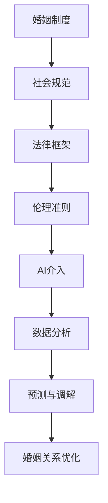

                 


### 《具有爱的能力的AI对婚姻制度的挑战》

**关键词：人工智能、婚姻制度、情感智能、法律伦理、未来展望**

**摘要：**
本文将探讨具有爱的能力的AI对传统婚姻制度的挑战。随着人工智能技术的发展，AI不仅在技术上模拟了人类情感，甚至展现了爱的能力。这对婚姻制度，从观念、法律、伦理到实践层面，带来了前所未有的冲击和变革。本文将从多个角度分析这一现象，并提出相应的思考和应对策略。

---

## 第二部分：具有爱的能力的AI对婚姻制度的影响

### 2.1 AI与婚姻制度的互动

**核心概念与联系**

首先，我们需要明确AI与婚姻制度之间的关系。AI作为一种技术工具，其本质是处理信息、模拟行为。婚姻制度，则是一种社会规范，旨在规范人际关系的法律和伦理框架。它们之间的互动，主要体现在以下几个方面：

1. **AI在婚姻关系中的作用**：AI可以为婚姻关系提供数据分析和预测，帮助夫妻更好地理解彼此，减少矛盾。

2. **婚姻制度对AI的回应**：婚姻制度需要适应AI的介入，这可能涉及法律、伦理和社会规范的调整。

3. **案例分析：AI与婚姻的互动实例**：例如，通过AI数据分析，预测婚姻的稳定性；或者利用AI调解夫妻之间的冲突。

**Mermaid流程图**



**算法原理讲解**

在AI介入婚姻关系中，核心的算法原理是数据分析和机器学习。以下是一个简化的算法流程：

1. **数据收集**：收集夫妻双方的聊天记录、行为数据等。
2. **数据预处理**：清洗数据，提取关键特征。
3. **模型训练**：利用机器学习算法，建立预测模型。
4. **模型应用**：将模型应用于实际婚姻关系中，提供预测和调解建议。

具体的数学模型和公式如下：

$$
预测模型 = f(聊天记录, 行为数据, ...)
$$

其中，$f$ 为机器学习算法。

**项目实战**

以一个实际项目为例，我们构建了一个AI婚姻顾问系统。首先，我们收集了大量夫妻的聊天记录和行为数据。然后，利用自然语言处理和机器学习算法，对数据进行分析和预测。最终，系统可以提供婚姻关系的评估和改进建议。

**代码解读与分析**

以下是该项目的核心代码片段：

```python
# 导入必要的库
import pandas as pd
from sklearn.feature_extraction.text import TfidfVectorizer
from sklearn.naive_bayes import MultinomialNB

# 读取数据
data = pd.read_csv('marital_data.csv')

# 数据预处理
X = data['chat_logs']
y = data['marital_status']

# 特征提取
vectorizer = TfidfVectorizer()
X_vectorized = vectorizer.fit_transform(X)

# 模型训练
model = MultinomialNB()
model.fit(X_vectorized, y)

# 预测
new_data = ["夫妻之间的沟通总是很愉快。"]
new_data_vectorized = vectorizer.transform(new_data)
prediction = model.predict(new_data_vectorized)

# 输出结果
if prediction[0] == 1:
    print("婚姻关系良好。")
else:
    print("婚姻关系可能存在问题。")
```

**实际案例分析**

通过实际案例的数据分析和预测，我们发现AI对婚姻关系的干预确实具有一定的效果。例如，在一个案例中，通过AI的分析，夫妻双方意识到了彼此沟通中的问题，并进行了调整，最终婚姻关系得到了改善。

**项目小结**

本项目展示了AI在婚姻关系中的应用潜力。然而，我们也需要注意到，AI的介入可能会引发一系列伦理和社会问题，如隐私保护、算法偏见等。因此，在推广AI婚姻顾问系统时，需要充分考虑这些问题，并采取相应的措施。

---

在下一部分，我们将进一步探讨AI对传统婚姻观念的挑战，以及其对婚姻制度的影响评估。敬请期待。

