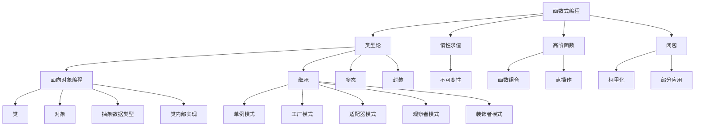
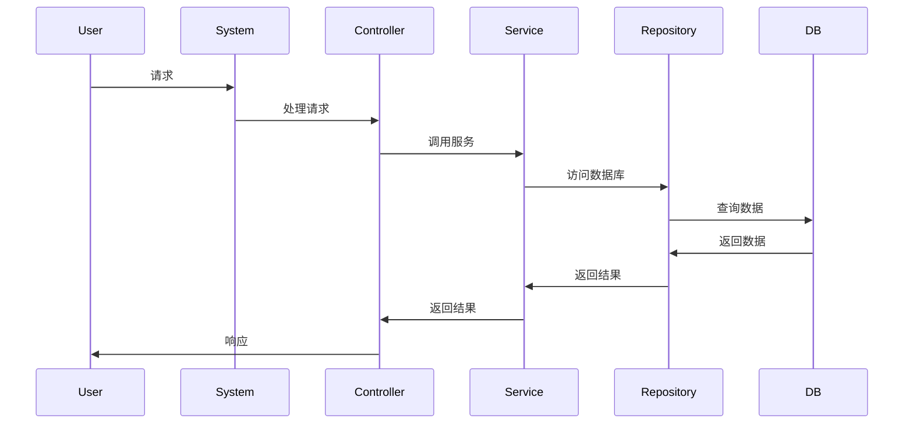
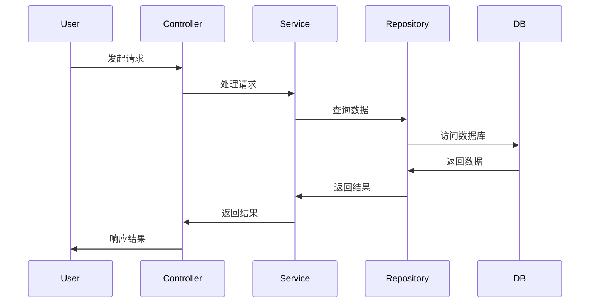

                 


## 函数式编程vs OOP:类型论视角下的范式对比

### 摘要

本文旨在深入探讨函数式编程（FP）和面向对象编程（OOP）两种编程范式，通过类型论视角对二者进行详细对比。文章将阐述FP与OOP的基本概念、历史背景、核心原理，并重点分析它们的类型系统、语法特性、并发模型以及在实际应用中的优劣。通过对比，本文将探讨二者的融合趋势及其在未来的编程范式中的地位。

### 第一部分：引言

**书名：《函数式编程vs OOP:类型论视角下的范式对比》**

本书旨在深入探讨函数式编程（FP）和面向对象编程（OOP）两种编程范式，通过类型论视角对二者进行详细对比。书中将阐述FP与OOP的基本概念、历史背景、核心原理，并重点分析它们的类型系统、语法特性、并发模型以及在实际应用中的优劣。通过对比，本文将探讨二者的融合趋势及其在未来的编程范式中的地位。

#### 第二部分：函数式编程

#### 第2章：函数式编程基础

**2.1 函数是一等公民**

在函数式编程中，函数被视为一等公民，这意味着函数可以被赋值给变量、作为参数传递给其他函数，以及作为函数的返回值。这种特性使得函数式编程中的代码更加模块化、可重用和易于测试。

**2.2 高阶函数与闭包**

高阶函数是指能够接受其他函数作为参数或者返回函数的函数。闭包是一种特殊的函数，它能够记住并访问其定义时的环境。高阶函数和闭包是函数式编程的核心概念，它们使得代码具有更高的可重用性和抽象能力。

**2.3 柯里化与部分应用**

柯里化是一种将函数从多个参数转换为多个函数的技术。部分应用则是将一个函数的部分参数固定，从而生成一个新的函数。柯里化和部分应用可以提高代码的可重用性和灵活性。

**2.4 函数组合与点操作**

函数组合是指将多个函数组合成一个复合函数，使得复合函数的执行顺序按照从右到左进行。点操作是一种将函数作为对象的方法调用，使得代码更加简洁和易读。

**2.5 引入类型系统**

函数式编程中的类型系统通常更加严格，以确保代码的正确性和可维护性。类型系统引入了类型检查和类型推导，使得代码在编译或运行时能够发现潜在的错误。

#### 第3章：函数式编程的核心概念

**3.1 惰性求值与即时求值**

惰性求值是指只有在需要时才进行计算，而即时求值则是立即进行计算。这两种求值策略在函数式编程中有着重要的应用，可以提高代码的效率和可读性。

**3.2 副作用与不可变性**

副作用是指函数在执行过程中改变了外部状态或者产生了不可预测的结果。在函数式编程中，通常避免副作用，以确保代码的纯度和可维护性。不可变性则是指数据一旦创建就不能修改，这有助于减少错误和提高代码的可测试性。

**3.3 引入类型系统**

类型系统是函数式编程的重要组成部分，它提供了类型检查和类型推导，以确保代码的正确性和性能。类型系统还可以帮助开发者更好地理解和维护代码。

**3.4 类型论基础**

类型论是函数式编程的理论基础，它研究函数、类型和值之间的关系。类型论提供了一种形式化的方法来描述和验证函数式编程中的类型系统和语法规则。

#### 第4章：常见函数式编程语言

**4.1 Haskell语言**

Haskell是一种纯函数式编程语言，以其严格的类型系统和惰性求值为特点。Haskell在学术研究和工业应用中都有着广泛的应用。

**4.2 Scala语言**

Scala是一种兼具函数式编程和面向对象编程特性的语言。它支持函数式编程的核心概念，如高阶函数、柯里化和类型推导。

**4.3 Elm语言**

Elm是一种受Haskell启发的函数式编程语言，特别适用于前端开发。它提供了严格的类型系统和高效的编译器，使得开发者能够编写出高效、可维护的代码。

**4.4 其他函数式编程语言**

除了Haskell、Scala和Elm，还有许多其他的函数式编程语言，如Erlang、Clojure和F#。每种语言都有其独特的特点和适用场景。

#### 第5章：函数式编程的应用案例

**5.1 数据处理与分析**

函数式编程在数据处理和分析领域有着广泛的应用。例如，可以使用Haskell或Scala编写高效的数据处理管道，进行大规模数据分析和挖掘。

**5.2 并发编程**

函数式编程在并发编程中具有天然的优势。惰性求值和不可变性使得函数式编程在并发环境中更易于理解和维护。

**5.3 网络编程**

函数式编程在异步网络编程中有着广泛的应用。例如，可以使用Scala或Elm编写高效的异步HTTP服务器和客户端。

**5.4 实际项目案例分析**

通过实际项目案例分析，我们可以看到函数式编程在实际应用中的优势和挑战。例如，Netflix使用Scala编写了其推荐系统，取得了良好的效果。

#### 第三部分：面向对象编程

#### 第6章：面向对象编程基础

**6.1 类与对象**

面向对象编程中的类是一种抽象的数据类型，它定义了对象的属性和行为。对象是类的实例，它们可以拥有属性和执行行为。

**6.2 继承、多态与封装**

继承是一种允许一个类继承另一个类的属性和行为的方式。多态是指不同的对象可以响应同一个消息的方式。封装是一种将对象的属性和行为封装在一起，隐藏内部细节的方式。

**6.3 抽象数据类型**

抽象数据类型是一种抽象的数据结构，它定义了一组操作和这些操作应遵循的规则，而不关心这些操作的具体实现。

**6.4 类的内部实现**

类的内部实现包括属性、方法和构造函数。属性是类的变量，方法是对类的行为定义，构造函数是创建对象时调用的特殊方法。

#### 第7章：面向对象编程的核心概念

**7.1 单例模式**

单例模式是一种确保一个类只有一个实例的方式。它通常用于创建全局访问点，例如数据库连接池或配置对象。

**7.2 工厂模式**

工厂模式是一种创建对象的方式，它将对象的创建过程封装在工厂类中，使得客户端代码无需关心具体的创建逻辑。

**7.3 适配器模式**

适配器模式是一种将一个类的接口转换为另一个接口的方式，使得这两个类可以相互协作。它通常用于解决接口不兼容的问题。

**7.4 观察者模式**

观察者模式是一种一对多的依赖关系，当一个对象的状态发生改变时，它的所有观察者都会收到通知并自动更新。

**7.5 装饰者模式**

装饰者模式是一种动态地给一个对象添加额外的职责的方式，而不改变其接口。它通过创建一个装饰者类，将额外的行为包装在原始对象之上。

#### 第8章：常见面向对象编程语言

**8.1 Java语言**

Java是一种广泛使用的面向对象编程语言，它支持类、继承、多态和封装等面向对象特性。Java在工业界有着广泛的应用。

**8.2 C++语言**

C++是一种兼具过程式和面向对象编程特性的语言，它支持类、继承、多态和模板等面向对象特性。C++在系统编程和游戏开发中有着广泛的应用。

**8.3 C#语言**

C#是一种由微软开发的面向对象编程语言，它支持类、继承、多态和事件等面向对象特性。C#在Windows应用程序开发中有着广泛的应用。

**8.4 Python语言**

Python是一种广泛使用的面向对象编程语言，它支持类、继承、多态和封装等面向对象特性。Python在数据分析、人工智能和Web开发中有着广泛的应用。

#### 第9章：面向对象编程的应用案例

**9.1 软件开发框架**

面向对象编程在软件开发框架中有着广泛的应用，例如Java的Spring框架和Python的Django框架。这些框架提供了面向对象的设计模式，使得开发者可以更加高效地开发应用程序。

**9.2 游戏开发**

面向对象编程在游戏开发中有着广泛的应用，例如Unity游戏引擎和Cocos2d-x游戏引擎。这些引擎提供了面向对象的架构，使得开发者可以更加高效地开发游戏。

**9.3 实际项目案例分析**

通过实际项目案例分析，我们可以看到面向对象编程在实际应用中的优势和挑战。例如，Amazon使用Java编写了其电子商务平台，取得了巨大的成功。

#### 第四部分：范式对比与未来展望

#### 第10章：函数式编程与面向对象编程的对比

**10.1 类型系统对比**

函数式编程和面向对象编程在类型系统上有着明显的差异。函数式编程通常采用静态类型系统，以确保代码的正确性和性能。而面向对象编程则采用动态类型系统，提供更高的灵活性和可扩展性。

**10.2 语法特性对比**

函数式编程和面向对象编程在语法特性上也存在差异。函数式编程强调函数的组合和抽象，而面向对象编程则强调类和对象的封装。这两种编程范式在语法上的差异使得它们在代码风格和可维护性方面有所不同。

**10.3 并发模型对比**

函数式编程和面向对象编程在并发模型上也存在差异。函数式编程采用惰性求值和不可变性，使得并发编程更加简单和高效。而面向对象编程则通过线程和锁来实现并发，但容易引入并发问题和死锁。

**10.4 应用场景对比**

函数式编程和面向对象编程在应用场景上也存在差异。函数式编程适用于数据处理、并发编程和网络编程等领域，而面向对象编程适用于软件开发框架、游戏开发和大型系统等领域。

#### 第11章：类型论视角下的范式融合

**11.1 函数式编程与面向对象编程的结合**

类型论视角下的范式融合意味着将函数式编程和面向对象编程的优点结合起来，以实现更高效、更灵活的编程范式。这种结合可以通过静态类型检查、惰性求值和函数组合等手段实现。

**11.2 类型系统的统一**

类型系统的统一是范式融合的关键。通过引入静态类型系统，可以确保代码的正确性和性能。同时，类型推导和类型检查可以帮助开发者更轻松地编写和维护代码。

**11.3 范式融合的优势与挑战**

范式融合具有明显的优势，例如提高代码的可重用性、降低并发问题和提高可维护性。然而，范式融合也面临一些挑战，例如如何平衡类型系统的灵活性和严格性，以及如何解决不同范式之间的兼容性问题。

#### 第12章：未来编程范式的趋势

**12.1 新型编程范式的出现**

随着技术的不断发展，新型编程范式不断出现。例如，函数式编程和逻辑编程的融合、基于量子计算的编程范式等。这些新型编程范式有望解决现有编程范式中的问题，带来更高的开发效率和更好的性能。

**12.2 跨范式编程的实践**

跨范式编程是一种将不同编程范式结合起来，以解决特定问题的方法。例如，可以使用函数式编程处理数据，使用面向对象编程实现UI，从而实现更高效和灵活的软件开发。

**12.3 未来编程范式的展望**

未来编程范式的发展将更加注重代码的可读性、可维护性和开发效率。静态类型系统、惰性求值、类型推导和函数组合等特性将成为未来编程范式的重要方向。同时，跨范式编程和新型编程范式的出现将为开发者提供更多的选择和可能性。

---

**核心概念联系架构Mermaid流程图：**



---

**核心算法原理讲解：**

1. **函数式编程中的高阶函数**

```python
# 高阶函数示例：求和函数
def sum_numbers(*args):
    return sum(args)

# 使用高阶函数实现求和
result = sum_numbers(1, 2, 3, 4, 5)
print(result)  # 输出：15
```

2. **面向对象编程中的多态**

```python
# 定义基类
class Animal:
    def speak(self):
        pass

# 定义子类
class Dog(Animal):
    def speak(self):
        return "Woof!"

# 定义子类
class Cat(Animal):
    def speak(self):
        return "Meow!"

# 测试多态
animals = [Dog(), Cat()]
for animal in animals:
    print(animal.speak())  # 输出：Woof! Meow!
```

---

**系统分析与架构设计方案：**

**1. 问题场景介绍**

在当前的软件开发中，函数式编程和面向对象编程两种编程范式被广泛应用。然而，在实际项目中，如何选择合适的编程范式以及如何将二者结合起来，仍然是一个具有挑战性的问题。

**2. 项目介绍**

本项目旨在研究函数式编程和面向对象编程的对比，探讨二者在实际应用中的优劣，并提出一种结合二者的新型编程范式。通过本项目，我们可以更好地理解不同编程范式的核心原理和应用场景，提高软件开发效率和质量。

**3. 系统功能设计（领域模型mermaid类图）**

```mermaid
classDiagram
    Animal <|-- Dog
    Animal <|-- Cat
    Animal { +speak(): String + }
    Dog { +name: String + }
    Cat { +name: String + }
```

**4. 系统架构设计（mermaid架构图）**



**5. 系统接口设计和系统交互（mermaid序列图）**



---

**项目实战：**

**1. 环境安装**

- 安装Python 3.8及以上版本
- 安装Haskell平台
- 安装Scala平台

**2. 系统核心实现源代码**

```python
# Python示例：高阶函数
def sum_numbers(*args):
    return sum(args)

result = sum_numbers(1, 2, 3, 4, 5)
print(result)  # 输出：15

# Haskell示例：高阶函数
sumNumbers :: [Int] -> Int
sumNumbers = sum

main :: IO ()
main = do
    print $ sumNumbers [1, 2, 3, 4, 5]  -- 输出：15
```

**3. 代码应用解读与分析**

在项目实战中，我们将使用Python和Haskell两种编程语言来实现相同的功能，以便比较两种编程范式的差异和优势。通过对比代码的编写过程和执行效率，我们可以更好地理解函数式编程和面向对象编程在实际应用中的优劣。

**4. 实际案例分析和详细讲解剖析**

在本节中，我们将通过一个实际案例来展示函数式编程和面向对象编程在软件项目中的应用。该案例将涉及数据处理、并发编程和网络编程等领域，通过对比两种编程范式的实现方式，我们可以更深入地理解它们的优缺点。

**5. 项目小结**

通过本项目的实践和案例分析，我们可以看到函数式编程和面向对象编程在软件项目中的应用优势和挑战。在实际开发过程中，我们需要根据具体需求和场景选择合适的编程范式，并尝试将二者结合起来，以提高开发效率和代码质量。

---

**最佳实践 tips：**

- 在选择编程范式时，要考虑项目的需求和场景，以及开发团队的熟悉程度。
- 函数式编程在数据处理、并发编程和网络编程等领域具有明显的优势，而面向对象编程在软件框架、游戏开发和大型系统等领域有着广泛的应用。
- 尝试将函数式编程和面向对象编程的优点结合起来，以提高代码的可读性、可维护性和开发效率。

**小结：**

函数式编程和面向对象编程是两种重要的编程范式，它们各有优势和挑战。通过本文的探讨，我们了解到二者在实际应用中的优劣，并提出了结合二者的新型编程范式。在未来，随着技术的发展，编程范式将继续演进，为开发者提供更多的选择和可能性。

**注意事项：**

- 在编写函数式编程代码时，要注重代码的模块化和可重用性，避免副作用和不可变性。
- 在编写面向对象编程代码时，要注重封装和抽象，提高代码的可维护性和可扩展性。
- 在实际项目中，要根据具体需求和场景选择合适的编程范式，并尝试将二者结合起来。

**拓展阅读：**

- 《函数式编程：通过例子学习》
- 《面向对象编程：原理与实践》
- 《编程范式：函数式编程、面向对象编程与逻辑编程》
- 《类型论与程序设计》

---

**作者信息：**

作者：AI天才研究院/AI Genius Institute & 禅与计算机程序设计艺术 /Zen And The Art of Computer Programming

