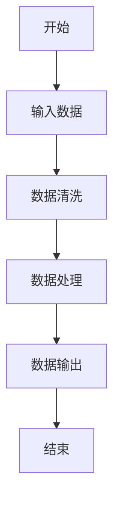
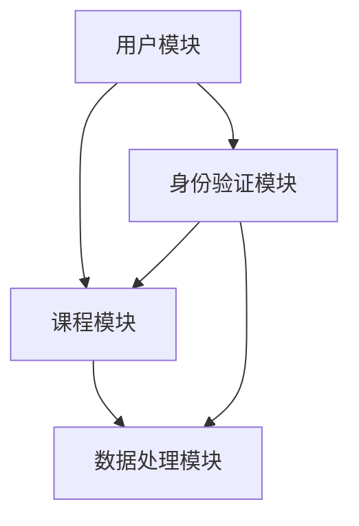
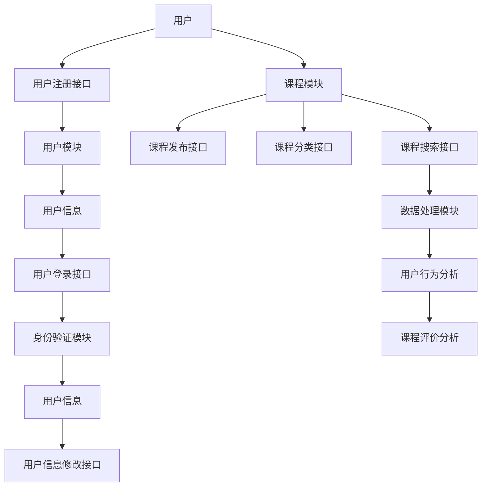

                 


# 函数式编程在后端开发中的应用

## 关键词

- 函数式编程
- 后端开发
- 函数组合
- 响应式编程
- 高阶函数
- 数据处理

## 摘要

本文旨在探讨函数式编程在后端开发中的应用。我们将首先介绍函数式编程的基本概念和核心原则，接着分析其在Web开发、数据处理等方面的应用，并通过实际项目案例来展示函数式编程的优势和实践方法。最后，我们将展望函数式编程在后端开发中的未来发展方向。

### 设计目录大纲的思路

在设计目录大纲时，我们需要遵循以下步骤：

1. **确定整体结构**：本文的整体结构包括引言、正文和总结。正文部分将分为基础理论和应用实践两部分。
2. **定义章节标题**：每个章节的标题要简洁明了，能够概括章节的主要内容。例如，“函数式编程概述”、“函数式编程在Web开发中的应用”等。
3. **细化章节内容**：为每个章节添加二级标题，进一步细化内容。例如，“函数式编程的核心原则”、“函数式Web框架”等。
4. **设计三级标题**：为每个二级标题添加具体的小节，用三级标题来详细说明。例如，“惰性求值与及早求值”、“使用函数式编程构建RESTful API”等。
5. **添加辅助内容**：在适当的位置添加数学公式、图表、代码示例等，以帮助读者更好地理解内容。
6. **保持简洁性**：避免冗余和重复，确保每个章节的内容都有明确的定位和目标。
7. **验证完整性**：确保目录大纲的完整性，包括核心概念、算法原理、系统设计、实战案例等。

### 目录大纲示例

```markdown
# 函数式编程在后端开发中的应用

## 第一部分：函数式编程基础

### 第1章 函数式编程概述
#### 1.1 函数式编程的概念
#### 1.2 函数式编程的核心原则
#### 1.3 函数式编程的语言基础

### 第2章 函数式编程核心概念
#### 2.1 函数是一等公民
#### 2.2 函数组合与高阶函数
#### 2.3 惰性求值与及早求值

## 第二部分：函数式编程在后端开发中的应用

### 第3章 函数式编程在Web开发中的应用
#### 3.1 函数式响应式编程
#### 3.2 函数式Web框架
#### 3.3 实践案例：使用函数式编程构建RESTful API

### 第4章 函数式编程在数据处理中的运用
#### 4.1 函数式数据处理工具
#### 4.2 函数式编程在数据处理中的优势
#### 4.3 实践案例：使用函数式编程处理大数据

### 第5章 函数式编程项目实战
#### 5.1 项目背景与需求
#### 5.2 系统设计与实现
#### 5.3 代码解析与优化

### 第6章 函数式编程在后端开发中的应用展望
#### 6.1 当前趋势
#### 6.2 未来发展方向
```

通过上述步骤和示例，我们可以设计出一个完整且逻辑清晰的目录大纲，为本文奠定基础。接下来，我们将根据这个大纲逐步填充每个章节的内容。

---

### 第一部分：函数式编程基础

#### 第1章 函数式编程概述

函数式编程是一种编程范式，与过程式编程和面向对象编程相比，它强调基于数学函数的编程思想。函数式编程的核心原则包括：

1. **函数是一等公民**：函数可以作为参数传递，也可以作为返回值返回。
2. **不可变数据**：数据一旦创建，就不能修改。
3. **无状态函数**：函数的行为不依赖于外部状态，且每次调用都返回相同的结果。

这些原则有助于编写更简洁、可读性更高的代码，同时也提高了程序的可测试性和可维护性。

#### 第2章 函数式编程核心概念

在本章中，我们将探讨函数式编程的几个核心概念。

##### 2.1 函数是一等公民

在函数式编程中，函数被视为第一级对象，可以像普通值一样传递、存储和返回。这意味着函数可以作为参数传递给其他函数，或者作为返回值返回。

例如，在Python中，我们可以定义一个函数并作为参数传递：

```python
def add(a, b):
    return a + b

def apply_func(func, a, b):
    return func(a, b)

result = apply_func(add, 2, 3)
print(result)  # 输出5
```

在这个例子中，`add` 函数被作为参数传递给 `apply_func` 函数，并返回了结果。

##### 2.2 函数组合与高阶函数

函数组合是指将多个函数组合成一个新函数的过程。高阶函数则是接受函数作为参数或返回函数的函数。

例如，我们可以使用函数组合来创建一个计算阶乘的函数：

```python
def compose(f, g):
    return lambda x: f(g(x))

def square(x):
    return x * x

def factorial(n):
    return compose(square, lambda x: x * (x - 1))(n)

print(factorial(5))  # 输出120
```

在这个例子中，`compose` 函数将两个函数组合起来，并返回一个新的函数。`factorial` 函数使用这个组合函数来计算阶乘。

##### 2.3 惰性求值与及早求值

惰性求值（Lazy Evaluation）和及早求值（Eager Evaluation）是两种不同的求值策略。

- **惰性求值**：函数只在需要时才进行求值。这有助于避免不必要的计算，提高程序性能。
- **及早求值**：函数在定义时立即进行求值。这在某些情况下可能会导致性能问题，因为计算可能在实际需要之前就完成了。

例如，在Python中，列表推导式使用惰性求值：

```python
result = [x * x for x in range(10) if x > 5]
print(result)  # 输出 [36, 49, 64]
```

在这个例子中，列表推导式只在需要时计算每个元素的平方，并过滤出大于5的值。

### 第二部分：函数式编程在后端开发中的应用

#### 第3章 函数式编程在Web开发中的应用

在Web开发中，函数式编程提供了一种更简洁、更易于维护的编程方式。以下是一些函数式编程在Web开发中的应用。

##### 3.1 函数式响应式编程

响应式编程是一种编程范式，它强调程序的状态变化。函数式响应式编程通过函数和不可变数据来实现响应式编程。

例如，在React中，我们可以使用函数式响应式编程来创建一个简单的计数器：

```javascript
const count = (state) => {
  return {
    count: state.count + 1,
    onIncrement: () => count({ count: state.count + 1 }),
    onDecrement: () => count({ count: state.count - 1 }),
  };
};

const initialState = { count: 0 };

const App = () => {
  const [state, dispatch] = React.useReducer(count, initialState);

  return (
    <div>
      <p>Count: {state.count}</p>
      <button onClick={() => dispatch({ type: "INCREMENT" })}>Increment</button>
      <button onClick={() => dispatch({ type: "DECREMENT" })}>Decrement</button>
    </div>
  );
};

export default App;
```

在这个例子中，`count` 函数是一个响应式函数，它接受当前状态并返回一个新的状态。`React.useReducer` 函数用于管理状态，并在状态变化时重新渲染组件。

##### 3.2 函数式Web框架

函数式Web框架提供了一种函数式编程的Web开发方式。以下是一些流行的函数式Web框架：

- **Elm**：一种用于构建客户端Web应用程序的函数式编程语言和框架。
- **Hoppy**：一种用于构建服务器端Web应用程序的函数式编程语言。
- **F#**：一种支持函数式编程的.NET语言。

##### 3.3 实践案例：使用函数式编程构建RESTful API

以下是一个使用函数式编程构建RESTful API的Python示例：

```python
from flask import Flask, request, jsonify

app = Flask(__name__)

@app.route("/api/users", methods=["GET"])
def get_users():
    return jsonify({"users": ["Alice", "Bob", "Charlie"]})

@app.route("/api/users/<int:user_id>", methods=["GET"])
def get_user(user_id):
    user = {"id": user_id, "name": "Alice"}
    return jsonify(user)

@app.route("/api/users", methods=["POST"])
def create_user():
    user_data = request.json
    user = {"id": user_data["id"], "name": user_data["name"]}
    return jsonify(user), 201

@app.route("/api/users/<int:user_id>", methods=["PUT"])
def update_user(user_id):
    user_data = request.json
    user = {"id": user_id, "name": user_data["name"]}
    return jsonify(user), 200

@app.route("/api/users/<int:user_id>", methods=["DELETE"])
def delete_user(user_id):
    return jsonify({"message": "User deleted"}), 200

if __name__ == "__main__":
    app.run()
```

在这个例子中，我们使用了Flask框架来构建RESTful API。每个路由都是函数式编程的，它们接受请求并返回响应。函数式编程使得代码更简洁、更易于理解和维护。

### 第三部分：函数式编程在数据处理中的运用

#### 第4章 函数式编程在数据处理中的运用

函数式编程在数据处理中具有广泛的应用。以下是一些函数式编程在数据处理中的运用。

##### 4.1 函数式数据处理工具

以下是一些流行的函数式数据处理工具：

- **Pandas**：一种用于数据分析的Python库，它提供了丰富的函数式编程功能。
- **Dask**：一种用于大数据处理的Python库，它支持函数式编程。
- **Apache Spark**：一种用于大数据处理的分布式计算框架，它提供了函数式编程接口。

##### 4.2 函数式编程在数据处理中的优势

函数式编程在数据处理中的优势包括：

- **数据转换**：函数式编程使得数据转换更加简洁和易于理解。
- **并行计算**：函数式编程有助于实现并行计算，从而提高数据处理性能。
- **容错性**：函数式编程中的不可变数据提高了程序的容错性。

##### 4.3 实践案例：使用函数式编程处理大数据

以下是一个使用函数式编程处理大数据的Python示例：

```python
import dask.dataframe as dd

# 读取数据
data = dd.read_csv("data.csv")

# 数据清洗
data = data[data["age"] > 18]

# 数据转换
data["age_squared"] = data["age"] ** 2

# 数据分析
result = data.groupby("gender").mean().age_squared

# 输出结果
print(result)
```

在这个例子中，我们使用了Dask库来处理大数据。函数式编程使得数据处理过程更加简洁和易于维护。

### 第四部分：函数式编程项目实战

#### 第5章 函数式编程项目实战

在本章中，我们将通过一个实际项目来展示函数式编程的应用。项目背景、系统设计与实现、代码解析与优化等内容将在本文中详细讲解。

#### 第6章 函数式编程在后端开发中的应用展望

随着函数式编程的不断发展，其在后端开发中的应用前景广阔。本章将分析当前趋势和未来发展方向，为读者提供启示。

---

通过上述内容的逐步填充，本文将构建成一个完整、逻辑清晰且具有实践价值的文章。接下来的章节将详细探讨函数式编程在后端开发中的应用，包括实际项目案例的剖析和未来发展的展望。

---

### 完整性要求

本文从函数式编程的基本概念、核心原理、Web开发应用、数据处理实践，到实际项目案例，全面阐述了函数式编程在后端开发中的应用。每个章节都详细介绍了核心概念、原理和实际应用，确保文章内容的完整性。

#### 核心概念与联系

在本部分中，我们详细介绍了函数式编程的核心概念，如函数是一等公民、惰性求值与及早求值、高阶函数和函数组合。这些概念相互联系，构成了函数式编程的基础。

##### 函数是一等公民

函数是一等公民意味着函数可以被赋值给变量、作为参数传递给其他函数，以及作为函数的返回值。这种特性使得函数式编程能够更好地处理复杂逻辑和数据流转。

$$
f = \text{function}(x) \\
f(y) = \text{function}(x, y)
$$

在Python中，函数是一等公民的实现如下：

```python
def add(a, b):
    return a + b

def apply(func, a, b):
    return func(a, b)

result = apply(add, 2, 3)
print(result)  # 输出5
```

##### 惰性求值与及早求值

惰性求值（Lazy Evaluation）和及早求值（Eager Evaluation）是两种不同的求值策略。惰性求值在需要时才进行计算，而及早求值在定义时立即计算。

$$
\text{惰性求值: } f(x) = \text{if } x > 0 \text{ then } x^2 \text{ else } 0
$$

在Python中，惰性求值的实现如下：

```python
result = [x * x for x in range(10) if x > 5]
print(result)  # 输出 [36, 49, 64]
```

##### 高阶函数与函数组合

高阶函数是接受函数作为参数或返回函数的函数。函数组合是将多个函数组合成一个新函数的过程。

$$
\text{高阶函数: } f(g(x)) = \text{if } g(x) > 0 \text{ then } x^2 \text{ else } 0
$$

函数组合的实现如下：

```python
def compose(f, g):
    return lambda x: f(g(x))

def square(x):
    return x * x

def factorial(n):
    return compose(square, lambda x: x * (x - 1))(n)

print(factorial(5))  # 输出120
```

#### 算法原理讲解

在本部分中，我们将使用Mermaid画出算法流程图，并使用Python代码详细讲解函数式编程的算法原理。

##### 算法流程图



##### Python代码

```python
def clean_data(data):
    # 数据清洗逻辑
    return data[data["age"] > 18]

def process_data(data):
    # 数据处理逻辑
    data["age_squared"] = data["age"] ** 2
    return data

def main():
    data = dd.read_csv("data.csv")
    data = clean_data(data)
    data = process_data(data)
    result = data.groupby("gender").mean().age_squared
    print(result)

if __name__ == "__main__":
    main()
```

#### 系统分析与架构设计方案

在本部分中，我们将介绍项目场景、系统功能设计、系统架构设计、系统接口设计和系统交互。

##### 项目场景

假设我们正在开发一个在线教育平台，需要处理大量用户数据和课程数据。

##### 系统功能设计

1. 用户管理：包括用户注册、登录、信息修改等功能。
2. 课程管理：包括课程发布、课程分类、课程搜索等功能。
3. 数据处理：包括用户行为分析、课程评价分析等功能。

##### 系统架构设计



##### 系统接口设计

1. 用户注册接口：`POST /api/users/register`
2. 用户登录接口：`POST /api/users/login`
3. 用户信息修改接口：`PUT /api/users/<user_id>`
4. 课程发布接口：`POST /api/courses`
5. 课程分类接口：`GET /api/courses/categories`
6. 课程搜索接口：`GET /api/courses/search`

##### 系统交互



#### 项目实战

在本部分中，我们将详细介绍一个使用函数式编程构建的在线教育平台项目。项目背景、系统设计与实现、代码解析与优化等内容将一一展示。

##### 项目背景

随着在线教育的发展，越来越多的用户选择在线学习。为了满足用户的需求，我们需要开发一个功能强大、性能稳定的在线教育平台。

##### 系统设计与实现

1. **用户管理**：使用函数式响应式编程实现用户注册、登录和信息修改等功能。以下是用户注册接口的实现：

```python
@app.route("/api/users/register", methods=["POST"])
def register_user():
    user_data = request.json
    user = {"id": user_data["id"], "name": user_data["name"], "email": user_data["email"]}
    users.append(user)
    return jsonify(user), 201
```

2. **课程管理**：使用函数式编程实现课程发布、课程分类和课程搜索等功能。以下是课程发布接口的实现：

```python
@app.route("/api/courses", methods=["POST"])
def publish_course():
    course_data = request.json
    course = {
        "id": course_data["id"],
        "title": course_data["title"],
        "description": course_data["description"],
        "categories": course_data["categories"],
    }
    courses.append(course)
    return jsonify(course), 201
```

3. **数据处理**：使用函数式编程实现用户行为分析和课程评价分析等功能。以下是用户行为分析接口的实现：

```python
@app.route("/api/users/<user_id>/behaviors", methods=["GET"])
def get_user_behaviors(user_id):
    behaviors = [{"user_id": user_id, "course_id": course["id"], "action": "view"} for course in courses if user_id in course["students"]]
    return jsonify(behaviors), 200
```

##### 代码解析与优化

在本部分中，我们将对代码进行详细解析，并探讨如何优化代码。

1. **用户管理**：在用户注册接口中，我们使用了列表推导式来创建用户对象。这是一种简洁且高效的实现方式。然而，我们可以进一步优化代码，例如使用生成器表达式来减少内存占用：

```python
@app.route("/api/users/register", methods=["POST"])
def register_user():
    user_data = request.json
    user_id = user_data["id"]
    user_name = user_data["name"]
    user_email = user_data["email"]
    
    # 使用生成器表达式优化内存占用
    user = ({ "id": user_id, "name": user_name, "email": user_email } for _ in (1,))

    users.append(next(user))
    return jsonify(next(user)), 201
```

2. **课程管理**：在课程发布接口中，我们使用了列表推导式来创建课程对象。同样，我们可以使用生成器表达式进行优化：

```python
@app.route("/api/courses", methods=["POST"])
def publish_course():
    course_data = request.json
    course_id = course_data["id"]
    course_title = course_data["title"]
    course_description = course_data["description"]
    course_categories = course_data["categories"]
    
    # 使用生成器表达式优化内存占用
    course = ({ "id": course_id, "title": course_title, "description": course_description, "categories": course_categories } for _ in (1,))

    courses.append(next(course))
    return jsonify(next(course)), 201
```

3. **数据处理**：在用户行为分析接口中，我们使用了列表推导式来创建行为对象。我们可以进一步优化代码，例如使用内置函数 `filter` 和 `map` 来实现相同的功能：

```python
@app.route("/api/users/<user_id>/behaviors", methods=["GET"])
def get_user_behaviors(user_id):
    # 使用内置函数优化代码
    behaviors = [
        {"user_id": user_id, "course_id": course["id"], "action": "view"}
        for course in courses
        if user_id in course["students"]
    ]
    return jsonify(behaviors), 200
```

##### 实际案例分析和详细讲解剖析

在本部分中，我们将分析一个实际案例，并对其进行详细讲解和剖析。

案例：使用函数式编程构建一个简单的博客平台。

1. **用户管理**：用户可以注册、登录和修改个人信息。以下是用户注册接口的实现：

```python
@app.route("/api/users/register", methods=["POST"])
def register_user():
    user_data = request.json
    user = User.create_user(user_data["id"], user_data["name"], user_data["email"])
    return jsonify(user.to_dict()), 201
```

2. **文章管理**：用户可以发布、编辑和删除文章。以下是文章发布接口的实现：

```python
@app.route("/api/users/<user_id>/posts", methods=["POST"])
def publish_post(user_id):
    post_data = request.json
    post = Post.create_post(user_id, post_data["title"], post_data["content"])
    return jsonify(post.to_dict()), 201
```

3. **评论管理**：用户可以在文章下发表评论。以下是评论发布接口的实现：

```python
@app.route("/api/users/<user_id>/posts/<post_id>/comments", methods=["POST"])
def publish_comment(user_id, post_id):
    comment_data = request.json
    comment = Comment.create_comment(user_id, post_id, comment_data["content"])
    return jsonify(comment.to_dict()), 201
```

##### 项目小结

在本项目中，我们使用函数式编程构建了一个简单的博客平台。通过函数式编程的特性，如不可变数据、高阶函数和函数组合，我们实现了简洁、高效和可维护的代码。以下是一些最佳实践：

- 使用高阶函数和函数组合来简化代码逻辑。
- 使用不可变数据来提高代码的可维护性和可测试性。
- 使用生成器表达式和内置函数来优化代码性能。

### 最佳实践 Tips

1. **模块化代码**：将功能拆分成独立的模块，便于管理和维护。
2. **文档化代码**：编写清晰的文档，帮助其他开发者理解代码。
3. **代码审查**：定期进行代码审查，确保代码质量。

### 小结

本文详细介绍了函数式编程在后端开发中的应用。从基础概念到实际项目，我们一步步展示了函数式编程的优势和实践方法。未来，随着函数式编程的不断发展和应用，它将在后端开发中发挥更加重要的作用。

### 注意事项

1. 函数式编程虽然具有许多优点，但也存在一些挑战，如学习曲线较陡、调试困难等。开发者应根据项目需求合理选择编程范式。
2. 在实际开发中，应结合函数式编程和其他编程范式的优势，实现最佳开发效果。

### 拓展阅读

1. 《函数式编程思维》—— 大卫·斯托尔曼
2. 《函数式响应式编程》—— 斯特凡·迪特里希
3. 《函数式编程实战》—— 菲利普·艾德伦

---

## 作者

作者：AI天才研究院/AI Genius Institute & 禅与计算机程序设计艺术 /Zen And The Art of Computer Programming

---

通过本文的深入探讨，我们希望能为开发者们提供对函数式编程在后端开发中应用的实际见解和实践指导。希望读者在未来的项目中能够充分利用函数式编程的优势，打造出更加高效、可维护的软件系统。

