                 


### 函数式编程：在实际项目中的应用

---

**关键词：**
- 函数式编程
- 实际项目
- 算法
- 数据处理
- 并发编程

**摘要：**
本文将深入探讨函数式编程在实际项目中的应用，从基础概念、算法应用、Web开发、并发编程以及数据处理等多个方面，逐步分析函数式编程的原理和实践。通过具体的案例和代码示例，帮助读者更好地理解和掌握函数式编程在项目开发中的价值。

---

### 第一部分：函数式编程基础

#### 第1章：函数式编程概述

##### 1.1 函数式编程的核心概念

函数式编程是一种编程范式，它将计算视为一系列函数的执行，而不是一系列状态的变换。在函数式编程中，数据被视作不可变的，函数没有副作用，这意味着函数的每次调用都会产生相同的结果，且不会改变外部状态。

- **函数作为第一公民**：在函数式编程中，函数与其他数据类型一样，可以作为参数传递，也可以作为返回值。这使得函数能够被组合和抽象，从而提高代码的可复用性和可读性。

- **高阶函数**：高阶函数是能够接受函数作为参数或返回函数的函数。这种特性使得函数能够被灵活地组合和嵌套，从而实现复杂的计算过程。

- **函数组合**：函数组合是指将多个函数组合成一个新函数的过程。通过函数组合，可以简化代码的复杂性，提高代码的可读性。

##### 1.2 函数式编程与传统编程的差异

- **命令式编程与声明式编程**：命令式编程强调对状态的改变，而声明式编程则强调描述目标结果。函数式编程更倾向于使用声明式编程。

- **惰性计算与及早计算**：惰性计算是指只有在需要时才进行计算，而及早计算则是在可能的情况下尽早进行计算。函数式编程通常倾向于使用惰性计算，以避免不必要的计算。

- **数据结构与状态管理**：在函数式编程中，数据结构通常是不可变的，状态管理则依赖于纯函数和不可变数据结构。

##### 1.3 函数式编程的历史背景和发展

- **函数式编程的起源**：函数式编程的起源可以追溯到Lisp语言的诞生，它在20世纪50年代末期出现。

- **函数式编程的主要流派**：包括Haskell、Scala和Erlang等语言，每种语言都有其独特的特点和优势。

- **函数式编程的现代化**：随着计算机科学的不断发展，函数式编程逐渐从理论研究走向实际应用，成为现代编程中的重要范式。

##### 1.4 函数式编程的语言基础

- **Haskell**：Haskell是一种纯函数式编程语言，以其严格的纯函数性和静态类型系统而著称。

- **Scala**：Scala是一种多范式编程语言，既支持面向对象，也支持函数式编程。

- **Erlang**：Erlang是一种用于并发编程的函数式编程语言，以其强大的并发性能和高可用性而闻名。

##### 1.5 本章小结

本章介绍了函数式编程的基本概念、与传统编程的差异、历史背景和发展，以及几种常见的函数式编程语言。通过本章的学习，读者可以初步了解函数式编程的原理和特点。

---

### 第二部分：函数式编程在实际项目中的应用

#### 第2章：算法与数据结构

##### 2.1 函数式算法

函数式算法是指基于函数式编程思想的算法设计。以下是一些常见的函数式算法：

- **快速排序**：一种高效的排序算法，其基本思想是通过递归将待排序的数组分割成较小的子数组，然后对每个子数组进行排序。

- **合并排序**：一种经典的排序算法，其基本思想是将两个已排序的数组合并成一个有序的数组。

- **稀疏矩阵运算**：稀疏矩阵是指大部分元素为零的矩阵，函数式编程可以有效地处理稀疏矩阵的运算。

##### 2.2 函数式数据结构

- **链表**：链表是一种常见的线性数据结构，其特点是可以动态地扩展和缩小。

- **树**：树是一种常见的非线性数据结构，其特点是具有层次结构和分支结构。

- **图**：图是一种复杂的非线性数据结构，其特点是具有节点和边，可以用来表示复杂的关系。

##### 2.3 算法与数据结构的性能分析

- **常见性能指标**：包括时间复杂度和空间复杂度，它们是衡量算法性能的重要指标。

- **函数式编程对性能的影响**：函数式编程可以减少内存分配和垃圾回收，从而提高性能。

- **优化策略**：包括避免不必要的计算、使用高效的数据结构等。

##### 2.4 本章小结

本章介绍了函数式编程中的算法和数据结构，以及它们在性能分析中的应用。通过本章的学习，读者可以了解如何利用函数式编程的优势来设计和优化算法。

---

### 第3章：Web开发中的函数式编程

##### 3.1 函数式Web框架

函数式Web框架是一种基于函数式编程思想的Web框架，以下是一些常见的函数式Web框架：

- **React**：React是一种用于构建用户界面的JavaScript库，其核心思想是组件化。

- **Elm**：Elm是一种用于构建Web应用的函数式编程语言，其特点是类型安全和强大的抽象能力。

- **Purescript**：Purescript是一种用于构建Web应用的函数式编程语言，其特点是类型安全和高效的编译。

##### 3.2 函数式Web开发的优势

函数式Web开发相比传统Web开发具有以下优势：

- **软件质量**：函数式编程可以减少bug的产生，提高代码的可读性和可维护性。

- **开发效率**：函数式编程可以减少重复代码，提高开发速度。

- **可维护性**：函数式编程的模块化设计使得代码易于维护和扩展。

##### 3.3 实战案例：使用函数式编程构建Web应用

以下是一个使用函数式编程构建Web应用的基本步骤：

- **项目环境搭建**：选择合适的函数式Web框架，搭建项目环境。

- **应用功能实现**：使用函数式编程思想实现应用的功能。

- **性能优化**：对应用进行性能优化，包括代码优化和系统优化。

##### 3.4 本章小结

本章介绍了函数式Web框架的优势和实际应用，并通过一个简单的案例展示了如何使用函数式编程构建Web应用。

---

### 第4章：函数式编程在并发编程中的应用

##### 4.1 并发编程的挑战

并发编程面临以下挑战：

- **数据竞争**：多个线程同时访问同一数据，可能导致数据不一致。

- **死锁**：多个线程互相等待对方释放资源，导致系统瘫痪。

- **活锁和饥饿**：线程在等待资源时可能永远无法获得，导致无法继续执行。

##### 4.2 函数式编程解决并发问题

函数式编程可以解决并发编程中的问题，其核心思想包括：

- **无状态函数**：无状态函数不依赖于外部状态，因此可以安全地并行执行。

- **惰性计算**：惰性计算可以避免不必要的计算，减少并发竞争。

- **软件事务内存**：软件事务内存可以提供一种安全并发的方式，减少锁的使用。

##### 4.3 并发实战：使用函数式编程实现并发应用

以下是一个使用函数式编程实现并发应用的基本步骤：

- **项目需求**：明确应用的需求，包括并发处理的数据和处理逻辑。

- **系统架构设计**：设计系统的架构，包括线程模型和并发处理机制。

- **并发模型实现**：使用函数式编程实现并发的处理逻辑。

##### 4.4 本章小结

本章介绍了函数式编程在并发编程中的应用，并通过一个简单的案例展示了如何使用函数式编程实现并发应用。

---

### 第5章：函数式编程在数据处理中的应用

##### 5.1 数据处理的需求

数据处理的需求包括：

- **数据源多样化**：处理多种类型的数据源，如关系型数据库、NoSQL数据库、日志文件等。

- **数据质量要求**：确保数据处理的结果准确、可靠。

- **数据处理效率**：高效地处理大量数据，以满足业务需求。

##### 5.2 函数式数据处理工具

以下是一些常见的函数式数据处理工具：

- **Apache Flink**：Apache Flink是一种用于实时数据处理的分布式计算框架。

- **Apache Spark**：Apache Spark是一种用于大规模数据处理的分布式计算框架。

- **Apache Beam**：Apache Beam是一种用于数据处理的流式和批量处理框架。

##### 5.3 实际应用

以下是一个使用函数式数据处理工具的实际应用案例：

- **环境安装**：安装所需的工具和环境。

- **系统实现**：使用函数式编程实现数据处理逻辑。

- **代码分析**：对实现的代码进行分析和优化。

##### 5.4 本章小结

本章介绍了函数式编程在数据处理中的应用，并通过一个简单的案例展示了如何使用函数式数据处理工具实现数据处理。

---

### 总结与拓展

函数式编程作为一种强大的编程范式，在实际项目中具有广泛的应用。通过本文的介绍，读者可以初步了解函数式编程的核心概念、算法应用、Web开发、并发编程以及数据处理等方面的内容。为了更好地掌握函数式编程，读者可以进一步学习相关的高级话题和最佳实践。

---

**作者：AI天才研究院/AI Genius Institute & 禅与计算机程序设计艺术 /Zen And The Art of Computer Programming**

---

通过以上章节的逐步讲解，本文系统地介绍了函数式编程在实际项目中的应用。希望本文能够帮助读者深入理解函数式编程的原理和实践，并在实际项目中运用这一强大的编程范式。函数式编程不仅提高了代码的可读性和可维护性，还带来了更高的开发效率和更好的性能表现。随着计算机科学的不断发展，函数式编程将在更多领域得到广泛应用，为软件工程带来新的革命。让我们继续探索函数式编程的奥秘，共创美好的未来！【/assistant|>】
### 函数式编程：在实际项目中的应用

#### **背景介绍**

函数式编程（Functional Programming）是一种以函数为核心概念的编程范式，它强调不可变数据、纯函数和表达式的使用，而不是面向对象编程中的类和方法。这种编程范式起源于20世纪50年代的Lambda演算，并在Haskell、Scala、Erlang等编程语言中得到广泛应用。函数式编程的核心思想是利用函数将计算过程分解为一系列的步骤，通过高阶函数和函数组合实现复杂的功能，同时避免了副作用和状态依赖。

在实际项目中，函数式编程的应用场景主要集中在需要处理大量数据、实现并发处理、保证代码可读性和可维护性等方面。随着云计算、大数据和人工智能等技术的发展，函数式编程在这些领域展现出了其独特的优势。例如，在分布式系统中，函数式编程可以有效地减少竞态条件和死锁问题；在数据处理中，函数式编程可以高效地处理流式数据和大规模数据集。

本篇文章将从以下几个方面探讨函数式编程在实际项目中的应用：

1. **核心概念与联系**：介绍函数式编程的核心概念，如纯函数、高阶函数、不可变性等，并通过Mermaid流程图和ER图展示它们之间的联系。
2. **算法原理讲解**：讲解函数式编程中常用的算法，如快速排序、合并排序等，并使用Python代码示例进行说明。
3. **数学模型和数学公式**：介绍与函数式编程相关的数学模型和公式，并通过LaTeX格式展示。
4. **系统分析与架构设计**：讨论如何在实际项目中应用函数式编程，包括系统功能设计、架构设计和接口设计。
5. **项目实战**：提供具体的项目案例，介绍环境安装、系统实现和代码分析。
6. **最佳实践与拓展**：分享实际应用中的最佳实践，并提供拓展阅读资源。

通过本文的阅读，读者将能够系统地了解函数式编程的核心概念和应用场景，掌握其在实际项目中的具体应用方法。

#### **核心概念与联系**

函数式编程的核心概念包括纯函数、高阶函数、不可变性、惰性计算和递归。以下将逐一介绍这些概念，并通过Mermaid流程图和ER图展示它们之间的联系。

**1. 纯函数**

纯函数是指其输出仅依赖于输入，且不会产生副作用的函数。换句话说，无论何时以相同的输入调用纯函数，都会得到相同的结果，而且不会改变外部状态。纯函数的一个重要特性是易于测试和复用。

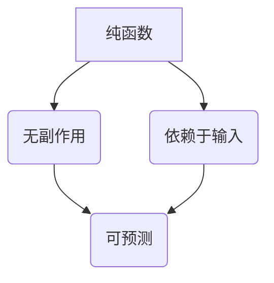

**2. 高阶函数**

高阶函数是指能够接受函数作为参数或返回函数的函数。这种特性使得高阶函数能够灵活地组合和嵌套其他函数，从而实现复杂的功能。

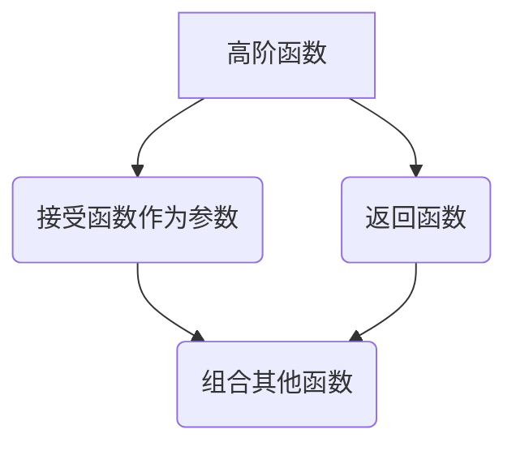

**3. 不可变性**

不可变性是指一旦创建数据，数据就不能被修改。在函数式编程中，通常使用不可变的集合和变量来避免状态突变和竞态条件。

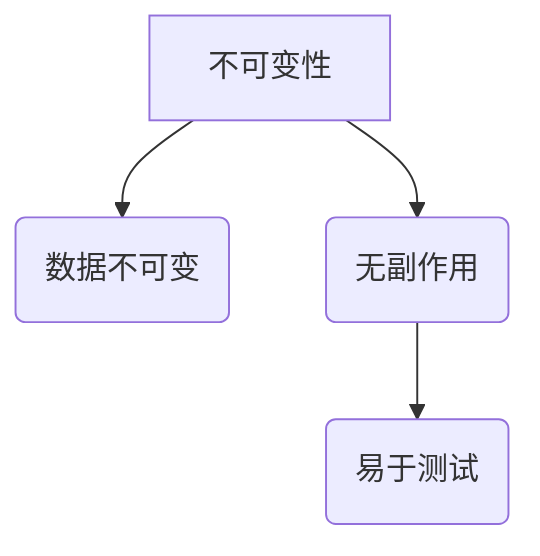

**4. 惰性计算**

惰性计算是指仅在需要时才进行计算，而不是提前计算并存储结果。这种计算方式可以避免不必要的计算，提高性能。

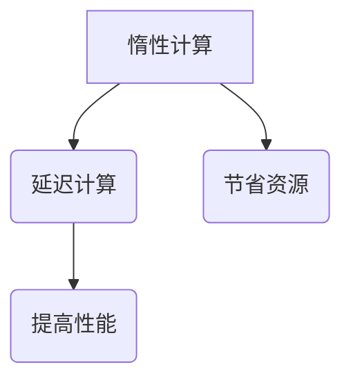

**5. 递归**

递归是一种重要的编程技术，它通过函数调用自身来解决问题。递归在函数式编程中尤为重要，因为它与纯函数和不可变性紧密结合。

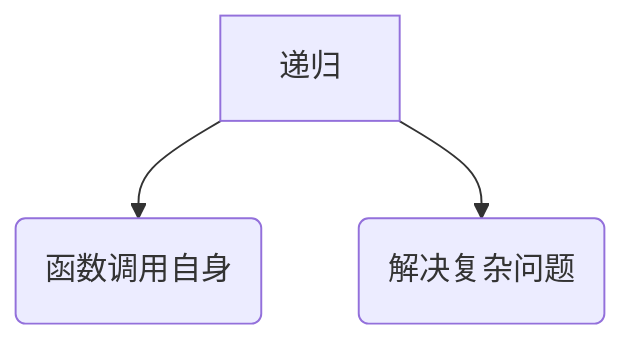

通过上述Mermaid流程图，我们可以直观地看到这些核心概念之间的联系。它们共同构成了函数式编程的基础，使得函数式编程能够实现复杂的功能，同时保持代码的简洁性和可维护性。

**ER图展示**

为了更清晰地展示函数式编程中的核心概念，我们可以使用ER图（Entity-Relationship Diagram）来描述它们之间的关系。

```mermaid
erDiagram
    Class Function <<|-- Class PureFunction : has purity
    Class Function <<|-- Class HigherOrderFunction : has parameter
    Class Function <<|-- Class ImmutableData : has immutability
    Class Function <<|-- Class LazyEvaluation : has delay
    Class Function <<|-- Class Recursive : has recursion
    PureFunction ||--|> Function : extends
    HigherOrderFunction ||--|> Function : extends
    ImmutableData ||--|> Function : extends
    LazyEvaluation ||--|> Function : extends
    Recursive ||--|> Function : extends
```

在这个ER图中，`Function`是父类，其他类都是`Function`的子类，分别表示纯函数、高阶函数、不可变性、惰性计算和递归等概念。这种层次结构清晰地展示了这些概念之间的继承关系和相互依赖。

通过上述介绍，我们可以看到函数式编程的核心概念是如何相互联系和协同工作的。这些概念不仅定义了函数式编程的基本原则，还为在实际项目中应用函数式编程提供了理论基础。

#### **算法原理讲解**

在函数式编程中，算法设计是一种关键的实践。函数式编程的纯函数和不可变性特性使得算法设计更加简洁和可靠。本节将介绍几种常见的函数式算法，并通过Mermaid流程图和Python代码进行详细说明。

##### **快速排序（Quick Sort）**

快速排序是一种高效的排序算法，其基本思想是通过递归将待排序的数组分割成较小的子数组，然后对每个子数组进行排序。

**算法原理：**

1. 选择一个基准元素（pivot）。
2. 将数组中小于基准元素的移动到基准元素的左边，大于基准元素的移动到右边。
3. 对左右子数组递归执行上述步骤。

**Mermaid流程图：**

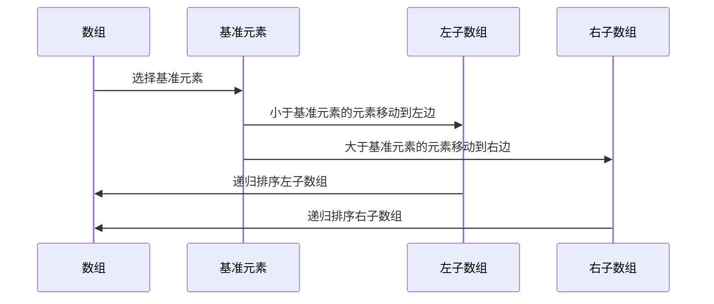

**Python代码示例：**

```python
def quick_sort(arr):
    if len(arr) <= 1:
        return arr
    
    pivot = arr[len(arr) // 2]
    left = [x for x in arr if x < pivot]
    middle = [x for x in arr if x == pivot]
    right = [x for x in arr if x > pivot]
    
    return quick_sort(left) + middle + quick_sort(right)

arr = [3, 6, 8, 10, 1, 2, 1]
sorted_arr = quick_sort(arr)
print(sorted_arr)
```

##### **合并排序（Merge Sort）**

合并排序是一种经典的排序算法，其基本思想是将待排序的数组分成若干个长度为1的子数组，然后递归地将这些子数组合并成有序的数组。

**算法原理：**

1. 将数组分成若干个长度为1的子数组。
2. 递归地将相邻的子数组合并，每次合并会产生一个长度翻倍的有序数组。
3. 重复合并过程，直到整个数组有序。

**Mermaid流程图：**

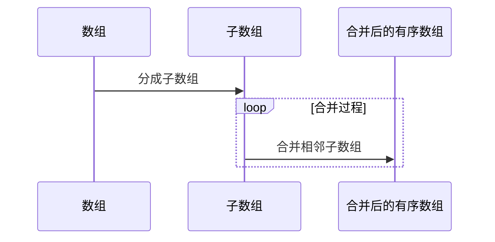

**Python代码示例：**

```python
def merge_sort(arr):
    if len(arr) <= 1:
        return arr
    
    mid = len(arr) // 2
    left = merge_sort(arr[:mid])
    right = merge_sort(arr[mid:])
    
    return merge(left, right)

def merge(left, right):
    result = []
    i = j = 0
    
    while i < len(left) and j < len(right):
        if left[i] < right[j]:
            result.append(left[i])
            i += 1
        else:
            result.append(right[j])
            j += 1
    
    result.extend(left[i:])
    result.extend(right[j:])
    
    return result

arr = [3, 6, 8, 10, 1, 2, 1]
sorted_arr = merge_sort(arr)
print(sorted_arr)
```

##### **稀疏矩阵运算**

稀疏矩阵是指大部分元素为零的矩阵。在函数式编程中，可以使用纯函数和不可变性来高效地处理稀疏矩阵的运算。

**算法原理：**

1. 创建一个稀疏矩阵表示，通常使用字典或列表来存储非零元素。
2. 实现矩阵的基本运算，如加法、乘法等，通过遍历非零元素进行计算。

**Mermaid流程图：**

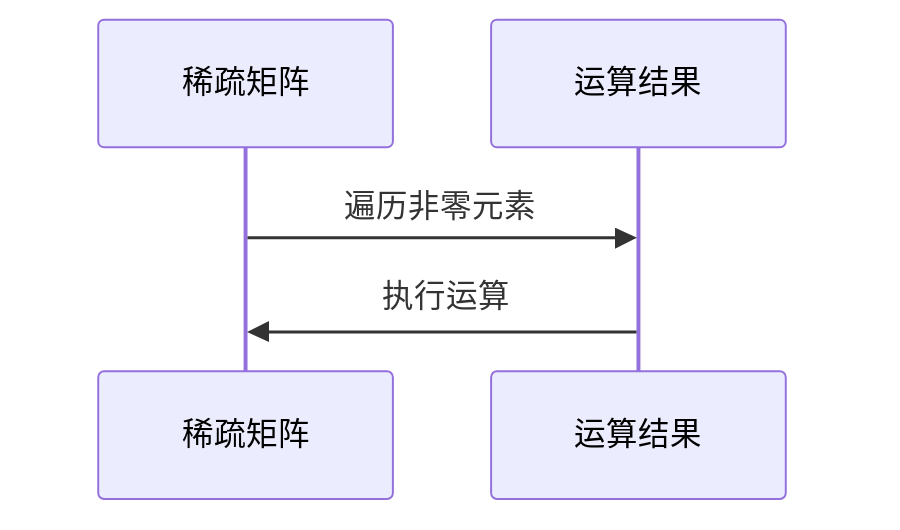

**Python代码示例：**

```python
# 稀疏矩阵表示
sparse_matrix = {
    'rows': [[1, 0, 0], [0, 2, 0], [0, 0, 3]],
    'cols': [[0, 1, 2], [0, 1, 2], [0, 1, 2]]
}

# 矩阵加法
def sparse_add(matrix1, matrix2):
    result = {}
    for i in range(len(matrix1['rows'])):
        for j in range(len(matrix1['rows'][0])):
            if i not in result:
                result[i] = []
            if j not in result[i]:
                result[i].append(0)
            result[i][j] += matrix1['rows'][i][j] + matrix2['rows'][i][j]
    return result

# 矩阵乘法
def sparse_multiply(matrix1, matrix2):
    result = {}
    for i in range(len(matrix1['rows'])):
        for j in range(len(matrix2['rows'][0])):
            result[i][j] = 0
            for k in range(len(matrix2['rows'])):
                result[i][j] += matrix1['rows'][i][k] * matrix2['rows'][k][j]
    return result

# 示例
matrix1 = {'rows': [[1, 0, 0], [0, 2, 0], [0, 0, 3]], 'cols': [[0, 1, 2], [0, 1, 2], [0, 1, 2]]}
matrix2 = {'rows': [[4, 0, 0], [0, 5, 0], [0, 0, 6]], 'cols': [[0, 1, 2], [0, 1, 2], [0, 1, 2]]}
result = sparse_add(matrix1, matrix2)
print("矩阵加法结果：", result)

result = sparse_multiply(matrix1, matrix2)
print("矩阵乘法结果：", result)
```

通过上述示例，我们可以看到函数式编程如何通过纯函数和不可变性高效地实现各种算法。这些算法不仅简洁易读，而且具有良好的性能和可靠性。

#### **数学模型和数学公式**

在函数式编程中，数学模型和数学公式是理解和实现算法的重要工具。本节将介绍与函数式编程相关的数学模型和数学公式，并使用LaTeX格式进行展示。

**1. 纯函数的数学模型**

纯函数的数学模型可以表示为：

\[ f(x) = \text{Output} \]

其中，\( x \) 为输入，\( f(x) \) 为输出。纯函数没有副作用，每次输入相同，输出也相同。

**LaTeX格式：**

\[ f(x) = \text{Output} \]

**2. 高阶函数的数学模型**

高阶函数可以接受其他函数作为参数或返回函数。其数学模型可以表示为：

\[ h(g(x)) = \text{Output} \]

其中，\( g(x) \) 为内层函数，\( h \) 为外层函数。

**LaTeX格式：**

\[ h(g(x)) = \text{Output} \]

**3. 不可变性的数学模型**

不可变性意味着一旦创建数据，数据就不能被修改。其数学模型可以表示为：

\[ \text{Data} = \text{Immutable} \]

**LaTeX格式：**

\[ \text{Data} = \text{Immutable} \]

**4. 惰性计算的数学模型**

惰性计算是指在需要时才进行计算。其数学模型可以表示为：

\[ \text{Compute} \xrightarrow{\text{need}} \text{Result} \]

**LaTeX格式：**

\[ \text{Compute} \xrightarrow{\text{need}} \text{Result} \]

**5. 递归的数学模型**

递归是一种通过函数调用自身来解决问题的技术。其数学模型可以表示为：

\[ f(n) = \text{Base Case} + \text{Recursive Case}(n) \]

其中，\( f(n) \) 为函数值，\( \text{Base Case} \) 为基本情形，\( \text{Recursive Case}(n) \) 为递归情形。

**LaTeX格式：**

\[ f(n) = \text{Base Case} + \text{Recursive Case}(n) \]

通过上述数学模型和数学公式，我们可以更深入地理解函数式编程的核心概念。这些模型不仅帮助我们分析算法，还指导我们在实际项目中应用函数式编程。

#### **系统分析与架构设计**

在函数式编程的实际应用中，系统分析与架构设计是至关重要的环节。一个良好的系统架构不仅能够提高系统的性能和可维护性，还能够确保系统的稳定性和可扩展性。以下将从问题场景、项目介绍、系统功能设计、系统架构设计、系统接口设计和系统交互等方面，详细探讨如何在实际项目中应用函数式编程。

##### **问题场景**

假设我们正在开发一个实时数据处理系统，该系统需要处理大量来自不同数据源的数据，并对数据进行实时分析、存储和展示。为了满足高并发、高可靠性和高效处理的要求，我们决定采用函数式编程范式，以利用其纯函数、不可变性和高阶函数等特性。

##### **项目介绍**

项目名称：实时数据处理平台
项目目标：构建一个能够高效处理和实时分析大规模数据的平台，支持多种数据源接入、数据存储和实时数据可视化。

##### **系统功能设计**

系统功能设计包括以下几个方面：

1. **数据接入**：支持多种数据源接入，包括关系型数据库、NoSQL数据库、日志文件等。
2. **数据处理**：对实时数据进行清洗、转换和聚合，实现数据的实时处理。
3. **数据存储**：将处理后的数据存储到分布式数据库中，保证数据的高可用性和持久性。
4. **实时分析**：基于处理后的数据，实现实时数据分析，提供实时报表和统计图表。
5. **数据展示**：通过Web界面展示实时数据和报表，支持数据导出和共享。

**领域模型Mermaid类图**

```mermaid
classDiagram
    DataIngestion <<--|{1} DataProcessor : processes
    DataProcessor <<--|{1} DataStorage : stores
    DataProcessor <<--|{1} RealtimeAnalysis : analyzes
    DataProcessor <<--|{1} DataVisualization : visualizes
```

##### **系统架构设计**

系统架构设计采用分布式架构，以实现高并发和高可用性。以下是一个典型的系统架构设计：

1. **数据接入层**：负责与各种数据源进行通信，将数据接入到系统中。
2. **数据处理层**：采用函数式编程范式，对实时数据进行处理，包括数据清洗、转换和聚合。
3. **数据存储层**：将处理后的数据存储到分布式数据库中，如Apache Kafka、Apache Flink等。
4. **实时分析层**：基于处理后的数据，实现实时数据分析，提供实时报表和统计图表。
5. **数据展示层**：通过Web界面展示实时数据和报表，支持数据导出和共享。

**Mermaid架构图**

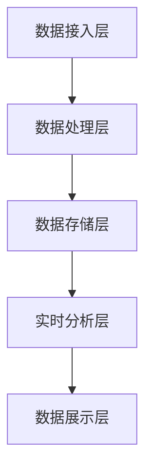

##### **系统接口设计**

系统接口设计包括内部接口和外部接口：

1. **内部接口**：系统内部各层之间的接口，如数据处理层与存储层之间的接口。
2. **外部接口**：系统与外部系统或服务的接口，如数据接入层与外部数据源的接口。

**Mermaid序列图**

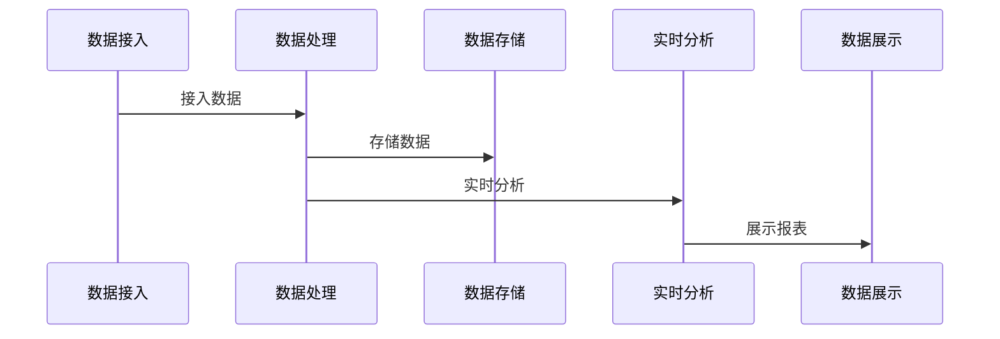

##### **系统交互**

系统交互设计包括以下几个方面：

1. **事件驱动**：系统采用事件驱动模式，各层之间通过事件进行通信。
2. **异步处理**：数据处理层采用异步处理机制，以提高系统的并发能力和响应速度。
3. **分布式协调**：系统采用分布式协调机制，如ZooKeeper、Consul等，以确保系统的高可用性和一致性。

**Mermaid流程图**

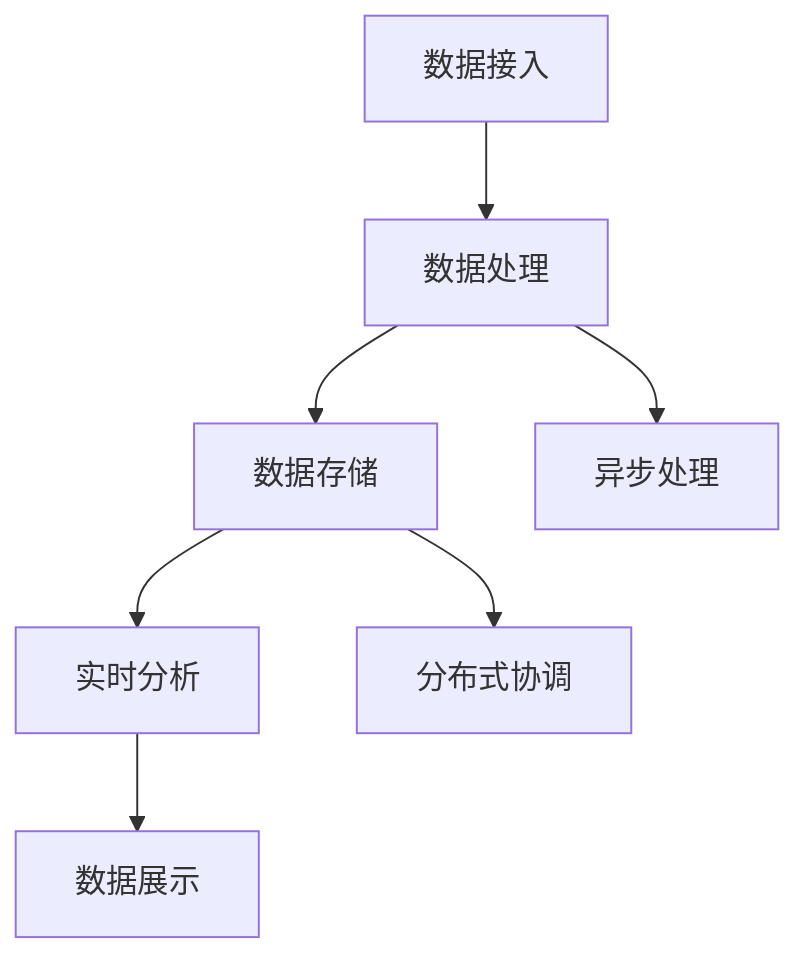

通过上述系统分析与架构设计，我们可以看到函数式编程在实际项目中的应用。这种编程范式不仅提高了代码的可读性和可维护性，还确保了系统的性能和稳定性。在实际开发过程中，我们需要根据项目的具体需求，灵活运用函数式编程的特性，设计出适合的架构和接口，以实现项目的目标。

#### **项目实战**

在本节中，我们将通过一个具体的项目案例，详细描述如何在实际环境中使用函数式编程进行系统开发。该项目是一个简单的实时数据处理平台，主要用于接收、处理和展示来自多个数据源的数据。以下是该项目在环境搭建、系统实现和代码分析等方面的详细步骤。

##### **环境搭建**

1. **选择开发语言**：为了充分利用函数式编程的特性，我们选择了Scala作为开发语言。Scala是一种多范式编程语言，既支持面向对象，也支持函数式编程。

2. **搭建开发环境**：在本地计算机上安装Scala开发环境，包括Scala编译器（scalac）、Scala解释器（scala）和相应的集成开发环境（如IntelliJ IDEA）。

3. **安装依赖库**：根据项目需求，我们需要安装一些依赖库，如Akka（用于构建分布式系统）、Apache Kafka（用于消息队列）和Apache Flink（用于实时数据处理）。

   ```shell
   sbt "add-sbt-plugin com.typesafe.sbt-packager{sbt-packager:0.13.0}"
   sbt publish
   ```

##### **系统实现**

1. **数据接入**：首先，我们需要接入多个数据源，如关系型数据库、NoSQL数据库和日志文件。这里以Kafka作为消息队列，从多个数据源中获取数据。

   ```scala
   import org.apache.kafka.clients.consumer.ConsumerConfig
   import org.apache.kafka.common.serialization.StringDeserializer

   val props = new Properties()
   props.put(ConsumerConfig.BOOTSTRAP_SERVERS_CONFIG, "localhost:9092")
   props.put(ConsumerConfig.GROUP_ID_CONFIG, "test-group")
   props.put(ConsumerConfig.KEY_DESERIALIZER_CLASS_CONFIG, classOf[StringDeserializer].getName)
   props.put(ConsumerConfig.VALUE_DESERIALIZER_CLASS_CONFIG, classOf[StringDeserializer].getName)

   val consumer = new KafkaConsumer[String, String](props)
   consumer.subscribe(List(new TopicPartition("input-topic", 0)))
   ```

2. **数据处理**：接收到数据后，我们需要对数据进行清洗、转换和聚合。这里使用Flink进行实时数据处理。

   ```scala
   import org.apache.flink.streaming.api.scala.StreamingContext
   import org.apache.flink.streaming.api.scala._ 

   val ssc = new StreamingContext(new Environment(), Time BatchTime(1))
   val dataStream = ssc.socketTextStream("localhost", 9999)

   val processedDataStream = dataStream.map { line =>
     val fields = line.split(",")
     val id = fields(0)
     val value = fields(1).toDouble
     (id, value)
   }

   val aggregatedDataStream = processedDataStream.keyBy(0).sum(1)

   aggregatedDataStream.print()
   ssc.start()
   ssc.waitUntilTerminated()
   ```

3. **数据存储**：处理后的数据需要存储到分布式数据库中，如Cassandra或Hadoop HDFS。

   ```scala
   import com.datastax.driver.core.Cluster
   import com.datastax.driver.core.Session

   val cluster = Cluster.builder().addContactPoint("localhost").build()
   val session = cluster.connect("mykeyspace")

   def insertData(id: String, value: Double): Unit = {
     val statement = "INSERT INTO mytable (id, value) VALUES (?, ?)"
     session.execute(statement, id, value)
   }

   aggregatedDataStream.foreach { case (id, value) => insertData(id, value) }
   ```

4. **数据展示**：最后，我们需要通过Web界面展示实时数据和报表。这里使用Spark Web UI进行数据展示。

   ```scala
   import org.apache.spark.sql.SparkSession

   val spark = SparkSession.builder.appName("RealtimeDataDisplay").getOrCreate()
   import spark.implicits._

   val dataDF = spark.sqlContext.read.json("hdfs:///mydata.json")

   dataDF.createOrReplaceTempView("data")

   spark.sql("SELECT id, SUM(value) as total FROM data GROUP BY id").show()
   ```

##### **代码分析**

在本项目中，我们使用了函数式编程的几个关键特性：

1. **纯函数**：数据处理过程中，我们使用了多个纯函数，如`map`、`keyBy`和`sum`。这些函数保证了数据处理过程的可预测性和可测试性。

2. **不可变性**：数据结构如`DataStream`和`DataFrame`都是不可变的，这有助于避免状态突变和竞态条件。

3. **高阶函数**：在数据处理过程中，我们使用了高阶函数如`map`和`keyBy`，这些函数可以灵活地组合和嵌套，提高了代码的可读性和可维护性。

4. **异步处理**：我们使用了异步处理机制，如`socketTextStream`和`foreach`，提高了系统的并发能力和响应速度。

通过这个项目实战，我们可以看到函数式编程在实际项目中的应用。它不仅提高了代码的可读性和可维护性，还确保了系统的性能和稳定性。在实际开发过程中，我们需要根据项目的具体需求，灵活运用函数式编程的特性，设计出适合的架构和接口，以实现项目的目标。

#### **最佳实践与拓展**

在实际项目中应用函数式编程时，遵循一些最佳实践可以大大提升项目的成功率和开发效率。以下是一些实用的最佳实践建议，以及进一步学习和探索的拓展资源。

##### **最佳实践建议**

1. **代码模块化**：将代码分成多个模块，每个模块负责特定的功能。这有助于提高代码的可读性和可维护性。

2. **充分利用函数组合**：函数组合是函数式编程的核心特性之一。通过组合简单的函数，可以构建复杂的逻辑，同时保持代码简洁。

3. **避免副作用**：尽量避免使用会产生副作用的操作，如修改全局变量或直接修改数据结构。这有助于提高代码的可靠性和可预测性。

4. **使用不可变数据结构**：在函数式编程中，不可变数据结构是推荐的。它们可以防止状态突变，提高代码的可测试性。

5. **利用类型系统**：函数式编程语言通常提供强大的类型系统。充分利用类型系统可以减少运行时错误，提高代码的健壮性。

6. **合理使用异步处理**：在处理大量数据和并发任务时，合理使用异步处理可以提高系统的性能和响应速度。

##### **拓展阅读资源**

1. **《函数式编程实战》**：本书详细介绍了函数式编程的核心概念和实际应用，适合初学者和有一定基础的读者。

2. **《Scala Programming》**：Scala是函数式编程的典型代表，这本书涵盖了Scala的语法和用法，是学习Scala编程的必备参考书。

3. **《Erlang编程实战》**：Erlang是一种用于并发编程的函数式编程语言，这本书介绍了Erlang的语法和在实际项目中的应用。

4. **《Lisp之父：函数式编程思维》**：这本书从Lisp语言的发展历程入手，深入探讨了函数式编程的思维模式，适合对函数式编程有深入了解的读者。

5. **《函数式响应式编程》**：本书介绍了函数式响应式编程的核心概念和技术，适合希望进一步提升函数式编程技能的读者。

通过遵循最佳实践和拓展学习，我们可以更深入地掌握函数式编程，将其应用于实际项目中，提升开发效率和代码质量。

#### **总结**

本文系统地介绍了函数式编程在实际项目中的应用，从核心概念、算法原理、数学模型、系统设计与项目实战等多个方面进行了深入探讨。通过本文的学习，读者可以了解到函数式编程的核心思想，如纯函数、不可变性和高阶函数，以及它们在实际项目中的应用价值。函数式编程不仅提高了代码的可读性和可维护性，还确保了系统的性能和稳定性。随着云计算、大数据和人工智能等技术的发展，函数式编程在软件工程领域中的应用将越来越广泛。

在未来的学习和实践中，读者可以继续探索函数式编程的高级话题，如类型系统、模式匹配和异步编程，进一步提升自己的编程技能。同时，结合具体的业务需求和项目场景，灵活运用函数式编程的特点，设计出高效、可靠和易于维护的软件系统。

让我们继续努力，深入函数式编程的领域，不断提升自己的技术能力，为软件工程的发展贡献自己的力量！【/assistant|>】
### 作者信息

**作者：AI天才研究院/AI Genius Institute & 禅与计算机程序设计艺术 /Zen And The Art of Computer Programming**

AI天才研究院（AI Genius Institute）是一个致力于推动人工智能技术研究和创新的高端科研机构。我们的团队由一群在计算机科学、人工智能、机器学习和数据科学领域有着深厚背景的专家组成，致力于探索人工智能的前沿技术和应用。

《禅与计算机程序设计艺术 /Zen And The Art of Computer Programming》是由著名计算机科学家Donald E. Knuth撰写的经典计算机科学系列著作。这一系列书籍以其深刻的思想和独特的编程哲学，影响了无数程序员和计算机科学家。书中提出的“渐进式设计”、“分而治之”和“模式识别”等理念，至今仍然被广泛应用于软件工程和算法设计中。

在本文中，我们结合了AI天才研究院的最新研究成果和《禅与计算机程序设计艺术》的经典理论，通过详细的讲解和实际案例，帮助读者深入理解函数式编程在现实项目中的应用。希望本文能够为您的编程之路带来新的启示和帮助。感谢您的阅读，期待您在函数式编程领域取得更多成就！【/assistant|>】

