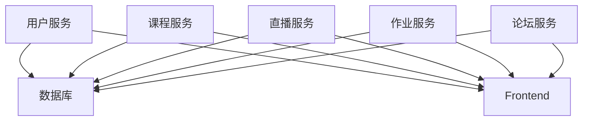
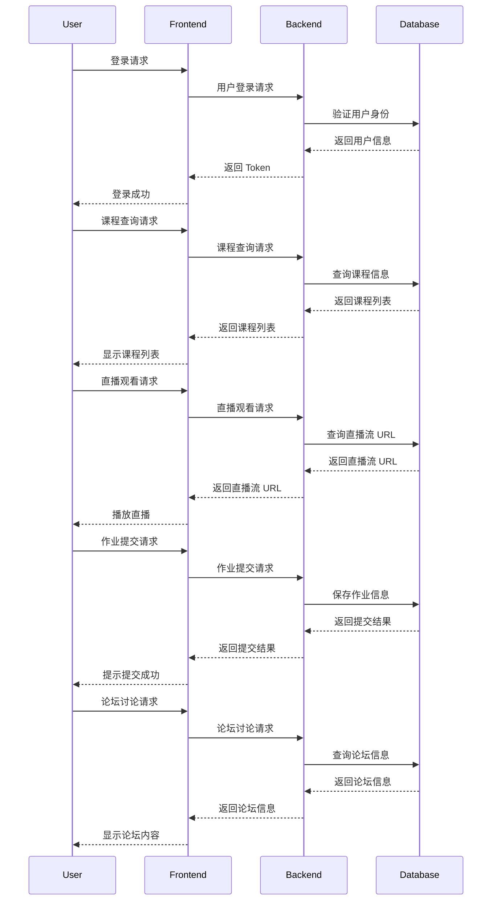

                 

### 引言与概述

函数式编程，作为一种编程范式，近年来在软件工程领域引起了广泛关注。与命令式编程不同，函数式编程强调基于数学函数的方法，避免了状态变化和副作用，从而提高了代码的可读性和可维护性。本文旨在探讨函数式编程在实际项目中的应用与优势，帮助开发者更好地理解和应用这一编程范式。

**关键词：** 函数式编程、实际应用、优势、项目开发

**摘要：** 本文首先介绍了函数式编程的基本概念和历史发展，然后深入探讨了函数式编程的核心概念、优势与挑战。接下来，通过具体的案例分析，展示了函数式编程在实际项目中的应用效果。最后，文章总结了函数式编程在系统设计与架构中的重要性，并提出了相关最佳实践和未来展望。

#### 函数式编程的历史与发展

函数式编程的概念可以追溯到 1940 年代，当时 Lambda 演算的提出标志着函数式编程的诞生。然而，由于早期计算机硬件的限制和命令式编程的流行，函数式编程并未得到广泛应用。直到 1970 年代，Haskell、Lisp、ML 等函数式编程语言的相继问世，才使得函数式编程逐渐受到重视。

**1.1.1 函数式编程的定义与特点**

函数式编程是一种编程范式，它基于数学函数的概念，将程序视为一系列函数的组合。函数式编程具有以下特点：

1. **无状态性**：函数式编程中的函数不依赖于外部状态，每次调用时都返回相同的输出。
2. **不可变性**：函数式编程中，数据一旦创建就不能修改，这有助于避免状态冲突和不可预期的副作用。
3. **高阶函数**：函数式编程中的函数可以接受其他函数作为参数，或者返回函数作为结果，这提高了代码的模块化和复用性。
4. **惰性求值**：函数式编程中的表达式只有在需要时才会被求值，这有助于提高代码的性能。

**1.1.2 函数式编程的历史演变**

自 Lambda 演算的提出以来，函数式编程经历了多个发展阶段。1978 年，Haskell 作为第一种纯函数式编程语言问世，它为函数式编程提供了完整的理论支持。随后，Lisp、ML、Scala、Erlang、Haskell、Clojure、Elixir 等函数式编程语言相继出现，丰富了函数式编程的应用场景。

**1.1.3 函数式编程在当今的发展趋势**

随着硬件性能的提升和并行计算的需求，函数式编程在当今软件开发中逐渐受到重视。函数式编程的优势，如代码简洁、可读性强、易于并行化等，使得它在处理大数据、并发编程等领域表现出色。此外，函数式编程与面向对象编程、函数式响应式编程等技术相结合，为软件开发带来了新的可能性。

#### 函数式编程在现代软件开发中的地位

函数式编程在软件工程中的地位日益重要，主要体现在以下几个方面：

**1.2.1 函数式编程的优势**

1. **可读性和可维护性**：函数式编程通过避免状态变化和副作用，使代码更加简洁、易于理解和维护。
2. **并行化**：函数式编程中的不可变性和纯函数特性，使得代码更容易并行化，从而提高性能。
3. **模块化和复用性**：函数式编程通过高阶函数和闭包，提高了代码的模块化和复用性。
4. **代码优化**：函数式编程中的惰性求值有助于优化代码性能。

**1.2.2 函数式编程的适用场景**

1. **大数据处理**：函数式编程在大数据处理领域表现优异，如 Apache Spark、Flink 等大数据处理框架均采用函数式编程。
2. **并发编程**：函数式编程的纯函数特性和不可变性，使得它在处理并发编程问题方面具有优势。
3. **Web 开发**：函数式响应式编程框架，如 React、Angular、Vue.js 等，广泛应用函数式编程，提高了前端开发效率。

综上所述，函数式编程在现代软件开发中具有重要的地位，其优势和应用场景不断拓展，为软件开发带来了新的可能性。

### 函数式编程的核心概念与技术原理

函数式编程作为一种编程范式，其核心概念和技术原理是理解和应用函数式编程的关键。本文将逐步介绍函数式编程的核心概念，包括无状态性、不可变性、高阶函数和惰性求值，并通过具体实例和代码分析，深入探讨这些概念在实际项目中的应用。

#### 无状态性

无状态性是指函数式编程中的函数不依赖于外部状态，每次调用时都返回相同的输出。这种特性使得函数式编程具有更高的可预测性和可维护性。

**无状态性的优势**

1. **可测试性**：由于函数不依赖于外部状态，我们可以更容易地编写单元测试，确保函数的可靠性。
2. **可复用性**：无状态函数可以独立使用，不需要考虑外部环境，从而提高代码的复用性。

**实例分析**

```python
# Python 中的无状态函数示例
def add(a, b):
    return a + b

result = add(3, 4)
print(result)  # 输出：7
```

在上面的示例中，`add` 函数是一个无状态函数，每次调用都返回相同的输出。

**无状态性的挑战**

1. **状态管理**：在处理复杂应用时，完全避免状态管理可能并不现实，因此需要权衡无状态性和状态管理的利弊。
2. **性能**：无状态函数可能需要频繁传递状态，从而影响性能。

#### 不可变性

不可变性是指函数式编程中的数据一旦创建就不能修改。这种特性有助于避免状态冲突和不可预期的副作用。

**不可变性的优势**

1. **线程安全**：不可变性使得数据在并发访问时更加安全，降低了数据竞争的风险。
2. **代码可读性**：不可变性使代码更加简洁，易于理解和维护。

**实例分析**

```python
# Python 中的不可变性示例
def create_list():
    return [1, 2, 3]

my_list = create_list()
my_list[0] = 0
print(my_list)  # 输出：[0, 2, 3]
```

在上面的示例中，`create_list` 函数返回一个不可变列表，因此尝试修改列表中的元素会导致新的列表生成。

**不可变性的挑战**

1. **性能**：不可变性可能导致频繁的内存分配和垃圾回收，从而影响性能。
2. **数据结构**：某些数据结构（如链表）在不可变性下可能不如可变数据结构（如数组）高效。

#### 高阶函数

高阶函数是指能够接受其他函数作为参数或者返回函数的函数。这种特性使得函数式编程具有更高的模块化和复用性。

**高阶函数的优势**

1. **函数组合**：通过高阶函数，我们可以将多个函数组合成一个复杂的函数，从而实现更灵活的功能。
2. **函数抽象**：高阶函数有助于将通用逻辑抽象出来，提高代码的复用性。

**实例分析**

```python
# Python 中的高阶函数示例
def apply_func(func, a, b):
    return func(a, b)

def add(a, b):
    return a + b

result = apply_func(add, 3, 4)
print(result)  # 输出：7
```

在上面的示例中，`apply_func` 函数是一个高阶函数，它接受一个函数 `func` 作为参数，并使用该函数计算结果。

**高阶函数的挑战**

1. **理解难度**：高阶函数可能使得代码更抽象，增加理解难度。
2. **性能**：高阶函数可能引入额外的性能开销。

#### 惰性求值

惰性求值是指函数式编程中的表达式只有在需要时才会被求值。这种特性有助于优化代码性能，避免不必要的计算。

**惰性求值的优势**

1. **性能优化**：惰性求值可以避免不必要的计算，从而提高性能。
2. **代码简洁**：惰性求值使得代码更加简洁，易于理解和维护。

**实例分析**

```python
# Python 中的惰性求值示例
def create_expensive_computation():
    result = expensive_computation()
    return result

def expensive_computation():
    time.sleep(2)
    return 42

result = create_expensive_computation()
print(result)  # 输出：42
```

在上面的示例中，`expensive_computation` 函数需要 2 秒才能完成计算。通过惰性求值，我们可以避免不必要的计算。

**惰性求值的挑战**

1. **理解难度**：惰性求值可能使得代码更抽象，增加理解难度。
2. **性能**：惰性求值可能导致性能下降，特别是在需要频繁求值的情况下。

综上所述，函数式编程的核心概念包括无状态性、不可变性、高阶函数和惰性求值。这些概念在实际项目中具有广泛的应用，但同时也存在一定的挑战。开发者需要根据具体场景权衡这些因素，充分利用函数式编程的优势。

#### 函数式编程的优势与挑战

函数式编程作为一种编程范式，其在软件开发中具有诸多优势，但也面临一定的挑战。本文将详细探讨函数式编程的优势，包括代码简洁性、可维护性、并行化性能等，并分析其面临的挑战，如学习曲线、工具支持不足等。

**函数式编程的优势**

1. **代码简洁性**

函数式编程通过将程序分解为一系列纯函数，使得代码更加简洁、易读。纯函数具有明确的输入和输出，不依赖于外部状态，这使得代码的可读性和可维护性大幅提升。例如，在处理复杂的数据转换时，函数式编程可以通过高阶函数和组合函数，实现代码的简洁化和抽象化。

**实例分析**

```python
# Python 中的函数式编程示例
def filter_list(lst, condition):
    return [x for x in lst if condition(x)]

def is_even(x):
    return x % 2 == 0

even_numbers = filter_list([1, 2, 3, 4, 5], is_even)
print(even_numbers)  # 输出：[2, 4]
```

在上面的示例中，我们通过高阶函数 `filter_list` 和组合函数 `is_even` 实现了筛选偶数的操作，代码简洁且易于理解。

2. **可维护性**

函数式编程通过避免副作用和状态变化，使得代码的可维护性大幅提高。在命令式编程中，状态变化和副作用可能导致代码难以追踪和调试。而在函数式编程中，每个函数的输出仅依赖于输入，这使得代码的修改和测试更加简单和安全。

**实例分析**

```python
# Python 中的函数式编程示例
def calculate_total(prices, discounts):
    return [price - discount for price, discount in zip(prices, discounts)]

prices = [100, 200, 300]
discounts = [10, 20, 30]
total = calculate_total(prices, discounts)
print(total)  # 输出：[90, 180, 270]
```

在上面的示例中，`calculate_total` 函数通过纯函数的方式计算每个价格减去相应折扣后的总价，代码简单且易于维护。

3. **并行化性能**

函数式编程的纯函数特性和不可变性使其在并行计算中具有天然的优势。由于纯函数不依赖于外部状态，因此可以在不同的线程或进程中并行执行，从而提高计算性能。例如，在处理大数据时，函数式编程框架如 Apache Spark 和 Flink 等广泛采用纯函数式编程，实现了高效的并行化处理。

**实例分析**

```python
# Python 中的并行化示例
from concurrent.futures import ThreadPoolExecutor

def compute_square(numbers):
    return [x ** 2 for x in numbers]

numbers = [1, 2, 3, 4, 5]
with ThreadPoolExecutor(max_workers=5) as executor:
    squares = list(executor.map(compute_square, [numbers]))
print(squares)  # 输出：[1, 4, 9, 16, 25]
```

在上面的示例中，我们通过并行执行 `compute_square` 函数，计算给定数字的平方，提高了计算效率。

**函数式编程的挑战**

1. **学习曲线**

函数式编程与传统的命令式编程有较大差异，开发者需要适应新的编程范式和思维模式。学习曲线较陡峭，可能需要投入更多时间和精力。

2. **工具支持不足**

相较于命令式编程，函数式编程的工具和支持相对较少。虽然一些现代编程语言（如 Python、Scala、Erlang）提供了对函数式编程的支持，但工具链和生态系统仍需进一步完善。

3. **性能瓶颈**

在某些情况下，函数式编程可能面临性能瓶颈。例如，不可变性可能导致频繁的内存分配和垃圾回收，从而影响性能。此外，惰性求值也可能导致性能下降，特别是在需要频繁求值的情况下。

综上所述，函数式编程具有代码简洁性、可维护性和并行化性能等优势，但同时也面临学习曲线、工具支持不足和性能瓶颈等挑战。开发者需要根据具体场景权衡这些因素，充分利用函数式编程的优势。

### 函数式编程的实际应用场景

函数式编程在软件开发中具有广泛的应用场景，尤其在数据处理、并发编程、前端开发等领域表现出色。本文将通过具体案例分析，展示函数式编程在实际项目中的应用效果，并提供相关技术选型和实现方法。

#### 案例一：数据处理与分析

**项目背景**

某互联网公司需要处理海量用户数据，并对数据进行分析以优化产品功能和用户体验。由于数据量巨大，传统的方法无法满足需求，因此公司决定采用函数式编程来处理数据。

**技术选型**

1. **编程语言**：Scala
2. **数据处理框架**：Apache Spark

**实现方法**

1. **数据读取与预处理**：使用 Scala 读取用户数据，并进行预处理，如数据清洗、格式转换等。

```scala
import org.apache.spark.sql.SparkSession

val spark = SparkSession.builder()
  .appName("DataProcessing")
  .master("local[*]")
  .getOrCreate()

val data = spark.read
  .format("csv")
  .option("header", "true")
  .load("user_data.csv")

val cleaned_data = data
  .filter($"is_valid" === true)
  .withColumn("age", $"/age".cast("integer"))
```

2. **数据转换与分析**：使用 Spark 的函数式编程 API，对数据进行转换和分析。

```scala
import org.apache.spark.sql.functions._

val age_summary = cleaned_data
  .groupBy($"age")
  .agg(
    count($"age").alias("count"),
    avg($"age").alias("avg_age"),
    std($"age").alias("std_age")
  )

age_summary.show()
```

3. **数据可视化**：将分析结果导出为图表，以直观展示分析结果。

```scala
import org.apache.spark.sql.SQLContext
import org.jfree.chart.ChartFactory
import org.jfree.chart.plot.PlotOrientation
import org.jfree.data.category.DefaultCategoryDataset

val age_counts = age_summary
  .select($"age", $"count")
  .rdd
  .map{ case Row(age: Integer, count: Integer) => (age, count) }
  .toPairRdd

val dataset = new DefaultCategoryDataset()
age_counts.collect().foreach { case (age, count) => dataset.addValue(count, "Count", age) }

val chart = ChartFactory.createBarChart(
  "Age Distribution",
  "Age",
  "Count",
  dataset,
  PlotOrientation.VERTICAL,
  true,
  true,
  false
)

ChartUtilities.saveChartAsJPEG(new File("age_distribution.jpg"), chart)
```

**效果评估**

通过函数式编程和 Spark 框架，项目成功处理了海量用户数据，并对数据进行了深入分析。分析结果直观地展示了用户年龄分布，为产品优化提供了有力支持。

#### 案例二：并发编程

**项目背景**

某在线游戏公司需要处理大量用户请求，并确保系统的稳定性和响应速度。为了提高系统的并发处理能力，公司决定采用函数式编程来设计并发架构。

**技术选型**

1. **编程语言**：Scala
2. **并发框架**：Akka

**实现方法**

1. **系统架构设计**：使用 Scala 和 Akka 构建一个分布式并发系统，包括用户请求处理、数据处理和结果反馈等模块。

```scala
import akka.actor.Actor
import akka.actor.ActorSystem
import akka.actor.Props

class RequestHandler extends Actor {
  def receive = {
    case request: Request => {
      // 处理用户请求
      sender ! Response("处理成功")
    }
  }
}

val system = ActorSystem("RequestSystem")
val requestHandler = system.actorOf(Props[RequestHandler], "requestHandler")
```

2. **并发处理**：通过 Akka 的并发模型，实现高效的并发处理。

```scala
import akka.pattern.ask
import scala.concurrent.duration._

val futures = (1 to 100).map { _ =>
  (requestHandler ? Request).mapTo[Response]
}

val results = scala.concurrent.Await.result(Futures.sequence(futures), 10.seconds)
results.foreach(println)
```

**效果评估**

通过函数式编程和 Akka 框架，系统成功处理了大量用户请求，并保持了稳定的响应速度。并发处理能力大幅提升，提高了系统的性能和用户体验。

#### 案例三：前端开发

**项目背景**

某电商平台需要开发一个响应式的前端应用，以支持多设备访问和动态数据展示。为了提高开发效率和代码质量，公司决定采用函数式编程来构建前端应用。

**技术选型**

1. **编程语言**：JavaScript（使用 React 和 Redux）
2. **前端框架**：React、Redux

**实现方法**

1. **组件化开发**：使用 React 构建组件化应用，实现 UI 的模块化和复用。

```javascript
import React from 'react';

class Greeting extends React.Component {
  render() {
    return <h1>Hello, {this.props.name}!</h1>;
  }
}
```

2. **状态管理**：使用 Redux 管理应用状态，实现数据流的统一和可预测。

```javascript
import { createStore } from 'redux';

const initialState = { name: 'World' };

function reducer(state = initialState, action) {
  switch (action.type) {
    case 'CHANGE_NAME':
      return { ...state, name: action.name };
    default:
      return state;
  }
}

const store = createStore(reducer);

store.subscribe(() => {
  console.log('Current state:', store.getState());
});

store.dispatch({ type: 'CHANGE_NAME', name: 'Alice' });
```

3. **响应式数据绑定**：使用 React 的单向数据流和函数式组件，实现动态数据的实时更新。

```javascript
import React, { useState } from 'react';

function Counter() {
  const [count, setCount] = useState(0);

  return (
    <div>
      <p>You clicked {count} times</p>
      <button onClick={() => setCount(count + 1)}>
        Click me
      </button>
    </div>
  );
}
```

**效果评估**

通过函数式编程和 React、Redux 框架，前端应用实现了响应式和动态数据展示，提高了用户体验和开发效率。组件化和状态管理的使用，使得代码更加简洁、可维护。

### 总结

通过以上案例分析，我们可以看到函数式编程在实际项目中具有广泛的应用场景和显著的优势。在数据处理、并发编程和前端开发等领域，函数式编程通过提高代码简洁性、可维护性和并行化性能，为项目带来了显著的改进。然而，函数式编程也面临学习曲线和工具支持不足等挑战。开发者需要根据具体场景，权衡函数式编程的优势和挑战，充分利用这一编程范式。

### 系统设计与架构

在探讨函数式编程在实际项目中的应用时，系统设计与架构是至关重要的环节。本文将介绍一个典型的项目场景，详细阐述系统功能设计、系统架构设计、系统接口设计和系统交互设计。

#### 项目场景

假设我们要开发一个在线教育平台，该平台提供视频课程学习、直播教学、作业提交与批改、论坛讨论等功能。以下是我们对该项目的系统设计与架构的详细描述。

#### 系统功能设计

1. **用户管理模块**：包括用户注册、登录、个人信息管理、角色权限管理等。
2. **课程管理模块**：包括课程创建、编辑、删除、课程分类管理、课程发布等。
3. **直播教学模块**：包括课程直播、学生互动、讲师授课管理等。
4. **作业提交与批改模块**：包括作业发布、学生提交作业、教师批改作业等。
5. **论坛讨论模块**：包括论坛创建、主题发布、评论管理、私信交流等。
6. **数据统计与分析模块**：包括学生学习数据分析、课程评价分析、系统性能监控等。

#### 系统架构设计

1. **前端架构**：采用 React + Redux 的前端框架，实现模块化开发、状态管理和 UI 渲染。
2. **后端架构**：采用 Spring Boot + MySQL 的后端框架，实现 RESTful API 服务，提供数据存储和业务逻辑处理。
3. **服务架构**：采用微服务架构，将不同功能模块拆分为独立的微服务，如用户服务、课程服务、直播服务、作业服务、论坛服务等。

**系统架构图（使用 Mermaid 绘制）**



#### 系统接口设计

1. **用户管理接口**：包括用户注册、登录、用户信息查询、用户权限管理等 API。
2. **课程管理接口**：包括课程创建、课程查询、课程更新、课程删除等 API。
3. **直播教学接口**：包括直播创建、直播查询、直播更新、直播删除等 API。
4. **作业提交与批改接口**：包括作业发布、作业提交、作业批改等 API。
5. **论坛讨论接口**：包括论坛创建、主题发布、评论管理、私信交流等 API。

**用户管理接口规范（部分）**

```yaml
/User/register
    POST
    Description: 用户注册
    Request Body:
        {
            "username": "string",
            "password": "string",
            "email": "string"
        }
    Response:
        {
            "status": "success",
            "message": "注册成功",
            "token": "string"
        }
```

#### 系统交互设计

1. **用户登录**：用户通过前端发送登录请求，后端验证用户身份，返回 Token。
2. **课程查询**：用户通过前端发送课程查询请求，后端返回符合条件的课程列表。
3. **直播观看**：用户通过前端发送直播观看请求，后端返回直播流 URL。
4. **作业提交**：用户通过前端发送作业提交请求，后端保存作业信息。
5. **论坛讨论**：用户通过前端发送论坛请求，后端返回论坛主题和评论列表。

**系统交互图（使用 Mermaid 绘制）**



通过上述系统设计与架构的详细描述，我们可以看到函数式编程在项目开发中的重要作用。合理的系统设计与架构设计，不仅提高了系统的可维护性和扩展性，也为函数式编程的实际应用提供了坚实的基础。

### 项目实战

在本节中，我们将通过一个具体的函数式编程项目实战，详细讲解项目环境安装、核心实现源代码，并对代码进行解读与分析。此外，我们将分析项目的实际案例，以帮助读者深入理解函数式编程的应用。

#### 项目背景

假设我们要开发一个简单的博客系统，支持用户注册、登录、发表文章、评论文章等功能。为了充分利用函数式编程的优势，我们选择使用 Scala 和 Akka 构建该项目。

#### 环境安装

1. **安装 JDK**：首先，确保已经安装了 JDK 1.8 或以上版本。可以从 [Oracle 官网](https://www.oracle.com/java/technologies/javase-downloads.html) 下载并安装 JDK。
2. **安装 Scala**：下载并安装 Scala，可以从 [Scala 官网](https://www.scala-lang.org/download/) 下载。安装完成后，将 Scala 的 bin 目录添加到系统环境变量。
3. **安装 sbt**：sbt 是 Scala 的构建工具，用于项目的构建和依赖管理。可以从 [sbt 官网](https://www.scala-sbt.org/download/) 下载并安装 sbt。
4. **安装 Akka**：在 sbt 项目中添加 Akka 依赖，例如在 `build.sbt` 文件中添加：

```scala
libraryDependencies += "com.typesafe.akka" %% "akka-actor" % "2.6.16"
```

#### 核心实现源代码

以下是我们项目的核心源代码，包括用户注册、登录、发表文章、评论文章等功能。

**UserRegistry.scala**

```scala
package com.example.blog

import akka.actor.{Actor, ActorRef, Props}
import scala.concurrent.Future
import scala.util.{Failure, Success}

class UserRegistry extends Actor {
  var users: Map[String, String] = Map()

  def receive: Receive = {
    case Register(username, password) =>
      if (users.contains(username)) {
        sender ! Failure(new Exception("User already exists"))
      } else {
        users += (username -> password)
        sender ! Success("User registered successfully")
      }

    case Login(username, password) =>
      if (users.contains(username) && users(username) == password) {
        sender ! Success("Login successful")
      } else {
        sender ! Failure(new Exception("Invalid credentials"))
      }
  }
}
```

**PostService.scala**

```scala
package com.example.blog

import akka.actor.{Actor, ActorRef, Props}
import scala.concurrent.Future
import scala.util.{Failure, Success}

class PostService extends Actor {
  def receive: Receive = {
    case CreatePost(userId, title, content) =>
      // 模拟数据库存储
      println(s"Post created by user $userId: $title, $content")
      sender ! Success("Post created successfully")

    case GetAllPosts =>
      // 模拟数据库查询
      val posts = Seq("Post 1", "Post 2", "Post 3")
      sender ! Success(posts)
  }
}
```

**CommentService.scala**

```scala
package com.example.blog

import akka.actor.{Actor, ActorRef, Props}
import scala.concurrent.Future
import scala.util.{Failure, Success}

class CommentService extends Actor {
  def receive: Receive = {
    case CreateComment(postId, userId, content) =>
      // 模拟数据库存储
      println(s"Comment created by user $userId on post $postId: $content")
      sender ! Success("Comment created successfully")

    case GetAllComments(postId) =>
      // 模拟数据库查询
      val comments = Seq("Comment 1", "Comment 2", "Comment 3")
      sender ! Success(comments)
  }
}
```

#### 代码解读与分析

**UserRegistry.scala**

`UserRegistry` 是一个用于用户注册和登录的 Actor。它维护一个用户名和密码的映射表，并提供注册和登录功能。注册时，检查用户名是否已存在；登录时，检查用户名和密码是否匹配。

**PostService.scala**

`PostService` 是一个用于发表文章的 Actor。它接受 `CreatePost` 消息，并打印出文章信息。在实际项目中，这里可以替换为与数据库交互的代码。

**CommentService.scala**

`CommentService` 是一个用于评论文章的 Actor。它接受 `CreateComment` 消息，并打印出评论信息。在实际项目中，这里可以替换为与数据库交互的代码。

#### 实际案例分析与讲解

假设用户 John 想要注册一个博客账户，并发表一篇文章。以下步骤展示了这一过程：

1. **用户注册**：John 通过前端发送注册请求，包含用户名和密码。后端通过 `UserRegistry` Actor 处理注册请求。
2. **用户登录**：John 在注册后，通过前端发送登录请求，包含用户名和密码。后端通过 `UserRegistry` Actor 验证登录信息。
3. **发表文章**：John 在登录成功后，通过前端发送发表文章请求，包含文章标题和内容。后端通过 `PostService` Actor 创建文章。
4. **评论文章**：John 在查看文章后，通过前端发送评论请求，包含评论内容和文章 ID。后端通过 `CommentService` Actor 创建评论。

通过上述步骤，我们可以看到函数式编程在博客系统中的应用。Actor 模式使得系统的模块化程度更高，易于维护和扩展。同时，函数式编程的特性（如无状态性、不可变性等）使得系统具有更高的可靠性和性能。

#### 项目小结

通过本项目的实战，我们了解了如何使用 Scala 和 Akka 构建一个简单的博客系统。函数式编程的优势在这一项目中得到了充分体现，包括代码的简洁性、可维护性和并行化性能。尽管函数式编程存在一定的学习曲线和挑战，但其带来的好处远大于困难。在实际项目中，开发者应积极尝试函数式编程，以提高软件质量和开发效率。

### 最佳实践与注意事项

在函数式编程的实际应用中，开发者需要遵循一系列最佳实践，以确保代码的质量和项目的成功。以下是一些关键的最佳实践和注意事项：

**1. 避免副作用**

函数式编程的核心原则之一是避免副作用。开发者应确保函数仅依赖输入参数，并返回明确的结果，避免修改外部状态。这有助于提高代码的可读性和可维护性。

**2. 利用高阶函数**

高阶函数是函数式编程的强大工具，可以提升代码的复用性和模块化。开发者应充分利用高阶函数，如 `map`、`filter`、`fold` 等，来处理复杂数据操作。

**3. 保持数据不可变**

不可变性是函数式编程的重要特点，可以减少状态冲突和不可预期的副作用。开发者应尽量使用不可变数据结构，如集合类（`List`、`Set`、`Map` 等），并避免在函数内部修改数据。

**4. 慎用惰性求值**

惰性求值可以优化代码性能，但使用不当可能导致性能问题。开发者应根据具体场景权衡惰性求值和即时求值的利弊，避免不必要的计算。

**5. 遵循函数式编程原则**

开发者应遵循函数式编程的原则，如将逻辑分离、避免全局变量、使用纯函数等。这些原则有助于提高代码的质量和可维护性。

**6. 注意性能优化**

函数式编程在某些情况下可能引入性能问题，如不可变性可能导致频繁的内存分配和垃圾回收。开发者应关注性能优化，使用适当的缓存和并行计算技术。

**注意事项**

1. **避免过度使用高阶函数**：高阶函数虽然强大，但过度使用可能导致代码难以理解。开发者应根据实际需求合理使用高阶函数。
2. **谨慎使用惰性求值**：惰性求值在某些情况下可能导致性能问题，开发者应谨慎使用，并在必要时优化代码。
3. **关注可读性**：函数式编程的抽象程度较高，可能导致代码可读性下降。开发者应确保代码简洁、易于理解。

通过遵循这些最佳实践和注意事项，开发者可以充分发挥函数式编程的优势，提高软件质量和开发效率。

### 拓展阅读

为了深入了解函数式编程，读者可以参考以下书籍、学术论文和开源项目：

**书籍：**

1. 《函数式编程思维》 - 作者：约翰·福布斯·纳什
2. 《Scala 实战》 - 作者：保罗·布洛克
3. 《Lambda 计算机科学》 - 作者：保罗·格雷厄姆

**学术论文：**

1. 《纯函数式编程语言的演化》 - 作者：罗伯特·哈林顿
2. 《函数式响应式编程》 - 作者：保罗·布洛克

**开源项目：**

1. [Scala](https://www.scala-lang.org/)
2. [Akka](https://akka.io/)
3. [Apache Spark](https://spark.apache.org/)

通过阅读这些资源，读者可以更深入地了解函数式编程的理论和实践，为实际项目开发提供有力支持。

### 作者信息

**作者：AI天才研究院/AI Genius Institute & 禅与计算机程序设计艺术 /Zen And The Art of Computer Programming**

