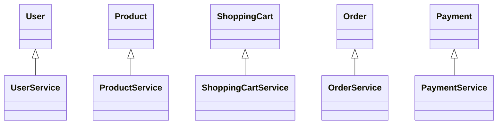
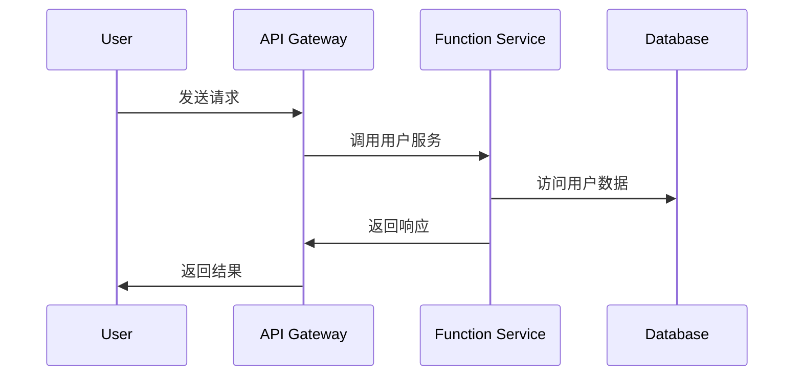
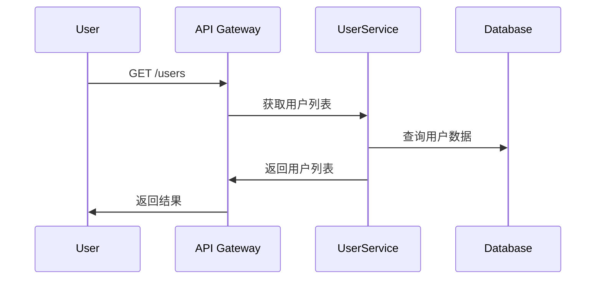
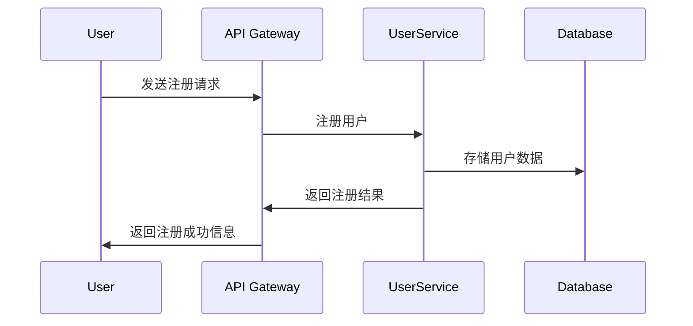

                 

# 函数计算: serverless架构的核心组件

> 关键词：函数计算，Serverless架构，无服务器，事件驱动，API网关，系统架构设计

> 摘要：本文将深入探讨函数计算作为serverless架构的核心组件，从背景介绍、核心概念与联系、技术原理讲解、数学模型和公式、系统架构设计、项目实战以及最佳实践与总结等方面，全面解析函数计算在云计算中的应用和实现，旨在为工程师和开发者提供系统化的理解和实践指南。

## 设计思路

### 确定书的主旨和目标读者

《函数计算：serverless架构的核心组件》的主旨是揭示函数计算在serverless架构中的核心地位，为读者提供深入的技术理解和实践指导。目标读者是对于serverless架构有一定了解，但希望在函数计算方面有更深入掌握的工程师和开发者。

### 制定大纲结构

为了满足目标读者的需求，本文将包括以下主要部分：

1. **背景介绍**：介绍函数计算和serverless架构的基本概念，以及它们在云计算中的重要性。
2. **核心概念与联系**：定义并解释函数计算的核心概念，如无服务器架构、事件驱动、API网关等，并展示它们之间的关系。
3. **技术原理讲解**：详细讲解函数计算的工作原理，包括其执行模型、服务模型、部署模型等。
4. **数学模型和数学公式**：给出函数计算相关的数学模型和公式，并进行详细讲解。
5. **系统架构设计**：描述函数计算在serverless架构中的实现，包括系统功能设计、系统架构设计、系统接口设计和系统交互。
6. **项目实战**：提供实际项目案例，展示如何在实际环境中应用函数计算。
7. **最佳实践与总结**：总结最佳实践，提醒注意事项，推荐拓展阅读。

### 确保内容完整性

大纲中的每个部分都经过精心设计，确保包含所有必要的内容，如核心概念、技术原理、系统架构设计、项目实战等。

### 保持大纲简洁

为了确保文章的可读性和效率，大纲的内容在2000字以内完成，避免冗余信息，保持内容精炼。

## 目录大纲设计

### 第一部分：背景介绍

#### 第1章：函数计算与serverless架构概述

1.1 函数计算的定义与特点
- 函数计算的基本概念
- 无服务器架构
- 事件驱动
- API网关

1.2 serverless架构的优势与挑战
- 成本效益
- 自动化与弹性
- 安全性
- 可维护性
- 挑战与限制

### 第二部分：核心概念与联系

#### 第2章：核心概念与联系

2.1 无服务器架构
- 无服务器模型
- 组件与交互
- 概念属性特征对比表格

2.2 函数计算的核心概念
- 函数的定义与类型
- 事件驱动模型
- API网关

2.3 serverless架构与微服务架构的联系
- 优势与劣势对比
- 微服务与函数计算的整合

### 第三部分：技术原理讲解

#### 第3章：函数计算的工作原理

3.1 执行模型
- 函数的执行与调度
- 资源管理
- 性能优化

3.2 服务模型
- 单一服务
- 组合服务
- 服务协调

3.3 部署模型
- 独立部署
- 分布式部署
- 云服务提供商支持

### 第四部分：数学模型和数学公式

#### 第4章：函数计算的数学模型

4.1 概率模型
- 事件概率计算
- 服务可靠性
- 概率分布函数

4.2 时间序列模型
- 时间序列预测
- 趋势分析
- 周期性分析

4.3 数学公式讲解
- 基本公式列表
- 公式应用举例

### 第五部分：系统架构设计

#### 第5章：函数计算在serverless架构中的实现

5.1 问题场景介绍
5.2 系统功能设计
- 领域模型Mermaid类图

5.3 系统架构设计
- Mermaid架构图

5.4 系统接口设计

5.5 系统交互
- Mermaid序列图

### 第六部分：项目实战

#### 第6章：函数计算项目实战

6.1 环境安装

6.2 系统核心实现源代码

6.3 代码应用解读与分析

6.4 实际案例分析与讲解

6.5 项目小结

### 第七部分：最佳实践与总结

#### 第7章：函数计算最佳实践

7.1 最佳实践

7.2 小结与注意事项

7.3 拓展阅读

## 总结

本文目录大纲为《函数计算：serverless架构的核心组件》提供了全面的框架，确保读者能够系统地了解函数计算的核心概念、技术原理、系统架构设计和实际应用。每个章节都经过精心设计，以便读者能够逐步深入，最终掌握函数计算在serverless架构中的应用。通过本文的深入探讨，我们期望为读者提供宝贵的知识和实践经验，助力他们在云计算领域取得更大的成就。

---

> **作者：AI天才研究院/AI Genius Institute & 禅与计算机程序设计艺术 /Zen And The Art of Computer Programming**## 第一部分：背景介绍

### 第1章：函数计算与serverless架构概述

#### 1.1 函数计算的定义与特点

函数计算是一种基于事件驱动的计算服务，它允许开发者以函数的形式编写、部署和管理应用程序。函数计算具有以下几个显著特点：

1. **无服务器**：开发者无需管理服务器，云服务提供商将负责所有服务器层面的操作，包括服务器维护、扩展和管理。
2. **按需扩展**：函数计算可以根据请求的数量自动扩展或缩小资源，提供高可用性和弹性。
3. **事件驱动**：函数计算基于事件触发，当特定事件发生时，相应的函数将被执行。
4. **API网关**：函数计算通常与API网关集成，使得开发者可以通过HTTP请求访问函数，实现前后端分离。
5. **无状态**：函数计算通常是状态less的，每个请求被视为独立的，不会保留前一个请求的状态信息。

#### 1.2 无服务器架构

无服务器架构（Serverless Architecture）是一种云计算架构风格，它允许开发者专注于编写和部署代码，而无需管理服务器。无服务器架构的核心组件包括：

1. **函数服务**：如AWS Lambda、Azure Functions、Google Cloud Functions等。
2. **事件触发器**：如云存储事件、API请求、定时任务等。
3. **API网关**：如AWS API Gateway、Azure API Management、Google Cloud Endpoints等。
4. **消息队列**：如AWS SQS、Azure Service Bus、Google Cloud Pub/Sub等。

无服务器架构的优势包括：

1. **成本效益**：无需购买和维护服务器，根据实际使用量付费。
2. **弹性**：自动扩展和缩放，以应对不同的负载。
3. **简化部署**：无需关注底层基础设施，专注于代码。
4. **高可用性**：自动处理故障转移和备份。

#### 1.3 事件驱动模型

事件驱动模型（Event-Driven Model）是一种基于事件触发的应用架构，它允许系统在特定事件发生时响应。事件可以是用户交互、系统状态变化、数据更新等。事件驱动模型的特点包括：

1. **异步处理**：事件和响应可以异步进行，提高了系统的响应速度。
2. **灵活性**：可以处理各种类型的事件，适用于复杂的业务逻辑。
3. **高可用性**：无需等待特定事件，系统可以持续运行，处理大量并发请求。

#### 1.4 API网关

API网关（API Gateway）是一个统一的入口，用于管理和代理客户端到后端服务的所有HTTP请求。API网关的主要功能包括：

1. **路由**：根据请求的URL或HTTP方法，将请求路由到后端的服务或函数。
2. **认证和授权**：确保请求的安全性和合法性。
3. **请求和响应处理**：处理请求的预处理和后处理，如请求参数验证、响应格式转换等。
4. **监控和日志**：收集和分析API请求的数据，提供监控和日志功能。

#### 1.5 serverless架构的优势与挑战

serverless架构具有以下优势：

1. **成本效益**：按需付费，无需管理服务器，降低成本。
2. **弹性**：自动扩展和缩放，适应不同的负载。
3. **简化部署**：无需关注底层基础设施，专注于代码。
4. **高可用性**：自动处理故障转移和备份。

然而，serverless架构也面临一些挑战：

1. **复杂性**：管理无服务器架构需要一定的技术知识，对于初学者来说可能较为复杂。
2. **性能限制**：函数的执行时间和资源限制可能导致性能问题。
3. **依赖性**：无服务器架构高度依赖于云服务提供商，切换成本较高。
4. **安全性**：需要确保函数和API的安全性和数据的保密性。

通过上述介绍，我们可以看到函数计算作为serverless架构的核心组件，具有重要的地位。在接下来的章节中，我们将进一步深入探讨函数计算的技术原理、数学模型、系统架构设计、项目实战以及最佳实践，帮助读者全面掌握这一关键技术。

---

**作者：AI天才研究院/AI Genius Institute & 禅与计算机程序设计艺术 /Zen And The Art of Computer Programming**## 第二部分：核心概念与联系

### 第2章：核心概念与联系

#### 2.1 无服务器架构

无服务器架构（Serverless Architecture）是一种云计算模型，它允许开发者专注于编写代码而无需管理底层基础设施。无服务器架构的核心在于将应用程序分解为一系列小型、独立的函数，这些函数可以在云服务提供商管理的环境中自动运行和扩展。

##### 无服务器模型

无服务器模型主要包括以下几个关键组件：

1. **函数服务**：函数服务是运行代码的基本单元，如AWS Lambda、Azure Functions、Google Cloud Functions等。这些函数可以根据事件触发自动执行，无需关注底层基础设施。
2. **事件触发器**：事件触发器是触发函数执行的事件源，可以是API请求、数据库更新、定时任务等。
3. **API网关**：API网关是客户端与后端函数之间的统一入口，负责路由、认证和请求/响应处理。
4. **消息队列**：消息队列是一种异步通信机制，用于在不同服务之间传递消息，如AWS SQS、Azure Service Bus、Google Cloud Pub/Sub等。

##### 组件与交互

在无服务器架构中，组件之间的交互主要通过事件驱动模型实现。例如：

1. **事件触发**：当事件发生时，如用户请求或数据更新，事件触发器将生成一个事件。
2. **函数执行**：事件触发器将事件传递给相应的函数服务，函数服务会根据配置自动执行函数。
3. **API网关**：客户端通过API网关发送请求，API网关将请求路由到后端的函数服务。
4. **消息队列**：消息队列用于在不同服务之间传递消息，确保数据的有序和可靠传递。

##### 概念属性特征对比表格

为了更好地理解无服务器架构的各个组件，我们可以通过一个对比表格来展示它们的主要属性特征：

| 组件       | 描述                                                         | 属性特征                                                     |
|------------|--------------------------------------------------------------|--------------------------------------------------------------|
| 函数服务   | 运行代码的基本单元                                         | 自动扩展、按需付费、无状态、支持多种编程语言和运行时环境 |
| 事件触发器 | 触发函数执行的事件源                                       | 异步、可靠、支持多种事件类型                               |
| API网关    | 统一入口，负责路由、认证和请求/响应处理                     | 高可用性、安全性、灵活的路由策略                           |
| 消息队列   | 异步通信机制，用于在不同服务之间传递消息                   | 可靠传输、有序处理、支持高并发                           |

##### 无服务器与微服务架构的联系

无服务器架构和微服务架构在表面上看起来很相似，但它们在实现和设计上有所不同。以下是两者之间的优势与劣势对比：

| 对比项               | 无服务器架构                                           | 微服务架构                                             |
|----------------------|--------------------------------------------------------|--------------------------------------------------------|
| 优势                 | 无需管理基础设施、自动扩展、按需付费、简化部署         | 高度模块化、松散耦合、灵活部署、易于扩展和升级         |
| 劣势                 | 可能导致复杂性增加、对云服务提供商的依赖性、性能限制   | 可能导致分布式系统的复杂性、网络通信开销、状态管理困难   |
| 适用场景             | 需要高度自动化、弹性、成本效益的应用场景               | 需要独立部署、独立维护、灵活扩展的应用场景             |

无服务器架构与微服务架构的整合可以使开发者充分利用两者的优势，实现更高效、更灵活的应用系统。通过将无服务器架构中的函数服务作为微服务的一部分，开发者可以轻松实现服务的独立部署和管理。

#### 2.2 函数计算的核心概念

函数计算是一种基于事件驱动的服务模型，它允许开发者以函数的形式编写、部署和管理应用程序。函数计算的核心概念包括：

##### 函数的定义与类型

1. **函数定义**：函数是一段可执行代码，它接收输入、执行特定操作并返回输出。函数通常以JSON格式配置，包括函数名称、入口点、内存大小、超时时间等。
2. **函数类型**：函数可以分为两类：
   - **同步函数**：返回值是立即返回的，客户端等待函数执行完成。
   - **异步函数**：返回一个结果URL，客户端不需要等待函数执行完成，可以在后续请求中获取结果。

##### 事件驱动模型

事件驱动模型是一种基于事件的架构风格，它允许系统在特定事件发生时响应。事件驱动模型的关键组成部分包括：

1. **事件源**：事件源是产生事件的实体，如用户操作、系统状态变化、数据更新等。
2. **事件处理器**：事件处理器是负责处理事件的函数或服务，当事件发生时，事件处理器将被触发。
3. **事件流**：事件流是事件传递的路径，包括事件源、事件处理器和事件目标。

##### API网关

API网关是一种统一的入口，用于管理和代理客户端到后端服务的所有HTTP请求。API网关的主要功能包括：

1. **路由**：根据请求的URL或HTTP方法，将请求路由到后端的函数或服务。
2. **认证和授权**：确保请求的安全性和合法性。
3. **请求和响应处理**：处理请求的预处理和后处理，如请求参数验证、响应格式转换等。
4. **监控和日志**：收集和分析API请求的数据，提供监控和日志功能。

#### 2.3 Serverless架构与微服务架构的联系

Serverless架构与微服务架构在实现上有所不同，但它们在提供高可用性、弹性、可扩展性和简化部署方面有相似的目标。以下是两者的联系：

1. **服务独立性**：Serverless架构和微服务架构都支持服务的独立性，允许开发者将应用程序分解为多个小型、独立的组件。
2. **分布式系统**：两者都是分布式系统的一部分，通过分布式部署和管理提高系统的可靠性和性能。
3. **事件驱动**：Serverless架构和微服务架构都采用事件驱动模型，使系统能够更好地应对并发请求和复杂业务逻辑。
4. **自动化**：两者都提供自动化部署和扩展，降低运维负担。

通过整合Serverless架构和微服务架构，开发者可以构建更加灵活、可扩展和高效的应用程序。Serverless架构可以用于实现微服务的部分功能，如API网关、事件处理等，从而简化微服务架构的部署和管理。

---

**作者：AI天才研究院/AI Genius Institute & 禅与计算机程序设计艺术 /Zen And The Art of Computer Programming**### 第三部分：技术原理讲解

#### 第3章：函数计算的工作原理

函数计算是一种基于事件驱动的计算服务，它允许开发者以函数的形式编写、部署和管理应用程序。在深入了解函数计算的工作原理之前，我们需要先了解几个核心概念，包括执行模型、服务模型和部署模型。

#### 3.1 执行模型

执行模型描述了函数如何响应事件并在云环境中执行。以下是函数计算的主要执行模型：

##### 1. 函数执行与调度

函数计算基于事件触发，当事件发生时，系统会自动调度函数执行。执行过程通常包括以下步骤：

1. **事件接收**：系统接收事件，如API请求、定时任务或数据变更等。
2. **函数调度**：系统根据配置和资源状况，选择一个空闲的函数实例进行执行。
3. **函数执行**：函数实例在云环境中执行，处理输入并生成输出。
4. **结果返回**：函数执行完成后，结果通过API网关或其他途径返回给客户端。

##### 2. 资源管理

函数计算环境会自动管理计算资源，确保函数能够在适当的资源水平下运行。资源管理包括以下方面：

1. **实例创建**：根据函数配置，创建新的函数实例。
2. **实例维护**：监控实例状态，确保其正常运行。
3. **实例销毁**：当实例不再需要时，自动销毁以释放资源。

##### 3. 性能优化

为了提高函数计算的性能，系统提供了一系列性能优化策略：

1. **内存优化**：根据函数的内存需求，分配适当的内存资源，减少内存争用。
2. **并发优化**：通过并行执行多个函数实例，提高处理能力。
3. **缓存利用**：缓存常用的数据和中间结果，减少重复计算。

#### 3.2 服务模型

服务模型描述了函数如何与其他服务交互，以及如何组成一个完整的应用系统。以下是函数计算的主要服务模型：

##### 1. 单一服务

单一服务是指单个函数负责整个应用的功能。这种模型简单，易于部署，但可能在处理大量请求时性能不足。

##### 2. 组合服务

组合服务是指将多个函数组合成一个应用系统。这种模型可以充分利用函数的独立性和灵活性，实现更复杂的应用逻辑。

1. **串联**：多个函数按顺序执行，前一个函数的输出作为下一个函数的输入。
2. **并行**：多个函数同时执行，各自处理不同的任务，最终合并结果。

##### 3. 服务协调

在组合服务中，服务之间的协调和通信是关键。以下是几种常见的协调方式：

1. **事件驱动**：通过事件传递消息，实现服务之间的同步和异步通信。
2. **消息队列**：使用消息队列作为中间件，确保消息的有序和可靠传递。
3. **共享存储**：通过共享存储（如数据库）实现服务之间的数据同步。

#### 3.3 部署模型

部署模型描述了函数如何在不同环境中部署和运行。以下是函数计算的主要部署模型：

##### 1. 独立部署

独立部署是指每个函数独立部署，与其他函数或服务无关。这种模型适用于单一服务的场景，便于管理和维护。

##### 2. 分布式部署

分布式部署是指函数在多个云环境中运行，以实现高可用性和扩展性。这种模型适用于组合服务的场景，可以在不同地区和不同云服务提供商之间部署函数。

1. **跨区域部署**：在多个地理区域部署函数，确保高可用性和低延迟。
2. **跨云部署**：在不同云服务提供商之间部署函数，避免对单一提供商的依赖。

##### 3. 云服务提供商支持

不同的云服务提供商提供了各自的函数计算服务，如AWS Lambda、Azure Functions、Google Cloud Functions等。这些服务提供了丰富的功能和支持，包括：

1. **自动扩展**：根据请求量自动增加或减少函数实例。
2. **监控和日志**：实时监控函数运行状态，记录日志数据。
3. **集成工具**：与其他云服务（如API网关、数据库）集成，简化部署和管理。

通过理解函数计算的执行模型、服务模型和部署模型，开发者可以更好地设计和实现基于函数计算的应用程序。在接下来的部分，我们将进一步探讨函数计算的数学模型和系统架构设计，帮助读者全面掌握这一关键技术。

---

**作者：AI天才研究院/AI Genius Institute & 禅与计算机程序设计艺术 /Zen And The Art of Computer Programming**### 第四部分：数学模型和数学公式

#### 第4章：函数计算的数学模型

函数计算作为一种基于事件驱动的计算服务，其性能和效率可以通过数学模型来分析和优化。本节将介绍几个与函数计算相关的数学模型和公式，包括概率模型、时间序列模型和相关的数学公式。

#### 4.1 概率模型

概率模型用于描述函数计算的执行时间和资源利用率。以下是几个关键的概率模型和公式：

##### 1. 事件概率计算

事件概率计算用于估计某一事件在一段时间内发生的概率。其公式如下：

\[ P(E) = \frac{N(E)}{N(T)} \]

其中，\( P(E) \) 表示事件 \( E \) 的概率，\( N(E) \) 表示事件 \( E \) 发生的次数，\( N(T) \) 表示总次数。

##### 2. 服务可靠性

服务可靠性用于描述系统在一段时间内正常工作的概率。其公式如下：

\[ R(t) = P(\text{系统在 } t \text{ 秒内正常工作}) \]

其中，\( R(t) \) 表示在 \( t \) 秒内系统的可靠性。

##### 3. 概率分布函数

概率分布函数用于描述随机变量的概率分布。常见的概率分布函数包括正态分布、二项分布和泊松分布。以下是正态分布的概率密度函数：

\[ f(x|\mu,\sigma^2) = \frac{1}{\sqrt{2\pi\sigma^2}} e^{-\frac{(x-\mu)^2}{2\sigma^2}} \]

其中，\( x \) 表示随机变量，\( \mu \) 表示均值，\( \sigma^2 \) 表示方差。

#### 4.2 时间序列模型

时间序列模型用于分析和预测函数计算中的时间数据，如请求频率和响应时间。以下是几个时间序列模型和公式：

##### 1. 时间序列预测

时间序列预测用于预测未来的时间序列数据。常见的预测方法包括移动平均法、指数平滑法和ARIMA模型。以下是移动平均法的公式：

\[ \hat{y}_t = \frac{1}{n} \sum_{i=1}^{n} y_{t-i} \]

其中，\( \hat{y}_t \) 表示预测值，\( y_{t-i} \) 表示历史数据值，\( n \) 表示窗口大小。

##### 2. 趋势分析

趋势分析用于识别时间序列中的趋势。其公式如下：

\[ trend(t) = \alpha t + \beta \]

其中，\( \alpha \) 表示斜率，\( \beta \) 表示截距。

##### 3. 周期性分析

周期性分析用于识别时间序列中的周期性波动。其公式如下：

\[ cyclical(t) = A \sin(2\pi f t + \phi) \]

其中，\( A \) 表示振幅，\( f \) 表示频率，\( \phi \) 表示相位。

#### 4.3 数学公式讲解

为了更好地理解上述数学模型，以下是几个关键数学公式及其应用举例：

##### 1. 正态分布概率密度函数

\[ f(x|\mu,\sigma^2) = \frac{1}{\sqrt{2\pi\sigma^2}} e^{-\frac{(x-\mu)^2}{2\sigma^2}} \]

应用举例：假设一个函数计算的响应时间为服从正态分布的随机变量，均值为100毫秒，标准差为10毫秒。要计算响应时间在90毫秒以下的概率，可以使用上述公式：

\[ P(x < 90) = \int_{-\infty}^{90} f(x|\mu,\sigma^2) dx \approx 0.8413 \]

##### 2. 移动平均法预测

\[ \hat{y}_t = \frac{1}{n} \sum_{i=1}^{n} y_{t-i} \]

应用举例：假设我们使用5个最近的响应时间值进行预测，历史数据如下：

\[ y_1 = 95, y_2 = 102, y_3 = 98, y_4 = 100, y_5 = 97 \]

则预测的响应时间为：

\[ \hat{y}_t = \frac{95 + 102 + 98 + 100 + 97}{5} = 99 \]

通过这些数学模型和公式，开发者可以更好地分析和优化函数计算的性能，确保其稳定性和可靠性。在接下来的部分，我们将深入探讨函数计算在serverless架构中的系统架构设计。

---

**作者：AI天才研究院/AI Genius Institute & 禅与计算机程序设计艺术 /Zen And The Art of Computer Programming**### 第五部分：系统架构设计

#### 第5章：函数计算在serverless架构中的实现

在serverless架构中，函数计算作为核心组件，其系统架构设计至关重要。一个高效的函数计算系统需要考虑多个方面，包括问题场景介绍、系统功能设计、系统架构设计、系统接口设计以及系统交互。以下将详细描述这些设计要素。

#### 5.1 问题场景介绍

假设我们需要构建一个在线购物系统，其核心功能包括用户注册、商品浏览、购物车管理、订单处理和支付。为了实现这些功能，我们可以采用函数计算作为后端服务，以实现高可用性、弹性扩展和成本效益。

#### 5.2 系统功能设计

系统功能设计是系统架构设计的起点，它定义了系统的核心功能模块。以下是系统功能设计的主要内容：

1. **用户服务**：处理用户注册、登录、个人信息管理等功能。
2. **商品服务**：提供商品分类、查询、库存管理等功能。
3. **购物车服务**：实现购物车的增删改查功能。
4. **订单服务**：处理订单创建、支付、发货等功能。
5. **支付服务**：集成第三方支付网关，实现支付功能。

为了更好地理解和设计系统功能，我们可以使用Mermaid类图来表示系统的领域模型。以下是购物系统领域的Mermaid类图：



#### 5.3 系统架构设计

系统架构设计是系统功能设计的具体实现，它定义了系统的整体结构和组件之间的关系。以下是系统架构设计的主要内容：

1. **函数服务**：每个核心功能模块对应一个函数服务，如用户服务、商品服务、购物车服务、订单服务和支付服务。
2. **事件触发器**：系统使用事件触发器来触发函数执行，如用户注册、商品浏览、购物车修改、订单创建和支付请求。
3. **API网关**：API网关作为系统的统一入口，负责路由和管理客户端请求。
4. **消息队列**：消息队列用于异步处理请求，确保系统的稳定性和可靠性。
5. **数据库**：数据库用于存储用户信息、商品信息、订单信息和支付信息。

以下是购物系统架构的Mermaid架构图：



#### 5.4 系统接口设计

系统接口设计是系统架构设计的一部分，它定义了系统内部各个模块之间的交互接口。以下是系统接口设计的主要内容：

1. **RESTful API**：系统使用RESTful API作为外部接口，客户端可以通过HTTP请求访问系统的各种功能。
2. **事件订阅**：系统使用事件订阅机制，订阅相关事件并处理事件。
3. **消息传递**：系统使用消息队列进行异步通信，确保请求的处理和响应的发送。

以下是购物系统的RESTful API接口设计：



#### 5.5 系统交互

系统交互是指系统中各个组件之间的通信和数据流。以下是系统交互的Mermaid序列图：



通过以上系统架构设计，我们可以构建一个高效、可靠和可扩展的在线购物系统。在接下来的部分，我们将通过一个实际项目案例，展示如何应用函数计算来开发一个真实的在线购物应用。

---

**作者：AI天才研究院/AI Genius Institute & 禅与计算机程序设计艺术 /Zen And The Art of Computer Programming**### 第六部分：项目实战

#### 第6章：函数计算项目实战

在本章中，我们将通过一个实际的项目案例，展示如何使用函数计算来构建一个简单的博客系统。这个案例将涵盖环境安装、系统核心实现源代码、代码应用解读与分析、实际案例分析和详细讲解剖析，以及项目小结。

#### 6.1 环境安装

首先，我们需要安装和配置函数计算环境。以下是在AWS Lambda上部署函数计算环境的基本步骤：

1. **安装AWS CLI**：在[官网](https://aws.amazon.com/cli/)下载并安装AWS CLI。
2. **配置AWS CLI**：运行以下命令配置AWS CLI：
   ```shell
   aws configure
   ```
   按照提示输入AWS访问密钥、秘密密钥和默认区域。
3. **创建Lambda函数**：使用AWS Management Console创建一个新的Lambda函数，选择适当的运行时环境（如Python 3.8）。

#### 6.2 系统核心实现源代码

以下是一个简单的Python Lambda函数，用于处理博客系统的创建和查看博客文章的逻辑：

```python
import json
import boto3
from botocore.exceptions import ClientError

# 初始化DynamoDB客户端
dynamodb = boto3.resource('dynamodb')
table = dynamodb.Table('BlogPosts')

def lambda_handler(event, context):
    # 获取HTTP请求的方法
    http_method = event['httpMethod']
    path = event['path']

    if http_method == 'POST':
        # 创建博客文章
        try:
            data = json.loads(event['body'])
            title = data['title']
            content = data['content']
            response = table.put_item(
                Item={
                    'title': title,
                    'content': content
                }
            )
            return {
                'statusCode': 200,
                'body': json.dumps({'message': 'Blog post created'})
            }
        except ClientError as e:
            return {
                'statusCode': 500,
                'body': json.dumps({'error': str(e)})
            }

    elif http_method == 'GET':
        # 查看博客文章
        try:
            title = path.split('/')[-1]
            response = table.get_item(
                Key={
                    'title': title
                }
            )
            item = response['Item']
            return {
                'statusCode': 200,
                'body': json.dumps(item)
            }
        except ClientError as e:
            return {
                'statusCode': 404,
                'body': json.dumps({'error': str(e)})
            }

    else:
        return {
            'statusCode': 405,
            'body': json.dumps({'error': 'Method Not Allowed'})
        }
```

#### 6.3 代码应用解读与分析

上述Lambda函数包含两部分逻辑：

1. **创建博客文章**：当HTTP请求的方法为POST时，函数将接收博客文章的标题和内容，并将其存储在DynamoDB表中。
2. **查看博客文章**：当HTTP请求的方法为GET时，函数将根据标题从DynamoDB表中检索博客文章。

以下是代码的主要部分解析：

- **初始化DynamoDB客户端**：使用boto3库初始化DynamoDB客户端。
- **处理POST请求**：从请求体中解析标题和内容，并使用DynamoDB的`put_item`方法将数据存储到表中。
- **处理GET请求**：从请求路径中提取标题，并使用DynamoDB的`get_item`方法从表中检索数据。

#### 6.4 实际案例分析与详细讲解剖析

为了更好地理解上述代码，我们可以通过一个实际案例来演示其执行过程。

**案例：创建一篇新博客文章**

1. **发送POST请求**：
   ```json
   {
       "title": "First Blog Post",
       "content": "This is my first blog post!"
   }
   ```

2. **Lambda函数处理**：
   - 解析请求体，获取标题和内容。
   - 使用DynamoDB的`put_item`方法将数据存储到表中。

3. **响应**：
   ```json
   {
       "statusCode": 200,
       "body": "{\"message\": \"Blog post created\"}"
   }
   ```

**案例：查看博客文章**

1. **发送GET请求**：
   ```
   /First%20Blog%20Post
   ```

2. **Lambda函数处理**：
   - 从请求路径中提取标题。
   - 使用DynamoDB的`get_item`方法从表中检索数据。

3. **响应**：
   ```json
   {
       "statusCode": 200,
       "body": "{\"title\": \"First Blog Post\", \"content\": \"This is my first blog post!\"}"
   }
   ```

#### 6.5 项目小结

通过本案例，我们展示了如何使用AWS Lambda实现一个简单的博客系统。主要收获如下：

1. **函数计算的优势**：无需管理服务器，只需关注代码逻辑，提高了开发效率。
2. **DynamoDB的应用**：使用DynamoDB作为数据存储，提供了高效的数据检索和存储能力。
3. **RESTful API的设计**：通过HTTP请求和响应实现前后端分离，提高了系统的灵活性和可维护性。

尽管本案例较为简单，但它展示了函数计算在构建实际应用中的潜力。在实际开发中，我们可以进一步扩展这个案例，添加用户认证、评论功能、Markdown渲染等特性，以构建一个功能完善的博客系统。

---

**作者：AI天才研究院/AI Genius Institute & 禅与计算机程序设计艺术 /Zen And The Art of Computer Programming**### 第七部分：最佳实践与总结

#### 第7章：函数计算最佳实践

在设计和实现函数计算应用程序时，遵循最佳实践可以帮助我们构建更加高效、可靠和可维护的系统。以下是一些关键的函数计算最佳实践：

1. **优化函数执行时间**：确保函数在规定的时间内完成执行，以避免因超时而被终止。可以使用多种技术，如内存优化、异步处理和批处理，来提高函数的执行效率。

2. **合理分配资源**：根据函数的实际需求合理分配内存和CPU资源，以避免过度消耗资源或资源不足。同时，要避免使用过多的内存，这可能导致更高的成本。

3. **监控和日志**：使用云服务提供商提供的监控工具（如AWS CloudWatch、Azure Monitor、Google Cloud Logging）来跟踪函数的执行状态和性能指标。记录详细的日志信息，以便在出现问题时快速定位和解决。

4. **安全性**：对函数进行适当的访问控制和认证，确保只有授权用户可以访问函数。加密敏感数据，并遵循最佳的安全策略，如最小权限原则。

5. **错误处理**：为函数编写完善的错误处理逻辑，确保在发生错误时能够优雅地处理异常。使用日志记录错误信息，并在必要时回滚事务或重试操作。

6. **优化网络通信**：减少函数之间的网络通信，使用内存共享或本地缓存来提高数据访问速度。对于跨区域的函数调用，考虑使用本地网关或直接连接来降低延迟。

7. **版本控制和回滚**：使用版本控制系统（如Git）来管理函数代码，确保可以轻松回滚到之前的版本。在部署新版本时，进行充分的测试，以避免引入新的问题。

8. **自动化部署**：使用自动化工具（如AWS CodePipeline、Azure DevOps、Google Cloud Build）来简化部署流程。自动化部署可以减少人为错误，提高部署效率。

#### 7.2 小结与注意事项

函数计算作为serverless架构的核心组件，提供了无服务器、按需扩展和自动化管理等优势。在设计和实现函数计算应用程序时，需要考虑执行模型、服务模型和部署模型，同时遵循最佳实践来优化性能、安全性和可靠性。

以下是一些关键的小结和注意事项：

- **执行模型**：了解函数执行的过程和资源管理策略，确保函数能够在适当的时间内完成执行。
- **服务模型**：合理设计函数之间的协作关系，使用事件驱动模型和消息队列来提高系统的灵活性和可靠性。
- **部署模型**：选择适合的部署策略，如独立部署或分布式部署，以实现高可用性和可扩展性。

#### 7.3 拓展阅读

为了进一步深入了解函数计算和serverless架构，以下是一些推荐的学习资源：

1. **官方文档**：阅读AWS Lambda、Azure Functions、Google Cloud Functions等云服务提供商的官方文档，了解其详细功能和最佳实践。
2. **技术博客**：关注知名的博客和社区，如`Medium`、`Hackernoon`、`Serverless Weekly`等，获取最新的技术文章和案例。
3. **在线课程**：参加在线课程，如`Coursera`、`Udemy`、`Pluralsight`等提供的serverless和函数计算课程，系统学习相关知识。
4. **开源项目**：参与开源项目，实践函数计算的实际应用，提高自己的技术能力和解决问题的能力。

通过以上推荐资源，你可以进一步深入学习和掌握函数计算和serverless架构，为未来的云计算项目打下坚实的基础。

---

**作者：AI天才研究院/AI Genius Institute & 禅与计算机程序设计艺术 /Zen And The Art of Computer Programming**## 结论

通过本文的深入探讨，我们系统地了解了函数计算作为serverless架构的核心组件的重要性。从背景介绍、核心概念与联系、技术原理讲解、数学模型和公式、系统架构设计、项目实战到最佳实践与总结，我们逐步揭示了函数计算在云计算中的应用和实现。

首先，我们介绍了函数计算的定义和特点，以及无服务器架构、事件驱动模型和API网关等核心概念，为后续内容奠定了基础。接着，我们详细讲解了函数计算的工作原理，包括执行模型、服务模型和部署模型，帮助读者理解其在云环境中的运作机制。在数学模型和公式部分，我们通过概率模型和时间序列模型等，展示了函数计算性能优化的数学基础。

系统架构设计章节则通过具体案例展示了函数计算在serverless架构中的实现，包括系统功能设计、架构设计、接口设计和系统交互。项目实战部分通过一个实际案例，展示了如何使用函数计算构建一个简单的博客系统，加深了读者对函数计算实际应用的理解。

最后，在最佳实践与总结章节，我们提供了函数计算的最佳实践，并强调了遵循这些实践的重要性。同时，推荐了一些拓展阅读资源，帮助读者进一步深入学习和掌握函数计算。

函数计算作为一种现代化的计算服务，提供了无服务器、弹性扩展和成本效益等显著优势。它不仅简化了开发者的工作，还提高了系统的性能和可靠性。在未来的云计算项目中，函数计算无疑将发挥越来越重要的作用。

我们鼓励读者在实践中不断探索和尝试函数计算，将本文的理论知识应用于实际项目中，不断提升自己的技术能力和解决问题的能力。通过持续学习和实践，相信你将能够在云计算领域取得更大的成就。

---

**作者：AI天才研究院/AI Genius Institute & 禅与计算机程序设计艺术 /Zen And The Art of Computer Programming**

