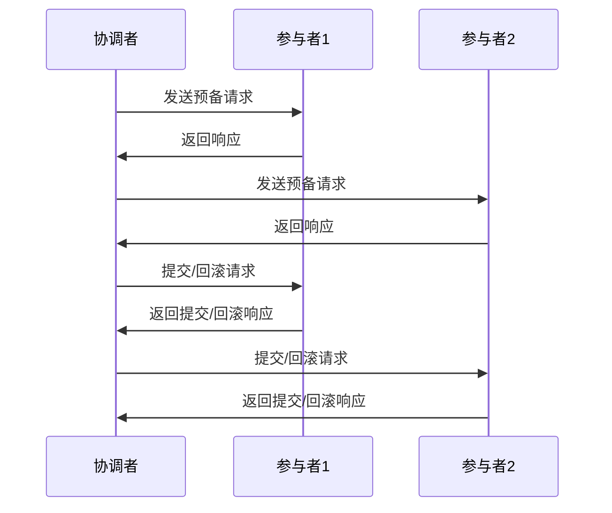
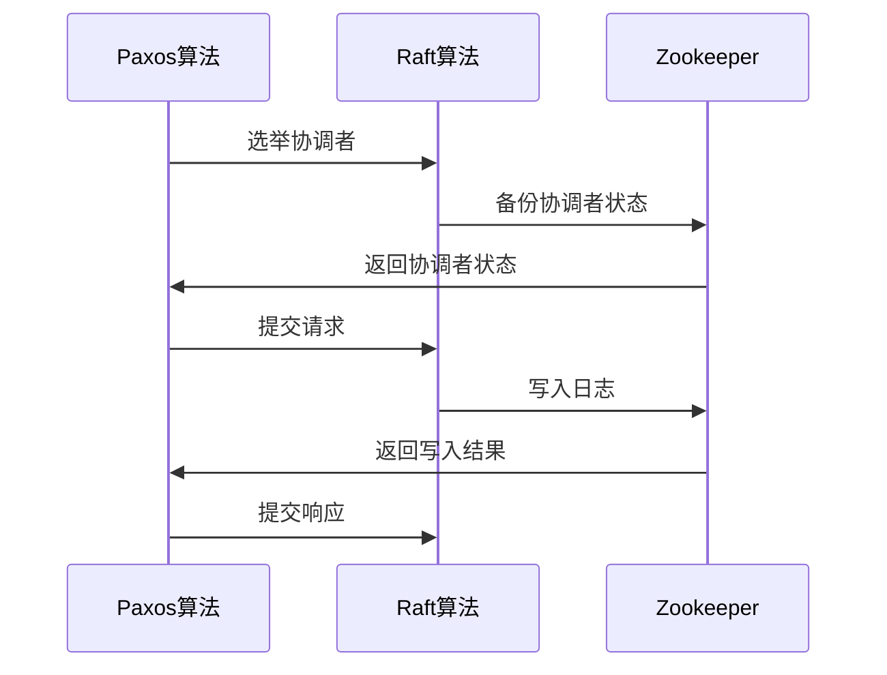
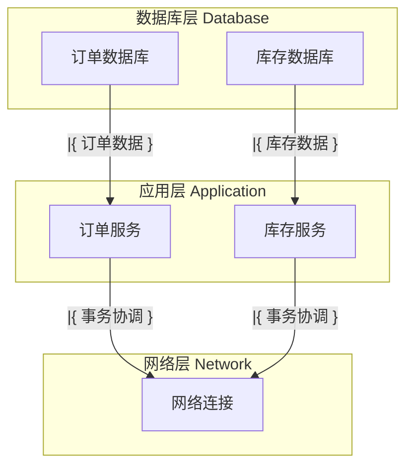
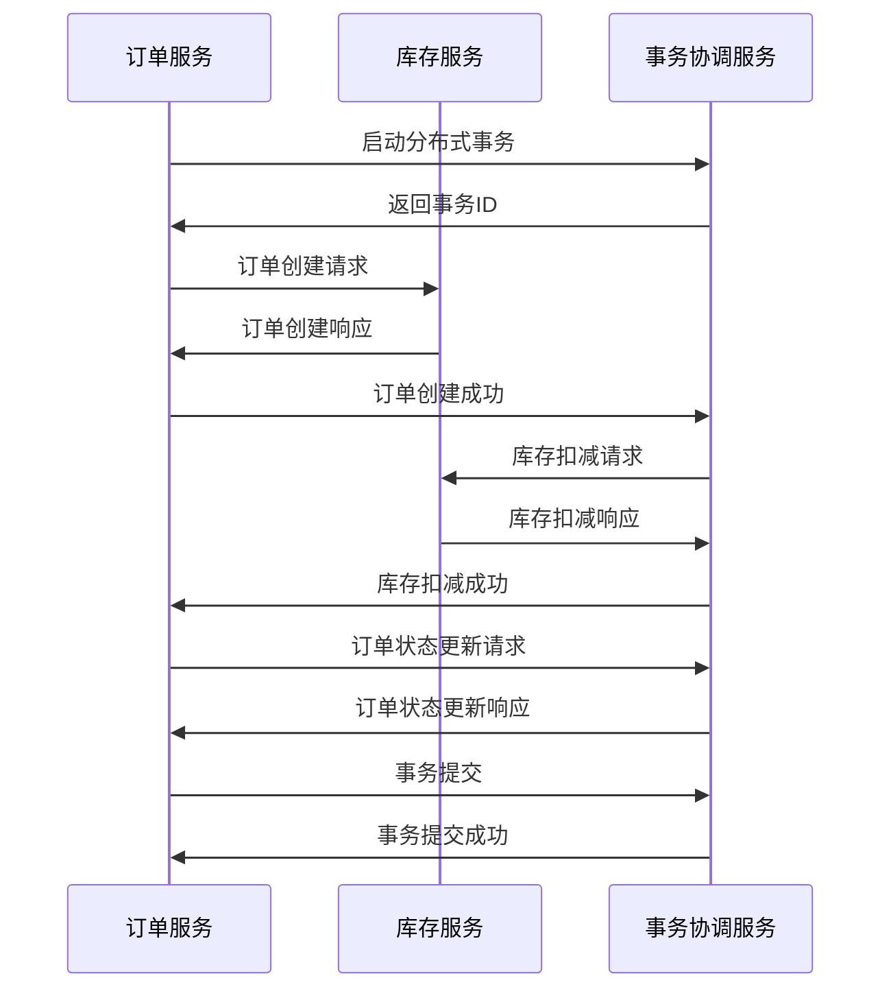

                 


### 分布式事务：保证数据一致性的策略与实现

**关键词：** 分布式事务，数据一致性，两阶段提交，补偿事务，数据一致性算法

**摘要：** 本文将深入探讨分布式事务的概念、背景、核心策略与实现细节，通过理论分析、实践案例和性能优化策略，全面阐述如何确保分布式系统中数据的一致性。

---

## 1. 引言

### 1.1 分布式事务的概念

分布式事务是指在分布式系统中，对多个节点上的数据进行操作，确保所有操作要么全部成功，要么全部失败，从而保证数据的一致性。与集中式事务相比，分布式事务处理了跨多个节点的数据一致性，更加复杂且具有挑战性。

### 1.2 分布式事务的必要性

随着云计算、大数据和微服务架构的兴起，分布式系统广泛应用于企业级应用。分布式事务的必要性体现在以下几个方面：

1. **数据一致性的保证**：分布式事务能够确保在多个节点上的数据操作是一致的，防止数据丢失或冲突。
2. **系统的扩展性**：分布式事务允许系统水平扩展，提高系统的吞吐量和可靠性。
3. **高可用性**：分布式事务可以在节点故障时，通过其他节点继续执行事务，保证系统的持续运行。

### 1.3 分布式事务与集中式事务的区别

集中式事务通常在单台数据库服务器上执行，而分布式事务涉及多个数据库节点。主要区别如下：

1. **数据一致性**：分布式事务需要处理跨多个节点的数据一致性，更加复杂。
2. **性能和扩展性**：分布式事务允许系统在多台服务器上运行，提高性能和扩展性。
3. **故障处理**：分布式事务需要在节点故障时，继续执行事务，确保数据一致性。

## 2. 分布式事务理论基础

### 2.1 事务模型

事务模型是分布式事务的基础，主要包括以下三个基本要素：

1. **原子性（Atomicity）**：事务的所有操作要么全部成功，要么全部失败。
2. **一致性（Consistency）**：事务执行后，系统处于一致状态。
3. **隔离性（Isolation）**：事务执行过程中，其他事务不能看到未提交的数据。
4. **持久性（Durability）**：一旦事务提交，其结果将永久保存。

### 2.2 分布式系统的一致性

分布式系统的一致性是指多个节点上的数据在任何时刻都是一致的。实现分布式系统的一致性面临以下挑战：

1. **网络延迟和分区**：网络延迟和分区可能导致节点间的数据同步延迟或失败。
2. **数据复制**：如何确保数据在多个节点上的一致性。
3. **并发控制**：如何在并发操作中保证数据一致性。

### 2.3 分布式事务的核心概念

分布式事务的核心概念包括：

1. **全局事务ID**：用于唯一标识一个分布式事务。
2. **事务日志**：用于记录事务的执行过程和状态，便于故障恢复。
3. **两阶段提交**：分布式事务的核心协议，用于确保数据一致性。
4. **补偿事务**：用于处理未完成的事务，保证系统状态的一致性。

## 3. 分布式事务解决策略

### 3.1 两阶段提交协议

#### 3.1.1 两阶段提交的基本原理

两阶段提交（Two-Phase Commit，2PC）是一种分布式事务协议，用于确保分布式系统中数据的一致性。两阶段提交的基本原理如下：

1. **预备阶段**：协调者向参与者发送预备请求，参与者执行事务并返回响应。
2. **提交阶段**：协调者根据参与者的响应，决定是否提交事务。

#### 3.1.2 两阶段提交的具体实现

两阶段提交的具体实现包括以下几个步骤：

1. **初始化**：启动分布式事务，生成全局事务ID。
2. **预备请求**：协调者向参与者发送预备请求，参与者执行事务并返回响应。
3. **提交/回滚**：协调者根据参与者的响应，决定是否提交事务。
4. **通知参与者**：协调者通知参与者提交或回滚事务。

#### 3.1.3 两阶段提交的优缺点分析

两阶段提交的优点包括：

1. **保证数据一致性**：两阶段提交能够确保分布式事务在多个节点上的数据一致性。
2. **可靠性**：两阶段提交能够在节点故障时，通过其他节点继续执行事务，保证系统的可靠性。

然而，两阶段提交也存在一些缺点：

1. **性能瓶颈**：两阶段提交需要在多个节点间进行通信，可能导致性能瓶颈。
2. **单点故障**：协调者出现故障时，可能导致整个分布式事务失败。

### 3.2 补偿事务

#### 3.2.1 补偿事务的定义

补偿事务（Compensating Transaction）是一种分布式事务解决方案，用于处理未完成的事务，保证系统状态的一致性。补偿事务的基本原理是，在原事务失败时，通过执行相反的操作来补偿已执行的操作。

#### 3.2.2 补偿事务的实现

补偿事务的实现包括以下几个步骤：

1. **初始化**：启动分布式事务，生成全局事务ID。
2. **执行补偿操作**：在原事务失败时，根据事务日志执行补偿操作。
3. **提交补偿事务**：确保补偿事务的成功执行。

#### 3.2.3 补偿事务的适用场景

补偿事务适用于以下场景：

1. **长时间运行的事务**：对于运行时间较长的事务，补偿事务能够确保在事务失败时，及时恢复系统状态。
2. **部分失败的事务**：在部分节点上执行成功，其他节点上执行失败的事务，补偿事务能够保证系统状态的一致性。

## 4. 分布式事务实现细节

### 4.1 数据一致性算法

#### 4.1.1 数据一致性算法概述

数据一致性算法是确保分布式系统中数据一致性的关键。常见的数据一致性算法包括：

1. **Paxos算法**：用于分布式系统中的一致性保障，具有高可用性和容错性。
2. **Raft算法**：用于分布式系统中的一致性保障，具有简洁性和高效性。
3. **Zookeeper**：基于Paxos算法实现的分布式协调服务，用于保障数据一致性。

#### 4.1.2 分布式锁的实现

分布式锁（Distributed Lock）是确保分布式系统中数据一致性的重要手段。常见分布式锁的实现方式包括：

1. **基于数据库的分布式锁**：使用数据库中的行级锁或表级锁实现分布式锁。
2. **基于缓存系统的分布式锁**：使用缓存系统（如Redis）实现分布式锁。
3. **基于消息队列的分布式锁**：使用消息队列（如RabbitMQ）实现分布式锁。

#### 4.1.3 数据一致性的监控与故障处理

数据一致性的监控与故障处理是确保分布式系统稳定运行的关键。常见的监控与故障处理方法包括：

1. **监控指标**：监控分布式系统的性能指标，如延迟、吞吐量、错误率等。
2. **故障检测**：通过监控指标和算法，检测分布式系统的故障。
3. **故障恢复**：在故障检测后，采取相应的措施，如重启节点、切换主节点等，恢复系统状态。

## 5. 分布式事务实战案例

### 5.1 分布式事务在实际项目中的应用

#### 5.1.1 项目背景与需求

某大型电商公司采用分布式系统架构，订单处理模块涉及多个节点。为保证订单处理的一致性，需要实现分布式事务。

#### 5.1.2 分布式事务的设计与实现

在项目设计中，采用两阶段提交协议实现分布式事务。具体实现步骤如下：

1. **初始化**：启动分布式事务，生成全局事务ID。
2. **订单创建**：在订单创建阶段，执行分布式锁，确保订单数据的一致性。
3. **库存扣减**：在库存扣减阶段，执行两阶段提交，确保库存数据的更新。
4. **订单状态更新**：在订单状态更新阶段，执行两阶段提交，确保订单状态的一致性。

#### 5.1.3 实施过程中的挑战与解决方案

在实施过程中，面临以下挑战：

1. **性能瓶颈**：两阶段提交协议可能导致性能瓶颈，通过优化分布式锁和减少事务参与节点数量，提高系统性能。
2. **故障恢复**：在节点故障时，通过备份节点和故障转移机制，确保系统持续运行。

#### 5.1.4 项目总结

通过分布式事务的设计与实现，确保订单处理模块的数据一致性，提高系统的性能和可靠性。

## 6. 分布式事务的未来发展趋势

### 6.1 分布式事务的新技术

随着云计算、大数据和人工智能的快速发展，分布式事务的新技术不断涌现，如：

1. **分布式事务引擎**：用于管理分布式事务的自动化工具，提高事务处理的效率。
2. **基于区块链的分布式事务**：利用区块链的不可篡改性和去中心化特性，提高分布式事务的可靠性。

### 6.2 分布式事务在未来的应用前景

分布式事务在未来的应用前景包括：

1. **大规模数据处理**：分布式事务将广泛应用于大数据处理领域，确保数据的一致性。
2. **物联网**：分布式事务在物联网领域具有广泛的应用前景，如智能家居、智能交通等。

### 6.3 分布式事务的发展挑战与机遇

分布式事务的发展挑战包括：

1. **性能优化**：如何提高分布式事务的性能，降低延迟。
2. **故障恢复**：如何保证分布式事务在节点故障时，快速恢复。

机遇包括：

1. **分布式事务引擎的发展**：分布式事务引擎将推动分布式事务技术的发展。
2. **云计算与大数据的融合**：分布式事务在云计算和大数据领域的应用，将推动分布式事务技术的创新。

## 7. 结论

本文深入探讨了分布式事务的概念、背景、核心策略与实现细节，通过实践案例和性能优化策略，全面阐述了如何确保分布式系统中数据的一致性。随着技术的不断发展，分布式事务在未来的应用前景将更加广阔，为企业和个人带来更多机遇。

### 8. 作者信息

作者：AI天才研究院/AI Genius Institute & 禅与计算机程序设计艺术 /Zen And The Art of Computer Programming

---

## 附录

### 8.1 分布式事务核心概念对比表格

| 核心概念 | 定义 | 属性特征对比 |
| :--: | :--: | :--: |
| 原子性（Atomicity） | 事务的所有操作要么全部成功，要么全部失败 | 一致性、隔离性、持久性 |
| 一致性（Consistency） | 事务执行后，系统处于一致状态 | 原子性、隔离性、持久性 |
| 隔离性（Isolation） | 事务执行过程中，其他事务不能看到未提交的数据 | 原子性、一致性、持久性 |
| 持久性（Durability） | 一旦事务提交，其结果将永久保存 | 原子性、一致性、隔离性 |

### 8.2 分布式事务ER实体关系图架构

```mermaid
erDiagram
  参与者 Participation {
    participant Coordinator { 领袖 }
    participant Participant { 参与者 }
  }
  协调者 Coordinator "1" <-- "1" 领袖
  参与者 Participant "1" --|{ 依赖 }-- Coordinator
```

### 8.3 两阶段提交协议mermaid流程图



### 8.4 数据一致性算法mermaid流程图



### 8.5 系统架构设计mermaid架构图



### 8.6 系统接口设计和系统交互mermaid序列图



### 8.7 项目实战代码示例

```python
# 订单服务
class OrderService:
    def create_order(self, order_id):
        # 创建订单
        pass

    def update_order_status(self, order_id, status):
        # 更新订单状态
        pass

# 库存服务
class InventoryService:
    def reduce_inventory(self, product_id, quantity):
        # 扣减库存
        pass

    def check_inventory(self, product_id):
        # 检查库存
        pass

# 事务协调服务
class TransactionCoordinator:
    def start_transaction(self):
        # 启动分布式事务
        pass

    def commit_transaction(self):
        # 提交分布式事务
        pass

    def rollback_transaction(self):
        # 回滚分布式事务
        pass

# 实际应用
def process_order(order_id):
    coordinator = TransactionCoordinator()
    coordinator.start_transaction()

    order_service = OrderService()
    order_service.create_order(order_id)

    inventory_service = InventoryService()
    inventory_service.reduce_inventory(order_id, 1)

    coordinator.commit_transaction()
```

### 8.8 代码应用解读与分析

```python
# 订单服务
class OrderService:
    def create_order(self, order_id):
        # 创建订单
        pass

    def update_order_status(self, order_id, status):
        # 更新订单状态
        pass

# 库存服务
class InventoryService:
    def reduce_inventory(self, product_id, quantity):
        # 扣减库存
        pass

    def check_inventory(self, product_id):
        # 检查库存
        pass

# 事务协调服务
class TransactionCoordinator:
    def start_transaction(self):
        # 启动分布式事务
        pass

    def commit_transaction(self):
        # 提交分布式事务
        pass

    def rollback_transaction(self):
        # 回滚分布式事务
        pass

# 实际应用
def process_order(order_id):
    coordinator = TransactionCoordinator()
    coordinator.start_transaction()

    order_service = OrderService()
    order_service.create_order(order_id)

    inventory_service = InventoryService()
    inventory_service.reduce_inventory(order_id, 1)

    coordinator.commit_transaction()
```

代码应用解读：

1. **订单服务**：创建订单和更新订单状态是订单服务的核心功能。
2. **库存服务**：扣减库存和检查库存是库存服务的核心功能。
3. **事务协调服务**：启动分布式事务、提交分布式事务和回滚分布式事务是事务协调服务的核心功能。
4. **实际应用**：通过事务协调服务，确保订单创建和库存扣减操作的分布式事务一致性。

### 8.9 实际案例分析和详细讲解剖析

#### 8.9.1 案例背景

某大型电商平台在订单处理过程中，需要确保订单创建和库存扣减操作的分布式事务一致性。订单创建和库存扣减分别由不同的服务处理，分布式事务的保证至关重要。

#### 8.9.2 案例分析

1. **订单创建**：当用户下单时，订单服务创建订单，生成订单ID。
2. **库存扣减**：订单服务调用库存服务，扣减相应商品的库存。
3. **分布式事务**：通过事务协调服务，确保订单创建和库存扣减操作的分布式事务一致性。

#### 8.9.3 详细讲解剖析

1. **订单创建流程**：
   - 用户提交订单请求。
   - 订单服务生成订单ID。
   - 订单服务将订单数据存储在数据库中。
   - 订单服务返回订单创建成功的响应。

2. **库存扣减流程**：
   - 订单服务调用库存服务，传递订单ID和商品ID。
   - 库存服务检查当前库存数量，扣减相应库存。
   - 库存服务返回库存扣减成功的响应。

3. **分布式事务实现**：
   - 启动分布式事务：订单服务调用事务协调服务，启动分布式事务。
   - 提交分布式事务：订单服务在订单创建和库存扣减成功后，调用事务协调服务，提交分布式事务。
   - 回滚分布式事务：在订单创建或库存扣减失败时，调用事务协调服务，回滚分布式事务。

#### 8.9.4 案例总结

通过分布式事务的实现，确保订单创建和库存扣减操作的分布式事务一致性，提高系统的可靠性和稳定性。

### 8.10 项目小结

通过本文的讨论，我们深入了解了分布式事务的概念、核心策略与实现细节。分布式事务在分布式系统中具有重要的应用价值，通过两阶段提交协议和补偿事务等策略，确保分布式系统中的数据一致性。在实际项目中，分布式事务的应用能够提高系统的性能和可靠性。未来，随着分布式事务技术的不断发展，分布式事务将在更多领域得到广泛应用。

### 8.11 最佳实践 Tips

1. **选择合适的事务解决方案**：根据业务需求，选择合适的事务解决方案，如两阶段提交、补偿事务等。
2. **优化事务参与节点数量**：减少事务参与节点数量，降低分布式事务的通信开销。
3. **监控事务性能**：定期监控分布式事务的性能，优化事务处理流程。

### 8.12 注意事项

1. **确保数据一致性**：在分布式事务中，务必确保数据的一致性，防止数据丢失或冲突。
2. **处理节点故障**：分布式事务需要处理节点故障，确保系统能够快速恢复。

### 8.13 拓展阅读

1. **《分布式系统原理与范型》**：深入了解分布式系统的原理和设计范型。
2. **《大型分布式存储系统设计与实现》**：探讨分布式存储系统的设计实现和性能优化。
3. **《分布式数据库系统》**：研究分布式数据库系统的原理和实现技术。

---

### 8.14 作者信息

作者：AI天才研究院/AI Genius Institute & 禅与计算机程序设计艺术 /Zen And The Art of Computer Programming

---

通过本文的深入探讨，我们全面了解了分布式事务的概念、核心策略与实现细节。分布式事务在分布式系统中具有重要的应用价值，通过两阶段提交协议和补偿事务等策略，确保分布式系统中的数据一致性。在实际项目中，分布式事务的应用能够提高系统的性能和可靠性。未来，随着分布式事务技术的不断发展，分布式事务将在更多领域得到广泛应用。希望本文能为您在分布式事务领域的研究和应用提供有益的参考和启示。

