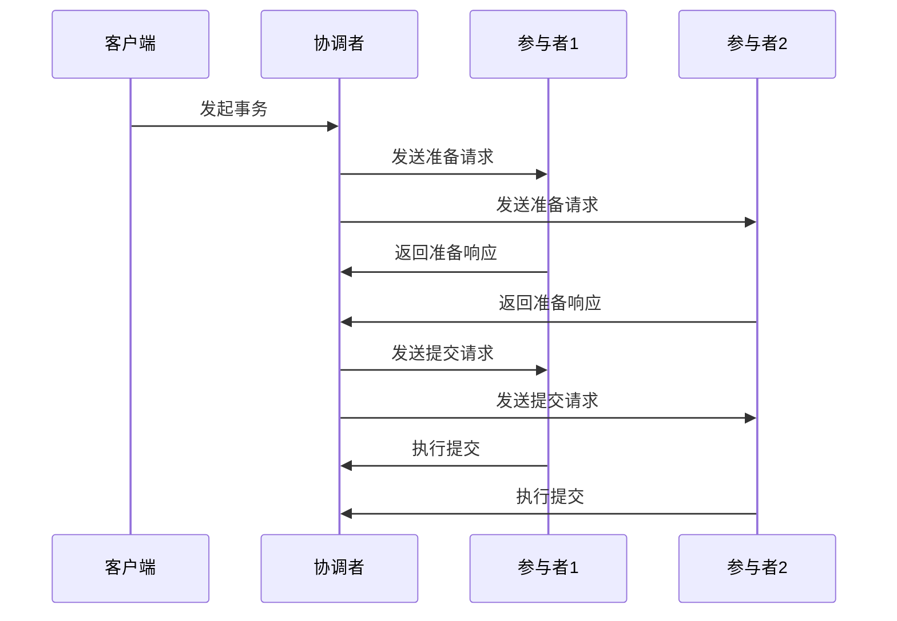
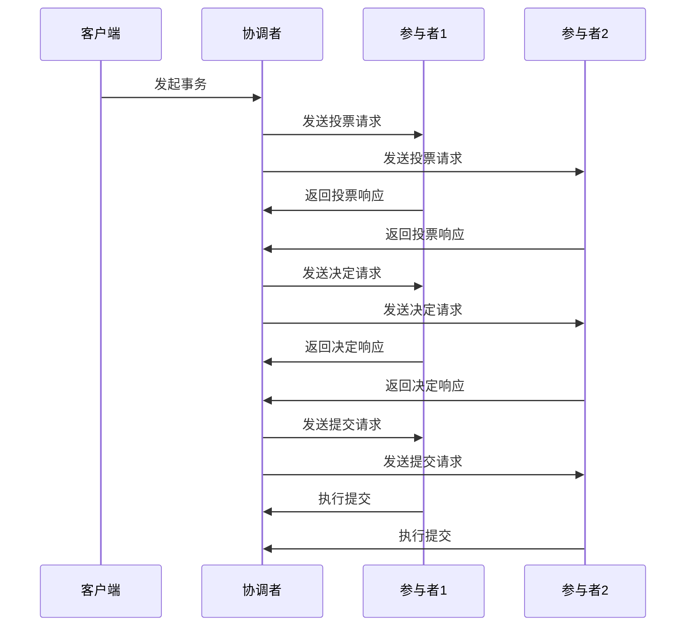
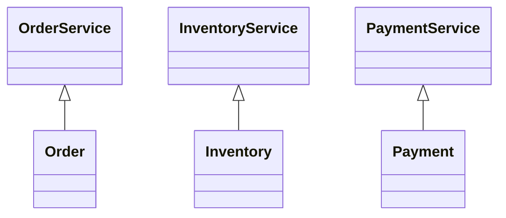
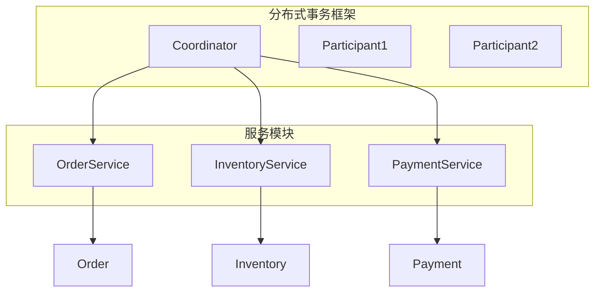
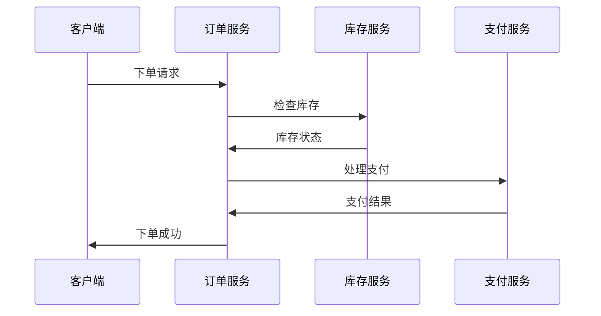

                 


### 分布式事务解决方案对比

#### 一、背景介绍

**1. 问题背景**

在分布式系统中，事务是一组操作序列，这些操作要么全部成功执行，要么全部不执行。与传统单机系统相比，分布式系统具有更高的可用性和可扩展性，但也面临着更大的挑战。首先，分布式系统中的数据可能分布在多个节点上，这意味着事务需要跨节点执行。其次，网络延迟和节点故障是分布式系统中常见的现象，这可能导致事务的执行变得不可预测。因此，如何在分布式系统中保证事务的一致性成为了一个重要问题。

**2. 问题描述**

分布式事务的一致性问题是确保系统在执行事务后，数据能够保持合法状态，满足业务规则和约束。具体来说，分布式事务需要解决以下问题：

- 如何保证多个节点上的数据在执行事务时保持一致性？
- 如何处理网络延迟和节点故障导致的事务执行异常？
- 如何在保证事务一致性的同时，提高系统的可用性和性能？

**3. 问题解决**

分布式事务的解决方案有多种，包括两阶段提交（2PC）、三阶段提交（3PC）、最终一致性、补偿事务等。每种方案都有其优缺点，适用于不同的场景和需求。通过对这些解决方案进行对比分析，可以找到最适合特定业务场景的分布式事务解决方案。

**4. 边界与外延**

分布式事务的边界包括系统内部事务的一致性保障、跨系统事务的一致性保障，以及不同分布式系统之间的事务一致性保障。外延包括分布式事务在金融、电商、物联网等领域的应用，以及如何与其他系统架构设计（如微服务、云计算等）相结合。

**5. 概念结构与核心要素组成**

分布式事务的核心概念包括事务、一致性、可用性、分区容错性等。核心要素组成包括事务管理器、资源管理器、消息队列、分布式锁等。

#### 二、核心概念与联系

**1. 核心概念**

**（1）事务**

事务是一组操作序列，这些操作要么全部执行，要么全部不执行。事务具有原子性、一致性、隔离性和持久性（ACID）特点。

- **原子性**：事务中的所有操作在数据库中要么全部成功执行，要么全部不执行。
- **一致性**：事务执行前后，数据库中的数据应保持合法状态，满足业务规则和约束。
- **隔离性**：事务在执行过程中应相互隔离，避免并发操作之间的干扰。
- **持久性**：事务一旦提交，对数据库的修改应永久保存，即使系统发生故障也不受影响。

**（2）一致性**

一致性是指系统在执行事务后，数据应保持合法状态，满足业务规则和约束。一致性是分布式事务的核心目标。

**（3）可用性**

可用性是指系统在正常和异常情况下都能响应请求，确保服务的持续可用。在分布式系统中，可用性是保证事务处理能力的重要指标。

**（4）分区容错性**

分区容错性是指系统在部分节点故障时，仍能保持整体可用性，确保分布式系统的高可用性。分区容错性是分布式系统设计中至关重要的一环。

**2. 概念属性特征对比表格**

| 概念 | 特性 |
| --- | --- |
| 事务 | 原子性、一致性、隔离性、持久性 |
| 一致性 | 数据合法、满足业务规则 |
| 可用性 | 系统响应、持续可用 |
| 分区容错性 | 节点故障、整体可用 |

**3. ER实体关系图架构**

```mermaid
erDiagram
  Transaction ||--|{ Resource } Resource : "holds"
  Resource ||--|{ Participant } Participant : "uses"
  Participant ||--|{ Node } Node : "located on"
  Node ||--|{ TransactionManager } TransactionManager : "manages"
```

#### 三、算法原理讲解

**1. 两阶段提交（2PC）**

两阶段提交（2PC）是一种常见的分布式事务解决方案，通过协调者和参与者之间的通信，确保事务的一致性。

**（1）算法原理**

两阶段提交算法分为准备阶段和提交阶段：

- **准备阶段**：协调者向参与者发送准备请求，参与者返回准备响应。
- **提交阶段**：协调者根据参与者的准备响应决定是否提交事务，并发送提交或回滚请求给参与者。

**（2）流程图**



**（3）Python代码实现**

```python
class Coordinator:
    def prepare(self, participants):
        for participant in participants:
            participant.prepare()

    def commit(self, participants):
        for participant in participants:
            participant.commit()

class Participant:
    def prepare(self):
        # 处理准备逻辑
        pass

    def commit(self):
        # 处理提交逻辑
        pass

# 实例化协调者和参与者
coordinator = Coordinator()
participants = [Participant() for _ in range(2)]

# 发起事务
coordinator.prepare(participants)
coordinator.commit(participants)
```

**2. 三阶段提交（3PC）**

三阶段提交（3PC）是对两阶段提交的改进，旨在解决在协调者故障时的一致性问题。

**（1）算法原理**

三阶段提交算法分为投票阶段、决定阶段和提交阶段：

- **投票阶段**：协调者向参与者发送投票请求，参与者返回投票响应。
- **决定阶段**：协调者根据参与者的投票响应决定是否提交事务。
- **提交阶段**：协调者根据决定阶段的结果，向参与者发送提交或回滚请求。

**（2）流程图**



**（3）Python代码实现**

```python
class Coordinator:
    def vote(self, participants):
        for participant in participants:
            participant.vote()

    def decide(self, participants, majority):
        for participant in participants:
            participant.decide(majority)

    def commit(self, participants):
        for participant in participants:
            participant.commit()

class Participant:
    def vote(self):
        # 处理投票逻辑
        pass

    def decide(self, majority):
        # 处理决定逻辑
        pass

    def commit(self):
        # 处理提交逻辑
        pass

# 实例化协调者和参与者
coordinator = Coordinator()
participants = [Participant() for _ in range(2)]

# 发起事务
coordinator.vote(participants)
coordinator.decide(participants, majority=True)
coordinator.commit(participants)
```

#### 四、系统分析与架构设计方案

**1. 问题场景介绍**

假设有一个电商系统，包含订单服务、库存服务、支付服务等多个微服务。当用户下单时，订单服务需要更新库存信息并生成订单，支付服务需要处理支付请求。为了保证数据的一致性，需要实现分布式事务。

**2. 项目介绍**

项目名称：分布式事务电商系统

项目目标：实现订单服务、库存服务、支付服务之间的分布式事务处理，确保数据一致性。

**3. 系统功能设计（领域模型类图）**



**4. 系统架构设计（架构图）**



**5. 系统接口设计和系统交互（序列图）**



#### 五、项目实战

**1. 环境安装**

- 安装Python环境（3.8及以上版本）
- 安装分布式事务框架（如Seata、TCC等）
- 安装微服务框架（如Spring Boot、Django等）

**2. 系统核心实现源代码**

```python
# 协调者实现
class Coordinator:
    def prepare(self, participants):
        for participant in participants:
            participant.prepare()

    def commit(self, participants):
        for participant in participants:
            participant.commit()

# 参与者实现
class Participant:
    def prepare(self):
        # 处理准备逻辑
        pass

    def commit(self):
        # 处理提交逻辑
        pass

# 订单服务实现
class OrderService:
    def create_order(self, order_data):
        # 创建订单逻辑
        pass

# 库存服务实现
class InventoryService:
    def check_inventory(self, product_id):
        # 检查库存逻辑
        pass

# 支付服务实现
class PaymentService:
    def process_payment(self, payment_data):
        # 处理支付逻辑
        pass
```

**3. 代码应用解读与分析**

- 协调者负责协调参与者之间的通信，确保事务的一致性。
- 参与者负责执行具体的业务操作，并响应协调者的请求。
- 订单服务、库存服务、支付服务负责具体的业务逻辑处理。

**4. 实际案例分析和详细讲解剖析**

假设用户下单购买一个商品，系统需要执行以下操作：

1. 订单服务创建订单。
2. 库存服务检查库存并更新库存。
3. 支付服务处理支付并更新订单状态。

通过分布式事务框架，可以确保这三个操作要么全部成功执行，要么全部不执行。具体实现过程如下：

1. 用户发起下单请求，订单服务创建订单并调用协调者发起分布式事务。
2. 协调者向库存服务和支付服务发送准备请求，等待参与者返回准备响应。
3. 库存服务检查库存并返回准备响应，支付服务处理支付并返回准备响应。
4. 协调者根据参与者的准备响应决定是否提交事务。
5. 协调者向参与者发送提交请求，参与者执行提交操作并返回提交响应。
6. 协调者根据参与者的提交响应决定是否成功提交事务。

通过这种方式，分布式事务可以确保订单服务、库存服务、支付服务之间的数据一致性。

**5. 项目小结**

分布式事务在电商系统中具有重要意义，可以确保订单、库存、支付等操作的一致性。通过使用分布式事务框架，可以实现跨节点的分布式事务处理，提高系统的可靠性和性能。在实际项目中，需要根据业务需求和系统架构选择合适的分布式事务解决方案。

### 六、最佳实践 tips、小结、注意事项、拓展阅读等内容

**最佳实践 tips：**

- 选择合适的分布式事务框架：根据业务需求和系统架构选择适合的分布式事务框架，如Seata、TCC等。
- 优化网络通信：减少网络通信的开销，提高事务处理性能。
- 模拟异常场景：进行故障模拟和性能测试，确保分布式事务在异常情况下的可靠性和稳定性。

**小结：**

本文对分布式事务的解决方案进行了深入分析和对比，包括两阶段提交（2PC）、三阶段提交（3PC）、最终一致性、补偿事务等。通过了解这些解决方案的原理和适用场景，可以更好地设计和实现分布式系统中的事务处理。

**注意事项：**

- 分布式事务的一致性保障是一个复杂的问题，需要综合考虑系统的可用性、性能和可靠性。
- 选择分布式事务解决方案时，需要根据业务需求和系统架构进行权衡和优化。
- 在实际项目中，分布式事务的实现和调试可能需要耗费大量时间和精力，需要具备一定的技术积累和实践经验。

**拓展阅读：**

- 《分布式系统设计》
- 《大规模分布式存储系统设计与实践》
- 《微服务架构设计模式》
- 《分布式事务与一致性》

作者：AI天才研究院/AI Genius Institute & 禅与计算机程序设计艺术 /Zen And The Art of Computer Programming

